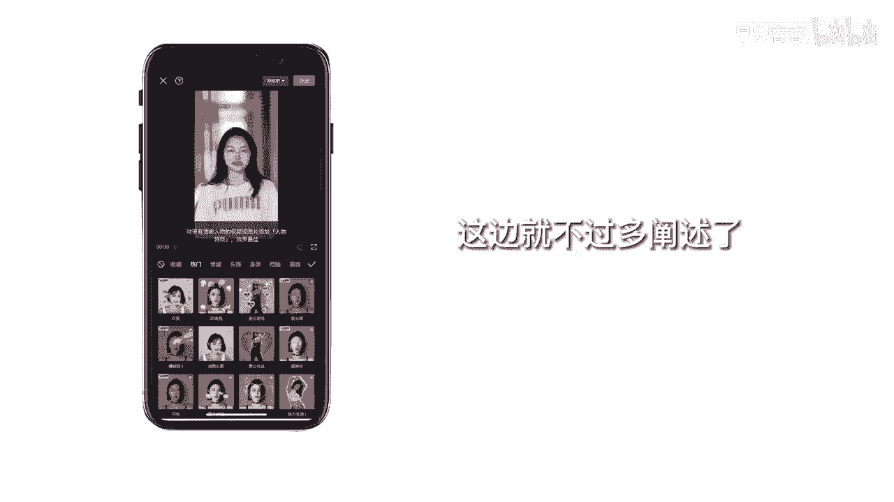

# 045 服装行业流量爆发营，从0-1抖音快速起号解决实体流量问题！ - P62：62 - 62画面特效 .mp4- - 早安睿睿 - BV1Kf421R7NA

你的画面是不是总感觉很平淡，没有生气，本奖应该能帮助到你，今天我们来讲讲如何给画面增加特效，还是一样，我们先打开剪映，导入一段人物的素材，在功能栏中找到特效，这里能看到两个功能，一个是画面特效。

一个是人物特效，我们先来讲讲画面特效，这里有很多app自带的特效可以选择，看一下好，我们随便点一个就能看到它预览的效果，再点一下就能调整它的一些参数，等调到你最满意的画面之后。

点确认效果就会成作为一个效果图层，放在了轨道上，点击效果图层，拖动图层的尾端，就能改变图层的长短点，效果图层我还能看到它的功能栏，它还可以直接替换成其他的素材嗯，还是很方便的。

同理人物特效的使用方式也是一样的。

