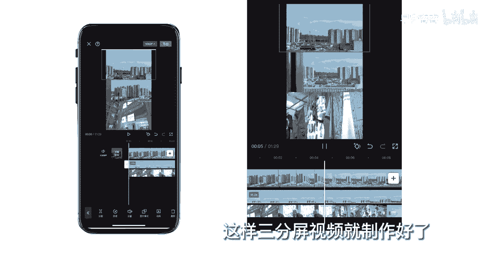

# 045 服装行业流量爆发营，从0-1抖音快速起号解决实体流量问题！ - P63：63 - 63.画中画.3 .mp4- - 早安睿睿 - BV1Kf421R7NA

打开剪映导入素材，在功能栏里找到画中画，点击新增画中画，就可以在主轨道下方添加视频或图片啊，这边注意一下，手指在预览区按住移动就是拖动，捏合分开就是缩放，画中画素材可以在预览窗口任意缩放和移动。

剪映是最多支持六个画中画主轨，一个，其他轨道六个，接下来添加第二个画中画素材，将它移动到右边，当有多个画中画素材时，素材层级越高，画画面越在前面的位置，点击层级可以更改画中画素材的层级，点确认退出点。

切主轨，可以将画中画素材移动到主轨上面，这里我示范一个三分屏视频制作点开始创作，导入一个素材，点击比例为九比16点，返回点画中画，新增画中画，添加到项目同上，再添加一个，然后移动画中画素材。

让三个视频各占画面的1/3预览，这样三分屏视频就制作好了。

接下来我们再演示一个，用画中画给视频添加光斑的效果，同上，先导入一段视频，然后点击画中画，新增画中画，在最上面有一个素材库，搜光斑，选择一段你觉得比较合适的光斑素材，添加点混合模式，选择绿色。

这样就搞定了。

