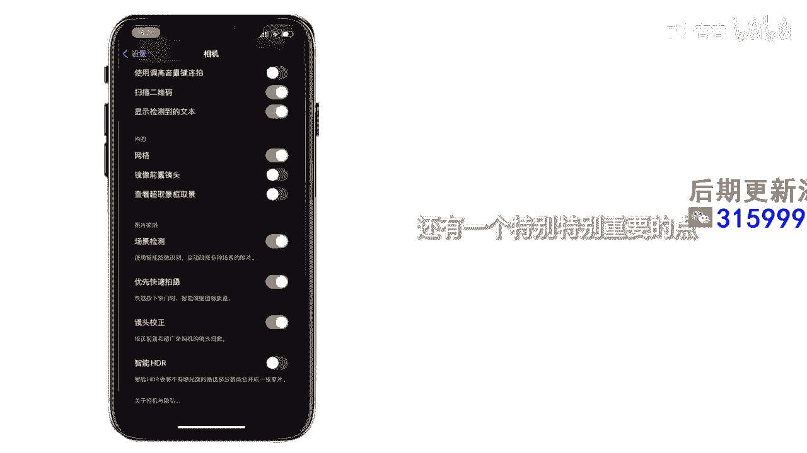
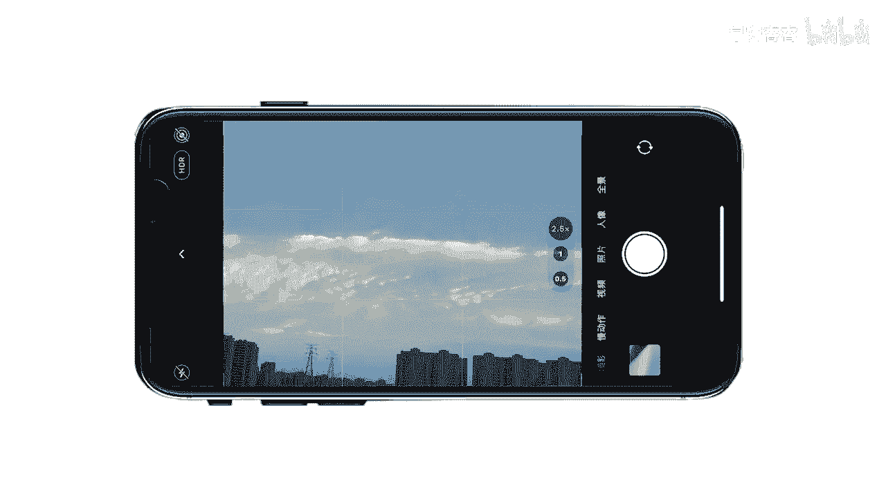

# 045 服装行业流量爆发营，从0-1抖音快速起号解决实体流量问题！ - P65：65 - 65拍摄更清晰 .mp4- - 早安睿睿 - BV1Kf421R7NA

要想用手机拍摄清晰，核心在于你的灯光和你的参数设置，我先告诉大家参数如何设置，我们点设置向下拉，找到相机在格式里设置一下，找到兼容性最佳，OK返回，然后点录制视频，选1080P60FPS。

然后我们点网格打开，这样我们可以更方便的构图，把场景监测打开，如果我们要拍摄人像的话，HDR一定要关闭，不然的话皮肤会变得很差，但如果我们要拍风景的时候，建议可以把HDR打开，还有一个特别特别重要的点。

一定一定要把镜头擦干净。

