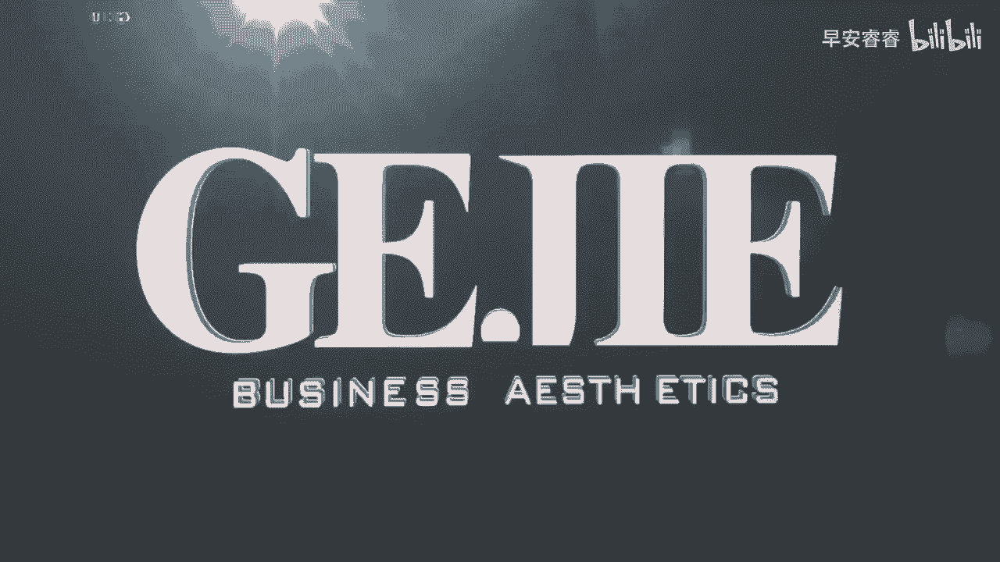
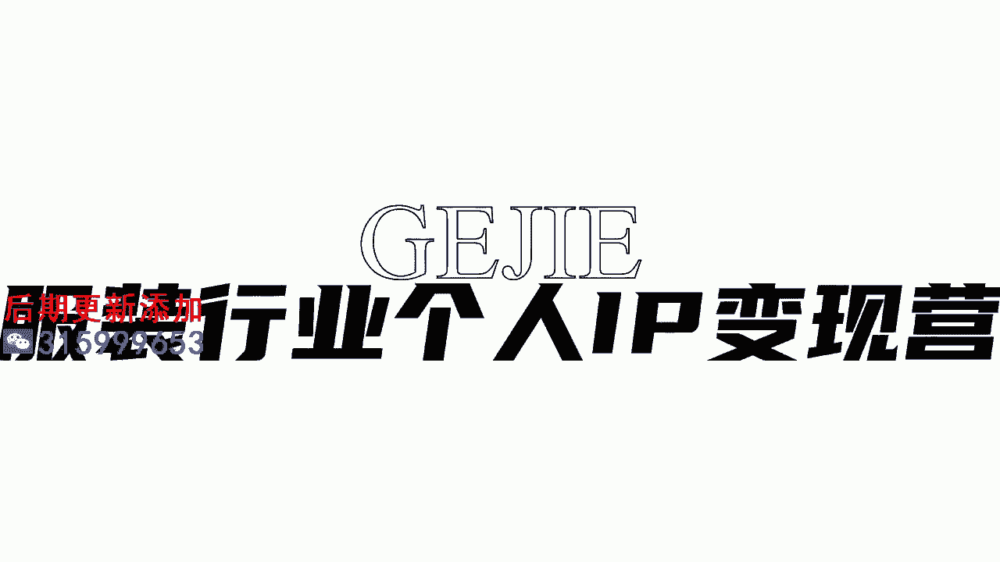
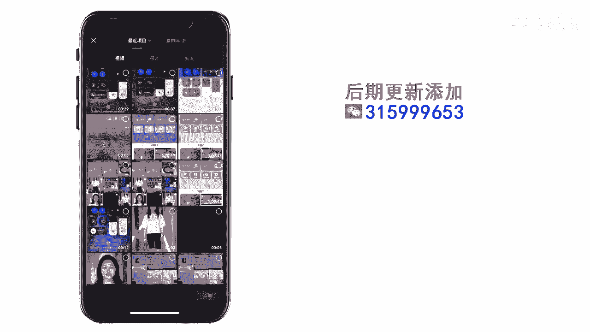
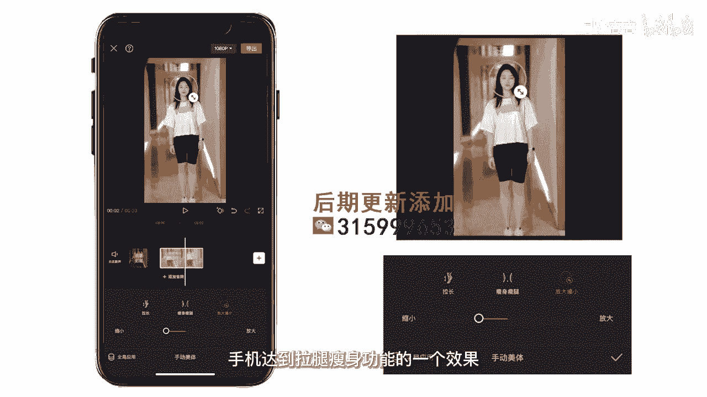

# 045 服装行业流量爆发营，从0-1抖音快速起号解决实体流量问题！ - P8：8 - 8 显高显瘦p图技巧 .mp4- - 早安睿睿 - BV1Kf421R7NA

这节课呢我来给大家解决一个非常非常实用的，但是有很多人，他在这里面一直都解决不了的问题，就是我们作为服装人啊，我们在美感和视觉的呈现上，一定是要有一定的要求和质感的，对不对。

但是我会发现我们有非常多的这个服装人，他做出来的这个账号，首先第一个要么就是他那个美颜啊，把整张脸美的实在是太过了，一看她就非常的不真实，你要知道我们呢大部分做服装的，如果你的模特是女性。

你想吸引过来的也是女性啊，你把自己磨得那么的不真实，你出来的肯定粉丝可能会男粉居多，而且是色粉居多，所以首先第一步我们如何能够去操作，后期出来一个非常清晰，但是让人看起来很真实的一个美颜效果。

那么在这里面呢，只需要通过我们的手机的一个工具就能够执行，那么接下来呢，我会让我们非常专业的后期剪辑师，来给大家亲自手把手一个一个步骤的教会你，怎么样在手机上通过一个软件美图秀秀。

进而去实现一个高清的轻松的视频的，人脸的美颜呈现好镜头跟到我们的实操上来，今天我们要用到的app就是美图秀秀，首先我们打开美图秀秀，最后这里有一个视频内容，点击视频内容，我们导入一段预先拍摄好的素材。

点击编辑，你可以理解为视频P任意一张图片，这个视频会自动渲染成为一段美颜后的视频，所以非常简单啊，这里如果你比较懒的话，你可以点一键美颜，然后这里有各种各样的一个效果，但是我不是很建议大家用这样的效果。

当然今天我教大家的是，根据你客户或者你自己的五官来精细化的调节，首先我们调节的是五官，点这个精致五官，这里有些模板大家可以用，如果你是圆脸的话，就点这个圆脸专用圆脸，方脸长脸短脸都可以，我们选一个圆脸。

然后我们继续调节面部，就跟我们平时P图一样啊，我们可以给他窄脸这版短点，这个整个脸缩短一点，然后把额头向下一点，你是不是小了，太阳穴小一点，嗯可以放大，然后精细化的调节一下，眼距往回收一点，然鼻子。

然后鼻子精致一点，你前后对比一下，是不是好很多好，我们介绍一个最王炸的功能啊，就是我们的手动瘦脸，通过我们的手动瘦脸，我们可以进行更精细化的调节啊，例如我们可以自己对这个小姐姐的眼睛，做一个放大瞳孔。

然后鼻子这块你们也可以进行调节，我们只要不停的推推回来，变化还是明显的，然后嘴巴，可塑性非常的强，不满意就可以点撤回，然后重新调节，眉毛我们也可以进行一些修改，眉形稍微精细一点。

就五官你不太满意的地方都可以进行一些调节，完成初步调节之后，再看这个身材，美型里面可以将头部缩小一点，OK然后我们再回到美颜里面，可以把遮瑕美白多开一点，清晰度可以开一点，但不要开太大。

我建议大家不要超过40，好清晰很多，最后我们还可以给小姐姐上一个美妆，如果你要偷懒的话，可以上这种套装，当然我们也可以单独去选择，各种各样精细化的修容，给小姐上一个自然就挺好的，然后音量再调节一下。

然后口红点一个日系，大家注意啊，如果你想要高级感的话，所有的滤镜也好，调整也好，我们一定要少量多次，大家一定要记住少量多次这个概念好，我们来看一下效果，整个的话它会自动捕捉到所有的调整。

然后我们这样一个美颜就完成了，大家有没有学会呢，好你看就是这么简单，其实它跟我们修图的很多原理是一模一样的，对不对，但是有很多人他不知道该如何去进行操作，导致了他去使用在抖音上，一些非常酷的滤镜出来。

这个质感就不行了，好那么在服装人的这个领域里面，除了去呈现出一个好看的面部，还有一个点非常影响你的衣服的呈现，就是你的身高的比例，你这个人能不能达到显瘦显高，以及就是我们比如说呃店主本人出镜也好。

或者是店里的小姐姐出镜也好，她的身材不一定那么的完美对吗，一定是要对她的身形进行一个调整，这样子才能达到服装非常好的一个呈现，还有一个类型的视频是服装人必拍的，就是我们的形象改造的一个视频。

那么改造你前后肯定是要去呈现出一个，视觉上的穿搭的强烈对比对吗，所以这个时候也需要我们有一套非常熟练的，一个对身形调整的操作工具，来帮助你更好的去呈现服装的效果，那么我们也有请我们的剪辑师。

来一步一步的教大家，怎么去优化身形的一个后期动作，来镜头跟到我们的实操，今天来教大家如何通过手机进行长腿瘦腿，瘦身的功能，我们用的app是剪映点开始创作。

导入一段之前拍好的全身的素材，在这个界面里面点击视频，找到一个美颜美体的选项，在美颜美体的选项里呢要注意啊，我们要用到的是手动媒体，这个是最精准的，点击手动媒体的功能，大家看一下，这里有个细节。

我们不要去这样拉，这样拉的话整个人都会变形，在这里我们要把手部避开，把鞋子也避开，这样你拉腿的话是最自然的，第二个功能，我们要用到的是瘦身瘦腿，这个功能看起来挺复杂的，但其实挺简单的，大家看一下。

这里有一个宽度的箭头，然后这里有一个长度的箭头，所以你就把你享受的地方放到中间就好了，然后如果你想瘦肚子，那就放到肚子这边再去拉，变宽变窄就可以了，大家来看一下，这个效果其实是很明显的对吧。

最后一个功能就是放大缩小，这个功能可以放到我们的头部，缩小我们的头部来调整一个我们的头肩比，头肩比调整好以后，整体就变得又瘦又高又长了，这就是今天来通过手机，达到拉腿瘦身功能的一个效果。

大家学会了吗，你看美颜也好，显高显瘦也好，是不是一下子就把我们照片前期的那种质感，拉到了后期又美又高级又清晰对吗，所以这个部分啊，他其实就是一个熟能生巧的部分，会有一些人说哎呀老师。

我以前从来没有修过图，我从来没有去弄过这个东西，我连度都把控不好，没有关系，一切都是一个从陌生到熟悉的过程，等你有了这套工具以后，慢慢的去练，每一个视频都用这套操作方法，自然而然你的这个美感。

你的这个服装呈现的比例它就出来了，OK好。