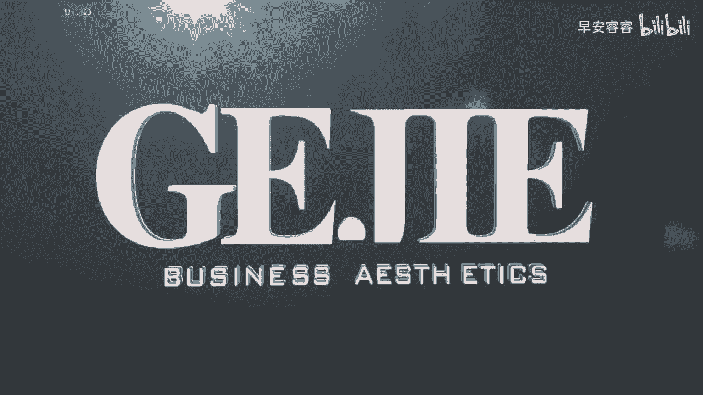
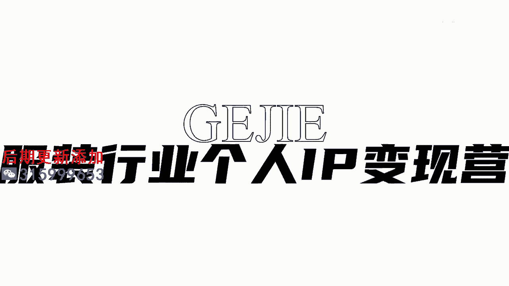

# 045 服装行业流量爆发营，从0-1抖音快速起号解决实体流量问题！ - P9：9 - 9.有没有违规和限流(巨易网，轻抖APP） .mp4- - 早安睿睿 - BV1Kf421R7NA

如果你不知道的话，你就真的不要在抖音这个平台上混了，尤其是做服装行业哇，那违规的词真的是太多太多了，所以有很多人他的账号做不起来，他的流量突破不了，他根本就不知道问题是出在哪里。

那么如果我们要在抖音上去做好，这个账号的一个内容，就第一一定要去尊重平台的一个规则，那么在今天我给大家去列举三个，服装人去做账号，以及在直播的过程当中，最容易去碰到的三个违规的动作。

比如说有一些非常容易踩坑的极限词，我们家是最好看的，我们家是最怎么样的极限词，或者说哎我们这个是第一的，这种都不能讲的，以及就是比如说哎这个款它是我们家的独家款，你是证明不了它是独家款的。

所以这些都有可能导致你的一个流量，始终卡在一个比较低的层级里面，因为在你的这个文案当中，一个app呢叫做聚义网，还有一个app呢叫做青斗，大家用这两个app去查一下，这是你要去做好账号的第一步。

就是咱不能违规，然后第二个的话，这个其实是单独为服装行业去定制的一个规则，就是我们的成分的一些敏感词，举个例子啊，你在现实生活当中，你觉得你跟你的客户说，哎呀这个衣服很好穿的，百分之百的纯棉。

这种话是在我们的视频里面，以及在我们的直播间里面是绝对不能说的，因为你没有质检报告，你不能够去证明它是100%纯棉，所以你就会发现在很多的主播里面没有纯棉，这个用词的，他可能会说大量的棉质或者高棉质啊。

里面含棉量非常的高，但他不会用纯棉这个词，因为这在平台来说它是违禁的，当然不仅限于在棉类，很多涉及到在服装行业里面的一些材质，比如说真丝啊，真皮呀这些，当你没有检测报告的时候，你都不要轻易去说。

甚至哪怕你有，如果你被举报到了，或者说被官方检测到了，他也需要你去提供相应的一个证明，其实也是有可能影响到你的一个流量的，所以我们在表达成分的时候一定要小心啊，一定要去看一下哪些成分。

我们不能轻易去说的，涉及到一些真呐甲呀，检测呀，这些都是比较敏感的一些成分的一个词语，那么第三个也就是大家犯的最多最多的错误，就是做一些违规的引流动作啊，比如说非常常见的是什么。

在我们的简介里面挂一个微信号，后面直接把微信号打出来的，像这种，你在简介里面，直接就光明正大的去挂一个微信号，想要让别人从抖音这个平台，直接流量就薅到你的私域里面去，这种行为。

官方是一定会去降低你的一个账号权重，你的流量一定是托付不了的，还有一些啊，我看到有一些服装人很喜欢，比如说在顶置的第一个视频上上面去写，微信号是什么什么请加V什么的，这种都叫光明正大的违规引流。

对你就会发现你的流量池一直会卡在一个地方，你做再好的内容都没有用，那么除了这种明目张胆去讲的，还有一些就是别人在你评论区下面留言，问怎么买呀，然后你就跟他说，私我呀，加我呀，呃加微啊。

这些都是不能说的啊，还有就是当别人在后台私信了你以后，你一定不能主动把你自己的号发出去，你要引导他把他的号发给你，如果别人他私信你来问，你说哎我好喜欢你家的衣服怎么买呀，你不要直接说来加我。

怎么样怎么样，你要去问他啊，你的联系方式是怎么样的呀，你给我，我来加你呀，或者说你给我啊，因为当你如果有大量的人去问你的时候，你甚至提到我来加你，这个都有可能被后台直接关进小黑屋。

而这种批量去做违规引流的会被封号的，他都不是说我给你罚一下，但也有一些是罚，比如说20天罚30天，但是也有非常多的案例，是直接把这个号给封闭掉了，那你想想你辛辛苦苦累积的粉丝，就因为这个动作。

那他就不行了，对不对，那么我们在这个引流上，还可以去做一些什么样的动作呢，第一个就是我们看说到的一个蓝V，你可以跟他说，哎想联系我，可以看我上方的一个企业简介，上面就有我的号码可加我。

你这样子其实他也是可以找得到你的呀对吧，还有一种就是我们可以去通过小号，去打一个辅助你，比如说hello，我的助理联系你了，我们在那边来跟你进行关联，你那个小号给他发微信号是没有关系的。

因为你那个小号他本身又没有权重，他就是拿来做一个引流的过渡的，所以我们可以用一个大号和一个小号，来进行配合，OK总结一下，我们今天在这堂课上面，核心就是教大家，第一不要使用到一些危险的极限词。

这个属于违禁的，第二在成分上要小心，不要去做那种敏感成分的表述，第三引流一定要多加小心。