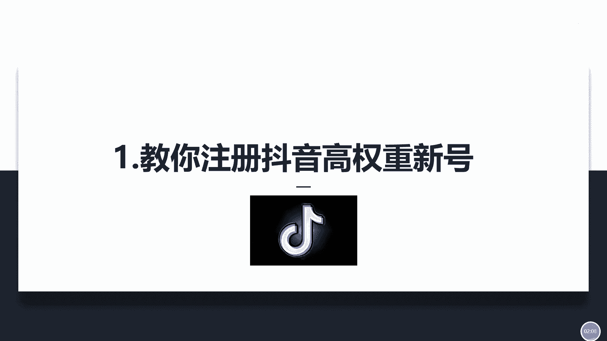
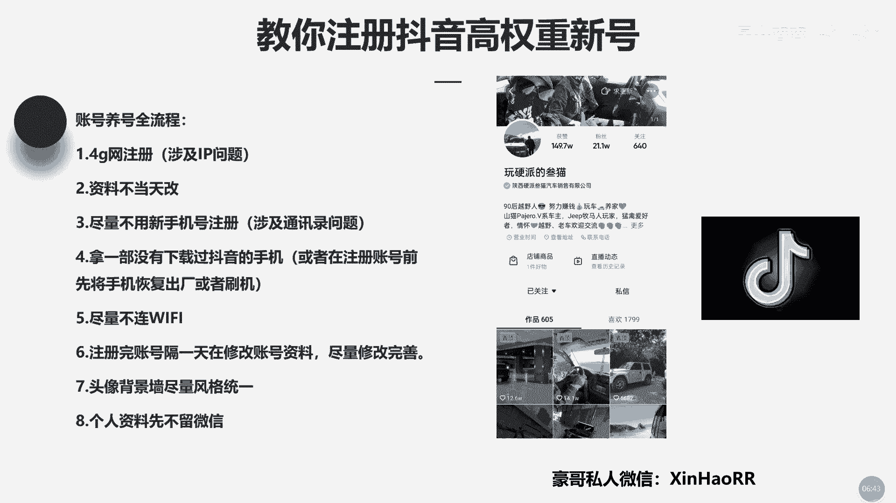

# 053 抖音独家起号，一天引流500+精准粉，适合各类行业（9节视频课） - P1：第1课：教你注册抖音高权重新号 - 早安睿睿 - BV1br42157St

大家好，我是新号的豪哥，然后呢咱们这节课呢主要是讲一下，就是怎么样去做好这个抖音的一个，旗号的一个板块，其实相信咱们很多的学员哈，就是说想去接触这个抖音，但是呢基本上没有一个能够做得好的，对不对啊。

包括呢我这个玩法哈，我基本上我做出了很多破万粉的一个账号，就说目前在我手上有仅存的还是两个账号，是剪辑类的，就是还剩两个，然后基本上都是10万粉跟20万粉的一个账号，如果你有需要的话，我可以截图给你看。

对你可以找我截图，我这里就不公布出来了啊，然后呢其实我这一套玩法不单单是我对对，包括我最近啊，最近几天我也去找了那些同行，就说我也去付费了一个学习，对不对，最近我还找了一个叫那个叫什么什么什么男的。

对不对，他做抖音都做的不是比较好嘛，是旗号，然后呢我就专门去付费去找了他学习，但是我发觉它里面的一个玩法，其实跟我之前啊就是做抖音起号就一模一样的，因为我们旗号呢基本上就是靠抖家去起号的，包括我那一年。

那是我那一年就是哦上一年嘛，对不对，现在你做抖音的话可以做，就是说去做自然流取号，也可以说去做这个付费流，去取去去这个旗号，对不对，但是呢他这一个他他那个人呢，我去找他的时候呢，我就给他付了费。

把他教程拿过来，但是我这个教程，我看这不是我之前那种玩法一样的，还是靠抖家起号去投这一个定向打，然后去看这个粉丝的一个数据，都得跟我之前玩的一个手法是一模一样的，然后包括我最近我也去实测了。

我这个手法还能不还能不能用对对，然后我就去找了一个剪辑的，剪辑的一个账号去实测，那他是一个汽车号码，我想捡一个七车，我随便剪的，就照样能够把数据怼的好，就占这个咱们账号的一个标签，怎么样照样能够打得上。

所以说呢啊其实做抖音这个东西，我觉得是非常简单的，就是说啊直播我不行，但是起号的话我是OK的，那所以说咱们这节课主要来教你们怎么去起号，对不对啊，然后咱们接下来这节课主要是讲一下。

怎么去注册这一个抖音的，一个高权重的一个信号。

啊首先咱们看一下啊，咱们怎么去注账号，怎么去这个注册这个基本的流程，我都告诉你们了哈，他说不用，就是说可以不用4G宿舍，可以可不可以连WIFI啊，连WIFI可以，但是你必须确保你这一个WIFI。

平时只有1~3个人连，而且你这一个就说连你这一个WIFI的人，他平时抖音是没有过规的啊，你也确保这个事情，如果你确保不了的话，那你号号注册没问题，但是你之后去发作品，基本上就是零播放。

就说你的作品是推不出去的，对不对，所以说这一点要记住啊，所以尽量用4G网去注册，用4G网去注册的话，你的账号会更加的安全，然后这是第一个点，第二个点的话，咱们这个资料哈尽量不要当天去改。

比如说我是今天注册的，那我就第二天再去修改资料啊，会好一点，然后第三个尽量不用新手机号去注册，为什么呢，因为我们去拿，就是说我们现在去这个移动对对，去办一个新的一个手机号码，对不对。

然后拿着一个手机号码怎样，我们去注册这一个抖音，但但是呢他抖音的话，他那个咱们注册新号的话，他会问我们就说啊，是否允许他们访问这个通讯录的一个权权限，一般的话，那我们做抖音的话。

都会允允许他去这一个访问的嘛，对不对，但是如果你这个新手机号，你没有通讯录啊，对不对，这是第一个点，第二个点的话，就说其他人的通讯录也没有你的号码，所以说他就会判定你是一个新号。

所以说你这个账号的流量是特别特别低，甚至还是零播放，对不对，所以说尽量用老手机号码去注册会好一点，这是第三个点，那第四个点的话，尽量拿一部没有下载过抖音的手机，如果你实在没有手机啊，那你得让你这个账号。

你在注册之前，先把你这个手机怎么样去恢复这个出厂设置，如果可以的话，就是说条件允许的话，你就把这个手机去刷机一下，这样子的话你的设备相对来说是会比较干净的，在一种情况下，就是说无论你是怎么个恢复出厂法。

怎么个刷机法都没有用，什么意思，就是说啊你这个手机多是有严重的违规，然后你这个手机型号，这个设备已经被抖音给标记住了，已经永远的记住了，无论你怎么去更新都没有用了，懂了没有啊，这种情况的话。

就这种情况的话就比较特殊啊，这种是相对于那些做工作室的，就经常用这个手机去注册这个抖音号，然后经常违规，经常严重的，然后被封号的话，这种的设备那肯定就是被记住的啦，啊啊这是第四个点。

那第五个点呢咱们尽量不要领WIFI哈，大前面第一个点也讲到了，就涉及一个IP的问题嘛，那具体的一个IP的问题的话，我下节课会讲到，然后第六个点咱们注册完账号呢，记住记住哈，隔一天再去修改这个资料啊。

然后咱们去修改的时候，尽量把它修改完善一点，比如说你的名字叫什么，头像背景墙，对不对，然后你的一个学校当比如说尽量填大学吗，如果你比如说啊你没有读过大学，那你随便填一个嘛，他这个没有要求的啊。

然后填一个大学，然后呢你个人资料以及你个人的所在地，这些这些哈都给它填清楚一点啊，然后呢第七个点，咱们头像和背景墙尽量风格统一点，比如说我在这一个网上我随便截啊，这个不是我的号。

我是随便给你们截了一个号，他这一个号你可以看一下它的一个，这个是背景墙，这是头像，你看背景墙跟头像，看起来这个风格是不是很统一，都是车对，所以说咱们尽量要统一点，因为你统一的话，当别人看到你的作品诶。

你这个作品好引起他的共鸣了，然后认可你的作品了，去给你点赞评论了，那此时他关注你之前有一些他会点进你的主页，看一下你其他作品，所以说此时你头像跟背景，将占着很关键的一个作用对。

所以说你头像背景墙好看的话，是有利于去留住他们，让他们去关注你的，懂了没有，这是一个点，那咱们的个人资料尽量不要去留微信哈，比如说像他这样的老号都是几10万粉丝的，这种号的话，去留微信的话。

那肯定是可以的，那我们在什么样的情况下，可以去留这一个微信号呢，那肯定就是你这一个账号的一个粉丝量，达到1万之后啊，真实真实达到1万之后呢，你再去留微信，这样子会比较安全一点啊。

好咱们这节课主要是讲到这里，然后你们有什么不懂的问题啊，欢迎你添加豪哥的私人微信，在右下角哈，幸好阿，欢迎你添加我的这个微信去问我问题，有什么不懂的，欢迎你随时来问我好吗，只要你跟引流有关的啊。

只要你是我的学员的话，那肯定没问题，直接问的，如果你不是我的学员，就是说你在市面上已经买到了我的盗版课程，那怎么办，你直接添加我豪哥的私人微信，还一咱们一对一来聊一下好吧，有兴趣加入学习的话。

就说学抖音或是学引流都可以都可以哈。

