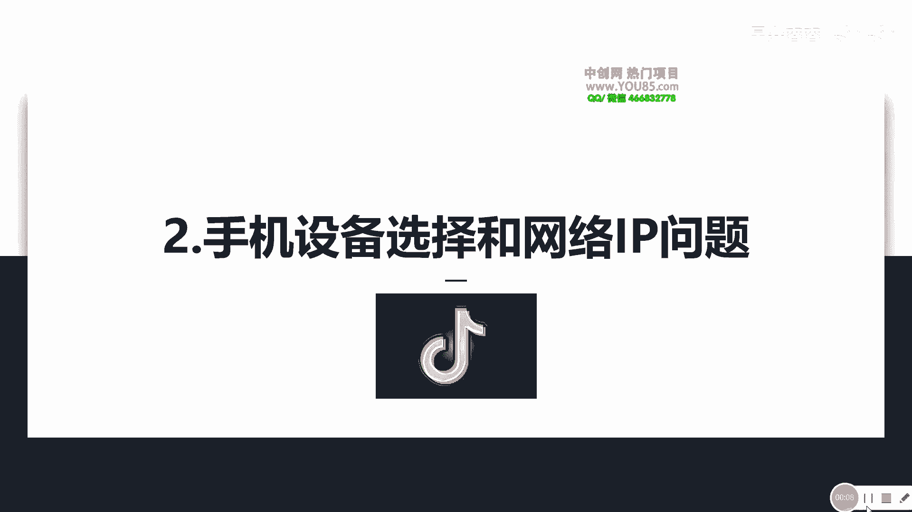
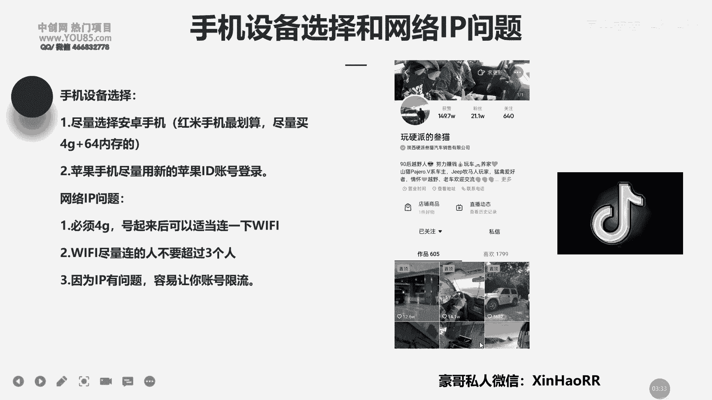

# 053 抖音独家起号，一天引流500+精准粉，适合各类行业（9节视频课） - P2：第二课：手机设备选择和网络IP问题 - 早安睿睿 - BV1br42157St

大家好，我是信号的豪哥，然后呢咱们这节课主要来讲一下，就是咱们在注册抖音的时候，去选择什么样的设备，以及这一个网络IP的一个问题。

其实啊咱们玩抖音啊，选设备尽量选哪什么设备比较好呢，我的建议哈是选择这一种安卓手机，为什么选安卓手机呢，因为你选安卓的话，你可以无限的去回去这个恢复出厂对对，然后你也可以无限的去刷机。

但是如果你是苹果的话呢，你这一个平时恢复出厂的话会比较麻烦，你得用那个什么用那个苹果id账号登录，但是你苹果id账号是有限的，你需要专门去那个周卖苹果id的人去找他们，要手机去买。

去买这个苹果的这个id啊，就是就是说去专门找到买这种苹果id哈，但是呢你苹果的话是，现在这一个苹果id是很难买得到的，一般只能就是说用自己注册好的苹果id，懂了没有，所以说咱们尽量去选择安卓手机。

因为它是比较省钱又怎么样又方便的啊，然后你买安卓手机的话，我这边给你的一个建议，就是怎么样去选择这个红米手机，还是比较划算的，买这种什么这种4~4G加60，64G的一个内存的，这种话不会很卡。

你下载个抖音的话，去玩玩抖音还是可以的，等你号火了之后，你就把它换到，把你这个号码换到你那个大号大的，就平时这个私人用的一个手机，因为私人用的手机往往线速度比较清晰嘛，对不对啊，就是设备的话呢。

我这边的话都是统一买这种红米的啊，你可以也可以买其他牌子随便啊，大概大概就是在这一个500~600，这样的一个价格啊，我通常都这样子一步的啊，去，就我基本上就是，就是说我现在自己平时那些小号啊。

一些助理在用的一些手机号，一般我都会给他们用那些红米的手机啊，因为它划算便宜啊，这第一个点，那第二个点呢这一个网络IP的问题，就是上节课咱们讲到这个网络IP，对不对，其实网络IP这种东西。

你可以不用把它想的过于复杂，你就记住了，咱们必须连4G，然后how咱们这个号怎么样，做起来之后可以连WIFI了，四个连WIFI就可以，然后你这个啊你平时连WIFI时候啊。

平时就是不要就说如果你真的要连WIFI，你不想用视觉去4G了，对对你没有卡了，你不够卡了怎么办，那你就怎样去K连WIFI，但是你WIFI的话，你有个前提，就是你这个WIFI您的这个人呢不要超过三个人。

而且你在连这一个WIFI之前记住好，这边给你提醒一下，我没有打出来，就说咱们在连这个WIFI之前，先让你这一个WIFI怎么样，先把那个给它拔掉，把它关掉，把那个开关给它关掉。

然后等个10分钟后重启之后再去连这个WIFI啊，记住了哈，然后呢，啊这边指的这个WIFI连的人不要超过三个人，就是说三部手机的意思哈，啊主要是三部手机的意思，不是说三个人，主要是这个把连你这个WIFI。

尽量不要超过三部设备啊，然后你因为你这个IP有问题的话，通常你这个账号基本上就是限流的啦，什么是现实，就是说你的账号没有流量吗，你作品拍的再好有用吗，没有用，为什么，因为你没有流量，所以说流量才是关键。

所以说你不想出问题的话，尽量把你的网络IP问题给他处理好，懂了没有啊，哦然后呢哦你是一个网络IP啊，尽量就是说去连好这一个4G卡，不要去连这一个WIFI，用你四驱卡的话是最安全最稳固的。

最可靠的一种方式了，好然后咱们这节课主要讲到这里，然后你有什么问题的话，欢迎添加豪哥的私人微信。

