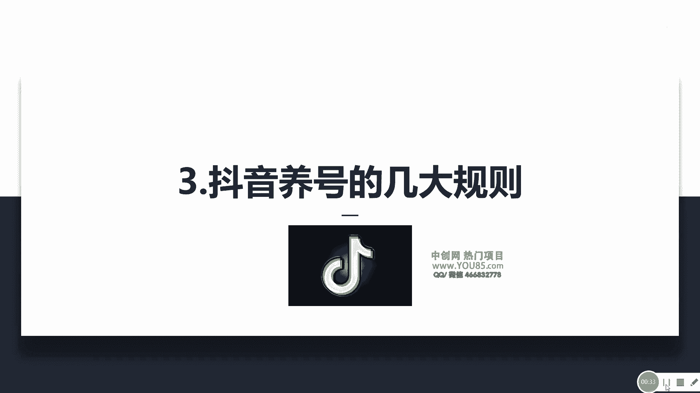
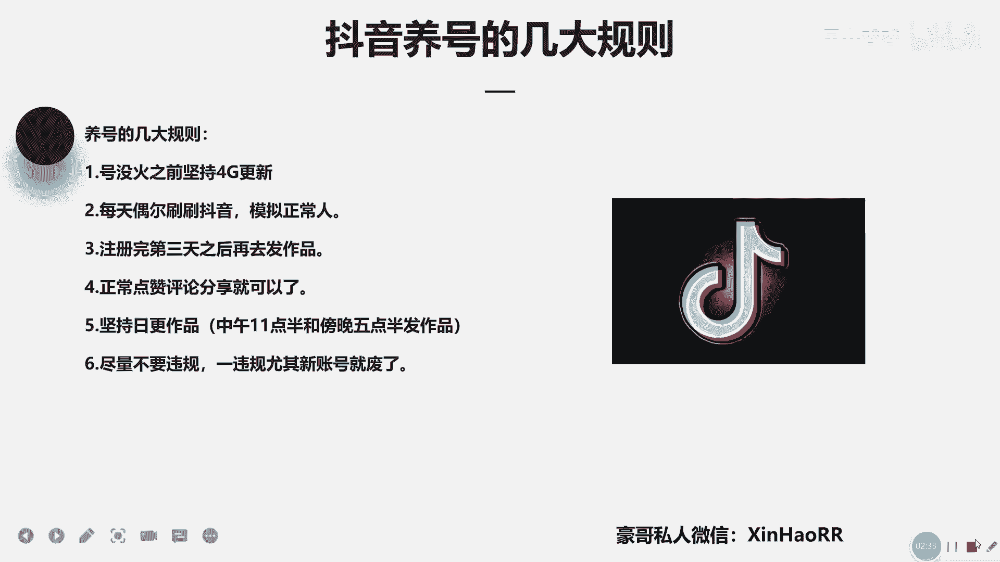

# 053 抖音独家起号，一天引流500+精准粉，适合各类行业（9节视频课） - P3：第三课：抖音养号的几大规则 - 早安睿睿 - BV1br42157St

大家好，我是星耀的豪哥，然后呢咱们这节课主要来讲一下，涉及到抖音养号的几大规则，然后其实呢抖音上很多那些知识博主，他说什么抖音呢是不需要养号的行，那你叫他哈，我听到这个点，我就觉得挺奇葩的。

那你不需要养号，那你叫他现在注册一个抖音账号，注册完之后立刻就发作品，你看他的作品有没有流量，对不对，可能一个播放都没有，就是不适宜公开零播放对对，所以说抖音它还是需要养号的。

只不过就是说抖音养号没有那么的复杂，对其实抖音的养号，你可以简单把它理解为，简单的活跃账号就可以了。

然后呢啊其实涉及到抖音养号的几道规则，这边给你们讲一下，其实很简单的啊，第一个点咱们号没火之前，就是一直去坚持用4G去更新就可以了，这第一个点因为你用WIFI更新的话。

很容易让你那个账号出现异常的一个行为，那个IP啊，所以说建议用4G对对是第一个点，第二点的话你每天偶尔刷刷抖音嘛，模拟一下正常就可以了，然后你注册完第三天之后，你再去发作品啊。

然后第然后你平时的话正常去点赞啊，评论啊，分享啊就可以了，他没有什么复杂的的一个点，对不对，其实是养号这东西呢被别人神化的，太过于夸张了，其实像现在的话，尤其是这一个抖音的一个养号，它没有那么复杂的。

你正常去点赞啊，评评论啊，分分享就行了，但是你点赞啊不点太多，你不会一次点个十几20个了，那你这个评论呢你也不要一次性评论太多，评论个两三个一天，对不对，那你评论也不会去违规。

然后偶尔去分享一些好的作品，对不对，这样就可以了，对不对，然后第五个点哈，坚持日更作品，因为这个东西的话，它会影响你的一个推流啊，影响你这个账号的一个回读，所以说你一天的话呢。

可以给他发一到两个作品就行了，如果是我的话，我会选择一天发两个作品，就是中午11：30发，跟傍晚05：30去发这个作品，对不对啊，一定要坚持去日更作品啊，尤其是心脏，你没火之前的话，尽量去坚持日更作品。

然后第六个点的话，咱们账号尽量不要违规，因为你一旦违规的话，你这个新账号就废了嘛，然后的话违规可能还没四零新超，有违规的话，基本上就没有群众没有播放的啦，对所以说这抖音的养号的极大规则，它没有什么穷。

无非就这几个点，对不对啊，所以说这一点我怎么样，我都专门去给你们就列出来了哈，我们做好这几个点的话，一般都没问题的啦，接下来就是说去优化好你的内容，然后再配合这个斗家去起号就可以了。

好那咱们这节课主要就讲到这里，有什么疑问，不懂的话，欢迎添加我的私人微信啊，在这右下角。

