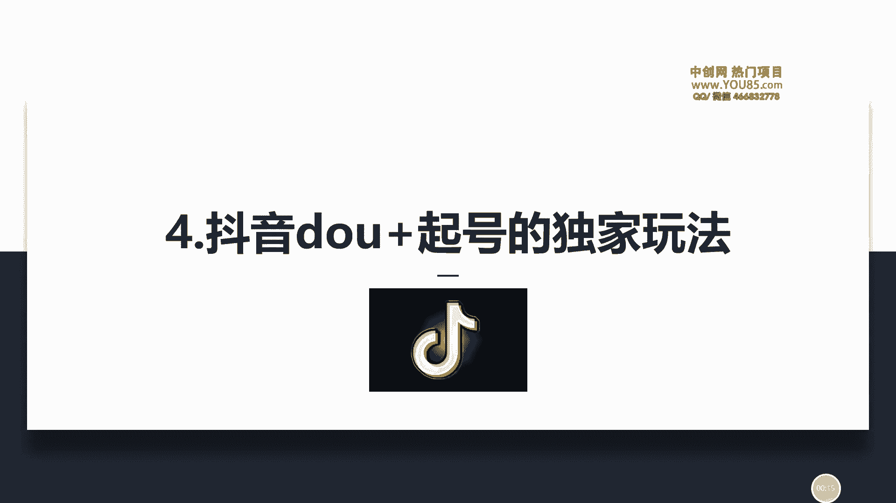
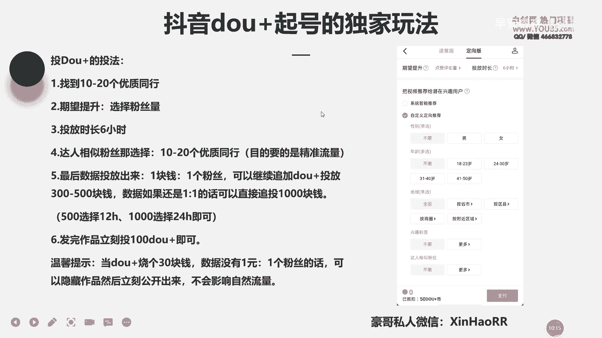
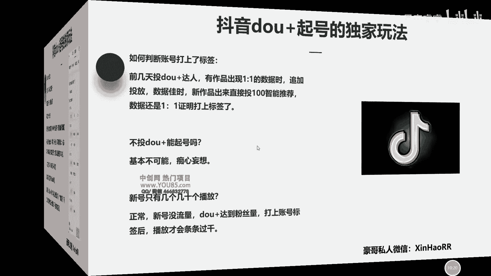
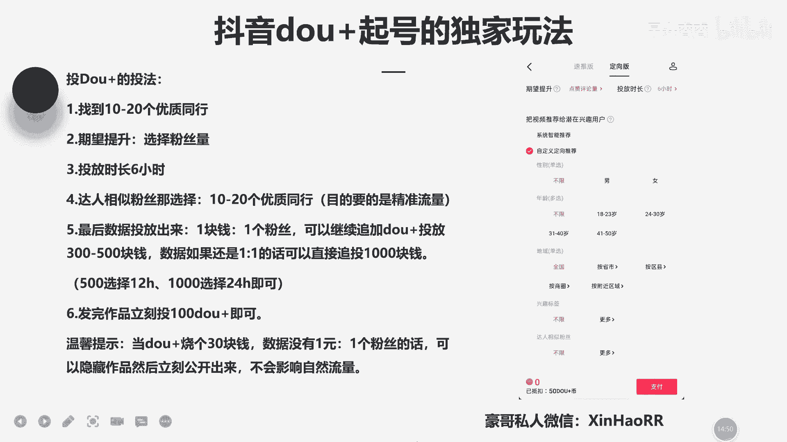

# 053 抖音独家起号，一天引流500+精准粉，适合各类行业（9节视频课） - P4：第四课：抖音dou+起号的独家玩法 - 早安睿睿 - BV1br42157St

大家好，我是新豪的豪哥，然后呢咱们这节课主要来讲一下，就是说如何通过这个抖家，来把咱们的账号怎么做起来，然后这个玩法呢其实怎么说呢，也是我近几年做抖音的一个经验啊。

所以说我可以把这个方法共享给你们。

啊首先咱们通用这个抖加起号呢，对不对，首先有个准备工作，什么准备工作呢，第一个点，咱们先找到10~20个优质的一个同行，什么是优质同行，比如说你是做这个搞笑类的账，对对真人出镜的。

那你就去找怎么样10~20个做搞笑类的，然后呢这个他有十到50万粉丝的一个抖音号，也就是咱们的这一个优质同行了啊，然后就是说，咱们为什么去找咱们这个优质的一个同行呢，其实道理很简单。

因为咱们头抖肩呢就是得投给谁，把咱们的作品投流量，投给咱们优质同行的一个粉丝，懂了没有，因为咱们的流量呢不是说白投吧，咱们要投就是把咱们作品投给咱们的一个同行，让咱们的同行的一个粉丝刷到咱们的作品。

因为同行的粉丝，他是喜欢这这一这种类型的这种文案，这种作品，对不对，那咱们这种呢也是可以的，就投给他，因为这样投给投给他的话，怎么样，这个流量是特别的精准的啊，要记住这个点，这第一个点，那第二个点呢。

咱们啊找这个同行的还有几个条件啊，第一个它必须是是啊最近经常发作品的，而且他最近这几个作品的一个点赞呢，有个几10万啊，几10万的一个点赞啊，这第二个点哈，他必须得经常给我发作品来比较活跃的。

而且他最近几个作品点赞有几万或几10万的，这样这样的一个同行去投，那是最好的，如果你找到一些同行，他是十到50万粉丝，但是最近他作品的点赞只有个几百个几十个，那就不头疼了，这就证明他的一个怎么样。

他的这一个粉丝不精准啊，然后这是第二个，然后第三个的话，咱们找到十个同行，他最近发过的一些优质作品，可以是这半年内或是这几个月内了，你可以去模仿他啊，参考它的选题，而不是直接抄袭。

然后这边我给你们解释一下什么是参考选题，比如说他讲的是育儿类的，好举个例子啊，比如说讲讲的是育儿类的，那育儿类的，比如说它比如说小孩子晚上不睡觉怎么办，对不对，他讲这个刚刚好，他火了，对不对。

那我们可以也可以怎么样，去参考他的一个这个方向，然后去模仿一下，然后去写出咱们的一个文案，当然我叫你们模仿，不是叫你们直接抄袭，你直接抄袭的话，比如说你直接抄它视频里面的文案的话，这个它会怎么样。

他是会系统会检测出来的，也会判定你是抄袭的，记住了哈，好这是第三个点，那第四个点的话，咱们制作怎么样，十个优质作品一天两个用来起消耗用，为什么呢，因为你十个优质作品的话，你一天发两个，中午发一个。

网上发一个，对不对，就是用来起销售的，那你们说可能说啊为什么要发这么多个呢，因为咱们就是以最快的速度，把咱们账号做起来嘛，因为你一天一天的等待都是比较煎熬的，对不对，所以说你尽量怎么样背多一些作品。

直接一天中等一个网上怼一个，然后去投抖家，去投放，都得投这个流量，然后以最快的速度让咱们账号先给他标签，给它打上，把它基础流量给他做起来，对不对，好，然后你们很多人其实都挺好奇。

就是说咱们为什么要投抖家，为什么要用抖加去起号啊，这边我也给你们讲了，首先第一个点，因为咱们的新账号怎么样，它是没有任何流量的，懂了没有，咱们新账号是没有任何流量的。

咱们必须堆到1000~5000的粉丝左右，然后呢把自然流量给提起来，因为你要你要你那个基础的播放，通常都是比如说你是新账号吗，通常都是几十一两百四五百啊，但是这样的流量它是不精准，而且又少的。

就说咱们必须怼个1000~5000的一个精准粉丝，就通过抖家去去投放你的视频去涨粉，对不对，那然后因为你有个1000~5000的一个，粉丝左右呢，那你这样子的话去投放的这个账号呢。

你这个账号的粉丝量有了对上你的基础播放，通常也有个一两千的啦，那你有个一两千的一个基础播放，而且是基础播放，流量是比较精准的，当你的作品是符合这一波流量，并且呢也是比较优质的时候呢。

那你这一个号火起来的速度就会更快，懂了没有，所以说为什么咱们投抖加，就是因为你的信号没有流量，所以说你必须给他怼到1000~5000粉丝之后，你有条件的话，最好就怼到5000分之对。

比如说我的一个账号啊，我前阵子做了一个汽车号，就汽车紧急号，我我也是试着玩的，然后怼到了就就我就我就怼到了五六百粉，但是我这五六百粉他的那个基础播放都很高兴，然后我没有去投抖家，我发觉每一个作品。

他的一个流量大概都有个1000多，2000多，1万多的基础播放都是有的，对不对，这证明了什么，证明了我这一个账号的标签打上了，因为我这个作品一发出去就很很多人看，很多人点赞。

就证明了我账号标签他那个标签是准的，懂了没有，所以说呢，然后我的击球播放又有了，为什么，因为我的作品是比较优质的，但是我不知道你们能否做的优不优质，所以你可以把你作品发给我看，比如说我有我微信，对不对。

你可以发到微信发给我看，对不对啊，所以这是第一个点，咱们尽量把你的账号的粉丝怼到1000~5000，粉丝就是为了提高咱们的一个自然流量，去提高咱们的基础播放，那第二个咱们为什么要投抖机呢，第二个点哈。

是因为为了给咱们的一个账号，怎么样打上这个标签啊，什么是打标签，我这里面说的标签啊是指抖音，他给咱们推送流量的标签，什么意思，比如说咱们发一个作品，然后他给咱们推了1000个播放。

然后这1000个播放里面很多人给咱们点赞，很多人给咱们评论互动等等，这证明了什么，证明你的账号标签很准，那为什么这里指的标签是什么，是指抖音他给你推送的人群的一个标签，就是说比如说你发的是音乐类的作品。

然后抖音他会怎么样，他系统会把你的作品推给喜欢看音乐的人，这就证明了一个点，你的账号标签就已经打上了，因为抖音他知道你这个账号的标签属性是什么，适合什么样的人看，他知道你说你适合什么样的人看。

但是你一个信号你不投抖加的话呢，它是很难识别到你的一个标签的，因为他给你推的流量又少，又不精准对，所以说你要精准的话，你必须投抖，像你必须得让抖音知道你，你想把作品推给谁，懂了没有。

所以说为什么头等价无非就这两个点，第一个提高咱们的基础播放，第二个就是为了给咱们的一个账号，去打上这个标签，但我这里面讲的标签啊，在抖音里面是看不到的，具体怎么去看，你这个账号有没有怎么上打上标签呢。

你可以这样看，你可以看你作品发出去，然后多不多人互动，多不多人点赞，有没有人给你点关注点，点的多不多，点的多的话，通常都是打上了标签，但是咱们还有另外一种方法啊，然后这下面会讲到，然后呢他这一个抖音。

它这一个抖加起号哈，首先他这里面这个头发比较好的啊，这个托管你这市面上去找，至少值个一两千块钱呐，对不对啊，然后你可以看一下，其实很简单，他投的话，首先第一个咱们投抖家，对不对。

咱们先找10~20个优质同行，然后呢在期望提升这里，比如这是狗加它一个页面，然后这里有个期望提升，然后选择这个粉丝量，你去点点开，然后可以选择粉丝量，然后投放时长的话选六个小时。

然后点自定义的一个定向推荐，然后点这个答案相似，粉丝点更多，这里然后然后他有个搜索框，你可以找到你的同行，这是第一个，咱们为什么要找10~20个优质同行，因为咱们要通过抖家。

把咱们的作品去推给咱们优质同行，每一个粉丝去看看咱们的作品，懂了没有啊，然后投放时长选择六个小时啊，然后选这里面选个10~20个优质同行吧啊，然后最后数据出来呢，就是说。

如果咱们能够达到一块钱一个粉丝的话呢，可以继续追加这个抖家的一个投放，那这里面你们可能不懂什么是一块钱一个粉丝，比如说你投了100块钱，对不对，那你投了100块钱涨了100个粉。

那就是怎么样一块钱比一个粉丝啦，懂了没有啊，你100块钱可以涨100个粉丝的话，就代表你现在已经达到了一比一的一个数据了，你能够达到一比一的数据，证明了你这个作品是比较OK的啊，记住啊。

这里一定要选择粉丝量，选择六个小时，然后这里选十二十个优质的同行，那你就可以继续去追加这个抖家他的一个投放，然后可以继续追加的话，给他投个300~500块钱，然后也是像这样子去投啊，还是像前面这么去投。

然后呢数据如果投出来还是一比一的话，你可以直接追投1000块钱，为什么就是追投资这么多呢，因为咱们就是让咱们的账号去怎么样打上标签，以及把这个基础粉丝给他做起来，去提高咱们的一个基础播放啊。

这第一个点哈，第五个点，然后你这个300~500块钱的话，你可以选择12个小时的一个投放，然后1000的话选择这个24小时的一个投放，就可以了，然后的话期望提升的话也是选粉丝量嘛，然后由这个答案相似。

粉丝这里也是选10~20个优质同行，对不对啊，然后你发布作品立刻就可以投100手枪，你是新账号的话，你直接发作品立刻就可以开投了啊，然后然后这里面我可以给你，教给你们一个技巧啊。

比如说你的斗家烧了30块钱，对不对，然后你发群去涨两三个粉丝，基本上涨不到粉，那证明哪个点，证明个什么点，就是说你没有这种一元比一个粉丝的话，就是一比一的占比例，你达不到的话怎么办呢。

那就把你的作品怎么样，在右下角那里点点击这个隐藏，然后再立刻公开出来，然后他这个抖教就会停止投放，比如说你投了100对对，然后他烧了30块钱，你发你数据不佳时候了，然后他会退70块钱退回你的账户。

他好像是在哦24小时到48小时内退吧，你可以具体去查看一下啊，反正他会退给你就是了，反正反正能退啊，然后这边我给你们讲一下，如果你去隐藏作品，然后立刻公开出来，他是不会影响你的自然流量的。

比如说我之前做了一个作品，然后呢我去把它给隐藏了，然后立刻公开出来了，然后因为抖家的数据的话，它的涨粉不行嘛，但是它自然流量可以，就说我这个视频就我这个作品适合点赞，评论不值得关注，对不对。

然后我隐藏完之后，比如说那时候是2000多播放的，然后隐藏完之后，然后去后又公开出来之后，然后怼到了5000的一个播放，所以说这证明了一个点，咱们可以把作品隐藏掉，然后再立刻公开出来。

他是不会影响自然流量的，记住没有，记住没有哈，所以说你不用担心啊，你这个作品都有这张取消抖加投放的话，然后你就怎么样，你就会影响到自然，你就不会了啊，不用担心这个点啊，这就这就是咱们抖家的一个投法啊。

你等会就是把他笔记做好。

很关键，一步都不能漏。

然后咱们斗家这个旗号呢，怎么去判断你这个账号打上的标签，刚才咱们前面也讲过了，对不对，首先看他的那个给咱们推送流量精不精准，要么就是怎么样，你可以这样子，比如说你是新账号。

对对你前几天投了这个抖家的一个答案，然后你有作品出现一比一的数据呢，然后你给他追投，追个追个三百五百，追个1000的，那数据还是一比一甚至更好的时候呢，然后你再发一个新作品，然后直接投100个智能推荐。

投100智能推荐就行了，然后你因为你100的智能推荐的话，你是不需要选这一个的，不选这个的，你自己点速推版，让他随便去推，你该投一个100块钱，然后你投完这100块钱之后呢，你那个数据呢它还是。

但是你这个数据哈，你这个字字数推广这里你也得选择这一个啊，粉丝量哦，或者是你或是你不不点这个数推版也行吗，你点这个系统自动推荐，你点这里看到没有啊，你自定义就不用点了，投资人的话，你直接点系统智能推荐。

然后这里选择粉丝量，然后你是选六个小时，然后看投出来的数据怎么样，是不是一比一，如果是一比一的话，那就说一块钱比一个粉丝的话，就证明你这个账号已经打上标签了，懂了没有，因为你随便自认投的话。

咱们就不用选答案了嘛，就是说让系统随便去投，那系统它随便去投，都可以投给咱们想要的流量了，这证明咱们的系统，这抖音的一个系统，已经知道你这个账号的作品适合推给谁看了，懂了没有，这是第一个点啊。

然后呢这边的话呢还有个问题啊，就是说如果咱们不投抖加的话，能不能起号，我告诉你基本上不可能的，你这个账号如果不投抖家的话，你是一分流量都得不到，有而且是那种精准流量，可能你偷偷加的话，你十天能起一个号。

但是你不偷偷加的话，你可能11年才能起一个号，懂了没有，因为他抖音他推送流量是特别少的，所以说的话哈，咱们尽量要通过抖家来这一个旗号啊，记住因为抖机它是一个比较好的工具，你玩自然流量的话。

现在因为现在抖音他不缺作品，它缺的是更更优质的作品，所以说怎么办，你只能付费了，你付费的话，那抖音又不一样了，他肯定会给你推的，懂了没有，然后呢，你的新账号只有几个几十个播放怎么办啊。

我告诉你这是属于正常的，因为你这个新账号你都是没有流量的，因为你这一个新账号它你是没有任何流量的嘛，所以说呢这是属于正常的，很多人都问，就说如果我的信号只有几十个播放怎么办。

甚至有几个就是因为这个都是很正常的，你要记住哈，因为咱们的新账号都是没有流量的，没有任何流量，所以说你必须得做做，把你的基础流量给做起来，所以说只能通过抖加，去把你的粉丝量干到1000~5000左右。

然后让你账号去打上这个标签，那你的播放才会条条过千，那你想要调条过千的话，有个前提，就是你的作品尽量要做到优质，比如说你这个作品做的那个狗屁事啊，没有人愿意看，那你给你1万播放又如何，没人给你点赞。

没有人认同你，对不对，然后呢你的账号继续优化到5000粉丝的时候呢，就比如说你投抖加投到了有5000粉丝，你还是没有流量，基础播放还是只有几百几十的话，那只能证明了一个点，第一个是你的内容不行。

你内容做的是真垃圾，你你可能觉得你自己的内容很好，我告诉你，咱们千万不能这么想，咱们的内容好不好怎么办，那咱们看数据，数据好，数据出来的时候呢，这个作品这个比如说给你点赞啊，互动啊，关注量啊。

都是比较好的，这个数据对不对，就证明了你内容好，咱们觉得好没有用，咱们得看数据，按数据来讲话，然后如果你内容不就是说，如果你真的觉得还可以的话，那就肯定就是你的这个斗家房要么去选错，要么你用的是老号啊。

然后你这个粉丝不是精准粉，记住了哈，然后老号能不能用，我老号的话，建议就是不要去用了哈，除非你这个老号这个流量本来就精准，那你可以用，那就不用去起号了呀，你那个号就直接用了，那你要么通常都是换新号的哈。

比如说你这个号已经用了很久，有个几百粉丝也不要用了，丢了丢了丢了，懂不懂啊，因为你这个流量不精准，不是精准粉啊，然后你这一个账号粉丝干到1000~5000后，还需要投放部。

如果你的账号粉丝已经干到了1000~5000左右，或者这个范围了，然后你基础播放大部分都能够调调过千的话呢，那你就不需要再投放这个抖加了，继续优化好你的内容等等它上热门就行了。

好那咱们这节课主要讲到这里，因为这一节课讲的东西比较多，内容比较细，你不懂的话呢，你随时微信问我好吧，要做抖音正东先说难不难，只要把这几部给他理清，理会了就可以了啊，尤其是这几部的这个投放啊。

投放的一个玩法，那这节课先讲到这里，然后有什么问题的话，欢迎添加豪哥的私人微信。

在在右下角啊，来询问我。