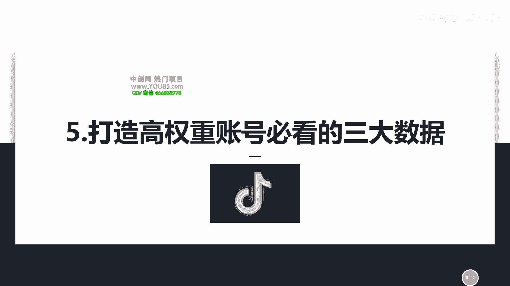
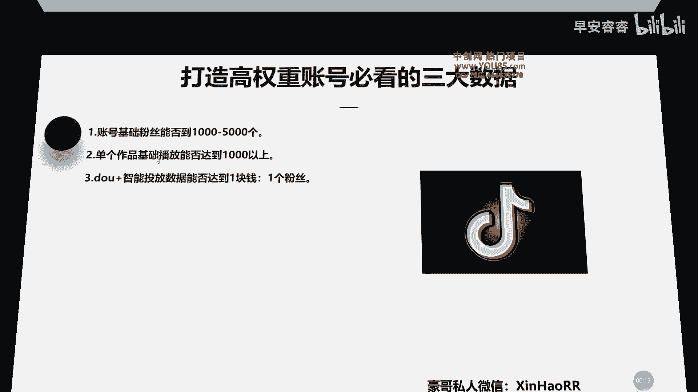
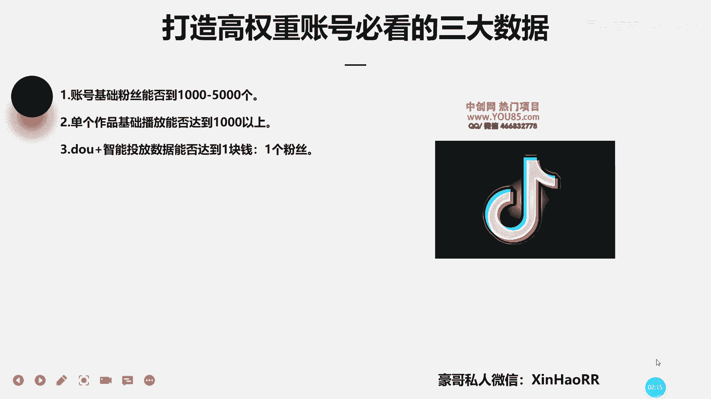

# 053 抖音独家起号，一天引流500+精准粉，适合各类行业（9节视频课） - P5：第五课：打造高权重账号必看的三大数据 - 早安睿睿 - BV1br42157St

呃大家好，我是星耀的豪哥，然后呢咱们这节课主要来给你们讲一下，就是说怎么去看咱们的这个剧账号权重高不高，流量精不精准呢，然后主要主要是看这三个方面的一个数据。

然后第一个哈其实它很简单。

你只要看这三个点一般都可以的啦，第一个你账号的技术粉丝能否干到一起，1000~5000个，首先你干到1000~5000个的话，通常它的基础播放都不会太差啊，那是第一个点，然后第二个点的话。

你单个作品的基础播放能否达到这个1000以上，什么意思，比如说你发了十个作品，对不对，那你十个作品有八个作品，它的一个基础放在这个基础的播放，怎么也达到这一个1000以上的。

就证明了你这个账号的权重呢是比较高的，然后标签的话通常都是比较精准的，懂了没有，他可以推理论都是比较好的，如果你有每一个作品上都给你推1000播放，但是你这个作品怎么样的点赞互动。

然后别人给你点关注的这个次数特别特别少，这只能证明你账号的标签怎么样没有打上啊，没有打上，所以说你要去按照我前面那个抖家的一个，投放的一个方法来的话，通常这个账号的标签都能打得准啊。

然后你那个作品的话尽量要做到优质，优质加优质，因为我发觉很多那个作品做的都不行，对不对啊，然后后面的话怎么去做作品，就是通过什么样的一个方式呢，咱们后面的课程也会给你们提了一下啊，然后第三个点。

咱们斗家智能投放的数据，能否达到一块钱一个粉丝，如果你抖下智能投放这个数据呢，达不到一块钱一个粉丝，对不对，那就证明你账号的标签没有打上吗，如果你是一块钱0。9个粉丝呢，比如说你一块钱啊。

然后有或你一块钱的话，就是达不到一个粉丝，但是也有0。9个粉丝的话，那这样的数据呢其实相对来说也是可以的，对对你可以继续去投放新的作品，看一下去投资一个资哪个推荐，如果你第一个投资人推荐的话。

他的那个数据的话啊，差不多一比一，但是没有完全一比一的话呢，那你去看一下第二个作品，看一下去投这个资源，看一下他能不能达到一比一，懂了没有，因为你前面这个打人投放，我们知道你要去投资人了嘛，对不对。

所以你去看一下啊，如果能达到的话，总体能够达得到的话，那基本上你这个账号的标签就打上了啊，那咱们这节课主要就讲到这里，有什么不懂的问题的话，欢迎你添加豪哥私人微信啊，咱们一对一来个做一个诊断啊。

有什么问题的话。