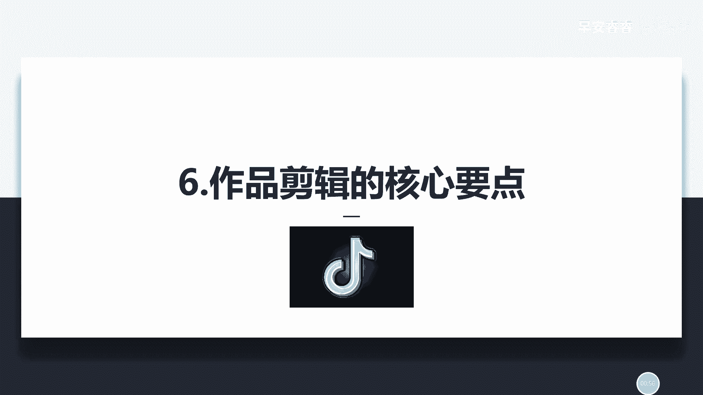
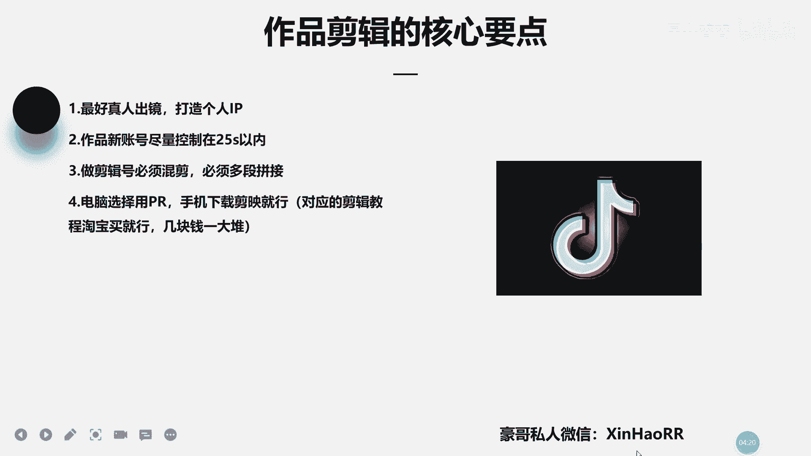

# 053 抖音独家起号，一天引流500+精准粉，适合各类行业（9节视频课） - P6：第六课：作品剪辑的核心 - 早安睿睿 - BV1br42157St

呃大家好，我是新奥的豪哥，然后呢咱们这节课主要来讲一下，就是有关这一个作品剪辑的一些核心要点，然后其实作品剪辑它并不难哈，但是看你是剪什么样的作品，比如说你的作品有一分钟的一个长度。

那剪起来自然而然就比较难了，比如说你是想做一个真人出境，就给自己录一段视频的话，一般都不会太难的，通常就配个字幕加一加转场，搞好看点就行了，对不对，然后加加的一些配乐啊，如果你是做一些剪辑号的话。

比如说有一些剪辑号，比如说是啊剪辑一些汽车的，对这些的话难度就相对会大一点，因为也涉及到一些比较复杂的一些东西，其实包括不单单是你们，包括我自己，我自己剪辑的话，能力是不咋地啦，我只会一些基础的操作。

因为我只会投放，对不对，你必须那我的优质作品平时是谁给我做的，是让我工作室的一些小助理啊，让他们去帮我做的，因为他们剪辑的话相对是比较厉害的嘛，对对，所以说我就让他们去操作对对。

如果你们操作的话，尽量也要操作好啊，然后首先第一个点我给你们个几个建议，如果你们做抖音的话，我这边给你的建议就是怎么样，最好就是真人出镜去打造你的个人IP，因为你不真人出镜的话。

你去网上搬运一些视频过来，这边的话呢抖音的话就是说在抖音里面，很多人都是搬运视频放到抖音里面去发的，但是如果你帮了这个视频呢，比如说你在B站找个视频呢，你在抖音去发，然后刚好你这个视频别人也找过了。

对对，然后你们两个人发的是同一段，那你这个你这个直接就冲突了吗，那抖音他是可以判你抄袭的，懂了没有，抖音他是可以直接说你是抄袭的，懂了没有，那很容易就违规，所以说尽量就不要这么操作，就说我觉得最好。

就是说现在想要做抖音去赚钱的话呢，无论你是长得好看，长得丑，对不对，你尽量都要去真人出镜，去打造你的个人IP，因为你只有个人的呀一个IP，你这个流量才能够吃得久，对不对，包括你想通过去做好这个引流。

对不对，你你现在你在抖音里面想引流的话，通通基本上哈正常情况下都得去打造一个人IP，比如说你是做知识博主，对对做这个知识的博主，比如说你是教这个育儿类的，对不对，那你教育儿类的话。

那你可以把你打造成一个啊，专门做这种的人物的这种形象，你把它打造好，那你能够打造的好的话呢，那比只要你的那个个人签名那里有留那个微信，比如说刚刚好别人也有你这种知识的一个需求，那他就会去加你微信。

所以那你怎么去跟他说服，怎么去赚他钱，这这个就是你自己的问题了，懂了没有啊，这是第一个点，那第二个点呢咱们作品这个新账号那个作品啊，新账号的作品尽量控制在25秒以内，不要发太长了，因为你太长的话。

那个完播率不行，因为通常新手小白的话，作品内容都很一般对对，如果你们可以专门找一个人帮你剪辑，帮你拍视频，那个字是最好的啊，然后呢你如果想做剪辑号的话，那你最好就采用混剪的一个形式。

然后进行一个多段的拼接，比如说你去B站找到了一些素材，然后比如说找到了啊，比如说你想做一个汽车的一个账号，对不对，那你在B站里面给他找个四五段素材，然后每一段素材里面都抽一点出来，抽个两三秒四五秒吧。

然后去拼接，然后加该加中场，加中场，该该这个水平方转水平方等等等等啊，比如说你们有一些人，他不你不会剪辑，对不对，你不会剪辑怎么办，我这边可以给你几个方法哈，你直接在这一个啊。

在淘宝里面去买对应的剪辑教程，比如说你在淘宝里面对不对，然后你是用手机下载这个剪映了，然后用剪映来剪视频，但是你不怎么会用剪映的话呢，那你可以去淘宝买一下这个剪映的一个教程，几块钱一大堆对。

因为剪映的这种教程在网上是很多的，我自己不专业，你要专业的话，你就去淘宝上找几块钱一大堆，那些视频的那些教程，你可以去学一学，包括PR也是一样的，你去淘宝上搜就行了，有很多很多，这都是用来怎么样。

都是用来给你剪辑作品用的，懂了没有，所以说这就是作品剪辑的几个核心要点，你要去把它把握住，其实这种东西它没有什么难度，但是现在玩抖音的话，因为现在也不像之前嘛，比如说你做180180的话。

你随随便便剪一些电视剧，你都能够挣到钱，但现在不一样了，见证它的规矩比较严格，所以说最好你想通过抖音去赚钱呢，你最好就是真人出镜啊，最好去整租金比较好，比如说或者是你实在不知道做什么类的。

正好后做什么类的账号，又或是你觉得这种账号做起来有没有前途，你可以问一下我好吧，你可以添加我的微信，这个右下角，反正你不懂的问题随时问我就OK了，好吧啊。

