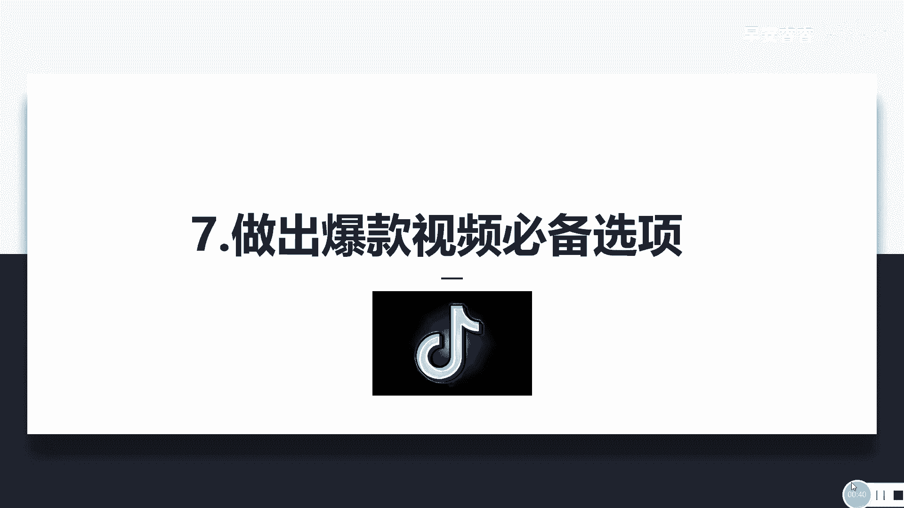
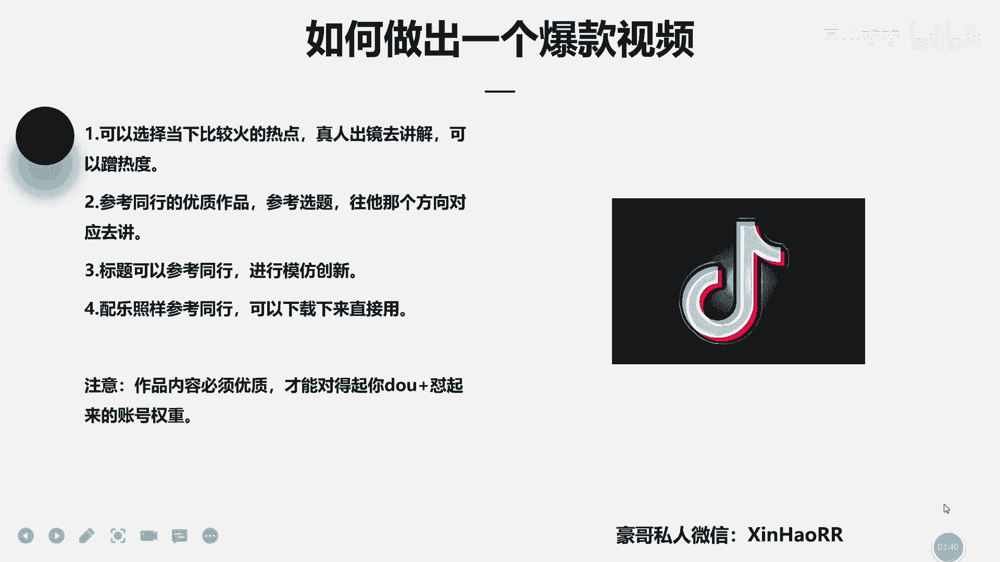

# 053 抖音独家起号，一天引流500+精准粉，适合各类行业（9节视频课） - P7：第七课：如何做出一个爆款视频 - 早安睿睿 - BV1br42157St

大家好，我是新奥的豪哥，然后呢，咱们这一节课主要来讲一下，怎么去做出一个爆款视频，其实爆款视频这种东西呢说难不难，说简单也不简单，对不对，重点就是在于你的一个剪辑，跟你这个账号流量有没有怼起来。

比如说你账号的这一个流量呢，就是说按照我前面的这一个抖，加投放的一个方法对对，然后基础播放也干起来了，然后基础的粉丝也干起来了，对对，那你再去做出一个爆款视频的话。

其实那你这个视频就火起来是相对比较简单的，因为你有流量了，你有基础流量了，然后你账号标签是准的，那系统给你推的流量又是精准的，那你这个作品内容只要你够优质，对不对，那你火起来的速度是相对比较快的。

其实你看看第一个点哈，你可以选择当下比较火的一个热点，真人讲这个真人出境啊，去讲解啊，这样子可以蹭到一个热度，比如说他那个网上不是有一些知识博主，比如说某个啊，这这段时间他不是高考吗。

比如说某个农村哪村的，有个有一个高考啊，然后他高考考到了一个清华的一个学校哈，然后然后那些做知识博主人就出来讲了，那那那那他这个时间段怎么样，他就直接去蹭到了这个热度嘛。

对对你可以去看一下最近的一些热度啊，政治类政治类的东西你就不会去蹭了，但是比如说讲到这一些励志类的东西，这种热度你就可以去蹭一蹭，对不对，你可以在那个抖音，它不是个搜索框吗，你点开那个都搜索框。

它然后它滑下来哈，然后那里面有个抖音热榜，里面有一些就跟热点榜有关的，你可以去看一下，看一下你能蹭到哪些，对不对啊，这是第一个点，因为你蹭到热度的话，嗯比如比如说你这个作品流量是精准，对不对。

然后你这个账号的这个基础本身也是起来的，然后要流量有流量，要粉丝有粉丝要，然后你的标签也是OK的，那你此时去蹭到这个热度的话，那他你去蹭这个热点的话，然后系统是会给你推更多的这种热点流量的。

那你这样子的话，你这一个作品活起来的速度怎么样，是不是会更快的，懂了没有，那是第一个点，第二个点的话，你要去参考你这一个同行的优质作品，去参考他的一个选题，往他那个方向对应去讲。

比如说他讲的是这一个农村的某个人，寒励志考上了一个清华大学，考上了北京大学，对不对，那你可以往他这个方向再去收集一些他的题材，然后再去讲一讲，但是我没叫你抄袭人家哈，你不要去抄袭人家。

你可以往他这个方向去讲一讲，对不对，然后画自己去编一编，就看一下同行怎么编的嘛，那第三个点，你标题的话，你可以去参考同行，标题是很关键的，你视频内容跟你的音频都比较好的话，那你的标题也很重要哦，对不对。

你可以看下同行是怎么写的吗，去模仿创新一下他，但是不要照光照抄，然后第四个的话，你配乐的话这样抄参考同行嘛，比如说他在讲一些故事类的，或是讲一些人物，励志类的一种视频内容的时候呢，他会加一些配乐嘛。

然后然后显得他这个就很更加的去打动别人，去听他讲的这个故事，懂了吗，所以说这个配乐也很重要，你可以去参考一下，看一下同行用的是什么配乐，如果可以的话，你就把他那个配乐怎么样去找一下，去网上找到这个配乐。

把它下载下来用就行了，比如说你去QQ音乐对不对，直接去找，然后把它下载到本地就可以了啊，然后你就这边还有个点，你想做出爆款视频的话，一定要满足几个点，哪几个点，你的作品内容必须得够优质。

不然的话你作品内容都不够优质，那你就是对不起你抖家怼起来的一个账号权重，对不对，那他给你推的流量你也就浪费掉了，懂了没有，所以说你作品内容必须得做到优质啊，你不够优质的话不行。

所以这个就很锻炼你的一个拍视频的能力啊，以你的一个剪辑的一个能力，就是对应的教程呢，你可以在淘宝上去搜嘛，上节课咱们也说了，你去搜就可以了，有很多好，那咱们这节课就讲到这里，有什么问题的话。

欢迎你添加豪哥私微信啊。

