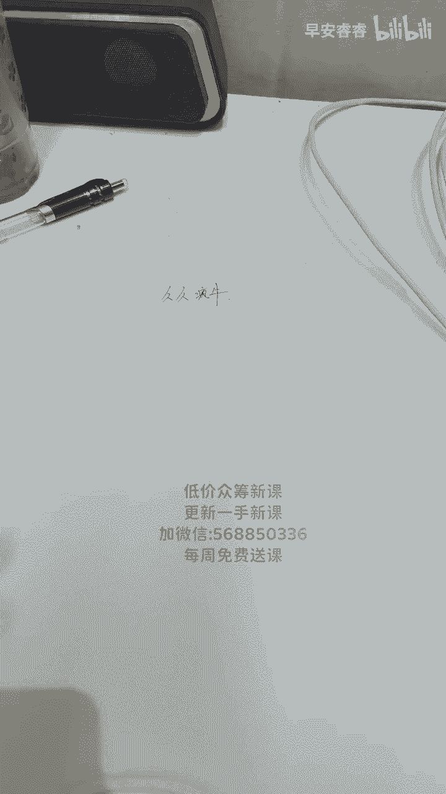
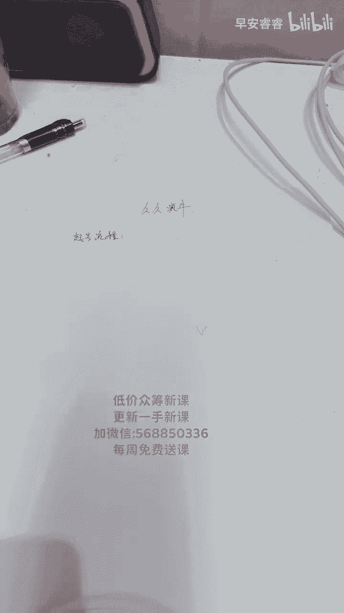

# 053 抖音直播-纯自然流量起号，起号逻辑  话术实操培训（更新至4月） - P4：4月9日起号流程课- - 早安睿睿 - BV1Ef421X7GH

不好意思啊，兄弟们，今天晚上耽误了你们一丢丢的时间啊，不好意思不好意思，不好意思哈，非常的不好意思，嘶嗯，定时开售链接做完，他们预约了好多，6月3号开售，下一步怎么弄，直接取消吗。

你用的定时开售的链接吗，你说句良心实话，这个我不能忽悠你啊，这个我还真不知道，我还真给你问问，因为真没做过这种定时开售的链接，你知道吧，我得给你问问，懂吧，嗯因为我们真没有用过这种连接，知道吧，起来。

不是去泰国了吗，我是不就搁泰国吗，嘶我啥时候讲课，给你们讲过预售链接啊，预售链接具体怎么玩，我什么时候给你们讲过预售链接啊，嗯今天讲什么呀，今天讲你不会的这个问题问的非常好啊，啊今天讲什么讲，你不会的。

你什么不会，你告诉我嗯，你什么不会，你告诉我，你什么不会，今天给你们讲什么，好不好，有多少新人新人扣个一，来今天讲几号吗，讲啊今天讲几号，新人有多少新人来扣个一，我看一下来有多少新人，有多少新人。

哎呀哎呀咿呀哟嘶，育儿有方新人，663 16，宋一小邓青衣，全是新人啊，拉流量和洗流量不会天天讲嘛，拉流量和，几瑞亚不会，稍微给你讲讲吧，我尾货服装过款包怎么怎么起。

一样起也得单拼起单品起模型播两个月了，才开始有流量，今天两个小时一现场还出了一单嗯，今天刷到我直播间了，刷到我直播间里不够，不知道给我卡灯牌嗯，你们以后刷到我直播间，能不能给我卡个灯牌。

我这边人气并不低啊，兄弟们，是不是啊，那个抖八零后如姐的故事，你今天刷到我直播间的时候，我直播多少人啊，你今天刷我直播间的时候，我直播多少人没卡呀，卡了吗，兄弟们卡了吗，卡了没有，哦你说卡灯牌的呀。

你和老杨蛋都卡了啊，他是说卡灯牌了，我以为我说卡了呢，想带基地的货要开抖店吗，不需要的啊，嗯没卡，你们今天早上谁有有谁刷到我直播间了吗，你当时说要拉黑我，我拉黑你，你才卡灯牌啊，哎呀那我这边多少人。

当时去的时候，我今天早上人气并不低哦，有次半夜刷直播，你说自己睡不着了，来直播了，我晚上一般用那个大号播，那个25万粉丝的那个号播，你知道吗，我白天一般不用那个大号，我我正儿八经直播。

我都会用那个小号播，懂不懂，我不是直播间没流量，你知道吗，我这边也有也有也有流量啊，你正经八本的马敏不卡，灯牌都踢出去，知道吗，那不提咋整啊，一个个的趴，那老是听录屏，也不说话，嗯也不说话，是不是啊。

嗯好了，正式开始吧，兄弟们啊，行不行，刚好刷到你在拉榜单上，在榜单上拉人，嗯啊那人不多了，那应该也有个几十个人吧，也就哎也几十个人，哎，这个钉钉怎么啊，这个钉钉翻转摄像头更新了，这是哎这个手机清楚吧。

这个手机清楚吧，我发现了14的手机真不如13哦，14pro max真不如13清楚，这个手机清楚是不是是不是啊，对不对啊，还有人卖咱的课卖呗，那玩意克不值钱，克不值钱啊，服务值钱，上午播的时候讲的特干。

唉，那都是洒洒水啦，在这里边讲的不比那个更干嘛，嗯这个清楚是吧，这破手机不行啊，这是个14，这是个14，我现在给你们开播的是个13，你知道吗，挖槽这这么坑吗，14摄像头这么污吗，真的14摄像头这么污吗。

你看这14张图，现在可无13摄像头，你看我操哎呀，苹果越来越坑了，看一下啊，看一下抖音，看一下抖音的封禁啊，让我看一下，你们你们小心点啊，账户已被关停，所有广告计划已被停止投放时间，惩罚时间。

2123年4月9号19点二七，封禁100年啊，封禁100年，你知道吗，2123年4月9号19点二十七四十二分，封禁100年，你们小心点。

小心封禁你们100年，我还打算去买14，别买14了，等15吧，我买了拼多多九块九的课，又来买了2000的课，买的是服务对服务啊，嗯等等咳，那个课拼多多那个课没有用的，也不能说没有用，嗯但是它不持续啊。

卖的啥，这夸张封你100年，小心点以后啊，来兄弟们啊，今天我先把嗯正规的一个起号流程，给你们讲一下吧，好不好，起号流程行不行啊，我觉得最近你们有很多人遇到的流量，都很不正常，好不好。

我今天正儿八经给你们讲一下，行不行，嗯九块九给套话术嗯，会长开播25分钟，直播推荐100，下播重开25分钟还是100，咋回事啊，哎呀你广场不开，你的流量不开广场口子啊，你的流量不开广场口子。

你们想不想听听起号的流程，你们想不想听啊，给你们讲的细一点好吧，给你们讲的细一点嗯，起号的流程，包括你们遇到的那种流量的结构好不好，都给你们讲一下行不行，我觉得这一块应该能帮到你们，我手指盖怎么这么脏。

我手指盖怎么这么脏，这不纯纯纯纯纯纯纯纯的，不要面子吗，这不是这么脏吗，我手腕怎么今天这么脏，在那播醋播的，我是我今天在那播醋来着，我今天上午下了直播，我又在播醋来着，播了两个小时的醋又这么脏。

手指盖新人第一次听课啊，那你得那你得好好听啊，听过你讲的，但是钩子转正价不会转嗯，挖土回来了吧，播的咋样还行啊，我就播了没有两，我播了20分钟左右吧，嗯20分钟十个人平均十个人在线，我炸了17单还行吧。

平均十个人在线。

他们一单炸一单，炸一波，炸一单两单，我拉了20分钟，我一共炸了17单，还凑合不啊，我觉得还凑合啊，反正就是十个人八个人的，因为醋那个直播间你们知道新号没有多少人，十个人八个人嗯，不是第一场了。

第六场还是第七场了，第六七场了吧，一直是他们在播，也用钩子拉嘛，不用钩子，不用钩子嗯，个位数要不到互动咋办，我就纳了个闷了，怎么个位数要不到互动嘛，怎么兄弟们，你们为什么说个位数要不到互动呢。

嗯为什么说要个位数要不要互动，平波咋拉呀，用鱼了吗，没有没有用鱼真实成交啊，我看看啊，罗盘还有没有呃。

这个样吧，我今天给你们拓展一下好不好，今天给你们拓展一下，但是你们不要去搜我这个账号啊，我看看罗盘还有没有啊，如果罗盘有的话，我给你们，我给你们看一下这个账号我怎么播的，好不好，让你们看一下啊。

我看看还有没有罗盘啊，行不行，个位数进的像死人都不说话，钩子是啥，没有钩子嗯，先养起号啊，个位数我昨天点了点，有效果有效果是不是嗯先养起号吧，好的啊，听你们的啊，其实我想让你们看一下这个号很经典。

但是对你们一定有帮助，过了二天只会点点点成交，不会马免留人，点着点了不点还好，我就是每天有时候给你们上课，我都蒙圈，我都蒙圈，我自己都蒙圈，一会给你们看看吧，电脑开不开了，来先给你们讲起号吧。

哎呀先给你讲气泡吧，讲个美颜几号吧，电脑没打开，唉打开了嗯，其实我特别想让你们看一下，你知道为什么吗，兄弟们，因为你们最近遇到的嗯，流量账号流量都很恶心啊，不是你们自己一个人在遇到，是所有人都在遇到。

懂不懂，所以我想让你们看一下，懂吗，哪怕你是纯小白，懂不懂看这种数据，我觉得对你们是有很大帮助的，能理解吧，嗯对这两天流量很怪啊，所以我让你们看一下，就是个位数，你们怎么去播的，我个位数怎么去播的好吧。

并不是说向你们去炫耀什么，懂吗，只是让你们告诉你们，我在去处理这个流量的时候，我是怎么来处理的是吧，间流量很多，对兼流量很多嗯，让你们看一下，我看看啊，正在配置啊，晚上好啊，晚上好嗯。

我希望你们能从这个罗马哎卧槽，他关了吗，他是关了吗，啊我看下还有没有啊，如果需要灯的话，就没法让你们看了，如果不需要灯的话，我就可以让你们看，十778369，有时候有一些经典的案例。

你们是可以从里面学到很多东西的，因为这种东西只有跟你们自己学员去看懂吗，别人真的是不会去看的，因为这个东西直接涉及到涉及到流量的核心，你懂吗，真的涉及到流量的核心，在哪个里边，没有在这个浏览器。

我看一下啊，在哪个浏览器里，也没带这个浏览器啊，这个吗，嗯不行了，看不了了，看不了了，现在罗盘这么恶心吗，断网之后就登不上了，看不了了，兄弟们啊，下一节课吧，下节课给你们看一下，好吧嗯嗯非得留80。

正常好吧，正儿八经给你们讲课吧，啊我非得也差不多80啊，我流量建立呃，一个小尖儿啊，都憋30分钟都不行，来我先给你们说一下这个问题好不好，嗯呃我先跟你们说一下起操的流程。

然后一会我来给你们处理尖尖的一个，今天的一个流量好不好，先跟你们说一下调的流程啊，就就是想看十多万人怎么拉的，对不对，其实我也想挺想让你们看的，真的我挺想让你们看的，懂不懂，我连上WIFI啊。

我这号我这个流量不大正常，给你们10分钟时间好了，开始了，兄弟们啊，额我不看你们公屏了啊，我把它关上了好不好，呃正式来讲几号行不行啊，正式来讲几号呃，首先起号第一点啊，起号第一点呃。

我不知道你们嗯多么白啊，然后我就从白了开始讲好不好，我就从白了开始讲啊，但这场几号我会讲到一个非常重要的点位啊，行不行，你们仔细去听好吧，来先说咱们整个起号的流程啊，啊大同小异啊，基本都一样啊。

基本都一个样，首先第一呢就是我们首先要定你的直播间啊，的人，就是你用直播用几个人啊，这一段是讲给小白听的啊，老鼠可以现在闭耳朵了啊，老鼠可以闭耳朵了，小白第一次听课的，你们要听一下好不好，呃。

我们嗯直播间基本上有三个配置啊，一个就是我们非常重要的一个主播位置，懂不懂啊，一个中控位置懂不懂啊，还有一个运营位置，这三个位置分别它的功能是不一样的啊，这一段小白可以呃闭上耳朵啊，呃主播听好了。

主播在直播间是干什么的，直播间主播就是在你镜头前面出品的，那个竖品的核心点在哪里啊，竖品为什么叫竖品，就是他一定要清楚明白了解产品的功能，和它的材质，啊就是别人花钱买到的是什么，这个你要明白是吧。

这个你要明白啊，然后第二个呢就是中控，中控是谁，就相当我现在这个位置，这个位置是拉号的啊，拉新素品，啊毕业单，懂不懂，这个是需要中控来做的啊，就是你在整个直播间的控流量中控控流量，懂不懂，控流量。

这是你要做的，懂不懂，然后运营是干什么的呢，就是你的链接，等等你的链接，然后包括你直播间的节奏等等，包括在公屏上回复，包括你的罗盘流速，这是他要做的东西，其实一个运营正儿八经的活其实挺多的啊。

他是完全为了配合你的中控来做这些动作了，因为你中控在拉号的情况下，有的人流量感知比较强，能感受到直播间流量的变化，有的人流量感知比较弱，他感受不到等等，那这个时候你的运营就要去提示，去提醒，能懂吗。

就要去提示，就要去提醒，能不能理解，所以说这是你们基本上直播间的一个配置啊，三个人足够，无论你播大厂还是播小厂，三个人基本足以了，一个运营，一个中控，一个主播懂不懂，那OK那我们正式来起号。

我们起号我们起号你的前期的一个目的是什么，就是我们的一个模型问题，其实这个模型困扰了很多的人啊，就是模型困扰了很多人，到底怎么样才能建模成功，我直播间个位数，我怎么来建模，我直播间流速非常大。

我怎么来建模，懂不懂啊，那我今天就换一种不同的方式，来给你们反对一下，好不好，来给你们反对一下，首先第一我的直播间流量少，流量少，啊我怎么来建模，流量少，如何建模，好不好，你的所有的产品。

当你直播间流量比较少的情况下，你们记住啊，流量比较少，就是开口比较小，然后流速比较弱，这边人也不多啊，一个两个三个五个的啊，这种的账号你怎么来建模型，听好了，在流量比较少的时候。

你在直播间的话术以什么为主，人性话术为主，因为我们的话术里边，你们专门上冒仿的罗盘课的时候，他会告诉你们啊，有拉新，有速频，有逼单对吧，有痛点有保障，有人性话术，有场景话术，有使用话术，还有价格三分化。

还有价格对比话术都有，是不是啊，那在你的流量少的时候，人性话术为第一点，为什么我们要用人性话术，作为你直播间的核心话术点，是因为人性话术可以拉近我们之间的信任感，懂不懂，拉近你我之间的信任感，能明白吗。

越少的时候越要用人性话术等等，多了的时候你可以用人性话术来逼单，少了的时候你可以用人性话术来拉信任，那有了信任才有什么交流和沟通，懂不懂啊，这是你们要改变的一个点啊，懂不懂。

不是所有的主播都是以主播腔在直播，懂不懂什么是直播，直播面对的是形形色色的人，面对不同的人说不同的话，见人说人话，见鬼说鬼话，可以这么来理解，懂不懂，那人性话术指的是哪方面呢啊可以理解成，卖惨哭穷，啊。

对不对，讲故事，聊人生，聊对方熟悉的事，这都属于人性话术，懂不懂啊，你们在直播间三俩五个人的时候，你们正常卖货，你们是卖不掉的，懂不懂，你们正常卖货，你们是一定是卖不掉的啊，但是你去在跟他聊天的时候。

你记住所有的人都是同情弱者的，看到这个时候你可以求对不对，求求大哥不要走，懂吗，我一个小姑娘来创业不容易，我一个宝妈带着孩子不容易，能不能陪我一分钟，哥哥懂不懂，这都属于人性化说的范畴，建立信任。

建立信任的同时有了沟通，我们有什么就有了互动，这个时候你的目的很明确，为的是流速，懂不懂，这个时候你的目的很明确，为的是流速，当我们人少的时候，我们的直播为的是什么，为流速。

记住你们每一场直播都需要有直播的重点，那么流量少，我就要拉流速，对不对，在拉流速的过程中，你要去做一个人工干预的动作，什么动作拉黑，不是所有的人跟你聊天，你都要跟他聊的，拉黑懂不懂拉黑拉黑什么。

拉黑非必要的人群，那这个时候又有人问，说会长那个我这边就俩人，我还需要拉黑吗，俩人也拉，那俩人也拉什么呢，为什么来降低非必要人群，他的停留，降低停留，懂不懂降他的停留，因为这个时候你的场官非常的弱。

但凡在你直播间有那么仨聊，三个人，两个人在你直播间长时间停留，一定会影响你直播间的流量标签，所以说这个时候你要降停留，也就要拉黑这个动作一定要做什么啊，如果他是你的购买意向人群。

甚至于他是你想卖的那个性别，你别管他年龄大小，他只要能在你这边说话，你就要尽量的挽留住他，这是流量少的时候，那再一个这个时候你的点对点，你的点对点什么，你的点对点的目的是什么。

你的点对点的目的不是为了卖货，记住啊，你的点对点的目的不是为了卖货，这个时候你卖不出去，这个时候你一卖货，你就会跟他站到一个叫对立面啊，对立面懂不懂，那你要干什么，你要拉近你们之间的距离。

拉近你们之间的感情，那你就要跟他站到同样的位置，你可以让自己成为什么，让你自己成为一个东西叫员工，懂不懂，你可以让自己成为一个员工，能理解我说什么意思吗，嗯成为员工，你也可以说什么，你是个宝妈。

你是个宝爸，对不对啊，也可以说是什么大学生创业，都可以在人少的时候，一定要让你的人设在直播间呈现出来，要让他知道你是谁，你要在直播间干什么，懂不懂，因为你在直播卖货的时候，你有小黄车在弹。

他一定知道你是在卖货的，但这个时候你反而不提卖货，为什么呢，因为你一提卖货，他立马走人，懂不懂他立马走人，当你把他拉住这个停留，建立信任感之后，然后你再去用互动来去拉后面的人。

也就是说你现在所有的点对点动作，只为两个字留存，懂不懂，只为两个字留存，你只要把留存率做上来，你就是OK的，怎么能把留存率做上来，你就是OK的，如果留存率做不上来，你的账号基本上会躺平，懂不懂。

所以说我们不能去遇到躺平的账号，当我们遇到躺平的账号，我们一定要控制我们的语态，语速，等等，一定要控制我们的语态和语速啊，千万不要着急，千万不要颓废，千万不要慌，基本上前三场你都会经历这种这样的事情。

前三场那么流量少的，基本上需要拉三场，懂不懂，那这三场你如果没有成交可以吗，对不对，当然有成交是最好的，没有成交也是没有办法的，如果你有鱼塘的情况下，如果你有鱼塘的情况下，鱼塘啊。

你在第二场记住你在第二场的时候进行补单，懂不懂，在第二行的时候进行补单，第一场尽量不要去补，懂不懂，因为第一场你的流量很泛，甚至于你的人群画像都很泛，你通过第一场的拉黑，通过第一场的拉停留。

降低非意向人群的停留，你的第二场，你的人群画像，基本上会倾向于你想卖货的那批人，能懂吗，所以说你在第二场去补单的时候，来到你这边的人会更精准，懂不懂会更精准，所以说我们每场直播我们都要有目的。

我们流量少的目的，那我们就是拉流量，拉流量的第一个不是拉在线，记住拉流量不等于不等于拉在线啊，很多人都有一个误区，就是我流量少，我想拉流量，我一定要拉高在线是吗，嗯我可以告诉你不是懂不懂。

拉流量的目的是为了拉流速，懂不懂啊，问号也是要求流速，所以说它不等于在线，但它是等于流速，你拉流速，它的流速的一个推流速度，推流速度，有什么啊，有记忆，为的是你下一场的铺垫等等，为你下一场做铺垫。

因为这一场你知道你是卖不了货的，所以说你就干脆不要去卖货，但是你必须要挂货，你必须嘴上不离货，那OK这个时候有一个叫话术的问题啊，话术的问题你怎么来设计了，那么如果说你有3分钟，或者你有三句话术。

这里边其中有一句一定是素品，懂不懂，这里边一定有一句是速品，话术能明白吗，就是每聊一段话，你都会有一个观点，或者有一个面儿去干什么，去讲解产品啊，讲解产品懂不懂，你哪怕跟他聊，你哪怕跟他聊什么。

你哪怕跟他聊这个呃，聊这个什么，聊这个这个这个这个呃他的故乡啊，聊他当地的风土人情，你都可以绕到你的产品上来，懂不懂，你都可以料到成产品上来啊，怎么来讲呢，假设你是卖鼠标的，对不对。

你在前期没有讲鼠标是不是，但你跟他聊是不是啊，哥哥你是哪里的啊，我是河南的，河南哪里，河南郑州的，是不是，哎哥哥，我也是河南郑州的啊，我有个姐姐在河南郑州，哎姐姐哥哥。

我问一下你们那边用这种鼠标的人多不多啊，你们那边用这种这种鼠标的人多不多，我今天第一天上班，对不对，然后老板让我来卖这个鼠标，然后这边也没人，你看就你自己是真人，哥哥非常感谢你在直播间陪伴我哦。

哥哥非常感谢好不好，嗯你要是有有有时间的话，你在这里稍微陪一会儿妹妹好不好，你要喜欢这个鼠标的话，一会儿妹妹给你安排一下子好不好，哥哥就是你的话术里边既有人情世故，还有产品的讲解，干什么，在他的潜意识。

这个时候你千万不要去刻意的将你的商品对吧，一定是引入潜意识，我希望你们能理解这个点啊，就是你在无形之中就会提到你商品，无形之中就会提到商品，无形之中就会你的提到你商品，在你们聊天20分钟的过程中。

你可能提你这上面提了十几次，但是你从来没有告诉他，你要卖给他，懂不懂，那这个时候你跟他就一定不是对立面，你俩的沟通聊天就一定非常愉快，懂不懂，这是你流量少的时候，懂不懂，目的是干什么，搞清楚好不好。

搞清楚这场目的，然后你为了是干什么，拉你的流速，拉你的推流速度，拉你的推流记忆，为的是你第二场第三场的铺垫，当然这一场你必须完成有效的直播，时长多久，至少大于两小时，无论你多么的难，至少大于两小时。

懂不懂，两小时到三个小时之间，这个是你必须要做到的，不要问我为什么必须要做，没有为什么好不好，兄弟姐妹们嗯，两个小时到三个小时，你相信我，拿出你的状态啊，去播正常作品，正常去播，没有人的时候。

你可以闭嘴不说话，但是进来人的时候，你一定要非常热情的接待他，就跟有一个客户来到你家店里，是一模一样的那种感觉等等，流量少的时候，用你的人性话术打信任，做沟通，做互动，做交流等等。

在你的流量往上起量的时候，到了三五个人，十几个人的时候，你再去干什么，你再去放钩子，放福利啊，都是可以的，能懂吗，当你的直播间一直稳定在两三个人，三五个人的时候，尤其是新号开播。

一定不要去过多的讲解你的商品，甚至于不要去刻意的去卖你的商品，不要来一个人去卖一个人，你真的是卖不动的，你不单卖不动，你会把这个人直接赶走，相当于你在赶他，除非你对你的商品特别有自信。

除非你对这个人把控的特别明白，你知道他来到你这边就是买货的，所以说你可以直接问他哥哥，你是不是来买核桃的，嗯啊你是不是来买核桃的哥哥啊，如果是你给我打个四好不好，今天你痛快，我也痛快好不好。

这个核桃平时你在家里买一个多少钱是吧，七十八十一百多，是不是，哥哥今天我给你拍一发二行不行，哥哥在这陪我一会儿拍一发二好不好，价格你就不用担心了，对不对，我来做品宣的，今天我给你一个破价的福利好不好。

今天只有五单，为什么呢，每一单我都亏好几百块钱，今天只有五单，行不行啊，你明天也能买，后天也能买，大后天你还能买，但是我向你保证，明天后天大后天你一定拿不到，今天的价格，因为只有五单，我是做破价福利的。

能听懂这句话术吗，能听懂这个话术吗，能不能，一定要学会，当你在直播间对你的产品特别有自信的情况下，你去点到你这边的某一个人，他的诉求和他的意向非常明确，他来就是买东西的，那这个时候你为了让他成交。

你一定要抛出你的浮力，抛出你的浮力，浮力抛出你的福利，并不是抛低价，记住啊，浮力不代表低价，福利是在素品完事之后，素品完事之后的性价比啊，这句话术我屡试不爽，懂不懂，其实就解决了三个问题。

第一我为什么要买，为什么要在你这里买，为什么要今天在你这里买，为什么要歪啊，因为今天你喜欢我这里正好有，是不是啊，那为什么会在我这里买呢，对不对，因为咱们两个有什么信任基础，你痛快我也痛快。

我今天不憋单，不麻痹，不套路，不忽悠哥哥，你就说你需不需要，对不对，你可能玩了一辈子核桃，但是你不知道核桃他究竟是一个什么样的品质，什么样的材质，什么样的核桃叫好核桃好不好，我花一分钟的时间给你讲一下。

当讲完的时候，你就会告诉他，你说哥哥今天你痛快，我也痛快，对不对，你拿回家，这只核桃如果玩的好，你能不能给我做一波宣传，能让你给我打个能，你只要能妹妹直接再给你个惊喜，记住两个字叫惊喜好不好。

只要你拿回家对不对，用的玩的跟我说的不匹配，你直接给我扔垃圾桶里，砸碎了，给我寄回来都可以，但如果说你玩的好，玩的明白，对不对，对咱们家的产品品质也认可，那能不能给我做一波宣传。

你只要说能老妹儿今天再给你安排一波惊喜，好不好，哥哥嗯，基本上一般人都会说能对不对，那如果能呢，听好了，哥哥对不对，这个核桃你平时买要不要百八十块钱，是不是一个百八十块钱，是不是今天听好了。

哥哥今天我直接给你拍一发二可不可以，哥哥拍一发二可不可以，好不好，你不用担心价格，因为今天我说了，我来给你做破价福利好不好，当然咱们家是做工厂的，对不对，咱们家的这个货每天都有，但是哥哥我告诉你。

今天在我直播间是破价福利，只有五单，谁先抢到算谁的好不好，谁能先给我做宣传，我就先给谁上，今天在我直播间，不是谁想买都能买，是我要让谁买，谁才能买，能明白吗，所以说哥哥不用担心价格，今天这对核桃听好了。

拍一发二，一个要100多，两个要200多，今天50不要40不到的一个价格，我直接让你带回家，相信我这对核桃带回家一定是高品高货，高质量是啊，跟你市场上买的三五百，四五百的核桃是一模一样的啊，手感也好。

棱角也好，方方面面也好啊，都是非常哇塞的，拿回家随便玩，懂不懂这句话，术里边有书评，有B单，有钩子，有福利，能不能听懂，你们可以换成你们所有类目的商品，都去用这句话进行干什么，点对点的B单叫点对点B单。

懂不懂点对点的B单，拿出你的自信，拿出你对产品的认知，拿出你对产品的专业度来去进行必答，这是你人少的，懂不懂，这是你人少的，你该怎么起号，能不能男鞋合适吧，所有的产品都合适，这段话术所有的产品都合适。

懂不懂就看你怎么来套了，能听懂我这段话术的兄弟们，真的我可以明确的告诉你，如果你这边人少的话，你能听懂我这段话术，我可以保证让你的GMV翻倍，就看你们能不能听懂，真的啊，只要刚才我说的这个话术。

这个逻辑你们能捋通，你们能套进你们商品，你们学会这样去逼单，你们的GMV必翻倍，你们相信我啊，为什么啊，因为今天昨天晚上我给你们上的课，今天他们去卖素，GMV就是翻倍的，懂吧，虽然说的不是很流畅。

没有我说的那么有底气，但他们今天的GMV就是翻倍的等等，昨天他们八个小时卖醋，平播卖醋卖了400块钱啊，今天平波卖出卖了1600啊，今天卖了1600，懂不懂，十几个人点对点平波只能用这种话术去来做行。

做逼单懂不懂，只能用这种话术来逼单，懂不懂，在逼单的同时就是在建你的模型，懂不懂，在B单的同时就是在建你的模型，能明白吗，嗯嗯能懂吧。

问题一会儿你们再问好不好，按照我的节奏去走，我希望你们能听懂好不好，我希望你们能听懂啊，我在直播间从来没有讲过，我在这边从来没有讲过，我说过，我在课上给你们讲讲的内容。

要比在直播间给你们讲的细的多的多的多，而且呢我给你们讲完之后，我会接受你们的答疑啊，你们有什么问题你们再问我，我会把每一个点给你们剖析清楚好不好，这是你人少的时候的旗号，那么那人多我怎么来旗号。

是不是啊，我人多，我怎么来，7号人多啊，如果说哎我一开播，我一开播，我直播间人啊很多，对不对，然后流速很快，流速快，我怎么来起号，懂不懂，我怎么来建我的模型啊，甚至于说我直播间的极速流量非常的快。

非常的高啊，那种金字塔类型的流量经常来呃，半个小时来一波，半个小时来一波，半个小时来一波，半个小时来一波，来的非常有规律，但是就是留不住，点不住，接不住，懂不懂，兄弟们，你们觉得这。

这种流量是真人还是假人，来问你们一下来，这种流量是真人还是假人，嗯你们可以跟我说啊，这种流量是真人还是假人，我能看到你们打字啊，是真人还是假人，说假人的有两种情况啊，要么是你没有亲自去播。

要么是你没点住，懂不懂，要么是你没亲自去播，要么是你没点住嗯。

这人应该是曲线，应该是曲线不规则的啊，我前两天的时候，我没有办法去回答你们这个问题，真的为什么呢，因为前两天我真的没有去播，我没有去感受这波流量，我真的没有办法去给你们一个确定的答案，但是今天我去播了。

我也遇到这个流量了，我可以明确的告诉你们，这种流量全是真人，啊我可以明确的告诉你们，这种流量全是真人，懂不懂，那为什么你们拉不住，很简单，福利，不够清晰，啊福利不够清晰，这波流量是不是卖货的。

这波流量是不是卖货的，这波流量是不是卖货的，这波流量是不是卖货的，是不是卖货的，我可以明确告诉你们，这三波流量都不是，卖货的，这三波流量都不是卖货的，能明白吗，但是这三波流量既然来到了你的直播间。

你要让他们干什么，你要让他们干什么，做你直播间的互动数据，灯牌你要不出来关注你也要不出来，你唯一能要出来的就是互动数据，懂不懂，那这个时候你来要互动数据的同时，你凭什么来要，你凭什么来要互动。

凭什么凭福利怎么样平钩子，而且这个钩子一定是个明钩子，不是个暗钩子，懂吗，这钩子一定是个明钩子，而不是暗钩子，就跟今天我卖错一样，我就问他们一句话，什么话来，我说现在直播间82个哥哥姐姐们。

有没有想吃真醋的，不想吃假醋的，不想吃勾兑醋的，想吃真醋的，给我扣个一好不好，这一桶五度8年的纯粮酿造的原浆醋，今天我直接让你带回家好不好，想吃真醋的哥哥姐姐们给我把一打在公屏上，你们可能吃了一辈子醋。

喝了一杯子醋，但是你们真的不了解醋，懂不懂，今天我给你们说一下什么叫纯粮酿造的醋，什么叫勾兑醋，啪做一个小实验，想吃的真醋的，给我扣个一，这一波下来给我互动的人非常的多，等等。

我那一波成交了12单还是11单了，我忘了最后多少人成交的，25个人成交的成交了一半，懂不懂，所以说这些人是干什么的，这些人是真人，而且他可以给你做数据，做互动数据，他只不过你可以把他生理解成娱乐粉。

他在抖音上没有电商购物的习惯，懂不懂，他没有电商购物的习惯能懂吗，那OK言归正传，我们流速很快，新号开播第一场，第二场第三场我们分别怎么来做数据，我们分别怎么来建模型啊，先说我的第一场啊。

基本上大致操作是一样的，首先第一产品产品啊卖给单一人群，懂不懂产品卖给单一人群，懂不懂产品卖给单一人群能懂吗，第一第二，确定直播间画像，确定，直播，画像，第三，啊第三啊，干什么啊，确定。

购买人群三个不同的点，那么根据这三个点，我们要来整理我们的话术话术等等，因为你的流速很快，流速很快，你没办法用点对点，懂不懂，那这个时候你的话术结构是什么样子的啊，素品，福利，SU品，拉新，素品，福利。

人群，然后点对点，然后，保障，B单，能看懂什么意思吗，能看懂什么意思吗，嗯我写的这个东西你能看懂吗，知道为什么是这种节奏吗，新号为什么，知道为什么他会这种节奏吗，知道为什么吗。

是因为你们一开播我说了流速很快，你们瞬间上来的人，是不是瞬间上来的人到了峰值，在上人的过程中，你在速品上到峰值，你在浮力，浮力放完了，接着速品人往下掉，懂不懂，人工还掉的同时。

你再拉新来稳这波流变平对吧，拉完这波流，我接着速品人可能还往下掉，懂不懂，然后再加福利再稳这波人，然后再往下掉，然后你干什么就开始洗，最后你在线的那几个人甚至十几个人，然后再是保障加B单。

然后你的直播间就这个样了，能看懂吗，我给你们画的图，每一步的节奏基本上按照你们的流速来定，那也就意味着你们人很多流速很快的账号，当你们开播确定播这个品的时候，你就要知道了，懂不懂产品卖给谁。

这边的画像什么样是满意的，是合格的，我卖给谁，这个单我是能逼的出去，我是能成交的了的，懂不懂，然后你利用这种快速流量，利用你的产品素品，然后留下你直播间极其可怜的那几个人，记住在这个关键的时候。

千万不要码扁，懂不懂，千万不要码扁，你这个时候一旦码扁，可能这个流量就会往上冲，懂不懂就会不受你们的控制啊，这一个点位到这里指的是15分钟，好不好，15分钟第一波极速流能不能看懂，能看懂的。

扣个一能不能看懂嗯不能看懂，我再给你们讲的细一点，能不能看懂，啊起新号的听好了，起新号的，如果说你经常会遇到你的账号会是这个情况的，我希望你把这一段话给我记下来，抄在你的小本上。

按照这个结构去设计你的话术好不好，我接个电话啊，接个电话，喂喂喂，你好，秦警官，嗯还没呢，我这公司有事，然后我回来了，啊行好嘞，嗯联系你了，你再给我打电话，然后你去协商嘛，所以说呃那联系你了。

嗨联系你的话，他肯定是不用对了，这就是老的问题，你们再协商协商吧，好吧嗯行好嘞，笔签字嗯，那个笔录还没签字呢，我先放先先放着吧，我一会儿忙完了，我可能到时候有需要的话，我再回去找你吧，行行行啊。

好嗯嗯嗯好嘞，派出所给我打了个电话，嗯好吧，等会回个信息啊，稍等稍等啊，我回个信息，唉来了来了来了啊，我我那个什么，我回了个信息啊，回了个信息好吧，呃咱们还警官呢，呃我让人骗了一下，然后我就去报警了。

我不吃那口气，你知道吗，我又让人骗了一下嗯，骗了一下，我让他给我退钱，他不给我退，不给我退，那我说我就立案，你知道吗，我惯你个熊毛病，你知道吗，我说我惯你个熊毛病，能能民警解决的问题。

尽量我不自己去叨叨，你知道吗，这，是的，我们也举报他，不需要啊，来嗯什么样的天才能骗到你啊，这个不唠了啊，不唠了，跟那个没关系啊，啊跟那个没关系，不唠了啊，呃呃来就是这波这这种流量啊，记住啊。

把这一个抄下来去设计你们的话术，对你们一定有帮助，好不好，对你们一定有帮助，能明白吗，人多的人多的，因为这波流量你是一定稳不住的，能明白吗，这波流量你是一定稳不住的，尤其是新号一开播啊。

然后流量呼呼往上冲，会把你们冲的蒙圈，懂不懂，会让你们冲的蒙圈，但是当你们冲的蒙圈的时候呢，你们还在拉新啊，或者你们还在抛钩子，懂不懂，然后这个时候你的直播间基本上是零互动，怎么懂，基本是零互动。

而这群人能给你做的数据很少，懂不懂，你想点灯牌点关注，不太可能也不太现实，知道吗，当然这个时候的流量给你点灯牌，点关注，对你的账号没有任何的好处，记住啊，因为你的第一场你的新号根本没有模型。

那你这个时候去点的关注和点的灯牌，对你的账号没有好处的，懂不懂，所以说呢你干什么，先素品筛人，然后福利留人，素品再筛拉新再拉留下的人给你裂变的流量，记住啊，你们在直播间的所有人。

他在你直播间的停留都可以给你裂变流量，能明白吗，都给给你列变流量，你直播间的停留时长越久的人，停留越久的人，根据他这个这个人反推过来的流量就越多，能明白吗，所以说你们为什么速品福利，速品拉新，懂不懂。

是因为你筛下的最后那几个人，在你直播间停的最久，这几个人对你的产品也好，对你的这个直播间内容也好，他们是极为感兴趣的，那抖音，根据他们再给你推来的人相对更轻松的，能留下，能理解这个点吗。

千万不要去干什么，千万不要去强憋或者用钩子去强马扁，马扁浅层马扁数就马扁关注你，一旦强马扁，你直播间会碎的很快，那这个时候你的互动有什么好处呢，你的互动可以借助你的这一波大的流量，进到你的直播间。

可以借助他们做一下你的互动数据，也就是你直播的热度懂不懂，当我们的直播间电商数据不合格的时候，我们直播间的人气数据尽量把它做到合格，真的吗，尽量做到合格好不好，尽量做到合格啊，不能说不做啊。

但是尽量做到合格，懂不懂啊，那怎么着，或者洗透了，他们留下愿意跟你沟通了，懂不懂，真的啊，我就是强马扁，然后就一波流了，你贬不住的这波人懂不懂这波人你是贬不住的，你要明白你是贬不住的，懂不懂。

所以说你不能去抢马in，你越强马in你的账号会凉的越快，一波流你想再拉起来，数据也没了，懂不懂，模型也乱了，然后你想再通过后边的点对点去把人点起来，或者把成交做出来，太难了，懂不懂懂不懂嗯。

怎么才算合格，这一场你的整个的尾部流量只要不触底，不拉平，不是零你就做合格了，真的只要这种新号开播，你一波流上来，你能留住人，有人跟你互动，你的尾部流量不是零，甚至不是12~5这种流量。

这场直播你就做的很合格，能明白吗，你不需要要求你的流速有多么高，因为毕竟是第一场等等，他只要大于五，那么甚至十来个流速，你都是正常的情况，两个小时等等，两个小时他都是正常的，能理解吗。

哦所以说你们的新号第一场这么去播，基本问题不大啊，当然你的第二场流量可能还会大，第二场完全还是按照这个节奏去走，当然你的尾部流量一定会比第一场要强很多啊，你的第二场一定要比你的第一场强很多，懂不懂啊。

然后到了你的第二场，我刚才说了，到了你的第二场啊，到了你的第二场，如果说你的第一场通过这种方式留下的人，你最后通过聊天沟通交流互动，你可以有效逼单的情况下，尽量去出单，但是到了你的第二场是必须出单。

懂不懂，必须有订单的呈现，懂不懂，必须有订单的呈现，因为在我们的人群画像，在我的模型里边有几个点，在我们的模型里边有几个点，我要告诉你们，第一个是我们的人群画像，第二个就是我们的订单人群。

在你直播间的订单人群的权重，大于你直播间的人气数据的权重，能明白吗，所以说你的第二场一定要想尽一切办法来出单，哪怕最后你的尾部流量很弱了，你这边只要有人这个人愿意为你去买单，你就要想尽一切办法。

当然这个办法用什么办法，最有效的办法就是人性话术，利用同情弱者的心态，懂不懂，让他去为你买单，当然人性话术里边包含什么，包含产品的痛点话术啊，你一定要去触碰到它，不要怕伤害到他痛点，话术必须要有保障。

话术一定要有产品对比，话术一定要有等等，价格拆分一定要有价格，拆分的目的是为了塑造产品的性价比，do not嗯，还用憋单吗，到了尾部流量你已经无法憋了，懂不懂，前三场微憋即可啊，第一场甚至于可以不憋。

第二场vb等等，他一定是循序渐进的等等，在你的人群画像出了的情况下，订单没有的情况下，用人性话术，用这几个点位去来触碰你这边的流量，让他给你做成交，懂不懂，让他给你做成交，第二场的直播三个小时懂不懂。

螺旋你的直播时长啊，螺旋你的直播市场好不好，来去做你的模型，先出模型，还是那句话，先出模型，模型是你账号的一切根本等等，一切根本能理解吧，痛点保障价格，价格的一个拆分产品的一个对比。

这是最有效能触碰到你，直播间临时用户成交的一个点，懂吗，所以说这个点你们必须要学会，你们哪怕现在不能，能理解的你们也要去试着理解什么叫痛点话术，什么叫保障话术，什么叫产品对比，什么叫价格拆分啊。

你们一定要去看看什么，看同行同行的话术里边去拆解好不好，通往的话术里面去拆解录下来，去按照我告诉你的这个东西去拆他的话术，能懂吗，去拆他的话术，你才能拆得出你有用的东西来。

晓不晓得才能拆出你有用的东西来好吧，然后第三场啊，听好了，第三场我们该做什么了，第三场我们开始进行威逼，懂不懂V别单，那第三场V别单的意义在哪里呢，在订单的递增，懂不懂在订单的递增。

那这个时候你开场干什么啊，首先第一开场一定要拉新了，懂不懂，拉新加上浮力啊，然后通过福利要互动，通过互动来再抛福利，抛完福利，然后再去速品，懂不懂，输完品，然后再去拉新，拉完心，然后再去营造使用场景。

也就是说场景话术等等，场景话术完了之后再拉新，再设保障话术，什么呢，保障发售完了，然后再是B单，也就是所谓的统计加上车，懂不懂统计价，上车福利怎么送，把你对标的账号看一下，他们的福利怎么送的，好不好。

我我这是跟你们说的，是他的话术结构，包括你在前期起号的时候，123场的直播的变换，这些所有的方式都依据一个点，你直播间的流速，记住都是依照你直播间的流速来定的，懂不懂。

前面两场的目的是为了做出你的流速记忆，懂不懂做出你的留宿记忆，知道吧，嗯我这对标都是钩子链接马扁人的，那你的产品就没有福利吗，啊你的产品就没有福利吗，你们怎么就理解不了浮力这两个字，什么叫福利来。

我给你们打个比方啊，我就拿醋来跟你说，我卖的醋是五度8年的，打个比方啊，去理解我卖的醋是五度8年的，当我没有上车之前，你们知不知道我卖的是五度8年的，知不知道我没有上车之前。

你们知不知道我要给你们上的是五度8年的，是不是不知道，应该都不知道，因为你不知道我给你上哪一款，是不是啊，那OK这个时候我会告诉你，来所有直播间的哥哥姐姐们，如果你们能分享的，我给你们两个小惊喜。

第一个小惊喜什么福利，哥姐姐们啊，第一个小惊喜什么福利，那处分三度，五度，八度，十度15度的，今天我给你上的是五度的，为什么上五度呢，五度是最适合我们喝的啊，酸甜度口感正适合我们饮用炒菜啊。

并且可以泡蜂蜜水来喝，懂不懂，血管堵堵瑟瑟的孩子胃口不开的啊，喝一下五度纯粮酿造的醋好不好，哥姐姐们，度数越高，年份越久越贵，度数越高，年份越久，醋越醇香，是不是一重福利，啊是不是一种福利来能接受的。

各位姐姐们，想要品尝想要体验的公屏，给我扣个一好不好，扣了一的哥哥姐姐们听好了，拿回家，这个醋如果用的好，吃得惯胃口，口感都满意的，能不能给我做宣传，能给我做宣传的，我再给你来第二波福利，能做宣传的。

我再给你来第二波福利，什么福利，各位姐姐们，今天我给你们直接上8年的陈酿好吧，8年的存量行不行，8年的陈酿的一桶醋，在我们老家的商超都要卖七八十块钱一桶，今天在直播间，我直接给你破解好不好。

一桶的价格都不到，我直接给你拍一发，二重点是8年是不是两重福利，有没有这个东西是不是五毒8年，你卖的是不是五毒8年是吧，那如果你卖的是衣服呢，如果你卖的是衣服呢，啊你卖的是羊绒衣，羊毛的，对不对。

来叔叔阿姨们，我今天给你们上一波福利，什么福利对不对，我给你们上的是来自澳大利亚的啊，进口羊毛的什么小山羊，小嫩羊，小乳羊的羊毛制成的羊毛衣，他知道吗啊是不是啊，如果你上了个工艺品呢。

来直播间的叔叔阿姨们，哥哥姐姐们，今天我给你们上一波福利，什么福利来自意大利啊，意大利著名设计师设计了3年的款式，制作的这个饮料瓶子，今天在直播间我直接给你们上了，算不算福利，无中生有的福利算不算福利。

你是不是要给他上这个瓶子，你是不是要给他上了个瓶子嗯，统一阿萨姆原味奶茶，你是不是要给他上，是不是啊，那这个瓶子是谁设计的，他知道吗，其实你也不知道，我告诉你，来自意大利著名的设计师。

设计了3年的款式与版型，做的这个饮料瓶子，今天我在直播间给你们上了，好不好，平时你们在商超买这么一个瓶子，需要三五十五六十七八十，今天在直播间听好了，一包烟钱都不需要，算不算福利啊，拜登代言的男鞋。

今天九块九，是不是发散性思维去想你的产品的周边，他一定有福利，能明白吗，这个浮力并不一定是真实存在的，但是一定是你的话术塑造出来的，它就叫浮力等等，来直播间所有的哥哥姐姐们。

想不想要意大利著名设计师同款设计的，什么什么什么东西，想要的给我扣个一哦，对不对，这不叫福利吗，是不是啊，换句话说，我可以给你上意大利设计师设计的，我也可以让你上美国设计师设计的。

我也可以上中国设计师设计的，我也可以让上幼儿园设计师设计的，那为什么跟上意大利设计师设计的呢，因为我们所有直播间的哥哥姐姐们，是讲究生活品质的，选手好不好，今天在我直播间买下的不单单是一个饮料瓶子。

买下的是对生活品质的要求，能明白吗，这就是浮力，懂不懂啊，总说福利福利诱导你，不是总说我这不是在我这不是在给你打比方吗，那你能在直播间这么频繁的去说吗，是不是啊，你把福利改成小惊喜行不行是吧。

我今天给你上个小惊喜好不好，库里一的哥哥姐姐们，今天我给你们来一波小惊喜行不行，今天我来破家作品宣，给你们来一波小惊喜，扣了一的，是不是，来张三扣了一是吧，单兵兵扣了一了，来运营给我特殊备一下。

再给单兵上一波小惊喜，什么小惊喜，带兵姐姐啊，听好了对对，给你来自意大利设计的同款设计，什么玩意什么什么玩意儿，是不是啊，那非得用福利俩字呢，小惊喜不行啊，是不是啊，还有多少哥哥姐姐们扣个一的。

来我看一下好不好，所有扣了一的，今天在原有的基础上，我再给你们来一波小惊喜，上两个小惊喜行不行，上三个小惊喜行不行，上五个小惊喜行不行，这个是不是全是你嘴说出来的，说到最后是不是围绕着产品在素品。

说到最后是不是围绕着产品在速品，素品素品素品是还是不是啊，你只是换了一种方式和话术来去塑造你的产品，能明白吗，那别人的接受程度就会很高，高到什么程度呢，高到他跟别人不一样，而且当你们直播间人少的时候。

最后点对点的时候，你们一定要果断果断到什么程度，单兵拍了回来给我打个已拍好不好，我立刻把链接下掉，听好了，各位姐妹们，今天在直播间，我是来做破价品宣的，价格不是天天有，但是产品一定天天有。

今天在我直播间拍到的，你一定是什么，赚到了，明天你能不能拍，后天能不拍都能拍，但是我保证明天的价格一定会上调，你相信我今天能拍的，一定要今天去拍，因为这个活动不是天天有好不好。

拍了回来给我打个已拍运营啊，拍了是不是，拍了运营直接给我把链接下掉好不好，今天在我直播间，不是你想拍就能拍，是我要让你拍，你才能拍，各位姐姐们懂不懂啊，因为我只有100单的破价福利就完了，懂不懂。

其实这个时候你不下链接也没人拍了呀，是不是啊，这个时候你不下链接，是不是也没人拍了，但是你要果断下链接，你会让在你这边蠢蠢欲动的人，感受到一种什么状态，卧槽真下链接吗，真不卖吗，能明白吗，反向逼单。

懂什么叫反向逼单吗，啊。

懂不懂反向逼单，你这边只要不是一个人在，你就有反向逼单的空间，他们在听，他们在看，他们没有下定决心，你下定不了决心，我就逼着你下决心，今天在我直播间，不是你想拍，想拍就能拍，而是我要让你拍，你才能拍。

运营给我把链接下了，好不好，还有没有新来的哥哥姐姐们，对不对，想要咱们这个意大利同款设计的，什么什么东西的，对不对，今天给你们直接开炸开搂，懂不懂，这就是反向逼单嘛，这种反向逼单在直播间人少的时候。

很有作用的呀，他会看到你链接真下了，懂不懂，他只要说一拍公屏，只要打已拍链接立马秒下，为什么呀，你不下也没人拍呀，但是你下了反而可能下一波，你再说的时候就有人拍了，能理解什么意思吗。

嗯这就是你们一场两场三场啊，来做这个账号模型的一个点位，包括你们的花束结构懂不懂，包括你们第二场用什么来成交，包括第三场，你们的话术顺序我都给你们写出来了，我希望你们把它自己写在纸上好不好。

自己写在纸上，自己去设计话术的时候看一下，懂不懂，起号是跟话术密不可分的，懂不懂啊，起号跟话术是密不可分的，能理解吗，能不能懂，兄弟们听完这堂课，我觉得对你们一定有帮助，好不好。

听完这堂课对你们一定有帮助啊，今天我讲课的方式可能跟往常不太一样啊，我希望你们能感受或者领悟到一些东西，行不行，来这个整完了之后，我再跟你们说一下开播的一些细节好不好啊。

我再给你们说一下开播的一些细节好不好呃，首先第一啊，开播之前所有的账号记住啊，如果说你怕别人搜索，你有个叫抖音小安的，有没有抖音，小安知不知道在哪里，啊抖音小安知不知道在哪里，知道是不是把抖音小关打开。

禁止搜索，啊打开禁止搜索乙方同行来搜索你的账号，没听过草，没听过是吧，让你们看一眼啊，唉这么难吗，兄弟们啊，来还有这功能啊，打开更多功能抖音小安一键防网报，陌生人不可以评论我，陌生人不可以私信我啊。

陌生人不可以搜索我，看见没有，陌生人不可以搜索我啊，然后这个就不需要设置了啊，就把这个防打扰保护工具打开就可以了呀，懂不懂，陌生人不可以搜索我，点开你们再去搜我这个号，你们是能不能搜到绝世纪传媒。

你们再去搜，是不是能搜到，就是不懂才来学学的是啊，这也太基础了呀，这个东西那这个东西太基础了啊，这个东西太基础了等等，在哪有，小安来，我右上角三条杠，更多功能抖音，小安看到了没有，怎么没有。

版本数太低了啊，店铺账号没有，是你抖音版本的问题吧，怎么可能没有啊，我里边没有，你是抖音版本太低了吧，伙计抖音版本24。4嗯，你们看一下啊，你们看一下好不好啊，没事啊，没事啊，不懂就问啊，没事。

你们要都懂的话，你们就不交钱了，是不是嗯都懂的话，你们就不来这里学习了，是不是啊啊保护中啊，打开啊行不行啊，24。4啊，我的版本是24。4，我不知道你们的版本是什么，好不好啊啊打开多角形，打开抖音小安。

然后禁止搜索，打开好不好，老师你的这个防搜索我试过，可我的直播号是公司企业号不支持，就是我是最新的，没有啊，那怎么那没有我也没招了啊，没有我也没招了啊，兄弟没有我也没招了啊，好不好，达人号基本都有啊。

达人号基本都有好吧，蓝威可能没有吗，嗯这个私人号吧，嗯达人号啊，就是达人号懂不懂，蓝威没有吗，来威我没看啊，啊达人才有的，是不是蓝威没有啊，蓝威没有，那没招啊，兄弟们啊，蓝威没有没招嗯。

行不行啊啊不要紧啊，不要紧，不懂就问啊，不懂就问啊，没事啊，哼来呃，这第一个啊，有的去打开好不好，有的去打开啊，第二个呢就是记着呃关闭同城啊，关闭同城懂不懂，关闭同城，尽量起号的时候。

尽量不要让同城流量进来，来扰乱你的直播间模型好不好啊，第三个呢，禁止用WIFI啊，禁止用WIFI呃，很多呃，很多兄弟姐妹们说哎我不用WIFI，我家里网络不好，网络不好，买个信号放大器好不好，网络不好。

买个信号放大器，禁用WIFI好不好，第四个啊，尽量一机一卡啊，尽量一级一卡，懂不懂，尽量一级一卡好不好，一级一卡对你账号是有好处的啊，如果说你玩矩阵的，玩批量的，如果说你经常容易违规。

很容易连连锁违规啊，很容易连锁封你的手机，懂不懂，当你手机一旦封控之后，你手机上所有账号都会被封控，玩批量玩矩阵的应该都知道啊，呃第五个啊，然后一个账号本账号不要多登，什么意思呢。

就是我在这个手机上登着直播，那个手机上还登着啊，尽量不要这样好不好，然后第六个不要用虚拟卡，这都不是玄学，兄弟们啊，这都不是玄学，能明白吗啊不要虚拟卡能明白吗，本地生活不用关通知么。

你本地生活关不关都行啊，无所谓啊，我有个号，关于同城还是有一点同城流量嗯，双关好不好，手机里的定位关掉，然后抖音里边隐私设置里边那个也关掉，好不好，双关啊，不要虚拟卡，能明白吗，不要虚拟卡，不要虚拟卡。

不要虚拟卡啊，然后第七个不要异地登录，不要异地登录，等等，不要异地登录啊，你在河南郑州，你不要你的账号，瞬间跑到北京去登陆了，或者跑到南阳登陆了，或者跑到洛阳登陆了，懂不懂，不要异地登录。

异地登录容易封控，这些所有的点位都容易出现二次人脸，二次人脸一旦出现容易腺瘤，懂不懂，容易限流，只有扫完人脸之后，流量才会恢复正常，如果不扫人脸的话，你卡过去的很容易限流好不好，然后再记住兄弟们啊。

24小时，24小时之内直播，一场，二小时内直播一场，能明白吗，我就要同城客户也关同城吗，那你就不要关了嘛对吧，你要同城用户，你还关他干什么啊，24小时之内直播只播一场，一个时间范围内只播一场。

24小时为一个时间范围，好不好嗯，还有第二个准时准点，不要整时整点准时准点啊，不要证实，整点，懂不懂准时准点，不要整时整点，8。9。10。11点12点都不要去啊，8。十五九。十五十一。十五十二。10。

五11：30，12：30，13：30，14：30都可以，懂不懂，准时准点，尽量不要误差超过2分钟去播，尤其是第一周起号的过程，一定要定时定点好不好，中间一定不要断波啊，一定不要断播。

因为你在赛马能明白吗，赛马打模型起账号起量的过程中，尽量不要断播，能明白吗，能听明白啊，然后还有一个很重要的点，如果你需要换点，需要换点，记住停播24小时，停播24小时好不好。

停播24小时再去换点好不好，这个样换完点之后，流量可能会受限，流量可能会下滑啊，但是不会死，懂不懂，但是不会死，能明白吗，如果说你一天开两场，上午开了一场，晚上又开一场，很容易死号啊。

因为他前期的推流模型不准，懂不懂，你塞马塞的也塞不过去，他很容易死号，能理解吧，嗯所以说在你前期起号的过程中，再告诉你们一个点啊，所有新注册的账号，新注册的账号，新注册的账号记住啊，新注册的账号。

养三天，在SHUFFER开播，懂不懂啊，不要刚注册完就要去刷粉，就要去开播，很容易没流量啊，为啥我换人就来流量了，这是异常吗，那你那是异常啊，懂不懂，为什么24小时只能开一开一场，因为抖音有流量记忆。

懂不懂，抖音有流量记忆，知道吧，你定时定点去开，他给你推送的流量，在这个时间段他是有占比的，相当于你本身在张三家吃饭，张三每天都会给你留饭，你突然间跑李四家吃饭去了，你在跟人抢流量能懂吗。

你在跟人抢流量，能理解这个意思吗，啊流量是有记忆的啊，所以一定要定时定点去开，懂不懂啊，我们开播也是一样的，我们的最后带括号也是一样的，定时定点去开，你会发现流量会越做越好，你能螺旋上来。

如果你今天换个点，明天换个点儿，后天换个点儿，你力量根本起不来，懂不懂啊，嗯老号以后也不能双开嘛，啊老号的情况下，这个东西就看你的呃，直播能力和你的这个账号权重了好不好，嗯是不是很形象懂吗。

所以说流量有记忆啊，定时定点去开好不好，兄弟们嗯，基本上整个企划的流程就这个样子的，这一堂课呃，我讲的对于有些人来听着可能是很细啊，呃也能听懂，但是有一些新人可能听的有点蒙圈等等。

但是如果你们听的蒙圈的，你们反过来再去听一遍好不好，因为今天讲的属实，有点削微，有点小深啊，今天讲的稍微有点小深，懂不懂，然后下一节讲起号课的时候，再给你们讲的稍微浅一点好吧，行不行。

嗯现在你们有哪些不懂的啊，后面有回放吗，有回放的啊，对笔记对比前面的笔记，会长今天讲的细致啊，呃不给你们讲的细致一点，我怕你们学不会啊，是不是啊，不跟你们讲了西点，我怕你们学不会能懂吗。

嗯所以说给你们讲的细一点还是比较好的啊，讲的比讲的细点是比较好的，我有个问题问一下，你问就好了啊，打在公屏上问就好了，你们有什么问题没听懂的，或者听的迷糊的，你们现在都可以问了啊，好不好。

我这发型不行了，我这发型你还没支棱起来啊，头发都趴趴了，嘶，我今天1000场关出了一单，我明天还用抛钩子链接去拉人吗，呃1000场关出一单的话，你就别抛钩子了，能点就点就点就点吧。

用我今天教你的方式去点对点做成交好不好，买这账号呃，什么玩意儿买的账号唉什么呀，这是怎么打字这么快啊，都都打字这么快吗，额为啥啊，怎么打字都这么快，我都看不清嘛，哎呀等会儿等会儿等会儿。

今天第三场了没出单，自己补了两单，明天咋整，今天第三天了没出，第三场没出单，当成第一场当成第一场来播，按照今天我教你的那个节奏去做点对点好不好，按照今天我教你的节奏去做点缀点好吧。

嗯啊老师现在不出人直播限流吗，应该是不会啊，应该是不会好不好，啥玩意，怎么这聊天记录怎么这么蹦蹦的这么乱，呃就是我这几天有事，新号开了几天，有事停了三天，明天开播，还当第一场对。

当第一场行账号播了一个月了，咋了，点点点没听懂没听懂，反过去多听一下好不好啊，那个马嘉祺啊，返回去多听一下，你应该也听课，听了不久啊，就是嗯什么呀，哎呀这个聊天记录真烦人，哎等会儿等会儿等会儿等会儿。

兄弟们啊，我用电脑看吧，你们打着字，我直接蒙圈啊，我直接看不清啊，我用电脑看啊，我用电脑看啊，要不然你们打字我直接看不清啊，我说我这钉钉呢，啊直接看不清了，我都这样看了，我都看不清，唉跳的太快了。

这破玩意儿稍等啊，我用电脑登一下，我用电脑登一下，我用我用电脑登一下，用电脑登一下，这电脑又咋了，这电脑电脑有毛病啊，哎呀我就用这个看啊，哎就这样看舒服啊，慧慧哪里啊，老号停播十天了，时间开。

有啥注意事项吗，老号停了十天了，你就按照正常信号去取就好了，签证太低，可以放一个高看单价的东西，刷一单嘛，哦看你是第几场啊，那个号看你是第几场，如果是呃一周之内的，例如真理者号模型不稳的。

就尽量不要去刷高可单好不好，嗯如果说你一周之外的你的签字很低的话，你就可以去好吧，呃平波去出单建模是吗，对的我不破，钩子都都不来，留不住人，点对点也拉不住，我做的买赠一赠一的活动一直开着。

库存也没人留下啊，去听一下，重新领悟一下，我今天教你的方式好不好，播了一个新号，第七天了，没播起来，想换品能换吗，应该怎么做，播了一个什么品，什么品，七天没起来，没起来的概念是什么，是没有流量。

还是你拉不住流量啊，什么号才是虚拟卡，没有额流量卡，网上买的可以吗，不会算虚拟卡吗，不是啊，呃166189166111190啊，什么199啊，这种号都是虚拟卡啊，懂不懂，就是淘宝买的那种啊，明天不变单。

直接点点出单是吗，可以的啊，啊老号嗯，不拉浅层吧，第一场第一场尽量不要拉浅层好吧，播了一个多月了，每场1万销售额开播在线峰值100多，后面就是50左右，怎么提升峰值和后段在线试过。

后面钩子再拉上不来人啊，你这个是纯粹的流量给榨干了啊，流量纯粹榨干了，你把你的罗盘发给你的运营老师，或者发给你找谁报的课，尹小邓，你找谁报的课，尹小邓啊，把你的罗盘发给你报课的那个老师啊。

让他给你看一下好不好，让我给你看一下啊，你这个是属于稳流量的节奏了啊，稳流量就是你怎么样去播，在哪个时间点去炸啊，怎么不让你的流量架空，怎么去拉你的流量跳上来，懂不懂，这个跟起号关系不是很大了啊。

那么一样的话术，一样品一样的直播间，为啥今天1万赏还明天就3000了，很正常啊，很正常，赛马的问题啊，不知道怎么讲故事，学学别人怎么讲故事好不好啊，呃老号最后一场由小调均线推，付费占比80%。

停了十多天的中心该对自然率有影响吗，肯定有影响啊，嗯如果你想拉自然流，你先不要不要用小人之心推了好吧，你现在随心推推的占比太高了，80%，你开什么玩笑呢，呃就问哥哥鞋子，今天一包烟线价格让你带走可以吗。

嗯呃不太可以啊，不太可以，懂不懂，一帮人想让我带走，带走的是什么啊，鞋子参差不齐，你的鞋子的点在哪里嗯，对不对，有没有爬山累的哥哥，对不对，穿着爬山，穿着鞋子爬山累脚的哥哥有没有啊。

今天这双鞋子买回家去爬山用啊，不累脚，穿着非常舒坦，里边自带按摩的啊，好吧，类似的点位啊，只能说类似的点位懂不懂，然后加一个啊素品的场景在里边好不好，不要光一包烟想让你带走，你带走的是什么鞋带。

还有九块九的呢，在办公室里播，不用办公室WIFI，用随身WIFI可以吗，你为什么非得用WIFI呢，为什么非得用WIFI呢，对不对啊，额拨了一个新号，七天了，没播起来，想换品能换吗，应该怎么做。

播的是电动支架刀，不想播这个类目了，想换品，想换品的话，停靠一天到两天，直接换就好了，实在不知道怎么讲故事，听听别的直播间对标直播间好吧，现在一块钱一双鞋去骗，根本没人要对你这种去骗是骗不动的。

懂了你说你骗是骗不动的，你还不如不说，懂不懂还不如不说啊，不说价格，你还能骗得动，好不好啊，不说价格，你用产品素品你还能拉多少人，好不好，卖品质好不好，卖品质啊，能懂吧，嗯会长。

我早起黄桃罐头给点指导吧，早起黄桃罐头，黄桃罐头，一样的黄桃罐头，我没打过这个品啊，没打过这个品，但是我见过有人打直播间，有一个人打的挺好啊，老号破福利，一块钱给他们一双，根本没人要啊，你一块钱一双。

你给我我也不穿啊，怎么样品质品质越迷人也要讲品质越迷人，也要去塑造场景，好不好，用场景和素品来丢人行不行，我最后讲故事讲的自己都信了，那你卖货一定卖的很好，现在有什么爆品，老师看货盘，老号是精准的。

怎么破，福利也没人要，所以说你要改变你这边的流量架构好不好，改变你直播的内容能明白吧，后盘有更新吗，应该有更新，自己看一下好不好，越是这种老号啊，越要改变你的直播节奏行不行，呃直播号封控了。

直播手机还能用吗，刷机好不好，刷个机再用行不行，刷个机再用啊，刷机再用可以可以可以听听你讲故事呗，哎讲故事的哪个直播间不是讲故事，不会讲故事的主播不是一个好主播好不好，呃。

会长新号急速流很大且泛没有模型，下一场流速很大，也点着点啊，这流速太大，流量规范不好点，而且前的数据也很难做，今天我给你讲的时候，你没有听吗，贤臣你什么时候来的，你什么时候来的，我给你讲的时候。

你没有听吗，我给你讲的时候，你没有听吗，老王换了几个品，还能再播，不能播啊，但是刷到直播间的都是热门账号，人家都在卖货嗯所以说你刷的点不对啊，晚上刷啊，办理之前回放回头看回放回头看回放好吧，我再讲了啊。

就是大流量账号怎么建模型，我在前面已经讲了，好不好，看下回放行不行呃，女装尾货扣单扣号下单，老师给点一件女装尾货点菜下单，点菜下单，老师给点一件，点一件啥呀，点一件给啥呃，告诉你们一个。

点嘛实在不知道怎么形容这个词儿了啊，所有打过品的，记住所有打过品的，所有打过品的选手，听好了，货品的账号也是从单款起来的，懂不懂啊等等啊，过品的账号前期用一到两个爆款，取你过品的整个货盘的中间值。

如果你的产品价格跨度19块9~100之间，那你起号用四十九五十九去起好不好，四十九五十九一到两个品，用一到两个品把你的口碑分出来之后，再慢慢的增加上下款来浮动，把你的中间款作为承接款来上下浮动你的产品。

然后才形成过款的机制，并不是所有的账号一上来就过款的，能理解吗，干嘛是不是啊，老号换了几个品了，还能再换品，不不能能能能能能能啊，推荐咱们家有什么好品吗，推荐一下货盘，看货盘好不好嗯，看货品兄弟们啊。

兄弟姐妹们看货盘好不好呃，老号付费占比高，停播后，现在重播第一场要怎么去拉，不想付费了，按照我今天教你的去拉好不好啊，西化力量占比30%左右，西瓜流量拉不下去，你就不要拉，拉不下去去做转化。

为什么要拉怎么样，为什么要把西瓜拉下去，你把西瓜流量转化出来，它不香吗，西瓜流量转化出来不香吗，为什么要拉下去呢，为什么要拉下去呢，我告诉你们啊，所有的账号有西瓜头条的流量的，进入直播间的占比很大的。

你们想尽办法去做成交，拉他们的成交，当他们的成交拉出来之后，你的账号会稳如老狗，我告诉你，流速会极度的稳定，在线可能不高，但是流速会很稳，懂吧，因为抖音现在在调整它的整个大盘的流量。

他会在面让你们去洗一些娱乐流量，因为今天抖音电商这个平台，要洗8亿的娱乐流量，就看能洗过多少电商粉来，懂不懂，所以说你们会遇到大量的娱乐流量，你们要去洗，回到2021年，回到2021年。

在洗流量的过程中，你们能洗多少流量，你就能赚多少钱等等啊，西瓜流量能关吗，嗯看你自己的一个情况啊，但是你要接受一个点，就是关了之后可能自然流也没了，好不好，嗯你们要做好这个心理准备。

不是所有的号关了都没了，但是有概率关掉头条和西瓜，你的自然流就没了啊，有这种概率啊，只能说概率不是百分百好吧，有这种概率行不行啊，所以说你们要做好这个准备，O不OK兄弟们O不OK行不行啊。

新人新人有自己的货盘，建议用吉利的货盘练手，还是直接开抖店上自己的货盘啊，那你就直接用自己的呗，那用激励的干哈呀，你用自己的不是有一个差异化吗，是不是啊，说关了以后开不了了，嗯我的从来没关过。

我的带括号从来没关过来，什么流量要什么流量，洗什么流量，卖什么流量啊，自然流并不一定全是废的啊，自然流并不一定全是废的，流量能明白吗，其他流量也算流量啊，懂不懂，卖海鲜起号几点播合适嗯。

卖海鲜起号海鲜旗号海鲜起号，下午两点多啊，下午两点多，晚饭之前好吧，晚饭之前或者晚饭之后都可以啊，黄金档不建议播所有起信号的，不建议你们八点啊，好不好，老号西瓜头条占比30上乘30，36才20。

关注20西瓜能关掉吗，你关掉试试呗，啊你关掉试试呗，我说了啊，关掉试试呗，啊刷到几号直播间都是骗的，根本刷不到讲故事的，骗也是故事呀，骗也是故事呀，你把他骗的那个骗的那个点删掉。

你去听他的故事不就完了吗，怎么这么实在呢啊，卖男装的啥时候起号，只要不是黄金档都可以，总是被盗号，9号咋办，没办法，梁先生，我每天开播，我哪天不被举报，我哪天都被举报，我还得播支付费呢，我天天被举报。

我关了，其他流量40，其他流量，其他是哪的流量吗，其他是哪的流量，其他流量太多了啊，红包福袋分享都算嗯，包括主页进的也算啊，呃可以示范一下吗，怎么第一场怎么聊天，去看一下拉号的视频好不好，李书航妈妈啊。

看一下拉号的视频好不好，要同时开通西瓜嘛，你不用同时去开，但你也没必要去关吧，好不好，新号八点嘛，所有的新号不要黄金档，不要黄金档，不要黄金档好不好，所有的新号不要黄金档，不要黄金档行不行。

口碑分怎么刷起来啊，一直在4。5，4。5还低哦，啊这个去找抖音做业务的给你去刷，我不会啊，好不好，呃，我被同行举报一个月了，很正常啊，晚上七点可以不嗯，可以啊可以，只要不是黄金档都可以，好不好。

只要不是黄金档都可以，兄弟姐妹们啊啊沉住气稳如当啊，好不好，黄金档几点到几点，八点到十点是黄金档啊，呃玻璃茶具起号几点合适，只要不是黄金档都合适，那货盘照运营要吗对啊，哪个是拉号视频。

货盘招运营要拉号视频在群文件里边嗯，好不好，拉号视频在群文件里边复盘，找运营需要我是白天播的，早上最早能几点起号，不分看你卖给谁啊，不分我们有凌晨三点多，四点多，五点多都有起号的时候。

嗯都有起号的时候啊，这个不分时间点啊，那个卖锅的吗，对那个卖锅的你去看就好了啊，起号视频好吧，别开直播力，有多少哎，啊要不是我有清香味，有人，是我的话，我，一大早7号是不是没有同行举报，不一定。

第一场一个人能播吗，能播那个播的话术，我要我都倒背如流了，那你YYDS你一定卖的不错西啊，你那卖的不错，我换了个地方，只能拉一根网线，一根网线，两个路由器连接13个设备可以吗，我可以告诉你不可以吗。

兄弟我可以告诉你不可以吗，你会被封控啊，要么你不封，要么一封一片啊，那个卖电饭锅的打号视频最后卖多少钱，哎呀兄弟啊，哎，哎呀你为什么要管他卖多少钱呢，他的流量是不是能拉起来。

你去学他拉流量的那个逻辑和节奏，你不要管他卖了多少钱好吗，GAI是不是讲个故事对啊，GAI属于黑五吗，不属于在抖音上没有黑五这一说啊，只要抖音允许的都是正常的商品好吧，直播就一个不好干是吧。

直播就一个为什么叫不好干，什么意思，直播就一个人不好干嘛，我就是一个人干起来的，兄弟们啊，我就是一个人干起来的，你们觉得好不好干啊，我告诉你们兄弟们啊，我现在每天的工作是什么样子的。

我早上起来九点多开始知识付费的直播，我播到12：30，将近到一点，我一点下播之后，我就吃一口饭，我去播我的醋，我会播两个小时，播完醋之后回来我还要搞我的TIKTOK，然后我在剪素材，做素材。

我又至少得做三四个小时，做完之后，然后我的促下播，我再去给他们复盘，那么吗，复完盘基本上就到了晚上十一二点了，我第二天早上起来，我七点多起床，我八点多还要再来，又一圈，怎么了，我不是一个人在工作吗。

我不是一个人在工作吗，有谁帮我吗，没有吧，我也是一个人在工作，懂不懂，所以说一个人是可以玩的，能明白吗，一个人是可以玩的，懂不懂啊，所以说不要去质疑说一个人，两个人你自己都把你自己带不好的情况下。

来个人也跟你配合不好，能明白吗，所以说先练自己的能力，懂不懂对啊，刚开始不要看多卖多少钱，学逻辑学逻辑，学逻辑，学话术，学话术，学话术，学方法，学方法啊等等，嗯我家运营就是个二愣子开了。

说一个人做不了的，应该是不差钱的吧，对呀没有一个人做不了的，一个人是完全可以做的，我就是一个人做起来的，我从2019年下半年开始做抖音，一直到了去年我才算有了团队，去年因为我们一块儿，我跟老杨老张。

然后在郑州起了这个基地，在这之前我全是一个人在做，懂不懂怎么不能做呢，对不对，我自己也做了两三年啊，我也没饿着，是不是啊，运营就是帮我改下上下链接的，那这个运营要不要无所谓，找个幼儿园小孩也能干啊。

这个运营要不要无所谓，找个幼儿园小孩也能干，真的嗯，懂不懂，所以说逼自己一把兄弟们啊，做电商的一定要逼自己一把，电商的钱好不好赚好赚，比其其他传统生意的钱好赚的多得多，能理解吗，但是你要去沉淀。

能理解什么意思吗，他不是说你播你就一定能赚钱，但是你不播，你一定赚不到钱，你在前期没有能力的情况下，一定不要去看GMV，GMV是最虚的东西，懂吗，GMV是最虚的东西，去年卖口罩。

你们的师姐打了500多万，497万，对不对，打了500万奖金，最后佣金不就十几万吗，是不是啊，那你要看GMV算账的话了不得了，他那一场能挣100多万，30%用470万啊，497万将近500万。

30%用150万到手，退货还得挣100万呢，他退货他不就挣了十几万吗，是不是啊，所以说不要看GMV啊，看能力好不好，看能力啊，我最近每天五点多起床，困成狗，正常啊，唉老师那一条网线，两个路由器。

三个设备只有四个设备是与连在一个路由上，可以吗，不可以的，兄弟真的不可以啊，你的鱼封控了，你的账号会紧接着封控，小小店评分低到四以下，是不是对直播推流有影响有影响啊，一个应该知道能不能绑两个斗电。

可以的啊，应应该知道绑不了两个抖电啊，刚说可以的，不能绑两个斗电，可以绑两个半篮啊，可以绑两个半蓝啊，今天讲的课都是不用鱼的吧，没让你们用鱼，因为鱼现在分工很厉害啊，当你们不用鱼能起来的时候。

鱼随便用啊，当你们不用鱼能把账号做起来之后，鱼随便用好不好，先练你们的基础能力，先不要找那么多的捷径，好不好，买流量卡，拼多多的可以吗，只要不是买的什么什么什么什么什么。

南京南京南京这哎反正就是那种166啊，190啊，199啊，这这种号尽量不要用啊，好不好，大蓝是什么，去问一下你的运营老师，你的运营老师会给你一个详细的解答好不好，嗯对吧，没有鱼一样起号的啊。

因为今年流量惊人，很多新规口碑分4。1下不让挂精选，有这种情况啊，是店铺设置的啊，是人家设置的，不让你挂，不是精选的好不好嗯，是店铺设置的啊，也不让你挂啊，好不好，也就也就是店铺开放了就行对吧。

对店铺开放了就行啊，还有其他问题吗，兄弟们没有其他问题，下课了，还有没有其他问题，每天播12小时算买多少流量卡，充钱啊，充钱好不好，你能播12个小时，你已经不差钱了，充钱就好了好吗，充钱就好了啊。

我现在给你们直播还是流量呢，嗯我每天给你们直播也是用流量，我都不知道我自己买一个月买多少流量卡，妈我都不知道自己一个月买多少流量卡，真的嗯，买叠加包无限叠加啊，没有了就充，没有就充，没了就充，没办法。

老师我那个官方号注销了，然后我能不能重新绑一个官方账号，你试试嘛啊，你试试嘛啊，还有没有问题，兄弟们一些额小的问题啊，不重要的问题就问你的语音老师就好了，你的英语老师都能给你解决啊，好不好。

希望这场直播你们从头去看一下，把前面的一个小时一个多小时去，多看两遍好不好，把前面那一个多小时多看两遍，对你们真的有帮助，我今天给你们讲的真的非常的细，我自认为我今天给你们讲的内容，真的非常的细啊。

行不行，多看两遍，多理解一下好不好，嗯多理解两下啊，多多多多理解一下好不好，一个设备，两个账号切换，直播影响大不大，有回放吧，有这种问题我不想回答你啊，因为这种模棱两可的问题我不想回答。

你知道吧啊到底影响大不大，你只有试了才知道，我说不大，你去试了，然后账号死了，那我说大，然后你又试了，又没事是吧，这种规则划分的一些东西，我没有办法去给你一个明确的答案，到底是大还是不大，能明白吗。

你只能自己去试啊，你觉得不大，你就去用，你觉得大你就不用，就这么简单，反正我所有的直播账号都是一机一卡一账号，好吧嗯，行不行，兄弟们，有缘下个九逢九必见好不好，有缘逢九必见啊，感谢各位大哥大姐。

感谢各位性感的老铁在直播间的支持与陪伴，好不好，今天到此结束，刷到我直播间的时候，在里边别趴着不说话，跟我互动一下子哦，行了，兄弟们啊，拜拜啊，祝你们爆单啊，祝你们爆单好不好，下了啊，兄弟们拜拜啊。

