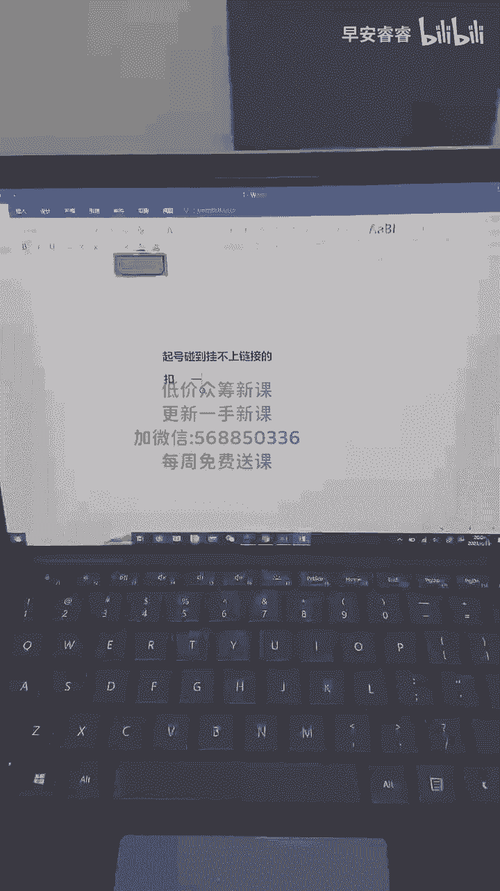
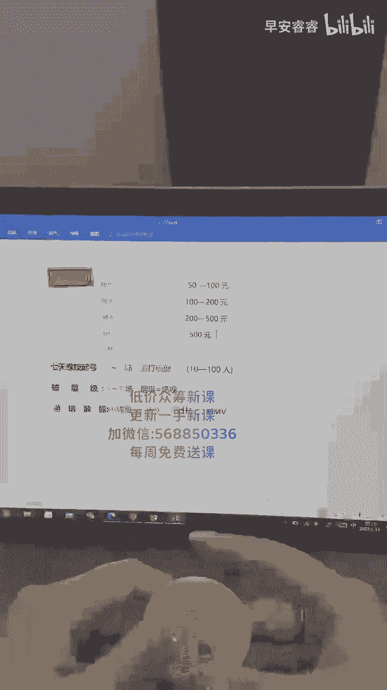
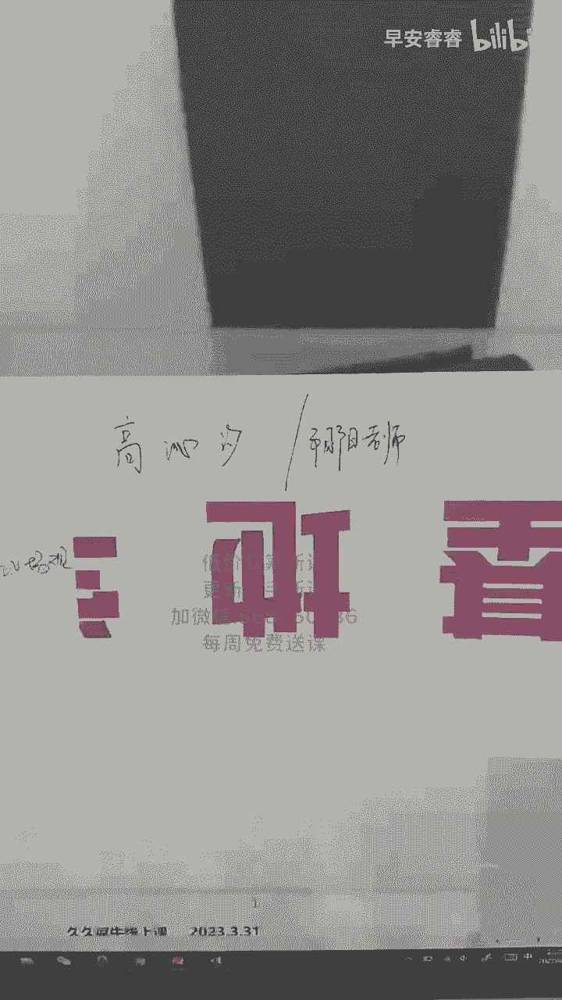
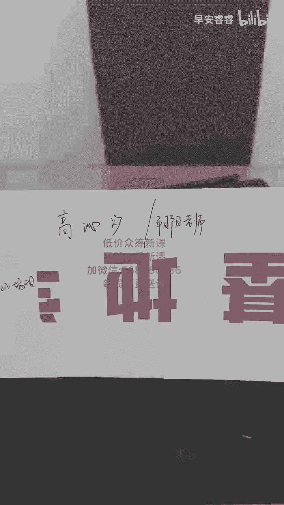
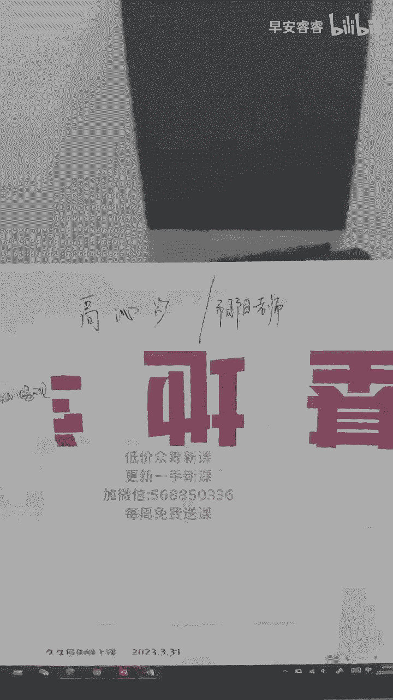
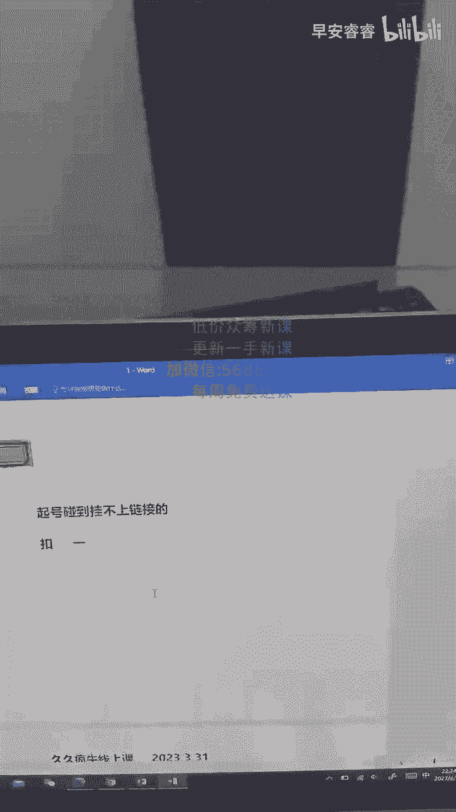
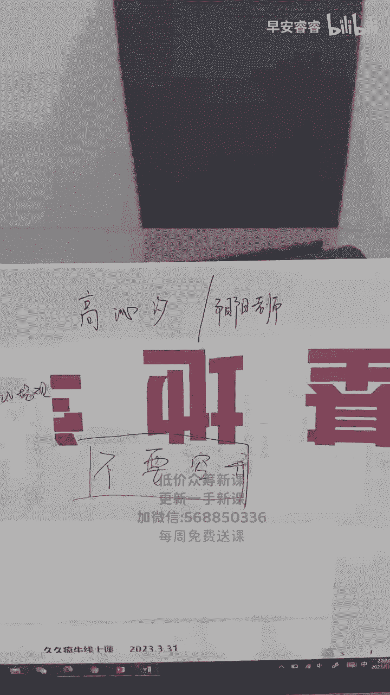
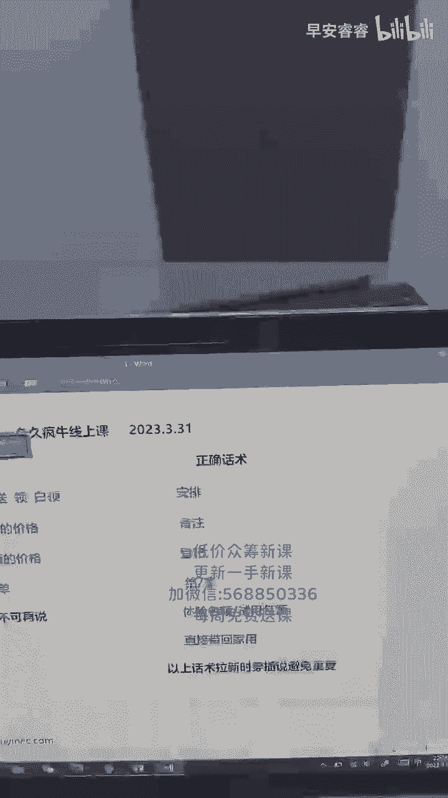
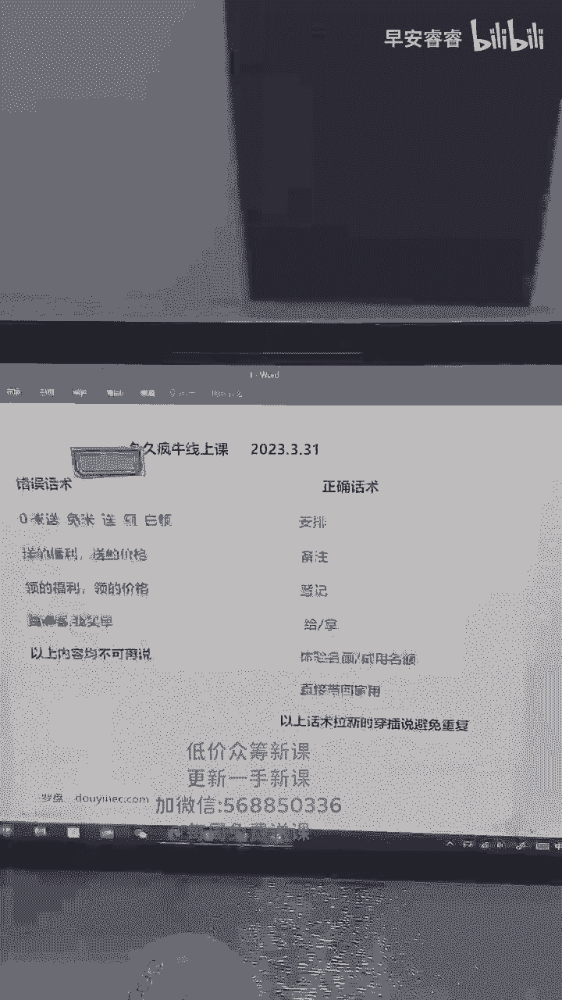
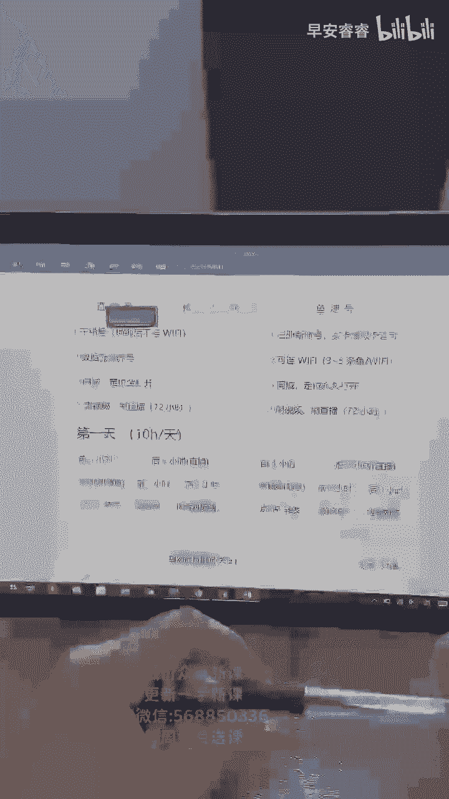

# 053 抖音直播-纯自然流量起号，起号逻辑  话术实操培训（更新至4月） - P6：4月13起号直播课- - 早安睿睿 - BV1Ef421X7GH

今天讲起号解决问题，帮我看一下账号呗，你要看罗盘的话，明天有张老师的啊，你有问题你可以发出来问我哈，杨老师新规真的烦，嗯怎么说呢，就是老师好，你们好，我和你们说啊，可能是就是我在抖音播已经播了3年了。

他每年都这么嗯，多多有感，就是我已经习惯了，一会会讲的啊，链接怎么弹，杨老师好，你好，我已经习惯了它去改了，所以你们也是一个要习惯的过程，如果你们不习惯，你们不顺应抖音的规则的话，其实很难去玩，是实话。

嗯范志那好，违规扣两分，冻结佣金30天流量会变饭，持续几天嗯，你又违规了，又扣了两分的话呢，三天三天到四天，好的，有示范吗，有的都有的啊，我讲课都有失败的，重新洗标签怎么弄啊，重新洗标签就重新打模型嘛。

口碑发口碑分为什么会掉，杨老师口碑分掉有很多啊，你的有评价你的差评啊，然后还有一个是什么嗯，物流小店的3分钟回复它都会影响你的口碑，就是你的后端会影响你的口碑分的啊。

老13频共振的话术怎么调整三频共振啊，年纪50太多了，洗不动这种50岁太多，洗不动的话，他们就是想拍就拍不拍了，你也没办法，50岁就这样子啊，老师同行都是付费的，周梦瑶，你打什么屏啊，三屏共振的话术。

其实你要做B站，你就按B站的话术去，你要你要评估，你就按屏播的话术去啊，咱们货盘上好像没有饰品是吗，对没有，你要看是什么视频，如果是义乌小商品的那种，或者是像我这样子的美甲的嗯，你们现在起不太好起。

不是不是不是质疑你们的能力，而是因为就是如果没有播过的话，去起的话不太好起，防蚊帘，可以起的，可以起的啊，就是像这样子的品啊，就是像这样子的，就是美甲的话，那它也是属于饰品。

如果你是说像大类目珠宝以内的以外的内容，需要报白，播醋都好起，我是播过醋的啊，就你们护板上的东西我基本都播过了，好了，你们有问题的赶快问我们，money10分正式上课好吧，6分钟回答一下你们的问题。

6分钟先回答一下简单的问题，然后后面有讲课了，货盘上是不是直接挂链接啊，那没有实物怎么介绍，要拍呀，杨丹丹，你要去拍啊，你拍他的正价链接去拍就行了啊，拍正价链接拍到家里去播就行了啊，说好播吗，好好播啊。

很好播啊，对我来说啊，好不但是如果一开张棋盘商哪里容易违规，很多大功效嘛，功效容易违规吗。

余浩可以用一个WIFI吗，可以的可以的啊，可以的，还有什么你们可以问一下啊，没问题，我们就讲课了，如果你们现在在拨号的过程当中碰不上，碰到挂不上链接的，口碑分，低的没有口碑分，挂不上链接的，去刷口碑分。

去刷口碑分，找你们的业务去刷啊，做一天卖多少啊，看你这不一定啊，你想卖了，你卖3万，你都可以卖，对不对，那就像我我可我可以，就是他的客单价是39块九，我一个小时可以卖1000呢对吧。

不要觉得他就是我一个小时才卖1000，怎么样，那兔本来就是一个本来就是低客单价的对吧，他的人品和你们卖什么妈妈装啊，不是卖一些什么服装啊，鞋子他的人群不一样啊，就这群人我不好要互动，实话实说对不对。

但是能卖1000，你要想我卖1000就已经卖了30单了对吧，杨老师，新号必须刷口碑，分散的挂，没有有的可以挂，有的不能挂，你挂不了的，你就要去刷口碑分啊，给我算一下，我大概可以多久暴富。

刷对标也可以用同一个WIFI吗，可以的啊，O与V有特征还不能说功效吗，有特征可以说啊，有特征可以说，日常百货直接用全屏起号，还是先用几个屏或者单品起号啊，老师我都建议你们先用单品起号。

你们日常百货你们可以全品类，你们要起号的话，你们的货场非常考究的啊，刷口碑分成本高吗，几百块吧，我是福建人，总感觉卖山西老醋怪怪的，没有什么怪的呀，你可以讲啊，为什么我作为福建人也喜欢喝山西的醋。

是因为它真的好喝啊，对不对，我是一个地道的福建人，其实中国的四大族，福建福建也是有名的，但是为什么今天我作为福建人，要去卖这个山西醋，首先错，中国陈醋看山西，山西陈醋看青徐。

今天你们只要只管吃准山西的老陈醋，他是没有错的，而且为什么我福建人我不推福建的醋，要推山西的醋呢，第一他文明吧，第二他的醋是真的好，第三那是纯粮酿造的就可以了嘛，对不对，单讲一个福利品违规吗。

单讲一个福利违规，不要去讲福利啊，高价599高价599，钩子3。9，正价99，钩子会不会太低了，有很多要忙的，会的，但是没办法，你要去洗标签啊，但是你只有钩子是3。9，你才能把人给拉进来啊，这是正常的。

没关系，可以的啊，护肤的护肤的白牌的不好打啊，白牌的不好打，为什么我一发发两条一样的啊，不知道啊，没事没事，还有什么问题，同学们，我们2分钟以后开始上课啊，你们最近碰到什么问题，你们都可以跟我说啊。

我都给你们解答，没有我们就上课，卖不出去，我播醋的时候啊，我也碰到过，卖不出去，你知道吗，我和另外一个主播一起播，前面就是我们有违规吗，一到我就不好卖，然后我把那个艰难的时间熬过了以后。

我另外一个主播商呢，他就很好卖了，我当时其实开始怀疑自己，是不是我的话术有问题，为什么他能卖出去，我不能卖出去，当换我的时候，我就发现其实不是的，是前面那段时间比较难熬，当你熬过了，你一定是好卖的啊。

天天违规就会影响你的号码，我最大问题就是还没有开始那些，把基础搞明白了，开始了，有问题了，去总结出来了，然后每次到上课的时候来问我就OK了啊，老师起号能不能只做一个上下游和正价，可以啊，可以呀。

全是50岁以上的，不好做互动，这是可以卖的啊，看你卖什么品，老师我发现我一刷到卖货的视频就直接划过，我怕很正常啊，都会有啊，有的人就不喜欢去卖货，他就是把抖音当作纯娱乐的呀，这是很正常的呀。

所以为什么抖音叫做兴趣电商是有道理的呀，不是所有的人都是想进来买货的，他有大哥啊，他想看小姐姐啊，她想看黑丝啊，对不对，她想看擦边呢，是不是他想看大pk啊，他想看像小杨哥一样的，又带货，又有又有人设。

又有演戏的，那都很正常嘛，他可以专门看小杨哥去演戏，他不买货，这也是一种正常心理，所以没关系的，这是正常的啊，但是不是大部分人都这样子，是一部分人啊，不醋怎么弄货场啊。

啊你搜一下醋就有好多出来的那种货场，你可以去看一下啊，对首播，首播的话，你就在前面这里要摆上架子吗，这样的架子摆好了以后的话，醋就放在架子上，就是感觉可单调的方式，单尿滴你不会让你直播间有多的选择。

多的选择是好吗，是好的，但是你掌控不住，所以先从单品开始，把单品玩明白了，你再过款，你看像像我一开始一开始我我我做主播，我过我是播过款的，我当时播的很吃力，真的不骗你们，我当时播过款，我自己播的很吃力。

但是过了那个阶段是好的，但是你要有很长一个适应的阶段，不是哪个主播天生下来，他都可以直接就过款了啊，不可能他一定要适应的，老师老师留不住人啊，留不住人啊，这个问题啊，就是你们的老杨他要上课的时候问过我。

说你信不信，你上课的时候你的学员都会问你，老师我留不住人怎么办，他给你们的解释就是留不住人，照样要去留，其实你们碰到的问题我也碰到，留不住人，我们就用心的去留，没关系，留不住一个留留下一个对吧。

你总能留住一个的，还是50岁以上的，50岁以上的，他只要你把品顺，他想买，他自然自然会拍播出，39。9的上一个上下有一个69。9，一个19。9，我播错没有用低价，我没有用低价，我拨错的时候没有用低价。

我我播出的时候没有高价，没有低价，我就这样播的啊，你们现在好了，有有高价和低价，我没有啊，那个时候我播的时候，我也不是说没播多久啊，我就是我也是今年播的，去年也播了，我播的时候是没有高低价的。

OK我们讲课啊啊别啊，别呆了别呆了，不停播啊，我是憋单播的啊，two好了，我们上课了啊，同学们，我们先讲课吧啊一会有什么问题了，你们再问我啊，我先把课给讲了，然后的话呢再回答你们的问题啊。

一场可以播十几个小时可以啊，好了我们继续啊，嗯听过我讲过的同学就知道我讲基础课比较细，你们有不会的，你们就在我讲的每一趴的时候，你们问我就可以了啊，我开始了哈，碰到挂不上链接的，去刷口碑分。

去刷你的单量，刷到了，然后就可以挂上链接了啊，然后的话呢还有一个点，你们现在如果是有的号，自己的店铺号，那个那个那个号只能挂三个金血对吧，只能挂三个精选，你们就用白号去播，不要去挂店铺了。

就自己去涨粉了啊，好了我们继续了啊，循环话术它本来就是一个重复，不然为什么叫循环话术呢，对不对对不对，同学们，好了，你们把这些话术记一记吧啊，你们把话说接近你们看，刚刚有同学问我福利，现在福利不能说啊。

加个什么领的福利啊，送的福利啊，这些价格都不能说啊，都不能说啊，这些是我自己实测过的，完全没有问题的话说这些是有问题的，话说不要去说啊，哪怕你哪怕你前面贴了一个0米送它，也会引起违规的啊。

所以不能有这样子啊，成本价不违规啊，一分不要他现场不违规，或者他三天后也会违规的啊，抖音不傻的，你们要想好，还有一个还有一句话我忘了说了，加一句啊，加一句加一句，加一句加一句，这里加一句。

这句话不能说啊，我请客我买单是不能说的啊，这句话一说准死，好了这句话不能说啊，我请客我买单是不能说的啊，不管你说我请客或者说我买单都不能说，连在一起更不能说啊，对一包烟还能说吗，一包烟可以说一包奶茶。

不是一杯奶茶，不能说啊，我现在都不说一杯一包烟呢，我都说你少点一顿外卖，少吃一顿火锅，或者是说少喝一杯星爸爸，我基本上不说一包烟了啊，高价链接有买赠，没上正价之前的拉新可以说送吗，不可以不可以啊。

刘凯文大几十五十九六十九，这样听说可以的，赵梦瑶可以的啊，成本价你说一分不要一分都不要是后台和主播，一起读的我就在直播间坐等他们违规，后台和主播说的会，当如果说你的这个号权重高，当场当场不违规的情况下。

听好了，他三天以后他审核你的话，他有一个缓冲期是三天，你一辆会被限流货物导致违规的，知道吧，所以不要去犯这种错误啊，亏你可以的啊，因为你看我的话术当中亏不亏你，我无所谓的，今天就是来交朋友的啊。

涨播粉丝，我的话术也有闺蜜啊，但是不违规呀，我是说亏米，我没有说不要钱呢，对不对，要理解亏你的意思吗，嗯好了，你们很多同学我我插一句话，我讲课之前插一句话，很多同学说，老师为什么我前两天的数据做的很好。

我到了今天的情况下，他没有给我推流了，听好了，那你前两天必定话术违规了，听好一定话术违规了，同行举报是当场会限你的流，明白吗，你一定有话术违规了，你要好好去想，你不要跟我说。

你不可能出现一定是出现违规了，然后的话他给你软限流了啊，明白吗，这里明白的同学打个一字啊，生活无忧，你这个名字让我看着，我每次想点无忧传媒啊，限流咋办，限流了啊，只是当场限流，他后面还是会有流的啊。

所以记住了，你们的话术一定要一定要做到，一定要做到精准，不可能要求你们不违规，你们的你们的成长是从违规当中扣出来，像我在线下的学员，我对他们的要求就是你今天这场播的很差，没关系。

我只要求你不违规就可以了，我只要求他们三个字就是不违规，你这场播的再差，你不违规是好事，明白吗，你们的号是没有问题的，你违规了，他会对你的号有影响啊，同学们，你我说昨天主播呃。

我我我昨天说主播今天不卖货，就是来涨粉的，今天给大家安排一波福利，直接提升啊，福利你不要说福利，今天给大家安排一波福利，你可以说我今天今天不卖货，就是来涨粉的，今天给大家做一波活动，搞一波活动好不好。

搞一波大的活动，可以的，你不要说福利啊，福利是违规的，你看到没有，我说了呀，福利这两个字啊，工人费可以说吗，可以的啊，人工费，好了我们开始了，同学们一会儿把你们违规的话术都告诉我，我给你们一个个的去点。

一个个的去讲啊，记住了吧，这些字都记住，我就不讲了啊，就是什么安排一单备注一单啊，登记个体验名额啊，登记个试用名额啊，然后带回家直接去用，就是我比较好奇的是这个直接带回家用。

因为我每次说完他还在我直播间，我都说明白吗，哥哥带回家直接让你用明白吧，明白你就告诉我打个明白就行了，呃，你是不是我说的不卖货，违规了，不会啊，我卖不卖货，我挂着链接，他愿意拍，愿意拍，说是福利。

你说我跟你说啊，是你的福利那两个字违规了啊，为我福利那两个字违规了，福利不要去说啊，好了我们开始了啊，同学们，就是这几个记好了，我们就下一趴了啊，你们登抖音1C点，Com r。

没听我讲过基础课的同学认真听一下啊，我会讲的比较细，我讲的比较细，你们就听听了，原来不管你是平波还是嗯还是用短视频起号，问你现在想要学自然流的，我们在自然流玩的就是别在，你就按照我的方法来就可以了啊。

炸的福利也别说，因为炸，炸的福利也不要去说啊，因为他福利它会显示你是用了那个福袋，你知道吗，他会认为你是用了福袋，但是你没有发福袋，你知道吧，同学们，我怎么突然变大了，明牌吧，同学们。

炸的福利也不要说啊，好了，我们开始了哈，就这里开始，可以啊，惊喜可以说，我以前开始我还会说，大家都是说冰冰点的价格是不是，但是我我都没有说冰点的价格，我今天给你一个，给你一个你满意的价格。

你心动的价格我也是一个合理的价格，给到你们，我不是这么说的啊，好我还我还会说很多直播间，你们听到的是给你一个什么冰冰点的价格，今天我没有这个套路，我给你的是一个惊喜的价格，你满意的价格，你会心动的价格。

但是今天我是亏米，但无所谓，我亏的这个价格我觉得值得，只要你们心动，你们满意都OK，我的话术是这个啊，育儿有方，就是有时候我会用，就是反反套路去说我的话术啊，反套路去说我的话术。

老杨呢不知道我没在基地啊，我没在基地，我家里有事，我回家了，这么多都不能说，你看你看啊，同学们插个话题啊，你看，你看现在这些不能说的情况情况下，你看我们仍然有话术可以用，是不是直接带回家给你用啊。

是不是登记也是都给你啊，给你给你，我给你了，我你拿回家去用都是可以的呀，为什么没有话术呢，他话术是可以换换的，你们不要把话术的框架框死了，明白吗，任何话术它都在百变不离其宗，他总有代替的啊。

老杨要给你们讲课的话的话呢，是有非常非常重大的事情在给你们讲的啊，好了我们开始了啊，或者是老杨直播，你们问他为什么不讲课了，我也不知道，而且现在我不在坚定啊，好了，我们开始抖音，一定。

老杨这会儿在会长拉后呢啊是吧，安排福利不能说啊，福利这两个字不要说啊，不要这样说，你看如果说你说了福利，就像刚刚那个你说呃，他说他谈了一个违规嘛，那个违规叫什么名字来着，直接显示口播未使用平台工具。

所以你不要去用，明白吧，对中国的文字博大精深，就看你们怎么去说，怎么去转换了啊，嗯好了，抖音EC点com登登录上以后的话呢，登录上了以后的话，它就是这样一个界面，这样一个界面啊。

然后的话呢添加的商品链接在这里添加添加，不管你是货盘啦，或者是说你自己的小店的链接，你自己的小店就绑定了账号就可以了啊，见面礼可以啊，搞活动三个字也可以说在做就是做活动嘛，今天在做活动嘛，一样的嘛。

搞活动跟做活动有什么区别呢，对不对，好了啊，我们在这里就是专业版的啊，这专业版针对于天窗比较多，哎呀我还是把这个给拿了，我忘了，等一下我把这个拿了，我忘了，不好意思啊，我把这个给拿了给你们看。

你们会方便一点，把键盘放一边好了啊，我还是说过了啊，在这个里边的话呢，你们只用只用在意的，就是这个平均评论次数做到第一场，第二场，第三弹落到123，随便你们做一个数字都可以，不要做成零就行了啊，好了。

我们下一个啊切换到专业的基础版的话，点这里诶，诶点这里啊，这里基础版啊，然后的话呢就就可以跳过来这里了啊，那还是一样的，咱们的没有听过课的同学，先熟悉你们的罗盘啊，成交趋势图，成交趋势图就是。

成交趋势图啊，是这个样子的，啥不弄成零，没听清，我说没有什么搞活动，可以说就跟做活动是一样的啊，没有区别啊，听一会儿我会有纸质的给你们看到，我说的这些内容的啊，哦在这里的话呢。

就是你多少个人成交了多少单对吧，哦看到没有成交订单数和成交人数啊，然后的话呢，呃咱们咱们主要的是看这个流量分析图，来看一下啊，在整场的直播过程当中的话，你们可以看一下啊，纯纯的都是直播自然推荐。

没有任何付费，也没有短视频，所以你们先起号的过程当中啊，要去把抖音的羊毛给薅完了，就直接去薅他的呃，自然流，你们视频也不用发视频，可以到后期再发，对不对，先不要去发视频，后期再去发。

先把该免费薅的免费薅完了，再想到进入其他的其他的东西，为什么你们没有看见吗，其实你们要想一个点，你看流量渠道，他给你的是直播战，去年就打了，正打了最上头的话，他肯定主推是自然流啊。

因为大家都在玩自然流啊，没有多少人那么有钱去给你付费的，所以你们要先抢占的是自然流，把自然流搞明白，搞搞清楚了，然后你可以短视频或者是付费，让他锦上添花都是没有问题的啊，好了，我们继续啊。

这里看播用户画像，还有成交用户画像的话呢，是呃是那个我们打模型所需要的，从这里去看啊，从这里去看好，然后在这，好我们可以看一下啊，在这个蓝屏里面的话呢，我们要我们要注我们要注重的是七个点，七个点啊。

先看一下啊，第一个点GMV，然后的话TM这个GMV就是成交金额，我就不用多说了，就这个这个这场你卖了多少钱啊，开播直播推荐百分之百怎么回事，播了多久百分之百，然后的话呢成交件数，成交人数都不说了。

点击转化率是测你这个品是不是爆品，然后天赐观看成交金额就是我们的嗯，就是我们的一个签字，然后的话呢成交占比的话就是不要有牢，不要有那个老粉，然后的话呢平均在线人数的话呢是22人。

就是这场直播两个小时里面有总共在线的，平均在线是22人，然后累计观看人数的话是2732，这是我们的场馆，也是我们的成绩，第二个点，第一不第三个点了，第一个点GMV，第二个点签字。

第三个点是我们的累计观看人数，第四个点关注，第五个点灯牌，第六个点停留，第七个点的话是我们的时长啊，半个小时的话耗半封控了啊，好了，我们来看一下这里啊，然后的话呢。

这里呢就只要看子线和我们的一个黄线就好了，直线是我们的实时在线人数，黄线是我们的一个进场人数，这里也可以看出来你的开口口子是多少，进场直播间人数进场300小时就开口，我的口子是350。

就可以说大大概率是个350，对不对，那可以看出来你的拉伸或者是你的留人的能力，在这里可以检验到的啊，好我们继续，在这里啊，抖音罗盘刚刚我说了啊，专业版当中的话呢是分钟评论数，评论高就等于我们的在线高。

就等于我们的互动高或者是流速都是高的啊，基础版罗盘当中的话呢有四个点，你们要去做浅层数据，第一关注，第二灯牌，第三停留，第四互动，它四个点都是我们的一个浅层数据，这是你们要去做到的，每场直播都要去要的。

每场直播都要为什么要为什么要让你们点对点，先把人摁在你的直播间，有停有留了，你才能去要关注，才能去要灯牌，才能有互动啊，然后的话呢签字就是我们的GPM，GPM等于GMV除以我们的关乘以我们的1000。

就是一个赛马机制啊，然后的话呢find就是我们的一个签字，就是说嗯就是看这个品，就是看这个品的话呢，在同时间段，同一个地区嗯，我找个品啊，找这个啊迪士尼的耳机，就比如说这个品，对不对，他是迪士尼的耳机。

我现在是08：30，我开播了，好这个时候的话呢，我就开始和我本地区的在，比如说我现在我是在大理，那我就和在大理的人同时间段的人，再去赛大点的，又分为了区，哪几个区，又开始这样子去塞这个区赛完了。

我在其他区，其他区赛完了，我在整个云南省，整个云南省的晒完了，我赛全国的，他的签字是这么晒出来的，也就是说你的签字高，你的人第一精准，第二是不是人会会多了，因为在签字啊，他等于给你推推流了呀。

你的签字高，他是不是要给你推流，因为你得你得给他赚钱呀对吧，简单的道理就是这个样子，但是你们不要刻意的把签字做太高，做太高了，你们会接不住流啊，不要刻意的去刷你们的，刷你们的那个签字没意义。

刷千次高了当然会有激素，有了你完全接不住你的号也会废的啊，苹果手机一发烫就卡顿，老师怎么解决的啊，找那个降温的那个散热器啊，散热器好了，我们继续啊，刚刚我说了啊，流量趋势里面就是黄线和紫线就可以了。

然后新同学去找你们的运营，找拉新话术，水杯循环话术，违规词，还有复盘就可以了啊，好我们下一个，还有你们在拨号的过程当中啊，你们充电尽量不要用快充充，你们的这个手机充手机它会容易发烫的比较快。

你们用一个慢冲去冲，就在开播的时候就一直插着电就行了，一直慢充就好了，他不会怎么掉电的啊，你们用快充它很容易发烫的啊，好直播机的话呢，苹果11以上不推荐12，你十一十三十四十二pro12pro max。

随便你们啊都无所谓，都可以啊，然后的话呢选择的是国行，要国行的手机啊，然后的话信号不好的情况下，你们就去连那个国产手机的5G热点就可以了，然后的话呢一机一卡，一号卡是我们的三大运营商。

虚拟卡和物联卡就不要用了啊，呃如果你们用了会封控，然后的话呢不可以连WIFI，不可以连WIFI，只要手机做直播的一天永久不连WIFI啊，如果说是鱼塘机的话呢，任意手机都可以啊，安卓优先，任意手机均可。

安卓优先啊，安卓便宜一点啊，然后的话呢呃你们的鱼塘期的话呢，随便什么卡，只要能注册抖音就行了啊，只要能注册抖音就行了，5~10条鱼，够了够了足够了啊，嗯可以连WIFI，鱼可以连WIFI啊。

但是3~5条鱼一个WIFI，也就是说如果你是十条鱼的话，那你就连两个WIFI啊，拉两条宽带啊，然后账号的话呢是一个千粉零作品，零作品的这样一个不窥屏不投流的正价起号啊，你们现在有小店的。

自己播自己品的也注意啊，不要窥屏去卖你们的呃，不要窥屏去起号，起不来号的啊，抖音是打击的啊，抖音是打击的哈，然后的话呢嗯你们千粉的话呢，最好第一第一二先自己涨粉，实在觉得涨得慢的情况下呢，就去买账号。

就去买账号啊，然后的话呢下下策才是那个下下策，才是那个叫什么来千川涨粉，我不建议你们千川的啊，然后的话呢不要零粉开橱窗，也不要刷铅粉，容易封控的啊，尤其尤其现在这个刷钱粉和零粉开橱窗的话，容易封控。

如果你自己小店绑定账号可以的啊，好配置场控运营主播中控，场控就是我们的一个生命线，哪里有血流控流罗盘上下架，奖品封单全在场控这一块，其实起号现在对你们还没有几好奇起来，同学的话呢，7号对你们是一个难点。

但是当你们只要起来一个号，你们会发现7号他就是个弟弟，他什么都不是，到后面的重点是怎么去挽留，怎么去控流，这才是重点啊，好我给你们看一个控流，控的很很厉害的一个图片，虽然人不多，但是人家空有空的好。

来这个，这是控流控的好的一个状态，你们可以看到啊，他几乎是你看这个吧，子线已经超了黄线的情况下了，这是他的进场人数都没有我的在线人数高，那这个控油控的非常好的，他的话术是非常牛的啊，好了我们继续啊。

然后的话呢嗯嗯罗盘你们要去明白，就是刚刚我给你们讲的那个蓝屏那个界面，你们要懂啊，不懂没关系啊，嗯后天后天是张老师，张老师会给你们讲罗盘，好好去看啊，好好去看那个，他讲给你们讲的罗盘啊。

然后的话呢上下架一会我会给你们去讲，然后奖品的情况下就是竖品，竖屏的过程当中的话呢，你要去把这个品的特质有特点，为什么这么优秀，要讲清楚讲明白，然后的话呢封单风干的话。

就是要及时的告诉告诉在直播间看的人说，没有啦，没有啦，都没有了啊，这是封单，B单是什么呢，就是告诉他我直播间现在45个人，假设45个人，我只能给你们上五单啊，然后讲完这句话以后。

可能又讲了一些其他有的没的啊，还有最后的两单啊，这两单不要卡，我库存卡库存，那我就把你踢了，这叫做B单，再逼单啊，逼着他赶快去拍，要有一个紧凑感，然后的话呢配合呃，不是运营的话。

就是一个配合配合场控怎么配合呢，如果你是一个人的话，那就算了啊，如果你是两个人的话呢，如果你是两个人的情况下呢，怎么说呢，两个情况下就是来运营准备一下链接，马上上架运营，这个时候说好的，马上准备好。

这个叫做配合配合，就是等于是和场控去演一出戏，然后你要会上下架，也要懂罗盘他的点，然后的话呢也要帮助B站，B站的话是因为什么，如果说才开始配合，因为场控我说了，他是生命线，如果说你的逼单不及时。

那就只能靠场控自己去逼单了，但是这样的B单其实效果不好的，所以最好的话呢是运营去B单，什么意思啊，那钱白交了，啊李玉美什么意思呀，嗯主播就是讲一个竖屏，就是只是讲解这个产品，就比如说这个耳机。

这个耳机充电一小时的话呢，可以超长待机，这个不能超长待机，那个200多个小时啊，这个耳机充电一小时的话，可以连续待机的话呢是20个小时，连续听歌的是6~8个小时是没有问题的啊。

而且今天给你做到的是一个磨砂表皮啊，而且是我们的噗噗的这一个就是在介绍他，完完全的介绍它没有多余的啊，只是介绍不前期靠场控旗号，后期靠主播去，因为主播到后期是黑科技啊，但是主播这样的有主播这样一个品。

要么就是衣服，要么就是袜子，要么就是帽子这种真人出镜的品啊，但是像你用耳机啊，或者是嗯什么小空调啊，嗯空气炸锅这些的话呢都是怎么说呢，都是哎都是都是都是用手拨的啊，一个人可以播，一个人可以播的啊。

一个人可以播，一个人可以播，就是你自己要上下架而已啊，适应一下嘛，一个人完全可以播啊，你慢慢适应就可以了啊，然后中控的话呢是主播呃，可有可无，可有可无啊，好场景场景搭建第一首播屏。

就像我现在这个场景拉近啊，是首播屏，对不对，我在后面的话呢就是有一个kt板，或者你们觉得它不够好的话呢，你们放一个4K屏，在循环的播放，他的这样一个这样一个视频都是可以的啊，上下架我会讲的啊。

一会儿我会讲的啊，上下架先插一个话题啊，上下家在这里啊，你们添加商品的链接在这里我已经说过了啊，你们添加商品的链接是在这里，把商品链接添加好以后了，是不是要上下加，就点开添加商品，点开它以后了。

选中你要上下架那个位置，点中它，然后确定就可以了，这是上下架，但是我教你们怎么怎么去上下架，这个只是基础的内容啊，好了到了我们的川版来，就是我刚刚说的衣服啊，鞋子袜子噼里啪啦那一堆啊。

你们是要人货场去高度匹配的啊，就是你的主播颜值要O啊，除非你是播一些农副产品的话呢，那没关系，是不是，但是你的货一定要让人家明白啊，我就是一开始就卖这个货啊，比如说卖一些像我们这边有人卖大蒜的啊。

一看到就是一个大蒜，对不对，场场景的话呢，你卖衣服卖卖鞋子嗯，卖帽子他要设置那个场景是比较高端了，不能说高端吧，就是要看上去舒服，除非你卖的是一个高端品，那你这个时候你的场景要搭的非常好。

场景靠你的呃一些装饰就是软装，还有灯光去搭建啊，这三者缺一不可啊，你但凡播了衣服类的啊，缺一不可好了，我们继续啊，纯自然流起号的话，我们讲的是憋单，完完全全的憋单，憋单是什么意思呢，就是不放单啊。

啊怎么不清楚了，什么意思，哪里不清楚，育儿有方，哪里不清楚，纯自然流讲的就是完完全全的憋单，憋单就是不放单，直接把人群给憋在你直播间，耗死在你的直播间了，等到人群一上去了，我开始用我的喜人的话术。

放单的话术，我把这些总结好了，我就开始去放单了啊，然后的话呢，呃我们我们在九九风流，学的都是都是都是干嘛的单品，起号啊，哎呀老是点出来就很烦了，等一下好，我打个打个打个打个比方啊。

有同学问我B站要B多久放到多久，全部根据你的流速来，没有确定的时间告诉你，如果但凡有一个人告诉你确定的时间，那他一定是骗子，你要根据实际情况而来啊，如果说我的人数在上涨了，我就立马封单呀，对不对。

马小妞这里明白吗，嗯好现在可以就行了啊，然后的话呢我们是AB链几号啊，低价高价，有人告诉你嗯，A贝利不可以玩了，或者是AFAFX的起号方式不可以玩都可以，任何一种方式都可以玩，看你怎么去玩。

如果他要告他否定了某一类玩法，那纯哥你就猜就是想让你去用他的方式去播啊，你放心都可以玩，现在很多很多自然流它还是在ab列，仍然是ab列，没有任何改变，还有同学会有质疑，是不是现在自然流不能玩了，你放心。

自然流照样可能玩，他只要抖音活着，自然流就一定可以玩，他不会死，只是说它会越来越变得越来越精细化，所以你们放心，自然流一直可以玩啊，好让开，然后然后然后我们到这里啊，低价，低价拉新引流。

拉新低价就是一个拉新引流，他不要设置无库存了啊，你们设置西藏或者香港可拍就可以了啊，然后的话呢低价就是你放在一号链接弹墙，那个低价就是完完全帮你拉行了，帮你把人群拉进来的，你们本来不是已经不好留人了吗。

不好留人了吗，对不对，这个时候的话迪迦就是帮你拉人的思维模式，我不在基地啊，怎么了，然后的话呢然后的话呢就是一个上下游，上下游的品马小牛，是因为你们已经投入付费，你习惯了付费的模式。

付费会给你一半精准流的，如果说你是纯纯从B站开始起的话，你就觉得B站会很好玩，如果你是玩的付费的情况下，那会这样子啊，上下游是与主品相关的啊，第三高价高价的话是根据主品而已。

就比如说我的这个我的这样一个呃耳机，它就是卖39块九，对不对，你不能设置一个客单价，高价3000多块嘛，你和高价设置298差不多了，那的确地士尼乐园乐园也是一个298的价格，398的价格啊。

这些就是自己有品，自己有小店的同学，你们就这么去设置就可以了啊，好然后我们起号的话呢，就是为了着重去打他的模型，打造模型，第一人群模型，第二客单的模型啊，什么是人群模型，给你们看一下，人群模型定义啊。

就像这个就是耳机啊，改一下，人挺多，卖不动，是转化不够好啊，你的话术出问题了啊，别单和你付费的话术不一样的啊，耳机啊，然后的话呢这款耳机的年龄的话呢，它比较小，20，先不要问我问题，我先讲完了。

你们再问好吗，好了可以了，看得清了吗，现在看得清了吗，看不清的话，那我就看得清，打一二，陈莲香，嗯好我们继续啊，哦不对，这个是39块九，换一下啊，可以了啊，好我们继续啊，就是你们首先要去。

你们首先要去看你们这个品，你看不清是因为我我把这个屏放在这里了，它对焦了，对焦的是这个品，首先你们要去看你们的评，它的人群年龄段是什么样子的，有打小空调的同学，打小空调的同学听好了啊，打的是男性。

他299699打的都是男性，你们要30~45到50都可以，都没有问题啊，30以下的不太好打，因为小年轻他不喜欢这个东西啊，我49寸的显示器能看你说好的好的，然后的话呢你们去如果说不知道自己的年龄。

不知道自己的这个性别是什么，年龄是什么，可以去找到他的那个小店去问他的，你的客服客去问客服啊，你的这个成交主要是女的多还是男的多，年龄段是什么，他会告诉你，他们因为小店后面有后面有这样一个统计啊。

你们可以去问的啊，或者说你们去靠第三方的软软件去查，就是查妈妈呀，考古家呀，非瓜这些数据去查就可以了啊，好了，首先的话呢先定义的话，我打号我先定的是性别，我一定定性别。

为什么我定了性别我才能去做他的年龄层，我我不会分开，我不会分开啊，我不会分开，就说我是我不会一起去弄，我会分开去弄，首先我先把这群性别是女的给圈，在直播间，有男的可以没有问题，但是就像我上次讲课一样啊。

我一定是要男女比例，要女的多，男的少，这样的人群模型才是成正比，因为后面我可以把男的给踢出去的对吧，然后年龄的话呢你也可以去问啊，在我直播间的啊，这些仙女当中啊，还有没有没有在读书的，有工作的吗。

你们可以去问啊，或者是说在家面临退休的阿姨，有没有，有的话的话，你们可以把年龄告诉一下，我今天呃既然我知道问女生年龄很冒昧，既然我冒昧的问了，那我给你们送点送点小礼物是没有问题的啊。

你们可以这样去说嘛对吧，有福利的话术去说，他会告诉你的啊，好了，你就可以看见的人群，直播间的人群是不是你想要的人群了，如果说他有一个是超出你的人群的那个人，那个年龄的人群的话，你可以选择记住这个人。

稍后等我人数上来以后，我把这个人给踢出去就可以了啊，好我们的客单模型，我们的课代模型，哎呀等一下，为什么会跳了这么多次呢，就这样吧就这样吧，好我们继续啊，好了可以了啊，我们是这样的。

你看客单模型它有什么，它有九块99块九，29，39，59等等啊等等的，这样一个客单客单模型的啊，然后的话呢你们可以在，你们要根据你们自己的品类去选择，你们的这样一个人群，现在团队还打耳机吗，有这样有。

然后的话呢我尽量都是我不是我，我都见你们尽量把人群的客单价都往高了出，这个人群模型就是刚刚我们看到的，这里看到了这里啊，看播用户画像，这里看播用户画像，这里啊这里的看播用户画像，它有什么，有地区。

有年龄，还有性别，你们可以从这里去看到，看到你们的看播用户画像啊，然后的话呢嗯到了我们的课代母亲，先把先把人群模型确定了以后，我们才能去确定客单模型，客单模型就是我的成交用户画像，就是靠你出单出出来的。

叫做客单模型啊，所以说你出的单，你出单，你不能随便出啊，如果说性别不对，年龄不对，这单我宁愿不要明白吗，我宁愿不要，他会根据你出单给你往后推人的，如果说，如果说我第一单出的是个男性。

那是不是后面给我推的都是男的了呀，对吧，男的可以买吗，当然可以买，但是毕竟这款是一个打了迪士尼，它是一款颜值的耳机，那女生肯定是看得多的，所以我们要煮打的主推的是第一款女生的啊。

男生到后面你的账号记起来了，男生随便拍，他爱怎么拍怎么拍，他要拍100个都没事好了，我们继续啊，新规里面你们自己看一下啊，他这样都是算一个一个一个一个一个点了啊。

都是算一个一个一个一个一个一个一个层一层，50~100是一个模型的，100到200是一个模型的啊，好我们继续，为什么我就是这个不对了呢，稍微等我一下下，就就就就，唉就这样吧，等一下啊，我把这里删一下。

好了，好了，好我们看一下啊，七天螺旋起号当中up，如果出了不是自己想要的人群呢，如果出了不是自己想要的人群，你你就可以用话术你，那你后面要多出多出女性的单了对吧，所以说你们前期出单非常重要啊。

前期出单非常重要啊，明白了吗，同学们不是说随随便便就去出单，你签你随随便便去出单的情况下，肯定会影响你的呀，知道了吗，哎呀真烦，等一下啊，我把这里给删了，不然他老影响我的课件，好了好了。

偶怎么知道某个直播间是付费还是纯资料，一会会讲的啊，他憋单的，他接单的啊，都是那个他憋单的，都是，他憋单的都是，越来越乱，他B站的都是那个都是那个纯在流的直播间，等一下我调一下啊。

这样可以了可以了可以这样子就OK了啊，好我们继续啊，在这里七天螺旋起号当中的话，1~4场是重打模型的，1~4场是完全去打模型的啊，然后的话呢嗯然后的话呢10~100人，一会我会给你们讲什么是憋单呢。

我上节课讲了呀，任你不是在吗，然后的话呢呃就是第1~4场的话呢，第一闹市场的话呢，你们不需要突破多大的人，多大的人数，就是照常的去播就好了，就比如说我第一天可能嗯，你对你自己不要要求太高，你不要想我。

那我老是说话，迟到100人，那我就冲100人，没必要根据自己的能力而来，是不是能能破40，破40，能破60，破60，能破80，破80，能破90，破90，不能啦，你20人照样可以播，对不对，好了，拨好了。

1~4场以后，把这个模型打出来以后，就是西安我的我的呃，那个，先是我的人群人群模型已经打准了，我后面是什么客单模型，对不对，这个时候重大模型重大模型就是客单模型，我要多出多出来就能把我的模型给打精准。

就好比是你的人群模型，是你的你的地基就是开挖对吧，就是地基了，就给它夯实以后，你才能往上面建嘛，5~7场的话就是开始往上面盖高楼了，5~7场的话就要去破层级层级，刚刚说了，就是我们的场馆层级。

就是我们的场馆就是这个就是这个up，然后的话呢在这七场为什么要做七天螺旋起号，那顾名思义，他们每天的数据都要做递增对吧，第一天他要做的数据递增的有哪些呢，第一场关，第二天测，第三时长第四。

第四我们的GMV啊，这三这七天当中的数据都是要在做，做到一个螺旋的，第一天我要求你们的场馆是1000以上，1000以上，然后开播时长是一小时以上，那第二天的话呢是不是你的场馆要大于1000。

1001也可以，没有问题签字，如果第一天是三毛300，那第二天你做到301可以吗，可以都没有问题啊，好我们继续啊，这四个数据是要螺旋递增的啊，好这些讲完了以后，你要明白抖音的底层逻辑是什么。

它就是一个去中心化的一个原理，让你们通过中间一个人认互相认识啊，互相认识好，我们第一来A和B互相认识，A和C又互相认识，那么这样的话，等一下啊，那么这样的话是不是，是不是。

是不是我会通过了A认识了B和C，就是一个简单的道理，你们通过老杨老张周会长，那你去报名了，他们是A对不对，你们是B，我是C，通过了他们，我才能给你们上课，你们才能互相认识，我就这么个道理。

我们也才能互相认识，就是通过老杨老张朱会长这个中介，这个中介我们互相认识了啊，简单来说就是咱们的一个对标直播间，可以看一下啊，对标直播间，然后的话直播号还有我们的一个鱼塘号，可以看一下啊，就是说。

鱼塘号，鱼塘号和我的直播号都是我自己的，对不对，但是我要让他们两个号做到自然的认识怎么办，这个时候同时把直播号和鱼塘号，刷到了我的对标直播间里面去啊，这个时候他们就产生了粘性，就是养号嘛就产生了粘性。

那很简单的一个道理，通过刚刚这个AABC的原理就可以得出了，我们现在他直播间待过了，是不是我们这两个号就会互相认识了，那对呀，我们这两个号就会互相认识了，就这么简单的道理啊是吧，就是这么个简单的道理。

他们就会互相认识了，然后当你的直播号开播的时候，我的鱼塘号刷进到我直播号当中的时候，怎么样呢，这些精准的人群是不是也会被我的鱼塘号，带到了我的直播号当中，帮我快速的打上一个标签好了。

刷要刷进去不能搜索啊，都是刷进去的啊，这就是一个底层逻辑，就是这么简单的一个去中心化的一个原理啊，好到我们养号，我们看一下养号，哪里不对，为什么他会唉，先这样吧，好，我们，看一下啊，怎么养号。

直播号和鱼塘号他是干嘛的，他是一个嗯，直播号是千粉号，换绑后的话呢，就不连WIFI，怎么都不能连WIFI了啊，而且他是要模拟成真人的去养，好像平时你怎么刷，我们就怎么去刷号了啊，不用多想了啊。

看一下我是不是哪里布局弄错了，是不是，嗯没错呀，那我这个怎么会出来，就这样吧，你们先这样子看一下啊，我后面换绑号，就是有的人是买那个买的号啊，有的人是买的号，那要换绑，如果自己涨粉的话呢。

啊你就在那个直播间里面去自己涨粉就行了啊，换绑就是这个意思啊，你买的号你要通过他给你一个接收码，换绑到你自己手机上，就是在你手机上登录嘛，就叫换绑啊，好了，千粉号换绑后呢不能连WIFI。

养号期间全部用数据流量去养号，然后的话同城定位全打开，同城定位全打开，然后的话呢刷视频刷直播72小时以上啊，就是刷三天以上，杨老师第一场到第三还没出，三，等一会我回答你们，我先讲完课好吧。

然后到这儿看一下我们的鱼塘号，我们的鱼塘号的话呢是有一个注册新账号，十卡虚拟卡都可以，无所谓啊，但是的话呢我建议你们用实卡，因为你们十卡注册的这个鱼塘号的话，后面可以做直播号啊，呃首先短视频直播啊。

还有那个短视频的，你们看你们看短视频和你们看直播是两码事，它不影响的，不会说是你看视频的人会带到了你的直播当中，不会他是两个部门在抖音，是两个部门，做短视频的是一个部门，做直播的又是一个部门。

那么你的你的鱼塘号，它是属于一个看播标签，和你的直播标签也是两码事，直播标签是直播标签，看播标签是干看播标签，今天你的直播号做了直播号以后，你可以做余号吗，当然可以做鱼号。

你的余号做了余号以后可以做直播号吗，可以因为它是两个部门，所以说不不啊，不要紧，不干涉的啊，然后的话呢呃余号的话是可以连WIFI的啊，同城定位永久打开，然后第四个刷视频刷直播，72小时以上，我们看一下。

继续好，我们这里啊第一天十个小时，每天啊，呃第一天十个小时啊，然后的话前四个小时后六个小时怎么去，养号的话，你可以看一下前四个小时刷直播，随便你们刷点赞，评论加转发都可以，后六个小时的话呢。

前一个小时和后五个小时呢，前一个小时不一样了，前一个小时随便刷，后五个小时的话，搜对标纯自然流的直播间去养号啊，纯在你直播间去啊，你们要注意的是点关注，点个关注就可以了啊。

如果说前一个小时你怎么刷都刷不到，这个对标直播间怎么办，这个时候你就直接搜索对标，纯自然留着直播间就可以了啊，去养号就行了，你们可以先刷两个小时对标，然后的话后面三个小时，是不是。

后面三个小时就直接余浩和直播号同时进去，同一个直播间去养号就可以了啊，这个时候的话呢鱼塘号一样吗，一样的，唯一不一样就是这里他有一个动作，多了一个动作就是加灯牌，点关注，加灯牌就可以了，前面的。

所以说你们啊养直播号和养余浩可以同时进行，同时去养，只是说余浩要多了一个关注和灯牌就OK了啊，第二天八个小时八个小时以上啊，每天嗯直播号和鱼塘号同时搜索，同意对标直播间进行养号多个对标啊。

你们不要只送一个啊，第一天也是一样的，都是搜多个对标，不要只搜一个，搜一个的话没意义，那你不叫养号了啊，营业执照可以用的啊，注销了以后，马玉静，不是你到底有几个号啊，马小妞，你上次来的也不是这个号啊。

然后第三天的话呢，第三天的话呢你们去改资料，改资料的话呢是五件套，早上07：30起来干啊，就是你们的昵称抖音号，头像背景简介，第二的话呢是实名账号，第三个的话呢是开橱窗，第四交保证金隐藏作品。

然后开始养号，养号从第二天一样啊，这是第三天，然后的话呢你们的鱼也是一样的啊，改资料五件套都要改，重点去改的是性别，还有我们的年龄啊，性别和年龄就去改，改到你们觉得适合年龄随机改无所谓的啊，这个东西。

然后的话呢养号八小时同第二天一样，然后改资料呢要在开播前的24小时去完成，就为什么我让你们七点早上07：30就来改，第四天的话，你可以8。8点钟直播，九点钟直播，十点钟直播，随便你们任何一个时间段。

只要在07：30以后，不是赵梦瑶，早上07：30改，是为了方便你们后面第二第四天去直播，如果说你是晚上11点钟改的，23点改的，那你第四天你只能在23点以后才能直播了，我只是方便你们去直播啊。

所以你们早上起来改资料，后面第四天你想你想哪个时间点播都可以，你就是在07：30以后，哪个时间点去播都可以啊，不要去临时改资料，临时的改资料容易风控，第四天的话呢就是一个开播前的准备啊。

纯纯的一个开播前的准备，这个时候同城定位一定要去关了，一定要去关了啊，不要开着同城或者是定位了，然后第二的话呢设置直播间的封面嗯，就是把你那个直播间的封面，设置成你的那个直播的那个品，直播的那个品啊。

然后的话呢第三个的话呢是登录罗盘，添加好链接嗯，马小宁，等一会我会给你去讲B单，但是也是电陶炉，我先给他们回答完问题，不然我给你演示，就他们就回答不了他们的问题了啊，马小军，你是不是找老张报的名啊。

然后呢然后的话呢登录好楼盘添加接单，可以啊，我给你们演示可以啊，但你们得先让我讲完基础课呀对吧，然后第三个呢登录好罗盘，添加好链接，然后第四个检查你们的话费，你找老杨啊，然后第一关注直播号啊。

哦不是鱼塘号呢，要关注直播号，我跟你们讲啊，怎么关注啊，你上次说是老张，我以为你是找老张报名的，我教你们怎么去关注一下直播号啊，你们，等一下，好了我们像这样子的号啊，如果说如果说你在播任何屏的情况下。

他没有把你这个名字给隐藏了，对不对，你可以直接点开它，点开它点关注就可以了，除非是没有隐藏的啊，如果说是隐藏了，我看一下，哎呀怎么这么多，等一下，好如果说是像这样隐藏了的情况下，你怎么办呢。

你就直接去搜索你的，搜索你的那个账号，就比如说他叫鲁尼嘛，你就直接搜索隆尼，对不对，直接搜索鲁尼，直接点关注就可以了，然后只要在你开播前30分钟，或者是一个小时去关注它就可以了啊，关注就这么简单了啊。

然后的话呢关注超过12小时就算老粉了，你就不好做数据了啊，什么意思啊，陈年霞，你这小白听起来好着急，怎么了，我是哪里让你讲，我讲的哪里让你不满意，你说啊，听得不太懂啊，你要问啊，哪里不明白，你说呀。

我讲的已经很细了，你哪里不明白，你说你先说嘛，你哪里不明白，你说了，我给你解释，你们有哪里不明白，我刚刚我刚刚讲的内容当中，有哪里不明白些，先听先先先问你们的不明白的地方，实操啊。

实操这实操有那个叫什么东西，实操有那个视频，你们可以去看一下视频啊，啊不知道第一步该学啥，你先把基础学好了以后的话呢，我会给你讲到后面，我会给你讲起号这里从起号这里开始听，你就会稍微明白一点了啊，好了。

第一步应该干什么，第一步先把我的课程先先弄明白了，先弄明白了，就是你该怎么去养号，你就跟着课程来先去养号，养完号了后，准备去开播，开播的时候你要准备的是话术，明白了吧，嗯没事，你们不明白，你们要说啊。

尤其是小白的同学一定要说出来，不然我不知道怎么给你们解答啊，第一步先把基础课给听明白，听清楚了，然后才能涉及到开播，你们先有了，先有了书本上的内容，是不是才能实操了，对不对，实操是检验真理的唯一标准。

这一套内容行不行，全部在实操上，所以说你们先把它听明白了，听不明白随时问，听不明白，随时问，我随时给你们解答啊，想要去看实操的话，老杨还有孟浩勇，孟老师，他们有上传上上传的那个视频，你们去多看他的视频。

地上几号的启明看明白了，你们也会因为我记得在直播间有一个同学，他就是模仿那个视频去呃，去旅游人，他照样可以把人留下来，所以说这个这个小方法是没有问题的，就是后面只是在于你们的，在于你们怎么去实操它了啊。

实操不会了，实操出了问题的，随时和你们的运营老师沟通，我上课了去问谁，上课了，把问题提出来去解决啊，好了，注意事项啊，心态一定要平稳啊，登陆罗盘，先登录罗盘再去开吧，听听好了。

你们要先登录好罗盘再去开播啊，而且一天就播一场，一天只播一场啊，不多播啊，同学们嗯，有的号他是一天多播的，那个是人设号和账号，他就吃一波流，你们不要去学那个，你们先把这个一天只播一场。

搞明白了再去再去换啊，然后不要整点开播，整点开播是那个大主播的小时榜统计，你们干不过他的流量，我们就选一个，不要整点开播就行了啊，就像现在的这里，9。12也是可以的，没有问题，随时开播。

只要不是整点就行了啊，而且要定时定点开播，定时定点开播，一天就播一场，比如说今天我是21：12分开播的，对不对，那么我明天也是21：12分开播，误差小于等于一分钟，就是说哦你明天开播，你21。11分。

21：13分都可以，只要在误差在一分钟以内都可以啊，然后开播时长第一天一定要大于一个小时，大于等于一个小时，场关要大于等于1000啊，这是我对你们的基础和硬性的要求啊，机场拉到80多的推荐场关500多。

稍等稍等稍等稍等，讲到重点，在手机上演示，你们要看哪个手机啊，你要你们要看哪个演示啊，我已经给你们演示了，这里我已经教过你们怎么去隐藏了呀，你们哪里哪里不明白吗，你们说嘛，你们要是要开播五件套，对不对。

在这里等一下呃，等一下，好你们开直播，那就是把这个把这里的封面，设置成你的直播封面就可以了呀，设置成你的直播封面就可以啦，这里，像拍照就可以了，拍照拍拍拍你的那个直播的封面就可以了。

你的那个物品的封面就行了啊，然后的话呢你们要更改的是五件套，那五件套啊名字，名字抖音号头像背景，然后加上了一个是简介简介，你们可以看一下呀，就这样子去改就可以了呀，粉丝团改名字。

粉丝团改名字要开播才能改啊，罗盘都能干啥，是不是我点了个罗盘出来，你看啊，罗盘在你开播的时候，这些数据是实时在跳动的，你可以去看你的签字，签字不够怎么办，我是不是要去多出单，多成交。

那如果说关注灯牌不够了，我是不是要去要关注要灯牌了，这是你的浅层数据呀，我收了钱的数据是什么，关注灯牌加上我们的一个停留，再加上我们的互动啊，互动会影响到你的推流，如果说这里不够了。

我是不是要把这些人再逼在我直播间，多耗他个几十秒钟，罗盘的意义就在这儿，它是一个实时的实时的数据，而且它可以看到你的直播推荐是多少，看到了没有，如果说你这个号连直播推荐都没有的情况下。

你这个号就不要播了，你广场都没看，你播了没意义，明白了吗，老号重新换品换人，老号重新换屏，播人性别年龄极度不精准，怎么办，重新打重新打标签啊，阿兰场关没超过三，没超过300过，拉屎上去播一下啊。

什么都是托什么意思啊，马小妞老师，直播号的资料可以随便改吧，可以的，直播号的资料可以随便改啊，但是你那个简介的话呢，就是他的性别年龄无所谓，简介的话你要播出的是那个叫什么嗯，不成的是那个呃不是改成的。

是就是和你那个商品相关的啊，哪有那么多拖啊，意思我，我们每个人就是我花2000块钱这么多托啊，对不对，嗯你播了三场，你播了三场都没有超过200，你是播了什么品，没关系，我哪里讲了，快了，你们告诉我。

我回头给你们讲，一定要让你们一定要让你们弄明白的，阿兰，你播的空调是不是，杨老师帮我问问谁要视频涨粉的号，你现在不是问了吗啊，空调啊，空调你那个号阿兰，你那个号如果是天川涨粉的话，你要多拉一下时长啊。

如果自己播的也要，你要拉时长啊，你要拉时长，把那个号先拨起来的啊，我说过了，第一天我对你们的硬性要求是1000左右的，厂关大于等于一小时，如果说一小时，你的如果说你半个小时就已经1000场关了。

这个时候怎么办呢，你还是要去拉时长，因为半个小时他不是一个不是一个完整的数据，知道吗，他半个小时以内他是不做数据统计的，这场直播是无效的，所以你要朝一个小时播啊，我的场馆都是2000多，播了五个小时。

各位人数的互动，杨老师，第一场到第四场还没有出单怎么办，第一场到第四场还没有出版，你先停播一天，重新去打号，重新去播啊，前两天违规过你的粉就会比较fine，就等于是没有模型，所以重新要去打模型啊。

老师你就讲小白，第一步干啥，第二步干啥，第一步先听基础课，第二步实操，还在不断的找自己，找原因优化嗯，只有两个人互动没事，这如果这一两个人互动的过程当中，有一个人他是你的精准的话，你可以去出单的啊。

我想我想讲完再回答问题，但是问题特别多呀，那我先讲课吧，不然你们会听得很乱的，好吧好啦，我先回一下前面的啊，重来一下，这里没问题吧，设备账号没问题吧，设备账号没问题吧，没问题，打一我就下一趴。

这里没问题了吧，就是说这个设备账号这里的话，你们按照按照我的来，就是要十斤以上，如果说是不OK的话，你们就去连信号呃，就就去找国产的5G手机好不好，去连他的热点就可以了，好这里没问题。

是不是配置这些也没问题吧，这就就很简单，只要你们认识就好了啊，场控的话呢，就是我现在这个角色，我给你们讲课的这个角色，我叫做场控，我再控你们的场，我想要什么，你们听什么，这里也没问题吧，没问题，打二。

这里没问题吧，这些都没问题的话，打个二，然后我们又下一趴，好那我们下一盘啊，这里有问题吗，高价低价，这里有问题吗，没有问题的，就是单体旗号ab链，这里有问题吗，没问题的话，打三，没事。

你们问哪里有问题了，你们得说啊好，那我们继续下一个啊，这里模型这里有问题吗，每个品的模型它是不一样的啊，年龄性别是不一样的，所以你们要根据品去定啊，我只是随机的拿了一个耳机给你。

我只是随机的拿了一个耳机给你们啊，对好这里有没有问题，模型刚刚我讲的，我用耳机举例子，你们能明白吗，没有问题，打四，这里没有问题，打四啊，好，养号有没有问题，养号没问题的话，我就过了，养号有没有问题。

实操已经给你们视频了呀，是不是老杨已经放过他自己的视频了，孟浩勇旗号的他都是实操呀，你们要先把理论的明白了，不可能你们理论不明白了就去实操吧，对不对，养后没问题，我就过了啊，摇号没问题，我就过了啊。

养号没问题，我要哭了啊，对，所以我为什么和你们说，我讲的时候，你们尽量就是我讲完了，你们再问问题，就是这个道理，我就是怕你们听的乱，品不一样，它的话术的框架是一样的，不可能说这个世界上有1000个品。

我要给你提供1000个话术啊，不是啊，话术你们要自己去写的明白吗，动一动笔，你们才能记得住，有很多品，你看我也不是商家，我也没办法给你们提供啊，对不对，就像就像马小牛这个品，实话实说，我没有打过电陶炉。

我打的是那种大的大的那个是吧，就咱们打的是不一样的品，这样的品我也没话说，我也要靠自己写的是吧，同学们不是推卸责任啊，这是实话，那我们继续好吧，马小妞你的运营是谁啊，阿兰你的运营是谁啊。

你们把你们运营告诉我，你去说，啊你们不是说坏话，只是你们要为你们自己的利益去做到争取，对不对，是是好就是好，是不好就是不好，你们告诉我了，我会去说，啊你运营是谁，马小妞，还有那个呃阿兰，你运营是谁。

好阿兰你你是你的运营是谁，好好好，我知道了啊，嗯我先讲课了，一会儿，你们在实操当中或者是有其他出现的问题，随时问我，我随时给你们解答好不好，我随时给你们解答啊，没有实操的同学先听我讲理论课。

听了有任何不明白的，随时问我啊，好我们先讲好吧，我们先讲吧，同学们好吧，先打个六吧，我先讲了行不行，过了这一趴好吗，我可以先讲了吗，OK那我们那我们就换好了，我们继续了啊。

嗯嗯我建议你们现在都不要用鱼去起号啊，因为用鱼起号它比较容易风控，因为你们是因为你们是那个同一个基站，同一个基站的啊，所以会容易风控，同学们，就是我再插一个画啊，我再插一个画是云韵老师都会很负责。

你们你们觉得他有问题了对，可以随时向老杨和老张去反应，跟我说了，我也会去反应好不好，我也会去说啊，但是我上课了有问题了，你们可以随时问我，我都给你们能解决的，我一定给你们解决啊，好吧，同学们。

我还要你们用于起号的同学啊，不要多十条够了啊，你们用太多了，你们的号会封号了哦，我上堂课讲，有个同学他的那个呃那个叫什么直播号风控了，有可能是你进的鱼太多了，首先有可能你进的鱼太多了。

第二呃同一个基站厅的鱼多了，第二你的链接导致你的风控啊，好了我们继续好吧，不用于起号的情况下呢，首先第一场我用手机给你们演示吧好吧，其他前面是理论的情况下，我给你们从这里开始演示好吧，你们是不是开播。

开播是不是这样子嘛，对不对，他开播是不是这个样子对吧，哎呀怎么这么白，好这样子，他开播的是这个样子啊，记住了你们美化的时候呢，不管你们是什么品啊，你们记住了，你们美化你们不要去调什么瘦脸啊，它都会变形。

你们可以调调那个滤镜，就调滤镜的话调一个叫什么来着，纯白的就可以了啊，就是这样子华嘛，是不是清雅啊什么的，这样超白就可以了啊，如果是真人主播，挑个超白就可以了，好了。

这个这个这里的话呢我们就到时候就看好，时间点28可以开过吗，就点一个开视频直播就可以了，看完直播以后，开完直播听好了，开直播的时候，这个时候我是不是让你们登录了罗盘，对不对，对不对，已经登录罗盘。

就是我的手机在这里直播，是不是，但是我的罗盘呢已经登录好了，是这样一个界面，这个时候听好了啊，同学们只有这里你你们的直播自然推荐起开，就是有了啊，这里这里这里只有直播自然推荐出来了。

你这个号才是一个正常的号，如果说直播自然推荐没有的情况下，你的号被封控了，或者说像刚刚那个同学半个小时，我的治安直播在推荐还是100，怎么了，你的号半封控了，有可能你连了WIFI处于半风控。

有可能是账号的问题引起的一个半封控，半风控可以解决吗，可以解决的，风控也可以解决啊，但是我给你们说到的风控，它不是不是说一定是换一个基站去刷，就可以解决，因为有的号它是根据号的权重来的，什么是号的权重。

就像是一个孩子，他出生以后，他有的是天才，他有的就是一个智障，他会有这样的号的权重就在这儿有高低之分，那嗯那个是天才的小孩，他是不是就是这个号的权重就高，如果说他那个孩子他是有了呃滞胀的情况下。

那这个号权重就低，是这么来分的啊，好这个这个时候你的直播自然推荐开了，这个时候干嘛呢，你的管理机你的鱼就等于鱼啊，才刷进去，是刷进你的直播间啊，才去刷进你的直播间啊，怎么刷进直播间呢，给你们看一下啊。

就从这样子，对不对，就是我的这个从推荐里面刷啊，这样子去刷，好这样子去刷啊，比如说我已经刷到了一个直播了，对不对，好点进去，好刷下一个好，今天要的是美甲的，那我就刷到了这个直播间，就可能是我的。

就就可能是我的，但是不能说是立马就是你的，你可以再刷一个啊，你看又是美甲了，我今天看了一下美甲的直播间啊，他怎么就给我老推美甲的，还有的话呢，还有的话呢管理机和鱼这里的话它是相等的。

所以说有同学问我怎么设置管理机，同学们在你们开播以后，开了直播以后才能设置啊，开了直播以后才能设置啊，啊他开播以后等一下我看一下啊，我给你们找一个直播间啊，稍等一下，就这个直播间吧啊你开播了以后。

就比如说我现在在直播，对不对，这就是我的直播界面啊，找一个没有名字的啊，我给你说我不知道，稍等一下，我找个没有隐藏名字的啊，啊就比如说像这样的，这个是我的直播号，对不对，那我的管理号是什么呢。

我的管理号叫牛牛子，是不是点开怎么跑了啊，就叫做随便点一个啊，就想不想抛硬币，它这里就会出现一个点开，就是设置为管理，在你的直播号当中去设置啊，不是不是就是直接拿个管理号就能设置，不是的啊。

直播号里面去设置，选中你要的那个符号，点开它就可以设置，这里就可以设置管理了啊，这里能明白吗，管理号管理管理就是这么设置的啊，余号你不用管，但是我说了，余号等同于管理机是什么意思呢。

就是不是让你们养了3~5条鱼，或者是说没有鱼的同学，你就找一个手机，找一个手机就行了，我一定要这条管理机，管理机是帮我管理局是有用的啊，是给拉黑粉看流速发红包的，就比如像是说在你播的过程当中啊。

尤其第一天播，你看这里他会有说谁谁谁来了，是不是米勒妈咪橡皮来了，这些的话就是一个流速，你可以去看一下它的流速，是不是和你的直播号上是一样的，我的管理机，我管理机上的这个流速和不。

和我的直播间上的流速一样，如果说我的管理机流速更快，我是不用管理机去点人，管理机的作用是在这里啊，拉黑粉发红包是后面的事情了啊，好每一场直播都是刷进你的直播间，听好了，都是刷进直播间的啊。

不是说搜索不从这里不搜索，也不从关注进入，都不从直接就去刷，只要你的号这里你看在你们开播之前，是不是让你们的号去关注了那个呃，直播号一定刷得到，但是刷得到的前提是要炫耀。

我的直播自然推荐打开了我才能刷得到啊，如果没有直播，自然推荐，你怎么刷你都刷不到的啊，同学们好了，这里啊不从关注，不从搜索进，只从广场或者是推荐进入啊，好我们继续啊，我们继续好，那到了这里的情况下呢。

好了，我们开始时间段啊，这个时间段时间段就是几点几点开始开播，我10：03分开播，到了十点了，21010：33分了，我七个人10：03分的时候，三个人10101：03分的时候，19个人举例的。

这是举例的，就是在模拟你们实操，你们先把这里看明白了，看明白了以后去看，去看一下那个前面一段时间，那个孟浩勇老师给你们发的那个旗号的视频，就明白了啊，你看他一直在循环着循环着讲这样一些话说。

就是把人给憋上去，你们先懂了这个再去看视频啊，那个任问我该第一步干嘛，先听懂了这个课，第二步再去看那个旗号的视频，哪里不会了，我在讲课的时候再来问啊，然后的话呢22。03分，我三个人，22。33分。

我七个人，这个时候说明了什么，到了23：03分的一个小时了，我才到19个人，说明了什么，我的流速非常弱，是不是这个时候我的话术该用什么呢，我的话术是什么呢，呃给你安排一个体验名额，登记一单。

给你备注一个试用名额，这是我的话术，好到了到了19人以后听好了啊，19个人和三个人的流速是完全不一样的，为什么这么说，因为三是个位数，19个人他已经是双数了，流速肯定不一样，但是也不快对吧。

这个时候你看一下19个人，到38个人的时候了，他花了多长时间，花了46分钟就涨了一倍，对不对，他的人数这个时候流速有涨快了，只是花了只是花了那个46分钟，我就又涨了19个人，这里我花了一个多小时。

我才涨了19个人是吧，那这个时候那流速快了，话术可以更暴力，直接带回家去用，听好了啊，这个王亚欣我直接让你带回家诶，等一下来王栎鑫这款耳机，你直接带回家去用了啊，青春染指流年。

我也给你登记上一个试用名额了啊，李兰我也给你安排上一单了，点到名的都有，但是你们要出来回我去画，让我知道了，我才能让你们直接带回家去用，这个就是我的一个福利话术和一个引诱的话术。

但是我讲完这个话术的时候，我要穿插其他的东西，我不能一直在给王亚信备注一单，给李兰安排一单，给青春染指流年备注一个体验名额，给李帅也备注一个体验名额，不能这么一直去说啊，你中间要去穿差评的。

就像那个马小牛去说的，他们卖那个电陶炉是一样的，他讲完了以后，他会要干嘛，他要去讲这个品是一样的一个道理，你要去奖品啊，这个过程当中好了，把这群人留在你的直播间以后了，如果说像刚刚同学们讲的老师。

我直播间人很少怎么办，如果说没有这么多人点对点的去和他聊，那个呃，王亚欣，你在不在青春染指流年，你在不在李兰，你在不在在的，你们都出来打个再字给我，让我知道我才好给你们带回家，直接去用，明白吗。

你们要把人给点出来了，你们的人是不是在这里嘛，对不对，在这里嘛，点开可以看吗，就像我现在可以点开去给你们讲这些东西，是不是一个道理嘛，你们要把人点开了，你们点到了他收到了他，他才会在你直播间停留啊。

刚刚，等一下啊，这里诶这里是不是啦，先有了停留，我才能去要关注灯牌，才能去要他的互动，是一个简单的道理啊，所以先把人摁在了你的直播间是重点好了，这个时候我把人留在了我的直播间，已经到了38个人，记好了。

38个人流速会更快了，这个时候你看一下38个人以后，到了80一个人，他只用了多长时间，他只用了二十十四分钟，又跳了一倍多，这个时候非常快了，流速非常快了，这个时候干嘛呢，你去换话术。

我不能再用这样子直接让你带回家，用这样的话术让他产生错觉，是我送给他的，因为前面我告诉他的潜台词都是我送给他对吧，同学们，只有你让他的潜台词告诉他是在送了，他才会留在你的直播间。

现在你不能明目张胆的送我给我送给你了，或者是呃我请客我买单，让你直接让你直接用，不行了，我请客我买单不行了，送的福利，送的价格，领的福利，这些都不能说的情况下，你是不是要让他们从其他的词当中。

让我觉得这群人，让这群人觉得我是在送的，首先要把这群薅羊毛的人留在你直播间，用类似于送的话术留在你的直播间，明白吗，这个时候你猜呢到人数上涨的时候，才能开始转化数，这个时候我先把这群人。

是不是38个人留在我直播间了，好了，开始他流速非常快了好了，这个时候，今天今天在咱们迪士尼乐园里面的话呢，是一个398的价格，今天我不要我说了，今天都不要，今天一个冰冰，你的价格让你们带回去。

我已经开始转化出了，我不是说我已经不说直接让你带回家去用了，也不跟你说体验名额，也不跟你说试用名额了，我说直接让你带回家去用试用名额，体验名额只是让你误认为是我送，但是我一个送字都没说。

如果说下面有人带你的公平节奏说啊，公平节奏说啊，老师那你是不是啊，不是不是啊，主播你是不是要送给我，这个时候你可以不理这个人，为什么，因为你的人数已经开始多了，如果说在前面三七十九三十八。

有说有人会说嗯，可能小赵说主播你是不是送的，你不要念出来啊，你就说是的，今天让你直接带回家去用了啊，那个小赵听好了，今天直接让你带回家去用了啊，明白吗，我没有说一个送字，但是要认为他要让他认为我是送的。

这样的话术到了80一个人了，开始冰冰点的价格去转换了啊，然后的话呢00：03分到00：06分的话呢，只用了3分钟，你就涨到了涨了14个人，这个时候呢14个人牛速度巨快了，你放心，你涨到95个人时。

你的场馆已经破千了，已经破天了，所以有的同学说，老师我的场馆一直不够一天怎么办，你就先去拉时长，把时长拉出来，你点对点的去出单，拉时长的同时不是说只是让你拉时长，我让你拉时长，也让你点对点的去出单。

嗯老师，那如果有人问刚刚宋现在怎么要钱了，怎么回呢，这个人你可以直接拉黑了，明白吗，我到了80一个人了，这个人你可以赵梦阳啊，就比如说赵梦瑶现在是我直播间的人，说嗯这么样，我从来没有说过啊，我都说了。

是让你们带回家去体验去试用啊，您不要误导我的直播间的人，我可以直接反咬你一口，明白吗，因为我前面完全一个送字，我都没有说过，是你误认为我送的，对不对，是你误认为我送的，我没有说过送子啊，知道了吗。

丈母娘这里能明白吗，第二场不这样说啊，我先讲完这里，我再跟你们说啊，好了，这个时候流速巨快的时候干嘛了，这个时候流速巨快的时候，我开始要洗价格了，是不是死价格要放单了，这个时候怎么办呢。

我就不说冰冰点价格了，因为我要往我的正价去靠拢了，我的正价是多少，就是39块九，是不是，这个时候你要怎么说呢，今天你少吃一顿外卖，少喝一杯奶茶，不要说了啊，少喝一杯星爸爸就可以带回家。

新爸爸就是30多块，已经很接近我的价格了，你可以直接说了啊，这个时候我在95人的时候，有人会问到底是多少钱，小姐姐，你放心啊，今天真的你少吃一顿外卖，我说的再直白点，你少喝一杯星爸爸都不用。

你是加大杯的，你正常杯量的少喝这么一杯星爸爸，你就可以带回家了，你还不明白价格吗，只要喝星爸爸的人，他都知道30多块钱就能带回家了，是不是我已经很靠拢我的真假了，这个时候干嘛了，到了78让你看见我。

我已经开始说价格的时候，是不是人掉了，这个时候哎呀，我不多说了，我直播间78个姐姐，小小姐姐们想要的打个上车给我吧，第一遍洗价格是不是打上车好了，有八个人打了，OK那我不管我也不放单给他，为什么。

因为我前面这波薅羊毛的人还在那不管，我接着再去讲我的话术，再去给他们做互动啊，今天的话呢这款耳机，这款迪士尼的这款呃蓝牙耳机的话呢，有四个颜色，一个是黄色，一个是粉色，一个蓝色，一个白色，要什么颜色。

你们再打一遍好不好，因为有新进来的人，我没有统计完全，这样的话，你们是可以重复去说的，但是你们要把前面的话，前面会有人肯定会说，你不是已经要过一遍颜色了吗，怎么还要要有人画小姐姐。

因为又有人新来到我的直播间，我为了做一个精准的统计，我再和你们问一次颜色好不好，精准统来精准统计，精准上链接的啊，统计好了，让打了颜色的姐姐小姐姐们，都能都能把这款耳机带回家啊，不让他们空着手回家啊。

今天我既然是来做活动的，你看我没有说我来做福利，我竟然是来做活动的，我不能说是保证人手都有，但是我能做到的是我的我今天我们家的真爱粉，穿着咱们家黄马甲呢，小姐姐小姐姐小仙女们都能带回家。

这个时候嗯这个张双双问我怎么穿黄马甲，小姐姐，你问到了重点，我教一教，你来左上角这个小关小注点一点，这里点开以后再出一个，这里有个加入粉丝团，帮我入个团就可以了啊，今天就是自家人了。

你看我在这一波话术当中，我基数的价格对不对，我洗了人我还干嘛，我去要了关注，要了灯牌，这里能明白吗，能明白的，打个六字，这里能明白吗，老师把薅羊毛的洗出去，然后放单，是不是，不然在线人数多，成交量少。

影响对，是的，大头是的啊，刚刚我的这个话术能明白吗，能明白的打个六字啊，嗯哪里不明白，你们随时问好吧好了，这个时候我是不是我是不是说了什么那点了，关注好了，这个这个诶这个赵梦瑶来运营。

赵梦瑶给我入了咱们家的团团，唐尼也给我入了团团，大桃也给我入了团团，给他们首先安排三单好不好，提前让他们弹出五秒的链接好不好，今天我说了，都是给到自家真爱粉的，你看我又给了一个诱因花束，你给我入了团了。

我会提前五秒给你谈谈链接，今天咱家自家人提前五秒才连接我，我能保证你们抢到好不好，我能保证你们抢到啊，你看是不是又给他了一个诱因，每一句话的过程当中既要有互动，又要有诱因，现在不明白的同学别担心。

慢慢的都会明白我的话术，每次都会给你们去讲，OK这个时候的话呢，人掉到了54人了，我在讲这句啰嗦的话当中，他前面的人肯定走了呀，半天不开价，又不送给我，是不是就走了，你等不及的人是不是就走了。

因为已经等了多久了，已经等了两个多小时了，早该走了，这群人不走没关系啊，我拉黑就好了嘛，是不是好了好，直播间还剩54个人，我也不多说了啊，刚刚空了颜色的，当我入了团，姐姐们，你们真的想要的话。

来上车打在公屏上，我就不等了，好不好，直接直接给你们安排上了啊，就这样一个话术，就是这样一个话术又来统计了一次上车，是不是这个时候就六个人上车了，OK这个时候六个人上车了，怎么办呢。

六个人上车当中和78个人上，当中八个人有五个人重叠了，我就我就想了，这五个人是有想要的，对不对，这五个人想要的，OK我就确定要了才上车好，放五单出去就五单，五单一到立马封单，封单了，怎么说呢。

没有了没有了，已经拍完了啊，这个时候运营要配合你下架，把链接下了，没有了已经没有了啊，新进直播间的小仙女们有多少没有抢到，我刚刚的开播福利的话的话，那打个一字报个名好不好，我准备给你们再上一波链接。

就准备下播了啊，我分完单了，我去拉新，这个时候的话拉新的话呢，又啊又去开始又点呃，又点名了啊，胡志奇，我给你安排上一个体验名额了啊，刘小凤，我也给你备注上一单啊，沉默不语，我也让你带我家去用了，你们看。

我只是前面这三个人，又回到了前面的一个循环话术，就是前面的点对点那个话术，但是我不敢一直暴力的去说了，让你直接去用，直接去，因为我前面已经出过单了啊，我基本上把犯人已经洗出去了，我再说。

我给你一个试用名额，再让你带回家去用，我又把薅羊薅羊毛的又薅回来了，那我不是做无用功吗，下架从罗盘下啊，从罗盘这里取下，下架从这里下啊，这里他有链接，你看请添加商品，他也会有链接，一号链接，2号链接。

你直接点个叉，把那个正价下了就可以了啊，明白吗，周梦瑶，这里好了啊，我们继续啊，好啦，然后的话你又拉到了68个人了，我又开始了，又像这样的洗价格了，就像这样的洗价格了啊，有多少是真心想要的。

你们打个上车给我，我不等了，准备上车了，这样的话术就开始了，又绕回到了前面这里了，你们最枯燥的是干嘛，你们最枯燥的是这是拉流量，你们最枯燥的是拉流量，先把流量给拉上来了，再去塑造洗话术。

洗完话术以后的话就是开始洗价哦，不是不是喜欢花水洗价格放单，喜欢价格放单了，放到你想要的人数了，再去拉新，这样的一波循环话术下来，你第一天就完成任务了，这里有不明白吗，有不明白的你们说赶快说啊。

哪里有不明白的赶快说啊，同学们，这里有哪里不明白的，赶快说啊，拉倒多少人放，拉倒多少人数放单，第一场要去看你当时的流速啊，如果你流速非常弱了，你拉到20个人了，里面已经有五个人精准了。

你是不是可以放单了，可以放单啊，课件不发啊，课件不发，弹链接是什么意思呢，一会我教你啊，赵梦瑶，我后面会讲，第二天呢等一会再说啊，我先把这里讲完了啊，这里有没有什么问题，就理论上你们有没有问题啊。

你们要先懂理论才能懂实操呀，理论上有问题吗，没问题，我就下一趴，第一天第一天播一个小时，场关要大于等于1000了啊，没问题，好等一下啊，同学们，我拿拿个纸笔给你们写个东西去啊，稍等稍等我一下下。

稍等我一下，拿个纸笔，等一下啊，我给你们写个东西啊，嗯如果有人要了很精准，但是人数还在还在递增，人数还在，如果有人想要了很精准，但是人数还在递增，孟方吗，你的刘小凤，你的意思是说已经有人想要了。

但是我的那个呃进场人数还在涨是吗，问我放不放，你这个意思吗，能给个建议吗，讲课时间好的没有问题，我也想夸李玉梅，但是有很多同学他不明白，知道吧，我只能放慢我的脚步去讲，可以可以放啊，就放这么一单。

你就说你就说赵梦瑶你去拍，我给你放了，其他人不要去拍，其他人不要去拍，拍了我也不发货啊，赵梦瑶你先去拍啊，你可以这样说啊，不到1000去拉个时长啊，好啦，同学们看一下啊，你们有的号开始播，是不是这样子。

流速很弱很弱，然后到后面的才有流，对不对，这样的号的话就是慢慢的拉时长，把二波流拉出来了，拉到了1000人，拉到了一千一千的厂关，好这是第一种情况，我给你们讲一下啊，然后还有个第二种情况是这样子的。

你们稍等一下，我画给你们看一下啊，你看第二种情况是一开播起号啊，这个是新号啊，一开播啪叽就来了一个大流，对不对，这个时候可能这个时候你才播了半个小时，我30分钟，场馆已经大于等于1000了。

这个时候怎么办呢，再播接着播啊，接着播一个小时以上吧，流拉起来要这样子去拉流的啊，因为30分钟是一个无效的数据，你最起码怎么也得一个小时啊，对不对，所以说30分钟到了1000场，关了不行。

你要再播30分钟，最起码要到一个小时，这两个数据是要同时满足的，如果说不是说特定的话，你一定是准准的，1000你八百九百七百可以吗，可以流苏好了，你就往1000冲嘛，流速好了，你就往1000冲嘛。

好啦这里这里明白吗，如果说来了急速流的就接着播，没有急速流的，一直拉时长拉，先拉拉到时长以后，不要为了闯关而去奋斗，你要为的是什么，为的后面是成交了啊，好了，我们继续啊，好了我们继续啊。

你们而后用于起号的同学也是一样的啊，第一天一条鱼，第二天两条，第三天两啊，进去刷进去啊，第一天十几分钟或者第2分钟，第20分钟补数据，然后的话呢到了第一个小时，或者是第一个小时呢也去补数据。

这里怎么来区分，如果你的流速快，那第17分钟第20分钟去补数据，流速慢了，你就在一个小时再去补吗，明白吗，补数据一条鱼最多补三单，看得清啊，最多补三单啊，最多补三单啊，但是你们在用余的过程当中。

话术的话术是这样的，话术是没有变的啊，然后在第三炸空放空单要去补数据，这里补个正价啊，什么情况下炸空放空单，就比如说这里是不是有五六个人，已经重叠了五个人了，我去放放单了，这五个人没有要怎么办。

赶快立马用我的鱼去补单，第一天不是进一条吗，就好比你们用的这个叫什么嗯，用的这个管理机是一样的啊，他也是可以做鱼的啊，他也可以补数据啊，这个时候你就赶快去补数据，补正价是可以的啊，然后第四雨打不出字来。

有很多同学雨打不出字来，雨打不出字来，然后或者直播号风控的情况下去啊，呃离5km以外的那个基站去刷一刷，重新刷一刷，重新去养一养啊，养一养大概率可以恢复，只能跟你们说大概率啊，不是绝对啊。

然后的话呢鱼打不出来，补完数据立马退出，然后你们补了数据的这些单，不要去那个嗯，不要去退了，可以选择什么，可以选择，就是货到了以后继续收啊，选择货到了以后拒收就可以了啊，不单不单不点关注的话。

他仍然是老粉啊，因为抖音它有大数据整合的啊，不要去钻牛角尖啊，好了我们继续啊，看这里，风控呢是一机多号会封控，连WIFI会风控，异地登录也会封控，一号多登，一号多多，我讲一下啊，一号通的就是一个账号。

你在四五个手机上登录，那个一定会封控的啊，然后的话零分开窗刷千粉都会封控，不要去搞啊，物联卡虚拟卡注册直播号也会封控啊，只能是实卡注册啊，链接会风控，是链接，要么有了差评啊，它会封控。

或者你链接的图文没有经过了抖音的审核，也会封控啊，好然后话术的话呢，你们就偷别人的话术，好的拉新话术组合成自己的话术就可以了，话术结构长拉新短，竖屏短拉新长竖屏啊，弹链接怎么弹呃，那个叫什么。

赵赵赵赵赵，周梦瑶来看一下，同学们看一下啊，谈恋间你的账号开播，你看你的账号开播以后登录这个罗盘，他开播了以后干嘛，他在这里会有一个呃那个大屏直播，大屏显示还是什么实时大屏，我忘记了啊，我忘记叫什么了。

你点开你只要他有开播了，这个时候你的链接，你要在开播前就把链接添加好啊，添加好链接，第一个添加的是什么啊，低价第二个添加的高价，或者是第一个添加上下游，第二个添加高价，你开播了立马谈的是低价的讲解。

一号讲解啊，一号只有两种，可能一低价，二上下游，你随便谈一个，你没有低价，你就去谈上下游，谈完上下游以后干嘛呢，你就不用管了，你就开始正常播，正常去播了，是不是到了我这里要上车啦，我我确定了。

有人要上车啦，对不对，要上车之前干嘛呢，上车上郑家之前下低价链接，就是我的一号链接，那个我要下了，我就只挂，我就只挂着什么高价，如果说你是上下游，那就不用去下，然后的话呢嗯来运这么多。

打了上乘的倒计时五个数，准备上架54321，下方小黄车一号链接，54321，就是一的时候你就可以谈正价讲解了，这个时候就开始谈一号讲解，就一号已经上到里边了，就直接就开始点讲解，讲解怎么点。

我现在没有登录罗盘，我没有办法给你们讲解啊，这里有链接以后的话呢，这里有一个讲解，有讲解的字样，你就点讲解就可以了啊，然后的话呢当当当当当当当当当出单，出了五单以后的话呢，没有了没有了已经没有了没有了。

这个时候呢干嘛呢，这个时候呢就下降价了啊，封单后呢，下证价谈低价或者上下游的一号讲解，又把就是下正价在这里啊，等一下下正价还是一样的啊，其他正价就是这里它有一个叉，你把这个叉叉掉，它正价就掉了。

然后你又再去添加，在这里添加商品，这里添加你的正嗯低价如果有上下游的话呢，上下就不下嘛，对不对，不下的情况下呢，你就去谈一号或者是呃滴呃，那个上下游的讲解就可以了，就这么一个操作啊，好了我讲完了。

小鱼是不是买完就走了，如果鱼没封控的话，可以不用走啊，鱼要找外地的吗，嗯可以自己去养啊，但是不要过多，要是上小雪花呢，咋上呢，小雪花的机制不一样，啥叫上下游啊，好给你们讲解一下上下游啊，稍等一下啊。

稍等一下啊，好了来看一下啊，什么是自然流的直播间，像这样谈低价的，他一定是自然流的直播间，因为他在憋单，你看他有个定价，有个高价明显吗，这个就很明显它是一个憋单的直播间，上下游。

你看上下游这个就是数据线，还有个手机支架，它就是一个上下游的一个品，明白了吗，这叫做上下游啊，就是和你的这个主品相关的啊，叫做上下游3C数码的啊，如果说是呃，我是卖，我是卖美甲的，对不对。

上下游是什么呢，就是一个错子镊子或者是一个指甲的收纳盒，它都是它的上下游的品，只要和他相关的都是或者是封层胶，它也是上海游的品，如果说是嗯，如果说是娃哈哈，不不不不不，如果说是八宝粥大。

它的上下就是类似于像勺子啊，你是不是给你拿来吃的，对不对，或者是其他吃的小零食也是可以的啊，那从这个添加开播的时候，小黄车还要添加吗，你就从罗盘上添加，不用从手机上添加啊，从罗盘上直接添加就可以。

手机上也可以添加，只是手机上你们添加会晃，你看我点它它就会晃，所以我们都是从罗盘上去添加啊，我这个手机上有我自己的抖音号，到时候用的直播手机卡，可以装在这个手手机直播吗，可以。

但是要把你的抖音号给嗯下了，换到另外手机上啊，因为一机一卡一号啊，王雅琴，从这个罗盘添加跟小一样的一样的啊，一样的，只是为什么我们习惯从罗盘上添加，你从罗盘上添加的话，你还可以看到你的进场人数。

如果说你从手机上这里去添加的情况下，已经看不到你的人数了，我们不建议这么去添加啊，你习惯了从手机上，你就从手机上添加啊，用别人的直播素材可以吗，你要绿幕吗，老师我开播两天了，每天一波极速流。

直接躺平曝光显示曝光显示100次，可是闯关已经几百了，你播什么评嘛，马马菲菲千粉怎么涨，本来打算千粉啊，千粉要么就是去发那个擦边球的黑丝，就是女生穿这种黑丝的那种擦边，但是我怕你们控制不好。

你们就发正能量或者是母婴的就可以了啊，那第二场怎么播，当你的第一场出了，出了单了以后，你就不能再去用麻痹的话说，就不能说让你直接带回家去用了，可以前面人少的时候去用，人数上来了以后就不能去用了。

就正常的用循环话术去卖了啊，那个呃那个叫什么马马马马刘凯文电饭煲啊，播了第几场了呀，马飞飞，你不说名字，他们不会收你的啊，哎呀打喷嚏了啊，阿莱不是什么东西，不是，今天第二场啊，多少的场关播了多久。

信号涨千粉的过程可以用WIFI吗，嗯最好不要用最好不要用啊，信号涨粉，你就是发视频，你还要用用WIFI干嘛呢，就发几个视频啊，它不费流量的啊，老师我的品嗯，受众人群在30~40，开播时间怎么选。

是什么品啊，你告诉一下我是什么品啊，第六第二场如果流量还是很软的话，如果第一场你没有达到1000，第二场你按照第一场的播法去播，还是要用马鞭的话说啊，但是把柄的话是用两场足够了，第三场不要再用了。

第三场你就要实打实的去完全去做成交了，但是前两场你要做成交的啊，or防蚊门帘，防火门脸房，我们连什么时候都可以做啊，都可以播啊，这个不挑人的啊，不挑时间段的都可以。

就是我播到现在就只有一个品是挑时间段的，就是播男性平时挑时间段的，其他都不挑啊，你们还有什么问题赶快问啊，同学们，我讲的过程当中哪里不明白了，我回去了，我倒回头再给你们讲啊，哪里还有问题快问。

昨天第一场场第一场场馆1600，播了两个小时，一单一单正式成交，今天900多不到两个小时，拉不上人了，心态崩了，今天自己补了一单，没有正式成交是吧，课好像是明白了就不明白，所以说你们要去实操当中。

才能检验你们课当中所听的内容的啊，你们不要不要觉得就是我一个号一定能起，没有这么多一定能起的号，先把号能播放一个了，你们在这个号当中会总结出很多东西来的啊，不是说让你们冲着播放号去啊，老师。

我们群里那个视频的电饭煲，憋了一个小时都不放单，原理是第一场大概要什么样的信号才能放单，他为什么憋了一个小时不放单，来这这这这这这他是不是在编人，他是不是在编人，是不是和我和你们讲的是一样的。

是不是和我和你们讲的是一样的，他是在别人他有了高人气，高人气，高在线高流素材，有了高互动啊，这样我才能更好的去洗人，如果说你们实在憋不上去了，就点对点的去出单，出完单以后呢，有了签字做基础了。

然后再去别人也可以，但是我建议你们就直接憋吧，嗯马飞飞马飞，你听好了，明天播的情况下呢，还是一样的，你要稍微用马扁的话术，去把人留在你的直播间了，然后的话呢去种去洗价格，好好的去洗价格。

因为你的粉特别特别特别帅，你就出了一单，今天又没有成交，明天的话呢多出99的客单价，你出个四单到五单啊，马飞飞，嗯陈丽霞不会了，就问没事啊，播了三场还没有成交，怎么办呢，停一天停一天，重新去播。

重新去当做第一场去播好吗，Zz q，没事，马薇薇，明天第三天嘛，我现在新号零粉，从明天开始得发黑色正能量涨粉吗，对你发正能量吧，别发黑丝，发黑丝了，你们控制不住，容易好疯啊，没有成交的，停一天去播。

停一天，当做第一场去播，开始用你们的麻棉花出去播啊，第二场啊，第二场的话，如果你第一场的话呢，场关没有做到1000，你第二场按照第一场，还是要用麻饼话术去把人拉到了1000。

第二第三天当做第二天去播的情况下呢，就可以用一个循环画出来，但是你的循环话术，不能说是你前面还在用什么啊，适用啊，你可以用人少的时候去用，但是后面开始就要着重的去奖品了啊，千川涨的粉已经三个月了。

开播对流量有影响吗，我不能给你保证哎，反正现在千川涨粉他就不是说现在啊，就是千川涨粉一直就是两个弊端，要么流量爆了，要么没流量，但是他没问题，他可以用啊，如果说流量弱了，你就是靠拉时长去播。

如果说是流量特别爆的情况下的话呢，你也得熬，今天没有成交，好的没事，马飞飞没事，老师我官方号零粉零作品开播，可以的，赵梦瑶，可以的啊，咋叫点的点说的啊，好的，问到一个重点了，点对点的数量。

就比如说我今天骂的是这款耳机，139啊，13913139的话，你出三单到四单啊，马飞飞，就比如说我这款耳机，今天吃连虾，你很想要了，是不是，我就在这里给你讲，讲完了以后的话呢，我就告诉你这款耳机的话。

你喝一杯星爸爸的价格可以带走，你要的话告诉我一声，我直接给你上架，我就不等了，其他人要我都不给他，我直接给你，直接让你带回家，这叫做点对点，就只是针对你一个人，叫做点对点，明白吧，播了两场了。

只有余成交，要真实成交呀，不用挂车评，不要憋单的啊，什么杂哦，慢慢好，挂正价播的，有正价播的，不是不一定是付费啊，官方官方账号他大部分是付费的，如果说有挂证加播的，有一些是评播主播啊，有些评播主播啊。

嗯好的，马飞飞，什么叫螺旋，螺旋，是不是，等一下螺旋二，我先解释一下螺旋是什么意思，螺旋你们就像那个楼梯一样嘛，就从这样一层一层的上去吗，螺旋的话呢，是不是下面那个圈就会大到上面就越来越小，越来越小。

但是每天都比他多一点，叫做螺旋，就比如说啊等一下啊，我把这个调出来给你看一下，那这里螺旋up螺旋的话呢，是每场的数据都要递增，场关签字时长，Gmv，你要记住的是什么，这就是场关签字时长。

GMV都要去递增，叫螺旋，第一场我要求你们是不是1000场关一个小时，对不对，1000场关一个小时，对不对，这是硬性指标，那第二天呢我你你的场馆是多少呢，一千零一千零二可以吗。

可以他只要比第一天多就行了，然后的话呢时长是不是一个小时，第一天那第二天一个小时，一分钟，一个小时02分钟可以吗，可以当然可以，但只要比第一天多就可以了，第三天什么呢，第三天的数据呢也比第二天要多。

叫做螺旋，就是后一天比前一年的数据多就可以了，这里明白了吗，恭喜杨老师，承上启下的话术是什么意思啊，承上启下的话术啊，就是嗯比如说我现在我现在说了，你看你要你的话术是要有目的的啊，啊下面的话说的。

那我不等了啊，准备给大家上架了，这个时候我上万，我不上，这个时候你要开始我的螺旋话术了，不是不是螺旋花束，又要开始我的一个拉新的循环话术了，就是就是要把这群人承上启下。

说白了就是把这群人按在你的直播间凯亚，然后该把把该要的数据全部都要了啊，老号重启feed流呃，连续降低，几天前跌到70多，并且老粉占比20，这号是不是废了，最近几天暂停播，Hello，你播的是什么品。

唉点不到人啊，再点接着点，我也是从点不到人开始的啊。

老师以前号被以前被封过的号，安卓手机上，现在用一个新号开播，有影响吗，没影响没影响，你把那个把那个呃呃那个叫什么东西，爸爸爸爸爸爸把那个等一下，我要说什么，把那个抖音卸载了，重新重新去安装一下。

就是把他的那个原来的数据给卸载了，不要了啊，重新安装一下就可以了啊，胡广域，你的直播对线老好了，就是脱不了单，哦你要老号重启，是护肤品是吧，老号重启还是护肤品吗，还是你要换品，打空调杨帅，老师我买的号。

然后呢，然后呢，宋慧琴，你是什么祛斑霜，人群标签是什么，祛斑霜的人群标签是阿姨，50岁的阿姨，啊嗯你的那个原来那个老号最大的场馆是多少，HELEN挂不上橱窗的话，找业务去解决呀，这里是不是。

找业务去解决，刷一下口碑分啊，不换品，Hello，你那个号最大的场馆是多少，老师我最近看到一些仓波的很多，或者这种模式是不是容易起号，不是他枪波也是要过敏的，比较好，比较考主播的啊，他吃的是场景。

他吃的是场景，自然会有人停留了，就比如说他搞仓波的，他哦你仓波是一个品还是多个品啊，恭喜，能啊醋能打我打过呀，杨帅，是拿来练手的，最多一场3000多场关啊，卖的最好的一天卖多少，Pin。

显示这个账号违规业务在哪里，业务显示这个账号违规了，是不是账号违规，是什么违规啊，那个那个那个那个那个业务，去找你的运营老师推荐一下啊，阿兰那你说一下吧，你挂不上橱窗的方法，好多个品那种啊。

多个平那种的话呢，就是嗯嗯他比较考的是那个比较吃的是场景，也比较考直播，然后的话，然后的话那个他是不是会放一些什么IPAD啦，苹果啦，电脑在那里拉你停留啊，他停留会非常高的，但是其实卖的品比较垃圾。

来运营这个耳机啊，39块九炸了，倒计时五个数，来下方小黄车一号链接，然后呢，这个这个鼠标的话怎么怎么怎么怎么样，就是这种播法嘛，哦你是低价起号啊，Helen，小空调好打呀，洪福是你的号码吗。

不是不是我的啊，刘凯文39。9是什么品啊，我叫杨老师啊，我叫什么名字，是不是，等一下等一下我盖盖成习惯了啊，这个我的名字在这里趴着好了，啊低价起号抖音是不推不支持的啊，Hello，你要重新去打模型啊。

你现在的粉丝有多少了，Helen，祛斑手，去斑霜的话就是50岁的人群，四十五五十岁的那种阿姨啊，之前用过违规扣的只剩四分了，然后停了一个月，现在嗯粉丝不到200，现在粉丝不到人，那可以播。

同意去打标签就行了啊，可以播，没问题的啊，扣了四分，你白拍你，你打白牌，你有些工票不能说的啊，除非他是报白过的，报备过的才能说啊，不然你扣分扣扣，把你号扣死的，播了多久一个月吗，Hello，高清晰啊。

我去换个屏，换个号再打空调，不适合单人的，空调也可以单人打，老师直播的时候用什么流量卡啊，现在电信有款流量卡，145G吧，联通的比较多，联通的流量比较大，203G的，29块的月租，不客气啊。

海伦hello，你注意，你要播那个老号重启的话，你就停了一个月了，你明天播，你当做第一场就完全去麻痹他去，我不知道你是什么品啊，就马扁去播，然后的话呢不要去这么多讲功效，比如说他不能去帮你讲去崩。

它不能美白，你讲美白，那完蛋了，对不对，不要讲了，不要讲的这么直白嘛，你想你脸上的点点少了的话，那你可以选择我，我说的是点点，我没有说斑，你想让脸更亮的话呢，也可以选择我你你换话说你不要讲美白呀对吧。

新Hope新号打了九天，低于04：02分怎么办嗯，你打了什么品啊，会，挂脖耳机要分人群吗，看你那个样式是什么样子的啊，如果他是灰色或者是黑色的话，就是男性，如果他带了粉色蓝色的话，可以打女性啊。

你是哪套盒啊，客单价多少，HELEN老师，一个号播一个屏，这个不能播了，号还能继续用吗，呃老师一个号播一个品，你是说这个不能播了，这个品不能播了吗，品不能播了后还可以用啊，客单价是多少。

一个直播手机可以换不同的卡和账号来播吗，可以可以的啊，但是一机一卡一号，杨洋老师用华为手机热点做WIFI，可以连多个手机吗，可以的啊。

空调。

啊空调那分数低，你只能换链接啊，你只能换换换链接啊，然后的话呢刷口碑分农，老师下播有高光是什么意思，就是你没有违规呀，刘小凤，哪里有流量卡，可以在网上看一下吗，淘宝上有，但是你要确定的是流量卡。

它不是物联卡啊，嗯这个品如果说你看啊，如果说我打的是这个耳机，对不对，嗯除非我的账号起来了，我能换下一个屏，如果我还在起号阶段，或者是这个品只播了一个多月的情况下，你换屏，我不建议你啊，要换品可以换。

但是会起号比较慢啊，39。9的祛斑霜牵涉多少，合格，五毛六毛，五毛，年龄段呢，啥年龄段我我错过了什么湖广韵，你重新问我一下啊，正价99ab9。9，做了三单成交可以啊，下播之后都看得到有高光的啊。

下播之后都看得到有高光的哈，哎呦等一下等一下老师起号七天后换屏可以吗，呃如果说你这个品没起来。

你可以换，但是会比较慢了啊，你后面旗号也是一样的，feed乱之前是因为在别的直播间听到测试时间，那一天开了五六场，有三次都直播了3分钟，然后停播一天嗯，第三天去拨号发，有好几项啊，空开是吧，好同学们。

我在这里说一下啊，不要去空开啊，不要去空开，二。

你们在你们在在那些支持博主，支持分享一些博主里面听到的什么空开，是不是不要公开啊，公开账号死空开的话就是让你播啊，开播关播开播关播开播关播这样子，开播了用声卡吗，我没有用啊。

吴向东罗盘上看到光高光手机上，手机上刘小凤手机上在看高光啊。

挂脖耳机分，你遇到吗，分的分的啊，分的要看你的品的样式啊，我今天星斗音号星斗电纯屏播童装三个小时，700场关就开播十多分钟，一波流时间在零在线吗，要啊肯定要点啊，你没有人，你怎么播呢，对不对，明白了吗。

染指流年空开什么意思，所以药性的话，有些人不专业直播不要公开啊，公开是19年卡广场19年啊，你们想想现在2023，你怎么可能还有19年的播法呢，你不是自己纯纯把自己账号弄死吗。

所以说你们看到哪一个知识付费的博主，教你们空开，直接把他拉黑明白吗，他就是在骗你们的，要麻要麻饼小金宝，要麻痹啊，小白开播都需要什么设备，手机电脑，人品讲讲毛病，讲过了呀，这里呀。

异地登录也会丰富吗，在别的手机在别的城市登录后会有影响吗，如果带着手机换了城市会风控吗，异地登录会封控啊，但是不是绝对，他大概率会嗯，如果带着手机换了城市的话，你在这个城市刷街站刷一刷，刷一刷视频。

刷一刷直播啊，会降低风控的概率，我只能跟你说降低啊，老师我买的粉不能开橱窗怎么办，你买的粉不能开橱窗，平台显示违规账号怎么办，我这个账号还没有开播，就违规了吗，你买的账号找一下业务解决啊。

我这个解决不了，我解决不了，我玩费两个抖音号了，一个抖店了还是起不来号，奥利给奥利给，好啦，你们还有什么问题，同学们先听我嗯，就是基础课，你们如果说有基础的同学听了以后的话呢，觉得有点感觉了。

去看打号的那个视频，孟浩勇老师打那个锅的那个视频，你们去看是不是跟我讲的点是吻合的，你们去看，然后的话呢看了以后再回来问我，你们当中产生的问题，问了以后再去实操好吧，可以的吧，官方账号，还有问题吗。

找业务，找业务，我记得，我不知道现在这个业务能不能给你换绑啊，因为那个以前我找那个业务是可以。

就是那个口子，有的时候现在不知道他有没有口子啊，对业务就是卖粉的那个啊，跟我没关系啊，跟九九疯牛没关系，出了问题不要怪久久疯牛，只是说我们觉得他OK了，给你们推荐啊，如果公司蓝微号被封封了。

对这个公司其他的情况没事没事没事啊，胡广玉注销了，不能立刻换绑啊，基地的货盘有些链接好像打不开了，好我现在给他们说一说，让他们更新一下货盘链接啊，对这里都有的这里都有的啊，给你安排一单。

给你登记上一个体验名额，试用名额，刚刚我给你们讲起号也说了啊，嗯今天来陈列虾，我让你来全天下，我直接让你带回家去用了啊，你再打个一字好不好，胡广玉，我也给你安排上一个试用名额了啊。

980我也给你拿回家了啊，你在的话都告诉我一声，我点到明年这几个小姐姐，小哥哥在的话都打个一字好吧，这个就是麻痹啊，就那个，大鹏怎么了，橱窗被封了，这个号还能再开橱窗吗，被永久封了，开不了了啊。

被封了30天可以开，业务不负责的那个粉在账号，那个粉在账号上有影响吗，什么社会型，我没太懂那个粉在账号上什么意思啊，好啦，我就是给你们试验一下，就是马扁的话说还有什么，你们问没问题，我下播了啊。

后天张老师张老师给你们讲罗盘啊，后天张老师给你们讲罗盘，好好听他的罗盘，嗯陈琳霞，你不懂了，再去听一次这个基础课，听完基础课了，去看那个呃，去看那个叫什么哎，去看那个孟浩勇老师打号的那个视频啊。

那同学们我下播了呀，谢谢老师，不客气，冲了1000粉，在账号上有1000吗，如果说你是刷粉的话，有影响啊，那个是刷粉，刷的是假粉，你不要叫我高老师，叫我杨老师就行了啊，他们都叫我杨老师，呃赵梦瑶怎么啦。

你说有问题提哈，老师这个课件可以发我吗，记得不详细，你看回放吧，课件我不单独发了好吗，你看你看上11号的课件比较完整啊，11号的那个课件他没有跳好的，那下次课见同学们，下次课有问题了，你们再问我啊。

怎么把假粉去到删了呗，拉黑删除啊，宋慧琴，流量不多，可以拉市场吗，可以的，好的好的，张同学，Byebye，可以拉时长的抖音，现在其实很看重拉时长的，哎你们还走了没有，没走的同学来随便讲个点好不好。

随便讲个点好不好，没走的同学听好了啊，抖音的流量分为头部流量，中部流量和尾部流量，听好了，如果你们的账号想要玩起来，把尾部流量给拉起来，你的账号会很稳，明白了吗，干货啊，我以前没讲过的啊。

没走听明白了吗，同学们，它分头部流量，中部流量和尾部流量，如果说你们能把尾部流量就是，那等一下就是像这样子的啊，来来来看一下，像这样子的，这里算是尾部流，能把尾部流量拉起来以后。

它的推流就会这样子这样子这样子上来了，明白吧，头部流量是这个样子啊，我给你们画一下好吧，头部流量可能是这个样子的，对不对，好，中部流量来了一小小波了，然后开始了又很这样子了。

如果尾部流量你可以拉到这样子起来，又出单的话，他后面就会这样子了，这叫头部中部尾部，明白了吗，就是这里已经是一个小时了，一小时这里已经是三小时了啊，这里就是五小时了，这个叫做尾部流量了，明白吗。

同学们尾部流量要去做成交啊，不卡黄线，不卡黄线，卡黄线，非常玄学，尾部流量就是到后面，就是你们已经播发了这个账号，可能就觉得哎呀流速很弱了，你看像你们玻玻璃有可能是播的播，播这样子，这样子了以后了。

对不对，有这样的情况吧，有的同学可能会播到这样子，如果说你在后面一直坚持，我还在长焦，那后面会起流气流，这个叫做尾部流量啊，也不用一天播18个小时，这么夸张，明白了吗，同学们。

其实你们难熬的都是这一段没有人的时候啊，都是这些没有人的时候，把这些没人说熬过了都好，你不用播18个小时，那播18小时人不废了吗，我就是举个例子啊，一小时三小时五小时，举个例子给你们听啊。

要一直不出单也可以坚持拉吗，一直不出单的话，你要调整你的去出单啊，不是光拉时长的啊，要出单，我说过了呀，你们这个账号的模型靠什么解决，当然是靠你的客单啊，你出单才能建立你的客单模型，对不对，你不出单啊。

那怎么打模型呢，对不对，男女第一场基本基基本对半分，没关系啊，你只要出单出的，比如说你是打女粉的，出的是女粉的单就可以了哈，不用18个小时啊，阿兰那有点夸张了哈，好了明白了吗，余的网络搭建再讲讲吧。

同学们明白了吗，这个尾部流量明白了，我就就过了，没螺旋的话会起号吗，会很慢，老师我现在四场差不多四小时左右没出单，后面停播一天，还是直接，你先胡广玉，你先停播一天，换一个时间点再重新播，当换一个时间点。

当做第一场重新播啊，一小时300多流量，那不很好吗，那不很好吗，那个让我讲养号的同学来出来，在哪里，让我讲养号的同学来出来，你哪里不明白，你说啊，和支付宝绑定再讲讲吧，鱼的网络搭建，一般做几七天。

那七天的螺旋吗，基础是七天，如果说你的这个号的流速好，其实五天你也可以打起模型来了，但是我建议你们都稳稳的去起号，你们都是七天啊，七天稳稳的去起号啊，绑支付宝，绑支付宝随便绑啊，随便是个人就行了。

比如说我这个品是个男女粉的，你绑个女的支付宝吗，去付吗，好不好，是活人啊就行了哈，怎么啦，赵梦瑶，你说哈鱼的网络搭建这个网络搭建，鱼的网络搭建就是用WIFI去就可以了呀，鱼用WIFI去养号啊。

然后的话呢去呃，去你直播的时候也是用WIFI就可以了啊，还有什么问题，罗盘里面添加商品是添加直播商品，还是代指添加直播的商品啊，就比如说证明有你的是那个什么窗帘，对不对，你就添加一号链接。

一号链接添加一个低价，2号链接，添加一个高架，都是那个窗帘啊，防蚊帘，都是正加几号啊，不用福利款去拉，福利款的话是到你的后，你的好起来以后才能做一个承上启下的啊，宋伟霆明白了不，鱼也讲了呀，鱼在这啊。

鱼在这啊，养号了呀，嗯那个陈年霞没听懂的，没关系，回头看一下我上一堂的那个呃，讲了那个雅号啊。

没事你先去看，就像讲养号讲过的啊，你要去你们去不要操之过急，去实操听两三次这样的一个基础课，再去看视频，好把我的课程和视频对上了以后有问题了，我讲课的时候来问我，然后你们再去实操啊，好吧好吧。

还有什么问题没问题，我就下课，好的拜拜同学们，下堂课见拜拜，下堂课嗯，5号15号是那个15号是，是老张给你们上罗盘，17号的话呢是孟浩勇老师给你们上话术，然后的话呢。

19号的话呢是周会长给你们上思维课啊，好了拜拜，同学们，不出单是不是就没必要坚持拉上，是的，不出单没必要了啊，正加拉不好拉，你要用低不是高低价去拉，不是正价拉啊，一号链接放低价或上下游，2号链接放。

放你的高价去拉啊，然后去竖屏去转啊，播了五场了，场馆1500没有出单怎么办，停一天换时间点，打第一场去播啊，怎么了怎么了，胡广义，你又叫我了，你说嘛，还有什么问题我没给你们解决，你们说我解决好不好。

好的我等你们2分钟，没问题，我就下播啊，好的拜拜那拜拜，同学们拜拜，没有了好的，给你们比心加油哦，同学们。

