# 067 抖音电商直播投流起号课程 巨量千川全流程投放+小店随心推全流程+起号方式 - P10：小店随心推流程 3.mp4- - 早安睿睿 - BV1Nn4y197Wg

哈喽哈喽，欢迎大家再次回来哈。

刚刚第一个视频给大家讲了整个区别，直播间区别我们优化目标，那么第二个视频给大家去把每一个优化目标，做了一个深度的解析对吧，解析完以后。

那么第三个板块啊，大家听好了啊，第三个到了这一个板块里边了，这个板块里边其实说实话。

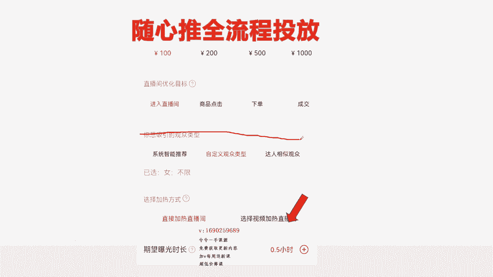

这个板块呢也是要讲明白的，不讲明白你没办法去结合去投。

因为我第一个视频给你讲明白，这优化目标怎么分类的哦。

我什么直播间该去选什么计划呢对吧，第二个视频，把这每一个计划背后什么逻辑又给你讲了哦。

那我脑袋里面可以思索，我需要到底建哪一个，需要达到什么样的结果呢，我需要建哪一个呢，所以说有了这样的一个概念，那么到了第三个。

到了这个下面这个地方的时候对吧，我每一个计划我选点击选下单，选成交，我应该配哪一个观众人群呢，这个时候又是一个迷糊点了对吧。

又是一个麻烦的一个问题了，所以借这一个视频给大家去讲这个板块。

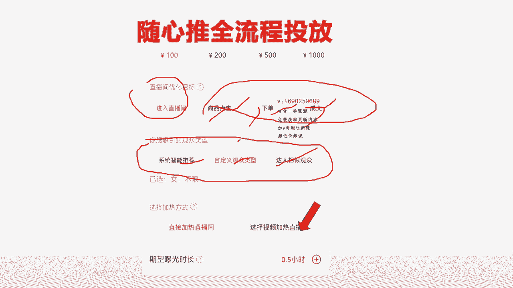

加下面这个板块把你弄明白，然后正好你从上面一路这么贯穿下来。

一个计划不就出来了吗，OK懂了吧，来整个抄一抄哈。

再开始来插一插，我们这来开始，OK所以听好了。

整个展吸引观众类型上面大家听好了。

这这个里边其实就完全是理念性东西了哈，我建的进入计划也好。

点击计划下单计划也好，转粉计划，评论计划也好对吧，来所有的每一个计划我到底吸引什么观众类型，也就是意味着来说来能不能明白一个道理的。

我的上面优化目标，包括这边还有互动跟转粉，对不对啦，还有互动跟转粉。

一共六个嘛，来我的六个优化目标里边，我每一个优化目标实际可以是挺好的啦。

我的每一个优化目标实际是可以干三条计划的，那是不是可以干三条的，我的一条商品点击可以选择系统智能推荐对吧。

可以选择自定义，对不对，我也可以选择达人。

对不对，这就一条计划，可以干三条计划了，一个优化目标，同一个点击我可以干三条计划的。

对不对，来这三条计划大家有听好了话，来这三条计划的情况下。

我到底直播间加热呢，还是选择视频加热呢。

每一个里边又可以干两条，所以说我一个计划，其实是可以把它干成六条计划的。

对不对啊，来这一个对吧。

来四个了对吧，来对吧，六个了吧。

这样的话就可以随意去干，只要你明白每一个逻辑，你就可以随心所欲去建。

懂了吧，所以这是今天我真正给大家去讲的这个东西，开头就说了，一定让你们听明白过。

自己会见，这才是关键，所以我建的每一个计划，都最起码是可以去干出六条计划出来的。

那OK接着往下面过哈，大家听我说。

来，啊大家听我说来OK来我回个信息哈，呃几个就行，别太多哈，我在录课，等一会听我说，大家来听我说来在这个过程当中呢，首先上面的优化目标都给大家解析完了，那么就在这个里面需要去解析了，首先第一个问题。

系统智能推荐，这个里面解析是最多的一个问题哈，就是账号首先在分为有标签跟没有标签，有新号跟老号之间，新号跟老号之间听好了，新号不能选。

系统智能推荐系统不知道给你推什么人，老号完全可以选择系统智能推荐他进来。

推进来的人群，不管是数量上面还是质量上面。

绝对会比你选的制定义达成捆制，观众相对来说更直接更快一点，这就是为什么千川我们会搞通投的原因。

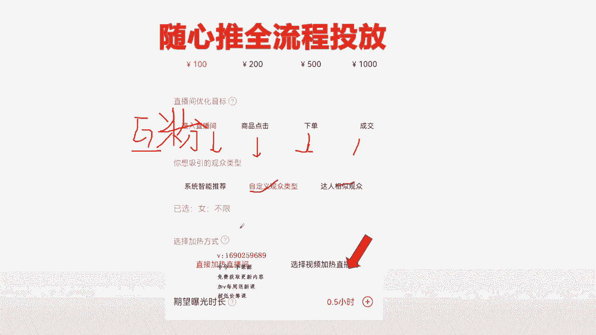

知道吗，你会发现前面在做人群精准的一个投放，筛选行为，兴趣到后端的时候，它突然就变成了选择系统智能推荐的，就这样，所以听好第一个问题，新号不能投系统智能推荐。

因为他推不出来，它会推乱七八糟人群来，那么老号的情况下，完全放心大胆摔给系统智能推荐，等会我会用账号去给大家去做投放，然后会给大家做演示的哈，OK来，所以记住第一个问题，来系统智能推荐这个问题。

板块里边呢，就是听好它会推来一些精准且泛的人群。

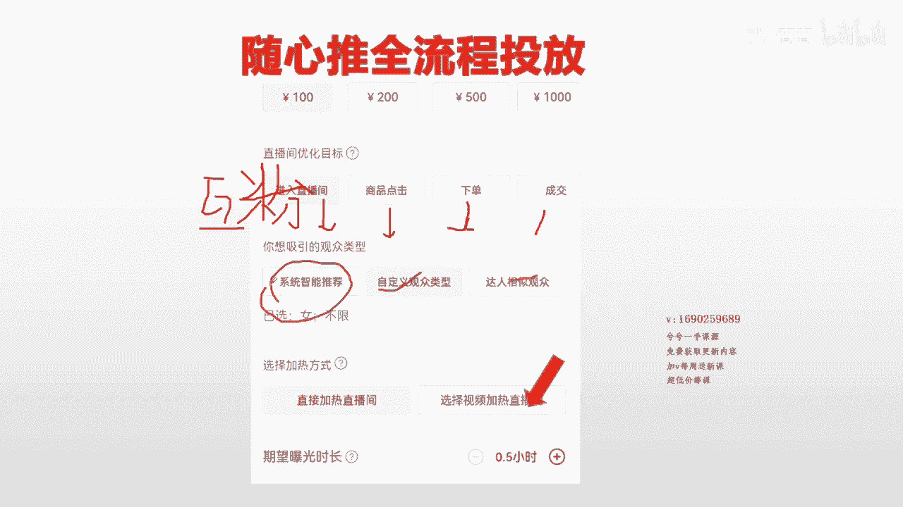

听好了哦，精准且泛的人群，什么叫精准且泛的人群。

就是说比如说我的这个账号是知识干货，卖卖货的吧，用卖货的号更好对吧，来更好理解卖羽绒服的号，我是卖羽绒服的，当我选择系统智能推荐，选择进入也好。

来选择进入也好，下单也好，成点击也好，成交也好。

不管我选择哪一个的时候，当我选择系统智能推荐的时候，那么也就意味着平台会把我的直播间曝光给。

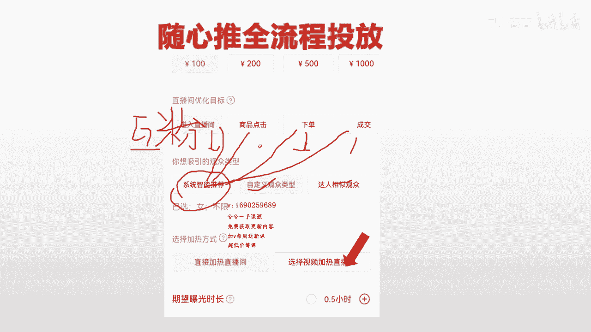

喜欢看一些女装，羽绒服之类的这种观看行为的人群。

看到我的直播间，对不对，那么这部分的人群呢，从18岁到80岁之间都有，是不是没有错对吧，这就是我说的，为什么它是会推来一些精准的且泛的一个人群，的一个关键原因，这个大家能明白吗。

所以系统智能推荐他会推来精准的。

但是呢它相对来说，它会推来精准且泛一点点的人群。

所以如果你是一个老号的情况下，那么你在选择推荐的过程当中。

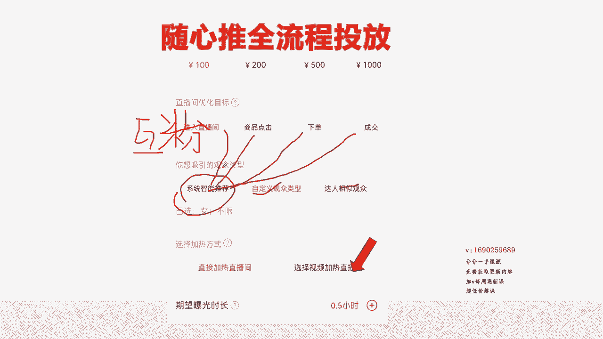

你想针对你的产品，或者对于说有些小众类的产品，它针对的用户群体。

就是那么一丢丢的用户群体的时候，那么在账号有模型有标签的时候。

大家也可以不选择系统智能推荐。

那也可以不选择系统智能推荐，也可以选择，也可以选择呢选择自定义。

根据产品的属性，比如说我的产品羽绒服，就是面对25~35岁之间对吧。

来或者到30岁之间对吧，来那你这个时候就干25~30。

女性嘛就行，干女性来干女性，干25~30。

反正账号有标签，他会给你推来精准的25~30的人群，这部分人群就变得更加精准。

这个大家好理解吧，OK能理解吧，懂了吧。

但是听好哈，不管是进入也好，评论也好。

涨粉也好对吧，都可以这样去投来制定义观众类型，还有一个现象就是在星号起号的过程当中。

大家听好星号起号的过程当中。

一定要围绕在星号起号的过程中，一定要围绕着制定义去建，几乎是百分百的围绕着制定义去建，但是我教大家一个方法，我教大家一个方法，信号起号的过程当中，你投的进入也好，涨粉也好，点击也好，下单也好。

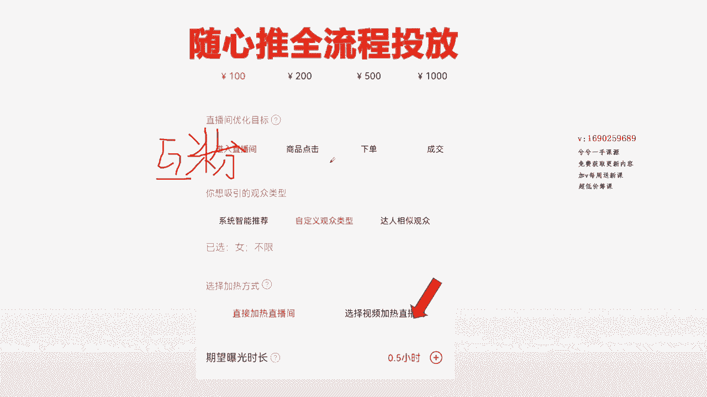

成交也好，他都可以围绕在自定义去建，但是我既然教大家一个备用方案哈，因为其实起号阶段，就是为了让精准人群到直播间来形成下单行为，然后打上标签，对不对，达人是更加精准，没有错，你的想法没有错。

但是达人有时候会跑不动，有时候能跑动，所以呢这个时候我建议大家这么去投新号。

起号的过程当中呢，上面优化目标就先不管它哈。

不管投哪个优化目标，你选择制定性观众类型去筛选，针对产品属性，筛选精准年龄人群到直播间。

然后你的预算假如是800的时候对吗，来那假如是800的时候。

那么你去拿出200到300出来。

去投达人这个板块试一下，比如说下单投达人对吧，来或者我们点击头达人。

对不对啦，你去投达人，把达人多拉一些达人达人拉个十个20个的，听我话没有错，多拉一些没有错，拉的越多，覆盖用户群体越大，有些全是纯扯犊子的，说什么拉的越多，系统算不过来。

那我千川为什么拉五六十个都能算的过来，对不对呀，那千川拉满都能算的过来吗，对吧，随心推只是牵他移动版的一个啊，极速版的一个移动端而已，他也是巨量的一个产品工具啊。

所以你不用去听那个扯犊子的话，多拉一些达人进来。

然后的情况下，你把它拿个200到300出来去跑一下，同样建嘛来你开播的时候呢。

我比如说借500的呢，可能有200的进入，然后300的点击或者或者200的点击。

一把的下单，全选的是自定义，对不对啦，全选的是自定义，对不对啦。

那这个时候还剩个两三百，我可以不管是下单点击也好，还是进入也好，我可以去跑达人嘛。

我可以跑达人嘛，那达人中间过程当中。

如果他能跑起来更好，对不对呀，如果他跑不起来的情况下，我不管它就行了嘛。

把它当做一个备用计划，跑不起来，反正又退钱了，又没关系的咯，对不对。

那哪怕我的总预算800，预算被他花了200去跑达人，在开播半小时，他还没跑通的时候。

那我再追加200，再追加200块钱进来投，点击下单或者进入不就行了吗。

把这个跑不动了，就别管它，反正又退回来了，这个能不能理解比较透彻了吧。

这个比较透彻了吧，OK懂了吧，听不明白。

你就倒回来一下，就看一下，那么就简单做一个总结哈。

在达人板块里边呢，就是在老号，就是账号有标签，有模型的时候，你跑它会跑的很好。

就投的很精准，投达人的时候，投达人也是投下点击下单成交比较多，基本投下单成交吧，这样的话他人群更加精的，你也是为了去更好的提升自家MV嘛。

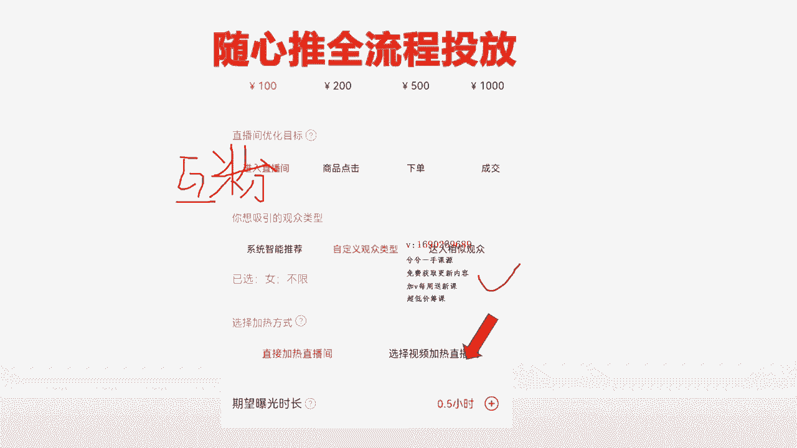

选达人板块的时候嗯，就是这个就不用我讲了。

很多老师都讲过什么粉丝量超多的那些别选啊，对吧，来，然后相对来说什么起号时间很长的，然后分别选哪，然后选一些相对来说最近刚起的一些号呀，其实呢有些道理，它不一定全是对的，大家听好了。

就是这样去选是最好的，选达人的情况，粉丝量很高或者起号很长时间的，确实粉丝量几百万，那些你别选你人货场干不过他，你选一些就是跟你差不多的追进一块起来的，粉丝量不是很多的一些账户就行，粉丝量不是很多。

跟你基本一个时间段起来的，或者达人这个板块，大家听好，最关键一个点，你是卖羽绒服的，不一定非选的是卖羽绒服的，卖羊绒大衣的，卖文胸的，卖那个羊绒衫的都是可以的，在同一个属性品类，包括说难听点的哈。

卖衣服，卖美妆的都行，他只要有过同样的行为的，其实他都那比如说美妆的人群，他会不会买衣服嘛，很正常嘛，对不对呀，所以说这种关联性周边一点的嘞，腰带呀，鞋子呀对吧，写个选个鞋刷呀，鞋垫啊，鞋油啊。

这种人群上下游的都是可以去选择的。

所以这就是达人粉丝观众这个板块，一般的账号稍微沉点模型的时候。

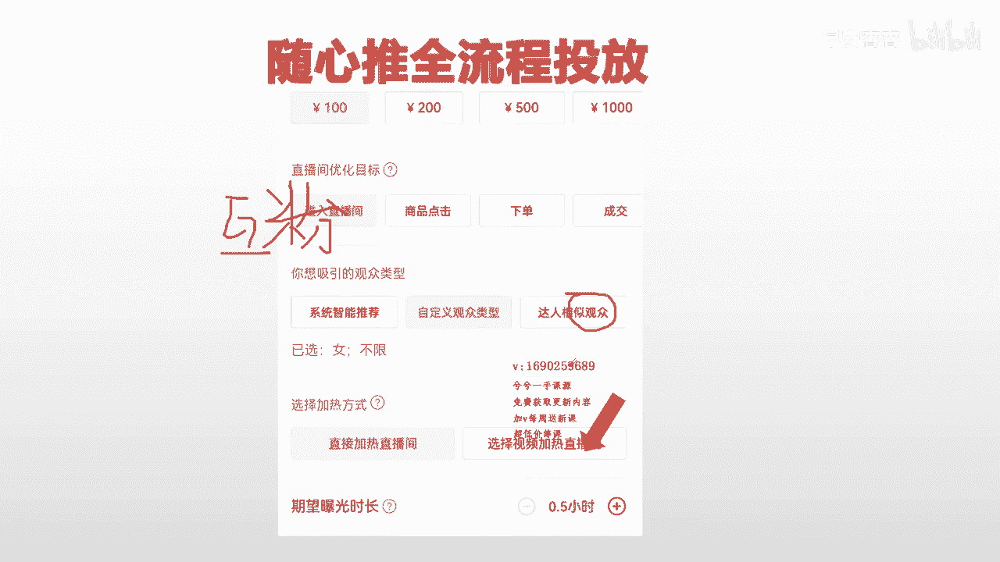

选它跑的会更好啊，在新号刚开始的时候。

可以选择自定义观众类型是最合适的，OK然后结合达人去投。

把达人当一个备用计划去投，那么稍微账户有了点精准的模型以后。

就有了账号的一个画像标签了以后，那么你就直接按照系统智能推荐去干。

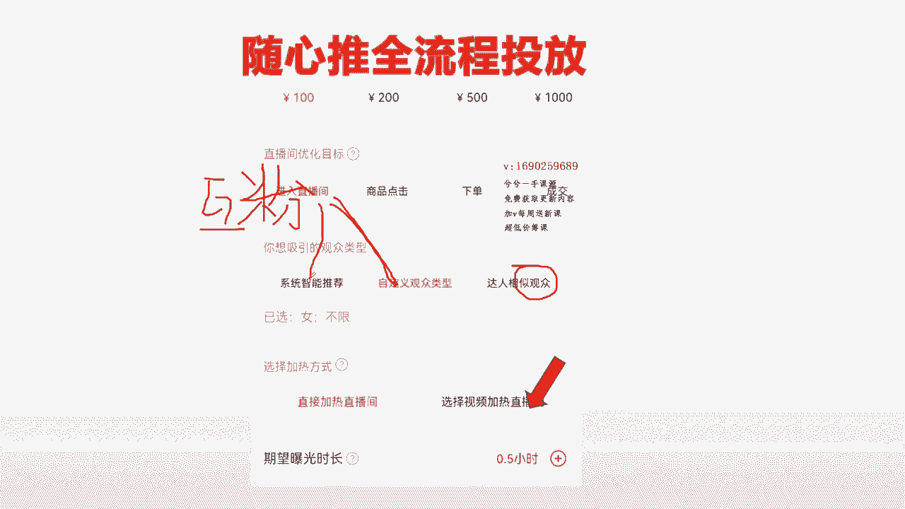

那一般进入呀点击呀，还是可以按照制定的关注类型这样去选，像这种下单成交本来要的就是向系统发出的。

就是精准人群，什么都别考虑下单成交。

直接就系统智能推荐直接干最好了，虽然说我这里边给大家讲，可以投达人去干，投产也好，但是系统智能推荐干最简单，知道吗，直接放开了去干，最好让他筛选精准人群，来到直播间，投达人也精准。

但是系统智能推荐他也精准，给你推来很多适合你账户标签的模型，所以这三个板块就弄明白了吧。

新号不要投，系统智能推荐老号的情况下，就直接干系统智能推荐就完了，或者说老号根据自己的产品标签。

新号是起步的时候需要投资定义去打标签，筛选精准人群。

来直播间筛选一个年龄性别，那么在卖货正常的情况下。

我们是借用卖货正常的情况下，我们是借用这个自定义去筛选账户的，一个精准的一个人群，针对产品去筛选性别年龄，懂了吧，或者去达人，这个板块是根据达人版块是账号成型一点以后。

下单成交或者进入都可以去选达人，你只要明白它的一个背后逻辑，我是推给这部分达人的一个粉丝观众。

类似这样的人群看着就行，所以说这个是随便都可以选的。

一定听完我的直播间以后，你自己变得随便会投了，那才是正儿八经。

关键的，懂了吧没有，所以你现在听到现在你会发现计划没有统一性。

听听到没有，听到这里三条视频讲完45分钟了。

计划没有统一性，来你会发现想怎么投就怎么投。

对不对呢，我想我有标签，想投系统智能推荐，就投资这种推荐。

我想筛选一下人群，我就筛选一下，我想去选个达人，我就选个达人。

我开心怎么投就怎么投对吧，我没有标签的时候，那么我最多系统智能推荐不推了呗，我投制定是投达人，我想咋投咋投，对不对呀，就这么简单，然后呢在这个板块里边呢，也要给大家去略微的去讲一点东西。

就是在人群速度上面一一啊。

三来OK啦。

人群速度上面其实也是这么个情况，系统智能推荐来人速度快哈。

同样一条进入直播间呐，我们同样去建一条进入直播间来。

同样建一个进入直播间，选达人，进来的速度，远远一定跟不上智能推荐来的人群快吗。

很正常吧，这个很正常，因为系统去算嘛，这个算的很快嘛，所以说这个时候，你脑袋里面是不是有点清晰的关联了，哎我想要他战线稍微高一点，快速进来一点，那我就选系统智能推荐好了呗，我不着急。

我想人群稍微精准一点，那我就选指点点达人，稍微慢慢慢点进来呗，反正我进入直播间这一条计划，或者点击这一条计划进来的量它就大嘛对吧。

这个大家能明白了吧，所以这个板块就弄完了，那么至于下面这一个用视频加热。

还直播间加热，这一个就简单一点，这样吧。

这个就简单一点讲，这个不用去很复杂，一般直播间的情况下，选择直接直播间加热。

选择直播间加热大众品类，直接选择直播间加热，通过人货场的形式吸引。

把直播间曝光出去，让更多人看到，吸引进来，如果你是一个本身挺好的。

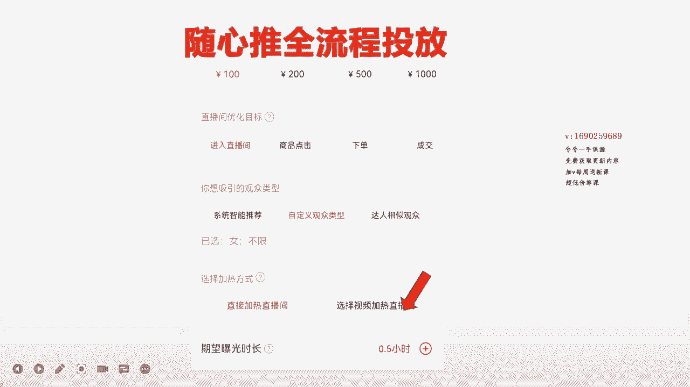

如果你是一个本身小众类的产品来，或者想要人群更加精准的小众类的产品，那你就用视频加热直播间嘛，就这么简单嘛，这个很简单。

这两个之间区别就是直投直播间，比如说那商品点击对吧。

系统智能推荐，当你直投直播间进来，速度一定贼快，当你选择视频加入直播间的时候嘞。

这个当你选择视频加入直播间的时候，那么等于是是投的是有过商品点击行为的，这部分人群来到直播间，然后还要用视频给他。

把视频推给这些人看，然后通过视频点进来，那这样人群会更加精准嘛。

就这么简单嘛，所以小众类的人群，或者想要人群更加精准一些的情况下。

你就用视频去干直播间，O懂了吧，至于下面选了几个多长时间。

这个就取决于你想要多长时间了，假如说我的在线。

我选择0。5小时呢，你想要我这100块钱的商品点击计划呢，这是开播对吗。

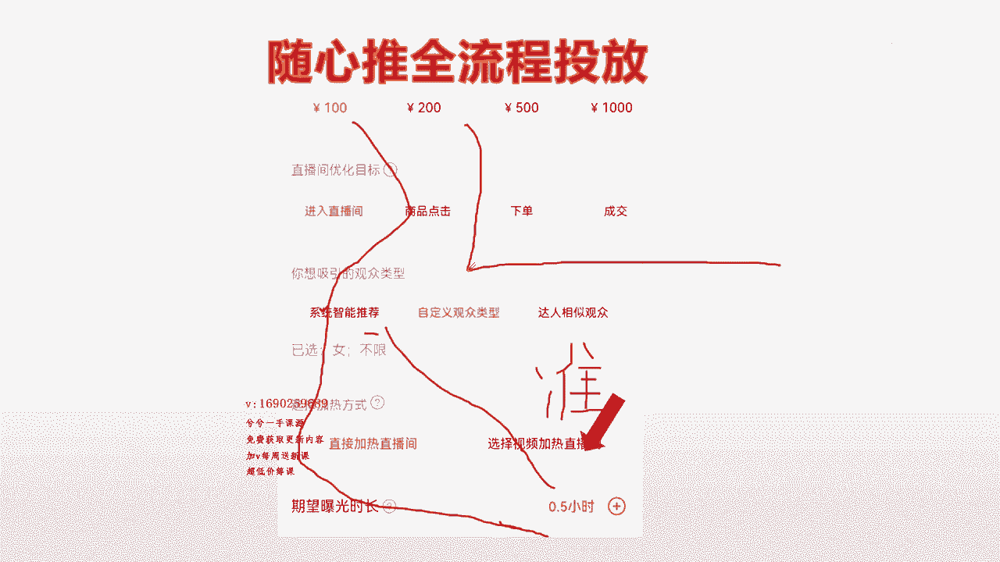

来那这是开播，正常这样的来，这是开播，来这是0。5小时。

对吧，来这0。5小时，这是一个小时，你想让我这一条计划。

比如说这条计划干来100人，那我这一条100点击系统智能推荐。

直播间加热来，我选能干来差不多100人，那么我选0。5小时。

那么就在这0。5小时之内，把这一把人一下子给干来嘛对吧，一下子给干来嘛。

那么这个时候占线就能拉高吗，如果你选择的是一个小时，那么他就均匀一点的干栏嘛。

就这么情况嘛对吧，所以这个很好理解时间段上面，所以待会再去给大家做叠加投放演示的时候。

我会给大家去多调的，按照时间段去拉给你们去看。

所以说这一节里边你们能不能听懂，听不懂就重复再听。

再不懂你就问我知道吗，就这么简单，所以说一定会把你们搞明白的。

好这这个就完了。

这一个完我下一个就给大家去搭建了哈，下一个给大家搭建。

