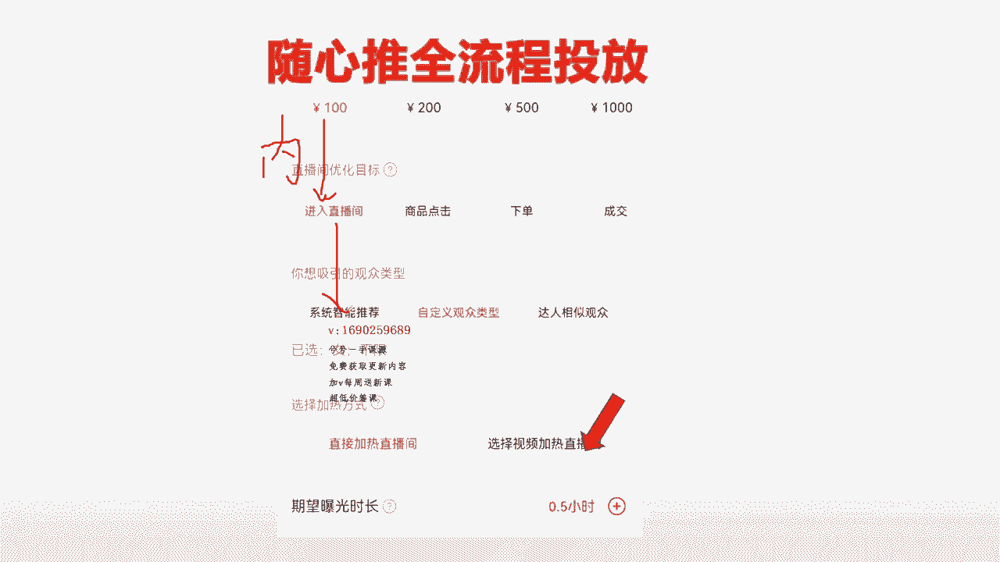
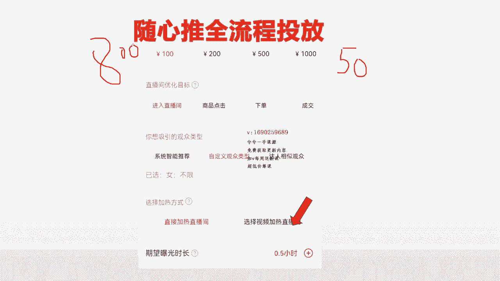
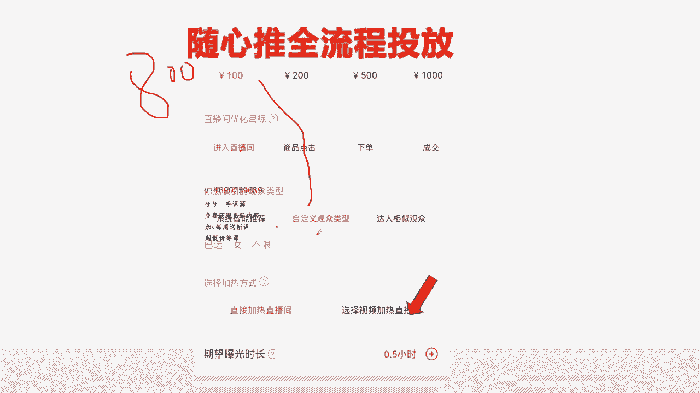

# 067 抖音电商直播投流起号课程 巨量千川全流程投放+小店随心推全流程+起号方式 - P11：小店随心推流程 4.mp4- - 早安睿睿 - BV1Nn4y197Wg

哈喽哈喽，欢迎大家回来，这是第四个视频了哈，进入到最后一个步骤当中，来这个步骤的话教大家去搭建了哈。

接下来的话就是你们前面没有听懂的，去重复听，知道吗，哪个点没听懂，重复听，然后的话还没明白的。

你就问我就这样去科技了，所以接下来进入到我们最后一个视频，我们要开始来搭建，怎么去搭建计划，听好了，因为这几个我前面所有的优化目标，都给大家去做了演示的对吧。

每一个出价优化目标什么道理对吧，来系统智能推荐指定性达人观众对吧。

直播间加热，这些都给大家讲明白了对吧，这些讲明白了以后。

最后四个大类讲明白以后就搭建了嘛，其实三个大类嘛，前面这些出价这个无所谓对吧。

接下来就到了，我们去正儿八经搭建的时候，听好了，来搭建的时候先用耳朵听哈。

现在用耳朵听哈，我的直播间现在比方来讲，先打一个比方，我先我是支持干货类的直播间。

比如说拿我的直播间来讲，那么我直播间没有车，那么我的计划就将围绕在，刚刚回顾的第一个内容，在内容指标对不对。

围绕着内容指标去建，对不对，来围绕着内容指标去建，那么内容指标有哪些呢，进入评论转粉，还有一个用斗加页面图的话，那它还有一个打赏。

对不对，来只能围绕着这几个键，那么我要不要打赏呢，不考虑不需要他们打赏，我要不要与其打赏，还不如把100块钱换成抖币，自己打的呢，我要不要涨粉呢。

根据你自己的需求，你想涨就涨就建，不想涨就不见，要不要互动呢，与其互动还不如我去喊两嗓子互动呢，对不对，这些是没问题的对吧。

所以说这个就可以，那么最终诶那我所有的计划盘选一下，那么我只有嘞进入评论转粉互动这几个啦，还有打赏了，我只能去见个金入，对不对，来我建个100块钱进入来。

我的账号是我的这个账号，支持干货类分享的，我建个进入我的账号，有标签对吧，我有标签，那么接下来的选择这个板块的时候。

我选择哪一个呢，来系统智能推荐，有标签可不可以，它会根据我标签推来精准人群。

对不对，没问题对吧，来我想筛选一下我的用户群体。

有没有问题，没有问题对吧，我想投达人进来对吧，来没有问题。

随便开心咋办就咋办，懂了吧，来这三个。

那哪怕我删，就今天用个给大家做演示吧，来的300的预算嘛对吧，来300的预算。

那我就三个各选一个嘛，我直接通用直播间加热行不行。

可以对吧，那我就直接三条计划，300块预算直接只能选进入计划。

那么我就直接干三条A进来了，然后选择曝光时长，这个就根据你这个高性选多长就多长吧对吧。

这个这个根据直播间情况去决定，来这个没问题吧。

那这个计划是不是我的直播间计划，是不是搭建出来的对吧，OK来我的直播间。

现在我是刚开的一个干货类分享的直播间，我没有我没有那个就是标签。

那这个过程当中，那我就那个呗。

那我就来把这个去掉呗，把系统智能推荐这个推不来精准人群来对，我把它去掉呗。

那么我就投投系统智能啊，投资定观众类型呗，或者再投个达人跑看看呗。

选择直播间加热行不行啊，可以对吧，那我我直接呢我选择视频加热行不行。

那这个先插一下这一这个地方一定不能模糊。

给大家弄明明白白的，我选择嘞，我直接刚刚这么勾一下，选择直播间加热。

可以对吧，来那我现在不选择直播间加六，我选择了我账号新号没有标签呢。

我选择视频加热人群更加精准一点，但是他用视频加热。

大家都知道人群会慢一点对吧，可不可以可以呀对吧，我这一条计划是不是搭出来了呀。

很简单吧对吗，来接下来的，接下来这是我自己的直播间，大一个给你们看的，后来接下来我们再讲比方来讲嗯，拿一个带货的直播间来讲哈。

因为你们主要是要学带货，直播间，讲完我再讲信号。

讲信号拉一下，然后就完了嘛对吧，大家就都明白了，不懂的话就再问，多听来带货的直播间。

现在回顾了现货，现在回顾了。

后来回顾到带货直播间来，现在是一个正常的一个老号带货的一个直播间。

老号带货的直播间哈，每天投产也还行啊，就是每天人也还行，慢的也还可以，现在想去破成绩，想去突破，那么这个时候怎么去投呢啊，比如说战线只有50个人。

我占线只有50人，我现在想把战线拉高一点。

那么我每天的预算可能也就千儿800的，比如说呢或者五百八百这样的一个预算。

我想把战线拉高一点，又想把成交拉高一点，那么这个时候我们可以这样去预分配。

比方来讲，我刚说了，卖货将80%，其实在70%到80%之间，围绕着点击下单成交去建立，然后我又讲了，这个进入跟点击它差不多，如果我是纯粹的是为了去把战线拉高一点的话。

根据战略信号，其实你可以去建一条进入计划。

老号的话又有标签，然后呢你想快点来，或者用视频直接加啊。

或者用直播间直接加了直播间，直接就这样去建，比如说100或者直接200对吧啦。

或者200这一条建出来，先建一个人气计划来，我又说了。

人机计划，可以围绕着商品点击这个板块去建的嘛对吧，可以围绕着商品点击。

你也可以把这一条直接把这一条不见了，把它叉掉来，我直接就建个商品。

点击选择系统智能推荐直播间加热，来200，这个没问题，就把它当成人机了对吧。

来或者我们直接就用人气，那么我们再建一个，来再建一个商品。

点击来我选择系统智能推荐对吧，来选择直播间加热。

选择一定的时长，我想要投多长时长，投多长时间，这两个了吧，那比如说两两都是400对吧。

来这个两个的对吧，这个400还剩800，去400，还有400。

剩下的400直接那二把乘以二吧，或者直接直接去四吧对吧。

那二把乘以二直接干下单呗对吧，来下单的情况下，账号有标签的，直接投系统智能推荐呗。

然后嘞至于选择快一点进来。

或者说那进来速度快一点，或者选择那个想要投产好一点，可以选择是啊。

进人快一点，选择直播机啊，直投你也可以选择更加精准一点，可以选择视频投。

那这样把时间选一下呗，时间上面投一下呗，这不就行了吗。

游刃有余了吧，来400的一个下单对吧，来因为账号有标签。

选择系统智能推荐对吧，然后呢选择直播间加热，最快速度干直播间。

我的产品是属于小众产品，我选择了我选择了下单。

选择那个选择系统智能推荐，选择视频加热，选一下时间都没问题吧。

很好理解，是不是，所以每一条计划一定要做到游刃有余。

知道吗，你想怎么搭建，怎么搭建，这才是关键，接着刚刚那个老号讲哈。

来接着刚刚老号讲来，OK的，我这个是老号。

那我这个是老号，我现在先要50个人在线，我先要拉一波在线人数来。

先进一个，建立了，先建一个，进入了来吧，来到底是想要速度快一点还是慢一点，还是精准一点，取决于你自个七言系统智能推荐完全没毛病，如果这条计划只是为了拉战线的情况下。

直接选择系统智能路线，最快选择直播间加热。

OK这一条完了对吧，来200，比如说200总预算干掉，那么接下来我是为了去投诚交嘞。

我整个嘞商品点击对吧，来那商品点击，我刚刚是教大家第一遍是拉的是系统智能推荐。

这一遍拉自定义好了呗，来我根据产品属性去筛选一下性别年龄对吧。

来来我下面选择直播间加热对吧，来选择时间。

或者我下面选择视频加热，来小众类的就选视频对吧，选择时间就OK了呗。

或者我直接来选择达人了对吧，来我选择达人粉丝观众对吧，来我选择直播间加热。

选择视频加热，如果选择达人，就是在这三个里边。

你想速度快一点就往前跑，选系统智能推荐，自定义，想速度慢一点，精准一点。

就往后面打点上面跑，这个下面也是一样，想要它快速一点，就选直投。

想要它精准一些或者小众类的，就选择视频，这不就OK了吗。

谁游刃有余的去投，这才是正儿八经，你懂得计划的一个关键的所在。

知道吗，能不能听懂，那这是一个老号，对不对，就这样去投了。

再拉一遍老号了，再拉一遍呢，老号的情况下呢，我现在说实话，我战线50。

我感觉也还行，我不投了，我就预算800块钱了，先干200商品，点击来干一个系统智能推荐。

干一个视频，那这个地方系统智能推荐，我说的他会有点精准且泛。

那我用视频去干一下，他不就精准了吗对吧，来直接干一个时间对吧，0。5小时或一小时两小时的对吧。

来这个干一下，来给他干掉200对吧，来投掉200。

那么我另外的嘞我全部去干一些600，还剩600的预算。

对不对嘞，还剩六百六百的情况下，我直接干下单或成交嘛。

来一个干300，对不对，来一个干300来下单成交，基本会选择系统智能推荐。

知道吗，来如果你想要哎想让人群来的精准一些。

根据产品属性去去筛选精准一些，那我就选择系统智能推荐嘛，来啊选择自定义嘛。

来正常下单成交，账号有标签的时候选系统就可以了，那你也可以想他速度再慢一些了。

更加精准一点，那你就干达人嘛，其实真正的干出来投产还是这一个。

相对会更好一些，记住了老号账号标签清晰。

真正下单成交什么的，其实还是干这一个，他的投产会好一些。

但是我要把每一个给你们讲明白，你这样的话才好干，知道吗，所以这不就很简单。

800不就花出去了吗，对不对呀，那下面想要的速度快一点，就选择直播间。

想让他速度精准一些，就选择视频加热，小众一点的就选择视频加热，来大众一点的就选择直播间不就OK了吗。

这样不就拉好了吗，所以这个计划很好投吧。

所以你们一定要根据自己的直播间诶，我想要在线多一点呢。

我想要在线多一点，那么我就围绕商品点击呀，或者进入呀，多建一些嘛。

那我建进入建建入的情况下，他又没有投产，那我是不是略微考虑建个商品点击。

然后一样的，有标签的话就选系统智能推荐，没标签随便选，对不对，来来看对不对啊，来所以这个东西根据你自己的感觉，想怎么投就怎么投，懂了吧，所以接下来呢给大家再演示一个，新店的一个新计划哈，星号怎么投号呢。

新号比如说拿一个卖卖什么都行，卖不卖卖那个卖男鞋的吧，好吧，拿一个卖男鞋的，男鞋头的话比较那个一点啊，拿个男鞋，拿个女装来说吧，女装最简单的，大家最好理解，来新号刚起步随心推，怎么投呢。

第一个投进入必然债券不多，需要补进入，对不对，不进入了以后，这是必然的战线不多不进入对吧，OK来补进入先，别完全靠商品点击补进入，一定会比他快一些，人群差不多，但会更快一些，来进入这一条，补完以后。

兄弟们听好了，来系统智能推荐肯定不能投乱七八糟的对吧，来达成粉丝，观众投完过后，进人速度肯定很慢。

唯一的选择就是来制定观众类型，对不对，来直播间加热最快速度，因为新人需要快速来人对吧。

选个0。5小时，让他快速来人，这一个是进入计划，对不对。

OK这是第一个对吧，来第二个进入计划，挺好的啦，我再跑一个备胎达人。

试一下，能不能筛选一些精准人群进入到直播间对吧，来OK来选择直播间加热。

这是第二条对吧，时间多长，取决于你们123小时，取决于你们自个选好了。

这是第二条，来两条进入计划，星号几号，这两条进入计划拉出来对吧。

OK来接下来来插一下哈，这是两条进入计划，差一下对吧。

来信号情况下，第二个呢我说过商品点击进来的，投产也很好。

进来人也很多对吧，这价格一定选择点击马来点击，无非就是这一个来。

要么就比如说预算200的情况下，要么就直接200干一个点击感，制定观众类型。

直播间选择这样，那时间根据资格选开心，选多长选多长，这样的话这一条计划就200对吧。

干掉点击干掉对吧，来接，要不就100对吧。

直接按照这样去投来，这是一条来也可以额外对吧，来额外的情况下尽量不去投达人哈。

如果投达人的情况，你就把他当成一个测试计划。

投达人，然后选择直播间加热，另外一种方式就是在这里把这个地方插一下来。

我的这一条点击计划呢，我想让它产生一个好投产。

你选择视频加热直接投一下，这是第二个方式对吧，来这是我们投的第二条点击计划。

两种形式，一种投直播间，一种投这个对吧，那么其实第三种投下单或者成交的计划。

也是一样啊对吧，来比方说我们现在预算300，是下单计划。

直接下单成交是一样的哈，你可以把它撇开来投，可以直接投来300的一个嘞。

加一百三百的对吧，那300的一个下单对不对嘞，制定观众类型，投200对吧。

来或者直接三把拳头制定给观众类型对吧，来根据产品属性筛选一些精准人群，对不对，来筛选一些精准人群，来直接来啧。

来直播间加热，然后来时间选一下，OK对吧，来来来可以直接来选择了视频去搞一下子对吧。

来我觉得信号起号过程当中。

大家不用视频去搞，太flag了，太精准了，反而会压制它，跑不动，就这样直接300下单，然后选择自定义年龄性别，选一下直播间加热，这样就完活了。

知道吗，搞一下的嘞，或者来投200下单，这是投200，再留100。

留100的情况下，那么这个时候来这个时候再下单，对不对，然后补一点吧。

打人嘛呢，选择直播间加热，那这样拉一下时间选一下，这样三版是不是花出去了。

前面的点击两版是不是也划出去了，进入两版是不是也划出去了，七八版是不是就花出去了。

所以他是不是很好建了呀，听完我估计你们刚听完他会有点懵。

但是你要反复听两遍，把我这个听明白，这个计划你是随便。

你已经是完全吃透了水星队的计划的，一点不带吹牛的啊，完全吃透吃不透。

你来找我就行了，没弄明白你就喊我，这样不就OK来信号不就弄好了吗。

信号怎么投不就完了吗，那这样的话我们是星号投了一个进入。

投了一个进入，投了一个点击，投了一个下单对吧，或者说下单成交组合起来投都行。

或者点击下单组合起来，这个都可以，就根据你，你一定要明白每一个计划它的底层逻辑。

它能带来多少人，他是产生什么的，他能不能产生钱，懂这个以后他就随便去搭配了，知道吗，下面这种东西就是速度问题。

人群精准度问题，这个也是嘛对吧，所以说这个东西理解透了以后。

他就很好去偷了，所以基本上我的这一节随心推课讲的价值。

真的是跟他们的清创课的总数，上千的线上清传课价值没有太大区别。

真的已经很透彻了，所以呢包括老号再给大家拉一个来对星号。

中间星号刚开始按照我刚刚那个进入点击下单。

来记住了，在这个时间上面选择有一个点，就是如果你可以把它开播时候嘞。

开播时候比如选0。5小时投的计划呢，比如说是这一条进入，你额外再追加。

最后中间的追加一条一个小时或者1。5小时，再追加一条一模一样的。

把时间追加1。1。5小时嘛，要不然的情况下这个就一步拉到位。

就讲完了话嘞，来这是这个地方是两小时，这是一个小时。

这是0。5对吧，来这个地方0。5来，那这是开播流量对吧，来开播流量这样的来。

所以说你选0。5的时候，他人群就拉很快速时间，把这个地方人群拉高了嘛对吧。

就这么简单嘛，把这个地方会拉高，那么它过去就结束了吗，那么你在开播。

你再建一个1。5的，那么它就是很均匀的在这边跑嘛，在这边跑，他就能把后面的人群都拉起来嘛对吧。

所以说这个比较好理解哈，就是这是一个很简单的道理。

然后整个计划不就会搭建了吗，所以听完这四节课以后。

一个小时基本就OK了，还没OK的，直接哪个地方听不明白，你来找我。

然后再给大家演示一个哈，再给大家做一个演示演示一个。

再给大家演示一个老号，所以新号的话先先把新号给你们演示完吧，刚刚新号就给你们演示了。

所有的就是进入点击下单，怎么投的，都演示完了。

包括在中场的时候听好了哦，在中场的时候，比如说开播到一个半小时的感觉。

在线比较少嘞，那你就补在线嘛，来你就补在线不就行了吗。

来在线比较少了，你用商品点击去补个债线不就好了吗。

选0。5小时，快速让他起量，快速让它形成订单，对不对呀，来补就行了嘛，感觉业绩不怎么好嘞。

直接来0。5小时下单了，选择啊，星号星号不选系统之间对。

选择自定义观众类型对吧，来选择直播间加热，来选择0。5个小时或一个小时。

快速让他下单就行，这就是中场补的慢，就缺什么就补什么，你感觉有点缺人了。

那么我补人补人的话，我是补进入呢，还是补点击呢，还是补平呢。

还是补转粉呢，你看我又缺人，又缺业绩，那我先确定我补人，那我补个点击或者补个进入。

那么我还缺，现在成交也不咋地好，我再补下单嘛不就好了吗。

这下彻底明白了吧，兄弟姐妹们呢，有没有彻底明白。

我相信基本已经第一遍听完我讲的东西，是毫无保留的给大家讲这些东西的。

你应该会有点晕，但是我觉得你听两遍，你就有两个小时，四个视频加起来一个小时。

两个小时的时间，一定会让你把随心推玩得游刃有余的。

来老号再给大家拉一遍，好来老号新号刚刚怎么投的，中间怎么补的都给大家了对吧。

缺啥补啥，老号阶段的情况下。

老号阶段的情况下来在线也有了80人在线，对不对的。

在线也有那80人在线，就是感觉卖的不咋地，那你就直接补下单嘛。

来就补下单，补点击嘛，补成交嘛，尽量补尽量补下单跟成交。

因为这两个比他更精准，我上面第二个视频讲过对吧。

那下面的情况下来直接来投系统智能推荐，让他快点来，来投达人的情况下。

让他成交稳一点，然后这两个之间就比一下，看看谁到时候跑的投产好。

谁不好把它叉掉，懂不懂，那这两个筛选一下。

所以说中间信号啊，老号稳定的情况下，中间跑的基本都是成交嘛，都是下单嘛。

懂了吧，来下单就跑，直接进码，下单就跑，直播间加热嘛，来这样的话往里面补不就行了。

缺什么补什么就这么简单，OK所以今天嗯一个小时的时间给大家讲清楚了。

整个回去慢慢练吧，这个东西是整个。

你看我毫无保留的给你们讲一个小时，何况大家在线上，为了去吸引到线下听课。

给你们去埋雷，要讲多长时间对吗，懂了吧，OK有感谢大家支持哈。

那么这一节小店随心推全流程，我就给大家去讲明白了，不懂的就再来私信我好吧。

感谢大家。