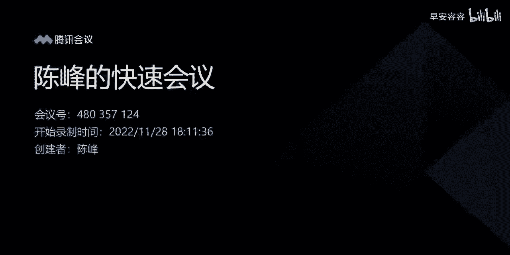
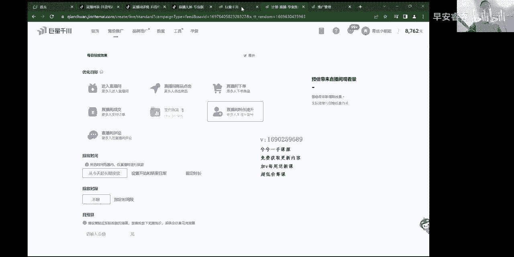

# 067 抖音电商直播投流起号课程 巨量千川全流程投放+小店随心推全流程+起号方式 - P12：千川全流程投（1980）   第一节 基础页面.mp4- - 早安睿睿 - BV1Nn4y197Wg

哈喽哈喽，欢迎大家走进我的线上宣传课，那么很高兴能够在线上这么长时间，得到大家的认可，当你走进这一节课的时候，我的线上宣传课可能跟别人有点不一样，别人为了纯属的去卖线上课的情况下，1980。

2980给你录个很多节，很多节的一个线上课，很多基础的东西录进去，然后显得内容又多么的丰富，然后卖了个2000块钱，那么对我而言的话，就是实实在在的给大家去，把真正的实操里面有些东西给你讲明白。

你们会投放就OK了，所以我的宣传课的录制，可能也就在两三个小时的时间，把高产计划该怎么样去搭建，然后计划中间该怎么样去调整，然后他的一个搭配逻辑是什么，把这些东西给讲完就行了。

包括单品多品直播间该怎么样去搭这些东西，讲完以后，基本的投放也就这么些东西，所以一般的为了照顾到很多新手的一个关系，所以我还是会把页面的一个整体解读，从头到尾很细致化的给大家做一遍解读。

那么在直播间有时候我基本也给大家就讲完了，这个板块，有时候每天，所以说既然能够大家来买现坦克花的钱，那我从头到尾再讲一下，那么对于更多的老手来说的话，这种东西已经没有什么太多的作用了，人群包。

包括计划的搭建，行为兴趣对吧，这些东西达人版块该怎么样去选择，但是对于很多投放逻辑不是很清晰的人来说，这也是一个基础的板块，所以说呢就是行为兴趣，莱卡页面解读，包括人群包，然后投放逻辑。

计划搭配的一个配比信号该怎么样调整，接下来就围绕这些话题，我们往上面去延伸，那么第一个视频，我还是给大家去讲一些整个页面的一个搭建吧，包括行为兴趣的一个组合板块好吧，那么首先我们现在来点开新窗。

我把页面给切一下啊，把屏幕共享一下，这个时候把屏幕共享进来以后，那么我们这个账号是自己账号哈，反正经常用，大家也都知道，我们回到我们整个清川的一个页面当中来，就先给大家直接去拉页面去讲了哈。

第一个是这一章节，我们先去把整个高产的计划的页面该怎么去搭，给大家从头到尾解释一遍，然后来考板块的话，我也单独在里边去单独去讲一下，在专业计划嘛，刚开始我们建专业计划，其实在投放的时候，大家记住了。

在整个页面里面图文直播带货，包括通投广告跟搜索广告讲一下的区别啊，就图文带货跟直播带货，这个也不用讲了，大家都知道图文是跑短视频的对吧，他的核心点是素材好就OK，那么直播带货的情况，我们跑的是直播间。

但是大家听好了，很多人受图文的一个影响，就是通投拉满999去跑是没有错的，在跑图文板块的时候呢，只要视频素材能测得出来，包括我们在直播直播带货这个板块，每一个计划搭出来。

如果要是以视频的形式去跑的情况下，其实跟图文带货的逻辑是一样的，只要视频的点击率转化率比较好，那么你上来就通通拉满就跑就OK了，那是没有关系的，那么刚开始的时候在测试的时候，可以稍微的去限制一点点。

治愈性别年龄，做一个基础的一级定向去限制它，把人群稍微收缩一下，那么跑图文跟我们直播带货跑短视频，它主要点还在于视频上面，视频只要一测出来了，那么你就无限的去跑多计划，不断的去组合搭建，去跑一个视频。

基本能跑个一个月左右，消耗是没有问题，能够吃的，那么在我们整个搜索广告里面，现在是这样的，我更多的投放会建议大家去搜索广告，跟我们通投广告结合去跑，特别是晚上时间段，搜索广告本身。

它是源自于我们的一个MOL系的一个转播来的，那么它会更加的精准一些，现在来说的话量上面也还总体还可以，就像我之前在直播间给大家分享了，一个人群包板块一样，我讲了很长时间的人群包。

每一场晚上都讲一个多小时，给大家讲的透透的，因为这是一个付费课程，所以我们有什么就说什么了，线上人群包板块我讲的已经是很透很透了，线下实操里边他也是那么回事，我的线下课里边也没有讲人群包。

因为太浪费时间了，讲一两个小时，那么搜索广告呢，相对来说就是现在会更加精准一点，就像人群猫一样，我之前一直说它不精准，那么现在投放也还可以，所以搜索也是一样，以前消耗很少，但他投产是高的啊。

现在的消耗也比以前高很多了，所以我们本身在跑带货的过程当中，直播间做计划的时候，主要就是以跑量，直播间的转化率起来过后热度高了，那么他整个计划的跑量速度就会快一些，投产也会高一些，同样一模一样的计划。

在不同的直播间，直播间热度不同的时候，在不同阶段它的投产截然也是不同的，你比如说我们去拉一个专业版的达人计划，在新账号刚开始的时候，有可能你去打一个主分类，比如说你是一个卖绿植的，你把鲜花打进去。

然后把下面各种绿植打进去，那么有可能刚开始新账号的时候，你跑得会很差，但是你跑着跑着跑时间长了以后，直播间热度转化高了以后，他投产瞬间一模一样，计划瞬间就弹起来了，所以很多时候大家的观念上要有一个认知。

在投放的时候并不是一昧的是以计划为核心点，计划只是搞流量的一种方式，而真正前端的人货场的一个架构，才是真正转化的一个核心网道，所以当你绘图了以后，能把人群拉精准呢，前面的运营端口非常重要。

去把排品跟主播话术给它优化好，这两者之间结合才能产生更好的一个IOI，所以在搜索广告跟小店随心推的时候，我更建议大家就是开始的时候结合起来，通头去跑，然后结合我们通透广告去搭就OK了。

那么通透广告里面两种形式，一种是极速推，一种是专业推广，极度推里面现在就成本稳投了对吧，所以说呢现在我更多的偏向于这样，大家听好了，就是我们是这样的，就是我现在这一章节给大家讲，高产计划怎么去搭。

搭完以后的情况下，到了讲投放逻辑搭建逻辑的时候，我会告诉大家新号该怎么样去投，老号该怎么样去测，这样的话整个流程就下来了，所以说我们进入到页面的一个，搭建的一个环节当中，直接去当专业版的就行哈。

只要专业版能够去会搭了以后，极速版会变得很简单，包括搜索广告也会变得很简单，主要的核心点的搭建在专业版计划上面，好吧，让我们进入到专业版页面里面去，那么上面这个就不用管它了。

这个是刚出的这个板块就不用管它了啊，第一个控成本跟放量，这两个投放方式决定了整个计划的投产，以及直播间跑量的一个观念，从通俗通俗易懂的角度来讲的情况下，我看一下手机，啊通俗易懂的情况下来讲。

大家会面临着一个问题，其实老号投放，等你看完我整个的这一个线上课的视频，那以后，那么你对投放逻辑会很清晰，那么刚开始的时候对于很多新手来说的情况下，在投放方式上是很难去把控的。

因为大家在实操过程当中遇到最大的一个问题，就是前期跑不动不消耗，是所有账号遇到的普遍问题，他就跑不动，那么要么就跑不动，要么出价你就抓不准，然后就跑飞，所以说大家听好了，在这个板块里边。

很少有人把这个东西在线上线下去讲的啊，在线上讲的很细致的，线下的话相对来说会讲的多一些，那么我自己本人投了接近两年的时间，所以在线上这快一年的时间呢，也一直在给大家在很详细的去讲这些干货。

所以大家记住了，通成本投放，相对来说他拉的人群会更加精准一点，那么对于一些成熟型的账号，就相对来说，我一场能卖个呃1万块钱左右，比如说两三万，56万10来万的这种成熟型的账号呢。

你在投放计划的时候也投了很多计划，那么这种账号相对来说，它的一个出价你是能够均匀找到的，根据我们的转化成本能找到出价，那么用控成本的形式，不管去搭建哪种类型，我们下面哪怕说像点击啊，下单啊。

二啊对吧之类的，全部随便你搭哪种类型，它的实际的转化成本，以及它的投产会稍微的高于我们的放量计划，这是必然的，但是它会有一个终结点，就是信号刚开始会跑不动，所以它跟我们的出价有一定的关系。

以及信号的一个投放逻辑的关系，所以大家记住控成本，一般情况下用在新号打标签的时候，拉精准人群进入到直播间，那么这个时候他需要去用控成本的计划，因为人群越控本，它相对来说消耗的速度会更加均匀一些。

更加准一点人群，所以对于我们新账号打标签来说的话，人群越精准，那么他打标签的速度就越快，那么对于新账号新计划来讲，控成本也是判断这条计划，人群基本精准的一个核心因素，因为你去同样一模一样的。

比如说投一个莱卡行为兴趣的计划，当你去打了放量以后，它的点击率必然会下降1%左右，那么新号有可能还不止，那么空本的情况下，你就能够去找到，虽然说前期低一些，但是它点击率相对来说它会高一些。

你比如说我们正常在直播间的时候，我们点击率在5~10之间，那么我们打空成本就能达到这样的数据，那么你打放量的情况下，它有可能就会出现在3~4，这就是一个正常的现象，所以信号打标签的时候。

可以用控成本去拉精准人群，第二个成熟型的账号，成熟型的账号一般呢相对来说的话，就是投产投放的计划也很稳定了，那么账号的消耗啊，包括直播间的转化也很OK，这种时候占用空成本的形式。

因为我们已经找到出价了嘛，所以说用控成本的形式呢，相对来说会去拔高投产，因为他打进来的人群，他的速度流速，这个流速呀就是相当于，因为这个是给很多新手去讲哈，所以大家听一遍哈，就是用空本的形式。

我能决定于我计划整个消耗的速度，那么消耗的速度越快，代表进入直播间人越多，这个大家能理解我比如说300块钱的时候，我去烧0。5小时，把它消耗进来，比如说消耗了1000人进来了，那么我在0。5小时的时候。

那么这0。5小时它的流速就很快，所以说它相对来说的话，它就会泛一些，所以控成本呢它能够用自己根据的一个出价，让它流速能够均匀的控制，这样对于转化上来讲的情况，转化率会偏高，这是第一种信号。

搭建的时候用空成本，还有用我们的老号去拔高，投产的时候用空成本找到好的计划，我们去找到好的计划，然后用空本的形式去投放，这样的话投产能够拔起来，还有一个人货场不足的时候，大家记住了，当人货场不足的时候。

因为我无法进行转化，就比如说我自己投过的有些账户，那么第一场投放他就0。30。5的投产对吗，这个时候就需要在不断的投放过程中，不断的直播过程中，不断的去调整优化主播以及产品的结构形式。

所以说这个时候当你用快速放量的形式，快速拿量进来或者高出价的形式，那么也就意味着人群流速会变快，那么它依然它的相对来说的话，它的转化成本是非常非常非常高的，因为那无法进行更好的一个，IOI的一个转换嘛。

所以就这三种情况大家记住了，一个是新号二，一个是拔高投产，上一个是人货场不足的时候，用空本的形式直接去拉就行了，但是它会出现计划跑快或者跑不动，这个跟出价有关系，我最后讲一下就行了。

方亮这个计划呢是这样的，当我们同样一模一样的计划去打开放量的时候，那么也就意味着它有一个背后逻辑，就是在整个所有的千川板块里边，所有的计划的一个排名规则，是根据一个公式叫ECPM等于点击率。

预估点击乘预估转化乘以出价，那么现在从今年改版以后，在这三个核心条件之上还增加了，如果跑短视频的情况下，它还增加了短视频的完播率，点赞率与评论率，增加了这些就是黑盒的一个因素在里边。

但那么这种因素呢包括直播间哈，直播间包含了直播间的一个互动转，粉灯牌这三大数据，所以说这样的话，就今年来说，我们现在投放的每一条计划来讲的话，它整个的排名就决定了ECPM等于点击率。

转化率乘以除价乘以1000，这是预估点击，预估转化哈，那么后面还乘以直播间，刚刚我说的那几种情况，包括我们相对来说跑短视频，短视频那几种情况加到一起，才形成了我们整个的一个计划的一个排名规则。

当然真正的核心的参考因素还在于，我们整个的预估点击，预估转化还出价，这三个还是主要的考核的一个核心点，所以大家要知道这个东西，那么当我用放量的形式去打出，这一条计划的时候，听好啊。

我用放量形式去出价的时候，也就是系统会根据你这个品类，比如说现在是晚上六点钟，那么我就在大盘这个六点钟，这个品牌这个价位当中，去找到这种平均值的一个出价，那么给到你一个预估出价，这样的话它会自动出价。

他能够跑的会更快，说白了一点，就手动洗衣机跟自动洗衣机是一样的，时间一选开关一开，它自动就洗呀，然后甩呀，然后烘干啊这么一个条件，所以说放量相对来说会更加智能化，那么这里边就是很多。

很多的新手商家在跑这种计划的时候啊，永远在新号上来，老手很好解决，永远在新号上面上来以后，他会面临着一种现象，就死在了这个空成本上面，他他知道放量会跑800年，不敢跑，一条放量计划一跑跑飞了。

一朝被蛇咬，100年，怕井真的是怕精神哈，就不再敢去动了，其实你今天能够听到我这里的直播的时候，看到我这一个新堂课的时候，已经解决这个问题了，嗯空本跟放量之间，更多的还是。

建议大家在找不到合适的出价的时候，用放量的形式去跑，放量是根据大盘的一个整体的一个趋势，会给你自动出价，它是最稳定的一种计划，如果说相对来说的话，容易跑飞的话，是因为直播间的一个话术。

以及引导的一个点击率的问题，包括直播间里边在我们正常过100块钱，200块钱，500块钱，800块钱，中间瞬间上来一个19块九的福利品去过一下，那么这个时候它会瞬间会形成。

我整体的点击率变高或者转化率变高，它会出现跑分，所以真正的放量，相对来说跑的是最稳的一种形式，但是相对来说的话，它更加于人群会泛一些，那么他怎么样去搭建呢，我给大家两种方式，第一种方式用放量的时间啊。

用放量这个优化目标，用你的预算跟你的时长来控制，那用放量，比如说我300块钱投一个300块钱的计划，我用放量的形式，我明知道它点击率会下降一点，人群会略慢一点，但是我把它时长拉长，我把它时间拉长。

虽然说它不一定我选择300块钱，比如说两个小时消耗完，它不一定占两个小时，消耗完300块钱，有可能10分钟对吧，因为点击率转化率高的原因，他瞬间跑没了，这是正常现象，不会都这样的，所以你们出现这种情况。

不用去管它，第二种情况下，有可能我300块钱两个小时，选择跑了两个小时过消耗了30都很正常，点击转化比较差嘛，所以它不消耗，所以放量会更加稳定一些，那么听到这，其实这里之间两者能去做一个融合。

就是我用控成本的形式，那么我去出价略出高一点，把时间说短一点，它也跟放量的形式是一样的，能明白吗，就是空白的形式，我一旦出价出高一点，时间说短一点，那么它的消耗速度也会变快呀，这个是大部分是这么个情况。

不是百分百的，那么放量也是一样啊，我把那个放量计划打出来了，我把时间拉的很长，我把预算拉的很低，那它的消耗速度也正常，情况不会太快的，当然你去选择0。5小时的时候，它必然会飞很快啊。

这是就是大家要了解的，所以控成本跟放量这两个之间放量的情况下，刚刚给大家讲了，空本放量的话，一般建立在啊账号比较稳定的时候，就是你正常每场比如说消耗消耗不出去太多钱，想去扩大更大的一个量级。

比如说我正常一场消耗2万块钱，那么这个时候我想要更大的一个跑量的情况下，那么为了想跑更多，你三个小时，比如说我要消耗5万块钱到8万块钱，那么你大部分计划都需要用放量的形式去拉，找到之前跑的好的计划。

用放量形式去拉，怎么去找这搭配逻辑等会就讲这个板块，所以说放量就建立在突破瓶颈，拓展体量，想要更多的拿量的时候，就要去用放量，或者在新号刚开始找不到标准的出价的时候，那么我用放量计划去投，没有关系。

不用担心它跑费，你要明白，当你去打了放量以后，那么它背后的人群确实会犯一些，所以说你这个时候如果是新号的话，你可以去用放量投一些精准的成交或者下单，我去投行为兴趣投达人，把地域性别年龄都死了。

说的精准一些，这样的话他虽然说能够快速拿量，人群越更加精准，越精准的时候略泛一点的话，它还精准，能明白吗，所以就这种形式，还有一个就是在节假日的时候，大明星头部达人打付费的成分特别高。

这个时候我们也需要用放量的形式，去更多的强调，因为你自己出价已经不知道该出到哪个地方了，这是最合适的一种方式，好吧，OK那么这就是控成本跟放量这个关系，那么在下面这几个优化目标里面，兄弟们听一下哈。

这几个优化目标是这样的啊，七个优化目标从进入一直到评论对吗，真正的对于一个带货直播间，或者对于相对来说的话，就即便是知识分享类的一些内容型的直播间，我们主用的其实还是下单成交，下单成交跟RY。

但现在真正主用的还是RY，明白吗，这个还是RY，这个非常重要，因为是这样的，就是商品点击它能够有一个词叫双力带动量，商品点击它能够去带动整个，因为点击率转化率乘以除价乘以1000。

等于决定于这条计划的跑量嘛，所以说双率带动量，点击率转化率乘除价包括1000，任何之间一个数据的变化，这个公式成立起来相乘起来的话，它的整个ECPM值都会排很高，所以说在点击这个板块。

更多的是用来去带动我们，直播间计划的一个跑量，有时候你会发现搭了很多条计划，它就不动就不消耗，那么你这个时候用户点击去拉一波的情况下，他立马他能够走起来，就是这样的，它能够走动的哈，然后到下面的计划。

大家要明白，计划是能够带动计划跑量的，是可以的，懂吗，这个是可以，但是呢听好了啊，每一个优化目标背后其实都是我们产品曝光，直播间曝光属于第一位，商品点击的背后，也就意味着来自然是有点击对吧。

直播间商品点击自然投过来的，是点击你们发这个群里边回一下嗯，你们回一下，既然是点击的情况下，那么也就意味着，首先我的前端是要先去把产品曝光出去，我的直播间链接曝光出去才会有点击对吧，所以你们要明白。

每一个优化目标背后的第一个关键点，是商品曝光，当然进入直播间跟那个评论还有转粉，这个不算啊，点击下单成交ROY的几个都是的，所以说商品点击的同时，第一个能增加我们商品的点击率，第二个增加商品的曝光率。

大家要明白，我们从那个巨量百印，尽量把一达人版的后台，我们一场直播拉过来，包括小店后台数据，它下面不有5S6吗，从曝光到直播间点击对吧，点击到直播间下单，整个的流程，其实这里边也就包含了这个流程在里边。

商品曝光到商品点击，差不多有20%到30的一个左右的一个，就是一个比例，这些每一个数据，每一个优化目标跟他都是对上的，比如说我投了点击以后，那么曝光点击率比如说偏低，比如说十的情况下。

那么我投了一个点击，它能够去增加整体的一个大盘的数据，那么直播间下单就是这样，那么下单的前端一定是商品，点击，点击的前端一定是曝光，所以当你的目标投得越深的时候，这DP优化目标越深的时候。

那么相对而言的情况下，它前端的每一个数据都在不断的去叠加的，去完成就是这样，所以呢成交也是一样，成交前端一定是下单，下单，前端一定是点击点击，前端一定是曝光，所以这三个优化目标都是在不断的。

包括ROY也是一样哈，都是在不断的优化商品曝光，点击率，点击下单率，下单成交率是这么一个流程，所以点击的情况下就是这样一讲，大家就明白了，那么对于直播间下单跟直播间成交，这两个优化目标。

说实话你们在正常自己带货过程中投放的时候，不一定要投哪一个自己去做测试，但是现在随着ROR人群呢越来越精准，那么更多的测试会偏向于，ROR这个板块里边去投放，但是下单跟成交这两个之间。

还是有一定的作用的，就是在投放的时候还是要去综合投放，如果你单独去投二的话，一定会出现一个问题，跑着跑着你会发现投产挺好的，你跑着跑着你投产就降下来了，那是因为ROI本身所抓取的人群。

是在成交人群的基础之上，所以说你跑着跑着成交人群本来就那么多，那么IOI又抓取了成交人群，能够符合完成你自家目标，业绩的优化目标的人群，那么比如说我成交里边有100个人，每个人都买了1000块钱东西。

那么我投IOI的时候，我的目标值设定的是，比如说1000到2000之间，那么相对来说就在这100个人里面要抓取到他，相对来说就是消费能力比较强一点的，才会进入到你这个投放的广告推广的范围内。

那么这个人群他就会变得更加窄，所以说你投时间长了，头头头头就是相当于把人群给投犯了，这个时候你会发现AI也不怎么跑不动了，投产也慢慢下降了，这个时候成交也跑不动了，被抓完了。

所以说如果出现这种现象的时候，那么我们更多的是去保证原有的RA计划跑量，比如说十条计划里面有5~6条就够了，那么剩下的成交计划，下单计划我这个时候需要去搭建的情况下，按照就是四五十%的情况综合去搭建。

这样的话还要单独拉计划组，单独去建立当新新的成交优化目标去跑，这样慢慢的跑跑就能跑顺了，就能综合到一起了，这些更多的还是留在那个投放逻辑里面，去讲这些东西，那么R2的优化目标给大家简单说一下啊。

记住这句话，就是成交，只是根据我们直播间画像，购买人群的一个画像标准，然后抓取符合，就是跟我们画像相似的人推进直播进直播间，但是他不一定不保证你成交量，但是ROR是建立在成交人群的基础之上。

抓取符合完成你GRMA业绩成交人群的画像，所以大家要记住这一个点，所以它相对来说更加精准一些，嗯成熟的账号的情况下，更多的以ROR跟成交结合去跑，那么新号更多的就是以成交下单，这样的形式结合去跑。

把人群锁定就OK，关于直播间的进入跟粉丝提升，还有评论这三个优化目标是这样，如果你是一个新号，你的场宽很少，那么其实你可以去投一两条进入这个计划，听好了啊，你可以去投那么一两条进入计划，把人群说的很窄。

把人群说的很小，然后呢相对来说投的越精准越好，然后出价出高一点，这样慢慢给他跑，跑个一两百块钱拉拉在线去住住铺底就行了，但这听好了啊，如果是成熟的账号的话，如果是为了拉在线对吧，做个铺底。

你如果过多的去搭成交计划的话，下单计划或者RUI计划去铺战线，它的成本会比较高一些，那这个过程当中你可以去大概一两条进去，但是大家一定要记住一个致命点啊，就是进入这种优化目标。

为什么有的IP老师在给大家做分享的时候，说狗都不带投的，一定要记住这个致命点，不管你怎么去搭建这些计划，不管你怎么样去选人群，不管你是控成本还是放量，不管你打10万，100万还是500万还是8万。

进来的人群都是个垃圾人群，很烦很烦，所以说一定要记住这句话，他真的能够超过一分钟停留的就1/10，如果你在场观基数不是很大的情况下，当你去投这种优化目标，比如说进入的话，你一投付费占比。

进入这个占比就能占到四五十%往上，你头几场就把你账号投死了，因为你进来直播间，直播间整体的观看人群，画像的停留，互动转粉灯牌，这些数据是形不成的，成交也是形不成的，所以指数盘子大了以后，你为了拉拉债。

现这样去投是没有关系的，小账号厂关小的，如果投进入时间长，一定会投资，能不能听明白他主要进来的人不精准，不管怎么去搭建，它永远都是第三方，比如说像那个穿山甲呀，头条呀，西瓜呀对吧，火山版啊。

做任务的这些人打进来的，他没有任何数据停留，直播间，只要没有停留的情况下，一定得对于整体的推流是有很大影响的，所以大家一定要能明白这个道理，那么转粉跟直播间评论差不多，他人群会比进入稍微的强那么一丢丢。

但是基本也差不多都是这样的，那么对于一个新账号来说的话，与其去刷粉，说实话哈，还不如偷偷转粉这个优化目标去真的去带一波，这个倒没关系，嗯就一个星号，当开始的相对来说的情况下啊，粉丝比较少。

那我投点粉丝增长的这种计划，就这种优化目标投一点好吧，人群筛的精准一些，他也犯，你塞的再精准，跟金融一样，塞再精准他也犯，这种是可行的，懂吗，这种是可以去涨涨粉是可以的，花钱去买粉嘛，就这么回事。

直播间评论的话，一般用在那种娱乐直播间吗，或者你就根据你自个需求，如果你感觉直播间评论率不够，那么你就上一个优化目标去带一带，但是我觉得有时候上这种优化目标，还不如直接去那个满脸假人，经常做出互动呢。

所以说一般情况下，在这几个优化目标里面，不做过多的一个正常直播间，不做过多的投放这种优化目标，但是有一点，如果是做那种多品类的卖尾货的那种直播间，比如说九块九，一个杯子，19块九，一个鼠标，29块九。

一个微波炉，39块九，一个电风扇，49块九，可能就一个扫地机了，像这种直播间的话，如果场景比较厉害，主播比较厉害，其实在一些点击呀，粉丝提升评论，这里边的人群都可以往里边打。

其实它每一就是每一个优化目标的深度，会越来越深嘛，那么像这种进入啊提升呐，包括评论呐，它是属于非电商指标数据人群，就是没有购买过的一些人群泛人群，但是你投多了，也在帮这帮犯人群投进直播间。

如果他一旦形成成交点击或者下单人群了，那么他也就进入到电商人群板块里边去了，所以说相对而言的话，如果开玩笑给大家去讲，能不能投粉丝提升进入评论呢，其实你可以去教别人去投，这样的话。

他是在不断的帮平台在校正他的人群的画像，把一些没有购买过的人群慢慢去做校正，但是自己千万尽量去少去投这个东西就行，如果就像明星一样，他的人货场是比较牛逼的，那么说他就可以投进入呀对吧。

投粉丝集团投评论呐，他照样他能转化，所以说的核心点还在于人设以及产品端嘛，所以大家明白这一个点就行了，OK好吧，所以这就是几个优化目标，那么还有一个没有给大家去说，成交跟下单之间哦，听好了。

成交跟下单之间分两种情况，就是没有一定的答案，大家可以去做测试，比如说我直播间里边，我主播也厉害，我品也厉害，那你在跑成交，比如说跑行为兴趣跑挺好的，或者跑RO跑啊，不RO跟成交是一个类型，做错了。

你说跑成交的时候，跑达人也挺好的，跑人群包也挺好的，跑那个跑一些相对来说系统智能推荐也挺好的，那么这个时候为了去更多的去大计划，去做测试的情况下，那么我这个时候可以去做一个下单计划，一模一样。

比如说投一个行为兴趣的下单对吧，然后投一个行为兴趣的达人，一模一样的去做测试调整是可行的，懂吗，就是这样的主播能力强的时候，那么更多的跟他说一下，我的录课主播承接能力比较强的情况下，是可以这样的。

就是相对来说的话，我可以去用下单去做测试，或者不品比较爆的时候，那么相对来说在主播成交能力一般的情况下，或者正常的情况下，我们更多的还是以成交，你只要懂一个逻辑就行了，下单跟成交之间。

它的深度是下单要浅一些，深成交要深一些，可能100个下单里边有80个成交的吗，这么简单差不多嘛，8~90个嘛，那么当你去投下单的时候，也就意味着计划消耗速度可能会略快一点，进来的人会多一些。

那么成交的话人群就会稍微小一些，速度会慢一些，但是相对来说精准度两个之间是不一样的，成交一定比下单的精准度高，所以才会涉及到我讲的就是人货场足的话，你可以投下单嘛，你要真的像明星那样去投京东就行了对吧。

所以说人货场不足的时候投成交，那么这两个之间永远做AB测试去变量，包括ROR3种形式去做测试，我同样一个计划，一种类型，我去三种类型多去测试，看看哪一种最好，这个大家能听明白。

