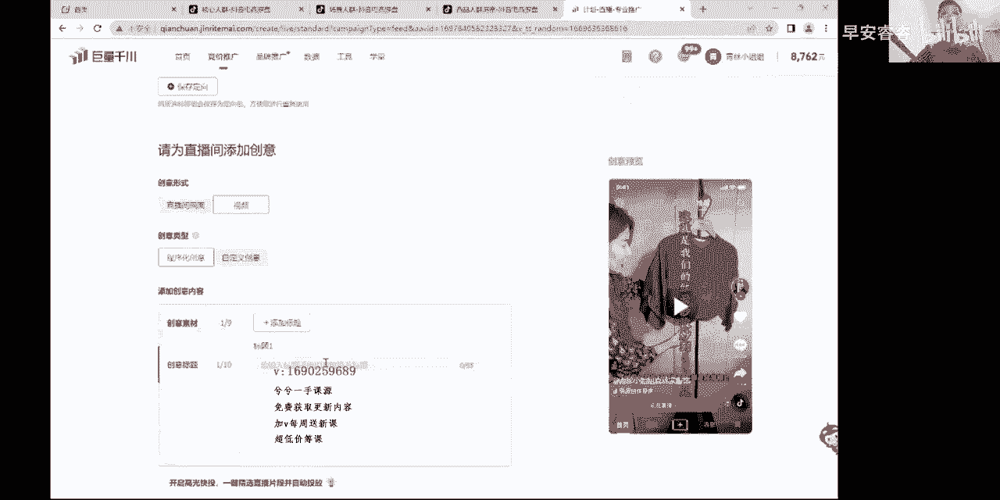
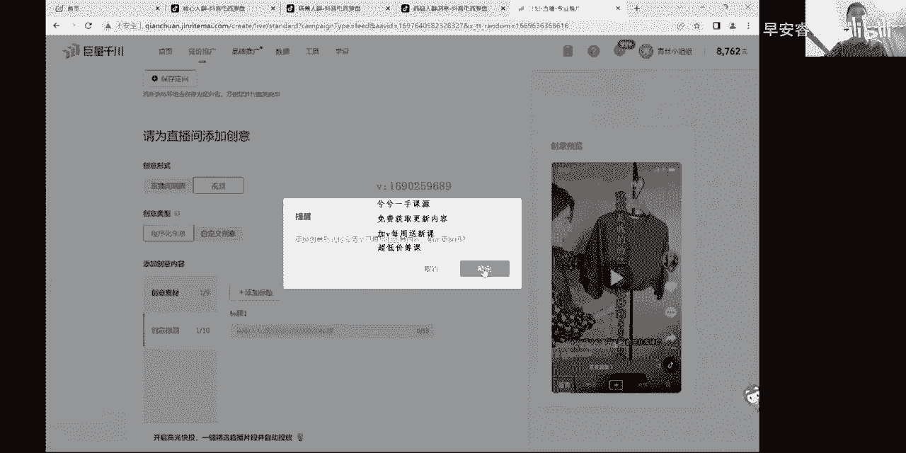
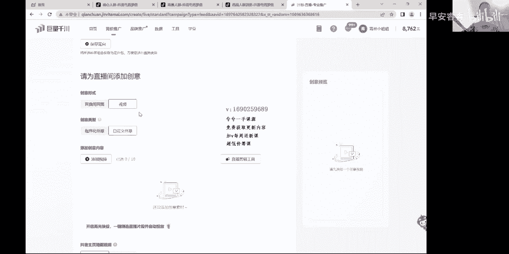
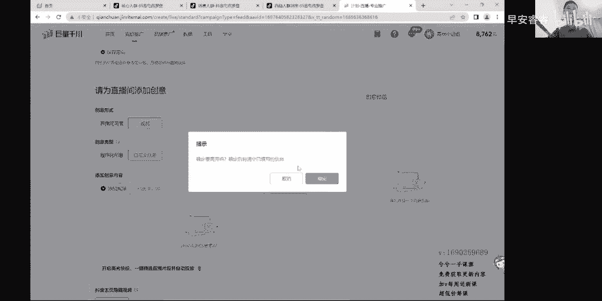
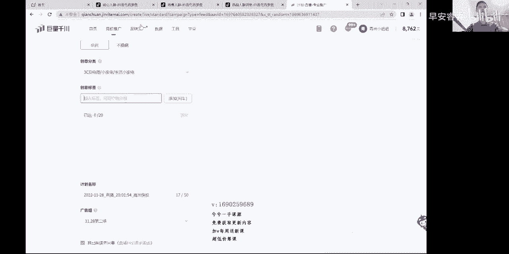
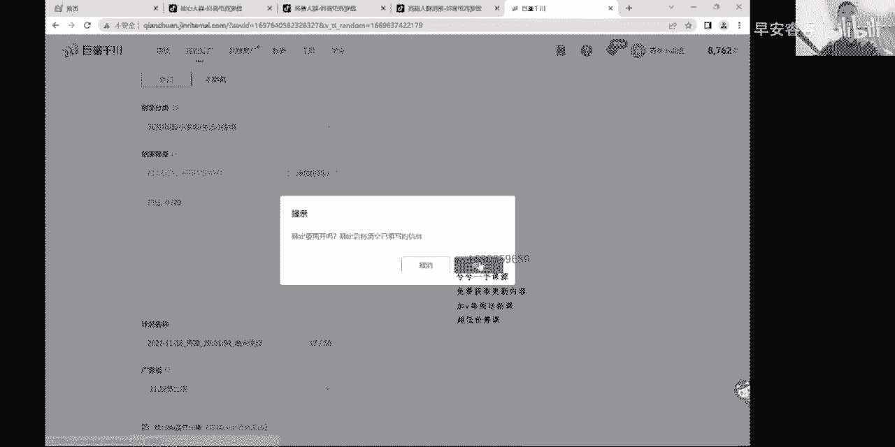
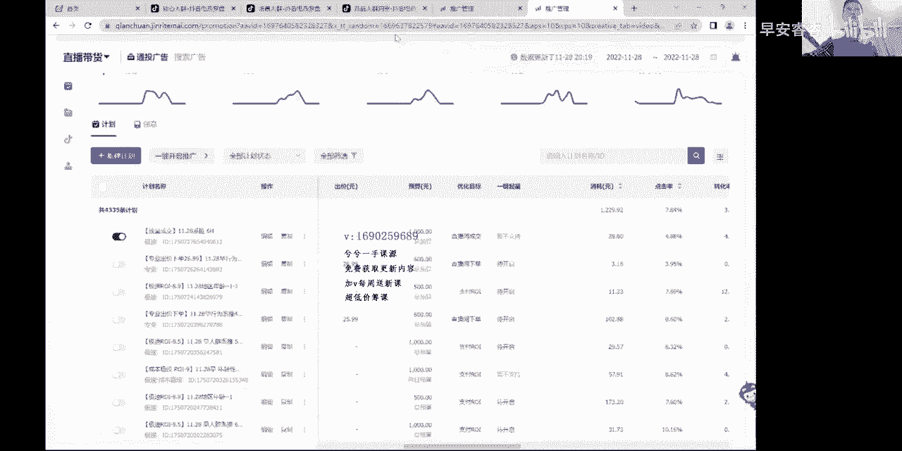

# 067 抖音电商直播投流起号课程 巨量千川全流程投放+小店随心推全流程+起号方式 - P13：2、基础页面解读2.mp4- - 早安睿睿 - BV1Nn4y197Wg

那么是这样的，大家听好了，刚刚结束上面的，花了半个小时的时间，给大家把一些基础的内容讲明白，既然大家付费了嘛，所以说我觉得不管多少钱，我一定要把这个内容给你们全部讲透，讲明白，清川板块的投放。

你听完我这几节线上课几乎已经就讲透了，就这么一些东西，如果你自己把它想的很复杂的情况下，那我也没有办法去阻止你的想法，所以呢我讲的所有东西纯纯是纯几成的，纯干货，纯实操的，就这么些东西。

只是有些人添油加醋，然后把它放大了很多，整的很神秘，他是不神秘的哈，那么接下来刚刚我们把上面的就是控成本呐，放量啊，包括这一句话，目标全部给大家讲完了以后，那么接下来我们再接着往下面去走哈。

时段上面是这样的，就是更多的我建议大家选择长期投放账号上来，过新号选择长期房投放，或者相对来说稳定的计划作为长期投放，那么你需要去拉一些拉战线的计划，扩战线的对吧，那这个时候肯定不能用长期投放去扩了。

长期投放扩战线，它很难形成短时间内的一个战线的一个暴增，那么这个时候我们更多的会选择里，就是用固定时长来去做，比如说我现在在线已经是50个人了，我现在想把它拉到70，在5分钟之内。

那这个时候我肯定是要去两三条，0。5小时的对吧，直接把时间一选，选个0。5小时或者一小时的，这样的话快速的去把战线拉起来，那么一般的拉战线的计划，更多的会偏向于极速的智能推荐，极速成交，用放量的形式。

它的速度会更快一些，就这样的，所以为了更好的计划度过大量的学习期，是这样一个新计划，或者一个新账号上来投放的时候，这建模阶段我们每一条计划呢，如果你用固定时长去过的情况下，它本身在抖音号跟千万户。

都没有数据累积的情况下，那么他人群跑的都会有点泛，点击率都会有点低，转化也会相对来说低一些，在大量的探索过程当中嘛，大量撒网，少量的成交对吗，那么这个时候大家听好了，如果你选择固定时长的话。

那么前期就一定会造成你在探索上面，很难去度过学习期，你的每一条计划就N加三四天时间度过学习期，20单对吧，超过20单以后度过学习期，他很难去度过学习期，那么当大量计划都无法度过学习期的时候。

那么它就会造成一个问题，我们的转化成本会不断升高，禁止出价，就像下面现在借指出价，我们是36对吧，那么有可能他最终变成了80对吧，有可能88，有可能98，那么这个时候就很难去再往下面压了，是好压的。

但是他就比较吃力了，所以我们要记得给每一个计划，足够的一个学习的一个探索，计划的一个内容的一个过程，所以呢一般情况给到长期投放就可以了，那么后面的开始设置时间这些东西，这个就你们自个去设定吧。

这个没有什么太多的标准化，说实话不要掉到玄学里面去，唯一的就是长期投放，给到足够的时间来计划探索学习时探索数据，然后呢如果是为了拉战线扩展性的情况下，或者说短时间我账户保的很成熟了。

那么我大概计划可能也在短时间之内，他也是能够去度过学习期的，所以你们要记住一个点，有些计划度过学习期时间需要5~7天，甚至有的更长，那但是他就是相对来说，这种时间是没有度不过学习机的，就他能够质量。

他虽然没过学习，他能质量，但有些计划的话，它很快半个小时一个小时，比如说像一些头部账号投产很好的，也就包括我自己现在给你们演示这个账号，他投产很好，一个小时到两个小时时间，必然能够抽20单过学习期。

所以大家记住了，所以如果是为了快速去拉闸线的情况下，那么或者账号比较成熟，你就用固定时长就可以去做更多的时候，还有一个为了跑更多的消耗的时候，用固定时长去做其他的，直接用长期投放去跑就OK了。

直接用长期投放，然后的话给充足的度过学习期的一个时间，下面一个时段，这个就不选择了啊，如果你们自己如果有这方面需求的对吧，从周几选到周几，你就自个去选去吧，在中间该怎么挑对吧，你自个怎么挑。

这个没有一定的答案哈，很简单，所以说你看我这么一说，你就会把这个东西造成他整个页面的理解一样，它极为简单，就你写你有时候一些基础的东西，你想象的它就是真的懂吧，只是没人告诉你是对的。

你比如说我现在就说把你点上了，我现在那上面呢传奇头啊对吧，我选个来这个里边来动一下，来全部找一遍，对不对，来设置时间来，长期的话，我指定时间，我周一的2。3点对吧，来OK呀，2。3点选一下。

我把周五的对吧，11点到十点到11点再选一下，OK呀，这个是没有关系的，知道吗，就你们这个根据你们这个情况去做，但一般用不上这个东西，说实话基本用不上，懂吗，你把它实战，比如说每天隔一天一播的。

隔两天一播的，那你其实把它选个长期投放式一点，第二个可以选择设置时间嘛，第三个可以在选择长期投放的过程当中，把时间啊指定一下嘛对吧，这个很灵活，自由，一定没有嗯，过多的玄学在里边。

不要去想很多复杂的东西，就根据自个的一个呃需求去搭就行了，这个OK大家没问题哈，那么接下来咳咳日预算上面，日预算上面有些新手小白的话，他会往着什么直播间通头拉满999888的，我告诉你啊。

跑短视频能跑好短视频的情况，它核心点在素材，素材点击率，转化率不起来，它也跑不出去，没关系的哦，直播间还真不能通透浪漫，999直播间成熟了以后，可以通知拉满999，打时间长，会把人群画像给打偏。

待会我会教大家怎么去看人群画像，那么正常情况直播间它是动态的，是由主播的一些话术啊，产品的转化，点击率，这些动态决定于整个计划，ECPMM的一个排名的高低的，等会如果时间够，我也会录一节。

把一直讲目这个逻辑给大家讲一下，由于以防有新手他听不明白，因为我的课程录的相对来说，还是偏向于一些往上走一点的，虽然说这是讲基础的东西，但是也不想去讲那么太基础，所以但是呢新手小白老手都能听得懂。

所以我待会讲一下日预算上面，为了更多的去测试，计划的话，300块钱左右，OK1条计划可以的，稳定的账号，成熟的账号投产比较稳定的，不错的，会投的，那么你的预算一千两千，随便你自己了对吧。

然后你你自己能控制住它，所以说预算跟出价还有我们的时长，那预算出价还有长期投放，这个没关系，特别是固定时长0。5小时，哪里出价1000块钱呐，预算1000块钱，出价88块钱，比如说你正常出价39。

他能不飞吗，建议出价本来39只出88，就容易费力，又0。5小时出1000，它不使劲飞啊对吧，所以这三者之间一定是能够形成关联的，你记住我一个点哈，就是嗯我向系统做出的指令，是我出多少钱的一个排名值。

然后我预计多长时间把多少钱花了，那么这一个就是就是我出88块钱，我想半小时把1000块钱花了，跟八个小时吧，1000块钱花了，他俩之间是有点区别的，但是这个区别不是最重要，重要的。

在出价这个板块如果是放量的话，当然就跟这个有关系了，就重要些了，但正常出价的就是跟这个有关系，你给他出100块钱，我跟你说，就就这39块钱，你给出120块钱，比如说别八小时了，就选择15个小时。

他也会快速的半小时之内把这个钱给炸完的，懂吗，所以说你要明白这三个点的关系就行了，OK那么在整个专业版的页面解读板块里边，大家是这样的，专业版的页面解读里边呃，地域性别年龄是我一直不讲的一个东西。

我觉得没有什么好讲的，都是玄学，你去把你的整个的后台花像点开嘛，这个走店里面没有这个地域性别啊，没有没有意义啊，听好了，核心人群，那这里边是没有什么太大意义化的，成交用户呐。

你看一下这里边数据是在打人群包的时候，是那个的，那么我们在这抖店后台呢，它是没有这种机遇性别的，但是大家听好了，在我们整个相对来说的话，在巨量算数，有个网站叫巨量算数，如果谁要是买了我这个视频的。

然后你不知道什么叫巨量算数的，你站住私我一下，问我一下，我告诉你就行了，懂吗，所以说这个后面的一般的我们抖店后台的人群，作为我们去投放观察的一个点，但是它不是重要的，所以一般我在地域性别里边。

我不怎么过多给大家讲，那些东西没什么太大用处，能明白吗，这里就很简单，你看这里面画面，等会这些都会给大家去讲的哈，OK好吧，那么接下来我们继续还是回到计划过程当中，那么，就是基于性别这个地方啊。

主要还是把不发货的地方给排一下，就别排光了，这里面会有一个问题，大家记住了，我们到数据这个里边来一下，大家一直会遇到一个问题啊，人群洞察，我们到人群洞察里边来，你看洞察里边他有这个。

就比如说我们选择的是21号到27号的，这么多天，整个广告账户的额成交人群嘛，就别展示人群了，这个一样，你想看哪个板块，你就看哪个板块，那么这是21号到27号的，整个七天的一个数据。

那么这里边他已经有明显的有，他前面哪里销售额比较好的城市嘛对吧，这个很明显能排出来对吧，但听好了，投放的时候不是完全以这个为参数去做的啊，你如果完全以这个为参数去做的情况下，那么就会造成一个问题。

你的广告计划覆盖人群会很小，会很难跑，动量会这样的，但是你往往会发现一个问题啊，就是这里边用洞察这里面大家记住了，我这些动作啊，就是按照省份城市这些排下来啊，你看啊这个是按照消耗优先排下来的哈。

就该消耗好的地方它依然消耗好啊，消耗不好的地方它依然消耗不好，不用去管它，就该拉的，你全拉出去，我就想告诉大家，洞察里边的这些人群啊，这些机遇它是可做参考条件，不一定完全以这个东西去作为投放，实操。

那里这么一排的话，把很多都排掉了，但新疆这些地方去排掉了对吧，这个排掉它跑不动量，你看我选在里边的计划，你看我很多计划，我的账户这个账户投产很好的，都一比二三十的，但是你会发现我选我也全选了呀。

就港澳台这些地方不发货呀，你看北京三中跑的好的地方永远跑得好，后面这些地方都选了，他也没有跑动啊，一定要明白这个逻辑哈，当你排除完以后，一定会造成后面不怎么好跑的计划会跑不动，也可以这么去跑。

你说我就单独去推上海推北京推广州推深圳，推杭州，推这五个城市行不行，那行何止只是它的覆盖量会小，出价会同样一模一样的一条行为兴趣，它的覆盖量会小很多，你需要高出价或者高放量轴才能走动。

但是正常大部分计划我们是不考虑它的，就跟我们测试短视频的逻辑是一样，我一条是一个计划里面加十条视频，那么真正去消耗的永远是那一两条跑得好的，其他的加在里边，他不会那个的不影响你。

但是他能把你覆盖量给覆盖出来，OK能懂就懂了哈，所以这个比较简单一点，大家记住了这些洞察，这些东西我都最后单独录一节给你们去，把基础的不是基础的啊，这里面涉及到稍微深一点的东西，你们这个去慢慢看。

那么接下来咳，接下来还回到我们页面当中，所以大家记住啊，在基于性别这个板块，我们就不做过多的一个去解释，你就按照我这个讲法去做就OK就完全没问题，根据自己的产品的一个定位，然后你正常去划分就OK了。

把这些什么，那么这种资源不发或者给去掉，我之前做过一次测试，给大家也做个分享哦，之前的情况下，我单独去测试过这四个地方，就是找物流模板里边，在我们抖店物流模板里边。

我把这四个地方那个就是发货把它限制掉了，但是我投放了这四个地方，然后我投了该地区的所有用户，国产还可以还不错，因为它本身在这种地方注册的用户很多，他在内陆，所以说从整体发货上来讲的情况下。

也没有出现跑偏的这种情况，也没有发国外去，还是在境内，所以你们你们也可以测试一下，但正常就别管他了，反正地方去理一下就行，这就是性别年龄是我不讲的一个东西啊，不明白的人你就问问我懂吗，你就私我一下。

这里边你要不会选，那基本也没法弄了，每一条计划呢有四个定向，大家记住了，这算一级定向，或者把它称之为叫基础，在专业名词里面叫一级，或者基础就低于性别年龄啊，专业版的计划它可以有很多搭配方式。

用基础搭配很多形式，那么行为兴趣这个板块，我单独去拉达人板块跟行为兴趣放到一块，单独去打一条计划出来，单独去打一条出来，打一个视频出来，这样大家听得会更加清晰一些，因为这个板块一弄弄个把小时。

这个板块从新手小白，因为只有在几种情况下，因为这是一个付费课，所以不给大家讲玄学，稳定的账号，成熟型的账号，后期的账号老号其实不跑行为，兴趣达人都可以，达人要跑行为，兴趣其实不跑都可以的懂吗。

你看我这个账户里面就没有，我这个账户就没跑这玩意的，那我回回过来给大家看一下，他是我单，等会反正单独给大家去讲一个就OK了，你看哈，优化目标，我从一号从1月1号到28号，你看啊，都差不多一个月时间了啊。

消耗优先一下，你看到没有啊，看左边这边看我的投放记录，最高的3900块钱，看到没有，它上面点击分这个这三个点击直升进入，是因为我账号基数大了，我去做测试，可以这样去保证你们别这么去干了，听好了。

可千万别这么去干这种，我一般账号会给搞死的，懂吗，你看啊，全部问投问投集数，看到没有啊，全部基础稳投稳头，看到没有，哪有行为呀，呐哪有啊，看到没有啊，嘞稳投稳投几输几数，哪有行为用不上懂吗。

消耗都高的对吧，你看投产都老狠了，这账号你看啊，RA成交下单永远是集合跑的对吧，消耗也OK，点击率也OK，投产更OK对吧，就这就这这个投放逻辑，我待会给你们一讲，你回过头来再想想我这个地方的内容。

看看我的计划内容，就恍然大悟了，所以我这大两个小时的视频卖你个几百块钱，实际是你线下课，他们花8000花1万，只是多待了两天时间，真正的干货他不一定有我这个多懂吗，所以说不管新手老手。

新手可能会需要慢慢吸收多听，那么老手来讲的话，其实听一遍瞬间就特别是懵懵懂懂的，半上不下的投入很多钱，逻辑不清晰的听完这一节课瞬间明白懂吗，就这么回事，找到答案了，就这么情况，那么接下来正常跑哈啊。

行为兴趣达人那个板块，我待会给大家单独去拉一个拉一个视频，讲这个板块讲的会长一些啊，更多的把下面往下面讲吧，嗯网络网络不限，这个不限哈，或者是这样，或者你也可以限个WIFI跟4G，有人会纠结一个问题。

我遇到最奇葩的一个问题，就是他问我5G在哪里呢，我估计我想了想，应该是包含在4G范围内吧，差不多是这样的，别的也不好了，因为从数据洞察这个板块，大家来看，从数据洞察哈，从这个板块来讲的话。

它是有的有网络分布的，那它是有网络分布的，对不对啊，那WIFI的对吧，2G它有啊，占比了0。8呀，三季的也占比了0。02呀，没啥用啊，其他占比的单电机啊，总共加起来五呀对吧，所以说为了流量更加精细化。

如果你要是不想那个的话，那么你可以把它选择WIFI跟4G这样的情况下，要不然你选不线就OK了，这个都没有玄学，这种地方没有玄学讲，所以你在我的直播间或者在我的线上课程，你能够去见到里面是纯干货。

没有玄学，就这么简单，投放就是那么回事，就是计划的会搭会投会调整，知道什么个逻辑，怎么看计划好坏，然后前端转化跟着时段去看，前端的转化去决定我到底是否继续用这个计划，或者我是要调计划还是要调整货场。

是这样，OK所以这个我平台也不用去管它了对吧，这个不限新科索勾这个就就不限了吧，这个直接拉不限更多人群里面，大家听好了啊，这个可以跟行为兴趣一起去建一个啊，比如说点一些敏感类的定向对吧。

比如说那个高订单取消了，排除排除这个你们自己去拉，但是我给你们讲一讲，这里面啊那这样的啊，今天我正好在家去给你们录方便点，就这样，就是在我们一般的情况下，敏感促销人群他相对来说很多人会去做定向。

很多人也不去做对吧，大家听好了，包括同类目偏好，还有高电量排除，这些就是我就不去说它每一个后面讲那么多了，你听好了，高活跃的高关注的这些一定听好了，高订单退货的这个一定不要去把它排掉。

你把很多活跃的精准的人群去排掉，干嘛呢，你用不着嘞，你那个计划要跑得好，排不排它都能好，跑不好，你排它也没有用，就开个玩笑话来说，做海鲜那10%的退货率，你说你把高订单取消人群给他给排了。

他本来就高下单，你退货率本来就小，你怕它干嘛嘛，你做了一个卖服装的，你退货率80%对吧，你80%退货率，你本来退货率就高，这类人群的下单率本来又高又退的高，这在你的范围之内，怕他干嘛嘛，不用去考虑。

包括高活跃的，高关注的，这边都是可以的，那么人群包也会单独的，我去录一个视频，从头到尾给大家讲人群包这个板块，所以呢大家记住了，在搭建一条专业版的计划的时候，我更多的建议大家先不用去把这个掺合进去。

因为比如说我们现在来建一条洗嗯，控成本的成交，我们跑的是行为点，长期不限代码预算，OK对吧，出价比如说30对吧，来自于性别，我们选一下，这里边我就随便一勾哈，你们这个就勾起来咳，我制定一个行为兴趣。

把这里边咔咔咔一顿选，选好了，这个怎么选，我待会就录一节，教大家怎么去做这个板块，这是一个精细化的板块，完了以后，这里边不限达人不限，因为为什么行为跟兴趣他属于一个交集的人群。

当你去把这两个去交集到一起啊，跟跟达人属于一个交集的板块，其实相当于左边100个哎有房的人，右边100个有车的人，他俩一交集，有可能说凡是有房又有车的，也就20~30，是这么个意思，往往相对来说。

这个逻辑呢它交集人群会更加精准，但是他交集了以后，他的人群覆盖量变得更少了，所以他往往这种计划大部分，90%以上投产不好，所以你们记住了，建计划，单独建立建行为就行为，见那个达人就达人。

不要把行为兴趣达人放到一块去见，也不要把行为兴趣打点，跟人群猫同时去见，你可以单独去扩开，比如说行为兴趣，一键把人群包里边，这里边更多人群去加一两个因素进去哎，去做个测试去跑一下，或者先行为兴趣先跑。

跑到最后我再加个人群猫进去哎，本来还不错，做做测试，我做个变向计划，做调整，就这么调整的懂吗，跑好了，继续调整，跑不跑我也能调整，加进去看看是这么回事啊，一般就建议大家最好是别那个了吧，别加了吧。

就这样就很简单，到时候一路往下漏，智能放量，兄弟们听好了，质量放量是很多人会顾虑的一个点哈，不知道怎么投，所以说咳过了学习期的计划，把智能放量打开，老号成熟的账号稳定投产的计划复制出来以后。

可以把质量放量打开，质量放量打开，我更多会偏向于大家往行为兴趣去就放就行了，就这就够了，当然你说我要往更多的自定义人群里面去，加一些什么乱七八糟各种人群，那我也解决不了，你对吧。

所以说就不用去管它有更多的什么是年龄啊，地域啊这些东西啊，你就自个去选吧，所以我更多的还是偏向大家去把行为兴趣智化，过了学习期以后，把智能放量打开，打开以后它会根据你这条计划跑探索的画像。

往更多的人群画像上面去探懂吗，如果你把年龄打开的话，选这个年龄打开，它就围绕这个账户这个数据，这个计划里面跑的数据往这个年龄往外面去判，比如说我是25~30岁人群成交率高，那么他这个时候。

那比如说25~30岁买蓝鞋的成交率高，那他这个时候有可能就把25岁，30岁卖钓鱼的，卖开车的，卖金融的，卖商业的，这些人群里面，你选的哪一个选低域，他就以低语为标准往外面去扩选行为。

具体行为兴趣标准完美去扩，所以更多的建议大家过了学习期打开智能放量，给到更多跑量，还有一种情况就是有些账户干到最后干不行了，就计划有个衰退期嘛，一般五天到七天的一个范围衰退。

那么这个时候呢进入衰退的过程当中，我们可以把智能放量打开，给到更多跑量嘛，OK所以说这就是智能放量的作用，就两种情况，一种是过学习期，一种是那个过了学习期，为了更大体量把智能放量打开。

然后另外一种就是计划衰退了，已经明显点击率消耗转化跟不上下降了，这个时候把智能放量点开给跑一下就OK了，懂了吧，就这么个情况，更多的以行为性去跑就行，下面兄弟们哈，所谓的AB测试。

这是最典型的AB测试哈，啊直播间画面卖大类目的主播能力好的，品爆的大类目，那就直播间画面嘛对吧，就投直投就行了，那头吃投以后，有人说我还想尝试尝试视频呐，这就是ABC测试的一个点吗。

我现在同样是我录的这个视频，比如在直播，我投的就是直播间画面直接咣咣砸出去了，投出去的，那我这个时候我还想通过视频打一下呀，上面内容全部不要变，它直接复制一个，把下面选择那个视频就行了，选视频添加。

那么选视频的时候有两三种形式，大家记住了啊，抖音账号上面的主页发布的视频，包括整个上传到本地的这个，你就没时资格去抖音上搜索这个，其有些商家在投短视频的时候，你在他主页是看不到的，他好的视频被隐藏了。

你找不到，那是因为他从清川后台传上来偷的，所以说这也是基础东西，如果你要真不懂的话，如果买了我这个前堂课，你就找我一下，我告诉你怎么弄就行了，很简单对吧，你选一个凹进去就行了，或者本地抖音号主页的对吧。

直接选出来主页的，一般选完以后听好了，选完主页了以后，标题没办法去做变动，只有这个标题，但是你选完那个把主页去一下哈，但是你选完，选完本子上传列，听好了，他是可以去做，我们他是在标题的时候。

可以做很多程序化创建的标题的，知道吗，这个标题可以做很多标题，然后到库库往往下面加加加，懂了吧，就这么回事，就说大家听好了，这就是差不多啊，直播间画面跟那个直投这两个这里边选题，点这啊。

如果传传那个传本地的点这里啊，听好了啊，然后给打错了，做演示的时候，反正有时候会马虎了点，程序化创意完了以后，标题可以加无数个标题对吧，高呱呱，加很多标题，看哪一个标题配合这个视频，说白了一点。

一个老公娶十个老婆，看到底谁生儿子，就这么意思，撤一下能明白吗，通俗易懂哈，测一下就OK了。

OK明白就这么回事，所以呢直播间画面，那你就直投视频呐。

就AB测试，你记住了，我一模一样，计划可以投一个直投，投一个视频，那么有人会问，视频到底是传一个好还是传十个好，听好了，多传点给他大量的跑一条计划，传十个视频，最终一定会跑完以后，从那个数据洞察里边啊。

不是数据洞察哈，从计划的观察里面点一下计划名称。

跳出来个页面，点创意，我来给大家演示一下啊。

你看我对你们多好，很多新手小白都能听懂，这个目前应该是整个线上，千川卖清川科里边最简单的，并且含金量最高的一个清创科了，看好比如说我们再看这条计划，OK你看一项头像名，把他的计划名称一点就出来这个了。

如果你是投的短视频的话，创意一点开下面一堆短视频，知道吗，这里边会有个短视频，在这个地方一点开一堆短视频，你看他点击率，转化率消耗决定是否关它，所以说你记住了好的视频，它永远能起量，不好的是起不了量。

所以在最终页面结束的时候，最终在整个结束的过程当中，那么就是一模一样的计划，做AB测试，一个做视频，一个做画面，我相信我这么去说，你应该是能听懂的，高光时刻要不要开启，这是一个很关键的一个话题，听好了。

我听个我听个信息一哈，别信息OK，几百个号，然后放，回一个星期，那么这个时候大家听好了，是这样的啊，这个能能听明白吗，纯干货，没有任何的玄学在里面，就这么回事哦，你们往往是因为别人把你给弄的妈。

今天讲点玄学，在这个画面里边，我们要讲到在什么情况下投画面，画面的好处是什么，坏处是什么，咣咣一顿轮把你给轮懵逼了，懂吗，画面就是就是人货场比较足的时候，大众平台的时候投画面嘛。

如果小众平台打个比方来讲，卖床的卖卖窗户的，卖了个智能家居，像一些电子锁门锁对吧，还有卖什么切割机的工服的这种东西，小众品类的他一定相对来说的话，用户不多，靠短视频为主，短视频曝光体量大嘛。

才能筛选出少量的成交嘛，就这么情况，所以说画面跟直头就这么区别，大众类目可以投小投视频，小众啊，就是可以画面结合视频去跑，小众类目肯定一定是主投视频，斧头画面可以结合去跑，最终要看测试。

比如说跑个三天五天的，看看这些计划到底哎他行不行，我录课的时候能不能抽支烟呐，能不能审核过呀，估计审不过啊，就这个就大家能弄明白吧，高光时刻大家听好了，高光时刻一开启以后，这里边预算就变高了。

就变300了啊，变变600了，说错了就变600了，一条计划本来300的就干成600了，高光时刻我什么意思告诉你啊，特别是大众品类，还有黑五类，他相对来说他投视频，黑五类的投视频的时候，他过不了审。

那么时候高光时块头打开以后，它就相当于听好了高光块头的逻辑，它就相当于把整个的就是我直播间直播的，就像我现在给你们录课的一样，全程的高光点，你的互动点高的地方，喜欢重复看的地方截下来了。

然后用付费的形式去投这个视频的，在你原有的消耗里面拿出一部分预算，我也不知道他具体黑盒拿多少，那20%，30%，50%，我也不知道拿多少，反正他是拿出一部分预算，等于投了一个视频，就这么个意思，懂了吧。

所以说一般的我会建议大家把高光块头给打开，可以去打开去看的，没关系的啊，这个是可以的啊，创意分类里边是这样的，创业分类里边呢就是对了，上面高光头大家听一下啊，我说了600块钱啊，打开一个你要注意一下啊。

别考虑到跑飞了啊，或者在稳定的计划的时候去打开去抛也行，前期在犯的时候先别那么那个吧，嗯在创意分类里边相当于跑流量值吗，我是一个卖3C家电的，卖电吹风的对吧，小家电对吧，小家电洗衣机啊之类的对吧。

小电风小电春风啊，生活小家电这些东西的对吧，电卷棒之类的，那么我可能放到我的本沙道流量池里边抖音，把整个流量池做了很多的创始分类对吧，有这么多分类，有很多里面有很多二类，三类有拿出来有无限个。

那么我可以去我卖个电吹风，我可以换到小家电里面去做测试，那我也可以把它尝试一下，放到鞋服里面，服饰里边，比如说女装里边对吧，我就上面计划不变，我搭的很好的计划，我就把它放到服饰里面去跑一遍。

看看换不同的流量池嘛，但大家记住了啊，一般的，但这个计划没完全跑透的时候，可别这么去跑啊，计划的跑透的时候可以这样的形式去跑，没有关系的，跑透了以后，我这条计划就这么搭的嘛，我投产也OK嘛。

我非要老他妈卖女装的，我老选女装，这个流量值我要换一个，我要把它换到3C小家电里面去对吧，我要把它换到生活小家电里面去对吧，我要试试生活小家电推我女装购买量怎么样，我前面的计划原有的不动啊，还在跑着呢。

这就叫计划的调整，懂吗，只是没人跟你讲而已，我在直播间给大家讲过一句话，你们现在再听一下，就是嗯真正的高手在投行为兴趣的时候，其实就新号刚开始的时候，头头后面是不投的，但是真正的高手在投行为兴趣的时候。

其实如果说能把行为兴趣时给抓精准的，找到那条实惠还不错，投产还不错的，这辈子都不用再去找行为兴趣值了，就打这个值，一辈子用这些值就够了，可能就几十个，十八八十个值，它为什么会这么理解呢。

你看哦一模一样的行为兴趣对吗，一模一样的行为兴趣，比如说我们拉两下吧，来打游戏对吧，拿游戏对吧，就比如说这里边已经是很多行为性取值了对吧，我有变量的地方有很多，基于性别稍微做个变量不一样了。

这条计划跟原有计划剥离出来的不一样了，不会创建积压了，我的出价稍微不一样，这条计划的排名值，周边探索人群完全不一样了，我的优化目标从下单换一个成交，他立马这条计划不一样了对吧。

那么下面我相对来说的情况下，比如说在这里边呢，我一个跑直播间的一个跑短视频，那立马做了变量不一样的，OK很简单嘛，对不对，那我哪怕说我更多人群里面去做变量去做调整，这个计划立马不一样了。

那么在整个相对来说我这里边那就是分类里边，我去做不同的分类去做个测试，立马不一样了，所以一个行为兴趣值，能把这个计划复制成无数条，这下知道为什么一场消耗几10万，100万的，200万的。

他能有一两百条计划在跑，知道怎么出来的吗，你以为他真正搭建，能在这页面上搭建出一两百个计划出来，答不出来的，这就叫计划的多重变量，那我在某个里边跑得不好啊，我换个流量只是换个优化目标，换个出价。

更多人群点开试试跑，直头不行，我们换个视频试试对吧，分类不行，我换一个OK了，你看看一条计划能变出几十种，几十种出来，那么不就一下就延伸出很多计划出来了嘛对吧，OK那么标签这个分类大家明白了。

就什么类目的啊，做生意的对吧，坐办公室的打工的对吧，无业游民就相当于这个创意分类就这么简单，我这个理解是贼通俗贼通俗的，真的啊，坐办公室的白领，蓝领金领，他是一个分类打工的对吧，普通民工他又是一个分类。

我跑普通民工，我从小家电换成的，比如说有建筑的话对吧，换个建筑类的对吧，他就跑这些嘛，那我要换白领人群呢，那你就往高客单的那边去放嘛，就这么个情况，这个分类就这么个意思，那么完了以后呢。

下面标签大家听好了，分类等于代表我把这个计划投向什么样，广告池里边的什么人，其实是首先是计划是掉进一个广告池，然后在这个广告词里边呢，根据我的行为兴趣去招人对吧，那么标签是这样的。

我的标签决定于我整个的属性，比如说我现在跑的生活小家电，买女装的，那我标签里边该打什么东西，还打什么标签，第一个玄学20个要不要打满，可以打满也可以打不满无所谓，它标签对整个计划的投产的影响。

我个人觉得不大，影响不是很大，因为我做过很多这个用标签去做变量，去测试这条计划的，几乎是测试不出太多，为什么总归你不会打偏了嘛，我是一个卖女装的，就各种什么女装，对吧啊，各种什么女装，我打一个来。

你看一下，别打了，我去找一个老早以前的计划给你看一下哎。

会试打一个一个打针回去试。

找找找往前找，找来，专业版的计划给大家看一下，各位兄弟们来，太OK了哈，这样讲太OK了，兄弟们哈来啊，这条计划，这家需要800块钱投产是一笔18种类，一笔40行为，编辑点开啊，正好从头到尾过一遍。

专业计划怎么打的，大哥们来控成本，尽快投放成交哦，长期投放不限1000，预算出价75，基于性别，这别看2800万覆盖量，然后对吧，电商互动行为365天对吧，这里边拉一遍呐，一路到头不限，看到没有。

直播间画面，你看到没有，这是一个卖女装的直播间，打了11个，围绕着精准的产品值去打就行了，各种女装，时尚女装，精品女装，韩版女装对吧，大码女装，宽松女装对吧，高档女装对吧，各种女装往里面打。

包括产品池对吧，女裤呀对吧，羊绒的羊绒大衣加双面羊绒大衣，衣家品牌名称呐对吧，都往那边打就行了，这个很复杂，你看这个就很简单嘛，没有玄学，这里边你记，但大家记住一个点啊，新账号刚开始在打人群的时候。

把分类给他选精准一些，做什么类目就拉什么类目，这里边也尽量打满一些，打精准一些，你卖啥就卖啥的，锅碗瓢盆啥的，你就往把锅碗瓢盆，各种什么锅，各种材质的，什么口型的锅，就各种往里面去打就行了，就产品值。

产品值，就比如说羊绒的大衣嗯，羽绒服对吧，外套然后品牌值就比如说鸭鸭呀，波司登啊，雅鹿呀对吧，然后的话就还有剩下的就是各种羽绒服，往那边打呗，什么9999的九九绒的羽绒服呀，什么鸭毛羽绒服呀对吧。

然后各种那个就什么白色羽绒服呀，红色羽绒服啊，高端羽绒服啊，往里面打就行了，就打打精准的，把分类跟标签打精准，说了这么多废话，其实就是想告诉大家把这个拉精准就行，刚开始，而且这个不要去做标调整变动啊。

标签就别调整了，你要是后面计划跑得好，去做做变量，你可以换换分类去跑跑流量池是可以的，那么还有一个现象，有一种类目有一种类目它没有标签分类啊，没有那个在流量池里就找不到，特别是那种鸡血藤啊。

什么乱七八糟织补品，黑五类，那这个时候我们就直接，我们就直接不用去管它了，听好我就直接给大家讲了啊，分类里面找不到，你可以去第一种方法找小二，让他帮你去拉这个类目的分类，跑到哪个分类，他能帮你拉出来。

就找出来的，它很偏，就像我天天给大家说的，我跑到那个茶杯对吧，放到茶叶里面它跑不好，他放到文玩里面跑的很好懂吗，这个就是小爱能够拉出来的一个数据，能找到它适合哪个分类，即便你在里面你找不到。

就像那个鲜花一样对吧，他跑林业这里边有龙鳞液嘛对吧，卖绿植的一般都是放到这个林液里边去泡的呐，但是它里面就有一个鲜花，我忘了在哪里了，这里面有很多那鲜花，那个人跑的就好，没办法对吧，就是这是这样的嗯。

有些产品没有分类的情况下，有些产品没有分类的，这里边创建分类，找不到的，记住把标签打精准打满，能打满就打满，打不满打十个往上把标签打精准，这个分类不用愁，是没有关系的，然后最后结束的时候。

这条计划大家来看一遍啊，听好了啊，我在搭这种计划的时候给大家讲一下啊，比如说我们投的控成本的成交，长期投放500，其实地域性别年龄，然后行为兴趣，比如说这样对吧，下面这条街就好了，一路到头懂吗。

如果你要投短视频，就投短视频，后期如果智能放量在后期的话，点开就点开，反正这个选项就这么，这条专业版的行为兴趣计划就是这么大的，我是为了照顾小白才会讲那些没用的东西，纯满纯基础中的基础的啊。

就投哪个板块，如果你投的是行为兴趣，就用地域性别年龄跟行为兴趣投出来，如果你投的是达人，就用积聚性免年龄加达人，如果说你投的人群包就用低于啊，不至于性别年龄加上更多人群点人群包，如果说你是投系统推荐。

那么你就投资域性别年龄，然后在行为兴趣这个板块选择系统智能推荐，下面所有的东西统统就不限了，这就是标准的计划，那么最后一个步骤在页面搭建环境中，大家听好了啊，最后一个步骤就是啊开播控板成交对吧。

couple空本成交，然后比如说投的这条计划是西推或者投达人，或者投行为兴趣对吧，那么最后在标题这个时候大家听好了啊，那标题这个地方的时候，大家来看看这个把它把它，比如说我们把它删除掉对吧，你要。

哎哎倒倒倒倒车，倒着倒着倒着倒车，那这个比如说开播名称，听好了，嗯给大家备注一下，这个换出题的，看好听好了啊，还不，有对吧，开播成交，然后以空本的形式对吧，要不空本成交对吧，然后你看哈后面的加一个莱卡。

莱卡就是行为兴趣嘛，对不对，莱卡达人对吧，都很OK啊，这样的情况下是不是一目了然呐，这个计划一目了然，清晰明了可见，对不对，很清晰呀，快播控成本的成交吗，莱卡嘛对吧，那么就知道出价。

因为前面我们能看到这条交易包成，那么这样当你去搭多了以后，那么你整个计划相对来说你不用去找别的，一眼瞄前面整个列表清晰一目了然，看一下来，啊你看啊看到没有啊，一目了然，清晰明了，投的是什么，对不对。

你看哈，放量成交对吧，11月28号实推日期里可以加上几个小时，也可以加上，这样自己很清晰的明白，首先我一看这个计划项目名称，它技术专业，还有成本稳投，我知道是投资哪一些，然后我这边往这边一拉对吧。

这边一拉这么一放对吧，然后往这边一放，这样就行了，我瞬间就能够判断出来这条计划专业版的对吧，行为了是吧，26块钱然出价的直播间下单很清晰明了，好去评估这个计划，OK所以说整个页面就给大家搭建页面。

是从头到尾给你录一遍，录完了差不多一个小时的时间，那么我本身预计的话两到三小时给你们讲完，讲不完，可能三个小时往上嗯，接下来再去给大家讲行为兴趣的组合搭建，专门用一个视频把行为兴趣的词汇该怎么去选。

给你讲完，讲完以后，那么达人也顺便讲进去，讲完之后还要讲人群包，还要单独一个视频，人群包完了以后再给大家讲投放逻辑，有诶我新号现在开始我要投哪些计划，逻辑是什么哦，老号成熟了，我应该投哪些计划。

该怎么样去调整它的逻辑是什么，整个投放的逻辑是什么，我会把讲这些东西，然后计划的搭配比例怎么去搭配的，也要去后面去讲计划该怎么样修正调整，怎么去判断这条计划好坏，这讲完就完了，就这么多没了。

所以说就这一条视频就到这，后面再一个一个的再给大家去往后面挪好吧，就这么回事，所以千万别把它想福哪里想复杂了，我就救不了你了，就这么回事，因为冬天这回说实话，这两月的话。

很多地方的口罩原因加上确实年底了，大家也不便出来学习了，赶不上了，你听完我的这几节课的视频清单投放，几乎90%已经弄懂了，几乎是有基础的人就懂了，没基础的人90%没问题。

再加10%的实操作后再来反复重听，OK好吧，这一节就到此结束。

