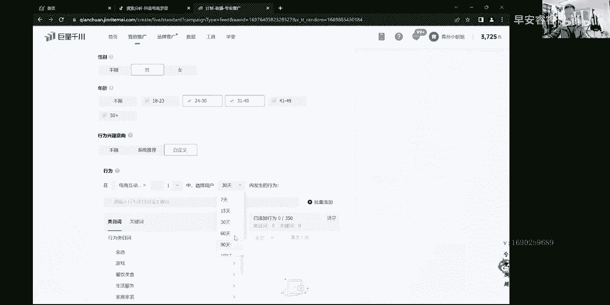
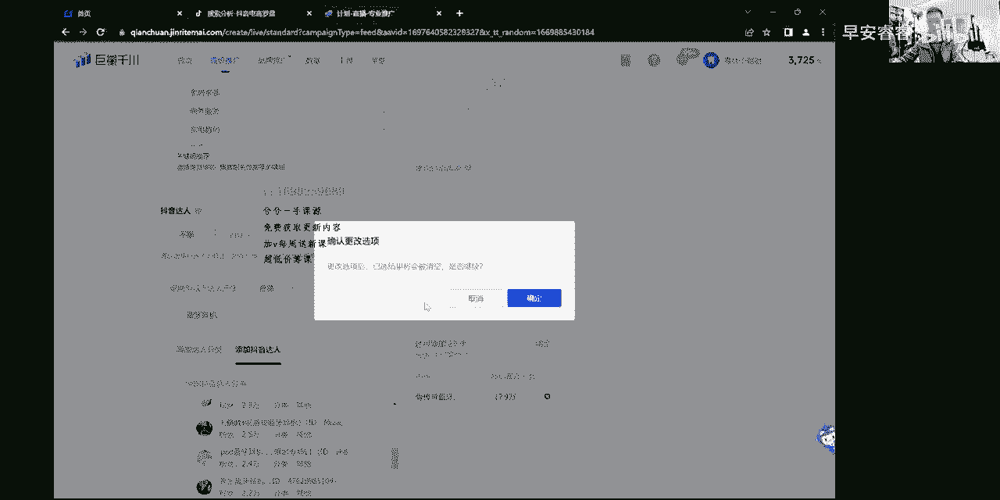
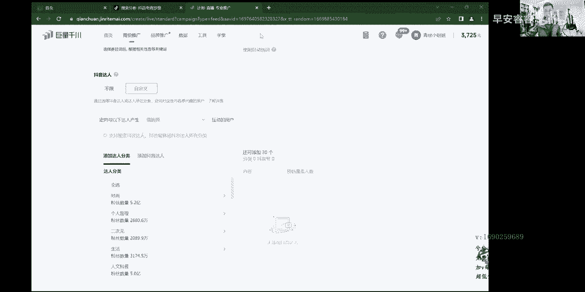

# 067 抖音电商直播投流起号课程 巨量千川全流程投放+小店随心推全流程+起号方式 - P14：3、精细化徕卡达人- - 早安睿睿 - BV1Nn4y197Wg

哈喽哈喽大家好，那么前面两个小章节，包括这个章节，还有下一个章节，都是一些基础化的一个东西，前面两个小章节给大家去，把一些就是整个页面的详解给大家，已经解释得很清晰很清晰的。

虽然说我在录制这样的线上课的时候，没有很注重画面这个东西，包括背景之类的，但内容型就OK了，这是我一直主张的一个观点，所以呢这一节课给大家录什么东西呢，这节课给大家把所有的各行各业的莱卡的逻辑。

把大家给讲明白，就是行为兴趣嘛对吧，我们行为兴趣该怎么样去搭建，这里边呢分为多种组合方式，先讲一些逻辑啊，其实在很多很多的一些商家上来投放，包括很多新手上来投放。

包括很多没有经过系统学习的人来投放的时候，都会掉到这个莱卡这个板块里面去，就是大家的所有的计划，在现在直播间趴着，每一个大师讲的所有的莱卡讲的玄乎其玄对吧，其实真正的大家记住了。

你们在听我晚上直播的时候，我在里面讲了一个新号的一个搭建逻辑，其实刚开始的时候是打精准人群进入直播间，形成成交，投短视频也是一样，先给短视频投出一个成交方向出来，就这么回事，那么在莱和板块里面。

往往大家在直播间听到很多人学你们搭建计划，往往永远是上来搭建这一条专业的行为，兴趣加达人的计划，从头到尾嘛，从控成本一直搭到下面的一个标签分类，那么这是一个错误的观点，大家记住了，所以我接触过，从我做。

从我就是出来讲课到现在，已经差不多一年的时间，我接触过的商家，可能从我手里面过的有好几百个是有的啊，每个月的话我差不多几十个人嘛，一年时间的话差不多几百个人，就是大部分的只要没听系统训练过的。

在莱卡板块里边都会掉进一个圈子里面，今天嘴他妈有点干，都会掉到一个圈子里边，就是我这个莱卡头不好，或者有人还尝试一些其他的计划，会发现比这个莱卡会好，所以说呢你们一直掉到这个框里面，就在想。

我怎么样能把词汇给他搭的更加精准一点，投产能更高一点，有这种想法，其实我告诉你啊，你最大的就掉进这个坑里面了，在所有的计划投放里面，莱卡只是初步在建模型的时候去使用一下。

他后期一定没有一些其他的计划投的好，所以说你投不好就对了，只是没有人告诉你，然后你又投不好，然后你就在那边想很多的方法，我怎么样能把这个莱卡给他搭精准的，当然达人是不一样哈，投达人的情况下。

在很多账号上面，不管什么类目的，只要是有复购的产品，对标达人还是能投的啊，但是莱卡这个板块基本都在新号偷偷来卡，老号，为了稳一稳直播间的人群标签画像投一投，他的投产一定不是特别高。

所以说讲到这里又帮你们破解掉一个观点哈，就这玩意的就打打星号的时候，头头投毒标签之类的去用，他投产没有其他计划，投产高的，你投不高也是正常的，只是没有人告诉你，所以你一直在研究怎么把它投高。

这个是不对的，懂吗，所以正常其他的计划，比如说像莱卡里面什么都不选，那你比如说我们就选一个系统智能推荐，这种投产，比你的人为的去打一些词汇投资要好很多了，但是呢在起新号的时候或者稳号的时候。

那么我们还是要去投莱卡的嘛对吧，所以我把莱卡这个词汇把它给大家，用这节课把你们讲明白讲透，就各种选词的方法，搭配的方法都给你讲完，那么你听完我以后呢，不管做什么类目的，你就按照我直播间讲的东西去答案。

就按照我这里边录的里面的内容，这样的形式去答案，只是词汇的词语不同而已，实操的时候一定是可以用的，再强调一句话，直播间讲的所有的东西都一定保证，大家实操的时候管用，只是相对而言的情况下，人货场更注重。

有可能我投一个莱卡之网，一流的人货场，它投产贼高，有可能是一模一样的计划，换个主播投产就拉很低，懂吗，这个是一个关键的一个变量，但是这个词汇人群打不打的准也是一个点。

所以接下来我们就进入到莱卡池那边去给他，教大家怎么去搭建，第一个方法，大家听好了啊，莱卡的行为兴趣板块就这两个一般的计划，千万记住了，投行为兴趣就投行为兴趣，下面达人就别再选项了，如果是投达人的话。

行为兴趣就选择不限，就直接投下面这一条达人就行，这个区别开来，不然这条计划跑的好与不好，你不知道它最终的结果到底出在什么地方，所以说大家一定要懂这个点，就是单一的戳戳开分别去投。

那么也可以把行为兴趣跟莱卡放到一起，但这种计划，往往也是大家需要着重点关注的一个点，一般的行为兴趣放在一起的计划，90%的商家从我接触过的这么多，包括我自己投的那几百个账号里边，加起来也是有上千个账号。

有了啊，没有那个就是没有几个真正的行为，兴趣加达人结合起来好的，按道理来说，他是一个交集人群，会更精准一点，但是越精准过后，越在跑量上面越有问题，越跑不好，所以说基本的投产都不是特别好，大部分是这样的。

同学们记一下哈，所以从我前言这几句话里面，你们得出来你的那个莱卡头不好是正常的，是对的，谁高手不投莱卡的账号稳定后不投莱卡的，只是你没有经过系统学习，妈的天天在那投莱卡，而且你还总觉得投不好。

怎么样把人群拉好，不对的哈，OK那么莱卡茨背后的逻辑其实就是说白了一点，行为人群兴趣人群，行为就是产生过点击下单互动啊，点击下单成交的人群，兴趣人群的情况下就是对这个类目感兴趣的。

比如说对短视频感兴趣的对吧，对什么，我是一个卖小小夹克的一个商家，拍了一个夹克的短视频，那么能够刷到这样短视频的人群，肯定相对来说他之前是有过这种动作的，他才能够刷到，要不然刷不到这样的标签。

那么我在投放的时候，更多的把直播间也是围绕着这样的兴趣，去投出去的嘛，就这么回事，那么行为兴趣的选择方法大家记住了啊，就几种方式，待会给大家去做演示，第一个先告诉大家行为兴趣，他是一个交集人群。

在页面上面，当然我们来看哈，在这个页面上面，当然它显示的是一个就是所谓一个并集，1+1=2的一个形式，但是在人群逻辑里面它是交集，大家记住一个点，因为我的电脑的屏幕如果是手写的话，他是无法录进去。

所以我就不写了啊，大家听好了，这种所有的广告电商，所有的付费打的广告只是为了展现，那么展现的第一步在抖音里边，比如说我刚说的，我穿夹克，那么展现的第一步一定是，因为他本身对这种男装形式。

在夹克或者男装男鞋感兴趣的，他常常会收到这样的一个视频对吧，所以说你所有的广告永远买的是曝光，曝光给兴趣人群，兴趣是第一步可能会很大，比如说一个亿，那么中间产生过动作的。

可能说200万300万就这样的一个范围，差不多200%分之三的一个转化率嘛，百分之一点几嘛对吧，那么永远是先从曝光里边，再最终筛选点击下单成交这么一个动作，所以行为是包含在兴趣的范围之内的。

那么兴趣是作为第一步，那么有了兴趣过后，才有了点击下单成交这个动作，所以他是一个交集人群，那个逻辑大家记一下，那么在投放这个行为，兴趣板块里边是这样的，有有讲小行为，大兴趣的，有讲大行为，小兴趣的。

还有我一般直播间给大家讲的是垂直兴趣啊，垂直莱卡行为兴趣一模一样对吧，其实根据不同的品去决定，有些品的情况下，大众品的话可以用小行为大兴趣，而对于很多的小众品，滋补品这些东西，黑五类的这些东西。

比如说智能门锁也好呀对吧，红木家具也好呀，或者相对来说淋浴头呀，还有一些这种很窄的，包括我接触的山东的，我听都没听过那种什么油的那种玫瑰花油，什么东西的这种东西，小众品类的覆盖人群本来就小。

那么它在整个行为兴趣板块里边组合里边，他就要用到跨类目行为里边，也要做跨类目，兴趣里边也要做跨类目，这样才会更加精准一些，所以说或者是在行为板块里边，我们去做跨类目，多类目去选择，那么在兴趣里边。

那么我去做精准的也是可以的，把它锁定成一种精准的一个流量就OK，所以他会根据不同的品类去决定，我采用小型为大兴趣还是大型为小兴曲，那么也在不同的阶段会采用这样的形式，比如说一个卖女装的喜好的过程当中。

他就可以用小型垂直来看，用我说的就同样的一模一样的行为词，跟兴趣是一模一样的，去打个精准人群，后面你可以去用大行为大兴趣，大行为小兴趣，小行为大兴趣都可以根据品类，那么起步的时候可以用精准一些的。

那垂直的上下一模一样，稍微的跑跑人群，跑正的投产，跑出来了以后，那么你这个时候可以用小行为搭进去扩人群呐，那么再扩一段时间，土产还O那我可以用大行为大兴趣，或者用大行为小兴趣把这个人群打开啊，都可以。

但是前期精准一些，对于大部分的品类来说，前期精准一些一些小众类的品类，前期还是稍微的啊，大部分品类是精准一些，一些小众类的品类的话，还是稍微去翻一些是可以的，就这么回事，那么在兰卡斯这边选择上面。

大家听好了，记住了啊，在所有的职位选择上面是这样的，就是我们在整个第一个C2等等一下哈，那么刚刚有事哈，那么是这样的啊，就听好了啊，第一种方法给大家的是在选择上面是这样的。

就是这个东西基本都是给新手听的，说实话啊，在所有的动作上面上面，在这边行为板块里边啊，在所有的动作上面，以前更多的我们只投电商互动行为，现在你们也可以就咨询互动行为也可以加上。

但是核心点还是在于这边的一个覆盖量，这个覆盖量是一个关键点，懂吗，他如果说去单独打一个电商互动行为的话，他的覆盖量能够也行，无所谓，如果不够的情况，你就把咨询互动这个加上，那么天数的话就你们自个去选。

反正天数跟覆盖量还是一样，结合在一起多少天都行对吧，这个你们就自个去选就行了，那么在莱卡搭建上面一般是这样的，就是刚开始的时候精准的时候，起星号的过程当中，我刚刚也说了前言哈，主要是起信号的时候。

我们才会用到莱卡，后面的话我们是不用莱卡的对吧，那么起信号的时候打的精准一点，大部分平台我们卡的精准一点，就给大家几种方式哈，就拿女装来做演示吧，最好理解，各行各业都好理解。

有些小类目做也是他理解不了这种大类目，酒水呀，女装呀，鞋呀这种啊，或者很多的像汽车啊这种类目的，大家都很好理解，就拿随便拿一个，拿个女装，或者拿个茶叶酒水，这些都可以，拿个茶叶吧，听好了啊。

刚开始几号的时候搭建主类目，这个名茶茗茶这一个就是主类目嘛对吧，卖茶叶的，这就是一个主类目，或者你在这里面去搜茶叶，茶叶啊，这种一搜搜出来这种茶叶这个覆盖量就很大，这一个哈，但正常我们正常情况下。

这个明茶在前面的类目池里边能找到，这是它的一个主类目，那完了以后下面其实选值上面扩一下，从后面扩一下，就这种选池就是用用主类目后面，然后的话直接去从里面用分拉进去扩，扩完以后，你看各种茶叶。

我们比如说这样随便给它搭进来啊，这种就是精准的嘛，这种就纯精准的，你比如说茶叶对吧，还有其他的不一定要茶叶，还有一个用茶叶去扩一下关联的产品值嘛对吧，比如说像一些紫砂壶呀对吧，茶壶呀。

啊这里面一打打出来有很多茶壶对吧，茶壶点开以后对吧，产品是拓一下，这里面没有对吧，茶壶茶杯这些都是关联的一些词汇嘛，对吧啊差别出来了对吧，这种都是关联的一些词汇，这个就算关联词了吧，加几个吧对吧。

喝茶这也是关联词，会泡茶对吧，茶几对吧，那么这种搭配形式，大家看，我先把这1200的这个覆盖量大的去掉，大家好理解哈，主类目嘛，明茶是主谓主类目，那么下面的情况下，那么把一些基本的这种各种产品值。

精准的产品值，关联的产品值都给它打上，这种就是高精准的纯垂直的，高精准的在兴趣板块里面一模一样的搭配形式，继续拉哈呢，明茶对吧，明茶作为主类目，然后去往外面去拓，你看啊，还是这种各种搭进去对吧。

各种各种查全搭进去，打完以后，那各种茶杯搭进去，搭完以后还是一样哈，茶杯对吧，茶杯哎搞错了茶，茶杯套装查找一下关键词拉饮茶紫砂杯，然后杯子这些都可以的呀对吧，紫砂壶对吧，然后泡茶对吧，这些关联值一样的。

给他打进去，茶杯茶壶啊，这种茶几啊，这种东西都给打进去，那么几乎这种搭配形式大家看啊，这种搭配形式在就用这一个多讲一些，大家能好理解哈，这种搭配形式的话在于起信号的时候，信号大家在我直播间我刚说了啊。

你们更多的会听一些，就是相对来说的话就精准一些的对吧，打的精准一些，这样的话人群更容易快速打上标签，这种形式的搭配就上下形式组合一模一样的，形式搭配是最精准的一种形式了，就高这叫纯纯精准的词汇。

就起星或者是这种打法是最精准最精准的，那么当然对于一些小众品类来说，你可别这么打，小众品类，我刚说了，你在行为词里边哈稍微扩宽一点，就像刚选了兴趣值一样，这个茶叶就可以茶几呀，紫砂呀。

包括各种周边的一些产品都往里面去打去，新的就是这样的一个情况，就比如说这里边是一个红木的对吧，红木家具，那么就可以椅子呀，门窗呀对吧，灯具呀，置画呀，这种东西就往里面搭扩宽一点，小类目也扩宽。

要不然词汇太少了，这第一种搭建方法就纯高精准的形式，这种是最适合产品值的，最适合你的产品池的，也最适合你测试人货场的，因为他人群是贼精准的，而且听好了，这种词汇上下一模一样的，特别是打一些爆品。

潜在品之类的都特别好打，他是纯精准的，打标签也快，后期也快，往往这种词汇一般打出来后，其实跑计划跟跑视频是一样，这种计划有时候拉出来以后，拉出来过后基本就这么多了，这么多，拉出来以后一直去跑它都可以的。

就纯精准上下一模一样，这种高精准的你就一直跑，它也包括真正我在直播间说过一句话，就是大家会说去做变量，怎么去做变量吗，就是词汇里边先不做变量，在整个这个不用跑，到最后，其实你跑一辈子都行。

这个职位你跑一辈子一直跑都行，你在创建分类跟标签里面去做变，比如说刚开始这个我们放到对吧，比如说这是一个服装板块对吧，放到男装里边，比如说来打各种男装打进去对吧，那么我跑跑可以以后。

其实可以那个呀我可以把它放到其他的呀，男装里面，服饰男装对吧，我可以把它放到女装里面去跑看看，那都可以的，可以换内幕，不停的换不同流量池去跑，这是第一种搭建方法，就上下一模一样的。

然后还有一个就是第一种，这种叫高精准的一种形式，我直播间会天天给大家讲这些东西的，就高精准的形式，茶叶主类目加精准产品之加关联产品值，兴趣板块一模一样，第二种变动的方法，大家记住了，高精转。

还有一种形式，高进厂，还有一种形式呢，就是把下面的呀把所有的产品值全去掉，就留一个这个名茶这一个作为主类目，或者在里面收一个茶叶，都一个查这个这个覆盖量有点小了，这个兴趣班反正不够。

就就得用原有的这个明查呐，把下面这些所有的全部去掉，就留一个明茶茶叶作为主类目就行了，OK这种形式你看哈，行为板块用主类目加精准产品提交关联产品值，兴趣板块用一个纯的一个主类目举行的。

这也是高精准的一种组合方式，你看选池的组合两种形式出来的对吧，那么第二种小行为大兴趣，这个板块就给大家适当的先，等会拉小行为大兴趣吧，还有一个就是高潜瞻的一种搭建方法，高潜的搭建方法其实很简单。

就是在兴趣板块里边，我们以这样的主类目加精准产品值，加管理产品值，这样的形式不动在行为里边听好了，行为里边我们就可以有两种形式，一种是把明茶去掉，不要主类目就加这些关联词产品词，然后兴趣里边用主类目。

加一些这些精准的一些词汇加关联词就可以了，这种叫高潜在的一种搭建方法，第三种哈高显的搭建方法，其实还有一种就是产品值全，不要就要一个就有一个明察，就要一个主类目，一个主类目，然后加上下面的所有的。

你看下面是主类目加精准产品值，加管理产品值，这也是高潜在的一种搭建方法，把大部分人群都压在了潜在的人群里面，兴趣人群里面了，这第四种的组合方式了对吧，每一种在实操过程都能用哈，这个是都可行的。

就更多的还是建议大家刚开始的时候，以及一些那个高精准的就上下一模一样，纯垂直莱卡，称之为这样的形式搭建会更合适一些，就这样，OK那么第五种和第六种的话，就小行为大兴曲，大家听好了。

小行为大兴曲那种是好理解的对吧，这里边我还拉点值对吧，把这种各种词汇拉点进来，大家好记，那比如说行为板块对吧，精准一些这么多，更多的要看乐高，别看词汇量有多少，这个量多少不重要，十个也行，50个也行。

100个也行，更多的看这边的覆盖量，这个覆盖量再起来就OK了，那么这种形式搭配出来以后，那么下面的话作为这种茶叶来说的情况下，那么可能更多的就是会偏向于一些酒水对吧，茶叶对吧，这种都可以的呀。

包括像一些就往汽车上面，金融上面，户外上面对吧，这种都OK啊，这种就小行为杂兴趣嘛对吧，很简单，主类目加精准产品值加关联产品值，下面的话这就是典型的小行为搭进去嘛，大部分搭建的话，一般也都会搭建这种。

用的最多的其实还是垂直莱卡行为，兴趣一模一样的，加上这一个小行为大兴趣，这是一种扩人群的方式，那么库人群的方式，第一种的组合形式，大家听好了，就这样，主类目加精准产品值加关联产品值。

然后这样的形式去扩对吧，下面是多兴趣，这样子也可以做调整，可以主类目不要啊对吧，主类目直接去掉产品值，精准产品值加关联产品值，是这样的，下面有这样的多类目，这也是一种搭建的形式。

这样的话就差不多六种出来了对吧，那这种就六个组合的形式，高精准的高潜量的扩人群呢，都给大家去答出来了，在行为词上面，那么这种是基本的听完这个以后就行了，大家听好了，还有还有讲半通头的，班通投是这样的。

就是在整个行为板块里面全选，在兴趣板块里面也全选半钟头是这么玩的，这样全选，然后从里面筛选，跟你八竿子打不着，你感觉一点关系都没有的类目，你把它去掉，这种去曲懂吗，跟你一点关系没有，就把它去掉。

然后这里边也是一样，这个大家好理解啊，就都选了大类目，全选了一点关系没有的，把它去除掉就行了，这种是纯属他妈扯犊子的啊，就是也不是纯属扯犊子的，这种是为了装A与B之间那个人去使用的，就搬空投。

那么真正的实操的时候没他妈发现几个，这样的话能好，但是一般账号稳定成熟的账号，新号可千万别这么去玩哈，大新闻大兴趣，这种都吹牛逼的东西懂吗，信号千万别这么去玩，这种形式答出来以后。

一般信号都投必死无疑哈，到了老号的时候，老号时候可以半空投的形式去看一下增长，看一下增产，其实还不如打个系统是能推荐呢，动手的计划永远没有系统，根据你的花样购买方向推来的人更精准，还不如推开西推呢。

就这么回事，所以这几种形式呢给大家讲完了，那么有人会讲什么小行为大兴局，大行为小心局，我刚才说了，其实他也没有错，就前期永远是围绕精准为准，后期的情况下呢就放开了就行了。

这样的话到了更后期就打个系统智能推荐，你这辈子投死了，选行为性知识，行为，兴趣值也不可能比这个系统智能推荐读的好的，这是必然的，懂了吧，所以说就这么一回事，那么大行为大轻取是一样道理。

成熟了以后可以投大行为，大兴就成熟的账号怎么投他都有产出，你比如说现在能投一比十高产，像我们这个账号对吧，只狗卖的这个那就挺好的，能够投个一笔是高产的，那这种其资里不管小型为大型，为大型为小型鱼。

它都有产出，只是高低的问题，但是我更多的还是重复，建议大家不要以过多的大行为，小兴趣这样的形式去投，更多的还是以小型为大兴趣或者垂直行为，垂直兴趣，这样的话更合适一些，然后在后端的情况下。

稍微的去就是投一些细推之类的，成本稳投之类的这个行为词，他是投肯定是投不过这些计划的，但是呢他能够去打直播间观看标签画像信号，几号的时候需要打精准人群，需要用它那么老号，其他人群跑的比较多的，比较泛的。

可以这样的形式去投一投就OK了哈，所以行为词就这些，那么在选词上面是这样，在行为层和选值上面刚刚有给大家去讲了，第一个就是用主类目加精准产品值，关联产品值，这种用就后面反正尾巴上面拖一个嘛对吧。

尾巴上面放它进去放一个，然后在里面各种去找嘛，这是我的这个找的不对，这是我账号跑女装跑直会多了，他不对的，删除再再再扩一下，那这样就对了嘛，这就扣出来，你就开始找这第一种方法，还有一种方法其实更简单。

因为这个是为心疼小白准备，就是还有这种方法打搜索计划，找池上面其实有很多方法啊，听好了，找石上面方法贼多了，喏进计划找直直接靠找懂吗，专业推广吧，搜索搜索搜索哈，专业推广。

OK那添加关键词到这里边要搜索计划，打一个来棉袄，你是卖棉袄，这就砸民谣对吧，一获取关键词，老他妈多了，真的老多了，从这里边那推荐度相关性从高到低就OK，那老多了懂吗，这里边老多了，词汇不是复杂的词汇。

很好找，这第一种方法解决了呐，这是一种方法，刚刚那是从尾巴尾巴后面放大镜拓是一种方法，这是一种方法，还有呢这种完了以后呢，兄弟们来退出来，这种完了以后，还有我平时直播间给你们做演示的也OK。

直播间做演示的话就是用专业计划，专业计划后面呐打莱卡什对吧，那就比如说还拿茶叶去拖吧，随便拿什么类目都行哈，那你看比如说这个明察对吧，把他打进去，然后这一拓能拖出来这么多茶叶，是不是对吧，很简单。

其实摆个五个左右，五个左右主类目一打，然后自动选值一拓，拖出来这么一堆呀，你看到吗，拖出来一堆，从这一堆里面开始筛选这种内容，其实在我直播间都讲过，这种内容的基础内容，从里面筛选，一定要记住了。

筛选覆盖量小的，别筛选覆盖量大的，每一次自动拓直拓个差不多3~5到十个，筛出来就行单，那这里边差不多基本呢用五个种子池，就种子是做什么精准的产品之理是个卖男鞋的，那么就各种休闲男鞋，卖蓝裤的。

就各种休闲男裤呀，商务男裤呀，皮裤呀，改个五个左右，自动拓值一拓拖出来就OK再演示一遍，来再随便找个其他的类目，比如说餐饮美食，美食吧对吧，来那就这种来太多了，这杂太多了，这里面去掉一些吧。

就把它当成了几个产品值吧，对吧啊，就OK了，这种一拓啊，这是拓片了，这种是我账户问题，大家听好了，这就是我账户问题，再重打一下啊，白心素食川菜，湘菜，你看哈妈我这个账户，我这个账户是跑女装。

跑多了他都脱女装出来，换一个就跑出来了，换一个换一个其他的吧，比如说汽车对吧，来按照汽车动力，对吧，汽车汽车车电动汽车品牌汽车，然后新新能源不要高档轿车对吧，然后4S店这种拓位。

呐你看啊这样就拖出来了吧，你看拖出来很多吧，拓出来以后，然后你围绕在拓出来这个词汇里边，一定要选择关联性强的，然后相对来说覆盖量小的，每一次打五六个种子词汇，然后拓出来以后选个5~10个。

那么连续拖两三年，有个三四十个产品值，或者再拖出来以后，站在每一个尾巴后面那个小放大镜放一下，这边又能出来一堆不就OK了吗，就找到了懂吗，把实施的极为简单的东西在行为经济学里面，千万别到了框子里面。

很简单的，那么打出来以后，还有一种在罗盘里边，我好久没用这种方法了，这也是借鉴找值的一种方法，罗盘里边在商什么搜索分析对，这是商城搜索分析，你看啊，这有每个账户的搜索词汇，这里面有每个账户的行业搜索值。

你看哈，你看啊，他都有你卖的什么东西，他都有，这里面这也是可以借鉴的一种形式，就每个类目嘛，他是这个每个类目的话都是可以找的，那他是都可以找的，在这里边这也是一种指挥的选择方法呀，对吧，很简单。

选值其实极为简单，他可以形式给你讲明白了，选池再给你讲明白就会了，实在不行，去尿算数也行，均价算数，你们这个去打一下，要不行的话，直播间问我就好了，妈百度上搜一下巨量算数，然后就进入他网页了。

然后就可以了对吧，里面把词汇输进去就OK了，所以说选值是极为简单极为简单的一种方式，把组合几种形式告诉你，你看啊，整个页面的选值你能搞定的，主要核心点记住还在于覆盖量，词汇多少并不重要。

重要的在于覆盖量上面，这个起来就行，小行为大兴趣，大行为小兴趣，我讲这么长时间，你们也听明白了，都没有错，都能行，但是大行为大兴趣或者大行为小兴趣，真不如打个系统智能推荐。

尤其在信号阶段不能去翻投精准一些，投垂直行为，垂直兴趣就行，为兴趣一模一样的，或者就小行为发兴趣精准一些，或者就相对来说大型尾就容易成偏一些，用不着这样的形式扩哈，但是是可行的哈，标签只要出来以后。

什么样的形式都可行，大家记住一个点，计划永远是在不断的调整的过程当中，会发挥出更好的一个价值出来，就是这样的，不一定是投出来就行，但是经过不断优化调整诶，OK了，就这么回事，懂吗。

那么这一节就有这么多把行为时给啊，还还有杂人没学完，把行为词给大家讲完，这个就OK了，OK完了以后，那么接下来在达成板块里边，达人板块里面很简单，你就记住几种方式就行了，第一种就永远不要考虑到关注呀。

视频啊，互动啊，这种人群，这种人群相对来说的就产生过关注，产生过视频点赞，这种人群有可能他是购买力不强，不精准的嘛对吧，那么我们更多的还会偏向于一些有过购买，点击的人群，他更容易购买。

这个大家应该能理解哈，就整个抖音的流量可能有八个亿，七个亿，那么真正购买的也只有两个亿呀，那么我肯定还是往这两个亿里边有过商品下单，点击推，这两个亿的人群会更精准一些，那其他那些大爷大妈小小孩之类的。

刷手机的那些人群是没有购买量的，他虽然喜欢这个东西，但他没有购买量的，所以我们更多的还是以几个基础版本嘛，也不用去解释为什么东西，这个就呐这四个看到没有啊，呐直播互动，最下面商品点击下单。

商品互动点击下单，这四个OK完了以后，这四个出来以后，听好了，这四个出来以后，这里边达人板块选60天吧，精准一些拉60天就可以了，多拉一些拉60天没关系的，这个没有太大的影响啊，说实话就统一拉60天。

因为你们最大的会解决这个覆盖量，这个问题，覆盖量会解决不了，拉完这四个以后的这种选法其实是这样的，拉完这四个以后，相对来说的话是这样，就是嗯主类目你卖什么的，就拿你的主类目，拿你的主类目。

然后往这里边去拉，你是个卖汽车的对吧，那么你就把汽车科普，汽车周边主类目往这里边一拉，下面把所有的对标达人给拉满对吧，你比如说随便猴哥，猴哥是猴哥说车是吧，好像是吧，是不是猴哥说车呀。

那猴哥说车你看啊这种就100万呢，那这种就100亿啊，这个好像啊，这个是他你看啊，他粉丝量3000多万，但是在他跟他有过购买成交的，只有110个人，看没看到啊，只有110个人，这就说明在60天范围之内。

有过跟他商品点击下单的一些人群，只有100亿，他直播间不卖东西嘛，那你说要把这些就先不说这个啊，把这上面所有的答案给拉满，记住了，后面覆盖量像这种百八十的给给踢了没用，覆盖量太小有什么用啊。

还有覆盖零的，覆盖几个几十个的，这就是因为这里边动作选取的问题，我在这个周期范围之内，没有产生过这种购卖东西的动作，所以粉丝的粉粉丝量后面他就没有懂吗，所以说如果是零的什么东西给剔除掉。

那么把下面答点拉满就行了，就主类目对吧，主分类加精准的达人，关联达人，然后卖东西差不多达人给拉上就行，选达人这么选呢，我觉得我就不讲了，太他妈基础了，这种东西真太基础了啊，这个东西你卖货的。

你要找不到你们家对标达人，你要真不懂，去我直播间美食问问哈，OK那这就OK，然后还有一种形式，还有一种对你看啊很多类目啊，就是有时候他们连甚至连这个就主类目，比如说卖车的汽车科普这个主类目对吧。

加进去很多类目，它连主类目找不到，那么就很简单把产品值打进去对吧，那汽车，把产品值打进去，随便点一下，弄错了弄错了弄错了，兄弟们哈呐，然后把汽车一打，然后把汽车一打打进去。

这里面会出现一堆其他看到没有啊，尾巴上这种都是其他这个不对的这个类目，这个类目跑的汽车的类目有点偏，正常类目不这样的正常类目随便打一个进去哈，比如说棉袄，有点偏了，这个lemon，好随便打一个出来么。

一堆打出来一堆诶，今天今天这是系统问题，不是不是的啊，今天这系统出问题了，应该是这个不是其他这些大类目，他不会那个你看棉袄，我这打一下羽绒服试一下，这种方法是百试百用的，然后全其他看到没有啊。

这这是那个问题啊，这个是这个是系统出问题的这种方式，它正常是这样的，大家听好了，就是我随便打一个产品池，在达人这个板块里边随便打个产品池，然后呢后面他会出一堆达人，我再打个，然后大家去看一下。

看是不是真的出问题了，然后打1if for，那全起它这个方法不行了，他出问题了，这个应该是系统问题，这两天你看啊，正常是这样的，就你把这个产品值打进去，他这后面的其他这个地方分类这个地方啊。

他就能够你规划出他的这个类目，它的类目是什么，他在里面很清晰的规划出来，所以说就这样的形式，你看这打出来全齐咋，这不对的，你随便打一个，比如说打我们这几张好来，啊看一下呐，是这么明显，卖机或者全齐的。

这是这是系统问题，就方法大家记住了啊，正常你打个把产品指像刚刚那样，我把那个羽绒服往里面一输对吧，那羽绒服一梳，那么它里边他就出来这种各种产品，然后的话一出来各种打点都出来了。

那么他后面这个分类上面就有托分类的，那么你根据这个托的分类，比如说他是一个穿搭，羽绒服肯定是穿搭吧，穿搭就毫无推荐，那么把这个分类往里面一拉，剩下的你再去把你对标达点对进去就行了，就这种形式。

那么在那个就是这是第一种，用主分类加个两三个主分类，然后把下面的这些其他的答案给拉上，这是第一种方法，选择这四个，如果不加主分类，直接拉达人的情况下，其实这里面就可以通选了，直接拉团人的时候。

这里面想关注呀，视频里面的评论分享点赞就别管他了，包括直播间的观看，不要点哈这个哈啊评论打赏，评论打赏相当于评论就展直播间互动嘛，打赏就灯牌嘛对吧，包括有效观看，这些都可以拉上，这样的话就有十来个。

那么把所有打点加上，一般建立在稍微账号稳定一点的时候，就是这种犯打的形式，跟投行为兴趣一样，稳定过后反打都可以，不稳定过后打准了，准确一点就就OK，那么这是一种方法，那么还有就是更多的是在这样的。

就新号刚开始的时候跟投行为打卡真的差不多，新号刚开始投砸人的时候，也是以精准的主类目，哪怕就你是个卖服装的对吧，你把这里边筛选一下，你看啊，你是个卖服装的，把这里边就四个嘛，就这四个筛选一下精准的。

你现在就投一个主分类也行，你再看服装的板块，就穿搭这种好物推荐对吧，包括像这种对吧，就直接这样投就行，这也是一种方式，直接投，这里不要提高，就四个就行了，嗯呐就就这种形式就OK这种不用加杂点也行。

就刚开始的时候加大人也行，那么当你跑正了以后，其实当你比如说投产也很稳定的时候，账户跑透了以后，有模型的投产也不错了，其实也并不一定要固定的费用，主类目加精准产品值，下面加一堆产品值，就拉着几个跑一下。

或者跨个类目也行啊，你看街拍对吧，时尚达人对吧，那按照这样的形式啦，你看比如说像一些名人演讲，这个不行，卖女装的，比如说生活类目对吧，毫无挑选生活窍门，花艺这类仪态跨类目也行，跑正了过后跨类目也行。

下面吧加人达人加上也行，不加也行对吧，都可以的，没有那么复杂，懂吗，只打其上面这些东西就这么简单的事情，所以说我从来不在这，你看我录的课在线上，我也不给你们整的那么复杂，就很简单，打打弄弄就OK了呀。

前期精准一些，后期往外放一些就好了，你不信你要是哪个账户成型，就按照这种形式去投，你看这些花艺跟仪态跟服装没什么关系啊，它投产老好了，你只要账户真正了以后放开头老好了，但是更多的还是建议大家精准一些。

就打精准一些就OK了，看到精准的本类目加自己的本类主类目，加自己本行业的达人，这种形式会更加精准一些，后面想放宽你就放宽嘛，就OK，那么短视频内容的话，我改天再给大家去录，那么这一章节给大家把达人跟行。

达人行为兴趣这个板块给大家教会了，就要么是主类目选取这四个直接跑主类目，要么就主类目加上自己的达人，要么就上面多选一些，直接把那个主类目都不跑，直接跑达人都可以的，就很简单，找不到自己主类目的。

就在这里面输入几个五个左右精准的达人，把你那个行业当中，比如说你是个卖蓝牙耳机的，那么你把蓝牙耳机输入到这里面去，就今天这个系统有点问题，它全是其他，不然的话你看啊蓝牙耳机，除了全其他。

你看尾巴它全其它正常输出来以后，这后面不是其他，它后面是有分类的，你看一下这些都是买蓝牙耳机的，你看一下的分类里边各种分类电子产品对吧，你看哪个类目分类比较多，那这个类目就相对来说是可行的一个类目。

剩下的把各种答案加上就好了，所以这一节就把基础的东西给大家是OK的，还行为兴趣达人，包括整个页面解读，那么这个就结束了，最后给大家，因为这个本来就录给小白的，说实话最后呢就是老鼠是不听这玩意的。

老鼠对老鼠来说，这个已经过掉了，不需要考虑这个东西的，他直接上来就有固定的投那些计划，就那么几种类型，计划来回头来回调，那么大家听好了，最后给大家去带一个哈，比如说开播以后投一个控成本的成交。

然后长期投放，这里边三把预算对吧，这个都讲过，比如出价出十块钱，比如说往下面对吧，自由性别里面自己正常选，像这个就纯属男性，比如说年龄段二十四三十，比如说我这条计划投行为兴趣对吧。

那么这个地方就行为兴趣嘛对吧，多少体验范围之内。

然后把各种词汇按照我教的方法把词汇打进去，打点这个不限单跑。

永远记住了，单跑哈，下面通通不限嗯对吧，分类一分名称一标就OK了，但记住了啊，一个产品值如果一旦打的行为词，如果一旦打准了，过后可以用一年，基本就按照一年半年去用，就别改变行为词了。

就这条计划只要投查好就别改变了，就就这样去投就行，每天重复投这个词就行，换产品的时候，比如说夏天卖的桑蚕丝，到冬天卖羽绒服嘞，把他妈的桑蚕丝换成羽绒服就好了，或者站里边加点羽绒服在里边对吧，365天。

比如说180天一选，夏天买桑蚕丝的嘛，现在买羽绒服的嘛，所以羽绒服跟桑蚕丝实惠，往里面一结合，投产稳了，就一直用它就行了，更多的变量在分类里面去做变量懂吗，标签里面做变量，跑不同的流量值，刚已经说了。

三台电器可以跑一跑啊对吧，小家电里面对吧，我跑一跑对吧，生活小家电我可以在同样的行为词里边，我可以把它放到内衣内裤袜子里面去跑一跑，对不对，这种就所有的好的投手，他们在不断的做计划变量的时候。

就在这个地方去做变量了，懂了吧，包括上面打细推也是一样，不断的去分不同流量时去跑就OK了，所以这一节应该是给你们把新手小白，怎么搭建计划的全讲明白了，讲不明白的，你就去我直播间。

晚上去我直播间问那个词汇上有什么，这个跟我直播间内容几乎是同步，这种基础东西懂吗，这种东西是同步的，去我直播间问好吧，那么这一节就这么多内容记住了，最后再强调啊。

行为死只在开播以后信号打标签的时候多打打，他的投产是不高的，所以说你要发现投行为投不好，他投产不高是正常现象，懂吗，但是一直要去跑，因为直播间需要靠他去打精准人群标签，要正常去跑，有主力计划。

高产计划就跑这个福袋就行了，那么行为死这个板块是这样，这个计划就好了，如果是投达人的情况，大家听好了，动手的计划就两个，一个行为，一个达人这里边就选择不限，上面都一模一样对吧。

投达人的时候就上面都一模一样，空成本成交也好，下单也好，预算出价基于性别年龄行为，这地方不限达人的地方，你按照我教的方法去，把达人这里面给他全部加进去就OK了，就这么回事啊对吧。

那么下面正常跑标签还正常选满就行了，永远分开去测，也有把行为兴趣跟达成放一块的，我说无数遍的这两个他妈的有点鸡肋，这两个放一块就投产不高，说实话就把这里边加上以后放一块就投产不高。

所以说建议大家不用这么累，给我等会还有其他的内容，其他的我们会给大家讲投放逻辑的时候，会讲到计划的组合，哪些计划怎么组合到一起去投放，会讲这个板块的好吧，那么这一节目前就暂时到此，然后接下来人群包板块。

我觉得我就不去录了吧，你们去我直播间趴着听吧，我一讲讲一个多小时录的话，也录一个多小时传的比较费劲，直播间那个内容跟那个是一模一样，我直播间的人群猫没有做隐藏，全部是给大家讲的干货。

那么接下来更多的就是投放逻辑，计划配比调整方向，就这样的嘛，OK很简单哈，清川不要把它想的很复杂，它就是一个投放工具，投的多了，有经验自然会投，但是里面有很多逻辑，这是关键点。

所以我的视频你们一定要多看。

