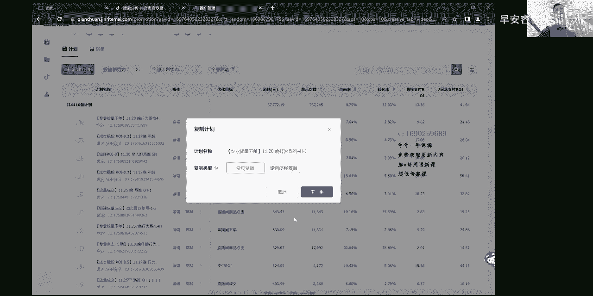
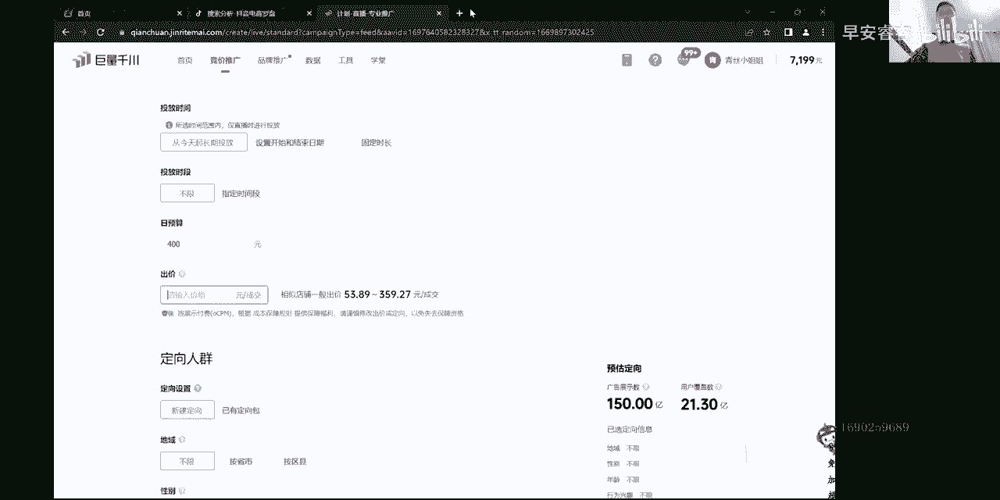

# 067 抖音电商直播投流起号课程 巨量千川全流程投放+小店随心推全流程+起号方式 - P15：4、实操逻辑投放- - 早安睿睿 - BV1Nn4y197Wg

哈喽哈喽，那么前面三小节给大家讲了基础页面搭建，为了新手三家去准备的莱卡达人对吧，整个青团主页的一个整体的专业版的页面，该怎么样去搭建，给大家讲的很细致很细致的，然后接下来这一节视频。

就是我们真正的有过投放经验的人，更多的在这一节视频里面多去那个多听，反复听，这就是讲一些投放逻辑在里边，那么是这样的啊，就是与我看过很多的账户，不管在直播间看的还是我带头的，还是来的学员的。

往往起不了量呢，自己投了不少钱，投个几万块钱的这些账户，大部分呢他还是掉在我前面，录莱卡的里面讲的那些话，全是清一色的专业版的计划，它必然在组合上面是不对的，我都说了，专业版的计划的话。

它只适合打标签的时候去用一用，后期的话为了去校正一下直播间人群，在十条里边可能大一条这么一个情况，那么更多的我们在我看一下，能不能把这个视频放大到也没了，啊放不大了，因为要共享屏幕，那么是这样的。

更多的情况下呢，就是我们在后期成熟了以后是不怎么去用的，那么所以说有很多商家他们在新号上来以后，然后在投的时候就一直老是掉到那个框里边，用了一条专业版的计划，各种答案你是答不出来的，投放逻辑是什么呢。

给大家讲一下，这也是你们掉到框子里面去的一个观点，就不知道该怎么去调整，就不知道打哪些计划到底该怎么投，还有人讲新号怎么投，老号怎么投，稳号怎么投，然后客流量怎么投，其实这里把逻辑我简单几分钟讲完过后。

新号老号妈一样的，头本号什么东西的都是一样的，只是为了去讲玄学，把它整的很复杂，分段式的听好了啊，投放的逻辑是这样，就是在新号刚开始的时候，我们是以就跟我直播间讲的情况是一样的。

我们是以精准的人群进入到直播间，然后形成一定的成交画像，那么这个时候慢慢的跑，跑到西推是这么一个过程，大量的计划以精准的计划为主，莱卡达人对吧，包括还要结合一些泛流量。

那么正常情况下给到大家这样一个观点，听好了啊，这不管是线下课也好，还是一对一的也好，我在带他们的时候，其实就几分钟就能把这个逻辑讲完了，就是在投放的时候，前期以大量的一个精准流量加少量的泛流量，结合。

这样去投大量的精准加少量的泛流量，什么叫少量的泛流量，比如说像一些类似于什么，就是想极速智能推荐，往往这些这些是后期听好了，这些是账号跑稳了过后主投计划啊，就是极速智能推荐或者极速的基础地域性别。

这种计划或者是专业的系统智能推荐，或者专业的一个人群，包，以这种计划为准，包括稳定了过后经常还投ROI对吧，成本稳投的ROI成交，这几种类型算是一个成本稳投，抛除在外，我给大家切一个页面看一下嗯。

共享页面结束的话，我想换一个页面，嗯给大家换一个页面，有啊这边我打出来了，这样的话正好确认下来，OK大家来看哈，我们更多的时候啊，就是像这种开始的时候，80%的精准流量加20%的泛流量。

泛流量里边我专门给大家打出来的啊，像极速智能推荐呐，极速基础呀，专业智能呐，还有这个专业人群包，这些计划算是一个泛流量，在新号刚开始的时候，那么到了后期稍微跑正了以后。

这些计划才是真正的投产最好的计划技术，智能推荐技术基础，专业智能推荐人群猫不算哈，这里边当然要包含两个类型，就是稳投什么问投，有点投放逻辑的人能听懂我在讲什么，前期以大量之中精准流量加少量的这种泛流量。

也不一定非要80%的精准流量，可能是70%加60%，那么这种所谓的泛流量，它基本上是占30%到40%，也可能大概就这么情况，就是前期大部分精准结合少量的泛的，这样既能够去保证人群精准度。

又能够保证一定的量，那么到了投放个差不多一星期左右，慢慢的搞出投产的，稳定了过后，基本的情况下我们这种比例方式就发生了调整，他就大部分跑这种像这种截图智能推荐，专业啊，截图基础呀，专业智能推荐啊。

成本稳投啊，以这种形式主投为准，所以说你要说你一场能卖个几万块钱，那么这个时候你其次投放，直接就拉这种计划就行了，包括人群猫也可以在里边去做测试，这是一个中间值的一个计划，它有可能会好，有可能会不好。

大部分就是以这些计划转化是最好的这种计划，但是刚开始的时候，这种计划就变成了泛流量，因为它没有任何数据反馈，他没有依据去跑，所以说根据直接去建的话，那么他跑出来的人群就泛，我不知道能不能听懂哈。

反正你听不懂，你就反复听，然后我录这一节的时候呢，我也尽量的给大家去重复的去讲，反复去讲，这样你就能听明白了，OK懂吗，所以有时候我在带他们线下的时候，有过投放基础的人，他一下就明白了啊。

包括还有通投队通透的情况是这样的啊，包括还有通透，空投是这样的，通头就什么都不限，直接去拉，但是我更多的不建议大家打通投，因为通途跑着跑着信号一定不能打，后期的话到了稳定过后，投个十天八天的投产。

有了稳定了，再去结合这种跑量计划，就变成了这种这些计划嘛对吧，那么通透也可以带上，但是通头会跑偏，大家注意一下，不要以通头转，具体这些就行，那这些成本稳投，然后再测试人群包就OK了。

后面就差不多就跑这种几种类型的计划，那么这些计划里边的一个调整方式就很简单，你比个几，打个比方来讲哈，我跑一个极速智能智能推荐对吧，投的是成交，比如说对吧，那我这一条跑了以后。

然后感觉还不错或者不怎么好的时候，我可以同样的计划来跑一个下单呢对吧，我可以跑一个ROY呀，能不能明白这样一个哎一种类型的计划，是不是呢，同样是极速智能推荐，他是不是就变成三条计划，不断去反复去测。

去调就行了，这就是一个所谓的投放逻辑，其实这种呢讲起来很简单，一会就讲完，但是对于真正投放没有很强的实操经验的，然后你在线上直播间里面听的，你也听不明白，他也不会讲这些东西的。

所以你会发现一个奇妙的现象，大家来看哈，我们再把这个就是共享屏幕把它切掉一下，要把它切到切到我整个页面上面来哈，来我们再去切到页面上，搞个计划给大家看一下，这一个OK这样是可以的哈。

大家来来这样是可以的，大家来看啊，我这个账户的话，这是整个相对来说跑了差不多一个月的流水嘛，一个月的数据，9万块钱，10万块钱直接支付一笔12。3，总支付40嘛对吧，来看一下啊，兄弟们哈，来。

来看一下哈，预算全部是放量的，看到没有啊，跑的好的，全部放量的，但这里边大家听好了啊，我第一页的话给你们点开看啊，简单吧，感觉被忽悠了是吧，其实就这么回事，只是别人把它弄玄学了懂吗，就这么回事，那看哈。

但是有一点你们注意了啊，我这个户里边跑了商品点击跑了，粉丝提升，还有进入这些就不做过多解释了，你们不要投就行了，听好了，这个东西不要投在这个上面，如果有疑问的情况，你去没事去我直播间问问。

把这三个给它去掉，那你看看这边的投放的所有的计划类型，大家看一下那专业的这个商品点击，还有这个几分，这个下单这几个不用管进入对吧，然后专业版的对吧，看到没有啊，行为试推，看到没有，系统智能推荐，看一下。

啊放量下单看到哈，固定时长四个小时，这个预算是加上去的，地域性别年龄对吗，覆盖量看到6。7亿呐，系统智能推荐，看到没有，下面喏一路到头看到没有，好了，这就是跑量，好的计划往往就是从从我们整个相对来说。

就是投放的所有账号来讲，好的好的，就这几种类型，计划成本稳投极速智能推荐，极速基础，极速达人，专业的智能推荐，附带他妈一条两条专业的行为，兴趣校正校正人群，这是跑真了以后就这么个逻辑。

再给大家重复过一遍了，前面这条几把我们过掉来，专业版的过掉了，急速的看到没有，极速智能推荐，看到没有，来把渔船捞过来，来兄弟们来下单，两千两千块钱对吧，那8。23的点击率，1。9的转化率。

十代投产总支付不用看总支付，看看直接支付，OK你看一下，那放量对吧，下单固定时长，专业版的话地域性别年龄对吧，然后系统智能推荐，OK好了哦，这个是专业版的这一个着急打错了，这个专业版的过极速。

是这个这个这个极速版的这个极速成交，看到没有细推，Ok，呐直播间画面对不对，放量呐成交对吧，当前预算六个小时，智能推荐好啦，真正的一旦账户出来以后是贼好投的，就这些计划，你看着刚刚这一条加123。

这一条1500，然后对吧，七的点击率，这是跑出来越跑越真，点击率直接支付一笔16，专业行为在哪呢，你看这一个专业的细推，看到没有，系推行为的细推看到没有，那这一个是进入对吧啊，粉色提升，这个是进入。

然后大部分下面你们看好了，你看哈啊哇啊哇啊哇，成本稳投看到没有，极速成本稳投极速极速看到没有，这就是真实的账户真实的情况哦，你听了我这一节过后一定会有收获的，不管是有逻辑的，没逻辑，有逻辑的人。

听完后瞬间明白了，没逻辑的人嘛，可能需要慢慢耗，说实话就这么回事，来这第二页哈，第二页拉十条计划来给大家看一下，来啊，技术稳投极速稳投专业专业看到吗，行为细推，看到没有，没有一个是打行为词的了。

我都不投行为了，所以你千万求你们了，别再掉到那个一条计划跑天下的时候了，好的计划你要知道哪些是好的懂吗，所以说我这里边讲的是蛮细致化的了，说实话啊，就给大家先把这个逻辑给你整明白。

然后再给大家去重复强调一遍，投放逻辑，前期大量的精准计划，结合少量的泛计划，这种里面呈现出来的是叫泛流量，懂吗，但是它是跑量就又能够质量又精准，当它一定有了数据以后，收集到数据以后。

一定是这种以系统智能推荐，或者限定一下自由性别，列宁这种计划跑的是最好的，知道吗，但他前期没有数据累计的话，那么他跑的是泛的，所以前期需要用精准的什么行为兴趣啊，达人啊，达人是我们正常投的，根据品类啊。

行为兴趣，反正一般的说实话基本的都不怎么投的，但是刚开始一定要多投，后面配合少量的这种类型，好的计划，最终会把这种天平会平衡过来的，刚开始跑精准的加少量贩的，慢慢会变成大量的泛的，少量的精准的。

而刚开始说他犯这种好计划，是因为刚开始账号没数据，一旦有数据过后就大，这种计划极度智能推荐，专业智能推荐，什么成本稳投呀，技术基础呀，专业基础啊，这种都是一些好的计划，它是高产的计划。

只是在不同阶段去使用，到了账户，一旦有能卖给他妈一两万块钱，那几千块钱大几千块钱呢，好几万块钱呢，你一场也能卖35万块钱的这种账号，上来就集我讲的这种逻辑，就投点极度智能推荐成本稳投对吧，长门管投。

里边有一些那个相对来说低于性别年龄，包括说那个行为兴趣达人都有的资格去测这种，能不能听明白，这就是投放逻辑，最后给大家总结一遍哈，就是新号刚开始的话，把这个页面切过来，还有很多东西呢。

大量的一些精准体计划，大结合少量的一些就是极速呀智能推荐啊，这种通头计划，然后慢慢的跑着跑着把这种天平给调过来，变成了大量的极速的呀，大量的成本稳合啊，大量的专业的试推呀。

然后带少量的哎行为兴趣达人就这样情况，这个就是大概的一个投放的一个方向，当然短视频投放我会单独去录一节课，给大家去讲一讲，大部分直投直播间呢都是这么一个情况，那么接下来还有一个问题，这个应该能听懂哈。

听不懂你们就把我前面的几分钟来回听，再看看我这个who你就OK了，你心里就有数了，并不是这一个who这样，所有的只要有过投放的人，看到我这个页面，听到我讲的，他一定会豁然开朗的。

他也一定或者说技术比较强的，他一定也会觉得哎OK哦，原来我这个方向是对的，这他妈投上百个账号都是这种情况，投的不骗你们哈，都是这种情况，那么OK啊，这个时候呢在我先不把我先不讲那个哈，我先不讲啊。

我看啊，投放投放逻辑放到后面吧，计划调整放到后面吧，这个讲投放逻辑，那么新账号该怎么投，老账号该怎么投，什么问号怎么投，括号怎么投，就把这种我觉得对于我的理解来说，你把它忘了这种事情吧。

你就记住妈上来过后先怎么投，怎么去筛选，筛选出来以后，然后我再怎么去优化，这就是一个核心点，哪有那么复杂呀，那OK你看哈，比如说我们再把这个我把这个录制，这个再切一下共享屏幕，再切一下，再切到这个页面。

兄弟们哈，我们再切到这个页面，大家来看哈，这里边的东西给大家讲完了哈，差不多就投放逻辑对吧嗯，所以你天天都在想，我妈头发逻辑计划搭配是怎么搭配的，哦对了，还有一个计划搭配，我忘说了，听好了啊。

投放逻辑是通的那个ROI再切一下，这个先先过掉，先不要这个，先过一下，页面还是要到亲传页面去嗯，大家听好了，就是这种搭配，听好了，这个RI成交下单这些东西一定要结合起来跑，因为有一种情况。

因为我我讲的每一个计划，刚刚讲的是投放逻辑，是搭哪些类型去结合投放对吧，那么当你去真正投放的时候，你会发现一个奇妙现象，RI跑的比较好，不管你跑行为兴趣，它只是一个人群的方向上面。

在优化目标上有下单进入，点击成交，啊啊啊对吧，评论粉丝这些东西记住了，正常投就是IOI成交下单这三个，但是里面会出现一个现象，嗯上来过后投RO的时候啊，就是账号跑着跑着，刚开始投成交也好，投下单也好。

跑着跑着人群跑，真的去尝试投ROI，你会发现投产比他高，那么你就会慢慢会调成，有些账户清一色的全r one，这里面全是RY，那这个时候就要出问题了，大家记住了啊，当你拳头IO的时候。

刚开始投产是比较高的，跑着跑着跑着你会发现降头产了，人群被抓没了，抓准精准度是越缩越小，越缩越小，抓没了，那么这个时候AI会下降，那么它会出现一个现象，就是嗯投产下降以后很难拔起来，就这样。

所以大家记住了啊，不要百分百的优化目标，以ROY为结果，如果出现了全跑ROR的，有些商家会这样全跑ROR跑到最后跑不动了，然后投产也下降，这个时候建成交计划也不跑，那么这个时候我们需要怎么调整呢。

就是去单独的建成交计划或下单计划，换到单独的计划组里面，因为2O2是没有主的嘛，不包括成本稳投没有主的，其他O是有主的，那么你就单独去分一个计划组，建成交计划，建下单计划。

这样结合起来跑慢慢的它也能跑起来，然后把ROR的占比慢慢降下来，最终达成一个差不多，50%到60%的ROI计划吧，然后那个四五十%的一个成交，跟下单这三者之间结合起来跑就OK了，就这样啊。

你看投放的方向对吧，前期怎么投精准的加饭的，后期的话用存放的这些拿量的计划，然后加上少量的精准计划，然后ROI优化目标结合起来就好了，就这么回事呀对吧，就这么OK就这么简单，那么接下来下一个。

下一个的话给大家去看所谓的新号怎么投，老号怎么投，这个也是个玄学，说实话，我们先回到刚刚那个笔记的页面里面去哈，共享文档，我这里边给大家打出来这几条计划，一个两个三个四个五，五个六个。

你可以把它称为叫六条子计划或者六条母计划，或者六条种子计划，下面这个打的这个字只是为大家更好理解的哈，我就打了这么多信号，差不多这样的形式投对吧，因为这80%这个精准流量大家都知道。

这种叫精准流量嘛对吧，这种两莱卡达人或者莱卡加达人对吧，或者极速达人也算是精准流量对吧，这种叫精准流量，那么相对来说这泛流量是单独给大家打出来，其实是好高产计划嘛，得给大家打出来，这样好理解。

那么另一个话题来了，信号怎么投啊，我直播间给大家的这六个计划是两条级数，一个是基于性别年龄，一个是达人，其实是做了一点保留的，没有去给大家去讲极速基础，其次可以用极速基础加极速达人，这两条信号图的时候。

那么投那个自愈性别年龄嘛，稍微筛一下也行，但是真正的投这个好投，知道为什么投这个好投吗，投集数的时候，刚开始的时候信号搭建的时候，在直播间讲的这个内容哈，跟这个内容是不一样哈。

呃我们更多的是要投出大量的计划，不要删除，然后我后期去做好的计划的筛选，那我当我的时候不投这一点，这我都说了，这一条是一个好计划，最终投产一定是好投产对吧，那么当我不投他的时候。

那么我也无法筛选出这条计划出来嘛，对不对，所以我在直播间讲的东西呢，稍微有一点保留性的东西，讲了嘛，地域性别年龄没有讲，这个其实这一个比地域性，极度地域性免疫率投产要高，那么正常投正常投的时候。

大家以这样的形式结合就行，那么听好了，新号的时候这样老号也行，都一样，其实老号反而会更好啊，新号刚开始就是这几条搭出来，技术达人，专业徕卡专业达人，专业智能推荐，专业加达人或者加专业人群包。

这里边你就反正七个嘛，七个你自个去挑，如果是把智能推荐跟人群包，这一个可以去做一个兑换，你可以去兑换一下这两个，其中任意一个加进去对吧，或者是这三个之间你去挑两个，你别跑七个了，跑六个就行了。

因为人群猫，毕竟那型号刚开始的时候投产不咋地好，说实话，这种计划投产也不会咋地好，但不一定，但是我们教的这个方法呢是这几条六七条计划，答出来以后，不管新号，老号上来就先全部砸一遍，全跑全跑，OK全跑。

跑完以后听好了，跑完以后有一个着重点，大家听好了，我刚刚在教达人莱卡的时候讲过，这条计划，他妈是个垃圾计划，这条计划基本不好懂吗，你也可以不实在不行，把他给排除了吧，别投这一个了。

留这六个投或者留这五个，这这四个加这一个弄这五个上来就跑，实在不行，这六个统统一跑也行，反正就别跑七个了，人群猫刚开始我总感觉不怎么好，说实话嗯，就这种情况，那么听好了啊，新号刚开始的时候。

把这六条计划统一的全部答出来，你放到一个计划组里就行了，放不放逐也无所谓，你把这几条计划给答出来，直接给他开跑，出价出一样，那这六种计划基本大家来看哈，成本稳投，当然我没加啊，如果你是老号的话。

那么你投产包括你们现在这能去买我课的人，你们很多是已经在投放了，你那个户已经是有消耗的户，每天都投着了，那你把成本稳投也加进去，或者也不用加了，那种都好，计划不用管它了对吧，那种必然距离你已经在投了。

不用去考虑它，你上来过后直接信号的话，上来过就投这六个计划，沿着这六个计划去跑，听好了，放一个计划组也好，或者不放主也好，你就这样给他去六个计划去跑，如果是出价的情况，采用控成本出价的形式。

你就给他出一样的价格啊，这几个计划你给他出一样的价格给他，因为什么逻辑，大家听好了，就是正常我们投放的时候就这么多类型计划嘛，计划类型就这么多对吧，那么像这个人群猫不咋地，好的，我都说了，把它排除信号。

刚开始成本稳，投的话，一定建立在老号的情况，一共是八条八条左右计划加这六个，再加上成本稳投一个二Y1个成交，一共八个八个主要的消化计划，这种类型是我们经过包括从我从去年投的时候。

真的是每一个计划撤过上千条，最终得出来哎呀就这几个就够了懂吗，就这几个就够了，那么逻辑就是这样的，我信号刚开始的时候把这几条计划都答出来，正常市面上跑的好的，所有的计划就这些类型对吧，我把它全搭出来。

然后我以同样的形式出价，然后在跑的时候总归有的跑得快，有的跑的慢，有的不跑对吧，我再调一下就行了，那么他是什么逻辑啊，就是先把ABC一共是阿拉伯数字，1234567899个加零十个。

我把这十个数字全拿出来全使用一遍，我可能投个三天到五天，或者投个五天到七天，你会发现一个现象，哎我会发现妈的这种类型里面有些计划跑的好，有些计划跑的不好，那比如说我们最终跑出一个奇怪的结果。

这莱卡跑的很差呀对吧，这个莱卡加载跑的很差呀，他已经经过五天到七天测试的，它都差，那你还在跑它干嘛呢，那说明这个莱卡的人群是不对的呀，而且我还告诉你，莱卡计划本来就加达人本来跑的就不好。

那几乎是可以把它排除掉的，那么当时我在讲这个逻辑的时候，就给大家做一个比喻，那既然通过就是赛马机制，主要市场上正常的账户里面跑得好的，几万上千个账户里面得出来，就这种类型的就这么几个，我通过一周左右。

5~7天或者3~5天的赛马总会赛出诶，你把周期把那个页面一拉，你一选几月几号到几月几号，然后咔一下出来了对吧，咔一下出来了，那么这个时候一点消耗优先哎，排顺序从上排到下，然后各种类型是不是都有了消耗。

往往其实你拉一个周期往往消耗高的对吧，投产也不会差，投产差也不会消耗高，你就把第一页十条看完，你肯定能找出哪几种类型计划跑得好，值了吧，有收获吧，这个不就OK了吗。

然后你接下来不就重点围绕这些计划跑了吗，那就在这些计划上去跑，对不对，OK能不能听懂啊，这不就行了吗，然后跑跑投产跑的正一点呢，再把成本稳投成交RI加上哎，这个时候是不是。

你看我前面给大家讲了投放的逻辑，后面给大家讲了A型号该怎么投，那老号更简单了，老号的话，你把这种计划这几种，它还是按照我这种形式大一遍，你按照我这种形式大一边妈当场都有投产的，连续跑个几天都消耗能正常。

哪种类型你都不用跑三五天，你跑两天你都能感觉到哪些跑的不好，哪些跑得好，那就主力计划，你也看到我刚刚账户给你们做演示了，你要这个时候要有点迷惑，你再把这个直播网啊，把把我的录屏往前面翻一翻。

看看我账户的计划是不是有明白啦，跑的好的嘛，一定就那几个计划，跑的不好的嘛，不跑它的就行了嘛，最后在那好的计划上不断去做调整变量，那一个极速智能推荐比较好对吧，投成交，OK那我改个下单呢对吧，试试嘛。

我再改个2Y呀，试试呀，那最终不就筛选出好计划，一直就以这种几个类型跑了吗，嗯就这么回事，OK能明白吗，就这种情况，就这种情况，所以说往往是如果说不带套路的形式，是几句话可以讲明白的。

带套路的情况讲三天就这么情况，也不会讲那么多啊，那讲三天的给1万块钱，肯定要讲那么多，就这么回事，OK这就是调整方向，再重复一遍，那新号上来过后，先把这几种类型计划，这差不多这几个全搭一遍。

搭出来去做赛马，去跑跑个跑一段周期，当然你不要有这种想法，我在线下课老有人问我，他说那我这样的话搭六个到八个，那我一跑不就382十4361千八吗，这个我相信有点投放基础的人会有这样认知的。

答出来是搭出来这么多计划呢，不一定他能跑完呢，有可能跑300啊对吧，他不跑呀，他有可能跑300，有可能跑500，有可能真跑完了对吧，他不一定，反正每条就要300块钱，这样去撤能不能听懂，兄弟们能不能懂。

就这么回事，懂了吧，就这么回事，最终围绕着这些计划里面去撤，那么接下来我把嗯下面怎么调整呢，也顺便在这一个视频讲完吧，要不然我分多个视频的话，如果我每一个视频在打标题，打什么投放逻辑啊，调整方向啊。

有人会倒卖我的扣啊，我防止他倒卖我的课的情况下，我就把它录在一个里边，你们正好开火车一样往前听，把它听完就行了，那么这个里边讲一个那个哈，这个页面就把它切掉，刚刚讲的能会哈，一定反复听，反复听。

反复听一定能会，其实逻辑很简单，就是搭了几个计划做赛马机制，让他往前跑，让他大量跑对吧，跑个三五天，五七天的，然后接下来下一个动作教大家怎么去筛选，因为我刚刚已经讲完了，就是最终点一个周期。

然后的话点消耗优先，然后去做筛选，接下来我还要给大家实操一遍，嗯我的我的线上课永远是这么简单哈，不管哪一个我录水星推也好，录什么也好，永远是这么简单通俗易懂，OK这个页面，那现在我们就拿第二个页面嘛。

因为第一个页面消耗高，然后的话有那个有进入呀，粉丝提升啊，点击呀或者误导你们，我们就拿这个页面来讲，这是大家看啊，啧，你看啊，我给你们划一下啊，比如说现在2022年11月11号，一号到30号的。

我们别选到30号了吧，我们就选，我们就选20号到30号的好吧，我们选20号到30号的，这样我盖一下日期，改一下名称啊，大家看哈，这个里边是点击率，不用管它，OK38400块钱直接支付一笔。

十三七日总支付41对吧，搞个单嘛，来现在我把周期选完了，你按照我刚刚那种逻辑，那么多类型计划都跑了，现在点个消耗优先对吧，消耗优先排出来的对吧，这个时候兄弟们看哈，这个优化目标我也给大家讲过。

这里还有商品点击，确实我们在投点击去带，但是一般的情况下就你们就别投了吧，啊这个不误导你们啊，听好了啊，这样我按照这个形式拉出来了啊，按照这个页面按照这个形式我们拉出来了，OK这个时候你看啊。

这就是筛选计划的过程，你看出来以后嗯，从高到低对吧，当然商品点击那种垃圾投产这种计划你听好了，往这边盖也能看到吧，反正全放量跑的，别别怕，成熟的账号放量跑，用时间中预算控一下，别怕，OK就这样吧。

这样好看一些哈，把这个往上挪一挪，诶，这样行了，那看哈嗯你看哈，消耗日期啊，消耗一点，消耗优先，瞬间从头到尾把这几个忘了啊，点击这个给忘掉啊，你看哈，好的好的计划，你看哈，我瞬间就能筛选出来了，哎。

专业的系统智能推荐成本问投，投的是ROY对吧，然后极速的系统智能推荐成本稳投的诶，极速的是推基数的，这个是自己账号的那个投的是那个点击，就不管它，你看各种类型计划找出来没有消耗好的，转化率高的。

找到了吗，这不就找到了嘛对吧，能不能明白啊，这就是主力计划，我账号应该主跑什么计划，当你有这种想法的时候，这个地方就解决了你这个想法，我账号，但是一定建立在我的这个前提下，就是跑了刚刚我讲的那几条计划。

我一定要按照那个前提嗯，按照那几个前提，把这种多类型为什么会多类型全搭哦，新号老号为什么建议你们多点型全搭，因为你只有123456789十零全搭了，偷偷跑来，我这样筛选的话。

一下才能筛选出哪种类型跑的好吗，能不能明白呀，那就是我在直播间给你们看账号的时候，你们发现一打开以后，他妈一排全是专业，不是成交就下单就RY那怎么筛选嘛，只有一的时候怎么能筛选出好的计划嘛。

它筛选也是一嘛，你要是1~4的情况下，能抠出个二跟四吗，嗯我相信这个人没有那么笨，应该是能听得懂的，我一般说实话也还是蛮用心的，我希望你们都能够听懂，所以说我一直有的东西我一直在重复，并不是我需要重复。

其实我讲要面对面的妈咪一遍就过完了，真的是这样的，那那么筛选完以后，这就是筛选主力计划的时候，那么筛选完主力计划的时候，那么接下来不就好办了吗，兄弟们来OK啦，你看比如说这一条计划筛选出来了。

第一条主力计划筛选出来了对吧，那么接下来我可能就主跑这几个类型计划了，比如说这一个塞出来，我可能就就跑它了，那么接下来时候做调整吗，做调整不就行了吗，做调整的时候呢，就这条计划我们去做个复制。

那已经确定这个系统智能推荐跑的好了，对不已经确定他了，但专业版的这个系统智能型也跑的好，那接下来我投的这个计划呢，接下来呢投的是下单复制一个嘛。

来复制一个，布置完以后来呃，放量跟控成本，我刚在开播第一节课里面讲过，这一条，大的是放量控成本也行啊，那我打的是放量下单对吧，我控成本下单行不行，我出个价对吧，我出个价，比如说出个十三十块钱对吧。

那么下面这些其他东西我都不变啊，这预算搞错了，下面除价来啊，30块钱对吧，OK1模一样的这条计划，我复制一个O不OK嘛，这不就筛选出好计划，在不断复制的过程了吗，能不能懂啊，那标签分类一换嘛。

标签分类型不换它，我们先把投放方式做一个变动，这不就好的计划做了一个调整诶，复制一个出来对吧，那你说我放量的投的下单，我把它投一个成交，还是这样形式O不OK嘛对吧，是不是先从大箩筐里把这个瓜给它摘出来。

摘出来，我在这个瓜上面再做修正，就这么个逻辑做复制调整啊，我投一个投一个空成本的放量的成交嘛，对不对，那还是这种类型，还是跑的系统智能推荐，还是跑这个OK呀对吧，这不就啧思路清晰了吧。

这就调整方式嘛对吧，这种计划是不是你看哎一步一步，我是给你延伸下来，你就回头了，就这么回事，所以说基本你别看我录这三两个小时的，基本就解决这个问题了，纯说的要不是加前面那些什么录那些页面。

一小时就全解决了，懂吗，有时候面对面找我一对一的话，就个把小时就解决了，然后你就接下来这个应该会了哈，好计划不断复制啊，跑得好就不断复制，复制完过后，然后原计划复制也行，复制完做微量的调整。

控成本放量之间去做调整对吧，三个目标之间对吧，因为放量没有ROI那控成本的啦，我把它调成控成本的ROI投的系统，智能推荐还是一个计划，只是投放的目标做了变动，投放方式做了变动，还是他的还是他，对不对。

OK呀，一个计划只要跑好，能复制出很多条出来，然后复制出来代表跑的好不好呢，不知道听好了，明确的答案告诉你，不知道你听我的这节线上课，不要有任何的想法与怀疑，你就百分百的去相信，这就是实操里边的东西。

就这么回事，你就照做听话照做去执行，当然人货场是核心哈，一样的，跑的妈人货场不行，计划千川也好，随行队也好，斗家也好，是锦上添花的一个买流量的一个东西，只能确定他流量买的精不精准，流量买得很精准。

即便是我们搞一些像美容行业搞的会销，通过发传单，微信什么形式把你加来以后，然后到现场，如果那个讲师的课程，他的感染力不行，他不成交的，你要懂这个逻辑，所以后端诶两者之间一结合OK了，就这么回事。

这不就是怎么样去，然后投放逻辑在这节课里给大家讲了，前期跑精准加饭，后期泛的加精准对吧，那么投放的计划信号该怎么投，老后该怎么投，就新号老号统一的按照这种方式投，无非是老号的时候上来过后。

在我给你的几个计划里面增加了成本，稳投IO跟那个下单那老号，因为他有投产嘛，直接就借用这个数据跑就行了，最终跑出哪些好的，就哪些好的，最终再再给大家重复一遍，好的计划，一天的成本完成的成交。

ROI技术智能推荐技术，基础技术达人，专业的系统智能推荐，没了这几种计划当做变量做变量，我这里边也给大家做演示了对吧，投放方式可以去做变量，一个计划复制出来做变量，优化目标可以做变量，对不对。

出价可以去不同的出价可以做变量，当然还有一点呢，同一个优化目标，这个目标值设定不一样，也是可以做变量的，一个是八，这是一条对吧，他也还是跑的是这一个计划，比如说这种类型跑系推的，还是它那么呃设定个十。

比如说18做一个变量嘛，还是这条计划，这也叫变量，那OK这不就呐，你说嘞，我把性别年龄这些地方复制一个出来做个调整，它还叫一个变量好不好，还是那句话，做错事呐，包括，包括这个地方，兄弟们来，你看哈。

包括这个地方在整个分类里面是这样的，我盖一下，因为名字一般不那个啊，是这样的啊，在整个创意分类里边，我一模一样，计划复制出来，分类改编一下，有没有问题吗，没有问题呀，对不对，那分类女装的。

那我非给他换一个来啊，换哪个呢，换男装当然是不行的啊，换一个服饰，换一个高档服饰来，那高档服饰的那OK我换个分类也行啊，我这一个计划跑的是那个什么看哈，我这一条计划跑的是空放量吧，控成本放量都行对吧。

来然后我跑的是这里边打不打都无所谓，这个就能听课的人都懂得这个东西来跑的，系统智能推荐这句性别这么选的，跑的挺好，我复制一个，我这个跑的是直播间画面，我换一个视频行不行啊，可以呀，测视频的嘛。

就这么回事呀，所以这不就明白很多了吧，这个明白很多以后啊，一次性把这一个要不给录进去吧，把那个这句话调整呢再讲一讲来，OK我们现在再回到这个页面关掉，来听好了，来这条计划出来以后听好了。

要看这个计划的数据，大家听好了，一定要看数据，就是不要盲目的框框的去吹每一条计划呢，其次能走量的计划，能消耗起来，能走量的计划，这种叫主力计划，每一场都一定会有主力计划的，当然你把预算一给高对吧。

出价一给高或者放量一给高，他就能走量，就是但一定建立在转化上面哈，没转化的步骤量，那么这个时候684转化那个点击率高，这个转化率正常转化率嘛，2~4正常转化率支付啊都很OK，这种计划就给足钱给他跑呀。

因为我是一个服装号，退货率又高，所以我是不是以纯付费为主的账号，如果我是以纯付费去拉的情况下，这个账号我可以无限去投，投产也高，但是他一直有六七十%退货，没有太大意义，定制太多。

但是你们正常我们先抛开这些话题，在讲计划的时候是这样，你看这种高点击的对吧，正常转化的投产又OK这种情况复制就行了呀，那如果出现一种情况，这个点击率超高，这个转化率贼差。

那你这个时候就要考虑到计划设定的人群，来看他千斩行不行，这千盏要很便宜，十块八块的，几块钱的，那这个一定是跑饭的嘛，一旦跑犯了，什么人都曝光，点击率就会变高嘛对吧，都要点点一下嘛对吧，这不就很好理解吗。

那如果跑泛了过后，我去调整里面内容不就行了吗，把计划打开里面去调整人群上做改变呐，或者我有可能是这一条计划，他跑翻了，A跑的不行，复制一个复制的A1A1的话，有可能跑的很好呀对吗。

这不就是投放的时候实操的一些东西吗，就复制一下，调整一下就行了，那如果出现点击率很低，转化率很高的，那我也有啊，点击率很低，转化率很高的，我这个给大家看一下，这我这个账号在不在啊，啊这个账号OK啊。

结束一下这个共享，我再换一个页面给大家哈，嗯应该是这个应该是这个吧，哦还是这个好，稍微再换一下，等一下，你咋咋啊，跳不过来的，我有个新我有一个新号，刚跑新号，怎么会跳不过来呢，啊这个跳过来了。

OK拿这个信号跳过来，这个信号刚跑，你看喏，7000块钱二的投产，跑到三就能保本了，第三天今天基本明天压一下，这个是今天消耗快拉的，我是跑视频的，跑视频，我改天给你们单独讲一节如何投放视频的。

它是不同的逻辑懂吗，喏你看这种第三天差不多今天第三天，明天后天就能拉上来了，那他就能拉到三网上，就能保持到不亏了，慢慢就起来了，那么这种情况大家来看这里边计划哈，来三千六百一十九二。5的点击率对吧。

略低哈对吧，转化贼高呀，那转化率贼高呀，看到没有啊，七那这种就不用考虑了，如果为了走量的话，就直接使劲往里面堆跑就行了，要不然他怎么会跑出3000多块钱呢，一共跑6900，他咋能跑3600的呢。

就给它足够跑，点击率低的时候，当转化率高的时候，你就给它跑，但是不是说要跑几千块钱啊，你就正常，比如一条计划给300块钱，当它出现低点击高转化的时候，那么代表他前期曝光的人群有可能会泛一点。

但是这东西会比较爆，它能卖动，那么随着它越跑越跑越跑，它的转化越多，那么随着这种成交数据不断的回传，累计成交数越来越多，那么他慢慢的这个点击率人群，他会跟着千川，会跟着抖音直播间账号的人群。

反馈的人群往那个人群那跑，慢慢慢的这个数据它能上来的，OK这不就稳，这不就解决了吗，所以说依然也要去观察后面的前斩哈，千盏也要去做观察，所以说这就是计划的一个观察，这每一条计划到底能不能用。

给到大家一个方法，就是首先高点击，高转化的，当然是不管它了，这个点击率也还算行，2。59正常跑视频的点击率基本就三左右吧，那么也有一些小众品类，比如说护膝，我投的护膝1。5的点击率就上不去对吧。

它就上不去，那么它转化率就高啊，他就这样，他一上去了，他转化率也就下来了，懂吗，所以说有些品类特殊情况一下，但是你要懂得这些逻辑就行了，那么在整个相对来说呃，计划的一个要怎么说呢。

计划的一个相对来说在判断它的时候，如果高点击高转化就无限的去跑，这个肯定是必然是好事情的，如果出现高点击低转化或者低点击高转化，也告诉大家高点击低转化的情况下，给他跑一跑，观察一观察，对不对。

如果出现低点击高转化，也给他一定的量，给它跑一跑，那么到底每一条计划去看，他最终以什么样结果去评判呢，以他消耗为标准，我个人是以它消耗为标准，每条计划给300块钱的预算，那么在正常消耗的过程当中。

就反正500块钱以下的客单消耗100块钱，要没有产出的话，应该是关了吧，基本是这样的，就500块钱以下的客单消耗个100块钱，基本要是没有产出，或者100~150，正常。

我也是借助了官方的底层的数据给大家去，有些东西我实操的时候也是借助它这个东西的，就官方给到的数据是100到200之间，就跑个100到200之间，如果他投产转化都不行，把它停掉。

因为计划它有一个消耗的一个时段对吗，他有一个消耗时段，你把它停掉，停掉差不多关，从关停到它完全消耗结束，差不多20分钟时间，这个时候再观察它的RO有没有起来，如果它RY起来的情况下。

那么这个时候你可以再把它打开，如果关停20分钟还没起来的话，就拉倒吧，再复制一个，有可能他能跑得很好，所以说100块钱到200块钱作为一个标准，我更多的给到大家什么三两百块钱客单的。

几十块钱客单的跑个60~100块钱，做标准，最高不能高于150了，因为这一条计划，比如说你是一个卖男鞋的，你的投产是在五左右，正常行业当中都这样，那么你比如说在四赚钱，那么你正常投产也在五左右。

你这一条计划已经消耗八十一百了，投产1。5，你这条计划不要抱任何希望了，基本把它视关了，我跟你说基本没啥戏了，关了过20分钟再看看，你要接着往前跑，如果头产涨不上来，就这一条就把你整体投篮拉垮了。

所以说一定要懂得去控这个东西，每一条计划按照我刚刚那个逻辑，反正这一节课你们一定要反复听，你花给我的三瓜两枣的，真的是在这节课里边后面加一个零都不为过，懂吗，就是这节课你反复听没听明白，你就反复听。

反复听我这一段视频，这一节当前面塞出好的计划，用好的计划开始跑的时候，然后再同时观察这个计划的哎各种调放方式，你这个时候不就从实操里边就全部解脱出来，回头了嘛，就这么回事。

那么一般呢我建议大家增长就100块钱，一个标准，60~100之间，客大资金点的五六十块钱不行，就关掉，过一会看看，再来个观察数据，就观察点击率转化率，观察它的签展，观察它的ROI就OK啊。

当然也有不对的地方，我手里那个男装的话，3380的客单价，那么它的消耗就不能用100块钱做衡量，你要用100块钱做衡量的情况下，那他出一单的话，你要100块钱出一单，就不说七八十出一单。

他就100块钱出一单，那他投产不就一比30吗，起步没条要计划吗，哪有那么高啊，投产正常的5~6男装，别看它客单价高，也是这么个投产，那么他的一个观察数据，基本的就是用客单价除以5~6。

那么它的一个标准基本就在500块钱左右，他500块正常，我给他的是500~700，这条计划要不产出了，死关了，就这样，所以说大家反复去听这个就弄明白了呐，计划的投放逻辑给你讲了，开开场就讲了对吧。

那新号老号该怎么投放，这种投放逻辑在里面，计划都给你都给你打出来了，他哪些计划，对不对对吧，然后调整的形式该怎么样去调整，然后就框架这个东西，顺便来说一下啊，我结束一下共享，再开一个页面。

这个页面新号刚投二点几，我估计你们看着有点恶心，但是这正常现象，你们知道的，有些品类投产率不高，三天能跑出二的头上，再有一天就能跑，跑稳了，已经很牛逼了，真的是这样，已经很OK了呐。

而且跑纯纯跑短视频的呐，OK调整啦，比如说调整主要这里面我这不咋出价耶，这个就要讲小白了啊，某个控成本的，我们不打出价的，啊这有个出价的直播间的下单，这个是出价对吧，这个出价计划OK。

那么这条计划跑得快的时候就很简单嘛，跑得快的时候往下面降价嘛，5%到10%的往下面降，如果消耗速度偏快的话，你再把这种比例往下面去加，如果再跑的再快的话，你就一半50%往下降，直接给到12。88对吧。

一半往上面去降就行，根据消耗速度往下面降，如果跑的很快的时候，你又感觉把控不住的时候，那么你还不如直接去那个，稍微的直接把价格多压一些，把计划先关了，然后把价格多压一些，这样过一会再打开。

看能不能跑起来，因为有的跑的特别快，跑飞的特别快的，他已经他本身就有20分钟延迟，你咋地，十百%分之20调整，你放心好了，有多少钱都给你跑完了，他本来就有延迟，看到的数据就不准。

你看到现在你的预算是1万块钱，一眨眼跑了3000，你出价是29，25。99，那么当你去把它调成22的时候，调一轮，过一会再看看，我估计22还没跑呢，他那个里面已经跑完了，钱估计已经跑了6000了，懂吗。

所以说与其这样，还不如把他屎关了，然后的情况下往下面去，过一会看投产，再把钱往价格往下面去降也可以，或者你预算不多的时候跑的不是特别快，那么你就慢慢去降，切记没有标准，这个降价到底降到什么情况。

做一个标准，没有，就降到你认为他的消耗速度，是你的可接受范围之内嗯这就是一个标准，你做我正常一条计划，我的预算都能够跑个，比如说我今年10万块钱预算，那我这条计划一眨眼110眨眼100。

这这就在消耗范围之内啊，你要说我2000块钱预算吗，这条计划一眨眼一般不跑，飞了一堆半往下面砍，所以这个没有标准，就记住一个点，5%到10%，10%到20%，20%到30%，或者如果非的情况下。

50%往下去降对吧，有预算别给太多嘛，把里面预算别给太多，防止跑飞嘛，不就行了嘛，就这么回事，这是出价的计划，那么ROR的计划，兄弟们听好了，RO计划跟这个相反，ROR的计划呢就是把那个目标值设定高啊。

搞个ROI哈，搞个成本稳投的RI，搞个那个吧，建个RY吧，翻译ROY借一个啊，ROR专业的对吧啊，预算400块啊，优化目标，这里边建议小于14，你看我这个账户多厉害，来我正常的话，你们一般听好了。

顺便讲一下啊，一般听好了啊，小于14的时候，那么其实也就按照80%的话，2。8在11。2左右选11都没问题，就按照80%出就行，老户新户也没有，新户也不投RY，老户的时候投ROY按照80%出就行。

看他跑的快不快，但钱别给太多啊，钱别给太多啊，按照百分，你看我这14。34的话，0。2就2。8嘛，就差不多去掉三，差不多11。35÷11，这种算是低出了，出11，出12算是低出了，他跟出嫁一样啊。

跟高出价一样，低出跟高出价一样，ROR目标我建议出价14，我有可能出11，有可能跑，非要一眨眼嘛，300块钱一分钟就干完了，有可能懂吗，500块钱一分钟就干完了，有可能，那么你要懂这个东西。

你要出个18的情况下，你放心好了，他死也跑不动，大概60，这样那是真的是滴答滴答的一毛一毛的跑，所以这里边逻辑不就弄明白了吗，跟出价一样，出价跑不动就往上加点，加点加点ROO目标出。

跑不动的时候降点降点降点降点，或者复制出来再降点啊，或者这个已经跑的挺稳的，消耗也挺好，投产也挺好，别动它了，别动它了，那复制一个啊，往上面为了它跑的快一点的话，往下降一点，为了让它消耗再慢一点的。

往上加一点嗯，简单吧，所以真的好，投放的时候干货就这么简单嗯，不需要如因为是讲讲大课的，所以才会录，那就现场做很多解释，你看我是因为对着屏幕这给你们直接讲，如果讲到的课的话，一对一去讲。

就这一节给大家讲很长很长时间懂吗，那讲一天能讲没问题的，而且还喜欢听，因为他是真正的干货内容，所以就讲这么多吧，这里边嘛差不多就没问题吧，这不就调整方式，投放方式，复制方式，在什么情况下。

控制条计划关掉还是开，对不对，我讲了100块钱，150块钱作为标准开关，然后怎么样调整这个计划的时候，要么就调整RY，要么就调整它的一个出价嘛，决定他跑快跑慢嘛。

然后怎么去看这条计划是否保留在这一节里面，都讲了啊，所以这一节干货给大家就讲完了，讲完了以后呢，后期的话我再去把人群包也录一下，补充进来，那么后期我再把短视频投放也给大家补进来。

但是零的投放跟这个是有点不一样，这一个里边我们的这前面这些内容都在讲，去这个内容都在讲，去一些去那个投直播间，那么拉的投一些行为兴趣啊，包包括其实短视频投的计划还是这些计划，只是在打行为兴趣。

打莱卡的时候形式不一样，打大类不用那么细致化，它本身就有流量好吧，然后你们有更多的其他的问题也可以，没事私我好吧，就讲这么多也足够你们这个值这么多钱的，最后其实线下卖线下卖那么多钱。

就是很多人讲线下课也好，讲线上课也好，讲了那么多，他也不一定水平会比我讲的这些东西会更高，这是必然的，因为我是没掺杂水分，给大家把干货给讲了，那么对于新手小白这些类型的商家。

建议大家从我第一节开讲来听到结束，那么对于一些有投放经验的人来说，去多听我这一节课多重复听，OK就OK了行吗，那么就这么着啊，后面人群包我再往里面加哈，或者你们想听哪个板块的。

到时候直播间里边或者说怎么着的，跟我说，我再往里边给你们加课，反正这几节课一定是对得起你们的价格的，一定是而且有点投放逻辑的人，其实从这里边能够解脱出来，对青川就没有什么过多的玄学了，就这么回事好吧。

Byebye。

