# 067 抖音电商直播投流起号课程 巨量千川全流程投放+小店随心推全流程+起号方式 - P2：2、高产计划的创建- - 早安睿睿 - BV1Nn4y197Wg

哈喽哈喽大家好，那么接下来我们就进入到整个实操的一个环节。

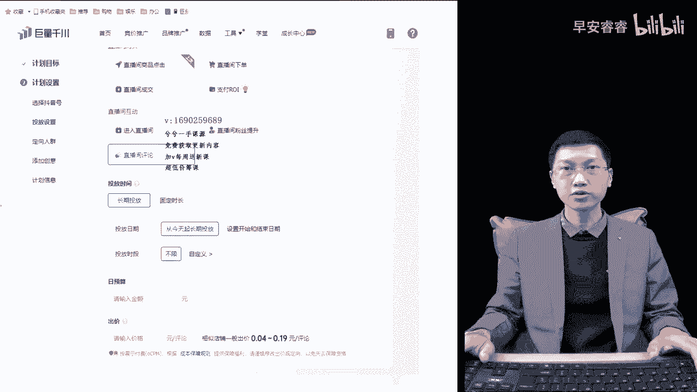

当中来啊，首先呢还是这样，就是为了照顾到所有的新手也好，老手也好，作为一个优化师，作为一个千川的投手，首先第一步，咱们首先要把整个的高产的计划页面给他，搭建的没有问题。

这样的话你后面查好用思路去控制去优化。

那么在高产计划这一个搭建的过程当中呢。

因为有很多新手相对来说呀，包括投的不多的几10万块钱的一些投手，那么对于人群的选择，出价的把控以及空本放量，在什么情况下该去投还是不是很清晰的，所以这一个高产页面的组合搭建呢，就用一个小时到左右的。

差不多一个小时左右的时间吧，基本能给大家全部讲完，特别是新手专家，一定要从头到尾地去听教练录的，每一个线上课呢，里面的内容也没有一个是水分的，我就平时怎么做的，怎么给大家去讲。

包括有些是涉及到底层逻辑呢，也是纯底层逻辑，就没有添油加醋在里边，所以说大家听完过后，基本的搭搭建的过程当中也就没有问题了，按照我里面去说，除了人群上面的覆盖量大小，会采用不同的方式去改变一下。

教给大家的所有的方法，六种人群的组合方法，包括三种两种的莱卡的组织啊，不对，那个达人的组合方法都是对的，你在实操过程当中就按照这样的情况去搭，包括在什么情况下去该怎么搭。

我也会在接下来的内容里面给大家去讲完。

那么首先进入到我们整个的高产页面当中，来头前让大家记住了啊。

在计划页面搭建的时候，其实就两条计划，一个是行为兴趣，一个是达人计划。

就这两个新计划，这两个计划你回答了以后，下面的所有的一些那个不管是稳投也好。

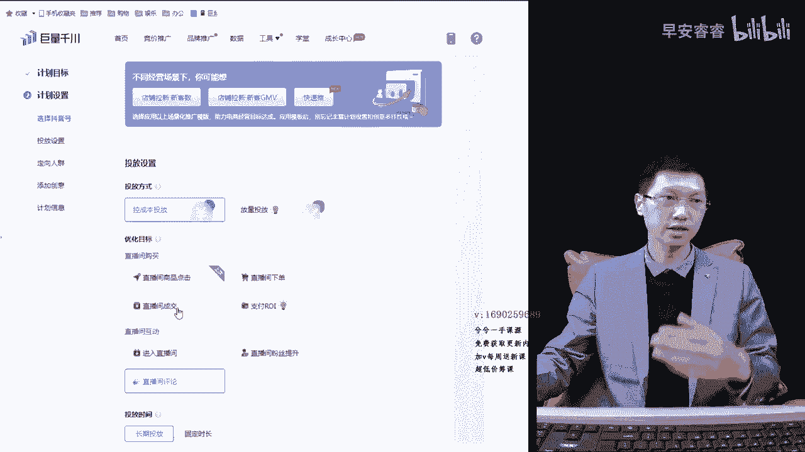

技术也好，它会变得很简单好吧，那么首先我们还是从最上面开始讲哈。

因为很多新手，大家对于整个页面搭建的，背后的底层逻辑是不懂的。

经常会出现上来过跑不动跑飞空跑，没有产出，不知道也不确定自己到底答的是对还是不对，所以呢我从最上面开始给大家去讲。

首先第一个大家听好了，空本跟放量这个问题，控成本跟放量呢一个是相当于手动出价，一个相当于自动出价，就是一个智能出价，一个手动出价，他之间手动出价的情况下呢。

他会跟我们转化成本，相对来说会有一点点的关系，但是大家记住了。

空本是你们真正的在刚开始跑量过程当中，投的最多的一种形式，你会发现你控本投的越多。

最后你会发现因为你没有一个稳定的出价嘛，所以你就会发现一个问题，投出来以后诶要么就跑飞，要么就跑不动对吧，所以呢接下来呢我告诉大家，在什么情况下投空本，空本的出价格怎么样去出。

其实控本跟出价这两个是联系在一起的，有了一个合格的一个出价。

稳定的出价过后，控本的投产相对来说还是比较稳的，那么等于新号刚开始起步的过程当中。

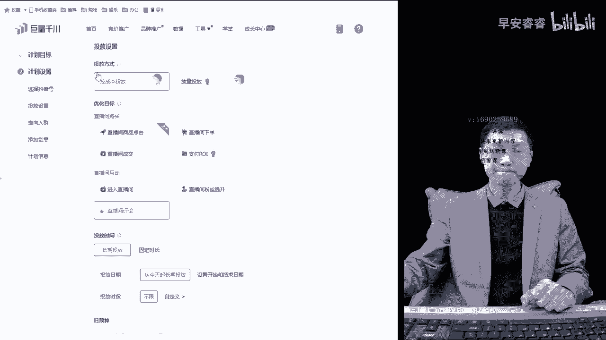

咱们在空本这个板块上面，你没有一个稳定出价，就会出现经常跑不动跑飞这种现象，所以大家记住了啊，控成本相当于手动出价，我愿意花多少钱来转化一单，是我愿意花多少钱来转化一单哈。

并不代表我就花多少钱来转化一单。

他是这么一个道理，我出十块钱，比如我客单价30，我出十块钱，那么正常情况下转化，如果你跑100块钱的情况下，如果你转化了两单，那你的转化成本就50，如果你转化十单，你的转化成本就十块，转化20单。

它的转化成本就五块，所以说它只是代表一个广告排名位的竞争。

的一个高低，并不代表我出多少钱，它最终的转化成本有多少，但是你跑稳了以后。

几乎差不多，出价跟转化成本之间关系差不多。

所以我在直播间经常给大家讲一个道理，就是用你的客单价除以你的保本的ROI。

那么你的出价出到什么范围之内，就是一个最高限。

如果你是把他压到越低了，你的利润空间就越大，就是这么一个道理，就客单价除以RO约等于除价。

就这么一个回事，那么控成本的情况下，我刚说了啊。

在很多情况下会出现跑非跑不动，就是要么出高了嘛，要么出低了嘛。

它就会出现跑非跑不动嘛，出高了自然会跑飞对吧，出低了自然会跑不动。

所以行走在刚搭建的过程当中，可以适当的去把出价上面，在空本采用空本的形式的时候稍微高出一点。

要不然他跑不动，如果出现跑飞了。

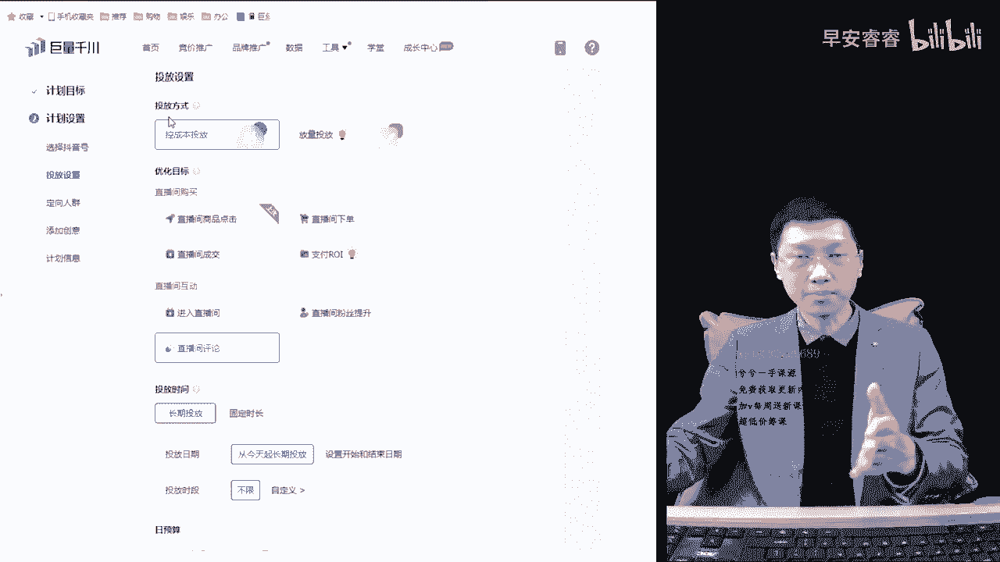

赶紧去降价就行了，我把这个板块留在上面出价里面去降，大家就记住，控成本是手动出价，相对而言的话，在账户成熟稳定或者相对来说的话。

想要去拔高投产账号稳定了，投的投产也很不错。

很稳定，你想要去拔高投产的时候，用控成本去投一些你主投的一些计划。

它的投产相对来说会比较高一些的，因为控本的话，相对来说它整个的流量流速是比较稳的嘛对吧。

你出个十块钱，他一分钟能进50个人。

你出个15块钱，一分钟进200人，那流速一快，转化不就变低吗。

所以说控成本是比较稳定的，一种出价的一个形式，那么第一种就是在账号成熟稳定过后。

想要拔高投产用空成本，第二种情况大家记住了。

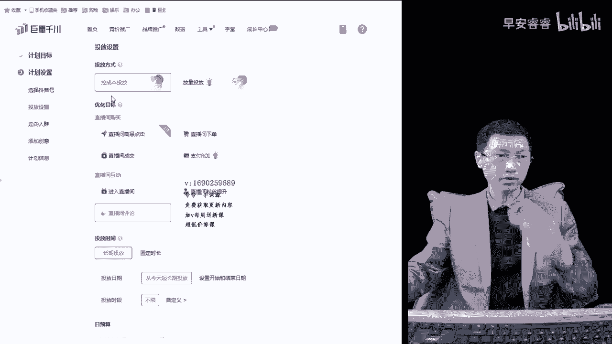

有些商家在人货场上面本来就不是特别足。

比如说主播能力还不怎么强，现在正在练播的过程当中。

或者刚播时间不长，你一去高出价或者一放量的时候，把它跑起来以后消耗快了。

他承接不了啊，所以他就没有转化呀，所以说我们这个时候呢在人货场不充足的时候。

为了用付费去拉一拉战线，稳一稳产出的话。

用控成本的形式是可以的，记住了啊，这三种情况大家记住了，因为我们主讲星号和这个视频哈。

就是更多的逻辑，其实新号老号其实在高产页面搭建的时候。

都是一样的，懂吗，你只要弄明白它背后的一个关键就行了，那么对于新手刚上来的时候，完全打放量，放量确实是可以投的。

我待会会讲放量这个板块，新手刚上来的时候，那么对于打标签的过程当中，新号刚开始流量越精准越好对吗，所以这个时候我们也可以用控成本。

因为手动的话它稳定出价，他能够控制它的一个消耗速度，让它慢慢走。

走的越慢，人群进来越精准嘛，所以信号打标签的过程当中，也可以以控成本为主，跑慢慢的来尝试给他流量进行稳一稳，这样不会太多的去浪费钱嘛，就这么回事，所以三种情况哈，一种是新号起步阶段。

第二种人货场不足的时候，第三种为了拔高投产的时候，用控成本。

空成本最关键的一个点在出价上面，等会我们讲出价的时候，然后讲完过后。

这三者里之间一联系，你就弄明白了，第二个放量，大家听好。

放量的话就是一句话可以讲完的，其实放量作为首啊，只等出价。

他会根据我大盘举个例子给大家听一下，你们不要去投一条两条，然后投产不好就吓得不敢投了哈。

没有关系的啊，放量其实是最稳的一种方式。

直播间我也经常给大家去讲对吧，就是19块钱的，29，39~59的。

190的这种客单价的直播间，当你出价，比如说按照190。

肯定是主卖品作为出价嘛对吧，你的出价出个50块钱，然后你这边前面卖的是19块钱。

29块钱，我告诉你啊，计划就特别容易跑飞，不是百分百，特别特别容易跑飞。

那么这个时候其实你投个放量，它是属于一个自动出价。

他会根据你直播间过的品，然后实时的去根据大盘这个类目去给你调价，那么它就不容易跑飞。

有的商家呢只是在刚开始上来给我投个一条，两条一下跑飞了，给吓到了，以后不敢出来，所以说大家记住了啊，放量出价是系统根据大盘实时去调整的，比如说我现在是200块钱客单对吧，卖的是一个摄像头。

那么他就会围绕在这个时段，卖摄像头的同价位的这些类目里边。

然后在计划之间相互去竞争，别人出一块对吧。

你出两块，那么你肯定能跑动，但是用放量的话，你看不到它出，那么他就会在一块的基础上去加1+1。

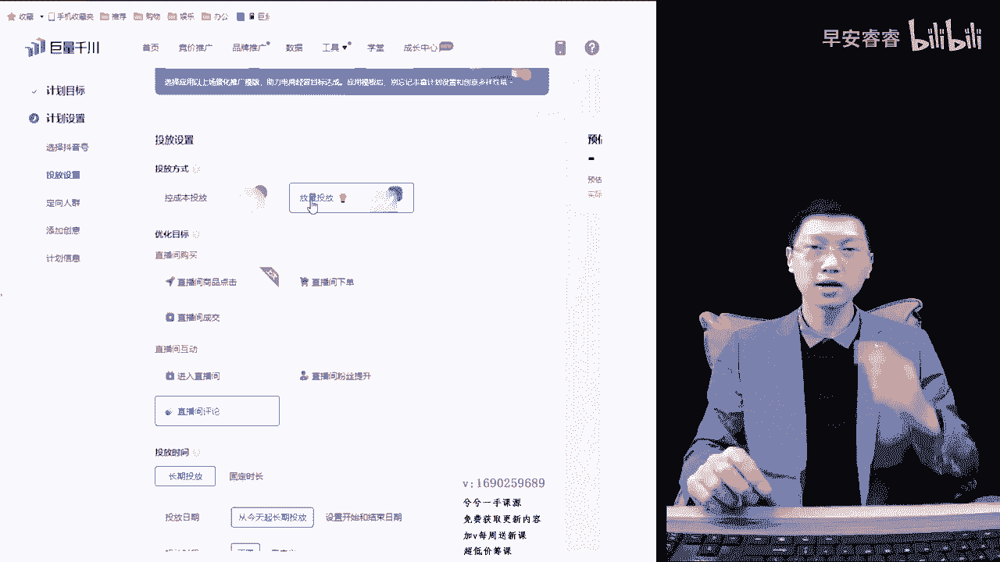

跑量优先嘛，所以说在投放量的时候，大家记住了，放量其实是比较稳的一种方式，账号一旦稳定了过后，那么以放量的形式跑是最合适。

然后还有一种就是在新号刚开始的时候啊。

空城本测不到出价，老是跑飞对吧，老是跑不动。

这个时候索性大家听好了，打一条放量计划，在上面选个长期投放或者固定时长。

选的长一点对吧，让它自动去找，所以呢放量出价其实是我们用的过程当中。

比较多的一种方式，放量是以拿量优先。

控成本是以成本优先，所以说风量一般建立在人货场比较充足的时候。

节假日的时候可以用放量去跑，因为它是跑量优先嘛。

直播间你会发现老空本的话跑不动，那么这个时候腿的放量给他自己去跑吧。

多打两条，它自然而然的会实时去调整，它能够去走动的。

所以说这样一说的话，大家是不是就明白了，空本跟放量在什么情况下再去使用，它背后的逻辑很简单。

空门是手动出价，决定广告曝光位的排名的高低。

放量是自动的，根据大盘，根据你客单价，根据你这个品同类目之间在同时段竞争。

自动的给你去实时去调整，所以它就跑量优先，它自动调的高。

它就能跑动嘛，那么几种用的方式也是刚刚给大家讲了，这么的话用了10分钟时间对吧。

把前面这两个就讲完了对吧，那么在六个优化目标里面简单的去讲一下嗯，有的人会讲浅层带动深沉，现在不多了，特别是22年或者21年的时候，讲一些什么浅程计划带动生成计划，它能不能带动呢，他也能带动。

因为是这样的，就是计划的消耗能跑动的计划，能带动跑不动的计划。

这是有这么个逻辑的，也有这么一种现象的，但是你投这些进入涨粉。

这些还有评论点击这些哈，他是没有产出的，你要明白。

那么你对于一个成熟的账号，比如说我卖的还可以对吧，我这个账号卖的可以。

我为了去增加一增加它的一个在线的情况下，那我这个时候投个商品点击对吧。

进入就别投了，兄弟们听好了，进入这个人群呐，就这个人群哈。

这个人群是很差很差很泛很泛的，你不管什么账号，再成熟的账号。

你投个进入就选行为，兴趣选达人，你把它选了200万。

100万，几10万再精准，他进来的人也是很烦的，所以这个优化目标。

在上面会给大家造成一种很多的干扰，你会形成哎我就不断的去投投投对吧。

然后为了直播间唉，他确实进人快，直播间你会发现一眨眼人上来了。

但是没有用，大家记住了，所以我们正常情况下我们就不投进入，包括粉丝提升。

如果你真的是为了去涨粉，我投这个优化目标，你记住，大家记住了。

投入粉丝提升的情况下，那么他的优化目标就是粉丝提升，涨粉就是你的终极答案，不要去看RY，因为你发出的目标就是涨粉，那么他是能涨粉的，如果有些账户相对来说粉丝比较少，你也可以去投一些对标达人对吧。

或者投一些行为兴趣去涨涨粉，但是听好了哦，跟进入是一样的，他的人群很泛很泛很泛不准的哈，怎么去选，他是不准的懂吗，那么评论也是一样，这几个目的都一样，直播间，我觉得如果大家想去为了去拉评论的情况下。

你还不如去S1些人进来呢，懂吗，市场上又不贵，那样的话你让他评论什么，他马上打什么，懂吗，你要是打个评论进来。

全是大拇指鲜花对吧，主播早上好，主播晚上好，主播辛苦不了。

全是这些东西没有意义，就是这几个优化目标你是等于花钱，这三个优化目标你是等于花钱，看着是进人的，这个人是没有用的。

他是没有转化的，所以说大家记住了，正常情况下，我们一般在开播的时候呢。

我们就以点击下单成交嘛对吧，点击下单成交ROR为主主，我这个账户用的是一个我投我自己直播间，这个账户上面没有ROI哈，正常户的话，你们有ROI，那这边是有的啊，检查放量上面没有了，所以大家听好了。

正常的是这四个优化目标，但商品点击这一个我也单独给大家去说一下，你们有的时候会发现从逻辑观点来讲的话，商品点击的人群他是比较准的嘞。

因为他属于电商行为嘛，比如说你投对标达人。

投小杨哥对吧，投个点击，然后到小杨哥直播间有过点击的人群，那么广告会往这部分人群去报，然后往这部分相似人群身上去扩展对吧。

点击它其实也是没有什么投产的，虽然这个课程呢是给大家讲一个高产计划。

界面搭建，有的时候我还是给大家带一点点，有时候我们实操里面的小技巧在里面，如果一个账户本来现在战线有个100人，200人的，为了去拉高一个转化，因为战线高转化必然高嘛对吧，为了去拉高转化的话。

我们是可以投点击，选个时间短一点，把出价出高一点，或者打个放量，一定要把时间选短一点，然后下面投达人也好，特别是点击投自己，如果你一场能卖10万20万的，有个几万粉丝的这些账号。

你投你自己，他的转化率还是可以的，知道吧，这种你们可能不敢投哈，没关系的，你的粉丝量只有几万一两万都可以投的，投自己投，点击投自己或者投对标达人，为了去扩一扩再验去用，这是可以的。

正常的话我们在投放过程中大家就记住了，因为我们投千春的目的。

大家听好了就下单成交，2O2这三个优化目标嘛，我们投钱赚的目的，大家记住的是干什么，不就是为了去赚钱吗对吗，所以说更多的还是要立马见效的，那么在投放这几个优化目标过程当中。

只有下单成交ROI这三个优化目标是直观的，能够卖到GMV的对吗，所以呢就是刚开始新号刚开始的过程当中，也别听别人说投成交跑不动跑不动，第一个跟口碑分有关系，第二个跟覆盖人群有关系，知道吗。

第三个跟你的出价有关系，这四个跟你的啊口碑分说过了啊，口碑分有了啊，就差不多，主要是这三种情况，一个是覆盖人群，二一个出价删一个口碑分，围绕着这几个点上，它是有一定的一个关系性的。

所以说跑不动是很好去解决掉的。

刚开始的时候呢，投成交，下单，成交ROR这三个优化目标简单说一下啊。

对于纯新手来说，听一下，对于老手来说，投过一些金额的人。

大家就不听了啊，大家听好了啊，呃下单的人群可能相对来说，比如说我直播间里边有100个下单的对吧，最终成交的可能是90个，下单到成交的转化率，差不多的90%嘛对吧，所以从这个逻辑来讲的情况下。

那么下单的人群是不是就多一些啊，成交的人群就少一些，那么在优化目标的选项上面。

你投的人群相对来说它越多，是不是量越大嘛。

覆盖量越大，它越容易跑动嘛，但是又代表另一个问题，他光下单没有成交。

它的精准度没有成交高，所以就才会出现有些人说信号刚开始的时候。

我们会跑不动呀对吗，我涂层胶跑不动呀，一是人群窄了。

二一个就出价，小人群高出价记住了，人群窄了，出价出高一点。

或者打个放量，这蓝量优先，它是能跑动的，所以往往是越是精准的人群。

相对来说它转化率越高，对不对，所以刚开始我们是可以投成交的哈。

就投成交就行了，主播能力或者相对的产品比较爆的。

投下单也行懂吗，这两个如果抢的情况投下单也行，把他联合到一起，如果正常直播间上来就投成交，或者还有一种成交跟下单。

我我我感觉你们应该能听懂我说的啊。

没有任何水分哈，这纯底层的哈，OR的话是这样的。

这里面单独给大家去说一下RI优化目标，一般新号不投，如果是新千川户老抖音号，一场卖个几万块钱呢对吧，这种是可以投的，这种是可以上来就投ROI的，那么RO投，因为你本身直播间的成交人群已经很多了。

他是有参考依据的嘛，这样的话是可以去投的。

那么在投放的过程当中大家听好了，在投放的过程当中给大家一个就是建议。

大家听好了呃，ROI优化目标不是间接式底层逻辑，ROI优化目标是建立在成交人群基础之上。

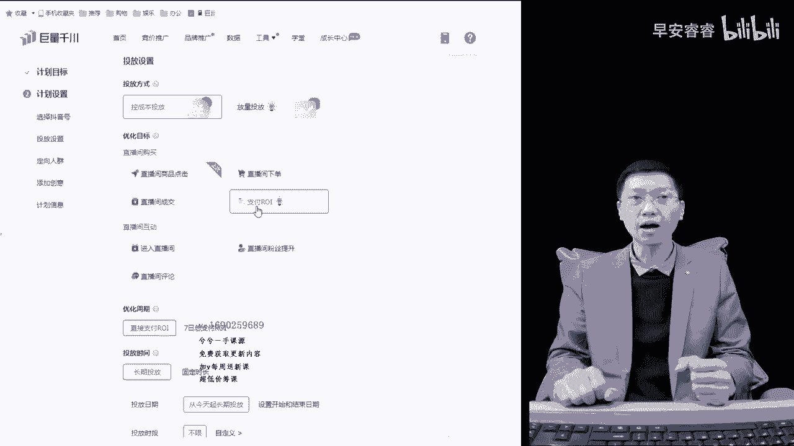

抓取符合你设定的ROI的值的人群。

懂吗，在成交人群之上抓取符合完成的GMV人群的人。

那么比如说我直播间成交个500单对吧。

成交画像是比如说是临时百货对吧。

临时百货的成交画像，那我这个时候比如说有500个人，那么这个时候我去投2O2。

把他目标值设定在十以上，你正常投个五嘛对吧，现在设定到十以上。

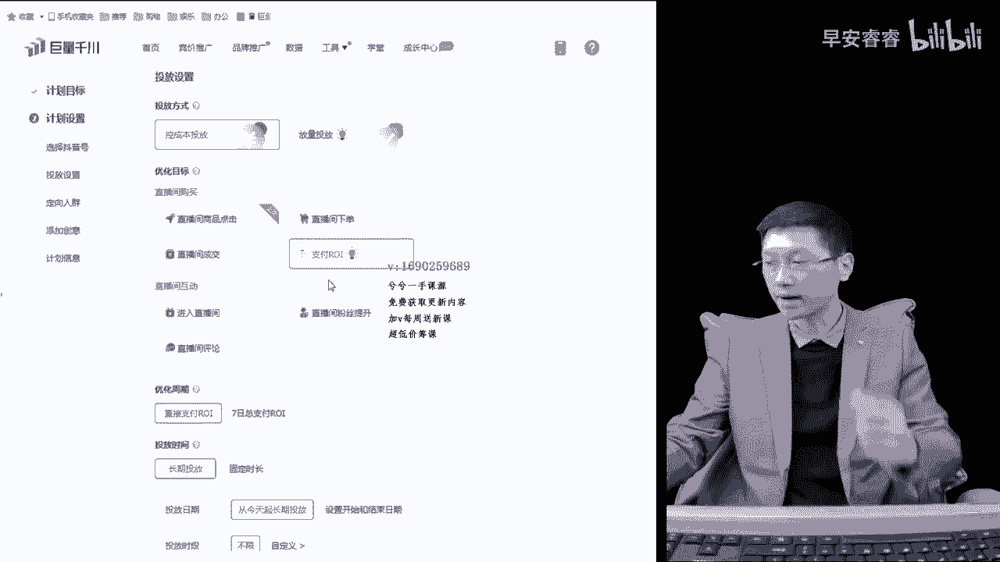

那么就会出现一个现象啊，喏我本身呢跑的是五左右。

我在这部分人群里边抓取，符合完成你质押目位设定的ROR设定的人群。

那么他就会在这个人群里面继续往上面去抓嘛，对吧，继续往上面抓。

所以这个人群就会显得很小嘛，我正常跑都跑在五线，那你告诉我我要跑十。

那对于一个抓取的过程当中，他在人群抓取上，是不是就会变得很大的一个障碍点。

抓不到嘛对吧，所以就出现高了，跑不动懂吗。

所以你投二二的时候跑不动，就是设高了，2V2跟出价是相反的。

如果你这个时候高的情况下，你是正常跑五的话，你设定个十它跑不动，那你往回调嘛对吧。

可能是十跑不动，设八也跑不动啊，你正常跑五的话是六七。

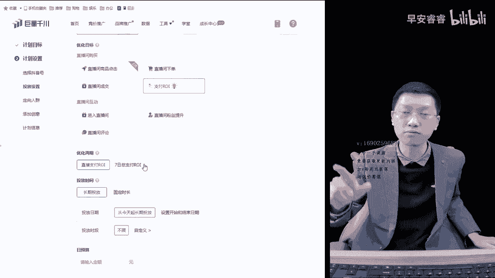

有可能会跑动，有可能会慢慢跑，你要给他调到四了以后，他肯定就能跑动了对吧。

如果调到四了以后，一下子跑掉很多钱对吧，那就说明设低了嘛。

太好抓了嘛，人群太宽了嘛，能明白吗，所以OO这个优化目标一般建立在账户成熟以后。

或者相对来说抖音号很成熟了。

这个时候来设定ROI目标，刚开始的时候记住了，大家听好了，怎么去设定这个目标。

规划目标哈，一般情况下就参考你成交的。

我这个千窗户跑了10万块钱呢，跑了2万块钱呢，我之前跑的成交计划2O25。

那这个时候参照这个优化目标，降了20%，懂吗，降个四呀。

4。5呀，他是能给他跑起来，一跑起来过后慢慢的再往上面去加。

是这么一个过程，OK懂了吧，所以我讲的可能说通俗易懂，大家记住了啊。

没有那么多玄的东西在里边，就是听完了，大家记住了，这也就是一个终点答案了。

就是这么回事，广告付费广告的投放方式并没有那么复杂。

懂吗，复杂的是我们把它弄复杂了，实际它不复杂的，OK好了吧。

那么这就完成了额下面的投放时长，这个板块大家听好了。

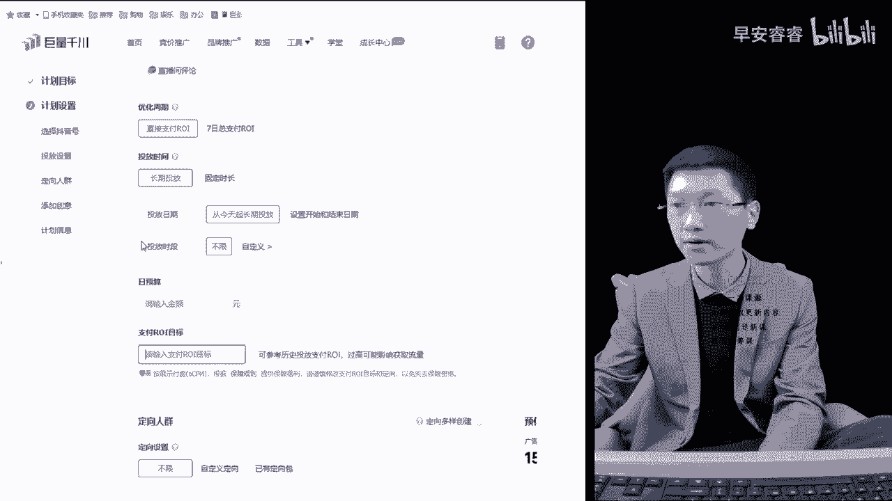

你看我讲的可能会时间会长一点啊，这两个点讲完18分钟了，那差不多18分钟了。

我们讲到个半小时左右，然后我们就再换一个视频给大家休息休息。

是这样的，在投放时长上面，这里边首先第一个长期投放对吗。

长期投放是固定时长嗯，很好理解，第一个我更多的建议大家新号刚开始的时候投。

长期投放，为什么啊，因为很多新号上来刚投的过程当中。

我们投手也不是很成熟，当你去投固定时长的时候。

那么相对而言的话，这个计划今天投完了，因为大家看一下哈。

那固定时长呢最多也就24个小时，对不对啊，当你今天过完了。

明天这个计划就不能再用了，重新复活复活的计划一般都不是特别好。

咱们都有这种就是经验的，那么一般为什么建议大家刚开始上来去投，长期投放呢。

长期投放他能够去持续去跑对吧，长期的话能够持续去跑一个长时间。

而我们在青川的每一条计划，大家听好了。

每一条计划里边有学习机对吧，哎搞错了。

学习学习吃对吧。

找一下学习吃，然后是放量吃，放量期。

然后的话是一个衰退期。

衰退期看一下哈，它一共有这三个阶段，每一个计划它一共有这三个阶段。

那么学习机的情况下是三天出20单。

这一条计划诶，他就过学习期了，过了学习期是什么意思啊，其实也就是在他出了这20单里边。

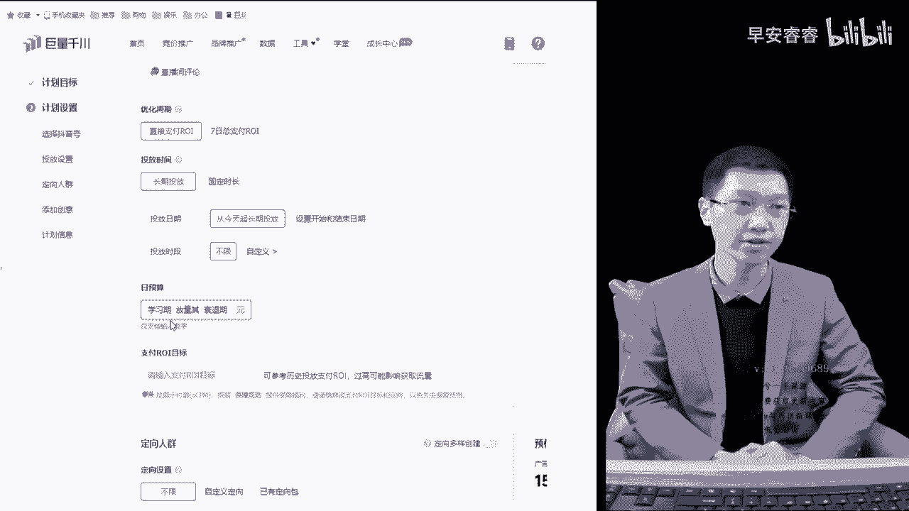

他会围绕着20单的转化人群的观看行为。

购买动作标签给你，继续往这一类人群方面往外面去扩。

就所谓的放量期嘛，所以说真正的计划是过了学习期以后。

相对来说才有更好的跑量空间，以及人群质量会更加精准一些。

那么我们就要满足这三天的时间，对不对，所以当你去选择固定时长的时候。

当天结束当天结束，那么就会出现很多计划，都是在一个新探索的过程中。

第二天就要重建，又是从头开始探索，探索不到又开始弹重新探索。

那么就会造成它越探索不到，你消耗的潜力的转化成本是不是就越来越高。

对吧，那刚开始出价30块钱，然后跑了2000块钱，没转化好，转化成本是80。

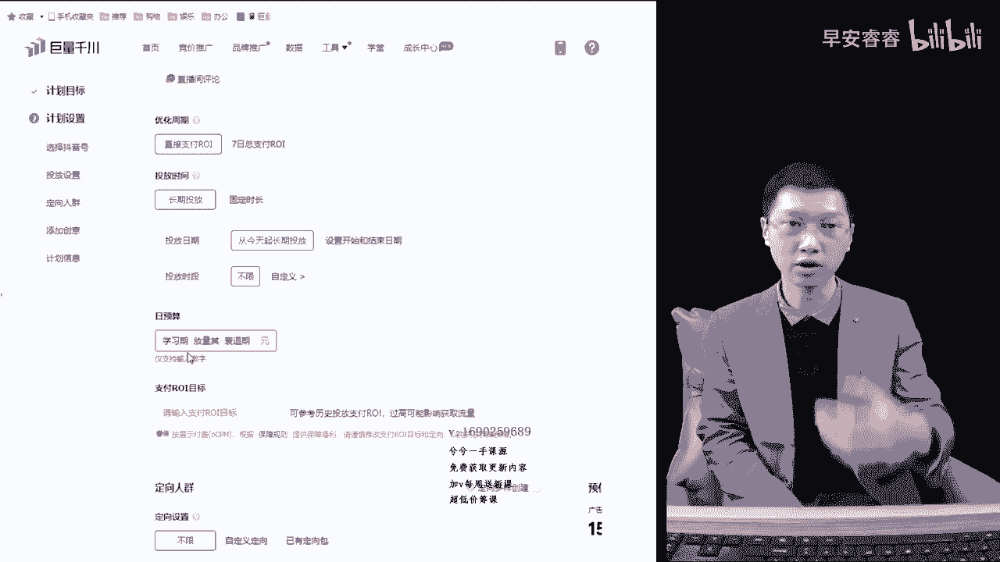

明天见指出价有可能就五十六十七十，不断往上面就涨，对不对。

所以很多商家会出现诶，我的转化成本在不断的去上升，就是这么一个情况。

大部分计划没有过学习期，没有找到精准人群，造成转化成本上升，出价就跟着不断的就往上面涨。

要不然就跑不动，所以呢我给大家呢刚开始用长期投放。

是想告诉大家给足够的时间让计划去探索人群。

能明白吗，用长期投放，它不影响你整个计划的消耗，大家记住了啊。

因为消耗是由出价去决定的，是由转化这个东西去决定的吗。

OK那么这里边就解决这个长期投放固定时长，那就听好了。

这就简单了，固定时长就是我这条广告选个两小时对吧，那么这条广告有可能在两小时之内。

马上就烧完了，有可能在两小时之这个过程当中。

它本身没有探索到精准人群的情况，他烧的很慢。

然后他烧不完，然后再继续往前烧，这个很正常，但是有的时候我们为了去拉一个在线。

大家听好了啊，为了去拉一个在线的时候，我们会把时间设的很短。

比如说拉一个0。5小时，一小时的，我预算5000块钱对吧。

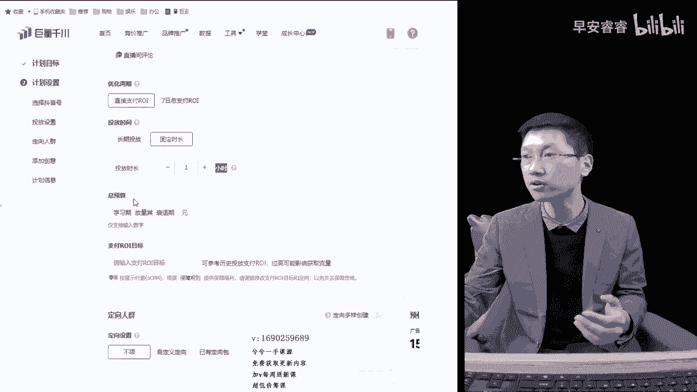

那我打个一小时的，我整个的预算的情况下，我预算给那这里边我就赚个1000块钱对吧。

一个小时。

那跟我选三个小时，跟我选五个小时，从逻辑来讲，它的跑量节奏是不一样的。

但是大家听好了，我这里边录的这个课程，给到大家的是纯干货型的。

记住了，直播间讲的也是一样的节奏，这样的情况下它会出现一个问题。

听好了，就是有的时候他能跑的贼快，有的时候跑的贼慢。

那还是要根据直播间的转化时长跟预算出价。

确实会能控制这三个点，能控制住计划消耗的速度。

也就是你们所说的控流数，但是真正的关键点大家听好了，真正的关键点还是要靠转化。

我1000块钱一个小时，跟1000块钱十个小时的消耗截然是不一样的。

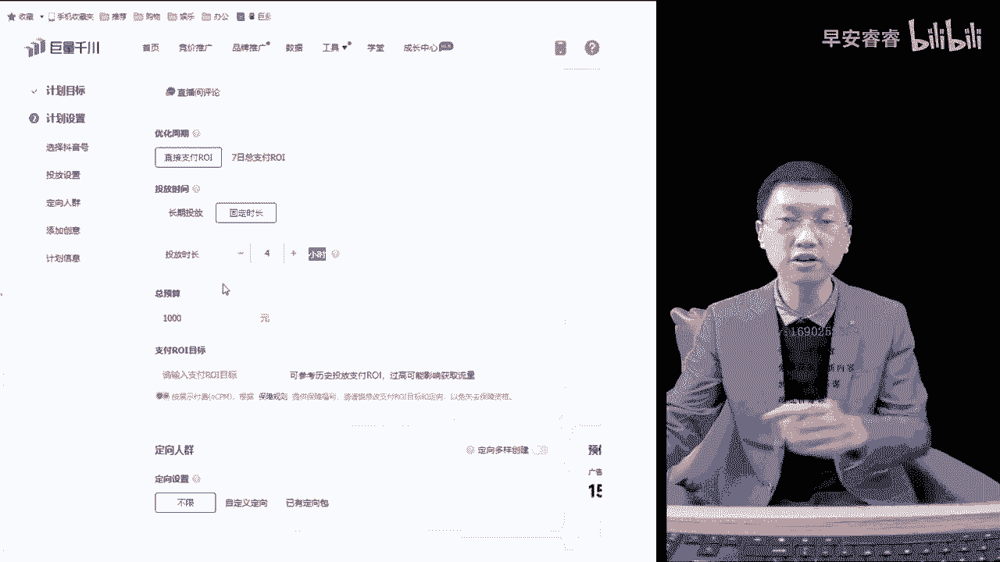

但是还要靠它转化，如果转化好的话。

1000块钱有可能一个小时之内也跑飞了，半小时就跑完了，有可能十个小时还没跑动。

消耗30块钱都是正常现象，知道吗，所以大家一定要明白这一个关键点呃。

一般的成熟的账号，你看他一场能卖几10万块钱。

那些账号其实上来过后，他们就可以完全用就是固定时长去跑嘛对吧。

设定个几个小时就跑一下，因为他一会就过学习期了。

成熟的账号它的转化很快的，他一会有可能半小时，20分钟，一个小时它就转化出20弹出来。

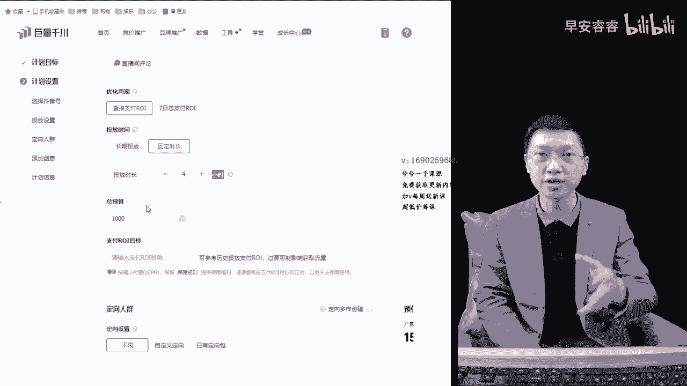

他就过学习机了，所以这个板块里边其实就是长期投放，跟固定时长。

长期投放更多地给到计划充分的探索时间，而且稳定的账户的话。

不是每天都建计划的，老计划还要用嘛对吧，所以有的时候一条计划用个五天，八天的都很正常的。

选长期投放，那么固定时长的情况下，账号稳定对吧。

选固定时长，然后用短时间去拉一拉，用时时长。

用短时间去决定它流速的快慢，这个就很简单了哈，如果需要快速补量的时候。

可以去设定个0。5小时啊，一小时啊，大调计划让它充分的去跑。

飞起来嘛就行了，所以这里看这一个点，这两个点给大家一讲。

20多分钟讲完了，对于成熟的投手来说，浪费了20多分钟时间。

那对于普通投手来说，或者对于新手来说，瞬间是不是就明白了对吗。

就没有任何的玄学在里边，呃下面再往下面走哈。

啧日预算大家听好了啊，我们投成交，选个成交，我们选长期投放日预算大家记住了。

刚开始这里边就没什么过多好讲的。

给大家大家听好了，预算能决定计划的跑量，我一条计划300的预算跟后面的听好了。

跟3000的预算它是不一样的，懂吗，预算的大小最起码高速系统。

我这条计划是给多少钱嘛，你给他消耗嘛对吧。

你给300块钱就出去转一圈，给我买些东西看着买对吧，你就说给3万块钱说出去给我消耗一消耗。

看着买，那截然它是不一样的嘛对吧，所以预算对于一个整体计划来说。

跑量是有影响的哈，记住了啊，他有影响的。

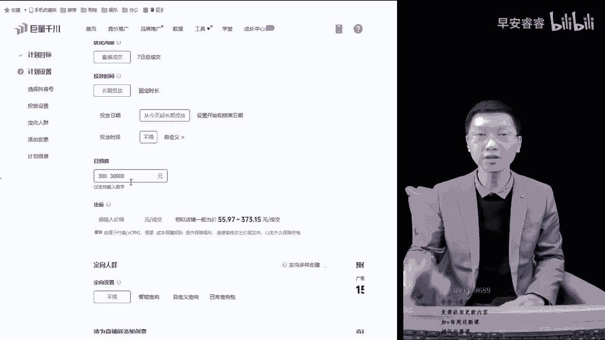

不过新手商家刚刚开始的话，给大家一个建议啊，三百五百吧对吧，就三百五百这样的形式就够了。

别太多太多了，就是因为你没跑稳嘛，没跑稳。

给的太多了以后，账户里面钱有可能一旦跑起来过，把你刨没了，给三五百的预算，然后呢慢慢去探索，慢慢去撤，如果消耗转化还不错，这个中间我们来加不就行了嘛对吧。

这是一个预算，那么这里面比较简单，大家听好了。

预算比较简单，但是还有一个概念告诉大家，实际预算呢，比如说这个间接出价是55对吧。

我们出56吧，五十六五十六。88对吧。

我们除56。88，实际在预算这个板块里边呢应该是这样的。

就是有一个逻辑，三天20单过学习期对吗。

一定要给到，比如说1300块钱对吧，1100块钱，1200块钱给到计划20单的出价的。

就是我愿意花56块钱转换一单。

那么我20单三天过学习期，就是我愿意把这个预算放进去，让他充分的度过学习期。

但是这样的话就预算就偏高了，容易跑飞，但是你要明白这个逻辑。

如果出的按照讲大道理来讲的话，这个时候我们出300，那这个时候他跑不跑。

他是跑的，但是你要是有人跟你去较真，讲大道理的话。

那么你300块钱都不够这一条计划的，度过学习期的这条计划肯定跑不动。

他说的这个道理也对，但实操环节当中跟道理是有一定区别的，懂吗。

所以记住了啊，谁要跟你去抬杠的话，问你这个预算设置多少比较合适，你说给到出价的20倍，让他充分的去告诉系统，能够让他过学习期对吧。

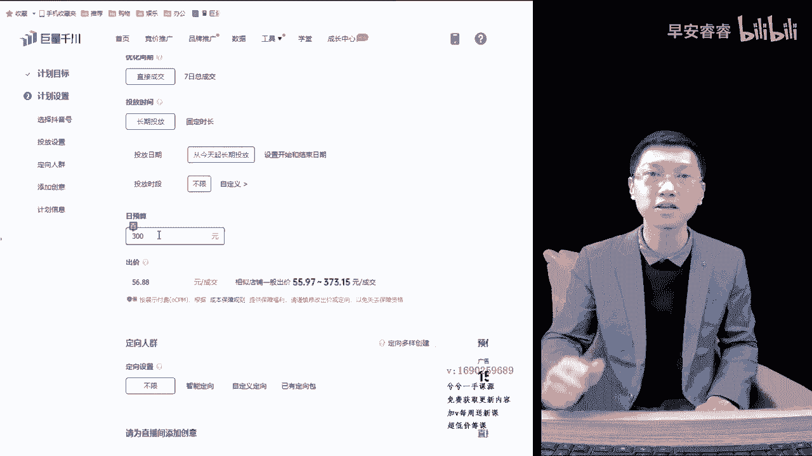

给到充足的计划，让他跑量了，就这么回事，呃，接下来下一个环节。

那么26分钟了，我们下一个环节的话，到下一个视频再录吧。

我每个视频给大家录半个小时时间，让大家看完过后正好休息休息，好吧。

嗯我们进入下一个环节。

