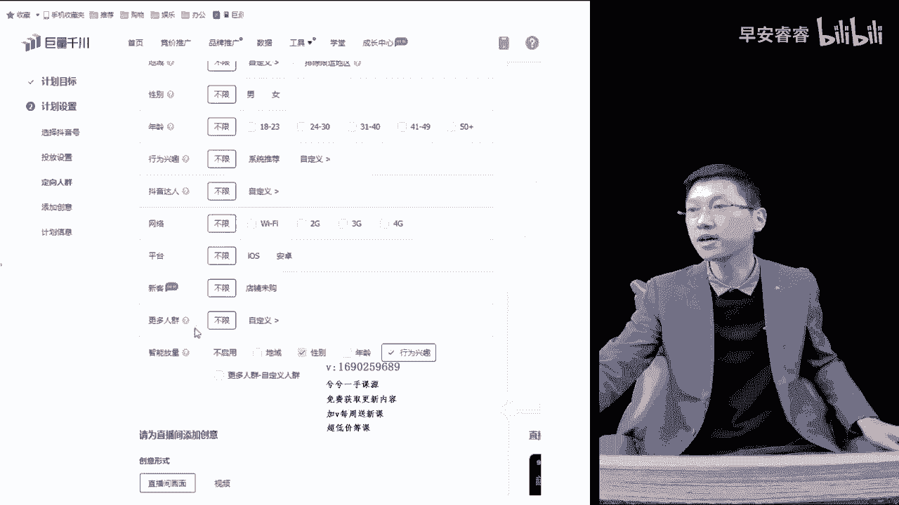
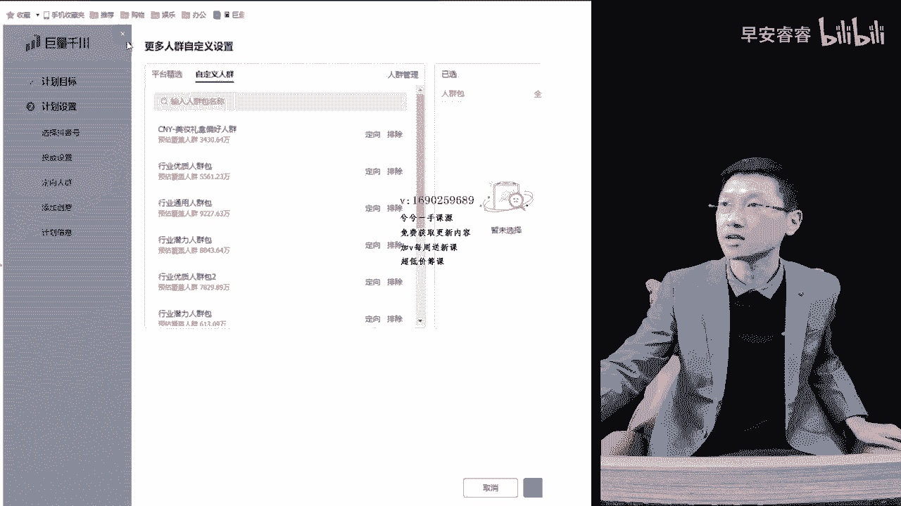
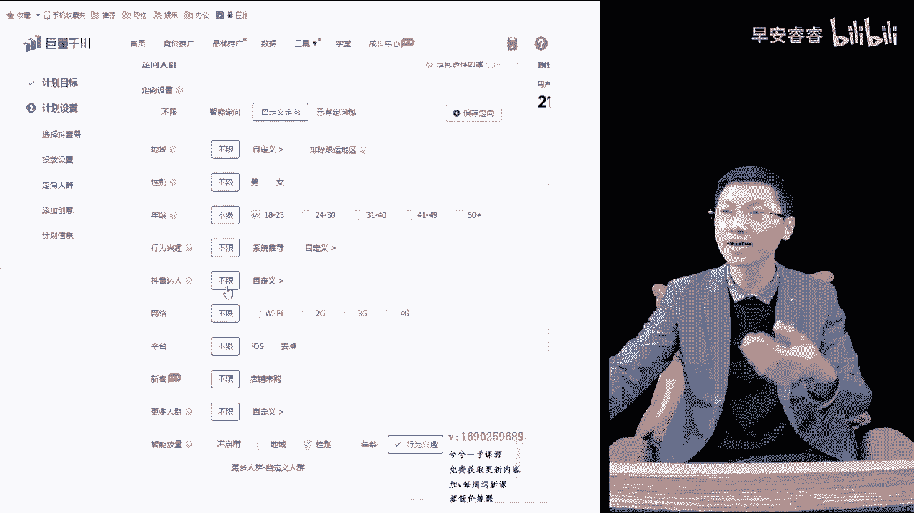
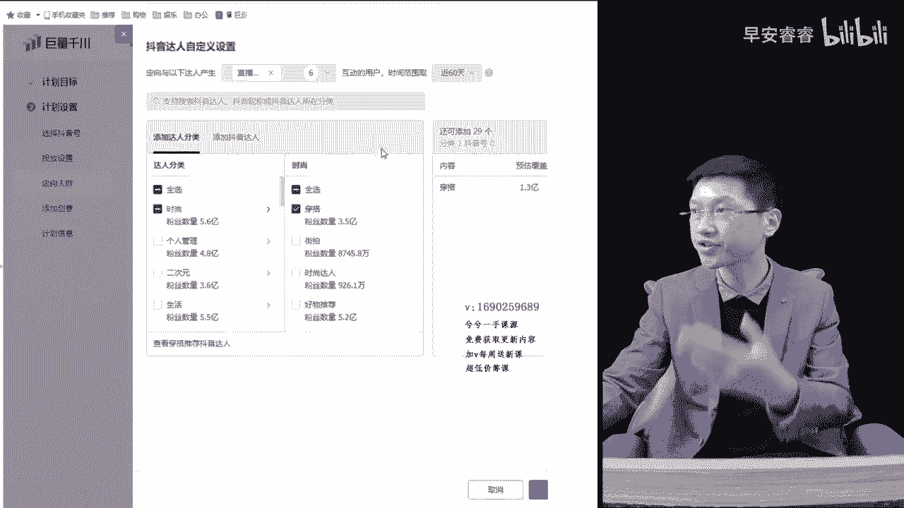
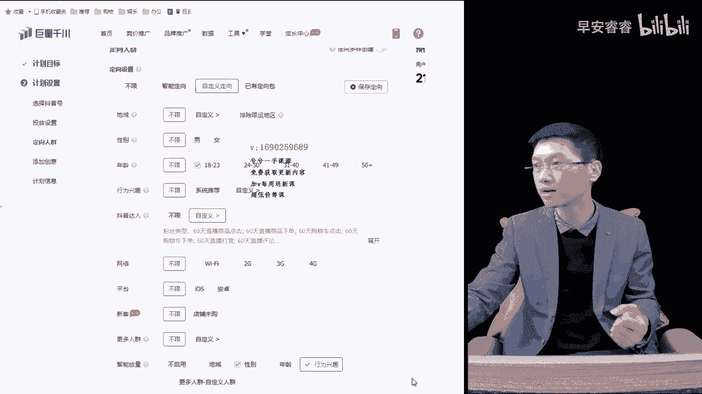
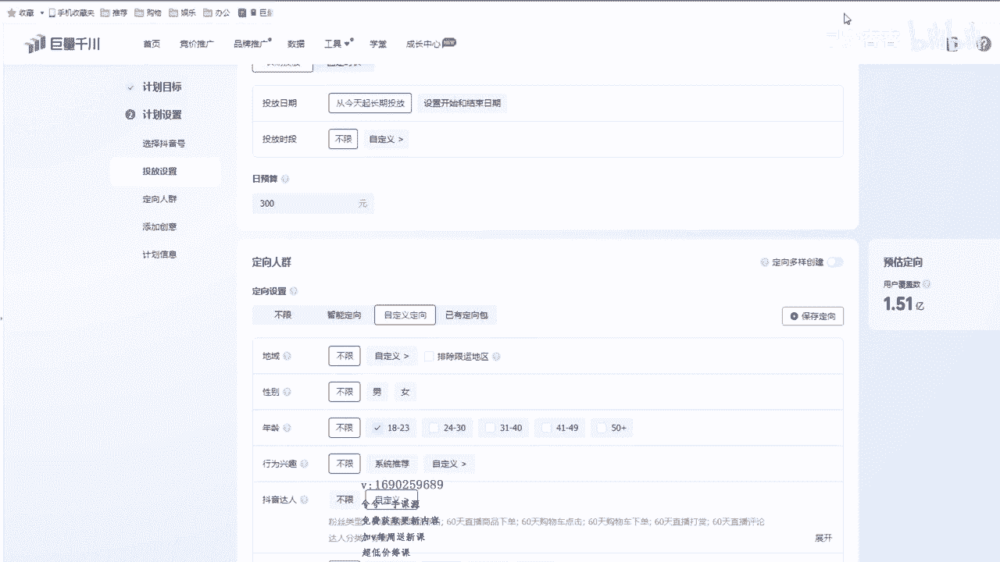
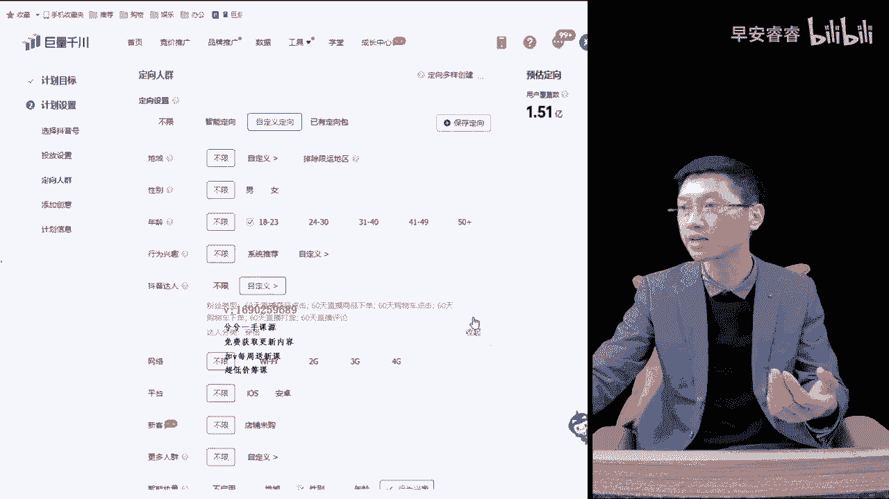
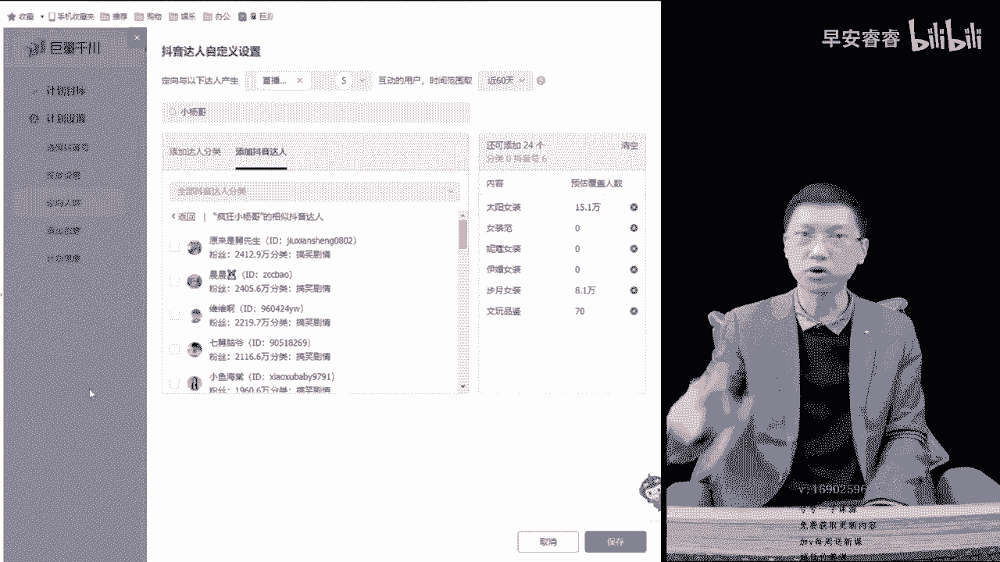

# 067 抖音电商直播投流起号课程 巨量千川全流程投放+小店随心推全流程+起号方式 - P3：3、达人多种组合创建- - 早安睿睿 - BV1Nn4y197Wg

上一个章节给大家讲完了，前面这一小点点内容对吧，不多对吧，讲了差不多20多分钟的时间，这个章节的话，接下来我们接着接着往下面讲哈，出价里边呢大家记住了，是最大的一个玄学，你会发现有人讲一两个小时出价。

听好了，出价其实是一个简单的道理，出价代表什么，出价在实操过程当中呢，确实跟我们的转化成本之间是有一定关系的，出的越高，那么相对来说的话，他跑的就越快，它的转化成本就越啊，转化成本就越高，投产就越差嘛。

就这么回事嘛，所以我讲了一个哈，就是用我们的客单价除以我们的一个，约等于ROR多少，它就约等于出价，大概率是这么一个情况，所以你从这个公式里面去套，你是不是你出价，比如说100出价20。

ROR就等于五对吗，你出价啊，比如说50的R啊，怎么也不可能跑到五的，差不多就是R3这样的，来回之间一点几来回徘徊了，这是一个实操里面得出了一个结论，并不代表一个纯官方底层逻辑哈。

所以除教里面大家记住了啊，本质上出价就是广告位排名的高与低对吗，你出一块，他出两块，他出三块，你再出个四块，你就排在前面，排在前面以后曝光率大，那么优先就强亮，所以它消耗速度就快，就这么一个道理懂吗。

因为他排的高嘛，所以他消耗速度必然快，看到人多嘛，他是按照牵制曝光展示收费的嘛对吧，所以说你把它出得越高，它爬得越高，那么这种曝光机会就越大，那么牵制展现金额就越高嘛，而不是牵制展现金额越高。

那他按照清展收费的，你展示的越多，他收费就越多嘛，就这么一回事懂吗，出价其实并不代表转化成本，但是出价它会决定你计划排名高低的一个情况，会造成跑快跑不动，所以呢大家很多的时候，特别是新手上来过后诶。

我出价抓不准对吧，要么跑飞了，要么跑不动，有的聪明一点的呢，还能知道是出价的问题，有的呢相对而言呢刚投逻辑也不清晰，那么会感觉是自己投放的一个问题，所以说跑动跑不动，要么就口碑分对吧，要么就违规。

要么就出价，要么就是我们整个人群覆盖太窄，这几种问题给造成的，所以如果人群覆盖很小，你比如说我覆盖个几百万人群，投个成交，那这个时候你出价肯定出不动对吧，低了肯定跑不动。

肯定要高出平时出十块钱能跑动的2000万，3000万，5000万，8000万，人群十块钱能跑动，你现在变成了300万，这出价不出到十五二十，他肯定不动懂吗，所以说人群的大小。

也会影响出价的一个多少的一个问题，那么在出价板块里边是这样，大家听好了，啥事，先，等一会我录课呢，那么出价板块呢大家听好了，是这样的，就是几种方式，大家听好了，第一种方式大家应该听过叫高开低走的哪里。

毛利利润的百分百也行，80%也行，70%也行，你比如说我去后面借，指出价是55块钱，56块钱对吗，那么我毛利润的话是比如说300，我高客单呢，我毛利润300，我肯定是参考这种间接出价形式。

那么正常高客单一般的毛利润高的很高的情况，就采用间接出价这种形式去出，或者相对来说客单不高的对吧，那么你就采用正常一种情况，第一种方法就是用毛利润的70%也好，80也好，90也好，100也好。

你可以建两到三条一模一样的计划，在出价这个板块里边，比如说我们这一条计划打的是那个控成本的，成交对吗，上面都选项都选好了，到了出价这个环节里边，你稍微变动一下，一个是一块对吧，一块不好了，个56对吧。

一个56对吧，那一个62对吧，再来一个直接点的，再来一个52的行不行，这样我不就三条计划了吗，同时让他去跑，看一下到底什么样的出价诶，能够去合适，这是第一种方式，哪一个跑得比较稳对吧，哪一个能跑动。

或者哪一个人跑不动，如果说是你的转化成本比较高，本身店铺的整体转化高，那么这种阶梯形式三块五块八块对吧，八块的跑动了，比如说我们现在62跑动了对吧，这个62跑动了，下面两个不跑。

那么基本也就说明这个56，52是不是DJ了嘛，那么我们接下来的计划就围绕着62之间，来回去周旋对吧，先出62左右，或者嫌他慢的话，再高一点，或者跑得快的话再往下降一点，慢慢慢慢就找到这种值就行了。

这是第一种方法，用我们整个的毛利润去出啊，七十八十九十一百，或者上来就高开百分百对吧都行，你只要不怕跑飞，反正预算你给他设定个300块钱，500块钱小预算就行了，那么这个解决了以后，这是一种方法。

第二种方法大家听好了，第二种方法呢其实呢就拿这里边的原有的数据，拿这里面原有的一个数据对吧，这个我刚才说的阶级出价对吧，就是第一个刚刚是拿这种50啊，55啊，62呀，52呀。

是给大家去讲只毛利润的百分百嘛对吧，或者八十七十九十%这样形式，第四第二种情况大家听好了，就拿这个数据去行动啊，55块钱作为一个哎最低的间隙，出价出个55对吧，然后上面哎我这加。

就像我刚刚给大家去演示加的对吧，62的或者63的对吧，63。99对吧，或者后面再加一个对吧，50一点对吧，14也行对吧，都可以的懂吗，这也是采用建议出价这一个数据做阶梯形式。

跟刚刚那一种就是毛利润的七十八十九，是道理一样，只是这里边一个是参考毛利润的数据，去阶梯形式，123去出的，一个是采用一个间接出价作为那个参考形式，低一点诶，高一点，加上本身的阶级出价，三个支出的。

我相信我这么一讲，他就讲完了，看实际转化以及实际跑量，再决定它调整还是降加高还是降低，这就是第二种方法，第三种方法大家听好了，这种方法相对来说的话，会比较把他压到一个极限值的，就是保本值。

第三种是加一个保本值的一个出价，就相对于而言的情况下也不能叫保本值吧，就是用间接出价，因为它存在着这么一个道理，我不给大家讲了嘛，客单价对吧，我用我们客单价除以我们的一个ROI，它就约等于出价。

你比如说我宝马ROY现在是三，对不对，我宝马ROR是三，那么我的一个整体的话，我的听好了，我的客单价是100对吧，我的薄本ROR是三，那宝马23，那我基本呢，我的出价就把他压到一个极限值了嘛对吧。

就是比如说33嘛，约等于33嘛对吧，就在这个周边来回出，那么大概率它会出现这样的一个数据，大概率哈不是百分百的哈，这个是大概率从实操里面得出来的一个结论，这种就把他压到一个极限值。

我上来一跑就保证他不亏钱对吧，那我已经保本二二十三了，那我出价出到33左右上下浮动，只要他能跑到这个三，那我就不亏，那也就代表我这个出价，基本是我的一个保本值了嘛，对不对呀，他是这么一个回事。

那么当我去出的越高就高于这个数据了，就面临我亏钱了，低于这个数据了，就面临赚钱了，不就这么回事吗，所以说这是第三种出价方式，这种出价方式一般人家不会去给你讲啊，新号刚开始以这样的情况很难跑动。

说实话偏低了，因为新号有的时候上来刚跑就会跑，亏本嘛，或探索过程当中呃，人群不精准，转化成本会偏高嘛，随着探索的量越来越大，转化会越来越低，所以刚开始清号的时候，采用这种方法，有可能会跑不动。

而老号听好了，还是一场能卖几万块钱，老号这种号他已经画像很精准了，用这种形式出，我告诉你啊，基本都算是出高了，基本都出高了，我跟你说，他要是一个成熟老号的，这一场能卖几万块钱的。

我投的时候还按照保本的形式，他还能投出一个保本出来，那必然是不对的嘛，对不对呀，所以说这种都算是高了，但是你们要明白这样的一个逻辑，哎知道这几种方式大概是这样的，第三种呢对吧，我告诉你啊。

第四种也是最简单的啊，放量，呐投入放量，这条计划投个放量，没有出价的预算，一出三满500对吧，那三把500的一出对吧，刚刚放量，我给大家去讲了，啥叫放量对吧，给个预算，他自个去调，自个去跑，跑个几天。

跑个两到三天，或者你跑的金额高，转化比较好的，当场也能测出来啊，你跑的金额高的话，一场连消耗个一条街，要消耗大几百上千块钱的时候，你当场就能测出来他的转化成本是多少，但是它不是具有确定的参考性。

当场为什么有可能转化很好呀，这条这条计划巧了对吧，它转化成本就很低呀，那么这个时候我200块钱客单，我出35块钱，最终我的转化成本，比如说一下子诶转化了十单，我的转化成本只有20块钱，对不对。

那这个时候出20块钱，它不一定能跑动当场嘛，但是你连续跑个两三天，用放量的形式跑一个综合数据，数据大一点，有参考性，数据小一点，没有参考性，就这么问题吗，这不就找到出价了吗，OK懂吗，除家驹这几种方式。

你只要听完我的逻辑以后，我直播间里边讲的，包括系这里边视频给大家录的是不录水课的，也不讲，为什么那么多大道理该讲的时候，我就给大家去讲了，不该讲的我也不去添油加醋的，给他展现那么多。

跟实操一点关系都没有懂吗，所以你会发现我讲出价，最后你会发现你一总结一分钟都没要对吗，这几句话讲完了，就这几种方式，懂了吧，OK这就是一个出价，大家听好了啊，成熟的账号出价会出很低哈。

而且人群覆盖量刚刚也说了，人群覆盖量大的出价能变低，人群覆盖量小了以后，竞争空间太强了，展现不到人呐，只有高出价，高出价代表广告位排位比较高嘛，爬的越高的情况下。

他才能够在这里面形成一个优先抢量的作用嘛，所以说你看一下就听明白了，OK呃出教完了以后，就是所有的，接下来的话就是定向了嘛，行为兴趣达人对吧，行为兴趣达人，这个出价你看我也讲了10分钟。

正好录了10分钟，都是一些逻辑概念，其实就那几种方式，你们自己去参考，那对于一个新号来说，我到底用空成本还是用放量呢，还是用到这里说的毛利润拉满呢，还是相对来说，用这种极限值压到这种情况下去出呢挺好。

接着出价出呢，其实啊嗯根据实际情况综合，你完全以控成本的形式跑，他不一定能跑得动对吗，出价虽然是按照高开出来，但也不一定跑得动吗，有可能我现在的利润是四十四十%块钱，100块钱客单价我出到四十四十二的。

他跑不动，那你完全就空本直播间不就没有人吗，他跑不动吗，对不对，所以说你也可以中和一些放量的结合一结合跑，你比如说像我直播间给大家讲信号，投放四个放量的两个专业的，那只是面向大众的一种方式。

真正的信号投放的时候不是那样组合的，我会给大家去讲的懂吗，我会给大家去讲的，那里边要用放量，不就主要是先拿量嘛，对不对，然后空本的话为了就带出价的嘛，就这么个情况吗，OK明白了吧。

下面的人群选择里边呢就要多讲一些了，这里边内容多了啊，这里边定向里边内容多，下面其实除了定向，这里面选完，这下面其他就变得比较简单了，懂吗，那这里边定向这么多对吧，先提前告诉大家哈。

先把嗯就是简单的算了吧，还是按照流程讲吧，先把简或者先把简单的说了吧，智能放量这一个听好了，到底选还是不选，新号开始的时候到底选不选智能放量，告诉你啊，刚开始在新计划刚开始的时候，在测计划的过程当中。

或者新号刚启动的时候，先不选智能放量，比如说放个那个行为兴趣对吧，我是一个卖食品的，卖水果的，那么当你把智能放量给点开以后，那么如果你现在探索的人群，比如说我已经卖800单的这条计划卖500单的。

那么探索到的是女装跟美妆这两个人群，啃买水果对吧，那你其实额这叫行为吗，女装跟美妆叫行为嘛，肯买水果嘛对吧，他买了吗，叫行为吗，那你当你把行为这个板块一勾选的时候，它就会往里装啊。

跟美中啊这两个人群继续往外面去跑了，懂吗，更更多的去扩了，所以说这就是智能选项，那一个智能放量的一个关键点，所以一般的我建议大家新号刚开始的时候，先别点开，成熟了以后再点开，当他过学习期了。

点开以后就以行为兴趣，如果品爆的话，也可以年龄性别也可以加啊对吧，加年龄性别这些东西让他，比如说我成交画像是20岁的女装美妆人群，当你把性别一点开，女性对吧，然后年龄对吧，那么她就会往20岁的女性。

不管他买什么的，往他那个内部继续去推了嘛，懂吗，所以说我们更多的如果是计划过学习期了，或者计划过学习期以后，跑到最后跑几天不肯跑了，这叫衰退期，衰退期以后，你再把行为兴趣把它往里边一加对吧。

把智能放量各种这里边多选项给他选上，给到他更多探索空间，明白吗，刚开始的时候就先别点开了，等到稳定了过后过去一次了，点开，然后衰退的时候点开给它更多跑量，它是有助于跑量的探索，更多人群嘛，OK哦。

人群包这个板块这里边制定人群包这个板块，我先不讲了哈，人群包板块里是这样的，就是带一带吧，因为我要单独讲一节人群包的一个课给大家，所以呢这里边大家记住了平台本身有的嘛对吧，平台有的促销敏感订单。

反正大家记住了，粉丝呀，活跃人群呐，高关注人群啊，这些人群千万不要排除，排除完过后，活跃人群被你排掉了对吧，高订单取消的，我的观点是不选别人的观点呢会选把他排除掉，他会高下单高取消嘛。

你想啊高推单的类目，比如说像女装是最高推推单或者珠宝，退单率对吧，预计退单率是最高的，90%，我本身就高退单了，我还怕他退单吗，能不能明白这个道理呀，来生鲜类目是我目前遇到的退货率最小的了吧。

应该算是吧，10%以内，那我本身就没有退货，我还怕他告退吗，如果你真的会担心，它会增加我的退单率的情况下，那你就排一排，我的观点其实是不排，因为本身高退单的本来就下单多，也不能没关系，本来我就没有退单。

我还怕他吗，但是如果呢你要明白，就是真正的想把他的退单率给他降一降的话，你可以排一排，这个没有一定性，我的观点还是不用选同类目，偏好人群，促销敏感人群，这个是可以定向的啊。

这个是在计划过程中大家可以定向的，这个是没有关系的啊，那么更多人群管理里边这些自定义人群之类的，我就在这里边哈，行业通用人群，这些行业通用人群的话，你就自个测试测试跑跑吧，人群包，我不建议大家多去泡啊。

更多人群里边人群管理这里边对吧，就自己建的这个我单独给大家讲一节就行了啊，所以这里边也带一下。

带过嗯，平台不限，网络不限对吧，这就完了，这这下面的我先把简单的给大家去带掉，把它讲完，讲完以后，然后额地域性别年龄，大家听好了，地域性别年龄呢是我不管他什么时候，我建议大家去卡一下，卡一下。

这就性别年龄，这里边叫一级定向，这里边叫一级定向，你的产品受众人群的年龄段性别，我相信这个也不用别人讲，你不要听他们个个给的讲玄学，后面讲又是这，那那这这个人群多，那个人群少的。

你就根据你产品的那个小店，后台的成交人群画像去选个年龄性别对吧，就OK了，哪里不发货的，你把它排一排对吧，资遇上面就OK了，这里边不用去讲玄学，OK兄弟们听好了，记住了，我不讲玄学，所以说我就对我来说。

这里边我就一带而过，从来不讲这个板块，更多的会掉到我们的行为兴趣，跟达人这个板块里边，这个板块讲完了，你看高产计划的组合搭建就答出来了，但是大家听好了啊，如果是打直头的话。

直播间画面地域性别一定要选精准，如果投视频的情况下，像男女性别这些东西都可以不限的啊，但限了会更精准，如果你比如说你是跑纯视频的，像有些品的话，它是纯付费跑的，跑视频的对吧，他也没有自流。

主要是靠视频展现，那么这个时候视频本身就过滤人群了嘛，所以在这个过程当中，我可以把这里边诶把它一排除对吧，把它限一下，这个是就是我更多的，其实还是建议大家把它给限一限，但是呢有些品呢他的受众男女都有。

那这也不限也行，主要跑视频的男女受众都有，你把年龄限一限，性别不限也行对吧，所以说跑视频的可以稍微放开一点，那么跑直头的一定记住了，跑直播间画面的在这里面对吧，一定把它给选上，懂了吧。

所以说这个不就很简单，你看十几分钟时间把这些给大家就带完了，还有我一节课的话录半个小时时间，还有还有13分钟时间，我给大家把行为里边有六种组合方式，我给到大家，甚至七种八种都有，我尽量能给大家多讲一些。

多讲一些，然后达人这边呢就两三种选择方式，所以呢我这里边呢给大家这十几分钟时间，我先把达人给大家讲完了吧，达人讲完以后再给大家讲行为兴趣，反正你们听的话是从第一个视频听的，正好一路轮下来。

你这节奏跟上来，你就没问题，虽然说我反过来一点，但是也没关系的。

达整板块里面选项大家记住了，来刚才那个选项大家听好了啊，这里边这个页面也可以这样啊，后面有点覆盖，没关系的啊，大家记住了啊，我看这个能不能啊，拉不了拉不了，就这样吧，嗯达人里边选项大家听好了啊。

第一个与以下达人产生什么动作，卖货的商家，大众类目的受众人群还可以的，不会出现什么受众人群很小，选完过后什么几百万的这种会跑不动对吧，千万800万的那么正常，商家卖货的记住了达人的核心选项，在这里边。

商品点击直播间商品下单，还有后面一个购物车，点击购物车下单，这四个四个选完以后，不管什么品，大家记住了，60天周期又不长吗，60天时间对不对，60天又不长，所以这里边为什么选这四个啊，你看大家听好了。

在直播互动过程当中有观看有效观看评论，我解释一下吧，直播观看就秒进秒出的也算，这种人是不精准的，有效观看的话超过一分钟50秒的对吧，这种就有效观看，可能还有些是来领福袋的，也不一定准对吧。

但是差不多这会会准一些了，直播间评论的对吧，这种人能评论的要么就是抢福袋的对吧，要么就是咨询的对吧，他有直播间评论这个动作对吧，直播间打赏对吧，就抢福袋的跟直播间刷小星星的这些人群，那么从逻辑上推。

那么打赏的人群肯定会精准一些嘛，对不对，评论的人群肯定会精准一些嘛，但是没有电商互动行为不一定准不准，对不对，但是有商品点击的诶，他有电商互动行为了，这个一定会比上面这些人群准，对不对。

来有过下单成交的，这就更准了嘛，所以说推给这些人群，真正你想卖货的人群一定精准过后，转化一定是最高的嘛对吧，所以说能去把它就如果覆盖人群没问题，就选这四个就行，购物车的就一样道理嘛，大家能明白。

把这四个选完以后诶，解决了达人上面的选项，如果出现评比较爆主播，大家听好了，我一直在讲品爆主播好对吧，评好主播好，卖的好的账号，那你可以像打赏啊，评论呐这种可以加上的呀对吗。

我这种加大这种人群本来也算是精就浅，精准人群吧对吧，泛精准且精准人群，我品爆我主播厉害，有可能这种转化能力强嘛，我可以选这种请人群，请人群覆盖量也比这种成交人群大多了嘛，对不对，就这么回事。

那么我这么一说的话，像视频里边什么评论点赞分享，你也就能理解了对吧，评论的有可能是那个斗家投的，在里面去刷老师好的，什么乱七八糟刷那个的，但是点赞的就更浅了对吧，那头头加的那点赞老多了。

犯人群50岁往上的，那分享的肯定会精准一点嘛对吧，所以根据这个情况，根据你的覆盖量哎，我适当的来调整这个情况，关注这个人群就更多了，关注这个人群总体来说还是可以的对吧，我的覆盖量不够。

我可以在上面加一加正常那四个卖货的，外加60天就够了，不够的时候，你自己适当的往上面去调一调就OK了，你看我讲的会比较简单，你也好理解，没有那些乱七八糟的，那我也用几个给你解释了，你就能听得懂了哈对吗。

这里边选完以后，大家听好了啊，主类目投达人的时候可以这样去投，拿服装来举例，最好举例，最好理解类目多懂吗，喏比如说服装，服装的主类目是这样的，那服装的主类目他就是穿搭，你看啊，这时尚里面有个穿搭服饰。

鞋帽相包的都在穿搭这个板块，穿搭作为主类目，往里边一加上面这四个六个一选对吧。

那么60天我们看一下啊，它覆盖量有可能不小的。

这个这个啊我把这个放大一点哈，大家看一下啊，1。5亿看到没有，然后1。5个亿，对不对，很多呀对吧，这种就起来了，当然我上面选项没有去框，那么在实际投放过程当中听好了。

那么在实际过程当中我就选了一个也行啊，选个穿搭，很多时候投大家记住了成熟的账号，还是拿成熟账，先说成熟账号，再说新号，成熟账号有时候他们投放的时候就这么简单了，这上面几个选项选完以后。

卖女装的嘛就把穿搭一拉好了呀，对吧，或者还不行呢，穿搭还不行对吧啊，生活里边有毫无推荐花艺对吧，仪态这些还有一个亲子类目，那个亲子在女装里面投最多的这个这几种，拉着几个大类目跑一下，可以呀。

成投账号都可以呀，那么主播强的时候它也可以呀，那么信号刚开始的时候呢，我稍微准一点嘛对吧，就别拉这么泛了对吧，稍微可能我就拉几个对吧，那就拉一个，比如说卖服装的，我拉个穿搭，那么下面听好了。

下面玄学就到了，你会发现有人跟你讲，达人又要拉满，又不拉满的，又拉多少个最合适的，纯属一派胡言，这里边达人如果有拉满，如果没有拉一个也行，有很多的时候，比如说女装，对吧，我一个女装对吧。

就比如说拉一个女装，然我拉一个人太阳女装，这个人就一个达人，我就对标一个，特别是投点击，投达人的时候，大家记住了，你可以在上面投点击呀对吧，点击出个价或者放量跑，然后投达人就选穿搭。

然后加一个知己或者单独就把穿搭都回来，加一个知己是可以跑的懂吗，所以你看就这样，这也是可以跑的呀，我把下面所有达人都加上，你自己去对标嘛，找到对标达人全加上，这是最最正规的一种方式了，哎到底加多少。

加满也行，没有加一半也行，占没有加三个，五个也行，加十个也行，这种方式会了对吧，OK结束了，那么第二种方式刚刚也给大家演示了啊，就是直接拉一个主类目，直接就跑，OK没问题呀对吧，OK没问题。

主类目直接跑，OK没问题，新号刚开始也可以啊，探索人群宽一点嘛，对吧也可以，还有一种方法大家记住了，答案选项里面还有一种方法，这里面有几种方法都给大家讲完，还有另外一种搭配方法是这样的，就相对来说的话。

有些类目没有主类目，我刚刚那个女装对吧，穿搭是他的主类目，而往往有些类目他没有主类目，怎么办怎么办，听好了，这里面有两个通用的，就是时尚里边有一个好物推荐，哎，生活里面有一个好物挑选。

这两个是所有的电商覆盖人群，唉没有主类目，我就夹这两个，就用这两个跑也行，这两个跑也行，这两个下面再把达人加上也行，用这两个其中一个把下面达人加上也行，把穿搭拿出来以后拉着两个也行。

或者相对来说像我刚刚给大家拉的那一个对吧，你看啊这种这种能听懂哈对吧，两个这两个通用类目嘛也行对吧，这种形式下面加达人一个来加也行，或者像我刚刚那个的对吧，那穿搭对吧，毫无推荐对吧。

然后包括像那个生活里边的，像这种花艺仪态，这种是跑女装之类的，或者怎么去，那个就是相对来说你看这几个类目逻辑，大家看逻辑，这几个类目是不是也是女性人群嘛，他有服装购买的嘛对吧，你看成图的账号，这样一拉。

下面把达人一加也可以，拿其中两三个一两个把下面达人一加也可以，不加也可以，哎这不就解决了吗，最后一个方法大家记住了，最后一个方法大家记住了，叫你找不到主类目的，听好了，叫你找不到主类目。

最终我们实在找不到了，才会想到这个毫无推荐给毫无挑选，还用这个方法来筛一下呃，还对，还有一个方法，大家听好了，说错了，说说说漏了啊，在选这种情况下，也可以把达人呢女装对吧，我也可以把里面打人拉满。

把达人拉满对吧，当然大家记住了啊，达人拉满的话，这里面没有覆盖量零的，这个就说明他在60天之内没有产生卖货，他就覆盖零懂吗，还有另外一种方式，就是把所有达人给加上，然后我在这个选项里边。

就像刚刚我给大家讲四个，现在点了六个对吧，我可以多点两个，甚至这边也可以去直播间有效观看，也可以加上对吧，包括像视频互动关注的这些也可以加一加，把人群放宽一点，覆盖量不就起来了吗，要不然你选了四个。

它覆盖量会很小，你看这种方式是不是打着板块诶，基本都会选呢，最后一个方式大家记住了啊，我刚说了啊，咱没有办法的时候，我才会采用一个毫无推荐跟毫无挑选，作为我的主类目，正常情况下其实大家记住了。

你比如说你是做文玩的或者文玩对吧，那文玩你把我找不到主类目，你把文玩往里面1+1点，任何其中一个达人，你会发现这个后面尾巴上加个传统文化，看到没有啊，加个传统文化，你会发现大量的。

只要是大部分只要加传统文化的，那你的这个类目就是那个马，你的那个这个类目就是传统文化嘛，谁拍呀，其他呀这时候都毫无推荐呐，谁拍跟其他找不到，没有纯犯的，不考虑，那么毫无推荐，这个是有。

但是它占比你看哈它没有它多呀，那我就在前面在主类里边开始去找嘛，在个人管理者还是什么里边找一个文化，传统文化这一个找到嘛对吧，这就是你的主类目，下面达人按照我上面加的这种方法一加OK懂吗，这是一种方法。

另外一种方法听好了啊，把对标的达人，比如说对吧，把对标达人的名称收个5~6个进去，看一下它尾巴，后面你比如说对标达人选谁呢，对吧，小杨哥吧，小杨诶，搞错了吧，小杨哥，这个打不出来，笑啊杨哥对吧，小杨哥。

你把小杨哥往里面一打对吧呐，比如说这是其中一个小杨哥是搞笑剧情，搞笑对吧，那这个是小杨哥，那么你在把罗永浩呀对吧，什么各种那个什么东方甄选啊，这些啊，什么大狼狗啊什么的都打进去。

同类把你这个同类对标的达人，把他全部拉多打几个，看看它尾巴后面拖的是哪一个诶，不就判定出来了吗，方法很科学的一种方法，大家是什么类目，我就是什么类目嘛对吗，大家卖一个东西的嘛。

所以OK达人的选项搞定了对吧，人群不够，就在这里边去多加一些嘛对吧，人群够了以后杀的越准越好嘛对吧，就这么回事，那么上面60天不变嗯，打点板块就讲完了哈，OK兄弟们，这一个半小时时间。

把出价跟打人这个选项和下面那些给带一带，这一章节结束，下一个章节我们详细讲行为，兴趣的多种组合方式，差不多也需要一节课的时间，因为热点里面内容会举居多一些，每一个内容在实操过程当中一定是可用的。

我从来不讲玄学的东西，那几种搭配方法，你按照我这种答案哎呀，不管他什么时候跑，那都是对的，没有错，懂吗。

是可行的啊。

