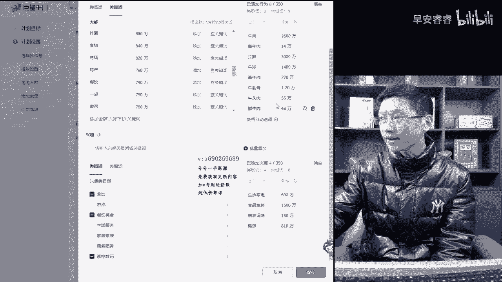
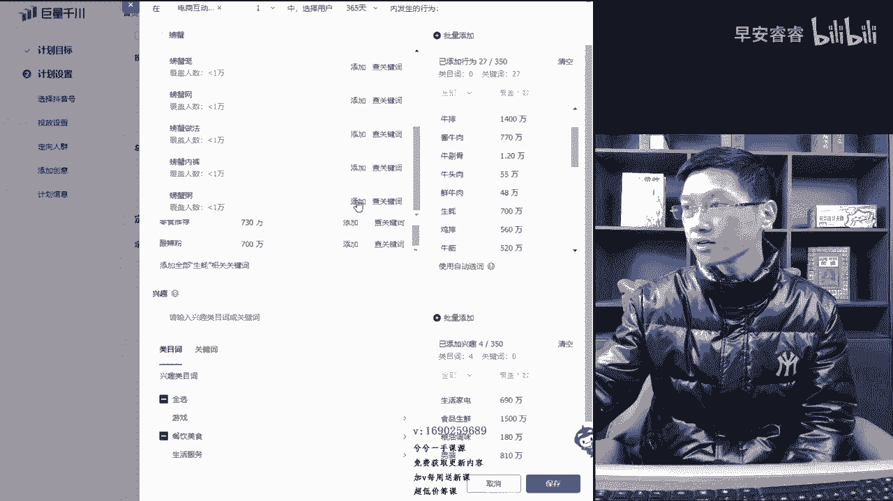
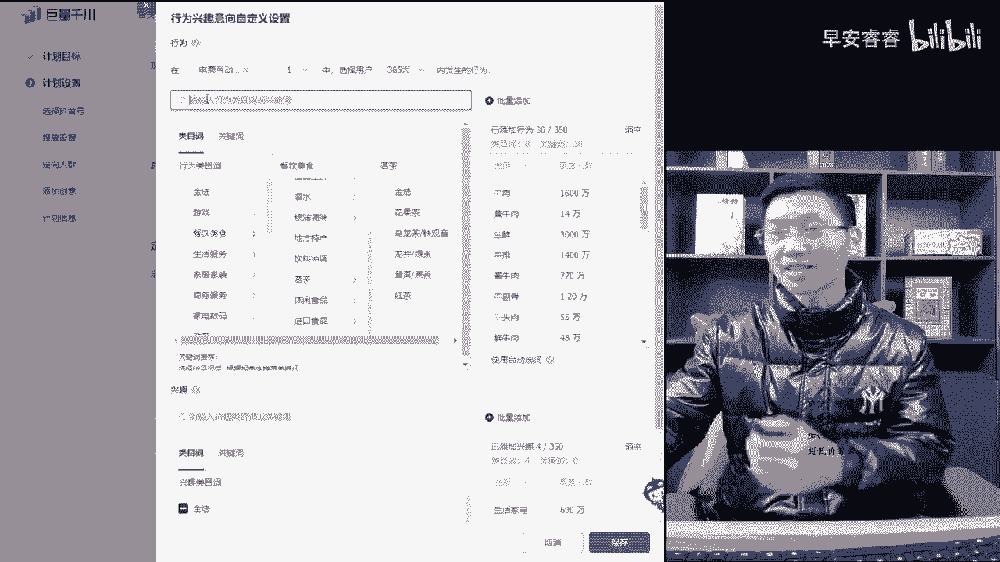
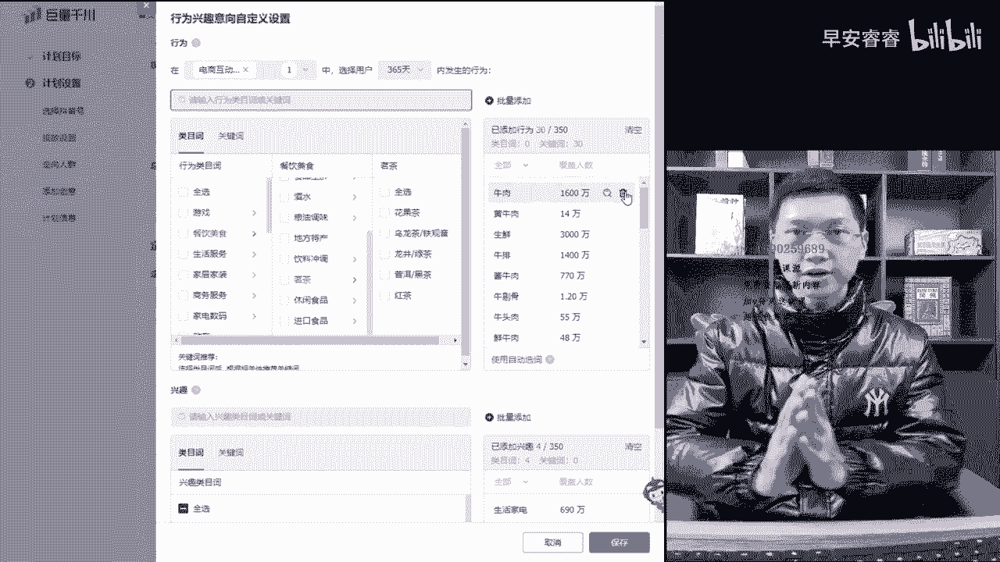
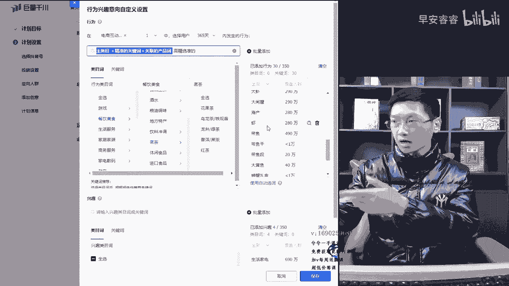
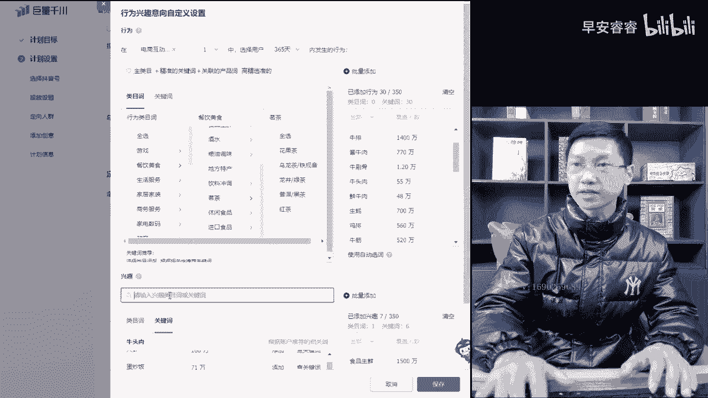
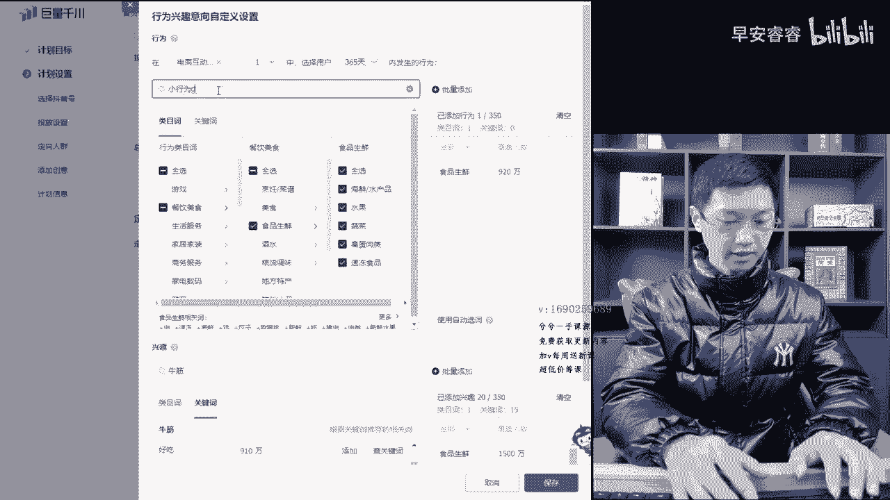
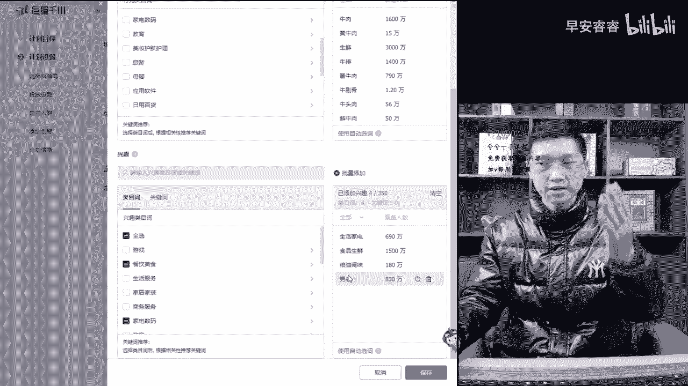
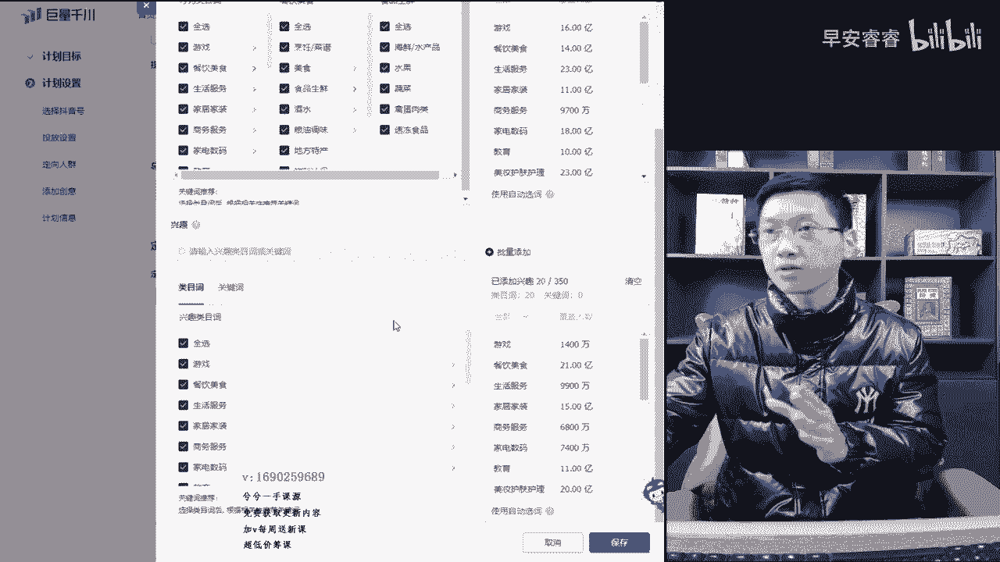

# 067 抖音电商直播投流起号课程 巨量千川全流程投放+小店随心推全流程+起号方式 - P4：4、多种人群的创建- - 早安睿睿 - BV1Nn4y197Wg

哈喽哈喽，那个前面有我们用三个视频讲的时间挺长的，其实一个高产计划的组合页面讲了这么长时间，但是我是希望把它讲透一点，让大家都理解，那么把这三个板块都讲完了，那么今天呢讲一个主要的一个核心的一个板块。

就是在起号过程当中，莱卡只要打准莱卡时的话，就是前期跟后期相对来说组合方式都不同。

所以呢今天呢给大家去搭几种不同形式的，一个莱卡，就是实操过程当中。

大家记住了，我讲给大家的所有的方法，其实都是在正常使用过程当中可以去使用的，这个页面正好我推进来的是，我们今天刚在跑的一个牛肉的一个账号，大家可以数字池上面可以去莱卡池，可以做一个参考，那么莱卡这组合。

直播间里面给大家讲6~8种吧，好吧，这里啊，这不是直播间，这是视频课哈，给大家讲6~8种，那么根据不同的情况下该怎么样去组合，或者相对来说在不同类目上的时候呢，我们该怎么样去组合。

有些类目它受众窄嘛对吧，他就需要宽一些，有些类目受众相对来说比较宽嘛，那就窄一些，精准一些，就这么意思，那么相对来说有些屏好吗，那我们兴趣就拉的稍微大一点呃，刚开始的时候也可以把兴趣拉的大一点对吧。

如果说是为了打精准标签的话，那么我们就拉垂直叫锤莱卡上下，基本逻辑是一模一样的，所以呢莱卡这个板块呢，讲的相对来说要多讲一些，差不多基本讲下来的几种方式讲下来，我估计一个视频给大家录一节课。

就半小时嘛对吧。

差不多这么一节课的时间给大家讲完，所以大家先来参考一下，我们刚投的这个生鲜板块哈。

卖牛肉的，这个卖牛肉的，你看哈这个词汇上面是不是挺简单的呀。

这个词汇上是不是搭的挺简单，所以搭打卡池的时候并不要把它想的那么复杂，这个账号是什么情况呢。

这个账号首先大家要明白，这个账号是一个成熟的账号，一年也卖了好几百万的一个哦，不止哦，一年只卖一两千万呢，因为他一个月能卖一两百万呢。

一个月100多万能卖一两千万，这个号停了很长时间又重新开播的，技术流特别高。

特别烦，不承接，那么说明直播间整体的转化，就是非得留这个板块是不转化的。

我们就把它当成是一个星号的形式去搭建了，所以说把它拉正一点嘛。

把流量拉正一些，在打职上面大家记住啊，因为是实操案例。

所以我们都没有那些更多的一些，玄学逻辑的东西去讲，还是这样，我在直播间里都是这样的啊。

在词汇上面大家记住了，有的人说莱卡只要多打一些。

有的人说少打一些都没有错，你把他拉满了350个。

你把他拉满了也没有错，但你别拉偏了，大家记住了，这是一个核心点，投多投少不重要，主要是精准度，垂直度的一个问题，不要跑偏了。

你像这种卖牛肉的，你上来去把那些什么那个什么五金电器，这些东西拉进来对吧。

那肯定是不行的，对不对呀，所以说你别拉偏了就行，多少都行。

正常情况下拉个30个到50个就足够了，把你主类目做什么类目的，把主类目拉进去对吧，主类目一拉，然后下面关键词精准的或者相对来说泛一点的。

都往里面一带就OK了，所以你看这个牛肉号的话，也是投第二天。

这个号都上3年级也还行对吧，刚跑跑出来正常能跑到5~6的啊，现在哈如果质量流好的情况，能跑到个差不多七八，已经是不容易跑到七八那些了，正常的五六会比较居多一些，第二天跑个三点几还算不错。

这种词大家有没有看到啊，卖牛肉的嘛对吧，卖牛肉的，那么就牛肉作为一个主类目，其实这里面还有一个主类目，实际是生鲜，生鲜作为一个主类目懂吗，食品生鲜这个板块是一个主类目。

但是我们牛肉关键是多就拉了一个牛肉吗，下面三线词也打出来了对吧，也找进来了，直接收出来的值不是拉类目的，但都一样，你看这两个主类目拉出来以后不用两个哈，其实一个就够了，但是这样覆盖量它是纯垂直的嘛。

也可以锤一样的，那么生鲜牛肉煮类目打出来以后。

下面你看啊是不是精准的吃呀，其实这里面都是精准的对吧，那牛排酱牛肉牛蹄骨肉，牛头肉，鲜牛肉对吧，这叫精准的产品吃，那么其实这里边搭建呢，我在直播间给大家去讲呢。

还是要多讲一些单一的，按照这样搭的话，这是很成熟的投手，这样去搭的。

就纯垂直类，你没发现吗，这纯垂直类主类目加精准产品质类，其实这个里边还可以加一些其他的词汇，你是个卖牛肉的，鸡肉鸭肉鱼肉，海鲜大虾扇贝，生蚝带鱼黄鱼对吧，什么都能往里面搭。

因为他这精准的主类目加精准的关键词，加关联的产品值牛杂呀对吧。

牛排呀对吧，那个牛肺啊。

牛肚呀这些东西都是可以往上面去打的，这种叫关联产品池嘛，那么后面我们可以加一点对吧。

在牛肉后面我们拖一下，看能拖出哪些哈，那这里面一拖就能拖出来了对吧，生蚝这个时候是可以用的，只有关联产品值了，家常菜这个词也是可以的啊，冷冻食品对吧，鸡排这个是必然很精准的关联词，然后牛津对吧。

这个词也是对吧，那小龙虾酸菜鱼对吧。

这些你看哈，其实在打行为池的背后，主要是一个什么点啊。

打行为时的背后，其实打产品池背后的人群能买一些鲜牛啊，能买生蚝的人对牛肉的供需量是有的呀，它是在同品类大类目，是在同类目里边就可以了，你别给他拉偏了就行了，懂吗，你看哈嘴馋调味料。

其实调味料也是可以拉的，我们这小龙虾后面再拖一下，看一下有没有哪些合适的好吧，往上跑一跑，看一下来整个小吃炸鸡这个也是可以的，炸鸡的话略略微跑偏一点的对吧，牛排加过的熟食，这个吃也是可以用的对吧。

牛肉加过了肉类，这个时也是可以用的对吧，那包括我们再往下生蚝加过了螺蛳粉，加过了，这个用不着，鸡排也加过了，这个不要了，来我们开始打了海鲜吧，打海鲜，搞个海鲜，我们试一下，看能射出来多少啊。

然后海鲜海鲜干货对吧，海鲜海鲜干货留着吧，这个覆盖量小一些，拉一下，看后面花椒解馋，脆皮这个不要，那水产这个词是可以的，水产后面再去拉，那大虾出来了对吧，大闸蟹出来的对吧，你看这些都海产对吧，虾对吧。

鱼塘这个是不要对吧，食材大虾后面我们那过就一锅二二锅三，把它过出来，大虾剥完以后，好像这这差不多了，这里边大虾螃蟹分鲜。

小吃全家，这个这个就不要了吧，我就单独去给大家打吧对吧，比如说那个啊大于对吧。

我们去把一个大于导进来多加一些哈。

来大于这一个大鱼干对吧，大鱼段这些时都是精准的，大虾大鱼都有嘞，那么比如说那个大黄鱼对吧。

大黄鱼。

那大黄鱼加进来，我们看能不能吐出来啊，大黄鱼加出来以后，这里边就加出来，边加边找，在这里面找，最后其实申猴我拖一下，看能不能拖出来一些，基本他在本类目里面差不多，这个值生蚝的话，男人这个用不着。

这个太准，这个就偏了，这完全偏了，有点就用不着嗯，牛肉肉类，牛肉保健品不用，然后烤肉烤肉这个吃也是可以的，这个食也可以，但基本不用对吧。

大鱼大虾螃蟹，那。

那螃蟹对吧，覆盖量螃蟹吃法，螃蟹礼盒这种东西对吧，所以基本螃蟹做法螃蟹粥，那这种大家来看一下啊。

还有很多，其实那个鸡肉吸入对吧。

羊肉对吧，这些都是可以的，鸡肉卷对吧，肌肌肉这个值加进去，然后这个肌肉饱也是可以的，大家看哈，啧我是一个卖牛肉的。

现在这个逻辑就出来了啊，这个逻辑出来了，上面我就不加了啊，鸡肉牛肉羊肉狗肉什么各种肉的对吧。

都可以去加的，海鲜里面各种事都可以往里面去加的，加行为板块，只要关联的就行，完了以后听好了，玩点了以后呢，这里边逻辑听好了，大家一定记住啊，逻辑是最关键的，产品背后人群这种搭建的逻辑。

这种搭建逻辑我把它去掉一个吧，我把这个这个流入覆盖量刑不去吧。

这个不去就两个，他就记住了，生鲜其实作为主类目。

这个只是因为牛肉打进来，他的覆盖量大，就像我们打茶叶一样，大家看一下哈。

打个茶叶大概查下，这里面出来这一个关键词3700万，但是它不属于听好了，3700万，它它不属于茶叶的主类目对吧，它不属于茶类的主类目，茶类的本能主类目是在这个地方。

茶叶的本能主类目是在第一个是刚刚出来的，第一个，其实茶叶的种类目是在这里边有个明茶对吧，这个里边你看哈有各种茶，看到没有啊，这这就是它主类目，但是你会发现打个茶叶出来以后，就像现在打个牛肉出来一样。

生鲜是它主类目，美食是它主类目，但那个牛肉覆盖量大可能会误导一些，大家会感觉诶为什么它是属于两个职位，我到底选哪一个，所以说大家清晰这个思路分析作为主类目，只是牛肉这个词的覆盖量大而已。

就像刚刚给大家演示茶叶的对吧，茗茶作为它的主类目，但是你打个茶叶出来以后，茶叶覆盖量也很大，所以说记住这个观点就行了。

所以大家来看啊，在行为板块上听好了啊，这种叫垂拉卡。

锤拉卡有两种变量维持一，一共给大家三种组合方式，三种就是搭配方式。

然后六种组合方式可以做变量的，这种呢就是在信号起步的过程当中，直播间我也给大家去讲，这个板块信号起步是以精准流量为主。

所以说这种搭建一定是精准的，知道吗，你看我们自己投手搭的就拿个纯垂直的。

太少了，你们有时候会把控不了，所以说我以这样的形式给大家一拉，大家心里面瞬间就有数了，那么这种出来以后，他的逻辑其实就是主类目嘛对吧。

主列目加精准的精准精准的，主类目不对，打精准的关键词哈，精准的关键词加关联的产品是，关联，的产品值，关联的产品值。

那你看啊这个逻辑是这样的，主类目加精准的产品值，加关联的产品值，主类目是生鲜对吧，精准的产品值就是上面的小牛肉，各个类目都是一样大的，特别是做服装的，各位姐姐们听好了啊。

那个女装饰里主类目或者男装是里主类目，先把自己卖哪个品的。

包括说什么卖双面离大于一的，把双面里几个是一模一样，逻辑向量多打几个，下面的情况下就是各种羽绒服，各种外套，各种保暖，各种棉衣，各种裤子懂吗，往里面去加就行了，这种你看这个下面这种小龙虾。

酸菜鱼，熟食肉类，海产大虾，这些东西的啊，大鱼这些，这就是流入的关联产品值嘛。

在本类目里边的嘛，包括牛杂呀，牛筋呐对吧，牛头啊对吧，牛尾巴呀，包括牛便啊，这些词啊都是可以打进去的，都算是精准产品值跟关联产品值，这个逻辑大家应该就看明白了，我讲的比较细致化。

说实话你别看我不去讲过多逻辑啊，逻辑是没有用的，它其实就是产品背后人群组合，真正实操的组合搭建，这才是一个最关键的一个点，那么这里面打完了以后听好了啊。

这种叫垂直莱卡，叫高精准的，也可以在后面补一个哈。

高精准的还能不能打上来，高精准高精，高精准。

高精准的这种叫高精准的组合方法，这种叫高精准的一个组合方法，然后兴趣板块的逻辑跟这是一模一样的啊，上面这种搭配形式就主类目加精准产品值，加关联产品值，上面这种打法大家看出来了啊。

兴趣板块跟他一模一样的啊，一模一样的逻辑是一模一样，但是听好了啊，你不要把它词汇啊一模一样就行了懂吗，其实像这种差不多这种形式。

差不多在兴趣板块里边，你你看我们兴趣板块里边哈，食品生鲜作为主类目，对不对，粮油调味这一个也是精准的关联词，你看哈买买任何海鲜肉的家禽肉的，他都有这种买一些调味品的，基本都是一个人群，能明白吗。

兴趣板块是一样的，你比如说兴趣板块，我们保留了一个食品生鲜吧，这里面我们选一个食品生鲜在里边哈，就不选美食了啊。

然后先把牛肉对吧，牛肉打进去了牛肉，然后那个牛肉干上面。

我看把上面牛肉时借用一下这种纸，好牛排往里边加哈，听好了，往里边加来小牛排，小牛排往那边打，逻辑其实是一样的，小牛排牛头对吧，就是这种各种食往里面去加，牛头牛头梗，牛头宴，牛头宴，这个值是可以的对吧。

这是可以的，牛头肉对吧，那牛头肉往里面加进去，就这个牛头肉加完以后，包括上面我们再写哈，来牛蹄骨对，那流体骨把上面的时借用一下嘛对吧。

流体股流体骨导不出来啊，牛特一踢踢人踢人踢人就踢骨骨头吧，流体鼓对吧。

那这种池各种池往里面加这样多少来啊，食品分析，小牛头这种流体骨加了这么多了，这个产品产品值差不多了哈。

牛排牛筋，牛筋，罗罗志一样就行了，其实牛筋哎针的哪一个真的有尾巴的针吗，不是有尾巴，金的话是没有平舌音版牛津啊。

流金对吧，流进打进来，把刘进给打进来对吧，然后就这就算精准值了。

这个值就可以了，这个精准值就够了，反正你们自己能加就加多少嘛，你精准值能加多少就加多少。

牛排牛肉牛筋呢，各种牛肉生牛肉，熟牛肉对吧，然后那个包装牛肉什么东西，各种产品只往里加，这里面逻辑已经形成了，牛肉是一个主类目对吧，牛肉是一个主类目，声线作为主类目，下面牛肉对吧，各种牛肉打进去。

接下来其实下面这种形式是一样的，就是不一定非要一模一样，复制这个东西，这多种打法啊，我我复制一下啊，我复制一下给大家看一下，拿添加粘贴一下，把这种各种数字给去掉，来，5one one的给它去掉。

续一下来，这种这种统一加的方法比较简单嘛，还有啊去差不多了吧，那这样的情况下我们就把它。

你看我是从上面复制进来的啊，这样去完以后添加一下，当你们实操的时候。

不要以这样的形式去完全上下一模一样复制哈，你把这个逻辑弄明白就行了。

你看现在逻辑是不是是一样的啊，那上面主类目它这个主类目的话，我们投手选的话是选了一个那个分线对吧，那么下面我们也还是申请食品，生鲜作为一个主类目，精准的产品值，关联的产品值对吧，各种往里边加倍。

那有人会说小行为大兴趣，大行为小兴趣，这种是在多种组合里面呈现的。

大家要记住了，这只是其中一种组合，这种叫高精准的组合嘛。

这里边嘛呐这种叫高精准的组合，记住了上下的搭配形式呃，以这种逻辑去搭建就行了，主类目加精准产品值加关联产品值。

一般的大类目上面都可以行，都可以成立的，那么这种搭出来以后呢，是有高精准的，高精准了以后呢，千万记住了，再强调一遍呐，兴趣板块里面千万不要把上下弄一模一样，逻辑一模一样就行了。

就像我这样是拉出来随便拉拉就这样了对吧，那么你哪怕把上面其实我这样去给大家讲讲，会更好理解，把上面去掉一部分呐，我把它去掉一部分，这样的话你看哈这样也是一样道理对吧呐生鲜，然后就精准产品值。

然后下面关联产品值就是几个兴趣板块里边，你看对吧，生鲜，然后精准产品值这几个下面各种关联产品值，还有各种家禽的各种什么调味的，什么东西还没加进来的对吧，所以说这样一家逻辑是一样就解决了。

这叫也可以一样的啊。

大家听好了啊，也可以基本一样的，如果我们把兴趣板块这些职位全打到上面去，跟刚刚差不多复制下来，那几乎不就一样了吗。

一样的也是没有违背原理的啊，这个是没有关系的，就尽量去把它稍微调一调。

不可能老上下行为一模一样嘛对吧，行为兴趣这种叫高精准的组合，第一种方式就是主类目加精准产品值，加关联产品值，这第一种方式，第二种方式大家记住了啊，第二种方式是这样的，就把下面所有的产品值把它全去了。

我就拉一个食品，生鲜跟牛肉这两个，那下面这几个就这些我们统统不要了。

那么在兴趣板块里面就两个池对吧，一个主类目，一个关键词就完了，或者去谈一个主类目，打一个美食抬一个生鲜。

抬一个主类目，而上面还是主类目加精准产品值加关联产品值，这两种，这叫两种变量，两种变量都可以听好了啊。

星号投放的时候采用这样的形式，采用这两种变量，它是都可以的，没有一定性，这是OK的，这是第一种方法就解决了对吧。

这个大家能理解哈，就高精准两种组合方式，一种是上下逻辑一模一样的，另外一种呢下面不加关键词，加个主类目，因为你看哈行为板块卖牛肉的对吧，还是生鲜，兴趣里边就一个生鲜，那么这个人群就完全锁在一起了。

纯精准的懂吗，这种叫高精准的信号。

起号的时候大流量本身以精准为主。

所以说用这种形式去组合就没有毛病，完全是OK的，这是第一种方式。

那么刚刚变量的时候呢，也给大家去交变了，所以高精准的呢两种组合搭建就OK了懂吗。

这叫高精准的一个组合方式，高精转完了以后，大家听好了，就要涉及到一个潜在的搭建方法了，叫高潜的搭建方法。

高潜债听好了。

高潜战，啧啧啧。

搞潜在的精准的主要是上下一模一样，或者行为为主导，那么潜在的其实他就变量变成了，以兴趣作为主导。

欠债人群，大家听好了，潜在人群嘛他就变成了一个兴趣作为一个主导，那么在整体来说的话，这个前面我就把它关掉，不用了，搞潜在的以兴趣作为主导。

所有的人群集合在了兴趣板块里面。

叫高且浅占就兴趣嘛，那么高潜的情况下就高精准的兴趣人群。

高精准的兴趣人群，所以你看现在的这种搭建逻辑，听好了，现在这种搭建逻辑是没问题的，喏主类目精准的产品值，关联产品值多拉一些对吧，欠债的吧，纯垂直的吧，叫高欠债的这种组合方式。

那么在它跟高精准呢正好是相反。

变量，高精准的是在变量我们下面这个地方的变量，我们兴趣板块。

而高潜的时候呢，我们变量变上面变行为板块。

那么主类目不加，大家看啊，主类目不加。

我只打了一些精准的产品值跟关联的产品值，行为板块只打了这几个流牛头肉对吧。

牛头肉各种牛肉打了几个精准产品值，再打几个关联产品值，把所有的人群，这样的话行为覆盖量就会比较少，把所有的人群全压到了兴趣，这个里边而且兴趣里边是纯垂直的精准的，所以它叫高潜诈的第一种组合方法。

这叫高潜的，那么对于爆品呐对吧，打爆品啊，主播抢的呀对吧，不复购的产品呐，A级这样的形式是不是更合适一些对吧。

这种就叫高潜站的勾，且量呢行为板块呢不加主类目就精准。

产品值，要关联产品值，兴趣板块就这样的逻辑。

精准的主类目加精准产品值，加关联产品值，这种就解决了这个对吧，那么另外一种变量大家记住了啊，就是在整个我们行为里边说了嘛，高起来的主要变动行为嘛，在行为里边我们把反向把这些所有的听好了。

把这些所有的精准的产品值，把他的去掉，把这里面全部去掉，我们直接去加一个食品生鲜对吧，加一个食品生鲜做一个主类目，然后什么都不加了，就跟刚刚的新曲一样，就一个主类目，其他的什么都不加了。

比如说我把这个复制一下这些值啊，要不然等会丢了，可惜了啊，那这里边我们把它清除掉，那么我就加一个，比如说食品声线对吧。

我就加一个食品声线，OK啦，这种卖个牛肉的对吧。

你看这也是卖牛肉的对吧，下面请调的兴趣板块没动，行为板块做了一个变动，这行为板块其实就是主类目加精准产品值，加关联产品值，然后要么在高潜债的时候呢，就比如主类目下面行为值跟关键词全部去掉。

要么就把主类目去掉，流行为词跟关键词，这样结合下面的高潜量的主类目，加精准的关键词加关联的产品值，这样的形式叫高潜在的组合搭建方法，这是第二种搭建方法，那么就四种了吧。

这样吧能听懂OK哈，这个能听懂这第四种了，那么第五种大家听好了。

第五种的话就是你们理解的哈，听好了叫小行为，大兴求啊，小行为，行为大猩猩。

小行为打进去嘛对吧，行为板块里边跟刚刚是一样的。

那我就我我退出来重开一下都可以的啊。

这是我们今天自己跑的，刚跑刚建出来的个跑的对吧。

这不就是小行为大兴区嘛，小行为大兴趣。

所以说你们天天听人家说口头禅，小行为大兴趣，大行为小兴趣，他只是在组合里面其中一个因素被他提炼出来。

成为一个话术了，并不是这个词汇一定要去这样去打的。

你看这种词汇有很多种组合的方法对吗，你看小型外大兴曲这样一拉的情况下。

那行为板块里边对吧，很垂直这种对吧，兴趣板块里面扩宽了对吧。

小行为大兴曲以这样的形式去扩宽，扩出来了，那么小行为大清取的变量呢，其实呢也是两种方式，第一种呢就是还是这样精准的主类目对吧，加上精准的产品值，加上这种你看哈食品调味食品，生鲜男装生活家电对吧。

这种人群因为为什么要打男装哦，他这个卖牛肉的，一般情况下卖正常的家禽的，他还不打男装，牛肉这个东西男性购买量是居多的，你们看了我的视频课的人，如果有卖生鲜牛肉的，一定会有这种感触的。

牛肉的男性购买量是有的懂吗，所以这里边他打了一个男装，然后生活家电对吧，高精准的女性人群，包括日用百货这种事都可以往里面去打，那么这种第一这种呢就叫小行为，大兴趣主类目加精准产品值加关联产品值。

兴趣扩宽主要听好了啊，一般呢如果是小众品，受众面比较小的，在刚起步的时候可以这样形式去搭，毕竟人群放的会比较泛一些。

起泡过程当中越精准越好嘛对吧，覆盖量如果不够的话，我们可以加一些词，在兴趣板块加一些大力把它扩宽，正常情况越精准越好。

对于一些相对来说潜在人群的，就是产品覆盖量不够的诶，上来过就这样搭也行，按照这种逻辑这种去搭一下，那么还有呢就是主播超厉害，反正就是主播厉害，其实爆品之类的怎么答。

其实都对，越开越放开一些都越好，那么以这种形式就答案，还有当账号从0~1破了以后。

进入到很稳定成熟期的时候，也可以大兴趣往里面去拉几个大类行为。

里面拉几个大类都行，它只要成熟过后，相对来说的话，投放的还是比较简单的，就不用这么拘谨了，但是听好了啊，就按照这么拘谨，这么就细分化去投的情况下，不管在什么时候都通用通管用啊，因为它永远是最精准的。

它永远会比那些放开的会更精准一些，投产有可能会高一些，不代表百分百大部分是比较的高一些的，那么这是小行为大兴曲第一种组合方式，第二种组合方式，跟刚刚的那个高潜的形式是一样对吧，把本身的关键词去掉对吧。

把类目值也可以去掉，把本身的牛肉啊，生鲜啊，这种类目值一去留几个关键词，那么他也变成了一个潜在人群。

但他不叫高潜在的，因为高潜在这里边是垂直的嘛对吧。

这种也变成了一个潜在人群，这种叫扩人群的过程，小行为大兴曲叫扩人群。

大家听好了，我打一下，这个没人没人，那个客户扩啊。

打错了，cool人群，这种叫扩人群的一种组合方式。

那么小行为大兴曲，然后变量上面要么把主类目。

把这个声线主类目把它去掉对吧，就留一个牛肉啊，这对啊，牛肉这种基本的这种精准的产品值，再加几个关联的产品值，或者不加也行，你看我们投的就加了几个石头没加对吧，这种叫小行为大兴趣，然后就扩人群。

主要把人群压在了兴趣这个板块里边，另外一种嘛跟刚刚那个打高潜是一样的，拉一个主类目在上面，把那些精准产品值都去掉，那拉个主类目牛肉，或者相对来说拉个生鲜进来对吧，那拉一个美食美食盛宴对吧，那以这种形式。

下面还是把所有的主导人群放到了下面来，所以相对来说你只要理解一个问题。

兄弟们听好了，你只要理解行为人群是一个产生过动作的人群，他的购买意向有可能会更高，兴趣人群是对某些类目感兴趣，并没有产生过的，这叫兴趣人群，所以相对来说在这种人群里边，你的品如果比较好的话，别人肯买嘛。

就这么简单嘛。

对不对呀，所以呢如果本身刚开始的时候呢，就是垂直的精准的行为进去拉卡人群，这样垂直的去拉不就OK了吗，所以说用这里边呢，给大家把行为兴趣的多种组合，给大家用半小时时间讲完了，听好了啊。

高精准的两个，高潜在的两个，然后扩人群的两个一共是六个。

然后因为时间关系，我最后再给大家说一个，如果账号投到最后已经投得非常好了，想去扩一下人群，自推也跑的。

想扩一下人群真正投产的，那么其实是可以也可以用最后一种方法，但不建议大家用哈，这种方法就是这样的，这种方法呢叫半通头。

大家记住了啊，通头是什么都不选，半通头是什么都选呐，这种在最后千万别上来盲投啊，打视频投视频的时候也可以采用这样的形式投。

最后的时候当跑细推，跑稳了过后，想去扩一扩人群的时候。

探索额外的一些人群的时候，把行为兴趣全选，选完以后呢，你去排除，大家要记住了啊，选完以后咱们要去排除要啧。

这个时候选完以后，假如跟你半毛钱关系没有的，你是一个卖。

比如说卖一个卖女装的，那么金融啊对吧，交通啊，户外呀，这些跟我的关系几乎没有什么，就虽然说金融里面有女性人群哈，但是如果你是卖一些中低端的，相对来说这是逻辑问题啊，中低端的客单或者相对来说。

你就拿卖女装来说，这种人群跟我是没有什么关系的，那么我把它排除为排除就行了嘛，对吧，就把它通选，然后再排一排拉几个大类目，这种叫半通投，懂吗，直接投就行了，OK所以呢这一节课呢给大家用半个小时的时间。

把行为兴趣的组合全给大家讲完了，你放心好，我直播间讲的所有东西都是，实操里面就百分百能用的，但是半通头切记啊，不给百分之百的答案，班通头大家要稍微注意一下，班通头有的时候是不准的。

但有些户上面跑的也是可以的。

打视频的时候可以采用这样的形式是完全OK的，因为半空投的话，拉几个大类目嘛，你选几个精准大类目对吧，像游戏一般类目都不选对吧。

你选几个差不多关联大类目，用视频去跑一跑，这种是可以的。

打直头的情况下测试一下，如果不行就别再用了，但是我讲我把所有方法全部讲给大家，是这么意思哈，那么这一节课我们就到这，下一节课呢给大家讲投放逻辑。

最后一节课讲信号破轮齐的时候呢，再送大家。

一个是那个人群猫整体投放的一个流程，好吧。

