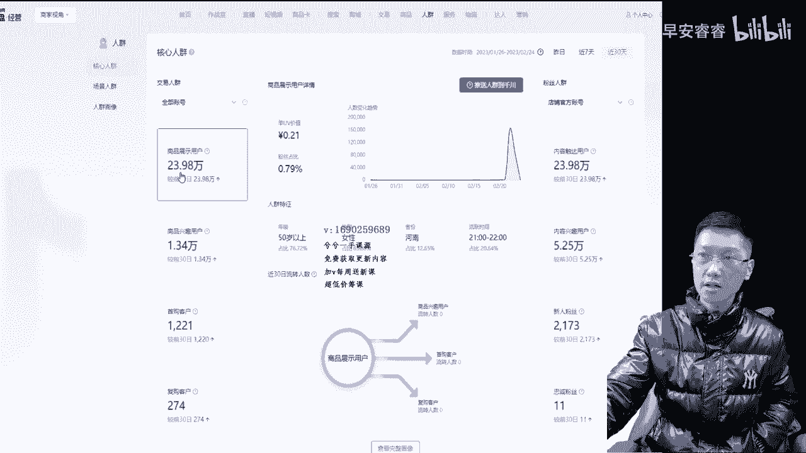

# 067 抖音电商直播投流起号课程 巨量千川全流程投放+小店随心推全流程+起号方式 - P6：6、人群包01- - 早安睿睿 - BV1Nn4y197Wg

哈喽哈喽大家好，那么今天我们来开始去录人群包这个课程哈，用半个小时到一个小时的时间，估计半个小时不够，这个包录的人群包一般都要讲个把小时的时间，是这样的，就是人群包在市面上呢，现在有点整的有点玄乎了。

有人说要投，有人说要不投，那到底是投还是不投呢，其实是这样的，只是在大范围来说的情况下，目前当下大家不怎么跑包，但是当下目前呢更多的呢跑的呢还是一些啊，专业版的计划为多，但是在个别账户里边。

他人群包也是跑的还不错，就这种概率比较小一些吧，相对来说吧，所以呢人群包这个板块呢，更多的是用在我们账号，就是成熟过后，有些人群不想要，或者有些人群想要刻意做定向的时候，或者想要扩一扩类目人群的时候。

我们会去打这个人群包，所以人群猫的投放过程呢是这样的，就是我在线上讲人群猫这一年多来啊，我也经常讲，我是第一个在线上讲人群猫的人，说实话，然后呢把这些观念给大家讲明白了。

就是并不是说一定说的账户要跑人群包，总体来说投的还是不怎么好的，个别账户投的还行，打打短视频对吧，那么接下来呢把人群猫所有的讲的方法呢，还是像我上面几个视频给大家说的一样，都是纯实操的。

纯管用的一些东西，你不用去怀疑，直接就这么去用就行了，但是不要主跑人群包也可以去做测试，你说我就测试一下行不行，那也可以，正常呢就是我在打一条专业计划的时候，某些类是要的，某些类是不要的。

我把它作为一个因素来做测试就行了哈，OK那么首先大家听好了啊，就是我们进入到我们罗盘里边，来电商罗盘嘛对吧，人群对吧，人群完了以后，这里边大家看哈，核心人群里面有八个类目呢，商品展示商品兴趣首购复购。

触达兴趣，新人忠粉对吧，这八个大家听好了，人群猫头发一定要记住，抖店后台数据，把数据当成一个种子作为这个参考值，这八个没有办法去当成一个种子人群，但是这八个的情况下，我们可以把它单独打成一个包。

然后呢单独去投这一条，这一条计划就投这八个，而且这八个是必须一个一个打出来，你看哈，比如说我们现在是这样，商品展示用户退到清川对吧。

选个30天改个名字对吧，这里边改个名字。

然后的话就退一下就可以了，它呢能够这八个呢能够一次性的全码的，就一个一个的，只能一个一个改，没办法一次性选，只能一个一个改一个一个，改完以后把它打成一个包，然后退到清川那边，然后听好了啊。

因为这个板块的话，这种所有的抖店的这些商品展示呀，内容触达人群呐，它的覆盖量是比较小的，不够大，那么再投进去以后，这八个包只能打一个计划，还不会一个一个把在我们打更多人群的时候，把这八个全选进去。

然后不要投下单成交，下单成交人群比较窄，它容易投不动，我们只能去投一些相对来说投浅层的投点击，然后用短视频去投这八个包，连续投一个星期左右，好就好不好就不好，反正这个原理逻辑就是打二次观看。

二次复购的意思对吧，本来他就有过我直播间的一些商品的观看的，对吧，有过内容观看的，那么我这么再去投这些人群，去整一个复购的一个动作嘛，OK大家能听明白这个问题解决了，那么把这八个包直接打进去。

这就是第一种小技巧哈，这是正常实操的技巧，跟我们在建人群包抖店后台数据它都没关系的，就是把原有的人群打一个阿看的一个道理，这个包打完以后，下面有个更多人群画像，查看画像，我们点开大家看，点开划线以后。

这个地方大家看哈，这里面有内容出答案，我们选择这个时候再找数据，大家听好了，我们选择收购人群，这里面找一个数据八大类，这个抖店里面成交的人群，是都市银发跟小城中老年对吧。

都市银发跟小镇中老年这个两个类目报大类，我把这两个数据大家听好了，用这种方法，把你们自己抖店的这个数据给找出来，但一定记住了啊，上面这个地方一定要选择收购用户哈，不要去选一些那个曝光用户之类的啊。

曝光人群，那没有用选手勾把这个数据给记录下来，这是我们在打人群猫的时，借用抖店后台需要参考的第一种因素，接下来两个嘛，一个都市银发，一个中老年对吧，第二个因数大家听好了啊。

第二个因数点我们的一个常见人群，看我们的一个商品洞察的一个人群，看他的消费价值到底是高与低，继续点人群画像，点开以后看哈，依然是成交人群，你会发现一个奇妙的现象哈，这里边依然有八大类对吧。

有八大类还是一样的对吧，这个基本跟刚刚那个核心人群是一样的，这里边有个购买偏好，大家记住，我们抓取第二个数据，高中消高中低一个消费价值，你看这个账户里边是中消费为居多，高消费居少。

低消费几乎就没有什么了对吧，因为他客单价几十块钱嘛，一般呢其实主卖个差不多100块钱，网上产品的都是属于高，这个就属于一个中的会居多一些，你把这两个数据把它记录下来，把它记录下来。

那么我们就抓取到了两个数据，对不对，一个是八大类，一个是啊这个消费价值，那么我们这个时候再回过来再看一下，大家看一下啊，我们再回到整个抖店的核心人群，这边，我们进进入到下面这个完全画像。

我们把这里边放在这边，不用管他哈，所购人群对吧，你看哈高消费的对吧，高消费价值的，然后都市频发，选择中老年，再教大家一个方法，这个方法跟打包呢没什么关系，这个方法呢咱就看一看。

就是我现在比如说我现在过完年，我卖的产品是A卖的挺好的，换了币过后卖不动了或者不好了，这个方法呢能够去判断这个人群是否有跑偏了，大家来看哈啊，还是点开点开商品这个单品分析，我们来看一下这个抖店里面。

这个人这个品是卖的最爆的一个品对吧，卖了1000多少件呢啊，11万7，1万1。7万嗯，这个品还是挺爆的哈，在他后面这个地方有个人群分析，继续点开人群画像，点自然月的那2月份对吧，人群画像点开点开以后。

大家来看哈，这是基本属性对吧，你看八大类这个品跟小店的人群完全能对上，发现没有啊，跟小店人群完全能对上，然后消费价值什么的就不管他了啊，那是完全对上，但这个也有点那个低消费的变高了，发现没有。

我看个信息，兄弟们哈，低消费的这个时候就没有了，这个就这个品的话，相对来说消费价值更多是中一些啊，中低一些，这个高消费的还是比较少的，这一个品中消费的会居多一些，那么我们看完这一个数据以后。

接下来我们关掉以后，大家来看哈，我们来换一个平衡，包括这里边啊直播分析这些高光切片，正常播时间长，账号都有的，但这个账号播时间短，没有高光切片，我们再去看另一个品，比如说他这一个品。

这个品卖的不咋地对吧，一共卖了15件，看一下哈，但这种数据太小了，其实没有什么参考性，点开真心话下这个跟打人群猫没关系啊，我只是给大家去看一下，或者你根据你的主卖品，然后去结合主卖品的人群是一样的。

因为刚刚那个主卖品，你会发现他的人群价值什么的，跟小店的后台几乎是一样的对吧，中高价值最高是这样的，你看哈这一个点开以后，你会发现这个品就不一样了，这个品的成交人群他的小升中老研究很少。

很少的发现没有啊，全是都是银发，这个P你发现没有啊，这个屏就全多次研发，所以这种方法呢给大家呢，其实对于很多不会的人来说，看不懂的新手来说啊，教会你们如何去展，有些账号品卖的很好，突然换品过后转不动了。

可以用这种方法去判断一下，这两个品的人群是否一样，因为我抖店成交人群是一样的，每天推进来的人群是固有的人群嘛，那么换屏以后成交人群有可能变差嘛，所以说通过这种方法来判断一下。

但是主要这个板块给大家讲的是，通过抖店后台的核心人群跟产品商品洞察人群，找一个八大类对吧，找出小镇中老年都市研发啊，这个都是引发产生中老年这两个，然后再找出一个中高啊，中低中科单的一个消费价值最高的。

那么找到这个以后，把这两个数据记录下来，接下来我们就要进入到人群包板块了，抖店后台借用参考的数据就这么多了好吧，这就借用这么多了，这里边就不要这个页面了吧好吧，我们换一个页面哈。

我们进入了清场板块里面来，接下来哈。

那进入到我们清场板块里面，折回来，这边对吧，进入到清川板块里，这是另一个账户哈，这是我另一个账户投的清川这一个哈，我们进入了清川板块。

把他护稍微那个吧，把这个切小一点，要不然你们看不到我了嗯，再切一下切小点哈，这个上面切小点，这样OK这样后面这一个我们用不上。

给他删掉了啊，把店铺这一个就打进来。

这样够了啊，这样可以了。

这样差不多大家能看清楚了啊，刚刚从抖店后台数据里边找了两个数据，一个是八大类，不管是如果是打单品的，大家记住了，单品打爆品的，你其实不用找抖店后台数据，你就找我刚刚给大家讲的。

从单品分析里边那个人群数据看它的八大类，看它的消费价值，因为你打单品的本来要对着这个品的嘛对吧，如果多品直播间看抖店画像就行，看整体成交花样，不要看单品的，就这样的，那么这个页面点开以后。

我们第一个问题大家听好了，清传上面的数据大家都能找到的对吧，这个时候就要打包了嘛，进入到人群洞察里面去，人群洞察里边去，我们此时此刻兄弟们记住了啊，进入到人群洞察里边去，此时此刻我们是这样的啊。

就是先判断一个数据，整个广告账户对吧，整个广告账户或者抖音号对吧，就我们一般判断我们整个清算账户就行了，完了抖音号那边我已经判断完了嘛，看一个清算账，整个广告账户，然后在这里边展示这个地方。

大家看这个账户啊，这个账户跑的钱并不多，这个账户跑了几万块钱嘛，一共吧，这一个月吧跑了几万块钱，这个货不多的，那么展示用户代表了千川曝光的人群嘛，是什么样的人群嘛，你会发现一个，但这个户刚刚刚刚刚。

那刚刚那个户不是一个户哈，这不是一个户哈，因为那一个户的话，他是不投千川的，所以说我这个户的话，是单独拿一个清传户给大家去讲的，因为打打包的时候跟那种数据就不一样了嘛，对吧，那么这个护里面打开以后。

你会发现一个问题啊，展示人群曝光人群曝光人群的情况下，这个往后面拉一拉扯，其他你们看不见，你会发现一个现象，大家看一下啊，其他占比并不高，那么像这种账户就是一个很简单的一个道理，大家记住了。

这种账户是一个很简单的道理，这个账户人群跑的就是比较正的，他的成交人群其实就是金枝妈妈，资深中产小镇青年，它的成交人群是比较正的，这个账户很OK的，我不知道这个账户的话，这个是那个这个是我一个学员户。

所以说我基本会给他们看看，后台这个账户呢这样的数据是比较正的，大家听好了，因为其他不多嘛，如果其他多的情况下，那么这个人群就跑偏了，所以经常大家会说一个问题，就是账号跑偏了，跑偏了，正不正。

你就用这种形式去洞察一下就行了，懂吗，数据这里面左下角点个人群洞察，然后看其他多不多，那他这个职称中产金枝妈妈小镇青年对吧，就这三个类目曝光，曝在了这三个类目里面，然后TGR这个东西我就不说了吧。

TGR的情况下大家有点会听不明白对吧，TG压高的情况下，转换就比较高嘛对吧，T g r237，这个你别看它曝光了，这个其他的还转的挺高的嘞，这个我就不给大家讲TGR了。

因为有些新手的话你听不明白就不用管它，很简单，从这里就能看出来，你看哈成交金额一打立马就出来了，看到没有啊，这个成交金额一打立马就出来了，那你看深圳妈妈转化特别高，资深中产对吧。

小镇青年这三个作为主展示，其实在抓人群包的过程当中，刚刚那种方法，用抖电的方法抓取是一种抓八大类，是一种方法，借用这种形式抓也是一种方法，你去用清川，这你就跑清川的这个人群，如果投产比较好。

那我就抓小镇青年金枝妈妈，支撑中产这三个人群，把它记录下来也是一样的，但是这两个我更多的建议大家记小店，后台的会更好，数据会更庞大一些嘛，这样的话我就能找出哪个类目，你看啊，再看一遍哈，展示用户呃。

金枝妈妈占了24，这个小镇青年占了19，这个占了18对吧，一到了转化成交的时候，你看哈直接支付金额立马其实还差不多，他高转化的高展示的还是高转化，其实是一样的，所以也就造成了这样的情况下。

我的人群是正的，这种人群是很正的，如果出现了其他曝光，或者别说曝光吧，别说成交吧，就只就这个曝光这个账户，如果展示人群很偏的话，你看那个曝光哈，就这么点哈对吧，五点几对吧，这种情况如果很多的话。

那么你在投放的时候，可以投这些相对来说高曝光的人群做定向，然后跟一些核心人群呐，潜在人群去交集并集，把他往回拉或者投精准的行为兴趣，或者我们达人往回拉投，个个把星期就能拉回来了。

这种方式我相信大家能听明白哈，然后这不是主要给大家讲的懂吗，主要给大家讲的这个呢，就教会大家怎么去看这个账户偏不偏，那么更多的是点成交，直接成交金额，我看一下录的时间，不能过了啊，14分钟才不多嗯。

成交金额点开以后大家听明白了，听好了，成交金额点开以后，这里边会出现一个核心人群，这个数据是我们需要借鉴的，打种子包的时候必须要借鉴的这个人群懂吗，核心人群挺好，但是一定要跑跑。

人群包本身就建立在账户跑得不错的情况下，我们才会去测试跑慢，所以说一定是账户有数据以后，你别到最后你像他这个这个账户，说实话，兄弟们这个账户参考性不是特别大，因为这个账户转化只有200多。

我们把它拉长一点，你把它拉长一点，把这周期拉长一点，从1月1号转化变成1000，这种数据大一点才有参考性，数据小了它没有参考性，知道吗，这个板块里边是我们必须要借鉴的一个东西呐，先学方法哈。

刚刚教你们是怎么看人群，偏位片，怎么拉拉回来对吧，那么这个时候呢核心人群对吧，听好了，选4~5个占比大的，选4~5个占比大的，每一个后面再选个三个左右小的，这叫这叫一级人群吧，我们把它叫这一分类吧。

一分类点开以后，这叫二分类吧，好吧，这叫二分类，那么以这种形式呢把周期拉长一点，把这种转化数拉大一点，超过一两千或者好几万的对吧，把它拉大一点线，直接成交金额，那么比如说中间最大的这一个服饰鞋包。

核心人群嘛对吧，那么我们点开比如说女装最大的对吧，内衣是排名内衣库啊，第二对吧，我来截个图给大家，等会合了个啊，我来拍个照片给大家，待会好好给大家去讲，要不然待会记不住那啊，这里边一个服饰配件。

服饰配件占了3。5，这个占了35。0，这个占了7。7，这个占了4。8，这个比那个好，这个是7。7，最多的这个是5。2也是可以的，这个铝协的话，4。8这几个比较好，数据比较大，这个3。5嘛就小了嘛。

那我们就就用这一个吧，拍个照片，你们自己截个图，自己也拍个照片就行，你看啊，第一个主类目哎，最大的服饰鞋帽，第一个主类目，这打种子包必须要这样参参考哈，第一个主类目出来了对吧，第一个出来了。

后面三个小类目，我们每个里面选三个选出来了，那么第二个客户加轻这个板块，客户家禽这个板块比较不错对吧，它占比是13。9，那么我再看一下食品饮料料占比的12。3，亲子生活占了15，这个要亲子生活。

我们再点开一下亲子生活里边，我们第一个这是2。7，然后学习用品C1。9，这个1。8嗯，这里边占比不是很高，说实话就就这样吧，这个第一个是这一个这一个1。8，然后再加上一个学习用品，1。978。

就这三个了，这中间的就是大的嘛，占比大的，我们再这样去把这个把它加下来的，中间的三个降下来，OK这两个图片拍完就行了，道理嘛就给大家演示完了，你看啊，大家就明白，那么接下来一个一个的。

比如说智能家居对吧，殿看，然后我在中间找个这找这种中间的找两三个，我就拉三个给大家意思一下吧，你们正常的拉个四个到五个，只要经核心内部拉个4~5个就行了，拉出来以后听好了，核心内部拉出来以后。

这种方法呢是它总值包，需要参考这个抖店后台的数据的，所以上面尽量把周期这个地方选长一点，那以这种形式大家一定能听明白，我讲的东西比较简单，拉出来以后接下来听好了啊，建第一个种子包。

用这个数据建第一个种子包，种子包是这样的，种子包的话在我们这边的标签广场，标签广场里边，我们来看哈，标签广场里面点开以后，右上角这个地方，大家来看看，这里面有个小车在右上角这个地方，这你这有没有多的。

我在录课，我在录，我在录课，这个拿去吧，这里边我户多哈，那我们现在再进去哈，再进到这个湖里边，进到这个户里边以后啊，进到这个护里边以后，这个闸跑到我上面来，把我弄到后面去了，我把我排一下。

那么到这个页面哈，到这个页面以后，那么继续我们回到整个数据里面对吧，数据里边回进来以后，那么在标签广场了吗，刚刚那个板块给大家讲完了标签广场对吧，我们现在进入到这边，进到这边以后，右上角这个小车给点开。

点开小车以后，大家来看一下啊，点开小车以后，接下来进入到我们这个人群的一个搭建了嘛，就是这个板块很简单，大家记住了，从这里边，从整个清传页面左边那个标签广场，能不能看到这个地方，标签广场大家能看到吧。

在这边吧对吧，往下拉一拉哈，有的人不懂，找不到哈，标签广场这边点开，然后呢就进入到这个页面了，然后这个页面右上角这个小车对吧，就在这个地方，这个小车一点开就进入到前传里边来打。

接着刚刚的数据打第一个人群包懂吗，这里面进入到里边呢，涉及到一个交集并集交并集的情况下，我先不给大家讲，我先教你们把种子包给答完，我们这一节课呀，这种人群包的录制啊，这一节课录不出来，一节课的时间不够。

需要录两节课，所以我这里边先不讲交边机哈，我先不讲交并集，我先给大家去把总的包给打出来，第一种打的方法就借用刚刚那种方法嘛对吧，照片拍下来的对吧，那种方式给拍好。

然后拍好以后在随便吧展这哪个类目里面都行，就在交集里面嘛，随便在交集里面放，因为打总子包两种方法，第一种教大家这种就是科学的方法，然后听好了啊，我们选择品类人群，品类人群里边。

因为刚刚那个页面是核心人群，大家记住你们自己在点开这个页面的时候，大家听好了，这个页面的话，它是一个行业核心人群，看到没有，它是一个核心人群，所以我们这个时候也拉核心人群进来，把核心人群拉进来以后。

拉进来以后，然后我们去按照我这个图片给大家去找哈，第一个亲子声智能家居亲子生活，然后服饰鞋包对吧，我们第一个类目选择服饰鞋包，服饰鞋包里面刚刚我截图了，你们就没没截，看不到哈。

第一个类目是就是在这种图片里边，就刚刚那个核心人群里边，我截下来拍下来这个哈，这里边每一个数据，这里面呈现的每一个数据，一定我说我转过来给大家来个这个镜头哦，镜头画面这样是大家能看到的啊。

我把镜头画面点一个翻转，那这个数据大家是百分百的，大家听好了，这个数据是百分百的，在这个里面是能找到的，比如说我们这个是个服饰鞋包的，里边所有的类目对吧，百分百在这边是能找到的啊，这个是没有问题的。

那么我再把这个翻转过来哈，要不然的话那这样的话看着舒服一些，那么接下来我们第一个比如说这个服饰鞋包来，我看一下页面哈，页面是没问题啊，不是斜包服饰鞋包，点开以后，第一个是女装女鞋，内衣裤袜，你看哈。

女装女鞋，然后内衣裤袜哎这个类目找到了对吧，然后第二个我们的第二个是亲子生活，第二个是亲子生活，那么这里边呢找亲子生火这个类目，你看点开点开以后，这里边是第一个童装婴儿装亲子装，往下面找来。

这一个是的童鞋嘛，童装婴儿装啊，这是童鞋不对，找下面童装童装婴儿装亲子装，这个对的，OK第二个类目的话是童鞋，刚刚那个是童鞋对吗，然后这三个类目学习用品找一找哈，那是肯定能找到的，大家记住啦。

一定能找到，然后这是诶核心人群一个主类目，下面三个小类目找到两个了对吧，第三个我还给大家看一下，第三个是这样的，就是还有一个家居家电，还有一个客户家亲珠宝潮舍，我们这三个刚刚选了一个。

那个就是智能家居嘛对吧，智能家居里边，智能家居里边的话呢就按照一样的形式，大家再去选就行了对吧，家具家电，智能家居这个板块按照一样的形式，把它正常的咔咔咔就把它全选进去就全OK了，你看这里面很多啊。

比如说我们刚刚选的第三个是什么呢，我看一下啊，我看一下啊，居家不易，居家日用对吧，居家日用，然后还有个居家不易啊，这都能找到的啊，居家不日对吧挺好，但大家记住一个点，大家听好了。

这里边我还得给大家过一下这个这个板块，这里边不过一下你们还听不明白，这里边有一个问题，垂直一下来，这个智能家居这个板块，大家看好了啊，智能家居的情况下，就是家具家电不要弄搞错了啊。

有的人会找不到智能家居这个类目在哪，他就家居家电，你看那个智能家居里面床上用品，居家博弈这些东西的对吧，我在这里面都能找到对吧，你比如说那个还有一个床上用品对吧，这里面都能找到的。

来这里边床上用品一定记住了，这个一定记住了，智能家居就是家居家电，这个要跟大家单独说一下，因为有些人之前问过我，他找不到，他说这里就点开一个一个过一下链接给过出来，但是这里面我强调一下就行了。

按照这种形式的话，我们正常就是等于是很简单，大家应该能听明白，按照这样的形式呢，我们就我看一下录多长时间的这节课啊，23分钟来按照这样的形式，那么你选取五个主类目，比如说美妆类目再选一个对吧。

然后那个汽车类目再选一个，这里面是不是打出来十几个呀，根据你的账号打出来很精准的，你现在仔细回过来看一下，兄弟们，我选了三个了，目前哈你看啊，女装女鞋童装学习用品，居家日用，居家布置床上用品。

这个人群跟这一个卖羊绒大衣的账号人群，是否有一定的关联性呢，同类不同步同类人群吗，跑的时候不会偏的产品背后的人群嘛对吧，这样你差不多选了15个，我这个选了九个吧，一对两对，三对四对十个。

那么覆盖了5900万，那你再加几个不就七八千万了吗，对吧，加几个就差不多七八千万了，这个包不需要跟任何包去做交集编辑，现在不需要，现在只需要把这个方式，当成最科学的一种选择方式，把这个包给他选出来。

选个15个左右，分类12个也行，根据下面的覆盖人群的形式去决定，这一个包解决了对吧，OK这个能解决哈，听不明白，你就反复听我讲的东西，没有讲偏逻辑在里边，但是你能听完，你能瞬间自己能明白懂吗。

实操的东西其实不复杂，就这么简单，需要人点透你一下就行了，懂吗，右下角点个保存，这个右下角我这个被我切的，你看不到，在这个页面的右下角有个蓝色的保存，我们点一下，我给切。

给大家切一下，看一下好吧，这个给。

啊看到了没有，这里面有个保存，看到吗，点个保存这个包就OK了。

大家能不能明白，以这样的形式这个包就OK了。

我把这个打出来，页面切切小点哈。

这个形式把这个包给打好，把我这往上拉一拉。

这样大家能看透彻一些啊。

过一下把这个页面过好看一些嗯。

好OK哎，这样就可以了，这种呢就是人群包来搭建的。

第一种方法大家记住了啊，先把种子包给我打好，总子包先给我答出来再说对吧，第一种打点方法完了还有第二种，打总支包的方法，大家记住了，第二种比较简单，第二种的话是按照一个道理就叫啊。

我经常给大家讲的叫同类不同步哈，红红类目的类，同类不同目，忽然那个裁剪同类不同目，按照同类不同目的一个问题啊，同类不同，这个早场今天打字咋这么慢呢，同类不同同类不同目的一个问题。

就同类人群不同类目的这个逻辑去搭建，按照同类人群不同类目的形式去搭建，他怎么回事呢，我简单给大家去说一下啊，我简单给大家说一下什么叫同类不同目啊，很简单，就是两种种子包的搭建方法给大家讲完。

这种方法是这样的，就是我举个最简单的例子哈，我是个卖男鞋的对吧，我要找背后产品，背后人群嘛，亲子生活里面点开看一下来，同桌童鞋什么的肯定都不行哈，度假线路这些东西难的还是可以的。

移动通信这个人群是可以的，本地生活数字阅读，数字阅读这个人群的话，男性是可以可以留的，书籍杂志这里边基本呢在亲子这个板块里面，更多偏向于女性，那么这是不要的，鞋包里边就多了钟表类蓝鞋对吧。

男装电动车人群，根据你的价格去决定，电动车配件这些东西如果你卖高客单点，就不要选这种人群了，低客单点你可以选对吧，运动包这些户外的这些男性人群是可以的对吧，登山露营的对吧，自行车的对吧，打火机的对吧。

喏这种男性人群，你是个卖男鞋的对吧，包括像珠宝这里边板块里面对吧，来陶瓷紫砂，那翡翠对吧，查这种打男性人群嘛，你这个卖男鞋的这种就借助了一个我们先多选，选到最后包括汽车里边对吧，摩托车配件。

汽车用品这个人群对吧，然后最后我感觉这个素质阅读人群覆盖也不多，我可以把它去掉，反正我下面覆盖量是够的嘛对吧，那么这种大家看一下啊，你看这里边人群呢，我是个卖男鞋的，这里面人群是不是是一样的道理呀。

就打产品背后有可能买我的人群，同类人群不同类目的人群吗，都是既然是卖男性用品的，我就找一些男性用品转化率比较高的人群嘛，找一些类目嘛，所以呢你看是个卖蓝鞋的，那我是个卖珠宝的，也可以打这个包啊。

那我是个卖茶叶的，现在那这个人群也是OK的呀，我这个卖茶叶的这个人群，这个包也能打呀，这种就同类人群不同类目的形式去搭建组合，这第二种人群包的搭建方法，就种子包还是那个方法直接保存这个包就OK了。

所以说这是第二种种子包的搭建方法，那么这种呢花了半个小时时间，你会发现我给大家去讲这个东西，轻轻松松讲了半个小时内容，大家其实一回顾2分钟就搞定了，就这么些内容对吧，所以讲的时候它比较复杂。

但是真正的组合逻辑还没讲呢，那我本身以为半个小时一个视频能给大家快速，我一个人讲，我直播讲一个半小时，我以为这种录视频的话就几分啊，半小时就录完了，那么我们留到下一个视频里边，再给大家去讲逻辑。

怎么去组合搭建呢对吧，你不能光去搭个这种包，会搭这个包就行了呀，我得搭建呢，所以这里面大家再听一下啊，同类不同目，这个就是按照同类产品不同类目，现在卖户外登山的，卖自行车配件的，也可以打这些人群呢对吧。

我是个卖车品的，也可以打这些人群，但一定要注意卖，比如说我现在是个卖汽车用品的，在什么自行车配件这些人群里面就别打了吧，这种消费价值对不上不等嘛对吧，不用管它，或者留在里面也行。

接下来我再给大家去讲逻辑的时候，会把这些关联给他挪进去，你就能听明白了，所以说我们就下一个视频再见吧，兄弟们。

