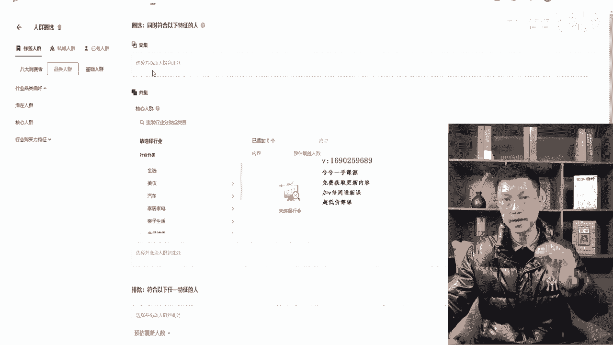
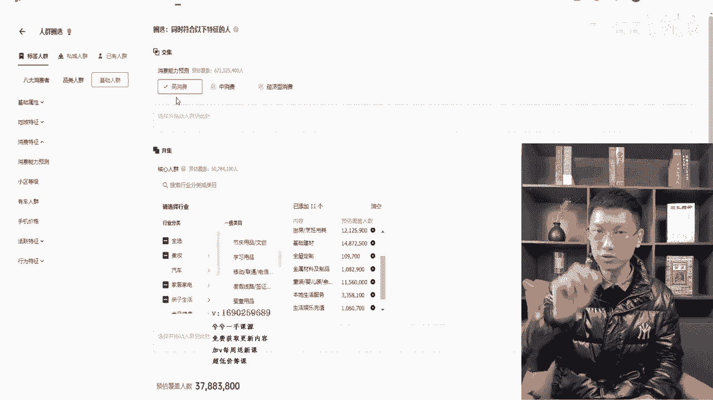
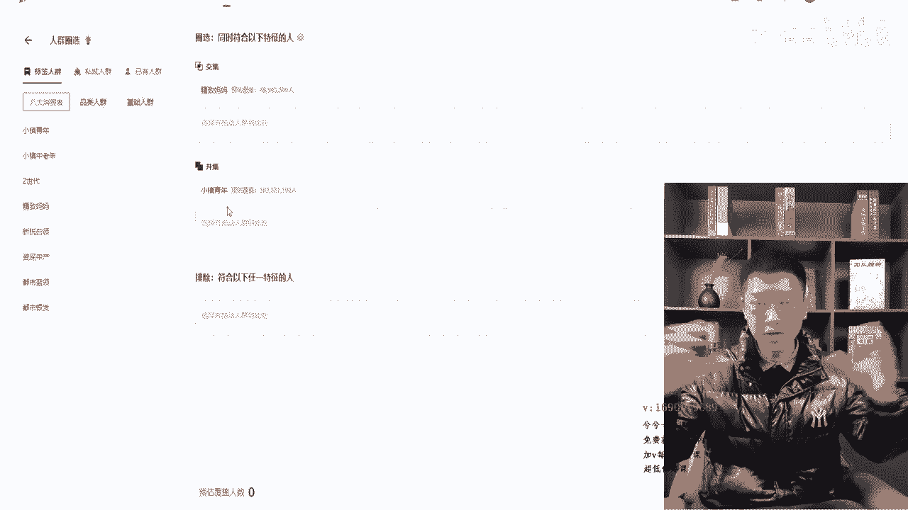
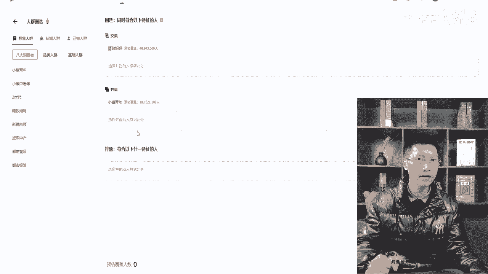
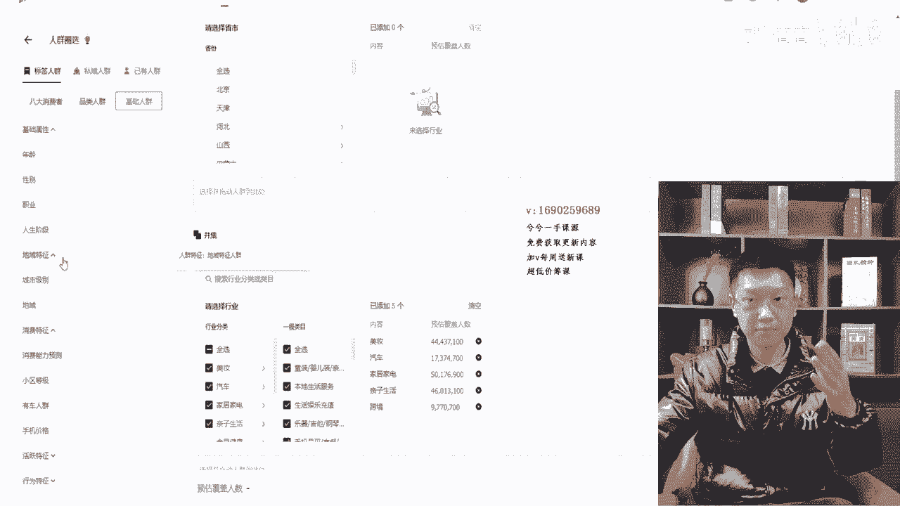
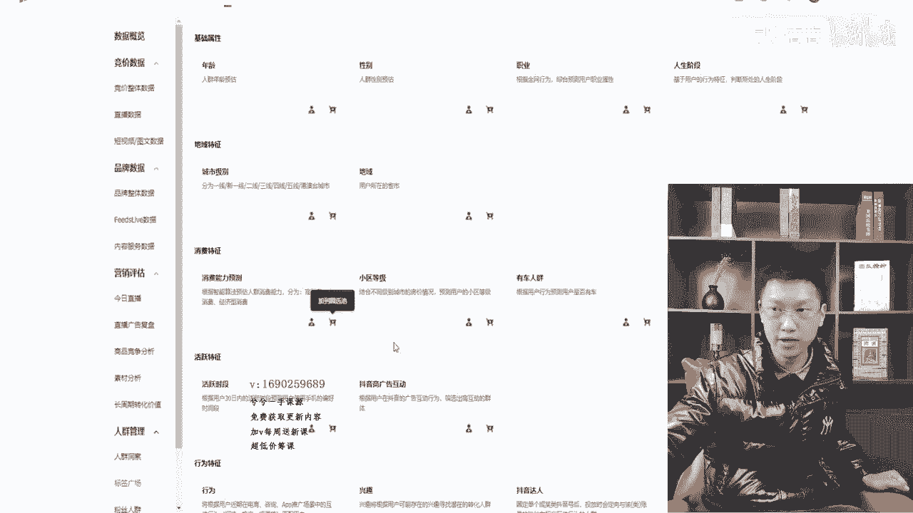
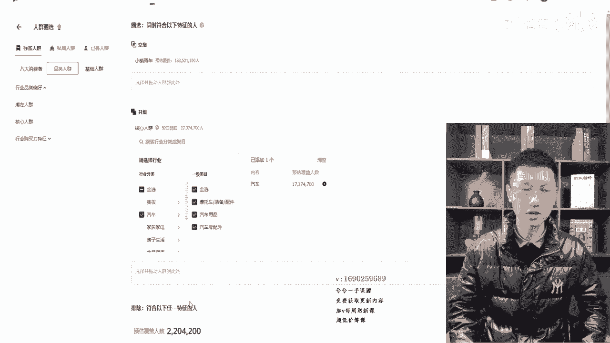

# 067 抖音电商直播投流起号课程 巨量千川全流程投放+小店随心推全流程+起号方式 - P7：7、人群包2- - 早安睿睿 - BV1Nn4y197Wg

哈喽哈喽，那么这一节课上面一节课，把人群包的所有的借助抖店后台要参考的。

一些八大类人群消费价值都给大家讲完了对吧。

那接下来这一节课，我们就要去讲一些交并集的这些关系的东西了。

光会把种子包给搭出来，基础会了吗对吧，我们该怎么样去投放嘛。

所以在这个过程中，我再给大家去演示这个环节，这个环节有半个小时的时间就能讲的很透彻了。

那么首先我们还回到这个页面里面去。

比如说比如说我是之前打好的，比如包是这个种子包建站这边的。

像这一个客户家亲，我这个包对吧，就把它拿过来吧。

把这个包当成是我们刚刚建的种子包对吗，大家都会建，按照这种形式把这个种子包给建出来。

那建出来以后，那么大家要首先要懂一个东西啊。

就是个交集并集啊，交集并集我在这里就不说了啊，交集并集就是我直播间也天天给大家去讲。

这个很简单的一个道理，左边100个有房的100。

右边100个有车的，那么如果是并集的话，就是1+1=2，就是200，如果是交集的话。

就把左边100个有房，100个有车的，把他往一起一放，选择中间这一部分群体。

就是既有房又有车的人群嘛，他就会很少对吗，他不管怎么去加。

它永远不可能大于日100的，因为它毕竟是选了中间嘛对吗。

就这么个数字，所以胶片集我一般在直播间不给大家去讲，这个东西就很简单。

一带而过，大家明白就行了，如果你要说什么叫交集并集不懂你可以找我。

我单独给你画一下，因为我电脑录屏的话，在这个屏幕上不好去做笔记。

做不出来，那么只能去给大家口述一下，交集和并集很简单，那么大家要明白一个问题。

当交集跟并集同时存在的时候，我们主要还是以交集为主，就什么意思呢，这上面大家看一下，这里边就呈现出来了，交集和并集之间取交集，就交集和并集里边。

如果都存在着类目拉进来的时候，比如说现在我们并集放了一个加氢，那么我在交集里边我们把拉到基础哈。

我们拉到基础里边来对吧。

因为要照顾到一些新手，我们就拿年龄性别来说吧，我在交集里面放一个性别选择男性，你会发现下面的这个数字大家能看到吧，啊可以看到的啊，下面这一个数字的情况下，那么723200对吧，72万。

那么如果选个女性的情况下啊，63万对吧。

哦不对，630多万对吧，那么是这样的，大家记住了啊，这种是每个类目里边都放一个。

那交集并集各放一个，它是以交集为主，这个大家应该能看明白了。

如果是这种情况，大家记住了，如果是这种情况下。

其实我们把这个这里面我查了一下，一有人群。

我们把这个客户这个人群拉到这里边，你会发现他俩数值覆盖是一样的。

你有没有发现呢，就A跟B交集和并集之间，如果只有一个条件。

两个之间进行交的话，其实直接放交集就行了懂吗，但是另外有一个问题大家来看一下哈。

我们在标签已有人群拉进来。

把这个去掉啊，对是这样，我去掉，我去一下，给大家演示清晰一些。

我在整个并集里面放一个种子包，我搭好了，刚刚按照我上一个视频讲的。

两种种子包的搭建方法，把它放到并集里边，那么我交集里边可以这样啊。

我交集里边的情况下，你看哈，我再拉一个小镇青年进来。

大家来看一下啊，覆盖覆盖成零了对吧，这样的话我们去交不出来这个哦，哦对他这里面这个包是建好的，包覆盖你的，难怪的，因为他是各户家亲跟中老年嘛。

八大类之间没法交交集哈，我去把这个给换掉。

不用小镇青年，我们换一个其他的进来，换一个消费力进来。

基础在里边换一个消费力进来，OK把消费力往这边一拉。

你会发现这样他就有数据了，但是要解读这一个包。

这个包的主要因素是怎么去解读呢，就是高消费的一些整个里边抖音里面。

高消费的一些群体，然后一些男性这算是一个群体嘛。

左边100个有车的嘛对吧，然后这并集又是一个群体嘛。

右边100个有房的嘛，如果这个包是以这样的形式打下来的话。

那就是把男性高消费的人群圈出来，然后跟客户加亲。

跟他这个种子包的人群去做交集，所以这个大家要理解这个问题，不要掉到了。

难道这三个一个一个交集的吗，不是而是因为上面这两个在交集板块里边。

他俩先交出一个群体出来，然后再跟下面的并集里面，这个类目去做一个交叉。

这样的一个概念，懂了吧，包括并集也是一样的道理对吧，那么我这里边比如说是这样的。

那么我在加一个，大家看哈，我加个小区对吧。

中等小区高档小区对吧，你看哈这个包的解读就我讲的浅一点。

由浅到深，整个给大家讲完哈，这个包的解读就是这样的。

就是客户家亲加中老年的这个种子包，就比如说我们自己建的种子包，我只是随意拉一个这个进来对吧。

然后加上小区中高档小区的人群对吧。

这两个是并到一起的对吧，他是1+1=2的人群，然后又加上上面这一个，他两个高消费的男性又是一个群体，然后这两个群体然后再进行二者去交叉。

这样得出来这样一个人群就是啊460多万。

这个人群虽然少，但这个人群已经很准了，所以说通过这几分钟给大家去讲一讲交并集。

在各个环节当中，它是群体上面的一个交并集，不要掉到一个框子里面去。

那如果有的人可能基础不好的，会理解成为一个一个的相互去教的。

那没有那么复杂，交集里边是一个群体，并集里边是一个群体。

永远是A跟B之间交，如果只是一个条件对吧。

交集里面放一个条件，B那个编辑里面放一个条件，那这种情况下直接放到交集里面就OK。

就一模一样的道理，所以这个大家能听懂就行，听懂过后，那么接下来这个不重要哈。

这个不重要，只是把观点给大家讲明白了，那么接下来我们进入到。

真正的交并集的组合当中，大家记住第一种，按照我上面一个视频。

我们可以借助抖店后台的画像，找到我的八大类，找到我的消费力对吗。

那么接下来第二个板块，我按照这样的形式，然后又按照整个千川后台的洞察人群。

按照标准的形式搭出了种子包对吧。

那么种子包搭出来以后，他就在这里面嘛，你推过去以后，这个就比如说是你搭的种子包。

我们就这么比方嘛对吧，那么这个环节当中到了这个课件的时候。

我们就要开始讲交集跟并集，讲这个板块了，那么我把这一个拉进来。

比如说这是我们拉的一个种子包对吧，没问题，这个种子包，那么此时此刻交并集的环节当中。

怎么去交并集呢，因为这个包啊，这个包费拉的都都我们这个包都是教过的。

都教过的，这个包不好去做演示，反正我拉进来给大家演示看一下哈。

我们我这样吧，我单独会让每个人都听明白吧。

我单独拉一个包吧好吧，比如说拉个核心人群进来啊。

你之前按照那个方式搭出的包，垃圾男就行了，因为这个里边的已有人群我们都交集并集过的。

所以呢打进来就给大家做演示的时候，涉及到八大类啊。

消费力啊，做交并集的时候有时候会显示不出来数据，你们不明白，所以我就在这里边拉几个，大家看啊，比如说你是做这些美妆类目的对吧，我随便拉几个，我们打个比方，那随便拉几个，假如说这是一个我打的种子包对吧。

此时此刻我以这个种子包为主保存的对吧，然后从这个页面可以拽进来对吧。

OK那么放到并集里边去，第一种现象大家听好了，第一种交集的方法是用我们的八大类。

你比如说抖店后台，我的成交人群是小智啊。

那个金枝妈妈是最多的一个人群对吧，那我的成交人群年轻化的金枝妈妈对吧，然后这是一个种子包，我搭好了这个种子包。

用金子妈妈给他做一个交集，去教一下这个包就OK了，交完以后下一个问题大家记住了啊。

你看啊，这是八，这个时候拉的少，大家听好了，800多万啊，这是我随便拉几个少，正常不会这么少的啊，那么下面一个问题大家听好了。

就是这样的，你按照我这种方法加15个左右，正常嘛，六七千万是有的。

然后你这一交集可能交成四五千万，三四千万都OK的，这数据是够的懂吗。

那么看下面排除这个板块，如果我是或者我现在不讲排除吧。

先把两三种交并集讲着吧。

一块讲着吧，要不然听不明白，在排除上面这个交集并集排除。

你看我交集里面有八大类，跟我的核心种子人群包做的交集，两种种子包上面也讲过。

排除这个板块里边啧，可以排也可以不盘。

你要是做大众品的，不排也行，你要是做个小众品的。

那像那些很多的什么家具呀，那些东西的啊，家具之类的。

它是没有复购的对吧，还有像那个刷墙的那个漆，那些东西没有复购的。

包括像一些锁呀，门窗呀对吧，不复购的东西，假发呀这种复购率很小的。

那你就在排除过程当中，从这个基础里边把行为拉进来嘛对吧。

行为兴趣对吧，如果是不复购的，你把行为给排掉，对不对。

兴趣人群不能排，不复购的产品，兴趣人群不能排哦，本来就靠兴趣人群去做成交的嘛对吧。

你把行为拉进来排一排嘛，你把低价的像一些那个消费力特征里边。

手机价格对吧，这种东西跟行为一块拉进来排一排嘛。

那比如说这样，但有一点大家记住了，我把行为拉进来之后。

一旦排除了，一旦加入任何交集，并集排除里面，一旦加入行为，不管选多少天。

然后你不管怎么去选它，下面是没有数据覆盖的这个地方，因为他需要实时去运算。

算不出来，你正常选选好了之后点保存，等会他会能算出来的懂吗。

待会到列表去看就OK了，所以大家记住了啊，就是在排除这个板块。

一般会排手机价格低，消费人群给排一排，然后不复购产品的话。

会把行为人群排一排不就OK了吗，所以说这个思路不就弄明白了吗。

那么至于到底要不要排除呢，根据你我说了，根据你产品的需求。

包括还有一个大家听好了，啧有些账号打时间长。

老粉成交占比特别高的这种账号，其实你可以把达人给拉进来嘛对吧。

达人拉进来来把你自己排一排，全部选上，60天之内对吧，全部选上，然后这里边在达人里边把你自己给输进去对吧。

给排一排，这个都是可以的，思路一定要弄清晰过后。

其实这种动手操作的东西是游刃有余的，没有统一的方法。

所以我只能呢给大家讲两三种组合方法啊，这样呢再多以这样的形式引导你们思路。

是很重要的，当你能真的听明白了诶，我也就自己随心所欲去搭建了。

这才是真正的嗯，应该去给大家呈现出来的东西。

而不是固有的那一套架构，那是没有用的懂吗，那么这个排除到底怎么排。

我相信你们就听明白了，焦急的病啊，不对行为的兴趣的低消费人群对吧。

手机价格人群，男性女性都可以拿进来去做一个排列呀对吧。

特别是年龄段，什么年龄段的给排掉对吧，50加的有时候特别多。

给他排一排对吧，来复购老粉成交特别高的，打个投达人拉进来。

把我们达人给自己给排一排都是可以的，这种动作，OK那么这是第一种。

就是交集并集，采用八大类人群。

就借助抖店后台的八大类，跟我的核心种子包去排，第二种方法大家记住了啊。

交集这是第一种交集方法，至于排不排，刚刚已经讲了，看你了，第二种方法大家记住了。

八大类用过了对吗，我们抖店后台。

不是有一个最好的一个数据叫消费力吗，正好那里面有消费力。

所以我把消费力给他做一个演示，然后等会回过来给大家讲，你看哈。

这个时候我把消费力对吧，消费力预测，你看抖店后台有消费力。

这个人群的画像有高消费，低消费中消费，根据抖店后台的消费力。

你看你选个选个高消费，把我的整个按照标准搭出来的种子包。

做一个交集，OK解决了对吗，至于下面要不要排除刚刚已经讲了。

不复购的或者老粉特别高的低价人群对吧。

你就从这边开始去选，往里面塞手机价格呀对吧，低消费人群呢给他拉进来盘一盘。

OK了呀对吧，这种不就这种第二种组合方式超出来了吗。

第三种组合方式大家记住了，你看中老年消费力都跟他排都组合过了对吧。

那么这三种大家记住了啊。

我们就不要哦，我先讲我看哈，先给你们弄明白，这样不浪费不浪费我时间。

就这样可以，第三种方式大家记住了啊，你比方说我去直接嗯那个八大类。

我找到我的八大类，比如说是金枝妈妈一个对吧。

然后跟一个新锐白领一个，这两个是我的群体对吧。

那我上面也可以用消费力呀，对吧呐，我这里面也可以用消费力来锁定它呀。

你看高消费一锁定来我的后台抖店成交画像。

就这两个八大类，那么我用消费力往这上面一放。

把高消费人群提取出来跑一个包对吧，然后我这下面稍微的想不想排。

还是刚刚那一套对吧，到底要不要排。

取决于你自己对不对，那这是不是也是一种方式呀对吧，还有一种情况。

大家听好了，你看八大类放在这边了对吧，八大类放在这边的那两个。

这是我主跑的，那我本身相对来说我想把人群框准一点呐。

好OK有方法，这样来品类人群核心人群点开。

我也可以把我的行业的核心人群，这里边我就随便拉了，兄弟们哈，就拉几个进来给大家演示就行哈，你比如说这是我按照我上一节课讲的，种子包搭建方法。

我把种子包搭出来了，对不对，我种子包打出来了，那我把种子包放到这个交集里边。

在并集里边又把金枝妈妈跟新锐白领，我把这三个这两个一加，用我的种子包跟这个八大类诶。

跟他之间去交，我用两个放到一块来交，行不行，也是可以的嘛对吧。

这种方法大家也能听明白，你看这两个八大类往里边一放，上面消费率一锁定。

或者再拿我的种子包，跟这个八达类两个放到一起。

其实这种方法相当于什么方法呢，大家听一下这种方法，相当于我刚刚教你们的第二种方法。

就是用八大类跟我的核心人群去种子包，去做一个交集。

那么我是用一个去交的，这个时候其实我是用两个同时交集的嘛对吗。

我是用，因为在交集里面我放我的八大类，那么并集里边。

这是等于1+1=2的一个环节吗，我是同时等于是两个同时就跟他做交集了嘛。

就这么个意思懂吗，所以说你看交并集这几种方法讲下来过后。

哎解决了，那么如果此时此刻兄弟们听好了，人群不够怎么办。

那人群不够怎么办，不管我搭配的刚刚讲的搭配的这几种方式。

哪一种，不管他是哪一种，这种教并及组合方式。

听不懂就来回听，来回听我讲的所有的东西都是实操，这么长时间。

就你会发现我很早就做那个文档啊，或者那个老图呀，那些东西啊。

因为那是不是固定的东西，这个东西你要是用那种文档导图的形式。

你会把你框死，你会一直按照我这个标准来，所以我一直都是用实操的页面给大家去讲。

然后你听不懂，你就反过来重听重听重听懂吗，你能听明白我讲的东西。

而且你要确信我讲的是对的，因为我不去不讲玄学这种小课。

给大家这个价格交个朋友的价格，所以我从来不讲玄学，交个朋友，内容讲透彻一些。

价格实惠一些，让大家真正的学有所用就可以了。

所以你看这个时候如果出现了，我里边诶覆盖人群上不来不够怎么办嘛。

你看啊，我现在重拉一个，这个有点乱，这个里边你看我去拉个核心人群进来。

OK选几个类目来。

比如说全选我就这么多，他读了哈拉几个拉几个，我不教大家，一般15个左右嘛对吧，15个左右来随便拿几个作为我的种子包对吧，你反正种子包按照我上面讲的方法去搭，别搞乱了就行了，嗯OK够了啊。

十一二就够了，再拉点嘛不行，再拉两个多。

臭臭配一点，OK解决这个问题了，这这就是我们的种子包。

比如说哈，等一下你好，老魏。

这是我们种子包，种子包OK了。

兄弟们啊，种子包OK了，那么我们比如说用我们消费力去做一个找。

找找找，找不对啦，凭基数人群，比如说我们用我们的消费力去做一个这个方式。

对吧。

现在人群不够，最后一个方法教给你们，其实打动不过这种东西。

你看我讲了一回，讲的很简单啊，这个东西不复杂，只是你不理解，所以说你很纠结懂吗。

真正到我们理解的这个地方的时候，这玩意极为简单的东西，消费力按照这个包。

按照种子包也打出来了，人群不够，那人群不够怎么办，我告诉你啊。

解决的方法在并集里面去做变大，因为这个消费力你看他多少人呢啊。

4256点几个亿。

一个AB之间去做交集，A是100个人。

B是100个人，100个有房的，100个有车的，这两之间一交集的情况下，肯定会出来最多20个人对吧。

同时存在有房又有车的，当A是六个亿的时候。

是六个亿吧，1234得六个亿，当它是六个亿的时候。

说明上面这个数据是不用动的对吧，他人群不够，一定是下面我们这一个人群。

B端的人群太小了，就1万跟100去做交集，它最多的数据永远不可能超于100。

1万跟1万去交集，他的数据有可能是3000懂吗。

所以我这个时候我来放大我的并集，里边的人群就行了呀。

那这里边有哪些人群可以加呢，大家听好了啊，如果是消费力放在这边的话。

这里边我可以加我的八大人群，可以往里面加吧，没问题吧对吧。

行为兴趣往里面加吧，没问题吧，我们达人板块往里面加吧。

没问题吧对吧，所以我的这是核心人群对吧，我把且占人群再往里边加来。

没问题吧，兄弟们没问题吧。

从这里面再在选人群吧里面加我，再把我的购买力来高订单的人群往里面加。

没问题吧，来我总是把B给他的数据变大。

就直接形成了一个交集了嘛，群体就够了嘛，懂了吧，所以你看很简单哈。

真正的懂的人跟你一讲这个东西它是很简单的，所以你别看我录个299给你这个课程内容。

我还是给大家讲明白的，不懂你就反复听。

我讲的越是呆板的，按照统一框架去给到你们的，越容易把你们困死。

懂吗，一定要去灵活运用，那么这里再给大家说一个问题啊。

如果我这里边如果我本身这是一个种子包对吗。

我按照标准介绍一个种子包，如果我这里面拉的是八大类。

大家记住了，我拉的是八大类，那么上面这个地方交集的时候，不能用八大类去交了啊。

你看哈，呐听好了啊。

这样就不对了啊，这样就太乱了，知道吗，因为这样的话，他本身小镇青年跟我的核心人群之间。

交出了一个人群，再跟金枝妈妈去覆盖一下，这种就相对来说有点乱了，知道吗，尽量不会以这样的形式去教，有的时候他如果说还能交出个零出来。

把这个去掉啊，你看哈这两个群体之间它本身是一个八大类。

它是分开的，整个流量是分开的。

1123456，把所有的抖音流量分成八个类，这八个类里边它之间是没办法重叠的。

我们浙江的跟我们江苏的这两个之间。

交叉的人口占了，它一定是区分开来的，没办法交叉，懂吗，如果你拉核心人群在里边。

因为核心人群跟他交出一个人群的才能交出来，但没必要懂吗，所以种子包打出来。

如果那个基本的上面放，比如说八大类，下面就不放八大类了。

我们更多的放行为兴趣达人，小区价格呀对吧，人生阶段呐。

这里边再给大家通透一点哈，我们再拉一个。

我们再拉一个核心人群进来。

随便拉吧，这里面就随便拉，多拉点覆盖量，这是我的啊，掉线了。

嗯掉线掉线电最近老掉线。

我的后台。

洞察标签广场。

你看啊我们现在开始拉啧。

我拉个核心人群出来对吧，我在里面就多选点，随便拉几个类目对吧，这种随便一拉咳啊，大家看啊，我这比如说这是一个种子包。

按照我的标准方法搭的对吧，那我此时此刻做变量的时候很简单啊。

我给到大家的框架，是用八大类以及消费力来做演示。

在交集里面跟他形成交集的对吧，更准一些，那此时此刻大家听好了，我们稍微往那个通俗一点。

就是讲的通透一点来讲的情况下哈。

这个时候你告诉我来城市级别用过来跟他交叉，中不中行不行对吧，管不管可以吧对吧。

那你说城市级别不行，来这玩啊，可以对吧，我再换一个来来有车人群行不行呐。

跟他交个集。

把他作为种子包，跟他交个集，下面该怎么排列，怎么去排一排，想排就排，不排就不就不排对吧。

反正我前面告诉你的对吧，行不行对吧，你说来那个手机价格行不行。

来高消费的往里面加一加，做个交集来可不可以对吧，所以这里边有很多的一些抖音活跃广告，这个就不要嗯，行为特征一般你也不用这么去排对吧，人生阶段那些东西呢往里面多加基础属性。

职业啦，我用人生阶段往里边来给他去做个交集。

来来二人世界，家有儿女，经济能力是最好的。

跟这个种子包去加一加行不行呢，是不是能给大家去做很多的。

这思路捋通了，随便怎么去变动，缺人了。

不够了，下面应该怎么去往里面加人，对不对，来排不排除，你想想怎么办，你就怎么办。

反正记住了，不复购的产品，排除行为是最好的，排除低价是最好的。

复购的产品的话，基本就不用排除这种行为，什么东西了对吧，排除一些低价的人群就行了。

或者不要的年龄段就行了对吧。

那交集并集过程当中呢，我是不是给大家演示了，只是用一个消费力，从后台能抓取到这个数据，其实你会发现，当我把基础人群点开，年龄性别，职业人生阶段来城市级别地域对吧。

是不是都能把它拉出来，我是不是都能拉出来，跟我的核心包去做一个排除。

并急把人啊交集，把人群打得更精准呢，所以这里边不是一步一步一步的。

我给你们就全带明白了吧，OK懂了吧，所以这就是人群包搭建的大概的整体思路。

然后呢更多一点的呢，我们还是我们还会涉及到一个巨量纵横那边。

对吧，巨量引擎，那么那个东西就变深了。

所以呢大部分人也就更听不懂了，我就不讲，我直播间也没讲过这个板块。

大家听不懂，大部分人也用不上，也听不懂，所以更多的呢把这个板块全弄明白就OK了。

懂了吧，所以你看哈，我们现在这里过来，这里边一个一个拉出来，你们可能会晕，我们现在这样去弄。

大家不晕，大家记住了，我们这样的话你不晕，比如说这个种子包我们建好了。

大家前面都听过种的包都有OK了，现在回到我们整个的标签广场里边来。

你看这八大类，我根据抖店后台能找出来品类人群对吧。

根据你的产品去决定核心人群和前瞻人群。

还是高客单人群，基础板块里边这一大堆，对不对，很乱。

对不对呀，那现在我用了一个消费力接触，抖店后台去给大家做演示，搭个包。

那么现在等我全讲完过后，这里边的一大堆我种子包只要出来过后。

这一大堆，是不是每一个都能去跟我种子包做交集并集啊，跟八达内做交集并集呀。

对不对，那排除板块里面行为兴趣，我达人我都可以给他拉进去。

随便盘，或者在人群不够的时候，我可以把行为兴趣达人加到我的编辑里面去加，变大嘛，这思路一下就打通了，这个页面是不是整体就搞定了呀。

然后后面这个广告账户，店铺账户，这个我就不说了，这个就大家自己点开看看就看明白了。

这很简单，懂了吧，所以人群猫就给大家讲这么多。

那么这一个小章节的课程呢，差不多有没有半小时啊啊25分钟对吧。

两个是一共55分钟，给大家把人群猫全讲完了。

所以呢不用任何怀疑，实操过程中就这么用的，你不用去天天想着妈的人群包。

又要通过什么方法，怎么样怎么样，这就是方法了。

懂吗，就基本是这样去用的，但是还有一个啊是这样的。

有人在打针群猫的时候呢，教大家是这么去打的，就是我也见过，比如说小镇中老年对吧。

我们的核心人群，比如说打的种子包的核心人群是这样的，比如说美妆里边我们有一个美容护肤对吧，就这样打一个包，就这样打一个包，然后我下面再出一个汽车用品的情况下，再打一个包。

这样打很多包，然后推过去，然后一次性再把这些包拿出来，或者一次性把那些包跑来。

其实他妈的跟着三个一块选，它跟一个一个搭有啥区别啊。

小镇中老年锁定第一个摩托用品，这锁定第二个，这锁定第三个，然后把这个包打成三个包，然后退到清川去跑，你跟那三个一个选有啥区别啊。

能不能明白啊，一样的道理懂吗，所以我一直实操型的东西，我会把它化繁为简。

很简单，就这么形式，我希望听不明白的兄弟们，能够把我这一节半小时的课程反复去听懂吗。

或者来我直播间，我直播间也会给大家操作这些东西。

但直播间演示没有，这里面演示的比较全面，就这样的好吧。

那就到这感谢大家支持，那么这一个新号从0~1的过程当中。

讲的内容就给大家讲完了，放心去用，有问题到时候再聊。

如果大家有一些业务上面发展的，可以也可以直接找我就行了，OK感谢大家这一路来的支持。

