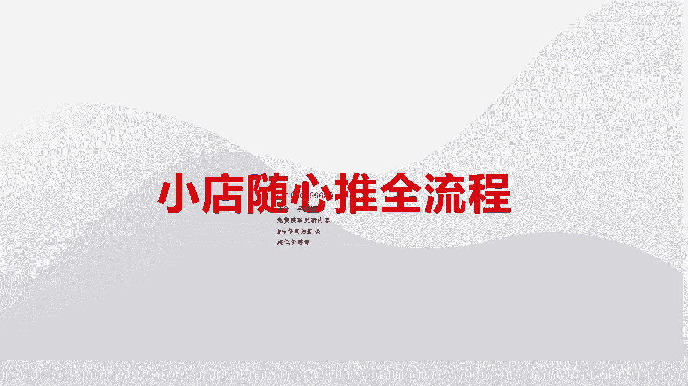
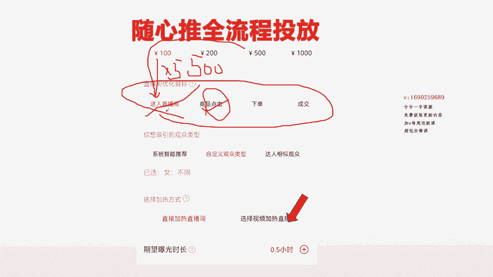

# 067 抖音电商直播投流起号课程 巨量千川全流程投放+小店随心推全流程+起号方式 - P8：峰教练电商-小店随心推全流程   小店随心推流程 1.mp4- - 早安睿睿 - BV1Nn4y197Wg

哈喽哈喽，欢迎大家来到线上课程哈，应很多的一些粉丝的一个要求哈，其实我发现很多的一些，因为我本身是做千川投放比较多，小店水星队，其实我投的也很多，每天都能投个一两千块钱，所以呢相对来说随心队对我来说。

最早的接触也是从随心队开始投的，就相对来说更加得心应手一些，对于很多的一些团队，就是小型团队做的不是很大的，或者刚起步的，在付费阶段纯玩自然流去几号或者问号的话，确实有一定的难度系数。

那么如果让大家去用直接干青川的话，对于很多小型团队或者经费不是很足的，又用不上，包括整个阶段也没到那个阶段的对吧，那么小店随心推，对于一些小团队或者厂关在几千，或者业绩在32万以下的。

就更加适合咱们目前这种状态，每天的付费额度可能会小一些，那么呢收入产出可能也会更好一点，能够慢慢的逐步的一步一步稳着往上面走，但是就是很多商家，当大家朋友们一旦打开了整个投放页面以后。

你不知道该怎么样去投，所以说呢大家做商家的，包括我也是一样，起步的时候也是在天天不断的去学习，你会发现很多天天泡在直播间，很浪费时间，不断的去记笔记，但是大家要明白一个问题。

线上所有的老师给大家去讲的那个笔记，记的那些方案，它只是一个方案，而不是具体的一个方法，线上老师讲的东西，也都是为了一个更好的去到线下的一个，去融合嘛对吧，这个大家都理解，但是今天给大家录的这一节课程。

主要是为了去让大家学会这个东西怎么去投，因为毕竟也收了大家那么点米嘛对吧，所以说感谢大家支持哈，那接下来呢我们就直接就进入到整个页面，让大家把整个今天的视频听完以后，那么你起码自己拿过来以后。

整个优化目标一看，脑袋里面一幕清晰，我应该搭建什么计划，我现在直播间处于什么状态，我需要提升什么东西，我该搭建什么计划，能够到达这样的城市的时候，其实你也把随心的整个就理解透了嘛，就这么简单嘛。

你就随心所欲的去想投什么就投什么了，所以一定不会让大家去说那个米白花了，给大家会上一些正儿八经的干货性的东西，把我学到的所有的用过的一些经验总结，就毫无保留的用这节课给大家去讲明白就行了。

不懂的你们来问我就OK了，所以接下来进入到整个一个投放页面来哈，投放页面来，我这个页面的话，因为我是截图的，所以整个优化目标这里边我只能截出四个出来，真正的优化目标其实它是六个，在这优化目标里边。

还有一个互动跟跟那个跟涨粉嘛对吧，还有就是评论跟涨粉，我这边写一下好嘞，写一下，把它写完以后，我开始用语言的形式给大家阐述这个东西哈，阐述把概念先给你们阐述明白了，首先你们要明白一个问题啊。

就是在讲这个板块之前，第一个是在投放之前打开页面，你最大的一个纠结就是我六个优化目标进入，点击转粉互动下单成交，我应该投哪一个，怎么去搭配投，这是大家最头疼的一个问题，对不对，那这是最头疼的一个问题。

所以呢我用我的经验给大家做了一个，正好一个很正确的一个分类，你听完过后，自己就能按照123就把这个东西很清晰的，知道我直播间适合怎么投，投什么了，听好了哈，第一个概念先记住了嘞，第一个概念先要明白。

一个简单的将是一个废话的一个话题，直播间挂小黄车的直播间，跟没挂小黄车的直播间是在抖音，后台是按照两个部门去考核他的，去控制它的，那么挂了车的直播间，它属于电商直播间，没挂车的直播间。

唱歌跳舞知识干货类分享的直播间，他属于娱乐板块的直播间，娱乐板块的直播间只考核一个东西，娱乐板块的直播间只考核一个叫什么，一叫停留对吧，第一个叫停留，来一停留，第二个是叫互动，对不对。

来然后就是那个转粉删转粉四，然后就是灯牌对吧，包括还有一个INNO5对吧，就这几个对吧，来这是我们内容直播间考核的几个数据，你们可以用笔去记一下啊，因为我鼠标写不怎么好写哈，就是停留互动转粉。

灯牌音浪在娱乐板块直播间里边，而电商直播间考核的数据是停留对吧，来互动对吧，来没错对吧，还有一个转粉是有一定的考核对吧，商品点击下单金额，GPM业绩，这些东西是一个点对吧，所以娱乐板块跟电商板块。

它是完全不同的一个性质的，所以你这几个我鼠标不怎么好写，你们要不懂的就问我，我直接那个跟你说就行了，或者打给你就行了，话这几个数字哈，停留互动转粉灯牌，然后那个GPMGMP业绩这些东西嘛对吧。

来GMV这些东西，所以说他两个之间考核的数据是不同的，那么接下来就一个问题啊，这个都不重要，重要的是你投放的过程当中，我该怎么样去筛选，我不断的优化目标，我该怎么样去筛选。

所以说第一个没挂车的小黄直播间，你们听好了哈，没挂小黄车的直播间，他所有计划都将围绕在进入互动转粉，还有另外一个数据来，这里边还有一个一个数据叫打赏，听好了哈，来因为没挂车的直播间。

他投的不是小丁水星队，他投的是斗家，斗家只有打赏进入评论跟转粉这四个优化目标，那么我是借用小店随心推页面，正好一次性给大家讲完，因为我们商家基本都是做卖货的嘛，所以就不去单独给大家列举独家的页面。

所以说听好整个没挂车的小黄车啊，没挂车的直播间，他将百分百将围绕在我们的一个内容指标，去建立，进入评论转粉打赏这种计划，它叫内容指标，知道吗，它叫内容指标，所以这样我一下子是不是把你区别开来了。

这边商品点击下单，来这三个它叫电商指标，那这样的话，是不是，一下子把优化目标给做了一个清晰的分类，先分类直播间属于娱乐直播间，还是电商直播间，或者说也可以叫成叫内容直播间，还叫电商直播间，先分完这个类。

再把所有的优化目标进入，点击下单成交，评论转粉这些再把它做一个分类，331分类进入评论转粉属于内容板块，那么点击下单成交属于电商板块，这样直播间分开来了，优化目标又做了一个分类了。

接下来这三个板块全部拆一下，好嘞，来全部拆一下这三个板块，大家听好啊，这三个板块来听好的哈，所有的内容直播间他将百分之百刚说了哈，所有的内容直播间将百分之百围绕在来，内容直播间百分之百围绕着进论互动。

转粉去见，对不对，互动还有一个转粉，这样去建，来这三个数，正好这三个也是这三个也是内容指标对吧，来，那么所有的电商指标大家记住了啊，所有的电商指标，商品点击下单成交，这属于电商指标，对不对嘞。

所有的电商指标，那么我们所有的卖货的商家，大家都是为了卖货，这才是我们关键的一个点，我们建的计划大家听好了，挂了小黄车卖货的直播间，你的终极目标是为了提升gr，目为提升业绩，对不对，没有错吧。

所以说你是为了提升GMV，为了提升个人UV价值，所以你们在建的每一条计划的时候，你们一定考核的是成交数据，所以说他一定围绕的是电商指标去建，所以听好记住下面这句话，80%就是挂车的电商直播间。

你将围绕着80%，围绕着商品点击下单成交这个板块去建，剩下的20%将围绕着内容板块去借来，这个要注意一下哈，就是挂了车卖货的直播间，为了提升GMV，你建的计划，80%将围绕着电商内容去建立懂吗。

电商计划就是商品点击成交计划去建，等会我会一个一个给大家拆七，点击下单成交的区别，知道吗，那剩下的20%呢，将围绕着内容这个板块去建，立为什么哈，比如来打个比方来讲，我一个直播间，现在我开始挂车。

我卖货，我在线人数不多对吧，我是不是需要键进入结合点击，结合下单或者结合成交这样结合去打直播间呢，所以说虽然我的直播间为了提升业绩，我主要的优化目标将围绕在商品点击下单，成交建立。

但是我为了拉在线做铺底的话，我是不是要拿出一部分预算去把战线做起来，或者说我是一个新号，我想增加我账号的粉丝量，在直播的过程当中，我是不是可以去见转粉的计划，对不对，那是不是可以加转粉的计划。

如果说我整个公屏互动不强，那么我是不是来这卖货，同时我还可以去借互动计划进来，这样的话结合我的下单，结合我的点击下单成交，这样同时去完成直播间了，对不对，所以这不就形成了我们计划的搭建吗。

所以呢现在给大家做一个简单的一个捋一遍哈，先第一步，先把直播间脑袋里边又有一个思路是废话没挂，小黄车属于内容直播间，挂了小黄车属于电商直播间，先分开这一个点，这是第一步，第二步。

把所有的优化目标做一个分类，那把优化目标做一个分类，优化目标分类完以后呢，就是就区别开来内容优化目标与电商目标来，那么就当我们这个地方就做了一个分类，这边我插一下哈，再给你们过一遍哈，一定要过明白。

这样的话才值哈，来这边的三个来进入评论转粉，它是一个内容指标，那么这边的三个电商，这一个呢它是一个电商指标，这三个对吧，来所以内容指标没挂小黄车的直播间，百分百将围绕着进入评论转粉去见。

那么商品点击下单成交，挂了小黄车卖货的80%，将围绕在这个地方去建对吧，80%围绕这个地方去建，20%围绕着这边来建，这样之间两者之间是不是就形成了一个结合，这三个点是不是给大家打通了，串起来了对吧。

一个先区别直播间，按一个区别优化目标，我到底应该打开手机，我要投什么，现在我知道我是什么直播间了，我应该投什么呢，对吧，知道怎么投，我直播间卖没卖货该怎么投了，这个这个弄明白了吧，这个没问题哈。

所以说再给大家讲一个逻辑，这个就差这个差不叉掉都行啊，给大家讲一个逻辑，你们建的每一个计划，首先你们要明白一个问题，因为我这是给大家的一个交付课，也没有任何的铺垫，埋雷在里边，建的任何一个计划。

不是希望计划买人进到直播间，而是希望建每一条计划，让平台把我的直播间曝光给更多的，跟我账号标签属性相同，且有我同样又我建立了优化目标一样的人群，看到我的直播间，然后通过他来。

然后通过人货场的形式进入到我直播间这边，我全插了啊，那这个能不能听懂，就是很多人会认为我建计划是买人来直播间，其实他是一个错误的观念，你会发现你同样一个投手老师，然后投在不同的直播间投的同一个优化目标。

他来的人群都不同，就是我现在给你讲的这个逻辑，建计划的背后的底层逻辑，是希望把我的直播账平台，把我的直播间曝光给更多的，跟我账号标签观看行为属性相同的人群，并且有过比方说我建的商品点击对吧。

那么他有过比如说我是卖男装的，那么我的直播间曝光给喜欢刷男装的，这部分人群看到，并且我建的是商品点击这一条计划，那么且有过商品点击的人看到，然后再形成我直播间人货场什么三秒场景啊。

30秒产品一分钟看主播的形式，进入到我的直播间来，这个能明白吗，这是一个关键逻辑点哈，一定要明白这个逻辑点，所以前面这12分钟的时间，先给大家做简单的去把优化目标做一个分类，这样你能分开来，电商直播间。

内容直播间，他俩之间有什么区别，优化目标在哪里，你下次再打开这个小店随心队，这个整个投放的页面的时候，你就不蒙了，老大你就不懵了，你知道哎，我直播间现在好像在线不高，我需要拉一条进入计划哦。

我现在在卖货，我需要提升加MV，我主要可能将围绕在点击下单成交，那我到底见点击点下单还是点成交额呢，我下一条视频再给你录，我就不一次性给你录个一小时或者半小时的，这样的情况下，你听着也累。

然后有时候忙的时候还要来回倒对吗，所以说我就这个前十二三分钟的话，就给你分析完这一个板块，那么正好在结束的时候给大家带一个东西啊，很多的时候我们在线上的老师都在讲，就是小店随心推投放的过程当中。

这一个板块就是小金额多批次，我的预算是500对吗，来我选择100块乘以五，同样是选进入，同样是选进入，选100块乘以五，这种其实是一种不能说是完全错误的，因为线上毕竟是线上或者线下更好合作。

但实际操作过程当中直接直接拉就行了啊，直接500进入就OK了哈，没有这个大家脑袋里面逻辑打开一点哈，因为如果说很多老师都在讲，他妈的直接500拉过来，直接干进入那个线下课怎么跟你讲啊对吧。

所以一定是要变着不一样的方法给到你，让你感觉诶不一样懂吧，但是拆开来也没有错哈，拆开来的情况就脱了裤子放屁，多此一举懂吗，嗯解释的解释的理由就是小金和多皮质，万一有某些哪一条跑不好。

那么我们就用那个其他的跑的好的取长补短，如果说我某一条跑的特别好的情况下，那么是很好，如果我这一条跑的都不好，我500块钱打进去，那我计划失败了，这个解释也对，但是我们实际操作过程当中。

用不着那么费劲的哈，投那么多条的哈，但是我待会会教大家怎么打散，去投各方面东西的好吧，所以前面这一节就这么多，让你们去理解就OK了。

