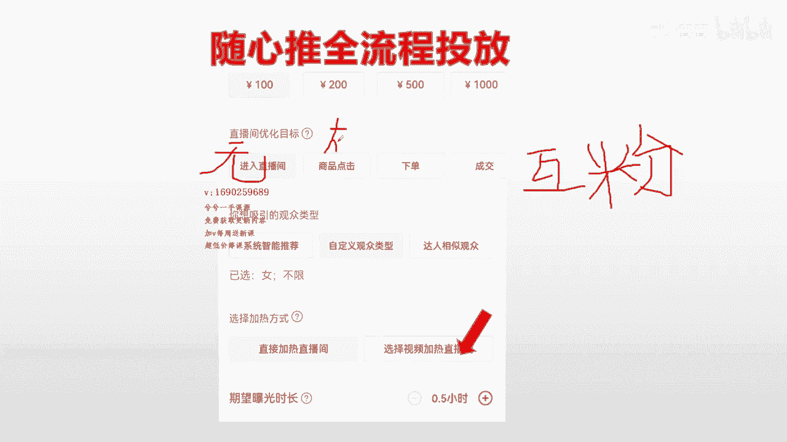
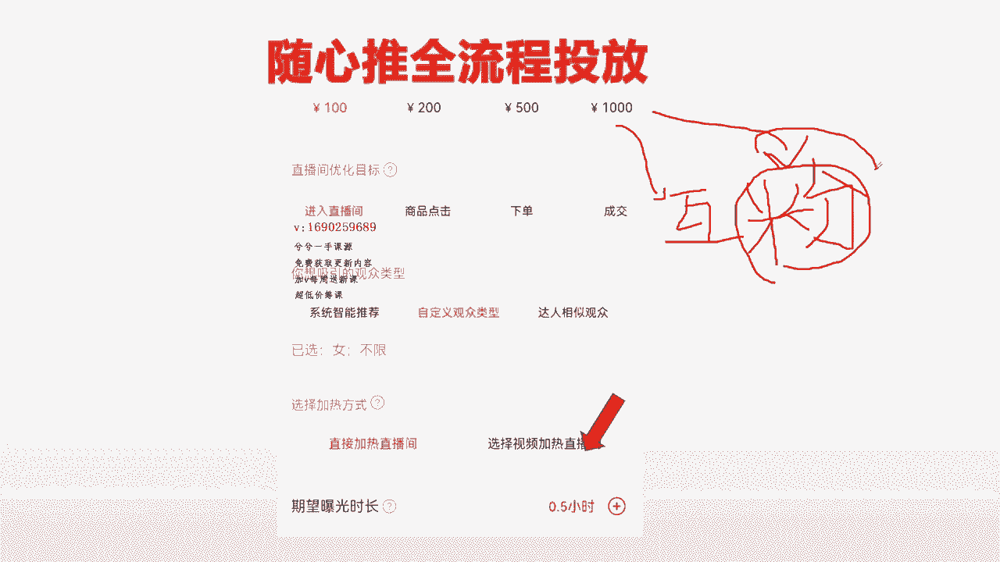
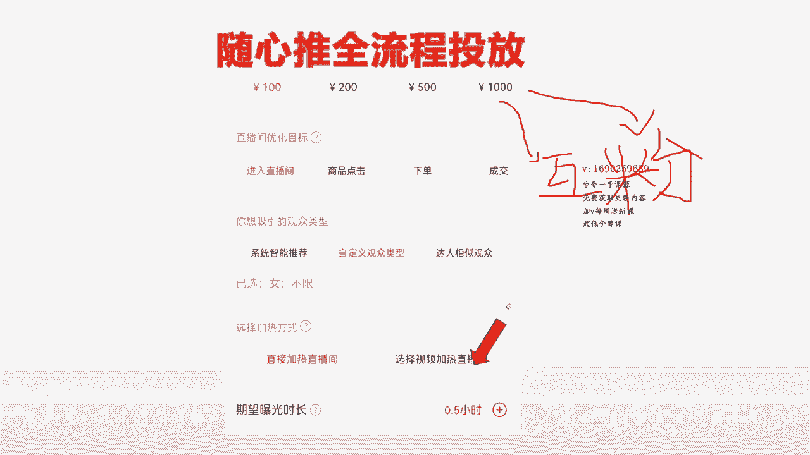
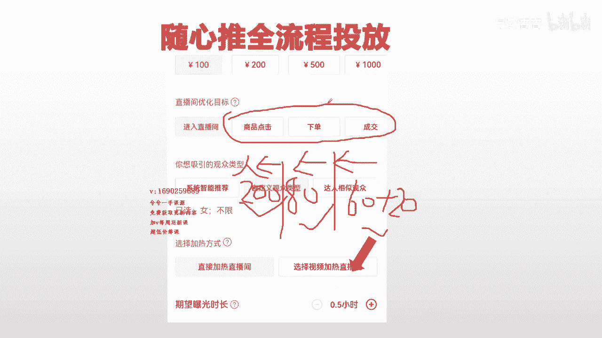
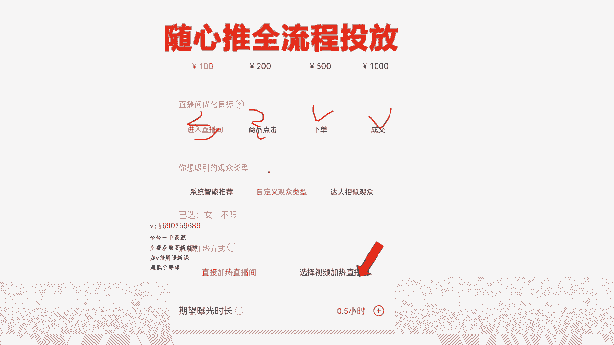

# 067 抖音电商直播投流起号课程 巨量千川全流程投放+小店随心推全流程+起号方式 - P9：小店随心推流程 2.mp4- - 早安睿睿 - BV1Nn4y197Wg

哈喽哈喽好的，接下来我们进入到第二段里边来哈。

这一段的话，给大家去拆析我们每一个优化目标哈，把这个给你讲明白。

一定让你们的两个九的笔画的值哈，这个一定是直的，不会有谁这么累的哈。

咱们这就算是一个公益课了，那么首先第一个还是那句话，就是整个优化目标，因为我截图我截不出来，我只能截出这四个出来，后面还有互动。

就是评论哈对吧，互动就是评论，还有一个粉丝对吧，还有一个粉丝量，这一个一共是六个优化目标，那么刚刚在上一个视频里面。

我把这几个优化目标，它本身的一个内容跟电商做了一个分类，所以这样，基本，你大概脑袋里面已经有了一定的一个框架了，就是我直播间应该怎么去建呢。

听好了哈，最后的时候我去多建几个计划给你们组合一下，这样你瞬间就明白怎么去搭配了，懂了吧，来现在给你们插画每一个优化目标哈。

听好了，上面这个出价，这个我在上一个视频结束也给你们讲了哈，就该出多少预算多少，你自个看着办，这个谁没有人拦着你，你把他选择小金额多批次没有错。

选择直接一步干，那也是正确的，这个没有错啊，首先第一个问题进入直播间，这种优化目标大家都知道，就是把直播间曝光给更多的，喜欢刷这样直播间的人群。

比如说我是卖女装，卖羽绒服的，那么平台就会我建这一条计划，就会把我的直播间曝光给更多的，喜欢刷女装的这一部分人群，看对吧。

然后他通过我的人货场会进来，这是一个进入直播间，进入直播间，相对来说买进来的人群，我们就把它说成要买进来的人哈，可能相对来说也就0。51个吧。

最多0。51个了哈，100块钱的计划能干来一两百人是很正常的哈，干来200人很正常哈，这里这个不重要，这个其实大家我相信通过我简单的一说。

都能理解，就包括商品点击对吧，是把我的直播间曝光给更多的，喜欢刷我同类目的产品的直播间的人，并且进入到有点击的行为的人群，看到下单的话，就是把我直播间曝光给更多的跟我账号标签，同类目的人群。

并且有过进直播间，并且有下单行为的人看到对吧。

所以说这个理念很清晰，这个不重要，重要的是要给大家讲什么东西呢，就是在我实操的过程当中啊。

我会发现一个问题，与其去建进入计划。

不如去建商品点击计划，因为进入计划跟评论计划互动计划，它属于内容板块，进入计划的人群呢，他没有电商属性，没有点击下单成交的这种那个行为，但是呢它标签是一样的，从人量上面来讲，听好了。

从能量跟我们投产上面来讲，进入计划几乎是无头产的。

听好了，进度计划几乎是无头产的，而商品点击其实是有投产的，而且还不小，商品点击跟下单的投产之间。

说不准谁高谁低来，但是他两个之间又有什跟进入之间又有什么，这两个之间有什么关系呢，他两个之间进来的人群量上面差不多大，记住了，这是经验哈，你们投了以后，你按照我说的这个经验，你投了以后你会发现的。

你与其去现在直播间在卖，比如说卖卖苹果，你在买苹果，你投一条进入计划，投100块钱，还不如投一条商品点击计划，要不然你两条都投一条，你试一下，最终得看他的计划的曝光量。

还有进入率，看看能进多少人，你会发现这两个差不多，所以说我这里想告诉大家的是，其实与其既然进入，不如进商品点击，那么我在操作过程当中，最高的一条商品点击计划，因为直播间它标签很正，他的转化很好。

小店随心推，跟青川其实它有一个相似点，就是直播间转换好的时候，那么他转换也好，它带来的人也多，他转换成成那个投产也高，我最高的时候，我见过一条计划是599个人，点击就进入近100块钱，卖羽绒服的话。

就去年冬天不是我建的。

是我让商家自己，我让他去搭配，就100块钱搭配一个商品点击，最终来的是599个人。

这一条计划里说了，他进来一个人，其实也就一毛钱嘛对吧。

那一毛钱对哦，还不到一毛钱的话，就啊一毛钱的话多少，一毛钱的话，十块钱进100个哎，两毛钱呐，所以说这种计划是不是很便宜。

所以对大家记住一个这个点哈，与其去进建进入。

还不如建商品，点击呢进入无投产商品点击投产很高，但是不是绝对性的，从我操作的过程当中来讲，基本差不多，包括我自个建的，就是我最多的经过400多个的，正常两三百是很正常，一条直播间只要转起来以后。

一条进入机啊，商品点击计划，进来个两三百人是很正常的一个现象。

这个能不能听懂，这个能听懂应该没问题哈。

但是你要进进入进入计划的话，他确实来人也多，但是他的没有投产，而商品点击这一个它有投产，所以说这两个之间，我相信大家脑袋里面有一个区别，你可以自己去试哈，可以自己去试，如果你是这一条计划。

你纯属是为了去让它就是保证占线，比如说战线只有十个人对吧。

我想把战线拉高一点，然后后面建下单或者成交计划来去做成交。

前面建进入或者建点击去把战线拉高，用后面拉高以后，人有那种盲羊群效应嘛，对嘛对吧，有从众效应，所以说为了后面更好成交，那么你如果这样想的话，你就单独去建进入的情况下。

那么他有可能进来人的速度会稍微快一点，高一点，但是他跟商品点击几乎是差不多的，所以这个地方有一个这是一个经验哈，你们自己去建的时候去注意一下就行了，来这是一个这一个去把它区别开来。

然后评论评论转粉这一个板块。

听好兄弟们来评论转粉这个板块的情况下，对于很好理解对吧。

来就是我一条计划，可能说1000嘛对吧，1000干进来这一条计划他能涨多少粉吗。

就在我直播期间能够曝光多少的那个曝光量，出去，把我直播间曝光给同类目，比较喜欢点关注的人看到吗，能涨多少粉吗。

正常情况下的情况下，那么他应该是在100块钱能涨个100个粉左右。

八九十这样的，差不多了哈，就这么多哈，所以说呢这条计划基本一般，我们平时在直播过程当中用不上这种计划，我给大家简单带一遍，包括互动计划。

也是互动计划的情况下，如果说是本身我直播间，公屏上的互动量大不起来对吧。

我需要蓝色的白印，大屏上，我的互动频率不够高对吧。

包括我大屏上面涨粉，这个来我的涨粉比例呢3%左右。

2%左右不够高，那么我可以建一条计划，建涨粉来补充我数据。

大屏上的数据，这个是没有错的懂吗，这个是没有错的，你们一定要灵活的明白这些底层逻辑。

当你明白这个东西以后，那么接下来你就完全没有问题了，知道吗。

你就自己会建了，所以计划我说的一定是，会把每一个优化目标给你们拆解清楚了以后，你想怎么建就怎么建，所以现在来讲的话，那我直播间呢，我开播以后我能不能见转粉哦，可以见，完全可以见，我能不能见互动啊。

公屏互动不高，我完全可以见，但是公平的互动不高，我完全可以让主播去拉一波互动嘛对吧，我可以上个福袋产品嘛，去拉一个互动，那一条互动凭我的经验差不多能干来的哈，听好了哈，一条互动计划100块钱能干了。

30条到50条互动就差不多就这么多了。

那他也没有什么投产。

就三五十条的互动，那与其删50条的互动，还不如拉两把呢，包括删50条里面互动。

还有扣一的，还有扣666的，这些都算哈，你只要见了你就知道。

你就会发现有扣666的，有扣一的，有扣交朋友的都有的，所以与其建这种计划的情况下。

还不如去主播去拉一拉，所以这都是实操的一个经验哈。

就是你们每一个优化目标我都给你们拆清楚，这是一个实操经验，那至于能不能接这样的计划呢。

你高兴你就见你不高兴你就不要建，只要你懂得它背后是干什么的。

你就行了，这个可以吧，这个地方OK没问题对吧，来转粉的话也是一样，我喜欢，我想在直播期间把直播间曝光一些，更多人让我涨点粉对吧，我那我也行，那那就曝光转呗对吧，那我觉得我不要我直播间。

我不要他直播间涨粉，我可以通过视频通过投抖加涨粉或者慢慢累积，我不缺。

那就不投嘛，这种计划就完全可以把他打给拉布差嘛，这种计划就完全打个差距。

不投就行了嘛，所以至于直播间投什么关键性。

其次就这几个，像这些辅助性的计划进入评论转粉，这些是属于辅助性计划。

你一定要明白它背后逻辑，哎我可投可不投，根据我自个想想咋滴就咋滴。

这下没问题，懂了吧，所以这个懂了哈，插一下好嘞，这个插一下。

其实我发现我要跟他们讲蛮长时间的，这笔钱一定要让你们花的值。

知道吗，而且正儿八经是实用实操的，不存在任何那些扯犊子的，所以下面一个啊挺好的啊，讲这三个前面进入评论转粉，那三个应该听明白了哈，进入是必然是要建立很多直播间都要搭配，进入的话，那在在直播间起来过后。

战线稳定以后，那么这个时候不需要搭配，很多的时候，我在第一个视频的时候给大家讲了，他怎么去搭配对吗，需要保证铺底在线吗。

讲这三个东西，这三个优化目标该怎么去选择，该怎么去建立，听好了，来第一个商品点击简单。

有刚刚有简单的给大家做了一个解释，他是有投产的，有产出的。

而且产出还不差，听好了哦，点击的产出还不大，其实他什么道理啊。

就是量大出奇迹嘛，因为他一条商品点击，如果直播间好的情况下进来两三百个人。

两三百个人的情况下吗，那就按照一定投产比，按照一定的购买率的情况下。

那么他也有啊对吧，他也他也有一定的投产了，对不对呀。

所以呢商品点击是来人的，来人比较多的嘞，那从来人角度来讲呢，商品点击一定大于下单。

下单一定大于成交，这两个之间买人一定是不一样的哈，听好了哈，进来人群的数量一定是不同的，但是从精准度来讲，先先不讲精准度，先讲人群的话，大概的一个意识哈，一条商品点击能干来200左右吧。

我我写一个大概数据哈，200是没问题，100多200是没问题的，这是没问题，一个下单计划能干来，差不多也就是七八十个人吧。

80左右吧，80~100就这么多，来这边给给给区别一下。

然后一个成交计划挺好的哈，60左右的人基本就这么多。

大概这是大概数字，基本这么多，根据直播间转换情况，在原有的基础上可能会添加个二十三十左右。

就这么个就这么一个数据，但这个这个不一定哈。

这个商品点击这一个有可能干哪一个，差不多干了个四五百五六百都有的哈。

所以这些数据下单跟成交，这两个之间基本也就百八十个人了。

所以从人量上来讲，我建这一条计划。

这三个之间一定是点击下单，成交一个比一个慢。

这是从人量上来讲哈，从量上面来讲，那么从精准度上面来讲。

大家听好了，从精准度我们从精准度上面来讲，来。

从精准度上面来讲的情况下，哎呦一眨眼这一个视频十几分钟下来半小时。

又来，从精准度上面来讲，大家听好了，我们在精准度上面来讲。

一定是越来越精准嘛对吧，来这一个是最精准的嘛对吧。

来成交是最精准的，但是成交的人流量也是最贵的嘛。

刚刚跟大家说了嘛对吧，来精准对吧，来然后这一个往这一个对吧。

一个一个的一个一个越来越精，从精准度上面来讲。

这一个是点击是最不精准的，下单是最稍微中间值一点的。

成交是最精准的，所以说这三个优化目标呢，这样大家也能够听明白他的逻辑，所以你在投放的时候，这三个都是能提升ROY的，但是下单跟成交一定基本的，他投产会比商品点击投产会高一些哈，这个是必然的。

大家对不对，这个大家不用说，大家肯定都理解，所以呢你能够把它理解成这三个之间呢。

这三个之间你能理解好啊，从量上面，从速度上面。

那么点击它是最快的，从那个我们精准度产出上面，那么它是最慢的。

但是一般情况下不用投成交，一般我们只投下单就行，知道吗，成交跟下单之间有90%的相似度。

它有90%的相似度，所以说能下单的。

他的成功率几乎占90%，会成交，所以说与其去投成交。

不如投下单，他的成功率会更高，因为他人群相对来说会稍微的。

就是没有他那么精准，稍微犯一点点比它，但是它量会大一些嘛对吧，他进来的速度也会快一点嘛。

所以这个板块能不能听明白，你们后面有不懂的也可以私信问我哈。

谁给你们一个一个把你们拆机清除了，这个优化目标，这样的情况就给你们拆机清除了。

所以你们现在我把它叉掉啊，你们自己去记就行了啊，自个去动脑筋去想来这个优化目标。

我把它拆掉，听好了。

来，来拆掉，所以说你在建计划的时候。

大家现在在建计划的时候，建商品点击下单成交，在卖货的过程当中，你想建计划。

想建投产，想有想有成交的时候，你这个时候脑袋里面就有一个思路了，我是建商品点击呢，还是建下单呢，还是建成交呢，我如果直播间想他进人，现在在线也不多，那么我虽然做了直播间经录，去做了铺子在线了。

或者说是我直接就选用商品点击，我多追一点预算，因为他本来进来的人跟进入就差不多多，我把它当成进入计划来看待，那我占线也不高，我建一个商品点击，把它当成进入计划来看，那哎他进人速度不就稍微快一点嘛对吧。

那我就可以选择商品点击了，对不对，诶，他正好这一部分人群还能有些投产嗯，他比进入它比进入会更好。

我建议一个商品链机，那我主要是为了追求在线呢，那我能不能诶让他多来一些呢，就像珍珠一样，我建两条呢，诶我建两个商品链接不也行吗，对吧，我让战线高一点，流速快一点也可以啊，那我建两个也行，对不对。

我主要是为了追求成交啊，对不对，那我这个时候再追下单不就行了吗。

或者把成交来追上，这样不就哎直播间搭配好了吧。

所以这个地方稍微你们要没听明白的，在这个环节就这个视频开始的时候。

这个地方你们再多听一些，这个地方就是进入跟商品点击，在人量上面它有着貌似相同的一个点，所以说你们在投放策略过程当中诶。

我想要他战线多一点，我可以用直播间进入这个计划来拉战线，我也可以用商品点击这个计划来拉在线，但是呢直播间进入，可能相对来说会比这个商品点击，拉闸线会稍微的快一些，人群上还是要多一些的。

因为他没有电商属性，但是我从多轮投下来，我感觉数据差不多的时候，我就不再投，进入这种计划了，进入这种计划他他他带不了产出，知道吗，所以这个地方明白了吧，所以你看我上面把你区分内容优化目标。

给你区分完这一节，我把你所有的优化目标再把你拆解完，剩下的时候已经明白很多了，来接下来下一个视频讲下面这个板块，把这两个板块明白完，然后最后再讲一个叠加投放给你看，所以这不就会投了吗，就这么简单吗。

OK对吧，非要整得那么复杂，干什么呢，虽然是99，但是一定也让你学到东西，真的是学完过后不用再去趴直播间了。

不懂的问我过几遍就过会了好吧。