# 083 抖音同城生活-健康垂类0到1运营：入驻-暴力起号-规则篇-消费直播篇！ - P11：11-达人团购带货计划 - 早安睿睿 - BV1Fx4y1n7Ba

什么是通用计划。

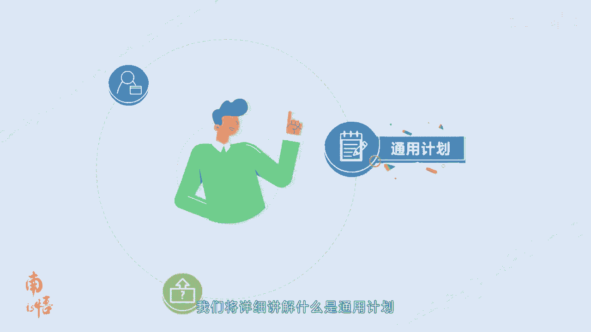

以及如何发布通用计划，通用计划是原通用佣金功能的升级。

是商家与达人合作的一种计划类型，商家可以给团购商品创建通用计划，所有生活服务达人都能以视频或直播的形式，推广商家的团购商品，用户到店核销后。

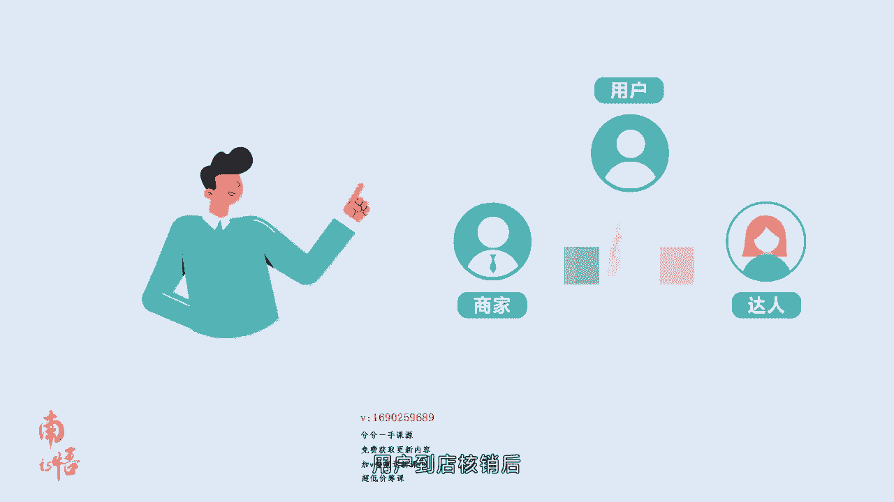

将核销金额按一定比例分成给达人，那么如何发布通用计划呢。

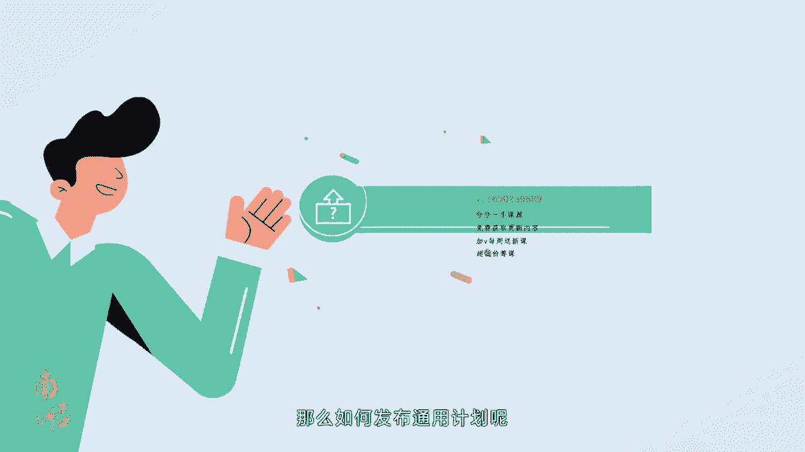

打开抖音来客app，选择达人带货，点击发计划，选择通用计划，我们就可以进入通用计划的发布页面了，你可以选择至少一个内容形式，根据需求选择让达人在短视频还是直播间带货，计费方式。

这里仅支持按合销量结算的方式，下一步添加你想要设置通用计划的团购商品，这里需要注意，已经发布过通用计划的商品无法再次发布，选好商品点击确认后，需要对该商品设置佣金比例，可设置范围为1%至80%之后。

达人带货售出并核销后，达人就可以收到这个比例的佣金，这里可以打开达人推广时通知我的开关。

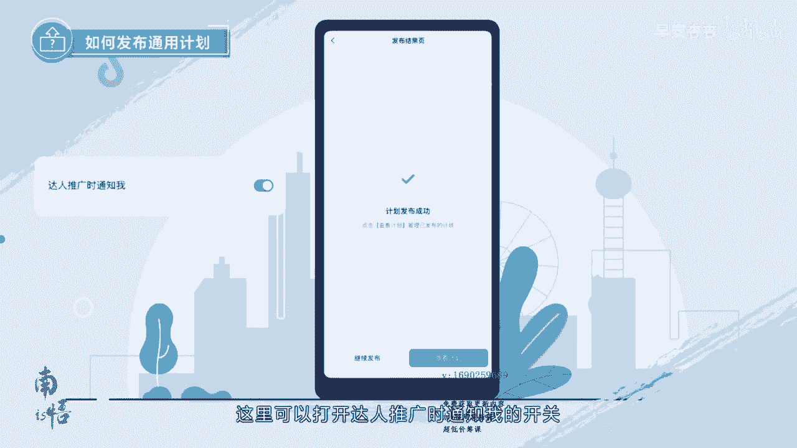

这样有达人带货的时候，商家就可以收到消息了，招募计划是商家与达人合作的一种计划类型。

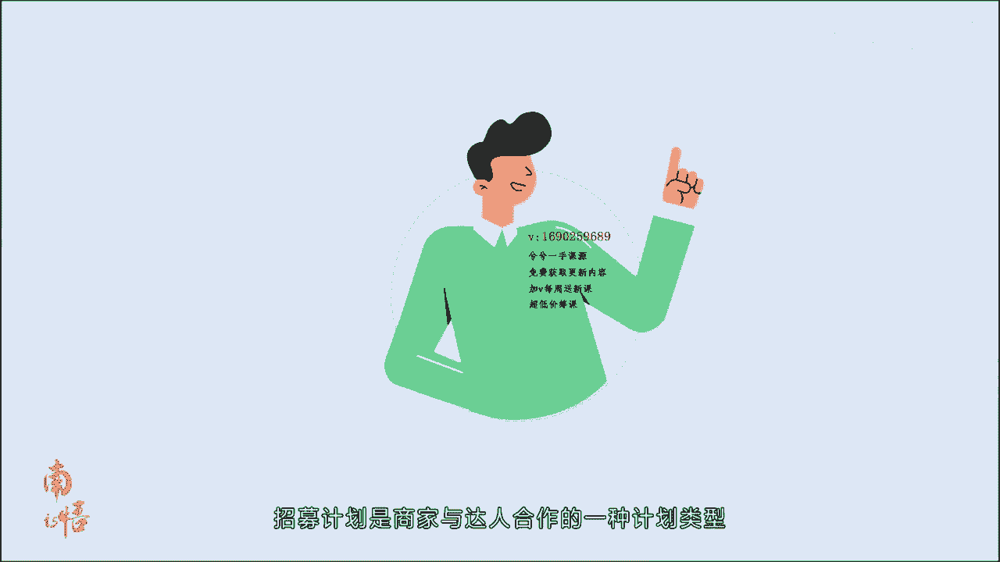

商家可以在平台针对特定等级或粉丝量的达人，发布招募计划，达人在合作广场中可以报名，商家确认合作以后，达人再开始进行履约的合作模式。

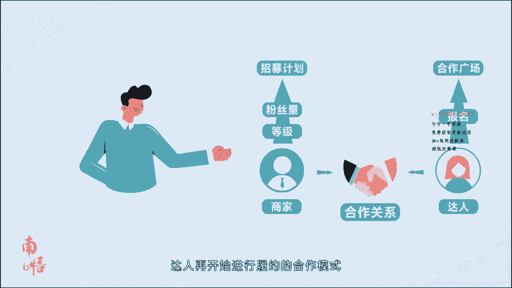

目前已支持按合销量结算，那么如何发布招募计划呢。

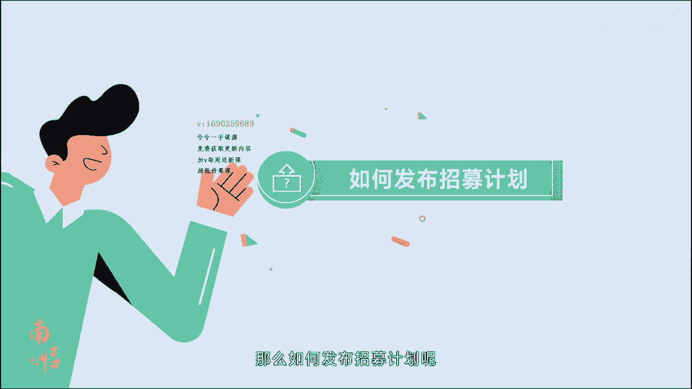

打开抖音来客app，选择达人带货，点击发计划，选择招募计划，我们就可以进入招募计划的发布页面了，第一步需要我们填写一些计划的基本信息，内容形式和结算方式都是默认的，暂时不支持其他选项。

计划名称由商家自由填写，建议以商家达人都方便查找为原则，编辑计划名称，招募周期是指达人可报名的时间范围，若选择长期就会一直招募。

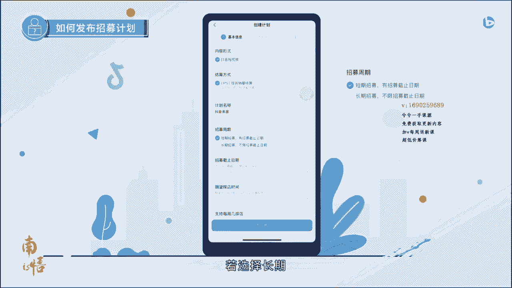

直到达人招满为止，若选择短期招募，则需要在下方填写具体的招募截止日期，商家也可以填写期望探点时间和支持。

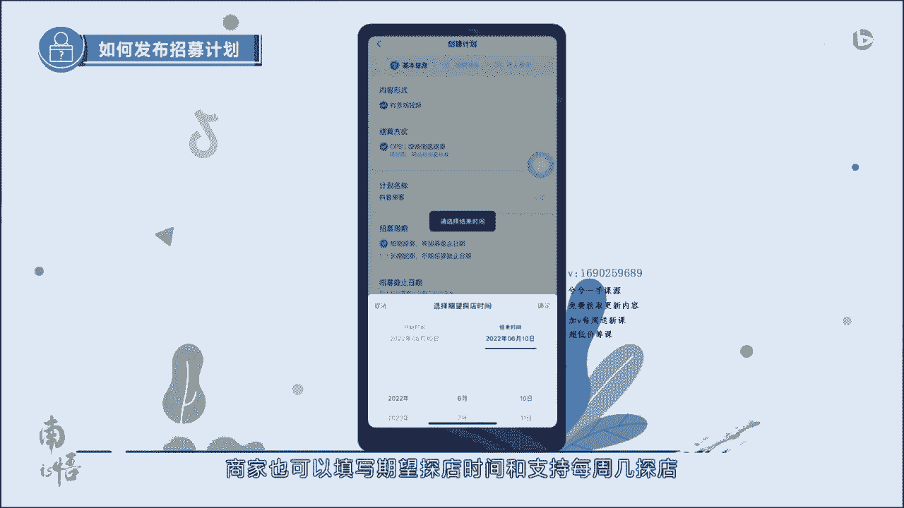

每周几探店，因为要接待达人探店，所以最好是选择店内不忙的时间段。

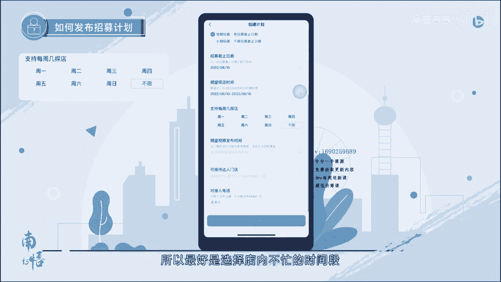

希望视频发布时间非常重要，考虑到达人视频需要一定拍摄制作周期，所以这个时间段建议长一些。

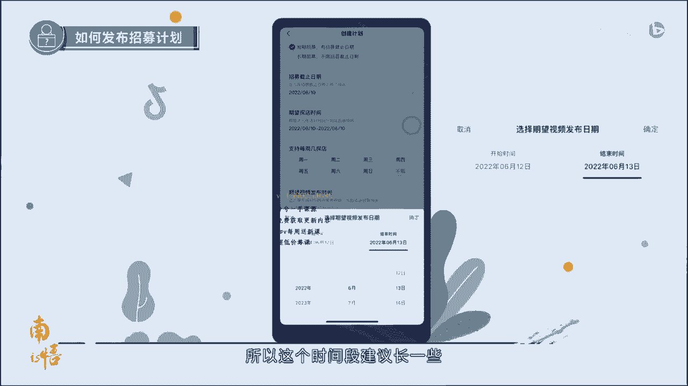

如果达人在这个时间段之外发布，是没有办法获得佣金的，选择可接待门店和对接人电话也是非常重要的，请确认该门店以及对接人，知晓会有达人前去探店，并保持电话畅通，第二步需要我们选择团购商品并设置佣金。

这里可针对不同的商品设置不同的佣金比例，商家可以根据套餐的利润空间，来设置给达人的佣金比例，佣金有效期也需要结合我们实际需求来做选择，超出佣金有效期后，达人就无法获得分佣。

第三步需要我们填写对达人的要求，首先我们要填写招募达人数，最多支持200人，其次我们需要选择达人要求，目前支持选择达人等级要求和达人粉丝量要求。

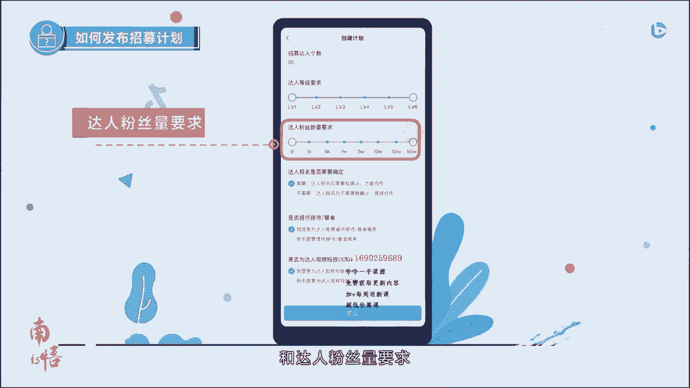

在达人报名是否需要确定中，若商家选择需要，那达人报名后要经过商家同意才可以开始合作，若选择不需要。

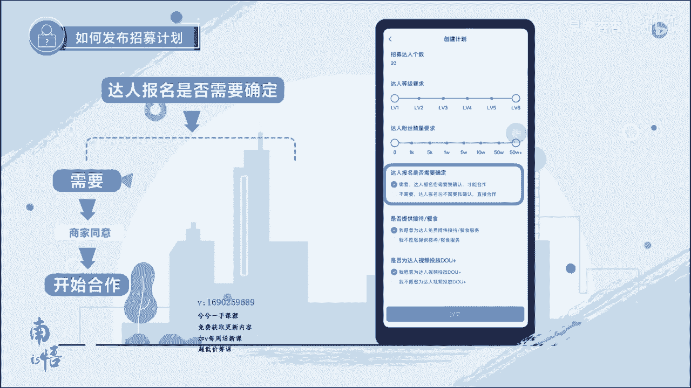

那达人报名后便可直接开始合作，最后设置好是否提供接待餐食，和是否为达人视频投放度假。

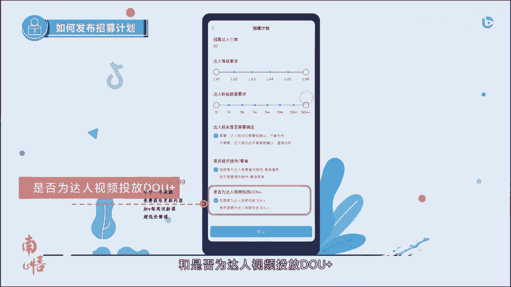

当然商家愿意提供的越多，就会有更多的达人来报名哦。

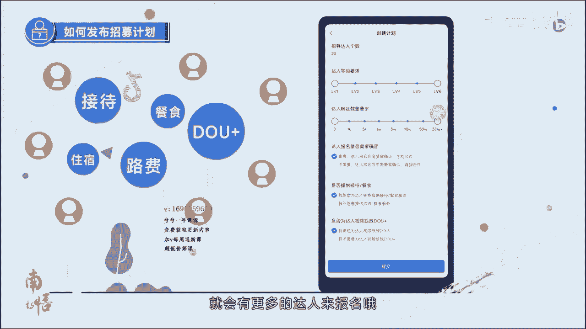

全部填写完成后，点击提交计划就发布成功了，发布成功后，我们可以在管理计划页面，查看已发布计划的招募进度，以及对已报名达人进行确认，相关的推广数据。

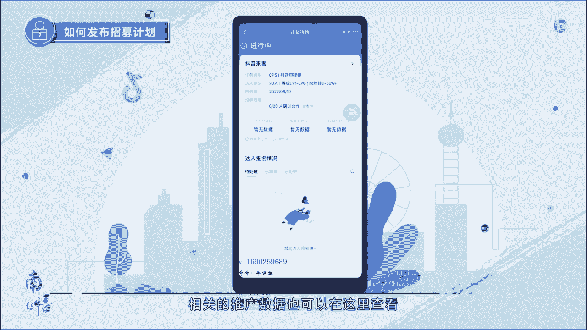

也可以在这里查看什么是一口价定向计划。

以及如何发布一口价定向计划，一口价定向计划是指可以针对指定商品，给指定的达人支付一口价佣金，经指定达人可以带上商品在短视频进行售卖，资金由平台担保，合作完成后结算给达人，该计划类型需要商家提前充值。

所以在发布计划之前，我们先来了解一下如何开通充值账户。

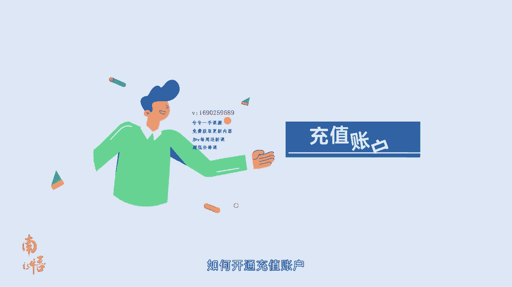

打开抖音来客app，点击营销推广右侧的更多，点击佣金钱包，按照页面提示完成开户就可以了。

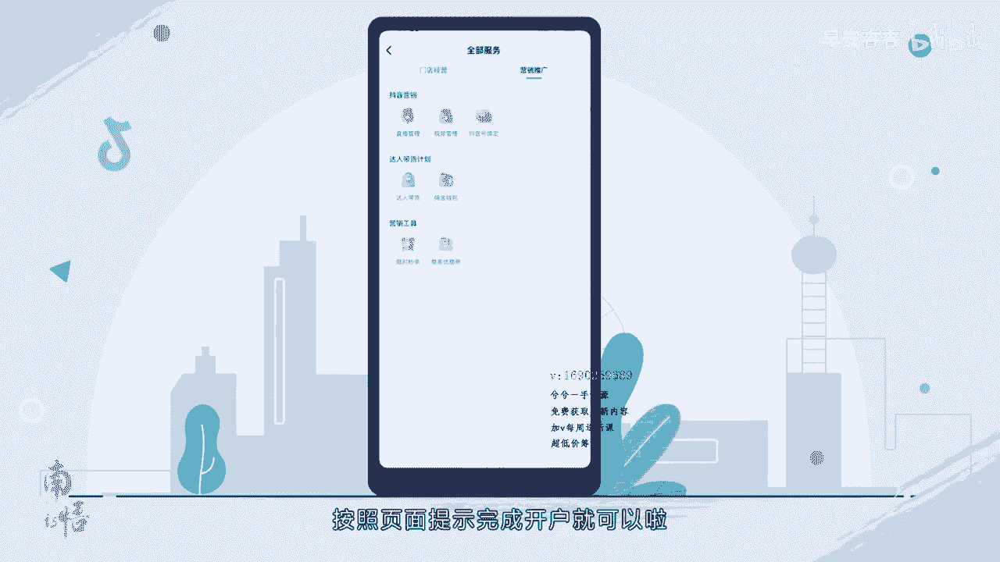

接下来我们来讲解如何发布一口价定向计划。

回到抖音来客app首页，选择达人带货，点击发计划，选择定向计划，这里需要提醒的是，目前一口价定向计划仅支持达人，通过短视频帮助商家带货，选择一口价的计费方式之后，点击下一步计划。

要求这部分我们要先选择营销目标是什么，如果选择团购推广的话，在下面的营销信息，我们就需要选择特定的一个团购商品，如果选择门店曝光，那在营销信息这里，就需要我们选择要推广的门店，商家名称不需要填写。

会自动和我们商家的资质相关联，计划名称用于商家和达人快速找到计划，建议采用双方都方便识别的格式，指派达人中需要商家输入达人抖音号或用户名，可以同时指派多名达人，选择达人之后。

要填入支付给达人一口价佣金金额。

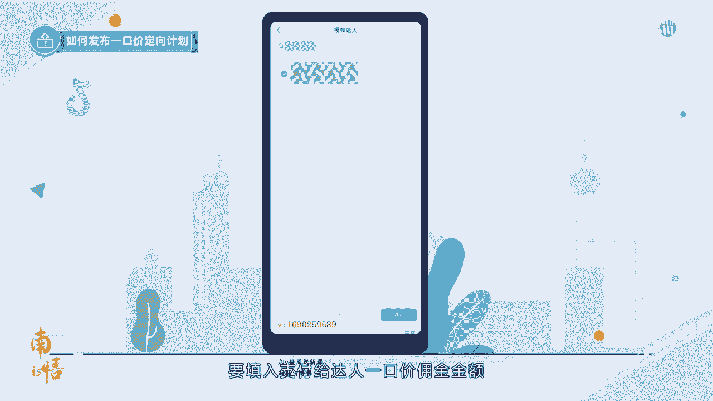

这里需要注意的是，商家和达人一定要约定好金额。

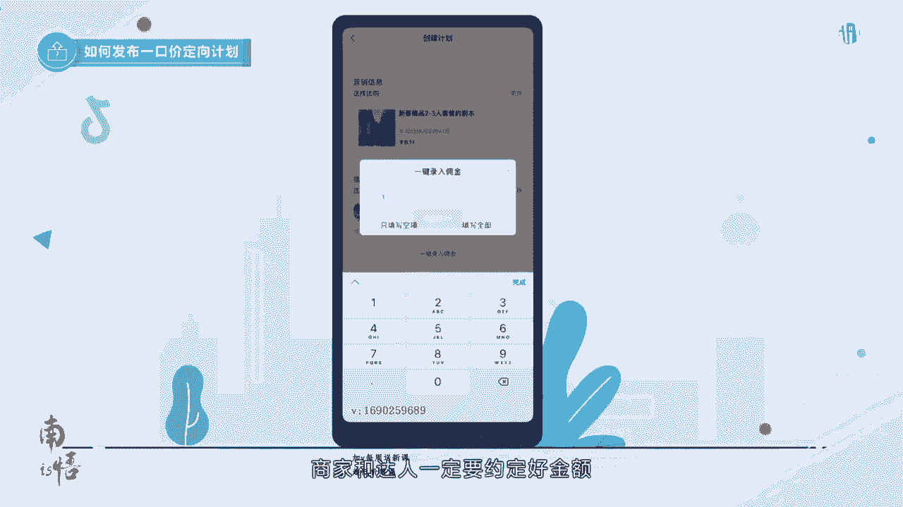

再在线上进行填写，否则金额与达人预期不符就会拒绝合作。

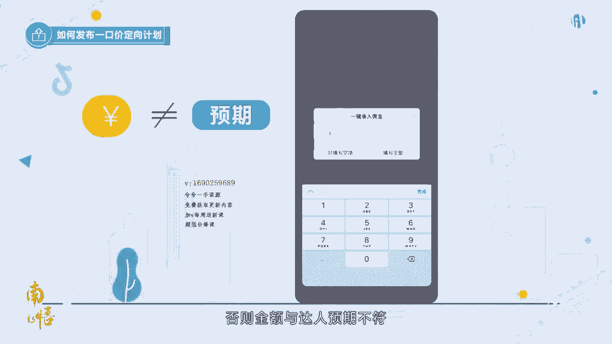

填写完所有信息后，点击下一步，对所有信息进行确认，没有问题的话，点击下一步完成支付，这时如果余额不足的话，会提示先去进行充值，根据页面引导，充值成功后即可继续发布计划，计划发布成功后。

商家可以在管理计划页面，查看达人是否接受任务以及达人履约进度。

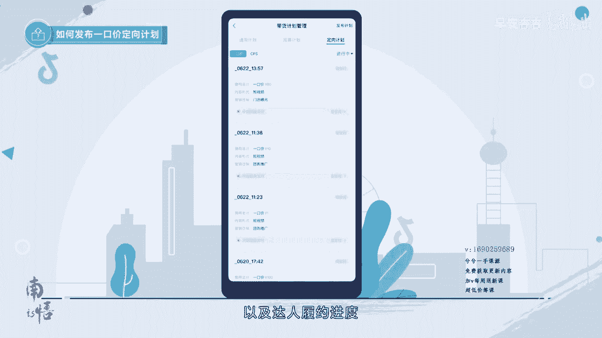

定向计划的合作模式，是指商家已经有心仪的达人，想要和达人进行定制化合作，比如提供专属套餐，提供专属佣金比例，都可以使用该计划，商家可以在达人广场挑选想要合作的达人。

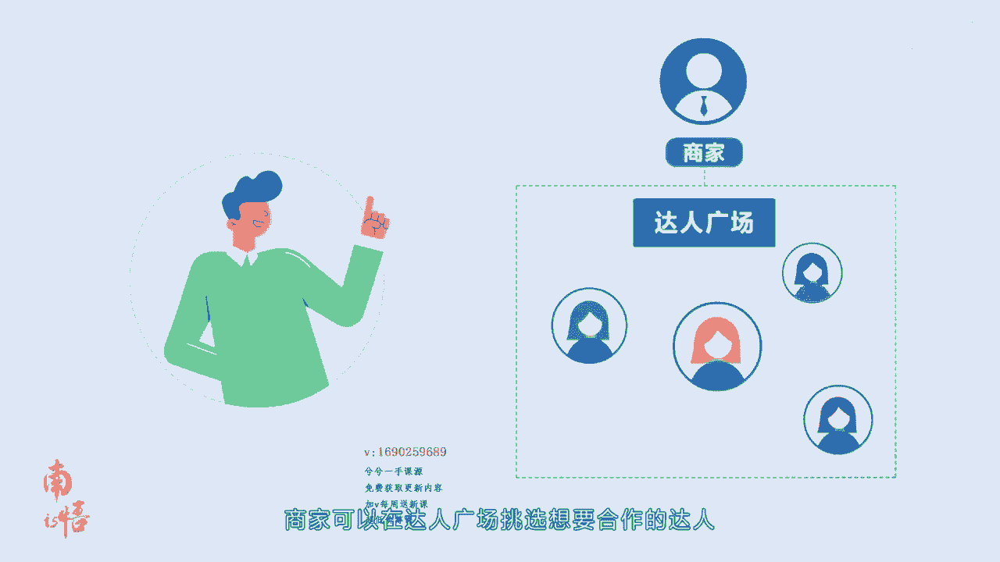

然后对达人发起定向计划，打开抖音来客。

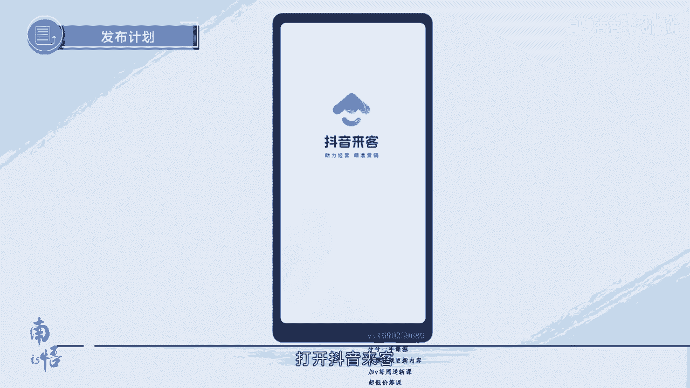

点击发计划，然后选择定向计划，就可以进入发布页面了，第一步需要选择内容形式，也就是希望达人通过短视频还是直播来带货，计费方式，可以选择一口价或按核销量结算，今天我们重点介绍按核销量结算。

点击下一步就可以进入创建计划的页面了，填写好计划名称后，商家需要添加团购商品，并设置佣金比例，在这里我们支持批量勾选商品，并且批量设置佣金，佣金比例范围为零至80%，如果有某个商品要修改佣金。

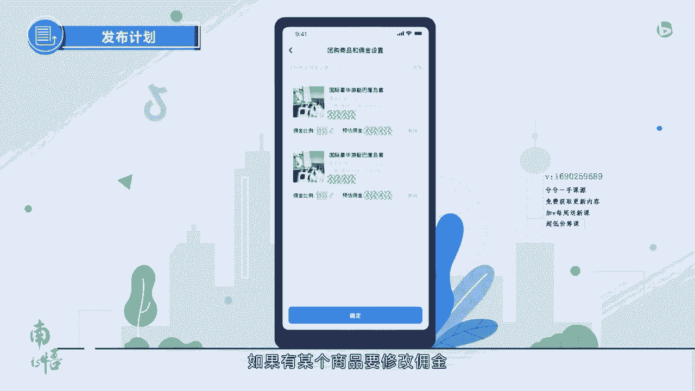

点击佣金比例右侧的修改按钮就好了，这里需要注意审核。

未通过的商品无法创建计划，仅直播间可见的商品。

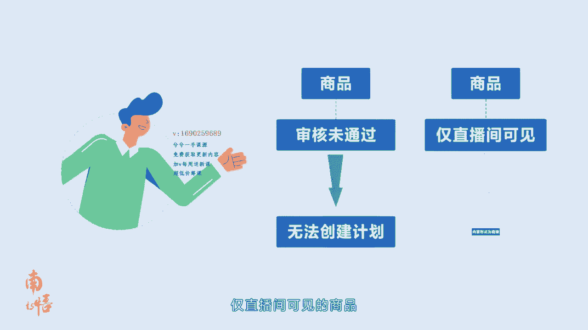

仅允许创建内容形式为直播的计划，设置好佣金之后。

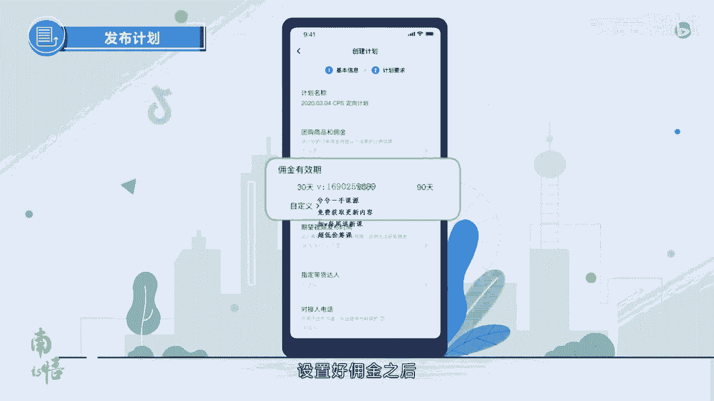

就要设置佣金有效期了，如果是直播计划就不需要设置了，佣金有效期是指视频发布后的多少天之内，达人带货产生的订单，达人都可以获得佣金，现在已经支持自定义设置时长了，接下来要设置期待视频发布时间。

这个时间很重要，如果达人在时间范围之外发布视频，那是不会获得佣金的，所以商家一定要和达人约定好时间。

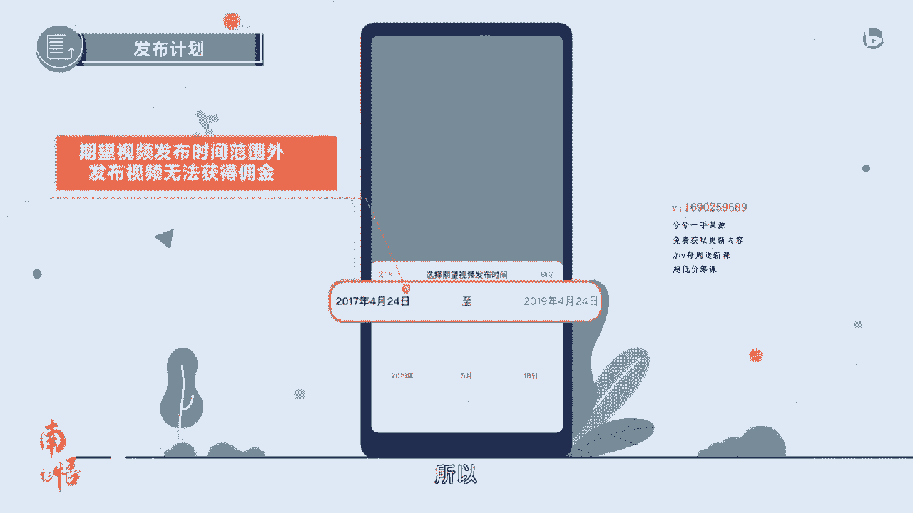

并且不要设置错误哦，在指定带货达人这里，可以支持商家批量添加达人，商家可以通过搜索昵称添加达人，或者直接添加已通过达人广场建联的达人，一次性最多可指定200个达人，最后填好商家联系电话就可以发布计划啦。

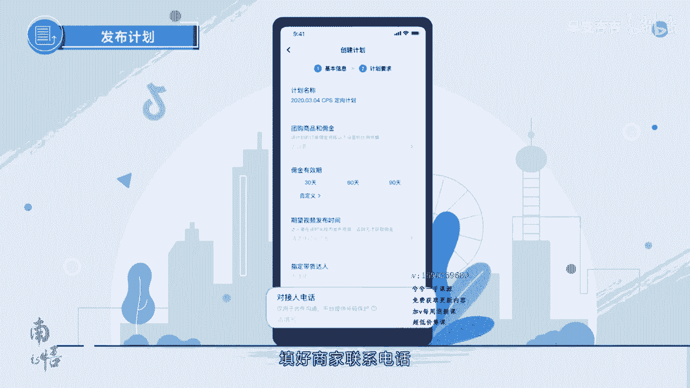

若商家选择直播计划，只需填写名称，团购和佣金，指定达人对接人电话四个字段就可以发布计划。

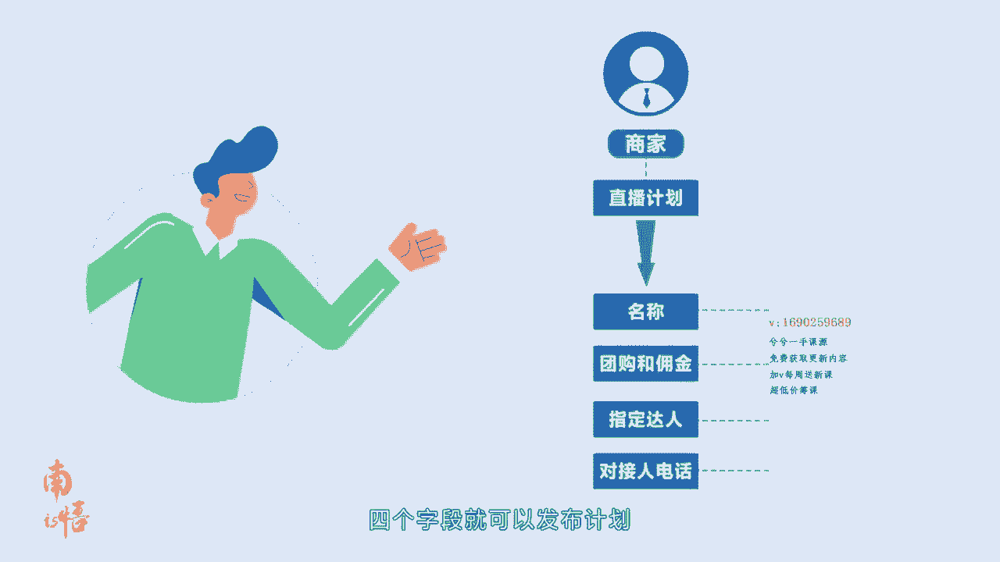

已发布的计划可以在达人带货主页右上角，点击定向计划进行查看，点击计划卡片可以进入查看计划详情，若达人已发布视频或已经完成直播，点击达人头像即可查看详细数据，进入计划详情，可以对计划的联系方式进行修改。

另外也支持增加团购商品和达人，同时支持延长视频发布时间，若要停止整个计划，点击计划详情右上角停止合作，并确认若要停止单个达人。

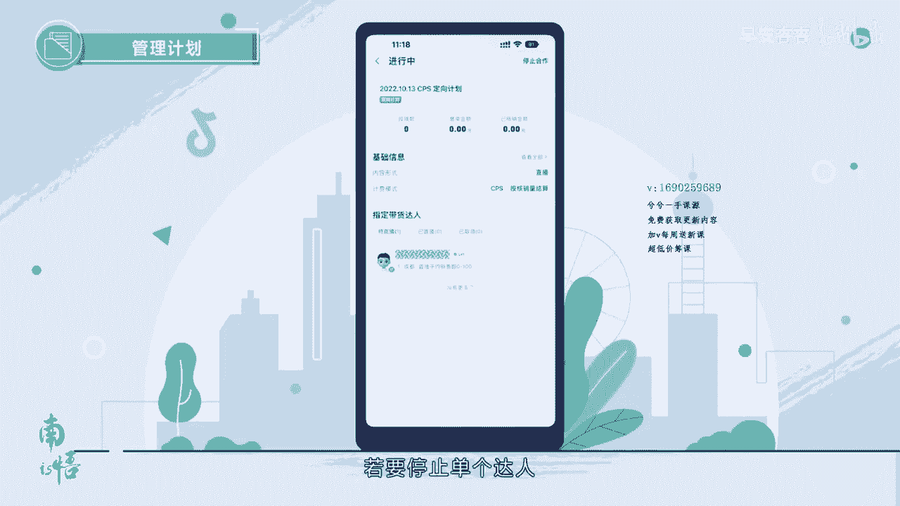

点击达人卡片，点击右上角取消合作。

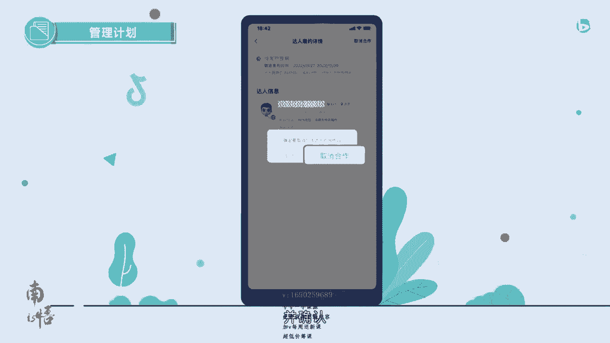

并确认，这里需要注意的是，直播计划随时可以停止，停止计划后，未发布直播的达人将取消，已发布直播的达人将完成合作，且后续正常分佣，正在发布直播的达人，完成直播后到已完成状态且正常分拥。

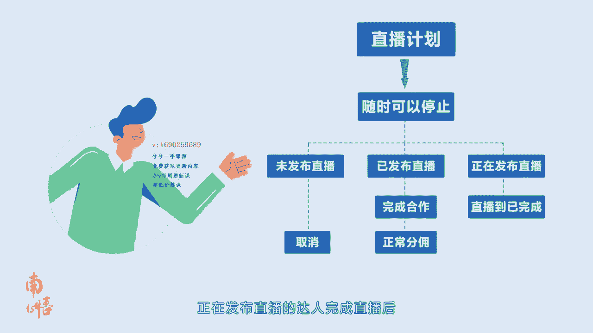

短视频计划仅限达人未履约时支持取消。

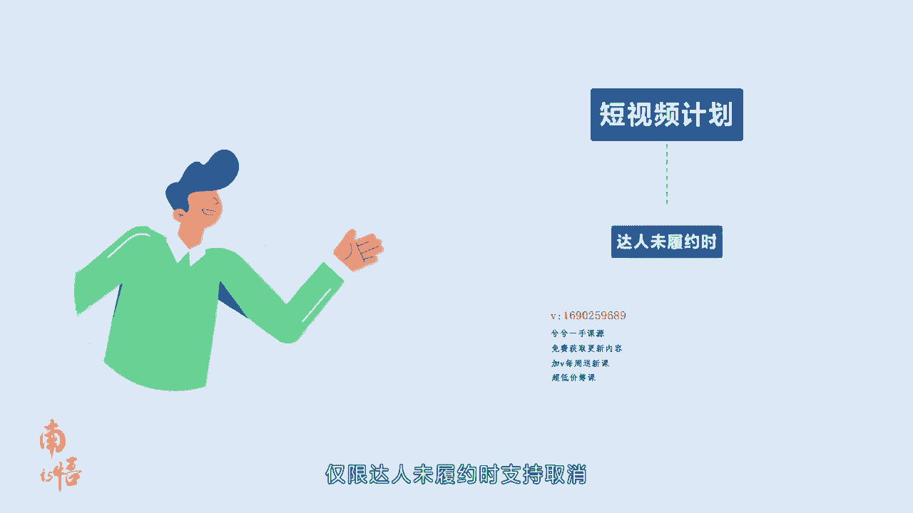

以上就是定向计划的介绍。

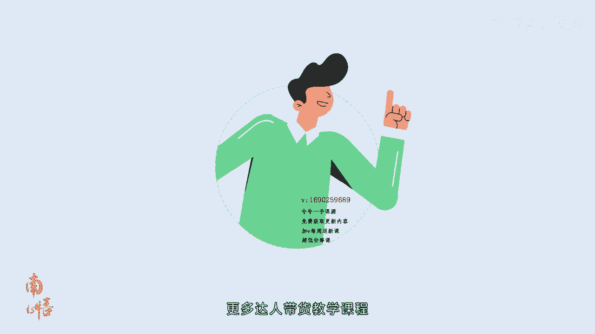

更多达人带货教学课程将在之后陆续发布。