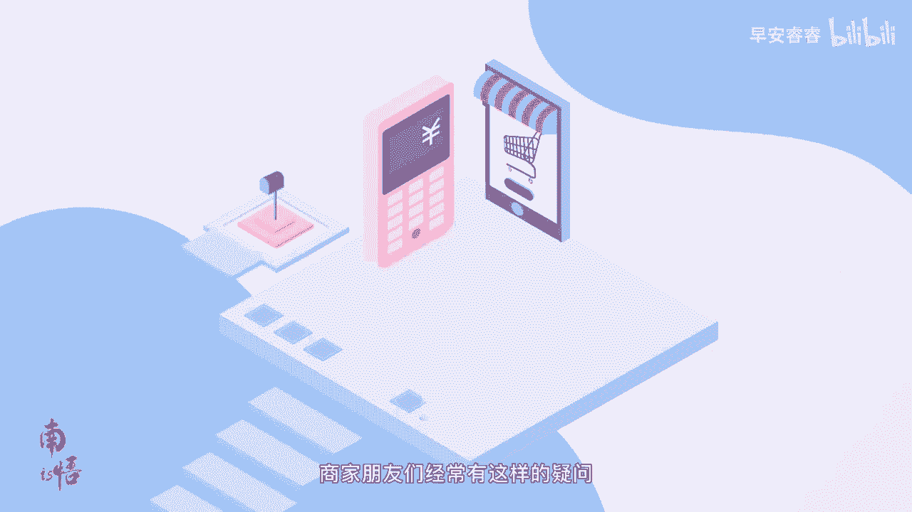
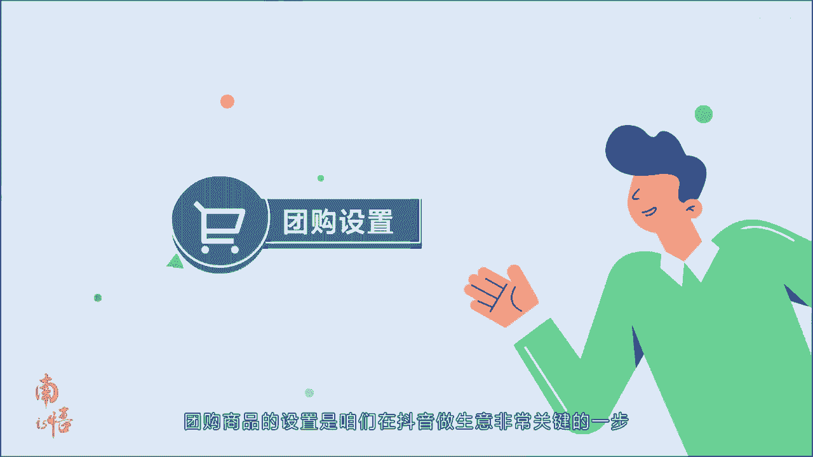
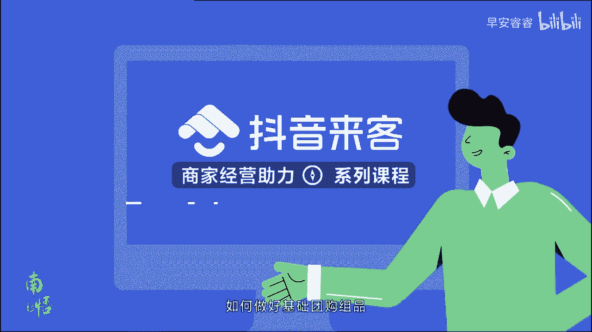

# 083 抖音同城生活-健康垂类0到1运营：入驻-暴力起号-规则篇-消费直播篇！ - P12：12-团购组品攻略 - 早安睿睿 - BV1Fx4y1n7Ba

商家朋友们经常有这样的疑问。

抖音上什么商品卖的好啊，是不是把其他平台上的商品照搬过来就行了。

团购商品的设置是咱们在抖音做生意。

非常关键的一步，我们就来讲讲如何做好基础团购组拼。

这个问题其实也很好回答，只需要转换一下角度，站在顾客的角度想一想，顾客在抖音上看到商品后，是如何一步一步被吸引，最后决定下单的呢，首先商品要有卖点，才能吸引顾客点进来。

所以首先要想想咱们家产品的卖点是啥，是应季商品还是折扣力度大，还是有特色菜，其次商品标题要写清楚适用条件，让顾客一眼就看到重点信息，顾客点进商品页面之后，最想了解的就是这个团购商品适合几个人。

有没有限制时间，比如情人节专享情侣双人和牛自助晚餐，接着需要和其他平台有差异点，顾客看完商品信息之后，可能会去其他平台比价，在比价的过程中可能被其他商家吸引，从而流失掉了。

因此咱们需要尽量避免让顾客比较快速下单，这里介绍几种方法，第一种是独家这个商品，或者这个套餐只在抖音上团购，第二种是加料，同样价格的套餐增加一些商品，第三种是差异套餐里的商品做一下调整。

变成一个新的套餐，那么具体怎么租品，有哪些好的攻略呢，这里给大家一条建议的公式，商品数加优惠力度，加丰富度加差异性，第一点，商品数建议设置两个以上的团购商品，可以包含引流品，低价或者折扣力度大。

利润品代金券等，这样顾客进到咱们的抖音门店，才能进行一定的挑选，第二点优惠力度可以参考市面上同类商品，或者咱们在其他平台上的折扣力度，设置一个有竞争力的优惠力度，这样能够更快地吸引用户下单。

第三点丰富度，咱们的团购套餐里的商品需要足够丰富，让顾客有物超所值的感觉，建议商品要包含推荐菜，特色菜等有吸引力的商品，套餐类型可以分为二人四人多人等多种形式，第四点差异性区别于其他平台的套餐组合。

避免顾客在比价的过程中流失掉，举个具体的例子，某个火锅店的作品思路是这样的，门店卖点主打特色环境和特色菜，特色小吃加特色甜品，特别能够吸引女性顾客，组品思路设置一个一元的特色甜品作为引流品。

再设置一个两人套餐加一个多人套餐，菜品组合和折扣力度上区别于其他品牌，同时搭配代金券，大家初步的了解了如何发掘商品卖点，如何完善优化标题，图片信息和如何突出平台优势，并按照指引操作上架了商品。

但是单一的商品类型，很难满足海量用户的多样化需求，并且质量一般的商品带来的转化率也很低，所以想要拥有好的经营结果，就必须在保证商品数量的同时，保证商品的品类覆盖和质量。

商品数量就是一个门店上线了多少个商品，用户的需求是多样的，比如在工作日上班一族的用餐时间有限，所以用餐更关注快速，对于品质和菜的丰富程度要求相对较低，用餐人数一般一至两人。

所以工作用餐场景下主要的二级品类为快餐，用餐人数主要为单人餐或双人餐，同时为了保证较好的用户体验，一般建议套餐包含招牌菜，且要有一定的价格竞争力，即价格不高于同类型商品的一般定价，而套餐的搭配较为固定。

为了满足一些对菜品有强诉求的用户，建议至少设置一张代金券，不同于餐饮行业的多样化，酒旅和到店综合行业的需求更加集中，所以上架的商品目的是覆盖最高频的使用场景，比如酒店住宿大床房，双床房。

两个房型可覆盖超过90%的需求，场景是商家一定会设置的商品，且往往会有特价房，而游玩品类中所有人通用的门票，单程人票，这个商品的消费比例会远超其他品类，其他道宗品类，如美发行业也一定要包含核心服务。

剪发烫染发等具体的组品，建议我们来一起看看这个表格，在餐饮行业中，火锅烧烤烤肉中餐品类，建议商品数量设置在四个及以上，商品类型包含两至三人餐，4~6人餐和一张100面值的代金券。

每个类型的套餐至少有一个包含门店招牌菜，并且价格要满足建议售价要求，必火菜品类除去不要求4~6人餐以外，其他相同西式快餐面包甜点茶饮品类，除建议上线四个商品以外，在商品类型上最好包含单人餐。

两至三人餐和一张50或100面值的代金券，同样建议每个套餐都至少有一个门店特色菜，中式快餐品类初步要求两至三人餐以外，其他相同自助餐，主要是在套餐类型上需要包含单人餐，符合常规的用餐需求，在酒旅行业中。

酒店住宿品类，除了整体建议上线至少四个商品以外，类型上建议包含单房型，大床房或者双床房，以及需要有房型加早餐，或者房型加景点门票的组合，游玩品类需要包含单人票和多人票，单人票中包含单人成人票。

多人票包含一大一小，两大一小或者情侣票，在到店综合行业中，洗浴足疗按摩品类除了商品数量的建议以外，最重要的是在服务时长上，在商品中包含60至70分钟的套餐，丽人美发至少包含一个剪发套餐，有次卡。

丽人美甲美睫至少包含一个美甲美睫套餐，有四卡，亲子类的店铺主要在门票套餐上，建议至少包含一个一大一小，两大一小多人票，设置次卡也会是很好的营销方式，以上就是商品组货进阶攻略的课程内容。

是不是现在对商品有了更加全面的认知了呢，咱们学习完赶紧实践起来吧，期待每一位商家都能生意兴隆。

