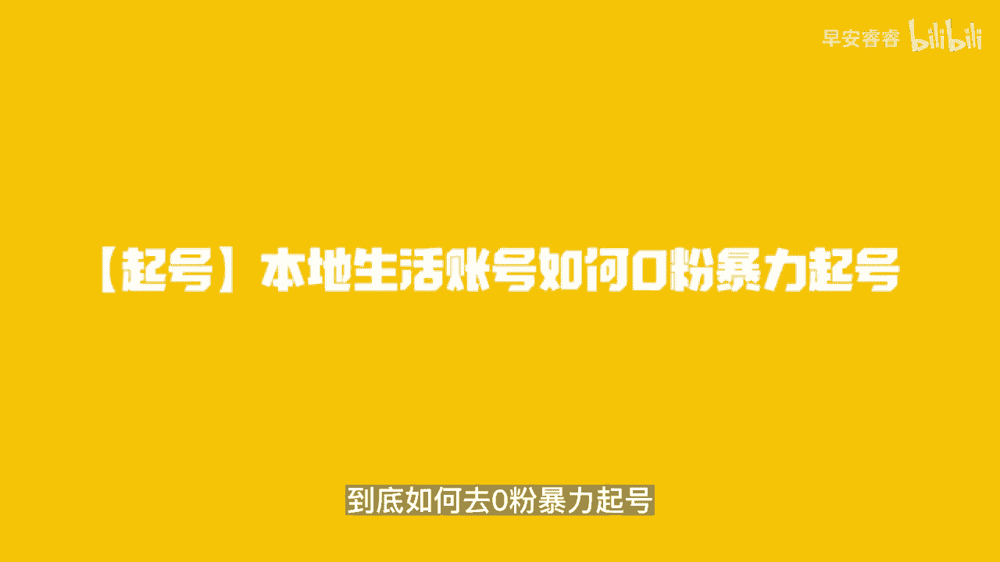
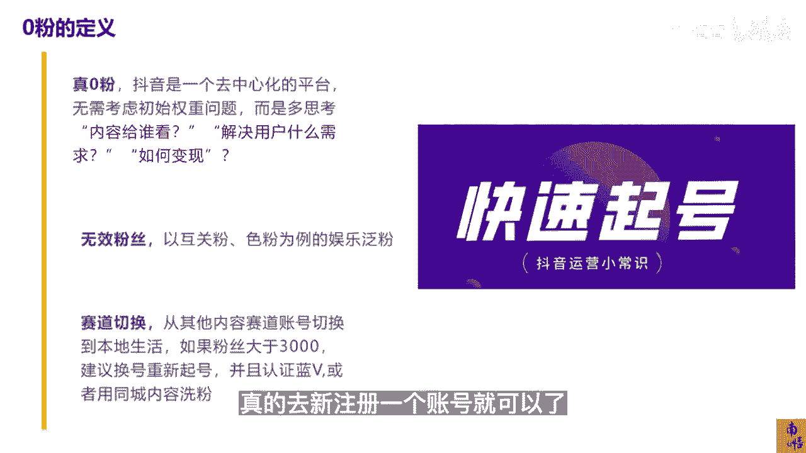
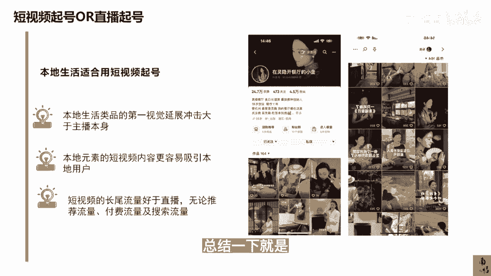
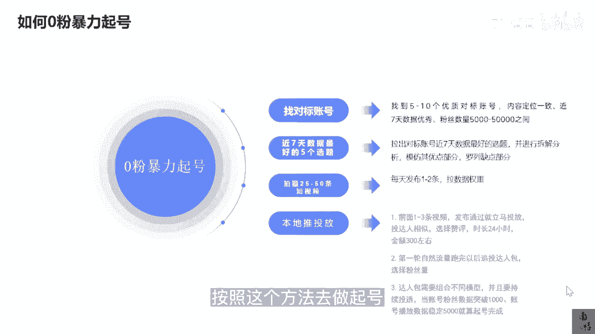

# 083 抖音同城生活-健康垂类0到1运营：入驻-暴力起号-规则篇-消费直播篇！ - P13：13-【起号】本地生活账号如何0粉暴力起号 - 早安睿睿 - BV1Fx4y1n7Ba

很多做医疗赛道的这些机构的老板，都有可能有过做账号的经历，但是很多人他们在起号的阶段，会碰到非常非常多的问题，甚至是有大部分的老板都是因为喜好，没有办法达到一个快速的一个结果就放弃了。

所以我们这1part的内容主要来讲讲，对于我们抖音本地生活，医疗赛道我们应该怎么去起号，然后会有一些老板他可能会提问，做本地生活不就找到服务商，找一些达人来探店就可以了吗，为什么还要去做账号。

这里我可以跟大家就是讲一讲，为什么，对于我们想去入入住这个抖音本地生活的，这些消费医疗的这些老板们，你们是需要去做账号的，首先从几个维度去讲吧，第一个维度，你找服务商去让达人来到你的店里面进行探店。

固然他能获得PGC或者UGC的这部分的流量，这个是没有错的，达人获得他的这个分佣，服务商获得他相应的这个分佣，但是从抖音的角度，他最终还是希望店家自己去嗯，做一个直播或短视频的，为什么。

因为保证金交的是你们店的，而医疗里面它又会产生很多过度宣传，违规宣传的一些行为，而在我们医疗这个赛道里面，你们也知道在美团上都会有很多说你过度营销，过度宣传的一些处罚的一些信息，但是在抖音上。

如果你今天找来了200个甚至1000个达人，给你来探店，抖音能保证他们这些内容一定是没有问题的吗，所以最终这一些假设是，因为他的达人的这个不符合医疗的这个宣传，这个逻辑去做了这个宣传。

对于抖音是不是一种舆情的风险，所以从长远的角度来看，抖音肯定是希望你们商家自己去做内容，因为你们自己的内容一定会对你们自己这家店，这个机构去负责的，所以这是逻辑之一，第二个逻辑是这样的。

对于抖音这样的平台，它和大众点评和美团最大的区别就在于，我本身就是通过本身我多元化的内容，就是我的护城河，那么你原来在运营美团的时候，你只需要把图片去上传，把你的品相优优惠这些信息去设置即可。

但是在我抖音平台，你上传了这些还没用对吧，你上传了poi的这些店铺信息，你还没用，我必须让你有内容，你的内容的好坏，决定了用户对你们这家店的整体的这个，消费的这个转化，而这些内容的数据。

内容的优劣性是抖音去评估你们这家店对于我，抖音本地生活一个重要性的，一个非常大的一个指标，所以你要入局做这个抖音本地生活的医疗赛道，你就必须要学会自个儿的官方号怎么起，自个儿的这个居证号怎么起。

就要学会做内容，这个是必须要学会的，那当然讲讲第三点，为什么你不直接把我的账号包，给那些代运营的机构呢，理论上其实是可以的，但是呢十个代运营，9。5个都是肯那些真正有能力做流量，就做医疗流量的这些机构。

或者这些操盘手，他们大概率是不会去做代运营这样的业务的，代运营的本质，首先我的核心成本是低的，我通过我代运营呢进行的相关的这些代运营，干的是苦活累活，干的是信息差的这个钱对吧，就像过去一年的一些服务商。

真正赚到大钱的其实不多，他们干的就是我给你匹配达人，就是这些相当于一个劳务外包，某一个环节的外包一样的，我我去给你匹配这样的单人，他就是个中介的身份，但是呢这里也有区别。

就是如果这个团队确实具有医疗流量的一个规，避以及判断以及运营的能力，那他确实是一个非常好的机构，当然我建议你们跟这样的机构尽可能去合作，去运营，不要去玩那些代孕，就是我给你多少钱。

你把我这个视频拍了就好了，不要去做这个事情，而更多的是大家做一个统一的规划对吧，我们规划这个季度我们的业绩需要做到100万，做到100万以后，我应该分你百分之多少的一个分成。

那么在前期需要达人的或者需要拍摄这些成本，你们去cover，我觉得这个合作逻辑是对的，单纯的代运营其实没有太大的意义，所以不管怎么样，对于机构的老板，对于医疗机构的老板。

你们想去玩抖音本地生活做内容旗号，这是必须要经历的一个点，否则单纯靠几个达人。

我觉得意义不是特别大，那我们正式开始讲讲，我们本地生活账号到底如何去临粉暴力起号。

OK我们首先我们明白零粉的定义是什么，零粉它分两种，一种就是你真的是个零粉，就是你的这个抖音号就几十个粉丝，或者甚至是完全没有粉丝对吧，所以这个是零粉的这个其中一种。

我们得明白抖音是一个去中心化的一个平台，很多邪门歪道的人会跟说诶，你的账号的权重不够或者怎么样的啊，其实账号的权重严格意义上来讲确实是存在的，但是对于我们这一些做本地生活的商家来讲。

你其实并没有必要去考虑这个账号的权重，我一会会讲到，为什么你应该更多的去思考，我的内容是给谁看的，我要通过什么样的内容去吸引到用户，如果你是一个人设号，我的人设应该是什么，如果你主要是去展示产品。

比如说我是个蛋糕店对吧，我的蛋糕本来就很诱人，那我只要去通过符合抖音流量运营规则的，一些方法，去把我的蛋糕的这个品相展示出去就好了，其实是用礼品带货，所以这些是你要去想的，包括你怎么变现，我们消费医疗。

大部分的客户其实并不是为了卖我的品相，卖品相当然固然是其中一种，其实更多的是为了搞课资，所以当你想明白这些，我觉得这个才是一开始的这个正确的规划，那么第二部分就是你的这个账号，有很多什么粉丝。

比如说你原来这个账号是做网红的，有很多互关粉呃，色粉为例，那这些粉丝在我们眼里拿这些账号，看着有几万粉丝，你去做这个本地生活，也几乎是符合我们所说的这个零分旗号，当然也有些人说我买一个账号对吧。

我们买一个这个九旅的账号，或者是买一个这种风景的账号，我去贴下相关的这些本地生活，我们个人觉得，除了你如果未来是需要拿这些账号去做招商的，它是有一定意义的，否则呢其实没什么太大的意义，我们的建议啊。

如果你拿了一个大于3000的一个粉丝，如果你要作为你的主账号，看你有没有招商的需求，如果你有招商的需求，那你可以去把它认证成蓝V，然后通过一些同城的内容去洗洗，因为别人在看你这个账号的粉丝标签的时候。

会做一个判断，那么如果不是，那我们建议你就直接真的去新注册一个账号。

就可以了，所以这个点是大家可以去关注一下的，那么我们去做抖音本地生活的这些账号，我们到底是通过短视频去起号还是直播起号，短视频起号和直播起号其实都是正确的方法，只不过用在不同的类目，它可能侧重点不一样。

那么呃我的建议呢，本地生活的账号是适合用短视频去起号的，为什么电商它其实是适合用直播去起号的，因为本地生活，我们所有团购品类的第一视觉冲击，就是你品类的冲击，品类的吸吸引其实是大于主播本身的。

怎么去理解这句话，我举个例子，你是做医美的，你的主播，除非你是做看脸号，那个是另外一个赛道呃，你是做本地生活的，你的主播一定不是那些特别贵的主播，因为特别贵的主播，你的成本就会很大，或者可遇不可求。

那么当你的主播能力没那么强的时候，恨不得是老板娘亲自下场去做的时候，OK这个时候你的主播本身的吸引力是有限的，而人家到你这个直播间，或者到你这个短视频上来看，你在卖什么东西是很重要的。

比如说同样卖一个m two two对吧，你的价格更便宜，你也说你是正品，你的价格更便宜，你甚至比别人便宜100块钱，那你的主播是谁，其实就不那么重要了，所以这个是一个点，那么第二就是本地的元素。

用短视频的内容去做，是更能吸引到本地的用户的，因为短视频它的坏处是在于，我没有办法快速让大家在像直播间一样，去做一个拍脑袋的一个决策，但是他的好是在于我可以高效地批量去产生，对吧。

如果我今天我短视频拍摄的这个素材，我是选在西湖边的，那你都不用讲，你都不用看你的POI，你一定是在杭州，对不对，所以这样的一个多元化的一个结合，就比如说我这边打的这个餐饮类的。

它是一个在灵隐开餐厅的一个小金，那基本上我都不需要看他的视频，我就知道他应该是杭州的一个餐厅的一个老板，那同样道理，你们再去匹配你自己的口腔，你是在杭州，比如说我在杭州，你是在杭州哪个位置。

你的商圈有没有著名的地标景点，而这些地标景点，它本身是可以给你带来额外的加成的流量的，第三点就是短视频的长尾流量，其实是好于直播的，因为你在再好的在日不落的直播间，你不可能真的像我们本地生活。

你去做日不落的直播间，这个成本太大了，那么对于短视频来讲，我是具备长尾流量，什么叫长尾流量，就是你发了这条视频可能已经一个月了，理论上你一个礼拜以后就不会获得推荐的流量，但是你还是会获得长尾的流量。

长尾的流量主要来源于两种，第一个就是搜索，就是用户比如说去搜索这个M突突了，搜出来刚好是你们家的视频，他就直接可以在你们家的短视频，那个POI的那个链接上去下单，所以这个时候即便你不开直播。

你也是有这精准的用户进来进行一个付费的，而且你还可以对于一定期效内的这些短视频，再去进行一个推流，所以这里面搜索的流量，它是产品流量比较核心的一个点，当然如果你有能力，你再去布局一些关键词的搜索优化。

我还是以M突突为例，当你去搜m two two或者杭州M突突的时候，为什么出来的是你们家，而不是别人家，所以去做好这些点的时候，这些流量都是可以帮助你快速去旗号的，而直播当你的主播能力不那么强的时候。

你的旗号就会变得很慢对吧，因为医疗里面的这些影像他还是需要对你的店，对你的人设，对你的店铺的人士，IP的这个定位会产生一定的信任基础，以后才会去进行一个消费的一个角色，当然这里有一个特殊点。

就是你们家的品牌是不是足够的大，如果你的品牌是足够大的情况下，那你可以同步通过短视频和直播一起去起，我这边指的是你们家的店铺的品牌影响力，可能在中部中腰部左右，那你可以先用短视频去起那短视频的长尾流量。

还有一种情况就是我们俗称的爬坟，就是你过去拍了一条段子，拍了一条短视频，但是因为那条短视频，它刚好蹭到了一个时下的一个热点，就是你当时不小心踩中的，那这一条视频可能会再次爆火。

那这种爬坟在抖音上是特有的，只是它的流量并不是线性的，就是你一旦踩到了这个爬坟，那这条短视频又会给你带来很多，曝光和很多转化的订单，总结一下。

就是当你去领粉区起号的时候，我们建议是用短视频去旗号的好，那么我们来讲讲具体该如何零粉暴利旗号，首先我们分四个步骤，第一个步骤，我们要找到我们的5~10个的优质的对标账号，怎么找对标账号。

对标账号大概的找法有几种找法，第一你可以去找你行业的这个关键词，我举个例子，比如说你是做口腔的对吧，你要去找口腔的关键词，你就把所有的关键词罗列下来，然后在抖音上去搜索，筛选出近七天优质的这些内容。

或者是那些博主，那么把这些内容都可以收集起来，它就是你的对标内容，但是这样的操作方法，你是你会搜集到很多黄V的这种科普，但是这个很明显不适合你对吧，所以你要去做一定的这个基础的一个筛选。

那么第二个你可以去搜，比如说在那个本地推或者是巨量千川，或者是抖家上面去搜这些关键词，那这里出来的就会有很多，比较精准的一些对标账号，同理你可以去用蝉妈妈，辉腾这一些第三方的数据平台去搜这些关键词。

所以找对标账号的核心，就是通过不同的方法去找你跟你这个行业，跟你这个领域相关的一些关键词，然后去找到这一些优质的博主，所以他是一个关键词加筛选的一个行为，当你把这一些对标账号找出来以后。

找出了这十个优质的对标账号，还是看他近七天的优质的这些数据作品，为什么我们在不同的时候，我们永远会提到近七天，因为对于抖音这样的平台，它其实很拽，你原来是一个大号，但是你最近没有产出优质的这个数据作品。

抖音就会认为你最近你这个账号不是特别行，或者你最近的内容是不符合，抖音当下的用户的一个审美，这也是为什么抖音的流行的音乐，流行的视频形式不停的在发生变化，这就是它的一个核心点。

它会最终最终还是用他给到你的这个数据说话，数据是评判你最近这段时间抖音是否优质，抖音内容是否优质，账号表现最核心的一个评判标准之一，那么你选择的粉丝数量可以在5000到5万之间，其实如果你的赛道足够小。

你都可以选在1000~5000之间，核心还是他近七天的有没有爆款，或者有没有优质的这个数据，那么把这近七天的数据，你选出一个最好的五个选题，拉出这些选题以后，你对它进行一个拆分，拆分到秒为止。

你按照3~5秒为一个片段，你去拆分他什么时候去讲解品相的，它的标题是什么，它的标题他的开篇0~3秒是什么样的，你都要去给他罗列的清清楚楚，然后去模仿他的优点的部分，比如说这条视频。

他的核心优点是在于内容结构里面，它设了幽默的段子，第二点，他在这条内容里面去把他自己的品相的价格，或者是他的这个专业背书的优势讲的特别好，总之总是能找到那几点的优点的，你把这些优点全部罗列下来。

然后去参考它，这里面有一个小窍门，如果你找不到你这个赛道，比如说因为口腔原来做的人少嘛，你找不到这一些优质的这种对标视频的，你可以找同类型，我指的同类型，不是说他也是得口腔的。

就是你们的消费场景差不多的，你们的就是消费频率也好，消费场景也差不多的这一些好，比如说像做医美，你就可以去对标生美啊，甚至你可以去对比每家每睫，这些三美或者是养发馆那些数据，他们其实做的蛮不错的。

那口腔类的你可以去对标眼镜的，因为他的这个消费的频次和他的需求量，它的门店的布局量其实大差不差，所以这样去对标以后呃，你只不过把里面的核心的品相，和这个核心的卖点给他做替换以后。

这里面最重要的一个部分就是，你一定要有一点是比对方做得好的，比如说人家的数据已经很不错了，哎你在模仿他核心优点的时候，你一定要把其中一点做的比他更好，那这个时候你就能获得相应比他更好的，这个数据。

因为他在七天这七天已经证明过，他可以，当你去再去这样做这样的一个更替的时候，你做出来的这个数据，只要你的品相是还不错的，它就能吸引到足够的流量，那么第三点也是我经常讲的，你一定要多拍视频。

前期我们觉得起号阶段应该拍差不多，50条视频吧，最少最少25条，每天去发布一到两条去拉数据的权重，很多人会认为，抖音是不存在账号权重这么一说的，其实我们做过账号的人都知道，这个权重还是在的。

只不过抖音不想，抖音，官方从来不提这一茬，无论在任何的这个论坛或者是讨论的群里面，你提这个数据的权重，我们都认为它是存在的，所以对于抖音而言，你每天去做一条视频，或者你一个礼拜去发一条视频。

我看到过很多的这些医美机构的老板，他可能一周才憋那么两条视频出来呃，憋的又很重，然后一看播放就500，那从我们的角度，你即便播放是500，你一天发两条和你一周发两条，你获得的这个播放量也是不一样的。

所以对于本地生活这样的赛道里面，你去起号的过过程中，你发布的视频一定要多，无论是用不用工具，咱后面会聊到你自己去做的时候，你一定要去多发这样的视频，可能有的视频是你精心准备过的，有的视频是水的。

但是不管怎么样，一天我觉得发一到两条视频，还是要保持这个频率的，那么第四点就是要用好本地推的一个投放，本地推在后面我会有保姆级的教程，我这边大概先表一下，我大概提一下起号阶段怎么用本地推。

在前面的1~3条视频，你发布以后，当然本地推你发的时候，你也可以用抖加，那区别就在于如果你挂了你们的POI，它就是用本地推，如果你没挂，它就是一条斗家，那么为什么我们建议用本地推呢。

是因为本地推挂了PY以后，因为你这个店铺本身是报白过的对吧，他的审核会相对的开放一点，如果你是斗家，你涉及到了医疗的一些行为，他不一定那么容易就给你过审，所以我们建议直接挂POI去做。

本地就不要浪费掉一个播放量，那么在前面1~3条的视频时候，你就去可以去投投达人相似对吧，额选择那个暂停啊，如果你不投达人三四，你其实都可以去投智能，没有关系，那么时长24小时，甚至可以放到48小时。

投个300块钱，当第一轮的自然流量跑完以后，你再去追这个达人包对吧，选择这个粉丝量，因为为什么前面要去选这个粉丝量，就是你得有你基础的这个忠实的用户，这样你下次发视频的时候，他们至少能看到。

给你贡献一波基础的这个播放量，第三个步骤就是说达人包，需要去组合不同的模型，你要不同的去测，对你这个品相，我只能跟你讲逻辑，对你这个品相，你要去不停的测试你的达人棒模型对吧，甚至是那些团购达人的。

这些都有可能是可以去对标投的，为什么，因为他们的用户几乎都是同城的用户，所以你去投这些达人包的时候，他就可以投的就比较的顺畅，当你账号粉丝数据突破1000的时候，账号播放数据稳定在5000左右。

你就算旗号的完成了，当然如果你的这些作品，你觉得你的未必做的特别好，你也可以去投抖家，就是不挂POY，你可以去这么去投，所所以我觉得两个方向都可以吧。

