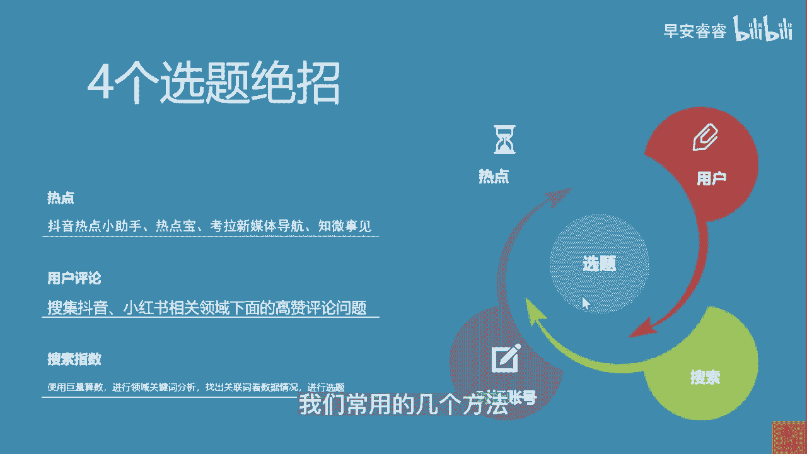
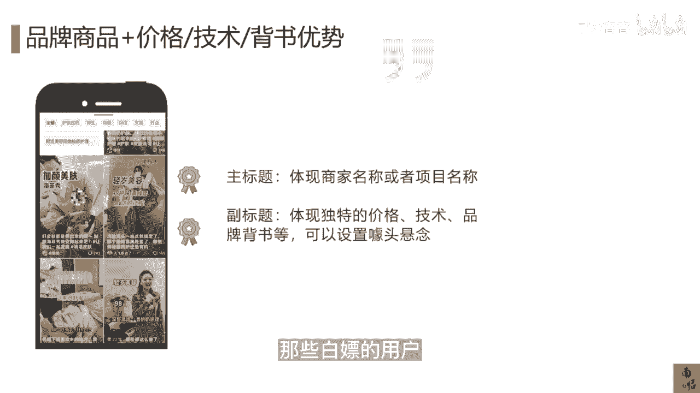

# 083 抖音同城生活-健康垂类0到1运营：入驻-暴力起号-规则篇-消费直播篇！ - P14：14-【选题】本地生活爆款短视频的选题策略 - 早安睿睿 - BV1Fx4y1n7Ba

那讲完了起号，我们来讲讲对于我们本地生活的这些商家，我们如何高效的去选择一个选题，就是我们去怎么去做我们的选题的策略，因为对于本地生活来讲，你店内你的品相其实总有被讲完的一天的对吧。

那你怎么去保证你的内容，我刚才也讲到了，你一天可能要发一条作品，你怎么去确保你自己的内容是持续能输出的。

这里面是有一些SOP的策略可言的，首先我们要去找到拍不完的选题，它其实有方法，因为你如果找不到选题，你会觉得创作这个短视频实在太累了，你的下属，你的团队都会觉得这个东西是很累的。

但是你又自己又不去做那些用方法论的，用正确的方法去做些选题的时候，你的内容更新频率一旦低了，你的这个涨粉或者是获得卖货的这个能力，卖货的这个速度又会变得很慢，所以这就是你为什么要学会找到这个选题。

或者找到内容方向的内容，选题性的一个最核心的一个点，我们来讲讲选题其实有四个方法，第一点呢就是你要学会用热点，比如说我这边列了几个抖音的热点小助手，热点宝考拉新媒体之威事件。

为什么这个热点跟我们本地生活有什么关系，其实是有关的，我举个例子，比如说你是做一家医美机构的，在世界杯期间你应该去发什么样的作品，那很多人拍拍脑袋说，那我都知道世界杯了，我肯定去发一些跟世界杯相关的队。

你正确的应该通过抖音这些热点小助手，你应该提前的就已经做好规划，我这个礼拜我应该拍什么内容，比如说我在世界杯期间，我去拍的内容，一定首先一定要满足世界杯期间的这一个热点。

其二就是我要满足跟我医美相关的哎，我们最终做了这个规划以后，得出一个最帅的球星，比如说内马尔他做了哪些项目，首先这个内马尔他是具有一定的热度的，二他做了医美，这也是一个被媒体报道过确定的一个事实。

这个时候引出的这个口子，是比较符合你们医美的机构或者是医美的人设，去讲这一件事情的，哎他做了哪些项目，这个时候下面挂的这个项目，刚好是他有可能做过的，那这个转化这个热点就完全被你们给切到了。

这种玩法就是把公寓的热点的这些流量，通过这些内容转向你们自己的产品，最终叫做用公寓的热度赚你们的钱，那第二种叫做用户的评论啊，网易其实有一个特别热的一个点，就是它的叫网易云音乐嘛。

它里面的对于音乐的一些评论，其实很能戳中用户的痛点，其实在我们做抖音，在做自媒体的时候，这个方法依然是适用的，因为大家都是一个新媒体的一个玩法，我还是以以美为例，你去搜集那些人家最关心的。

对于你们光电项目那些提问，人家问价格，问安全性，问嗯效果问审美等等，那些高赞的评论，你把它给扒出来，然后就像那个回答用户来信一样的，回答用户提问一样的一个个给他去解答，而这每一个解答对应的。

其实你们都是每一条视频，都是会有相应的流量的，只要在后面做好一些极限词，或者是医疗敏感词的一些规避，你的作品还是可以发得出去的，然后第三点就是你要去用好搜索的这个指数，举个例子。

抖音的这个指数就是叫巨量算数，你们可以去去用巨量算数，当然你也可以用百度的那个热搜的那个指数，百度指数也可以去用，那这个指数，它的核心就是在搜这一个关键词的时候，比如说我在搜超声炮的时候。

我这些用户还在对什么东西感兴趣诶，我们搜出来发现搜超声报的用户还在对抗衰，或者是对那个FTA还在感兴趣，那么因此你们根据这一些的这个品相，你们再去根据自己POI里面，这个组的这个团购的品相。

你们再去倒推我应该做什么样的内容，比如说我搜出来我的超声报的内容，最近几天大概精确到天了，最近这两天就是特别火，可能是哪个电视剧或者哪个热门事件，甚至是厂家投了相关的广告宣传。

那这个时候你们就多去做超声炮相关的内容，就可以了，而且他会卖的特别好，这就是选题的几个我们常用的几个方法。

然后我们已经讲过抖音的这个热点，还有一个方法是可以帮助我们找到很多，很丰富的选题的，就是我们要用好抖音同城的团购榜，在这个抖音同城的团购榜里面，我们可以看到你所在的城市，同城的一个团购的榜单。

并且对你同类型的这些商家，你可以找到那些排名靠前的，实时排名靠前的这些商家去看看他们的达人，他们自己的内容，就是他们发布的这些内容里面，哪一些是值得你去做参考的，因为对于本地生活的这些内容。

它其实品相都是大同小异的，你说排名第一的这个他卖的好，但是他的品相跟你有特别大的区别吗，也不见得，因为抖音医疗它总共也就让你上这几个品相诶，那你去看看别人是怎么卖啊，怎么卖的，那就回到我们刚才讲的。

我去起号这个过程中，那个道理是一样一样的，你去看你哪一个环节可以讲的比他好，那人家可能是有团队，你是没有团队的，这个不重要，重要的是人家能做到头部，他肯定有他比你更大的精力，和更大的这个投入成本。

所以你就跟在榜一大哥的后面去玩就可以了，你依然可以获得你的流量，所以从抖音的这个本地生活的这个玩法里面，其实没有太深的门槛，你只要明白这个底层逻辑，最终他这个机会还是公平的，就看你自己愿意投下去的。

精力和财力是怎么样的，所以还是那句话，你去看他近七天或者是七天发的这个内容，这些作品你都可以去把它罗列出来，然后再根据你可能比它更便宜，你的环境可能比它更好，你的地理位置可能比它更很方便。

只要你有一到两点你的优势，那剩下的其实都不重要，怎么拍其实都不重要了，所以用这个方法你也可以获得源源不断的内容，而且这个方法比较好的一点就是，你基本上不要自己动脑子，但如果你是头部，你志在成为头部的。

那你还是要多更多的原创，你的选题在视频后期发布以后的呈现形式，其实也是与我们一般做的这种IP类的，这种短视频有一点不一样的，当然也很简单，首先你必须要有两个标题，一个是主标题，一个是副标题。

主标题主要去体现商家的名称或者项目的名称，这里有个很重要，就看你自己在你的当地对你的机构的名称，品牌的名称有没有自信，如果有自信，你可以去更多地去露出你的品牌名，或者反过来是这么理解。

如果你对你自己的品牌露出有更大的需要，你要去玩招商加盟，那么每条视频我建议你都打上你品牌名的井号，以及提上去加到你这个商家的这个名称，或者如果你是一个小商家，那你就直接去体现你的项目名称就可以了。

比如说我是做海飞秀的，我是做热玛吉的，因为这些海飞秀热玛吉超声报它是自带流量的，这个就是主标题的一个体现，你的副标题可以去体现你独特的价格优势，技术优势，品牌背书等等等等，甚至可以设置一些噱头。

比如说热玛吉限时，只要某某某的一个价格，这个时候他就会有一个悬念，他就会等你这个视频内容进行下去，他想去猜到你到底要多少价格，而从抖音的一个推荐算法的一个机制来讲，你的黄金三秒就是我们讲叫358秒。

黄金三秒，黄金五秒，黄金八秒，当你挨过去这个时候，尤其是你生活的这个视频会比较短，当你挨过那三秒或五秒，你的作品的播放量不会特别差，所以这就是一些小套路，这种头图的这种制作，其实本地生活的这种投图。

它有点像小红书那一套玩法，就是我要一眼0。1秒，一眼望到，我就知道你你你想说什么，你想干嘛，我看下去是因为我有兴趣，所以也是筛选的那些不精准的用户，那些白嫖的用户，这个就是整个标题。

