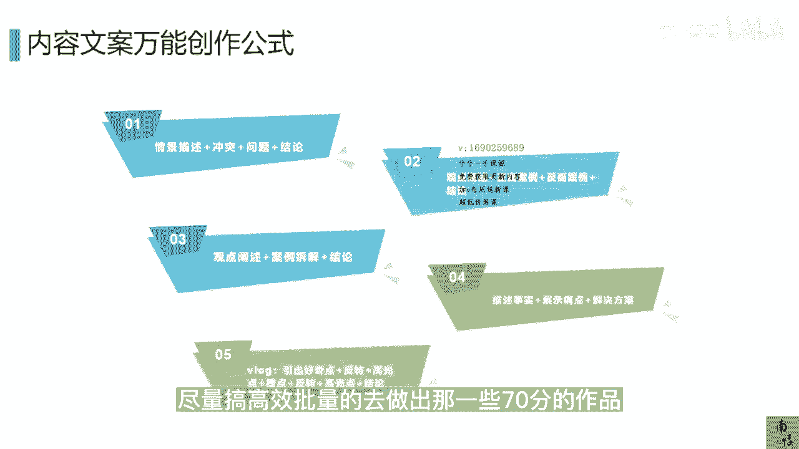

# 083 抖音同城生活-健康垂类0到1运营：入驻-暴力起号-规则篇-消费直播篇！ - P15：15-【脚本】高效批量产出内容脚本的万能公式 - 早安睿睿 - BV1Fx4y1n7Ba

我们很多医疗的这些老板，其实对于做抖音很痛苦，因为他没有足够专业的团队，即便有了专业团队也不知道怎么管啊，所以当他去产生这一些，尤其是批量产生这些内容的时候，会让它的单条的成本拉得非常高。

这也导致了他投入了很多，但是并没有拿到很好的一个结果，那这种原因其实我们通常来讲，就是对于自媒体的玩法，其实并没有一个概念性的认知，其实很多自媒体的玩法，你都没有必要去做到头部。

没有必要去变成像一个巨大的MC，或者是去养着那么几10号人的这么一个团队，用方法就可以了，我经常讲的一句话，你如果用同样的钱，同样的团队，你能产出70分的内容，那你就不要去做100分的内容。

所以这1part的内容我主要去讲一讲，教你们怎么高效去产出这一些脚本，他其实是有套路。

有公式的，好，我们先来看一下这条视频啊，你是不是很久没有洗过牙了，现在抖音团购39块九就可以好好洗一次呀，就在梅尔的口腔进来以后，令儿童乐园都有人家这里洗牙，所有用品都是一人一用一消毒。

洗牙前先来个牙菌斑检测，然后深层洗牙30分钟，洗牙过程中没有任何隐形消费，这里工作人员都非常专业，而且很有耐心，洗完牙之后，牙齿真的变得干净太多了，牙齿健康不容忽视，建议大家定期洗牙。

能避免很多口腔问题，现在趁着抖音活动左下角链接，赶紧囤起来好，我们来拆解一下这条口腔的一个脚本，的一个创作案例，首先这一个口腔我看过，他应该是当时用了一些灰产墙上的一个案例。

所以我们先抛开它是不是墙上不说，我们先来看一下这条作品的一个点，首先它在前三秒我们先来关注他的，前三秒，你是不是很久没有洗过牙，前三秒他是一个快速的去戳了一个痛点，诶你是不是很久没有洗过牙了。

这个时候没有讲废话，我的背景里面又体现了我这个品牌，它它其实这个团队应该做的还是比较专业的，他没有去露出，因为他是墙上的嘛，他没有去露出，我是口腔诊所，但是如果你们是报了白以后，正常上架的这些正规机构。

你是可以去录出的，我的门头，我的画面，我的声音快速的跟你交代，我今天要讲的是什么东西，当然你可以匹配各种不同的段子，OK这个三秒他是做的很不错的，然后这个达人这个探店达人，他的表现力。

情绪感染度都OK的，交代了我干什么，我在哪干什么对吧，像抖音团购39块九就可以好好洗一次呀，好然后你看在他的前面五秒里面，他已经告诉你，我有什么吸引力，足够的便宜30几块钱。

我就可以来做一次怎么样的这个洗牙，那么在后面的时候，我已经把我的品相的内容，我的这个价格都已经讲明白了，或者是提了个头，埋了个伏笔，那么在就在梅尔的口腔进来以后，令儿童乐园工作人家的环境。

我的专业力等等等等等等，然后在结尾的时候，他可以去做一些优惠活动的一个提示，并且去引导你大量的成交，所以在本地生活的这个板块里面批量囤，我们经常讲去囤券囤券，它为什么很多本地生活的这些。

比如说像咖啡也好，这些刚需的产品，他都能卖的特别好，不是因为他的用户真的有那么多，而是很多人他图你的便宜就囤在那了，确实在直播间也好，在短视频也好，如果你只是一个阶段上架的一个品的一个价格。

你的力度是特别有优势的，你可以在你的短视频直播里面去提醒大家，去囤囤券，因为这样的价格确实是不是每个阶段都有的，这就是直播和短视频的魅力，大家会根据你这个需求点诶，我去算，我可能一个季度洗一次牙。

那我可能要囤个四张对吧，那像那种消费品，可能就更加，比如说像医美赛道里面，你去囤一些光电的类的一些产品。

你只要足够的便宜，大家还是愿意去囤的，因为本来就是刚需嘛，所以如果你想批量的高效的去做抖音，去做自媒体，用好创作的公式，这是你绕不开的必须要学的东西，所以我们来看一下，对于资深的或者那些MCN机构。

为什么他们那么高效能产出，这一些你们会认为很精彩的这些内容，他的公式基本上总结下来就这么几种，大概会有总共的会有这几种，第一种比如说情景描述加冲突加问题加结论，第二种观点阐述加正面案例加反面案例加结论。

比如说我们如果是做秦一美的，那OK你去告诉他们，春天你是需要去做秦衣美的项目，让自己变好看，那正面案例就是做过某个光电设备的额人，他长什么样，没做的他长什么样，而且他们是同龄的，这样的视觉上的冲击。

对于用户的需求的勾勒是非常明确的，那么第三种叫做观点阐述加案例拆解加结论，第四种描述事实加展示痛点加解决方案，那第四种其实是蛮好用的，就是你去描述客观的一个事实对吧，就是比如说你做口腔的诶。

你牙齿不好看，这个就是他的一个客观的事实，他的事实的原因是什么，哎我牙齿不好，是看是因为天生的，还是因为小时候长牙的时候，就是饿了一些错误的习惯，这是一个事实对吧，然后去展示痛点，展示痛点很简单。

就一张图，牙齿龅牙也好，或者是地包天也好，这样的一个痛点的一个图，然后加解决方案，哎我们进口的一个什么什么什么，就可以解决这个问题，这就是公式，然后VLOG，比如说我们刚才看的那个案例。

它其实就是一个探店的一个VLOG，那也一样，道理引发好奇，这让这个好奇可以是呃引发通点，或者是引发需求点加反转加高光点加槽点，加反转加高光点加结论，也就是说你的视频要多长。

取决了你去循环往复几个反转加高光点加槽点，你就一直在那边循环往复就好了，去做到每十秒就是一个小循环，如果你这个视频是60秒，那你基本上你去循环个三次左右，加上你这个其他方面的一些文字内容。

你基本上可以把这个整条视频是可以去撑起来，所以讲到这里，我们会明白，如果在你的团队能力是有限的情况下，你不要去做原创，不要去做那些引领时尚或者引领潮流的，这些行为，你基本上用公式去套。

尽量高效批量的去做出那一些70分的作品。

这个才是做抖音。