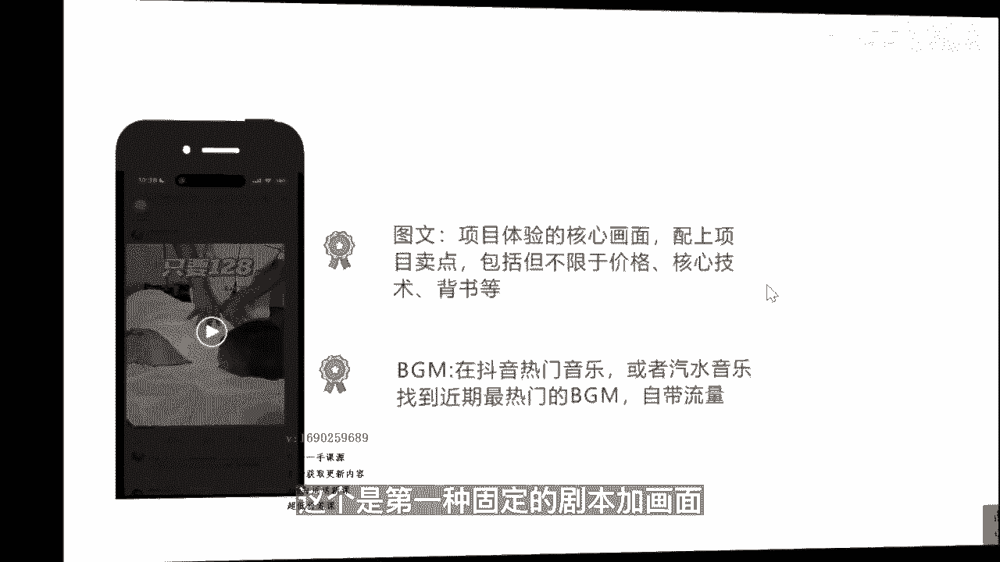

# 083 抖音同城生活-健康垂类0到1运营：入驻-暴力起号-规则篇-消费直播篇！ - P16：16-如何高效产出本地生活短视频 - 早安睿睿 - BV1Fx4y1n7Ba

好各位同学们，我们刚才讲到了怎么去高效的选题，怎么去高效的创作脚本，这一趴，我们来讲讲，怎么高效的去产生本地生活的一个短视频，也就是说我们带货的这些短视频，最核心的一个点。

我们先先来看一下这条视频，帅哥你们家128可以坐两个小时对吗，是的，我们这里面是三个项目，选两个有全身推拿，背部的经络疏松，还要艾灸，现在在景泰，一只用花128，就能体验到120分钟的推拿项目。

而且还是项目三选二，环境干净清爽，古色古香，单肩双人间都有，再换上一刻一换的衣服就可以开始享受了，按完真的轻松很多，全杭州六家门店通用，到月底就结束了，还不左下角赶紧囤起来好，OK像这样的视频。

其实就是标准的达人探店的视频，但是大家有没有想过一个问题啊，如果你是机构的老板，你在一开始做这件事情的时候，可能会花一定的预算去找一定的达人，或者是长此以往，你也愿意去做这个事情，但是如果这些视频。

这些创作的内容都是你们自己去制定的，那么他这中间的核心的转化点，是不是握在你们自己手里，所以我们去拆解这样的内容的时候，他其实无非就是两个核心点，第一个它是有固定的剧本的，我去看，无论这家店是干嘛的。

它这个模式它可以适用于任何的品类，它可以适用于推拿，也可以同样适用于口腔或医美，在这个过程中，他只要把产品的利益转化点，把画面把商家的一些信息去替换掉，这样就可以了，这就是我们所谓的剧本的一个逻辑。

那这种剧本是怎么批量去产出啊，道理差不多，如果我现在去做口腔类的，你可以去选择一个关键词，一个类目下的一个关键词，找出，还是找出它七天最高赞的这一些团购视频，这里跟找对标账号有点不一样。

这里是要找出它点赞最高或者是销量最高的，这些视频，销量最高可以用第三方的这个软件啊，或者是第三方的这个系统，产妈妈和灰豚，那再去拆分他这些剧本的结构，比如说我一次能拆分十条，那你相当于十个CPU。

我们讲叫CPU，你有了这个CPU以后，你可以去装载你任何的视频，装载你任何的形式，甚至把这些视频，把这些优质的这些转化点，都可以同步给你们要来拍的这些达人，当你掌握了这个底层逻辑以后，你去挑达人。

达人只是一个演员，达人只是借用了他们的账号，而不是跟你们以前一样去找了这些服务商，你也不知道服务商有没有给你们匹配，优质的内容对吧，这是底层逻辑，第二个怎么去提高这个效率，很多达人他其实拿这个探店费。

但是如果你让他做的特别复杂，他又不愿意，那这个时候就是呃比如像这这条视频，它的主画面是拍的，但是辅助画面其实就是配音画面，只是去体现核心的环节，全程在做统一的后期的一个配音。

这样就大大提高了一个短视频的一个效率，那对我们商家的老板来讲，既然已经明白了他这个背后的逻辑，那OK你们就可以统一的按照这个脚本这个模板，把这些剧本都写好，并且体现多元化的这个利益转化点进去。

然后让这些达人照着剧本去演，甚至你都可以不让这些达人到店里来，直接让他们在家里去拍一些相关的一些配音，就可以了，当然如果你需要达人去露出，那OK那你还是得让他到你的店里来啊。

这个是第一种固定的剧本加画面。

我再来给大家看一条视频，常回头看，我每天陪你看日落，my my my好，这条视频更夸张，就两张图，但是他卖的很好，他卖的不比那些花里胡哨，拍了一大一大堆的那些视频要来的卖的少，他其实卖的很好。

那它的底层逻辑是什么，就是抖音在去年的时候发布过一个图文计划，就是你热门的BGM加一些图文，就可以获得流量的扶持，他去做这个事情的底层的原因是，因为抖音发现他的很多用户因为不会用剪映，或者是懒得去剪。

导致了他们不发作品，就只看不发，那为了去鼓励这一些一般的用户，能更多的去融入到抖音创作的一个过程中，就发布了这个图文计划，因为你再再怎么着，你就把他当朋友圈发，行不行，诶可以。

那这里就给了我们更大的一个启示，我发布的矩阵的内容，一定需要长篇大论的短视频吗，不是的，你的品像只要组的好，就完全可以只去发图文就可以了，那这个图文可以去体现几个维度，一项目体验的核心画面。

然后配上项目的卖点，这个卖点包括但不限于你的价格，你价格肯定要有优势，或者有有有一定的吸引力，核心的技术背书等等等等，就是你那些卖点都可以融进去，只要在这张图片两三张图片里面能体现就可以。

第二个就是你的BGMBGM，你可以直接在抖音热门音乐或者汽水音乐，汽水音乐是抖音对标QQ音乐做的，抖音旗下的一个音乐平台，你可以去找近期的热门的BGM，基本上在这些热门的BGM，他都是自带流量的。

找一条适配你的用户，适配你的这个画面，就可以这样简单的这个抖音的一条短视频，他依然可以卖得动，那么就反过来去跟我们的这些商家老板去讲，你一天产出两到三条内容行不行，你不去做完全零流量。

你去做至少是有流量的，然后再去投一点本地推，看哪一条数据好看，哪一条转化好，尽可能去投，也就是说到现在为止，大家各位老板可能开始明白，原来抖音的本地生活，他的野心可不仅仅局限于你去做视频，你去做直播。

其实未来他希望这个工具本地生活的这个板块，这个工具成为商家老板去付费获得，通过内容，通过付费，通过主品从抖音上获得生意的一个途径，所以现在你们还认为我做不好短视频。

我没有团队，我就做不了抖音吗，不是的对吧，这样大家也能更好的理解。

然后我再给大家看一下这个视频，这是第三个工具，给大家看一下抖音爆店码混剪出来的视频效果，这个闻着就好香呀，这份煎饼让我驱车10km过来吃，酱料，搭配脆果子和生菜，铺上现炸的鸡柳和里脊。

最后撒上灵魂沙拉酱，柔软的饼配啊，这个火腿真的是太香了，视频效果非常棒，好，这个工具叫爆电码，爆电码是在2022年年初的时候，我们就用的啊，当时特别好用，它的底层逻辑就是你不用专门的一个时间。

把大量的素材先给它拍好，拍好以后呢，你的达人或者是你自己的员工，你的居证号只要扫一下这个码，或者你的客户只要扫一下这个码，他就可以自动生成刚才发的这样的一条视频，那这个时候他大大省去了剪辑视频的成本。

剪辑视频的账号等等等的这一些痛点，它的优势就可以进一步的增加，你矩阵去发这些视频的一个效率，当时也有像我们杭州也有很多的团队，专门在去做这些的信息差，当然从现在的流量维度来讲，抖音其实并不喜欢这种工具。

但是呢这里有个平衡点，抖音不喜欢的是同质化比较严重的这个作品，但是商家他要的是高效产出我的作品，这中间其实是有一个锚定点，是可以去平衡双方的一个关系的，就是你的素材足够的多，你确保每一组源头的素材。

它最终一键智能剪辑成的这一些作品给它限量，比如说我拍一套素材，我只生成五条这样的视频，然后这五条视频我分别付费或者也好，项目置换也好，我给我真实的用户，那这就不会造成单一画面，单一素材。

他过多人发布同类别的这些内容的一个情况，但是又省去了大量去剪辑，大量找达人到我店里来的一个情况，所以这是一个平衡点，所以像这样的这个技术，这样的工具现在已经很成熟了，如果你的产品是标品。

那这里面就也有个点，像这样的工具适合什么样的品，就是你的产品是标品，什么叫标品，就是标准化的产品，比如说我们说像口腔里面呃，你的洗牙洁牙，它就是一个标品，因为你再贵贵不过100块钱。

再便宜也便宜不过十块钱，它是一个标准化的产品，你总有一个价格，你的环境好，你的这个品牌强，那你的价格可能会上下浮动，再比如说像医美机构里面的这些光电的项目，比如说M兔兔超声报。

它总有一个虽然每个机构的价格不一样，但它总有一个价值的一个区间的，那像这种本身产品，是一个非常有它标准化的产品力的情况下，你可以去做这些矩阵，但是如果你是做非标品的。

比如说你去做一些技术类的一些东西对吧，比如说你想去把医美里面的这个注射，注射的手法也好，虽然材料它是一个标品，但是你的是医生的审美也好，这些东西它其实是需要信任的，那他就不适合去做矩阵，总结一下。

如果你是标准品，那你就可以可以去做这样的矩阵，因为它的核心优势就是批量高效的去产出，这一些矩阵的内容，并且降低达人，降低视频制作的一个成本，还有个核心点，就是你可以通过这一些矩阵的内容。

去做关键词的布局，关键词布局的一个核经典，我当然不能说唯一的一个点是靠视频的堆积，但是有一个比较重要的部分就是靠视频的对齐，你视频发的越多，你去见合集，你关键词卡的就越牢好吧。

所以这样的工具它本身也不贵。

你们可以去市面上看，如果需要。