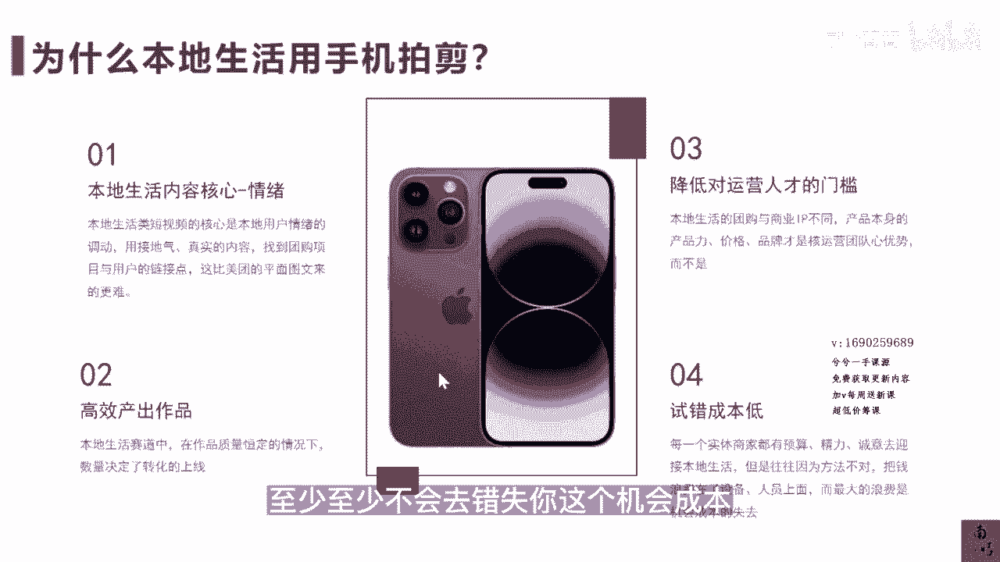

# 083 抖音同城生活-健康垂类0到1运营：入驻-暴力起号-规则篇-消费直播篇！ - P17：17-【手机拍摄剪辑】爆款短视频的创作功法 - 早安睿睿 - BV1Fx4y1n7Ba

接下来我们开始讲一个，非常重要的一部分的内容，叫做手机拍摄剪辑系列的问题，还有很多有实力的老板可能跳出来想反驳，为什么我在学习抖音的本地生活，为什么我要去学这些手机拍剪的一些内容。

诶这个问题其实问的挺好，首先第一点啊，就是我们刚才讲过了，我们去做本地生活其实是需要大量的短视频的，无论是图文还是说VLOG，还是说产品探店等等对吧，所以既然我们需要做大量的视频，提高效率是一方面。

第二方面就是我们要降低我们整个短视频，整个直播运营的成本，提高效率的同时，我们要降低这个成本，很多的，尤其是医美机构的老板都有这样的经历，就是我想做抖音，我想做看脸号的时候，就上来就招一个团队。

招一个团队，成本又很大，然后做了半天就把它给解散掉了，因为成本实在搂不住，最少的一个团队，一个月的成本就奔着五到10万去了，但是做本地生活呢，他不靠这种爆发式的流量，他是靠你细水长流，谁能坚持到最后。

所以就会有这个课程，这就是为什么要用好手机拍剪对吧，你不会，你没有那样的专业的团队，你去做到70分，在我的整个抖音本地生活，消费医疗这一个板块里面，有一个最核心的点，就是你把所有的视频去做到70分。

做不到70分是你的问题，做不到100分没有关系，只要做到70分，你哪怕做个71分都无所谓。

所以这就是为什么要去学手机拍剪好，那去学手机拍件，它还有跟内容相关的，还有几个原因的因素对吧，从老板的经营的角度，我就是为了降低我的这个成本，那从另外的几个维度呢，第一个本地生活内容的核心是情续。

本地生活类的短视频，它的核心的核心就是用户的情绪的调动，你得用接地气真实的内容，而不是在那边耍帅，这和商业IP它有一点不一样，商业IP你可能得用，用一些高级的一些设备去采访，去干嘛，去去去打那些灯光。

但是本地生活不需要本地生活，它就是找到团购的项目，与用户之间的一个链接点，这个链接点它就是一个情绪点，就是我接受了你内容的痛点，并且我感受到了你的团购品相的价值，以及它的这个性价比。

这个就是所有本地生活内容的一个核心点，所以他和美团相比，它最大的一个挑战点在于哪里，就是我需要有更多元的东西的阐述，我需要短视频啊，我需要有直播啊，而美团他只需要图文，只需要通过运营的一些手段。

去把你的评分维护就可以了对吧，第二就我们刚才讲到，我需要高效的去产出我的作品，你要做70分的内容，这个我就不多讲了，第三点，降低对运营人才的门槛，哎我刚才有提到过，很多老板他上来就拉一个团队。

这个团队其实很贵，尤其在一线的城市，他这种团队是很贵的，那么在这个过程中，你要用好你店内机构内的这些人，这个很重要，那些护士对吧，那一些咨询师，那些验光师都是你花钱雇来的员工，当然人家干了额外的活。

你可以分钱给他们，但是你得用好这些人效，也就是说做好把手机拍剪的过程中，如果你做的足够的好，你的一个项目负责人，他甚至可以不需要额外力量的情况下，就可以带动一个小的一个团队。

然后你最终去评估这个团队能不能变出来钱，所以用好手机拍剪，因为你的核心团队，你自己的人其实是最了解你们的产品里，你们的价格的，只不过是通过这些，我前面讲了那些选题也好。

做脚本也好的方法去把这些短视频做出来而已，对不对，所以这个才是降低你这个运营人才，门槛的一个核心点，其次就是试错成本对吧，我们每一个做医疗机构的老板其实都很忙，恨不得你们有很多家店，是。

当你这些预算经历都花在了，一个可能拿不到结果的，一个大的一个专业团队上，你就会对这件事情丧失一个信心，而丧失信心的核心是错失了机会成本，错失了这个抖音本地生活的这个机会，还不如用最低的一个成本去打你。

把钱花在你的流量上面，不要花在那些所谓的设备也好，专业人员上面，这样的话你就不会去，至少至少不会去错失你这个机会。

