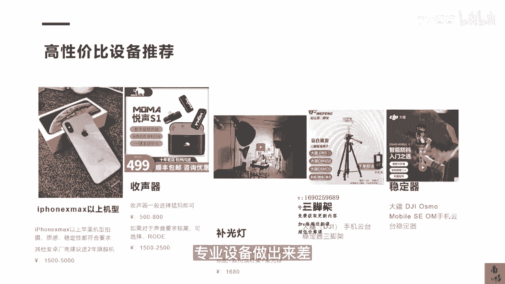

# 083 抖音同城生活-健康垂类0到1运营：入驻-暴力起号-规则篇-消费直播篇！ - P18：18-【手机拍摄剪辑】高性价比设备推荐 - 早安睿睿 - BV1Fx4y1n7Ba

既然明白了手机拍剪的重要性，那接下来我给大家去推荐几款高性价笔的设备，然后你再去算算，你要去做抖音，你要花多少钱，第一个如果你要去做拍摄，你大概可以选择IPHONE10以上的机型就可以了。

其实IPHONE10是一个我们自己试验下来，是一个拍人最好的一个机型，它可能拍人的效果很邪门，比比IPHONE十三十四可能更好，虽然他的那个机型已经是好两年以前的机型。

但是他的IPHONE10其实是很不错的，目前如果你买比较九成新左右的二手机，也就1000多块钱吧，那你可以买个两三台，可以做矩阵用，那么第二个就是收器，收声器是很多店家他去忽略掉的，收声器其实非常重要。

一般你可以去选择门马，门马这个牌子就是国产收身的一个天花板啊，还不错，大概也就500~800，看你是一拖几，如果你的预算还行，要选择更高级别的，你可以去选择罗德，差不多1500到2500的样子。

第三个是补光灯，那如果你在室内做直播，补光灯是绕不开的，那这种补光灯的话，基本上你去选神牛这个牌子，去选神牛的SL150就可以了，当然具体看你的这个场景啊，就是你看你地方有多大，基本上就是一个圆头灯。

一个平灯，然后可以再配一个美颜灯，差不多1000多块钱就配的很好，三脚架可以选择大疆的DJI，这个三脚架差不多100多块钱吧，很便宜，然后如果你需要拍一些VLOG的，你可以去买一个大疆的一个手机的。

云台的稳定器和bios1的OM应该是四五百块钱，所以所有这些东西加起来可能都不到1万块钱，如果按照你们原来的逻辑，就是恨不得一台相机就2万块钱下去了，所以这整一套东西其实就已经可以。

完全完全很高效的启动整个视频，短视频制作的一个链路了。

