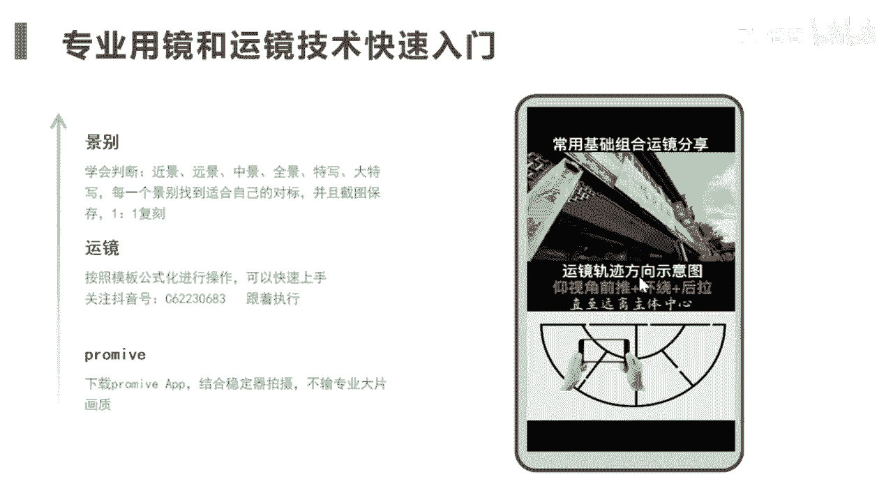
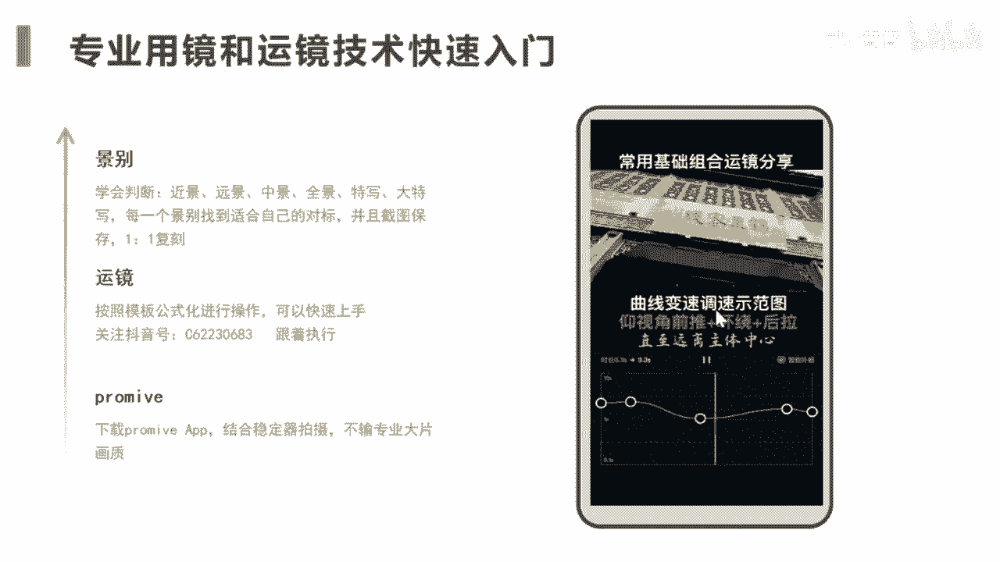
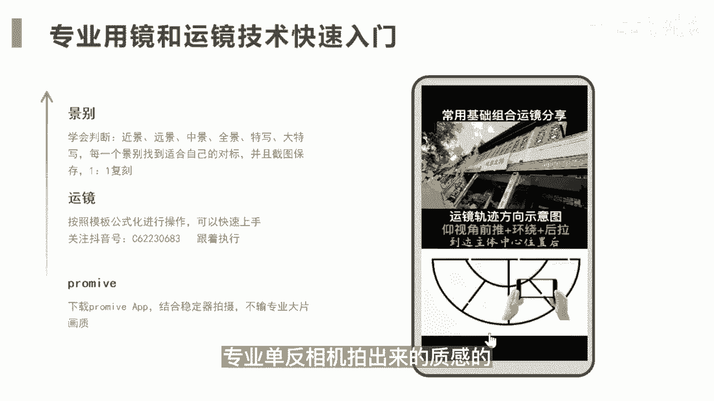

# 083 抖音同城生活-健康垂类0到1运营：入驻-暴力起号-规则篇-消费直播篇！ - P19：19-【手机拍摄剪辑】专业用镜和运镜技术快速入门 - 早安睿睿 - BV1Fx4y1n7Ba

这里再花一部分的时间来给大家讲讲，如果你的员工或者你自己完全不知道怎么用手，手机拍出专业的视频，那我这里可以给你教一下快速入门的方法，因为照顾到很多的中小的商家，他是没有这些专业的摄影师的。

那这里有个快速的入门的诀窍，首先你要学会判断景，别学会判断什么是近景，远景中景全景特写，大特写，这个是最入门的一个点，就是你要知道你在拍的这个景属于什么景，然后这里很重要。

每一个景都可以找到适合自己的对标账号，或者对标场景，然后把它截图下来，这个怎么去理解，我们前面教了很多找对标账号，找对标内容的方法，当你去找这些方法的时候，你前面拆的是他们的内容。

这个时候你可以去拆人家的景别，比如说我想拍一个医美机构的一个VLOG，那很简单，你去从户外到店内到项目的特写，你都给它标注好这个分别是什么样的景别，然后一笔一去复刻，你觉得看着舒服的一笔一句复刻。

说白了就是抄就是个抄，你能抄明白就可以了，第二个就是运镜，运镜的话，你可以按照公式化，模板化的方式去进行操作，你想你去招一个摄影师，在杭州基本上一两万，你去培养你这些员工。

你不可能把他培养成一个专业的摄影师，那OK既然要做到70分的内容，你就是按照公式模板去进行操作就可以了，如果你要系统性的去学一下，这个也OK，免费的，你可以去关注这个抖音号，它上面有很多类似的这种教学。

我可以给你看一下，可以给你看一下，手机镜头稍仰视角前推，到达主体中心位置后环绕并后拉镜头，直至远离主体中心。

他已经给你教学到了，就是照着去模仿就可以了，那如果模仿不清，那那那这个就不是你的问题了，所以像这样的组合，就可以更快的让你去上手手机拍摄，而且像我们这一些医疗类的这些商家，你需要的这种运镜也好。

他不像吃喝玩乐那些那么的要求那么高，更多的还是把东西拍清楚，拍稳定就可以，如果你对你的画面要求是比较高的，你可以在你的苹果手机里面去下载，一个叫pro movie的一个APP，可能要付点钱吧。

十块钱还是八块钱的，你可以去下一下它，再结合你的这个稳定器，整个拍出来的视频质感是不输你相机，专业单反相机拍出来的质感的。

