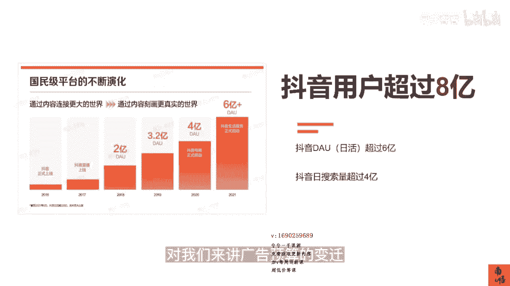

# 083 抖音同城生活-健康垂类0到1运营：入驻-暴力起号-规则篇-消费直播篇！ - P1：01-抖音本地生活概况 - 早安睿睿 - BV1Fx4y1n7Ba

各位同学，从今天开始，我们开始系统性地讲一讲抖音本地生活，消费医疗板块的一些课程，我在直播间里面说过很多次，2023年对于我们消费医疗，尤其是这一些依靠，对于同城付费用户特别倚重的这一些板块。

比如说我们的口腔，眼科，医美，中医等等这一些板块，我们的抖音本地生活，一定是2023年最大的风口之一，最大的机会点没有之一，那为什么会有这样的一个判断，因为我们都知道抖音是一家互联网公司。

而对于抖音这样的公司，它以前叫做字节跳动，现在叫做抖音集团，我们可以看到在我们圈里面，我们可能会认为，抖音已经是中国最大的互联网公司，没有之一，但是因为它没有上市，所以从官方的数据上来讲。

并没有这样的表达，我们再去分析抖音目前的变现的几个大的板块，包括它的广告营收对吧，然后包括他的抖音的电商，目前抖音的电商应该是占了15%的比重，是从2020年开始起的，那微信曾经想干电商，其实没干起来。

但是抖音不管怎么样，现在干的还算明白，那对于抖音这样的公司，他当然会有很多其他的一些变现的手段，但是足够撼动一个整个行业，或者是这个存量市场的一个天花板，的本地生活是他一定不会放过的一个赛道。

因为我们都知道，美团就只做了本地生活一个项目，但是它是中国第三大互联网公司，它在营收，它的流水都是非常大的，所以对于抖音这样的公司，我本身就有用户，我也有本地的用户对吧，我有流量。

我为什么不去做本地生活，其实在2020年的时候，抖音就第一次去布局本地生活，抖音的本地生活，但是啊没有成功，那么在2021年年底的时候，下半年的时候又做了第二次布局，那么好在是在2022年的时候。

其实无论在餐饮还是非餐道宗这一些板块，他都拿到了不错的结果，那么对于我们来讲，原来抖音对于医疗的这个开放程度，或者是限制程度是非常大的，但是在2022年年底12月份的时候。

抖音本地生活突然对于我们这个赛道的医美，当然是头部的口腔，眼科等等几个头部的商家进行了内测，那么根据我们现在的消息，这个趋势是逐渐会开始放大放开的，一定是需要把握住这个机会。

你们在某团的时候其实已经拿到过了一些结果，但是抖音的本地生活一定比美团会更难做，因为它不仅仅是把我的产品上上去，把我的评分维系好，他还需要去做内容，自己的内容，达人的内容还需要去做直播，方方面面。

这一些内容，还必须得符合抖音目前医疗的这些规则，所以我在这个系列课里面会从入门到进阶，都会一次性的去讲明白，抖音的本地生活到底应该怎么做。

抖音的本地生活的消费医疗到底应该怎么做，我们这一系列的课程，大概会分分成四部分的内容，那今天要讲的是抖音本地生活，医疗类目的先导课，先导课里面大概会跟大家讲一讲，我们现在目前抖音本地生活。

以及他整个医疗类目的现状，以及我们的机会点，那第二部分呢是去教大家抖音的来客操作，因为抖音来客是我们作为商家，作为机构的老板，必须要去学会的一个，去操作本地生活的一个核心的一个工具。

那么第二部分呢是我们去讲一讲本地生活，如何零粉的去暴利旗号，我们先来讲一讲，抖音这个国民级平台的一个演化的路径，我们都知道抖音是从2016年开始上线的，真正其实开始爆发，其实在2019年的时候。

而口罩事件的过去的几年，而让整个抖音从一个普通的互联网的一个平台，成长为一个具备公共属性的一个国民级的平台，目前抖音的总总用户其实已经超过了八个亿的，还不算海外的TIKTOK的版本。

那么目前抖音它的DAAU，日活已经超过了六个亿，而这个数据是在2021年，创作者大会的时候的一个数据，而2022年其实并没有更新这一个数据，那我们且认为是六一多吧。

而目前因为每天的这个搜索量是超过四个亿的，这个数值也是碾压百度的，所以从这样的一个国民级平台的一个，不断的一个演化过程中，我们看到了很多的这些用户的习惯，用户观看的这个习惯，是在发生本质上的一个变化的。

而这样的一个量级带给我们，作为消费医疗的老板，我们更应该看到这背后的平台的变迁，用户的变迁，对我们来讲，广告预算的变迁。

抖音为什么要去做本地生活这一条赛道，没有别的原因，就是因为中国的互联网，本地生活服务的市场规模实在太大了，在2021年的时候，他已经达到了2。6万亿，是一个妥妥的万亿的一个赛道，我刚才有讲过。

其实像美团这样的公司，它并没有其他过多的业务，就是做深耕本地生活这一块，在很多年以前我们都会听过一个词，大概10年以前吧，都我们都会听过一个词叫百团千团大战，那个时候会有很多诸如口碑也好。

或者是其他的一些大大小小的一些团购的平台，在那边厮杀，最终跑出来的是美团，所以美团在本地生活里面妥妥的是C位，而他基本上享受到了整个市场的这个体量，我们的外卖，我们的吃喝住行都。

其实甚至是买药都是跟美团有关的，而它的同比增速，还是以15。1%的这个速度在做，所以有数据显示，到2025年左右，中国本地生活的市场规模可能会达到4万亿，那这个体量并不是某一个小的细分的赛道，是比拟的。

所以讲到这里，大家会明白抖音为什么必须要做本地生活，因为我的流量足够啊，我的内容足够啊，我对我本地多元化的用户的这个吸引足够啊，我为什么不去做本地生活，对不对，而我们目前国内本地生活服务市场。

整体的渗透率只有12。7%，所以它的无论是当当下的蛋糕，以及它未来的这个增量其实都是非常大的，具备非常大的一个空间的，那么讲完为什么抖音要来入局本地生活，我们再来讲讲讲，本地生活必定绕不开的几个平台。

首先当然是我们今天最重要的一个呃，抖音的本地生活，抖音的本地生活，其实是从2020年就开始布局，当然我刚才也说过，2020年他做的并不好，那么2021年年底的时候，抖音的本地生活又开始被呃布局。

并且在抖音内部它属于S级的项目，什么叫S级的项目，跟它平行的就是抖音的电商，所以基本上作为抖音最根本的一个方向去发展，抖音的本地生活，还是被寄予了非常大的一个希望，所以好在是抖音的本地生活。

在2022年的时候拿到了不错的成绩，他的年度gm v大概是呃500亿元，但是在第六个月的时候，他已经完成了近乎一大半，目前22022年，整个年度的GMV并没有对外披露，那我们大概率判断。

根据我们每天在市场上的一个判断，它是一个应该是远远超过他的一个目标金额的，所以这就是抖音目前的本地生活，其实对于现在一些板块，比如说餐饮，我们已经感知到一些商家，对于抖音和对于美团的营销预算的支出。

其实已经现在已经是五五开了，这是一个非常恐怖的一个暗示，因为当你习惯了在抖音上去买这些，吃喝玩乐的这些trap，那你会不会去做一些跟医疗相关的，也就是说用户的消费习惯已经建立了，用户的浏览习惯。

心智已经建立了，那这个时候说明他的根基已经开始，逐步的形成了，第二部分，我们来讲一讲美团，美团是在目前本地生活板块，绝对的老大霸主的地位，那么对于美团的数据是怎么样呢，整个交易加点评的模式。

是目前美团在本地生活领域中的一个护城河，我们都知道美团原来是收购了这个，并购了这个大众点评，也就是说整个美团不仅有美团，还有最重要的一个大众点评，所以这才是它的一个护城河，截止到2021年的第一个季度。

美团点评的数量已经超过了100亿条，也就是说他几乎控制了用户，对于商家的这个判断，我们做消费医疗的老板们都有这个感慨，我去做大众点评或美团呃，我可以不通过这一些平台来特别多的流量，我也不期望。

但是我的评分不可以差，这就是他的整个生态衍生出来的很多啊，所谓的一些代运营的公司，他其实做的很简单，就是帮你的找一些咱不能说水军啊，找一些方法，找一些方法，把你的评分维护在4。5分以上。

然后他收取相应的这个服务费，那这个是在美团点评时代的时候，他最重要的一个环节，我可以做的不是最好的，但是我不能差，差了就没人来，2021年Q3的数据来看，美团活跃的商户是阿里的三倍。

如果从收入的角度来看，2022年Q1，阿里本地生活的这个非外卖收入，是一点一个亿左右，美团是7。6个亿，所以原来美团的对手可能就是百度和阿里，而百度和阿里基本上被美团打趴了。

所以这就是目前美团在本地生活中，一个绝对霸主的一个地位的体现，而第三部分我们要提到饿了么，饿了么，其实它本身的这些数据没什么好多提的，那这里就提两点啊，就是去年的8月19号。

抖音和饿了么突然之间就宣布了达成合作，深入合作，然后他们整个会按照，并不是一个简单的一个公司机内合作，而是一个较为深入的合作，这个布局很明显，就是明眼人都看得出来，抖音就是要打美团对吧，而在这个月。

就在这个月，2023年的2月份，抖音的外卖已经开始上线了，而且很多的城市已经开始在做配送了，这个时候美团会着急，为什么美团所有的护城河都做得很不错，但是唯一点流量没有抖音大。

所以在我们这个国家做所有生意，无论是你是线上还是线下，真正的核心还是在于流量，这是美团最怕的一个地方，这也是抖音敢跟美团去争本地生活，这个赛道最有底气的一个环节就是流量。

那么都说抖音的本地生活在2022年，其实已经拿到了一些结果，那他具体在2022年做的团购数据，是怎么样的一个表现呢，我们来看一下目前整个抖音的本地生活里面，他的整个团购达人的数量，什么叫团购达人。

就是那天那些来你店里探店的，或者给你做直播的一些呃，同城的达人，那这些达人他的核心就是他的粉丝，几乎都是这个城市当地的，也就是说这些人，他是叫做活跃流量的一个供给的一个个群体。

那么这个团购达人的数量在2022年年底，增长至350万，这个数据还是比较可观的，那么商家日均开播的场次是2万场，商家增长量达到了10万，那么这里面呃商家的增长量我觉得不用去多讲。

商家的日均开播场次达到了2万，这个还是比较厉害的，因为我们都知道去做一场直播，他其实还是比较费劲的，那么那么多商家愿意花钱，他去做直播，一定是花钱花精力的，他那么去为了这个抖音的这个平台去做直播。

肯定是赚到钱了，而这个数据我们根据我们的判断，在今年应该会翻好几倍的增长，这还不是一个特别大的一个数据，而到了去年的6月份，2022年的6月份，抖音本地生活的品牌数量达到了15万。

而且这个只是一个2022年半年的一个数据，入驻的团购商家增长了4万左右，整个短视频的贡献，我们指的是就是那个小房子，指短视频挂团购链接的，这个数值接近70%，也就是说本地生活里面的视频。

70%是挂了这个小房子的，如果你是电商，那叫小黄车，如果你是本地生活，叫小房子，内部的目标是年底，直播所贡献的GMV能达到35%以上，这个怎么理解，其实在2022年的时候，大部分的抖音本地生活。

在做的都是我们刚才说的，团购达人在探店的这样的一个模式，但是平台也感受到了，也发现了这些团购的达人，他们的内容越来越多了以后就趋于同质化，当趋于同质化以后，这是抖音不愿意看到的。

因为抖音虽然他想做本地生活，但是从本质上来讲，它还是一个内容平台，那么多元化的内容，这是抖音的护城河，如果因为你要去做本地生活，导致了我本地的用户，看到的这些视频都是同质化的，这是我不愿意的。

所以抖音在去年下旬的时候，去年下半年的时候就开始要求达人，你要去做直播，因为直播相对的数据和短视频的数据，它可以做到一定的这个差异化，然后鼓励商家去做直播，所以这是我们看到的一个机会点。

在2023年的时候，为什么我这个课程里面，最后一趴会重点去讲这个抖音的直播啊，抖音本地生活的这个直播，是因为我们会认为2023年达人的权重，达人的这个数量依然会增加，但是达人流量贡献值的权重。

并不会像去年那么高，我指的是笔直，而达人的这个直播和店家的自播，这是抖音最鼓励的一个环节，所以今年2023年入局以后，除了达人的布局，做好自己的这个直播，投好本地推，是今年2023年，抖音本地生活。

