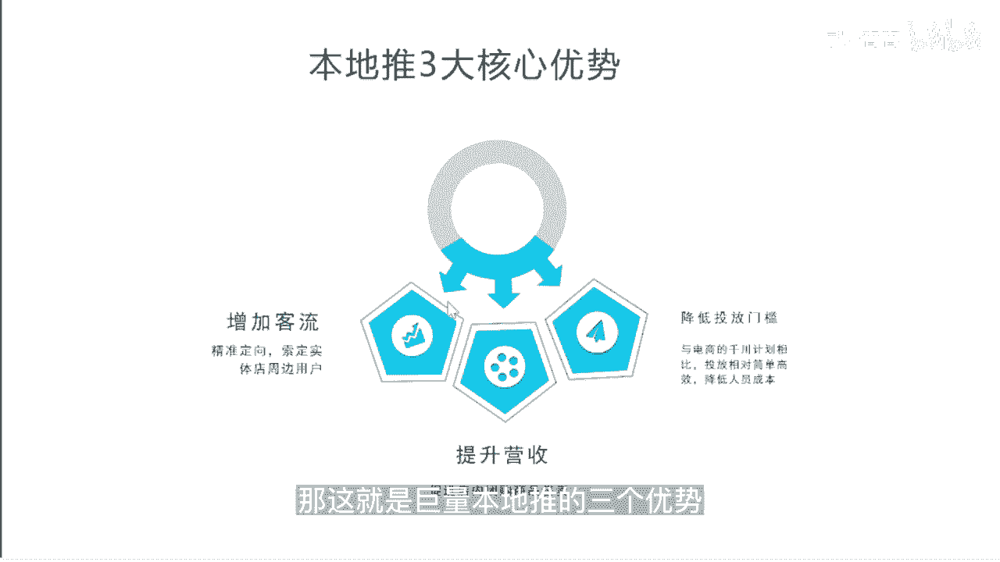

# 083 抖音同城生活-健康垂类0到1运营：入驻-暴力起号-规则篇-消费直播篇！ - P20：20-【本地推】巨量本地推产品介绍 - 早安睿睿 - BV1Fx4y1n7Ba

我们这一趴的内容，最后一个课程呢是去介绍巨量的本地推，从2022年的10月份开始，当你挂载你的小房子的那个POI以后，你就不能再去做斗家的投放，你只要关联上了这个POI，你就只能去强行跳转到本地推。

那我们都知道目前抖音的投放，付费投放的工具总共有以下几种，第一种呢是这个巨量千川，千川就是用于这个抖音电商直播的对吧，电商直播和短视频，你要卖货的时候去做这个巨量的千穿，然后呢小店随心推是在手机移动。

你可以简单理解为移动版的金川，那抖家就是对你正常的内容进行一个投放，而巨量本地推几乎可以平行对标，当年2020年千川刚创建的时候，他主要是为了本地的商家去做付费流量的转化，时候的一个专门的一个工具。

那很多粉丝其实在前面就已经问我，他都找不到巨量本地推的这个入口，下了app网站都不行，那其实巨量本地推的入口，它其实是嵌于抖音来客的APP，那相信你们看到这里的时候，已经知道了。

抖音来客是一款是怎样的APP，所以我这里就不过多的赘述解释，当你的门店认证审核入驻都已经完成以后，你的抖音来客的这个首页，就会有一个推广的按钮，那里面其实进去就是你的巨量的本地推，对巨量的本地推。

其实是抖音为生活服务商家造的一个，一站式的营销平台，它其实就是让你来花钱搞流量的，搞流量，然后去匹配你的素材，然后最终去算你的IOI，就是巨量本地推的作用，巨量本地推有三个核心的优势。

第一个优势就是它可以增加你的客流，它里面有一个特点，就是可以一会我会给大家演示一下，它可以精准定向的，确定你这家实体店周边的用户，那对于很多的比如说口腔清美，其实你这个实体店的POI附近。

8km或5km之内的客户，才是你真正精准的客户，尤其是口腔，你如果比如说在我们杭州，你城西和城东对吧，城西的客户很难开车大半个小时跑到城东，去补个牙或者去种个牙。

因为他是一个高频需要定期去复诊的一个项目，所以这个是比较适合于本地推的，第二个呢就是促进你店内团购的一个售卖，当你的所有素材的数量质量是恒定的情况下，你确实希望去提高更大的一个营收。

那你就可以进行付费的一个介入，而且我们会认为原来这些口腔机构，每年大一点的可能投几千万，在抖音的信息流表单上，这一部分预算慢慢的会向本地推，会去做一个倾斜，这是我们看到的一个机会点，所以在投信息流时代。

投表单时代留下来的这些打法，你去外包去拍素材，然后把你的这个量给包出去，然后吃这个量的返点，这个我相信应该一去不复返了，那种暴利只要花钱就能解决这些点，进去不复返，所以在本地推的这个时代下。

花钱只是一个最基本的一个逻辑，你要去明白它的内容的底层逻辑是什么，你要去明白怎么样的，这个投放建模是比较适合你的，所以巨量本地推，第三大特点就是它可以降低投放的门槛，比如说电商的千川主品。

它是一个相对比较专业的，你什么时候要通投去做，什么时候要建定向的，但它其实还是相对会比较复杂的，当然投的好，本地推也复杂，但是相比这样的一个门槛，巨量本地推已经做的相对会比较简单了，但是从长线来看。

从IOI的这个投产比来看，谁能掌握本地推的投放的节奏和逻辑，谁就掌握了这个核心的竞争力，你看像千川时代，就造就了很多人专门去讲怎么投放千川，怎么去花钱，这样的课程听的人都特别多。

我相信本地推上限没有多久，如果谁能去把这个投放的逻辑去研究明白，研究通透了，那自然他的竞争优势会更大。

