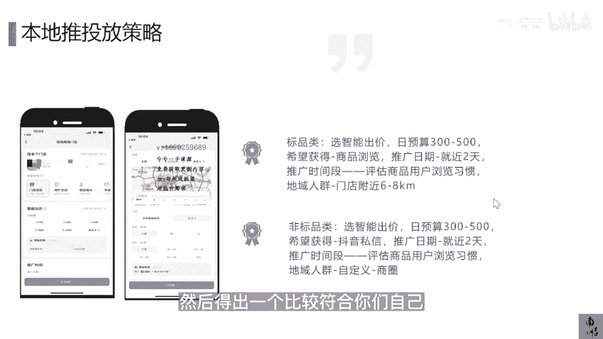

# 083 抖音同城生活-健康垂类0到1运营：入驻-暴力起号-规则篇-消费直播篇！ - P22：22-【本地推】本地推投放策略入门 - 早安睿睿 - BV1Fx4y1n7Ba

那么我们也来简单的讲一讲，因为我们这个是入门课，我就相对简单的去跟大家讲一讲，本地推现在投放的策略应该是什么样的，首先如果你是标品类，标品和非标品，我刚才在前面的课程里面已经解释过了，你如果是标品类。

那么你就直接去选择智能出价，每天的预算不要特别大，不要上千，你就基本上每天的预算先在300~500之内，希望获得，这里有个选项叫希望获得，就是你的这个期望值去选择商品的浏览，推广日期。

就在附近的两天推广的时间段，你去评估你们家商品用户的浏览习惯，比如说我如果推的是医美的产品，那用户的浏览习惯有可能是中午，傍晚或者是晚上都有可能，但是你如果推的是儿童的洁牙，或者是儿童的涂服。

这样这样口腔类的行为，那你要你就要去猜测这些宝妈，她们的时间节点是怎么样的，总之根据你自己用户的这个习惯，如果我是推拿，我可能要就要推白天上班的时候对吧，根据你产品的这个特性去挑选。

然后地域人群的这个选择，就是附近门店的六到8km，但是这不是绝对啊，我们只是给出了一个，这样去组织你投放策略的一个建议，最终你要投出来比较高的IOI，你就要不停的去做那个测试，把不停不同的计划。

一天可能去建个三个计划，把不同的计划的数据去复盘，然后筛选出那个IY比较高的，那么第二个如果你是非标品，那么也是选择智能出价，预算在300~500以内，这里为什么每天我们单条计划。

我们不建议你去做特别高，玩互联网流量的所有套路，里面就有一个MVP的逻辑，就是你要把最小的投产的模型跑通，你再去给它放大，那投放也是一样的，只不过原来你们做信息流的时候，你们那些投放的公司。

没有去教你们核心的东西而已，所以当你自己去上手的时候，你就可以按照这个逻辑去走，然后你去点那个希望获得就点那个抖音私信，因为非标品类，比如说医美类，如果你确实想去卖针剂的，在线上。

其实现在目前上架都上不了，未来即便你能上架，你在线上去成交材料，其实没什么太特别大的，用你的核心是私信获得人家的刻字，叫做我对于眉弓，我对于下巴有这样的打针的需求，那这个刻字就可以精准的获得了。

你没有必要非要去投那个成交，推广日期也是就近的，两天推广的时间段，同样道理，根据你用户的习惯去做，然后低于人群可以选商圈，因为像这种非标品的，他其实对于你门店的地址倒没那么敏感。

你基本上可以去选那些热门的商圈，为什么选热门的商圈，因为在热门的商圈里面，他的这个POI的热度是比较高的，那这就是我们讲的这个巨量本地推的一个，比较入门的一个投放策略的一个建议。

最终还是根据你自己实操中，不停的去评估你的数据，去优化迭代你的内容素材，然后得出一个比较。

