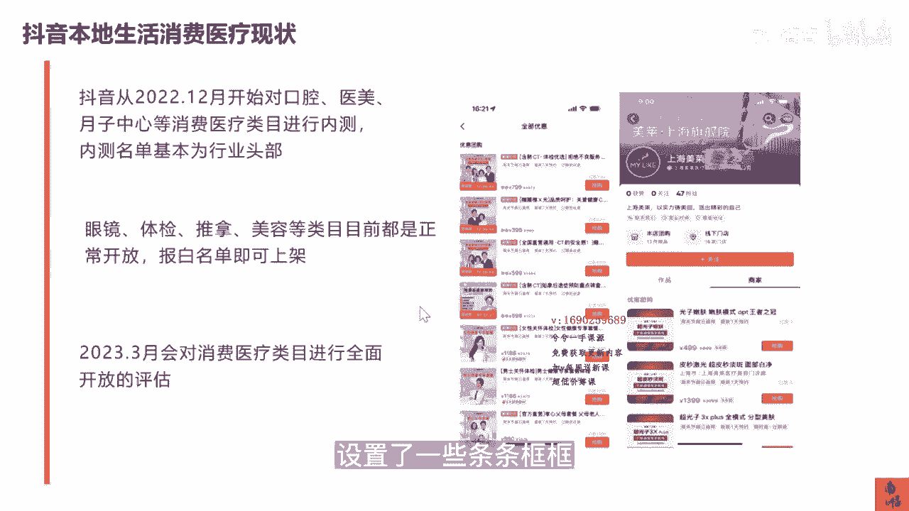

# 083 抖音同城生活-健康垂类0到1运营：入驻-暴力起号-规则篇-消费直播篇！ - P23：23-抖音本地生活-消费医疗现状（何时开放？） - 早安睿睿 - BV1Fx4y1n7Ba

好接下来一趴，我们来讲一讲抖音本地生活，跟我们医疗相关的这个垂类，它里面有哪一些套路，比如说现在给你们墙上的这些黄牛，他们是什么样的方法套路，什么样是靠谱的，什么样是不靠谱的，他们所谓的告白是真的吗。

包括我们如果上架了我们的本地生活，我们的团品应该怎么去组，以及组了以后，我们整个抖音本地生活，医疗这个赛道，又需要去符合遵循哪一些抖音的医疗的规则，我们在这一趴的内容里面。

都会给大家讲的明明白白好，目前抖音本地生活，消费医疗的一个现状是这样的，从2022年的12月份开始，就已经对口腔医美，月子中心等消费医疗类目进行了一个内测，而内测的名单都是定向邀请的行业。

头部的口腔全国只上了三家医美，应该是三个省一家啊，这都是头部才能去做的一个内测，那么目前眼镜体检，推拿美容这些都是正常开放的，他只要报白就可以了，这里我可以给大家解释一下什么叫爆白，报白名单。

他其实是就说白了有些行业它还没有完全放开，但是呢对方的运营就是抖音的本地生活的运营，他认为你这个服务商提上来的这个名单靠谱，他就可以给你进行一个白名单，而目前我们讲医美也好，口腔也好，眼科也好。

都还是在内测阶段，所以定向邀约和报白还是有一定的区别，而那些通过强行上架那些，他其实说说是报白，其实是通过一些抖音平台自己的一些漏洞，或者一些呃他都不知道的一些逻辑去上的，所以那个其实并不叫爆白。

所以抱白这个词是大家一定会碰到的，大概到2023年的3月，会对消费医疗进行全面的开放的评估，当然这只是评估，目前的消息是在3月15号以后，口腔是正式的会进行一个开放。

当然这个开放啊还是设置了一些条条框框。

