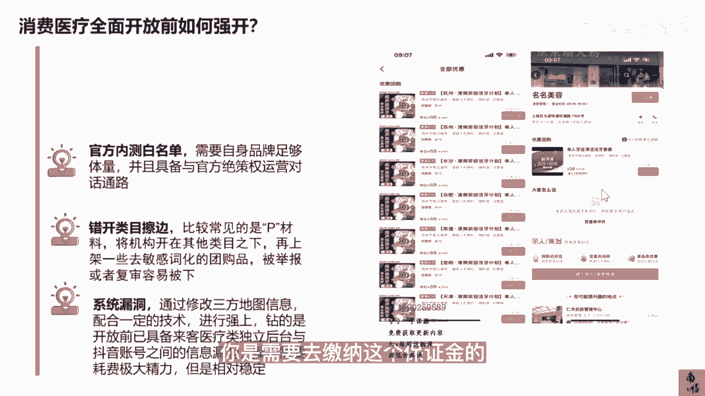

# 083 抖音同城生活-健康垂类0到1运营：入驻-暴力起号-规则篇-消费直播篇！ - P24：24-眼科、医美、口腔、中医、康复、体检等无法报白情况下如何强开？ - 早安睿睿 - BV1Fx4y1n7Ba

很多医疗行业从业者或者一些机构的老板，他们可能都已经接触过抖音的本地生活，甚至有很多本地的服务商找到他们，告诉他们，你们现在这个类目没有完全开放之前，是可以帮他们报白的，然后收取一定的费用。

这个费用1500~5000多不等，那我来跟大家讲一讲，在真正的抖音本地生活消费医疗开放之前，到底怎么强开或者强开，总共有哪几种方法，大家要不要去做，首先目前最靠谱的就是刚才我讲到的，内测的白名单。

这种内测的白名单需要你自己的品牌，符合足够大的体量，进行直接对话，这个是比较难的，那第二个现在是做的比较多的，中间的黄牛做的比较多的，就是错开类目擦边上，这种情况。

比如在口腔类目或者医美类目做的是最多的，就是把口腔和医美通过营业执照的改法，那如果是正经一点的，他就会让你再搞本营业执照，不正经一点就直接批了你这个材料，把你这个机构放在其他的类目之下。

一般放会放在审美的类目下面，然后去上加一一些去敏感词化的团购品，比如说去避开你的门头去，就是拿kt板去再造一个门头等等，这些方法确实他是可以上的，甚至是好像解压这一些，他确实也可以正常去卖。

但是但凡只要被举报运营去复审一下，他就容易被下，这会导是你原来花的这些钱做的这些事情，就一下子就变成没有意义了，那这个情况呢你要怎么去去做，首先一你不要去花钱叫别人去上，你如果实在想强上。

学完我们这整套课程以后，我告诉你自个儿都可以上，因为做任何所谓的这些流量的生意，你一定要明白背后的逻辑，底层逻辑是我的课程里面讲的最多的一个点，你只要明白了底层的逻辑题材料，谁不会，至少你不花这个钱了。

你去做这件事情，哪怕你墙上了一个月，两个月都OK啊，那这个可以的，比如像右手边的这个第二张图，它这个就明显是墙上的，所以既然你要要去做强上，你就保持低调，这是第二种，所以不要去花那个冤枉钱。

而且我也并不建议大品牌去做这个事情，没必要，第三种呢是走一个系统的漏洞，它的底层逻辑是修改第三方的地图信息，就是你去把所有这些涉及你之前这本营业执照，所有地图的这个信息去改了。

然后配合一定的技术进行墙上，我本来想把整个技术贴在这个课程里面，但是想了一想，因为我的所有课程要经过抖音官方的审核的，这个东西对我来讲，只是我不去赚这个墙上的这个钱，但是我如果教了这个方法。

很有可能被抖音认为是不正当的竞争，所以我就不准备把它放在我的课程里面，我可以告诉你，他的逻辑就是去修改第三方的地图信息，配合一定的技术，这个技术也不是特别的难，如果有需要的，咱在公开的课程里就不去讲。

但是你们如果有需要的，可以看到这个点以后私信我，我可以教你们，他钻的是什么呢，钻的一个漏洞是开放前已经具备了这些类目，比如说口腔也好，医美也好，它已经具备了莱克医疗类独立的一个后台，那这个时候呢。

你的抖音账号上面又有很复杂的这些地点信息，或者是一些pi的这些信息对吧，就是那些那个资料的这些信息，这里面有一定的漏洞，所以操作的时候他需要费比较大的精力，你要去花足够多的耐心去做。

但是这种操作它是相对稳定的，目前来看他不会你去举报，他是没有用的，因为它的每个环节都是符合审核的要求的，所以如果非要去做这样的强开，你去用第三种方法好不好，去用第三种方法。

但是我们不能去保证你100%能成，经过我们的几轮测试，成功率还行，所以如果你非要去做强开，你大概去参考一下目前的这样的情况，从我个人的角度，如果你是品牌的连锁机构，我觉得你可以等一等。

正经上一定是最好的，但是如果你确实比较急，或者现在店里的生意已经不那么美丽了，需要通过更多的业绩，更多的流量去养活你整个团队，那如果你想去玩强上也不是不可以，因为确实抖音本地生活的流量还是比较精准的。

你说现在除了这些抖音本地生活的付费，到店的流量是一个机会，还有什么样的性价比比较高的方法去做，然后这里面还有一个好处，无论是二也好，三也好，他都不需要去缴纳这个保证金，但是如果你是官方内测的白名单。

