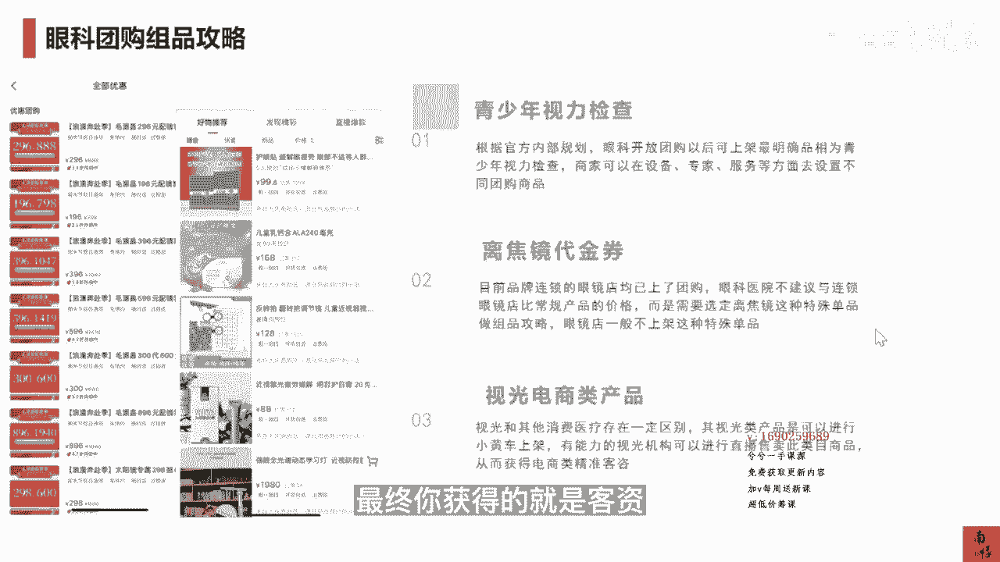

# 083 抖音同城生活-健康垂类0到1运营：入驻-暴力起号-规则篇-消费直播篇！ - P25：25-眼科团购组品攻略 - 早安睿睿 - BV1Fx4y1n7Ba

再来看一下眼科的团购主品，大概我们觉得是可以从三个角度，就是第一个肯定是抖音，官方给出来的青少年的视力检查，那么根据目前官方内部的规划，眼科开放团购以后，可以上架最明确的产品就是视力检查。

商家就是你们可以在设备专家服务，当然还有价格等方面去设置，不同的这个团购的产品，然后我们根据我们经验，你可以把你们的视力检查，因为每家诊所其实都是有眼镜店的，和你们眼镜店那一块的离较近的代金券。

可以把它搞到一块儿去做，因为很多现在品牌的，你看宝岛也好，或者是毛源昌也好，都已经上架了他的那个眼镜店的这个团购，当如果你是跟人家去比那些便宜的，这种树脂镜的这种价格没有意思。

我觉得如果你是一个眼科的诊所，或者眼科的医院，你可以去在离焦镜，这种高客单的项目上去做一做文章，因为离焦镜毕竟是目前青少年近视，还是用的比较多，比的一个品类，它和OK性这一些线下怎么去组合。

你的私域率怎么去组合，这还是有很多种玩法可以做的，那第三种，这个其实已经就不是本地生活的这个范畴了，但是和你们自己门店的这个账号，内容运营测的话是可以去结合的，去放一些视光类的电商类的产品，举个例子。

比如说你的反转拍的这个知识，付费的这些东西，包括一些这个儿童的钙片，包括一些护目的这种药膏，还有一些就是学习灯，还有一些叶黄素之类，就这种东西愿意去买这种品的这种家长，他肯定是你们的潜在的精准用户。

所以视光比其他的这几个消费医疗的类目，可以玩更多的花样出来，它可以组合抖音的电商和抖音的本地生活，共同去组。

