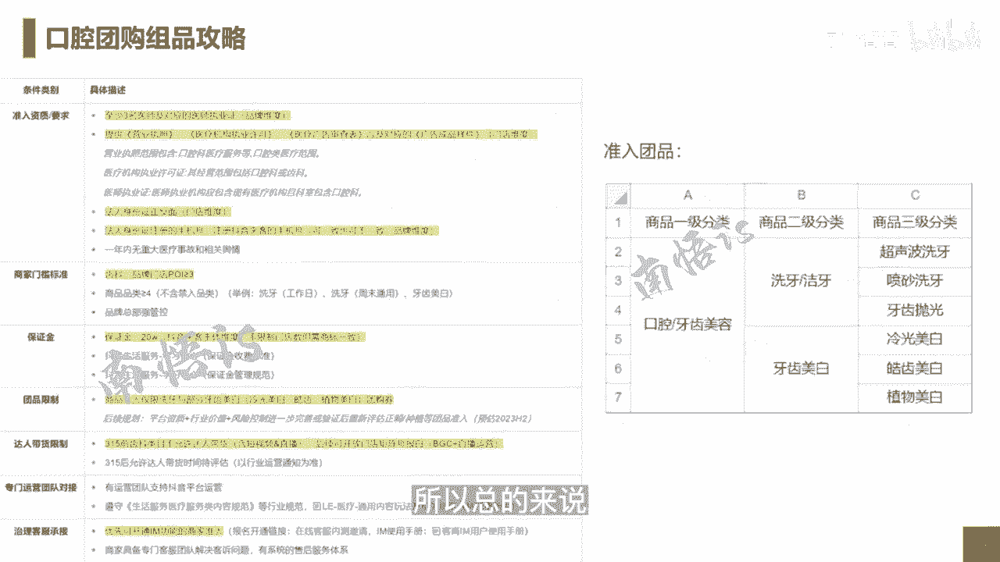

# 083 抖音同城生活-健康垂类0到1运营：入驻-暴力起号-规则篇-消费直播篇！ - P26：26-口腔团购组品攻略 - 早安睿睿 - BV1Fx4y1n7Ba

我们来讲一讲口腔，截止在我做这一期课程的时候，口腔的准入的一个规则明细，或者放开内测范围的一个明细已经出来了，原来其实整个上抖音口腔内测的应该是美澳和，还有其他两家，反正总共是三家。

在昨天以后名额的限制已经放宽了，他的具体的准入资质和要求，就在这个表格里面，他至少要提供三名医生以及对于对应的医生呃，医师执业证就是从品牌维度的，那么要提供你的营业执照，医疗机构许可证。

医疗广告审查表以及对应的广告成品样片，剩下的这个我就不念了，那么需要法人身份证的正反面，法人身份证注册的手机号去注册，抖音来客可一致也可以不一致，这个无所谓，一年之内没有重大的医疗事故或者相关的舆情。

它的一个筛选的门槛标准，就是哪一些店可以去入住齿科品牌门店，POI大于等于三，也就是在你这个品牌下面，其实是需要大于等于三家店的，我去问了一下这个你在不在，你只要大于等于三家店就可以了。

但是你在不在一个城市，其实没有什么太大的关系，你的商品品类大于等于四，这个就不说了，保证金是20万，这个我在那个后面的那保证金一览的列表里面，基本上都会写到，然后你的产品的这个限制。

目前准入的团品可以看右边，它基本上是口腔和牙齿的美容，里面分为两种，一个是洗牙，洁牙会分超声波洗牙，喷砂洗牙，牙齿抛光，第二个是牙齿的美白，包括了冷光美白，皓齿美白和植物美白。

总共可以上的产品就是这么一些，这里有个比较特殊的，就是在3月就315晚会之前，3月15号之前，齿科类目是不允许达人带货的，那也就是说你自己可以去做告白以后的，BGC的一个内容的产生，也可以去做一个直播。

3月15号以后有可能可以让达人去带婚，我觉得按照我的经验大概率肯定是可以的，3月15号以后，因为涉及到这个315晚会嘛，所以各个但凡涉及到广告的，都会比较的谨慎，如果你进入运作以后。

就会有专门的运营团队去支持你，抖音平台的运营，如果开通以后，优先可以开通IM功能的，商家是可以在线进行这个准入的，那么你可以进行一个再一个客服的一个应对，所以总的来说这个就是正常报白以后呢。

