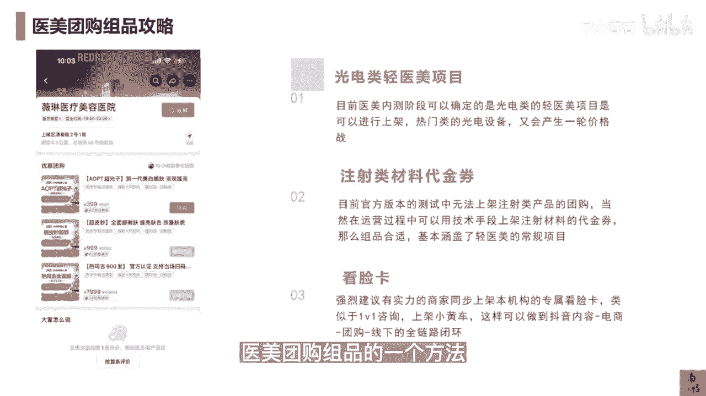

# 083 抖音同城生活-健康垂类0到1运营：入驻-暴力起号-规则篇-消费直播篇！ - P27：27-医美团购组品攻略 - 早安睿睿 - BV1Fx4y1n7Ba

我们很多粉丝都会非常关心的，医美类应该怎么玩儿，现在抖音上进行内测的大概会有威灵艺，星美莱等等几个头部的大的这个品牌，那么这一些品牌，其实我看了内测的数据并不是特别好，这中间可能还是会涉及到。

到底是让店家自己去自播，去自己做这些内容，还是让达人去探店，这个平衡点，我估计一直没有处理好，那一会再讲运营相关的东西吧，我们来讲讲现在抖音官方内测阶段，可以确定的是光电类。

尤其是轻音美类的这些光电类的这些项目，它是可以进行上架的，比如说这个超光子超频秒热玛吉，这些都是可以上架的，那么热门类的这些光电的设备，他一定又会带来一轮价格战，当然打价格战，你要不就是小机构。

你能抗打对吧，去玩那些租设备那一套，如果跟大机构玩价格战，其实还是没什么太大的优势的，当然这里面还是有很多故事可以去讲，那么第二个板块，我们会认为是注射类材料的这个代金券，但是目前官方版本的测试中。

是没有办法去上架这一些注册类的这种产品的，当然如果假设未来开放是哦我们去操作，肯定想办法通过一些规避的手段，因为抖音本地生活，它的审核的逻辑总共就这么一些，是一定要去上这些这个材料类的代金券的。

因为你只有去上了这些代金券，你引过来的才有可能是可以去生单，可以去挖更多需求和预算的，这些高质的这种客户，那么第三个板块就是，我们会认为原来你自己官方的号，你的内容可能更多的是明星看脸分。

或者是更多的是一些光电项目的一个科普，其实本地生活的医美类，我觉得最大的机会点是在于什么，给你开了白名单以后，抖音的审核，医疗审核中间会有一定的权限开放给你，这个时候你这个账号的权重，已经。

你能讲的东西会比正常没报白的号要多一些，那这个时候如果你去讲这些看脸方面的，这些面部美学的分析，你就可以直接在你的短视频，或在你的直播间里面去挂上你的看脸卡，比如说我的短视频里面看联卡。

当然也可以通过这个小雪花去挂，也可以通过小黄车去挂，什么是小雪花，就是抖音知识付费的一个三方的小程序，那么小黄车顾名思义就是进入抖店后台那一套，所以有能力的商家一定要把自己专属。

本机构的专属看联卡给放上去，你可以卖的便宜，但是这个其实就是类似于心理的一个，1V1的一个咨询，你上架了小黄车，这样就可以做到你的抖音的内容，电商团购线下整个全链路的这个闭环，又可以筛选掉那些白嫖的。

通过价格，还甚至可以去筛选那些有一定付费能力的，或者是付费能力更高的用户，这个就看你们自己的店内，机构内怎么去做这件事情，所以我认为这三个维度是医美团购主品。

