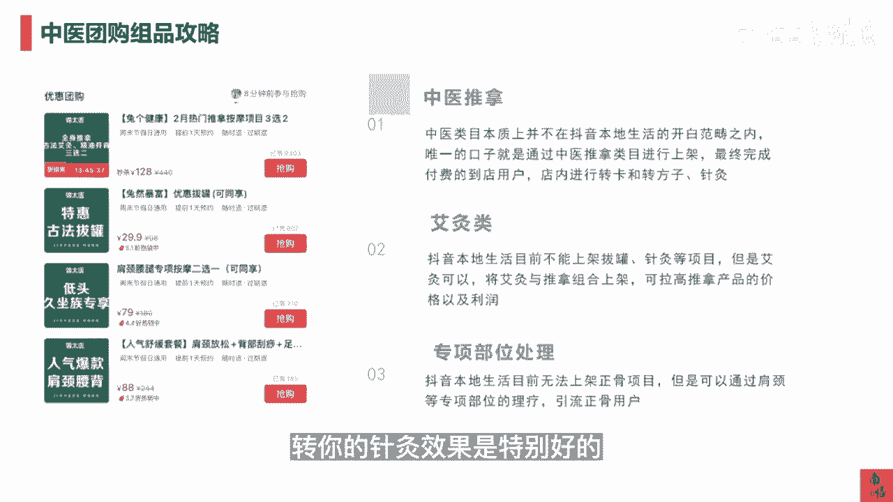

# 083 抖音同城生活-健康垂类0到1运营：入驻-暴力起号-规则篇-消费直播篇！ - P28：28-中医团购组品攻略 - 早安睿睿 - BV1Fx4y1n7Ba

再来看一下中医团购的作品，其实中医这个板块比较特殊，它其实并没有在抖音本地生活消费医疗板块，赛道里面，但是我们现在怎么玩，我在杭州其实已经玩儿的还挺明白了诶，我们通过中医推拿。

就是推拿这个类目去绕开推拿，因为他是报了白以后就可以上架的，我们通过推拿这个类目去进行团购的强行上架，最终完成付费的到店用户，然后你在店里面再去进行转卡或转方子，或者是去打针灸。

因为这个玩法具体怎么强上，我在前面已经讲的很明白了，你可以在你现有中医馆的这个地址附近旁边，或者是那个楼上，你去剖一块分割一块地址出来，然后把这个地址去认领一个做分割是最快的。

因为每个地方的这个政策不一样，去认领一个营业执照回来，然后拿这个营业执照，这营业执照里面包含了推拿，但是不包含诊疗医疗，它就是一个正常的推拿馆的营业执照，然后你就正常去提这个抖音来客对吧。

正常去认领门店，你就可以正常过，所以这就是干货，那么第二类就是艾灸类，艾灸类的话，它其实是可以上架的，抖音本地生活目前不能上架的是拔罐，针灸这种破皮的那种项目，但是艾灸是可以的。

所以艾灸我们根据我们的经验，你可以跟推拿去组合上架，因为推拿的成本是比较高的对吧，因为你的师傅你的一生如果真去按的话，你的时长就是你的这个成本吧，所以你的艾灸的品相跟推拿的品相去互相组合。

它可以推高你整个产品的价格以及利润，然后第三个环节是专项部位的处理，比如说抖音本地生活，目前是没有办法去上架正骨的，但是你可以通过肩颈或膝关节的一些，类似正骨的一些。

当然我不能叫正骨的一些特定部位的理疗，一些爱心券或者是专项券，去把这些用户引到你的店下去，那么这些专项部位有问题的人，他最终肯定不是来理疗的，甚至最终是希望来治疗的，那这个时候转你的正骨。

你的针灸效果是特别好的。

