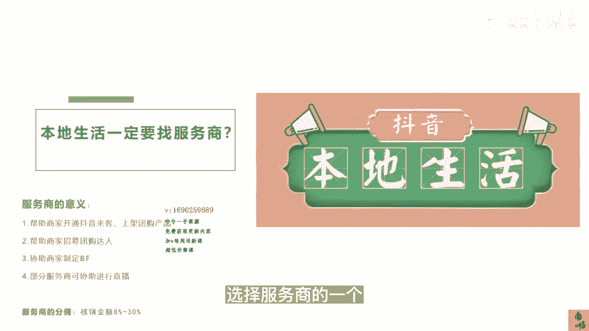
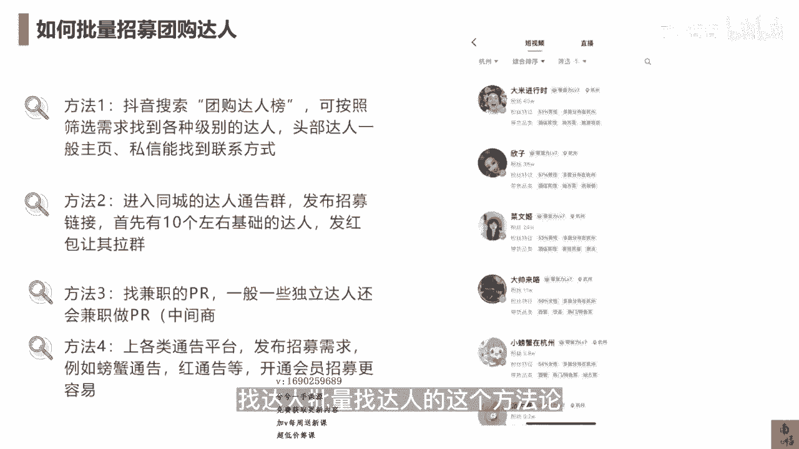

# 083 抖音同城生活-健康垂类0到1运营：入驻-暴力起号-规则篇-消费直播篇！ - P29：29-如何快速批量找到适配达人 - 早安睿睿 - BV1Fx4y1n7Ba

我们做抖音本地生活，如果接触过抖音本地生活的这一一些商家，可能会听过一个词儿，就是每天通过各种各样的方法去找到，你们法人的这些服务商，很多服务商会告诉你，我可以帮你强开。

然后你必须要挂在我的这个服务商的名下，他们可能要分的就是你们的佣金，以及前面可能会有一些招募达人，上面的一些费用，这一些服务商其实都是抖音，去链接你们这些商户的一个，比较重要的一个桥梁。

靠谱的服务商还是比较靠谱的，所以服务商的意义它是什么，它一帮助商家去开通抖音来客上架团购产品，二帮助是商家去招募团购达人，那这里面我们先两条两条来看，第一条帮你去开通抖音来客和上架团购产品。

这其实是很多原来的服务商，他们会认为他们价值很大的一个部分，但是等你们学完我的这个课程以后，其实你们自己就可以去操作进行，你们随便拉出一个人就可以进行去做，因为现在这些抖音的这些产品。

他做的其实已经很傻瓜式的了，所以服务商在这个上面，他如果要去扮演一些角色，甚至要收钱，收一些所谓的这个运营费，那其实是没有意义的，它这个门槛太小了，在过去的2022年。

其实抖音已经大大的放开了服务的这个数量，你只要交10万块钱，就可以成为抖音本地生活的服务商，所以服务商在原来它其实更像一个中介，中间渠道的一个这么作用，就是去对接商家和达人，那第三点呢。

他们可以去协助商家制定一定的，那个就是brief，就是你的哪几个核心的要点，是需要达人去表达的，然后第四点就是部分的商家可以协助，你们进行一个直播，然后第三点和第四点，其实我认为什么样的。

本质上这些服务商他其实没有太大存在的价值，我一会儿会给各位老板们讲到，你们怎么自己去批量找到这些达人，就是不需要中间商赚差价，因为他们的一个分佣还是比较高的，八个点到30个点，如果你是相关的。

比如说审美类的或者是口腔类的品，可能要到8~50个点都有可能，那么它们的作用其实在这些维度来讲，其实比较弱，所有招募达人你们其实都可以去做，无非有两个点，它们的作用如果是靠谱的服务商，其实是有意义的。

一就是在达人的选择上面是，首先我们知道达人虽然到你们家来探店，或者给你们去发布这些视频，但不是每个达人的流量都是一样的，有的达人好，有的达人差，所以服务商的价值就在于帮你们去筛选，这些达人的。

哪些达人是靠谱的，所以你们跟他们去玩的时候，一定要去关注他们的GMV的一个值，如果一个服务商从头到尾不跟你提这个GMV，只跟你提你要投多少的，这个达人，我跑跑看再说，那这样的服务商基本上不是特别靠得住。

第二个点呢，就是说他能不能给你们这一些医疗相关的内容，去做好brief，或者是做好达人内容的审核，以及去协助你们自己做作品，或者自己做短视频和直播的时候，这一些医疗内容的一个审核，按照我的感觉。

就是现在大部分的本地生活的服务商，是不具备这个能力的，因为本地生活的服务商，基本上是从大众点评或美团出来的，他们从本质上来讲根本没有玩过抖音的账号，也没玩过抖音的流量，他们原来的模式就是收了商家的钱。

然后让达人去做这个探店，就仅此而已，而今年因为从去年10月份以后，抖音要求这些服务商必须要具备直播的能力，所以他们才倒逼自己去做直播，但是医疗的直播可跟一般的餐饮直播不一样。

所以我相信第一波上的这些服务商，选择靠谱的很重要，如果选不到靠谱，那你还不如自个儿来玩，我的这个课程里面所有的这些方法，服务商会的这些东西我都已经教了，所以这个就是你们要不要选择服务商的。

一个评判的一个标准。

好我来给大家讲一讲，那么如果你没有选择服务商，你需要批量的去找达人，招募达人有什么样比较简单的方法，我把所有服务商找达人的这个方法，因为不可能每个服务商养着这么多达人，这个现在其实几乎没有这样的服务商。

基本上都是招募的，也就是说达人本来就是在公益上的，那你们自己的员工，你们自己的人怎么去省去这笔服务商的费用，我来教你们，第一个方法，你去抖音上搜索团购达人榜，可以按照筛选的需要去找各级别的达人。

比如说我按照级别进行排名，我按照近期的销量进行排名，然后你去私信或者是一般头部的达人，在主页上都会留下这个微信，你们就可以去找到他们，一般你你们去私信，你，只要说你是品牌方，你有预算。

一般会有博主或者是助理，会把你们对接到微信的，方法二，就是进入同城的达人通告群去发布招募链接，首先当然你可以先用我的方法一，找个十个左右的基础达人，来进行你的店里进行探店。

那么探店的时候你就可以留下他们的微信，留下微信以后给他们发个红包，比如说发个十块20块的红包，或者是送他们点什么样的礼物，让他们把你们的某个微信号拉到达人的群里面，这个时候你再进达人群里面。

你去发这个链接，发这个红包，去裂变出来更多的这个达人，这个方法是特别快的，那第三个方法就是找兼职的pr，什么叫pr，就是你可以理解为呃中介，就是叫达人中介，你可以理解为就是一个中介的。

一个经纪人一样的角色，那么一般这一些人呢，他每天在干的事就是找达人找项目，如果你实在懒得做方法一和方法二，那你可以直接找这些兼职的pr，还省去了你自己养着他们的这个成本，那么方法四。

就是你可以上各类的通告平台，去发布你的这个需求，比如说螃蟹通告红通告，那么你去这样的这个平台上去发布，招募信息的时候，你甚至可以在那个平台上充点钱去加热一下，那你的通告就会优先置顶。

那么在这个时候你去发布，我有多少的车马费，我有多少的置换的这个商品信息，基本上就可以照到呃，你这个城市里所有的达人，那这几个方法是目前所有的服务商都在做的，找达人，批量找达人的这个方法论。

