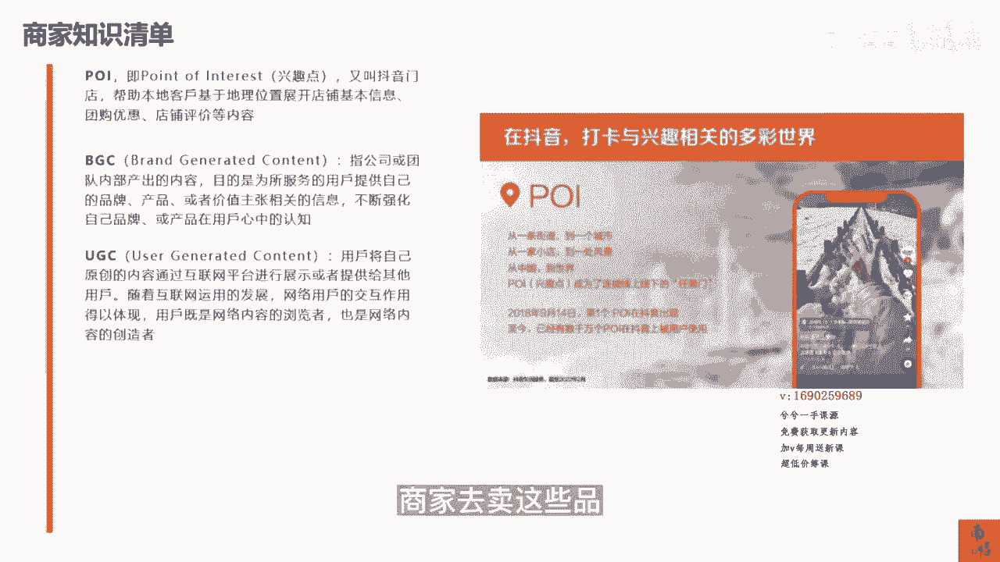
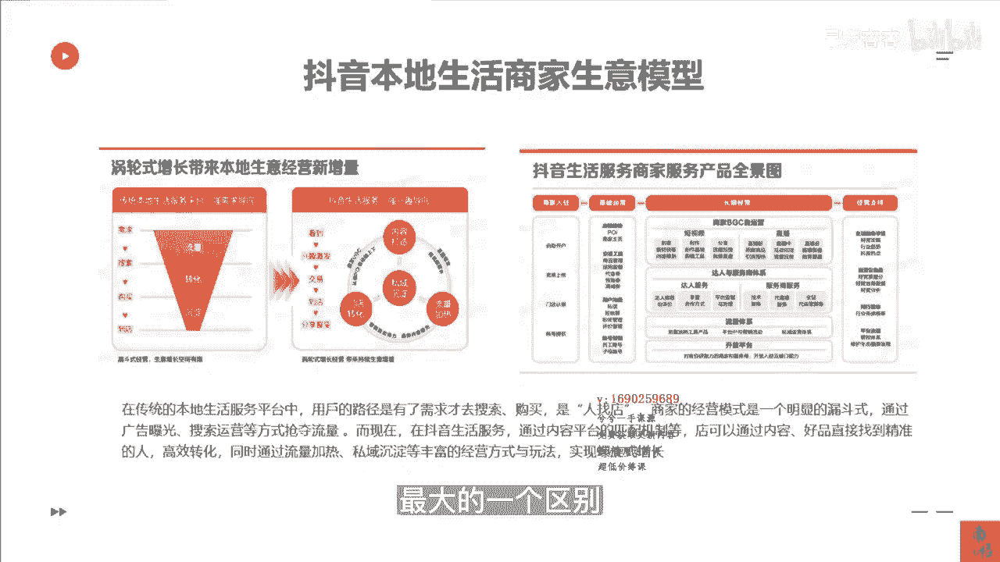

# 083 抖音同城生活-健康垂类0到1运营：入驻-暴力起号-规则篇-消费直播篇！ - P2：02-商家必备知识清单 - 早安睿睿 - BV1Fx4y1n7Ba

那我们再来看一看，如果今天你从来没有做过抖音的本地生活，尤其是我们医疗的这些商家，原来肯定可能都没有系统性的玩过，这个抖音的这些打法，那OK你必须要学会的一些基础的一个知识清单，我在这里给大家讲一讲。

因为如果你不具备这些知识清单，你后面再去听课的时候，或者后面你再自己上手去做本地生活的时候，你会一脸懵逼好吧，然后第一个点就是poi对吧，POI及兴趣点，我们又叫做抖音门店。

也就是说你们再去做一些短视频，看到对方挂的这个链接的时候，他点进这个链接里面，原来只是一个地址，但是你点进那个地址以后，你可以看到他的门店那个东西就叫POI，所以很多服务商在告诉你。

哎你的POI没有没有成功或者是成功了，这个就是他的这个底层逻辑，他是在帮助本地客户，基于地理位置去展现你自己的这个店铺的信息，团购的优惠，店铺的评价等等，也就是说，他把美团的这一些所有的这些店铺的信息。

融入到了一个地理位置上，而它的地理位置，现在采取的这个信息是基于高德地图，当然现在目前也基于很多其他的这些地图，所以这个就是POI，你POI的热度决定了你这家店，你这个团购啊，不能说完全决定吧。

至少是能贡献30%的影响因因子，所以那一些地理位置本身就很热门，人流量比本身就很大的，对于这些商家来讲，它的机会会更大啊，那么第二个板块叫BGC，什么是BGC是指公司或团队内部产生的内容。

目的是为了去服务用户，提供自己的品牌，产品或者价值上的主张的一些相关的信息，这个是什么呢，B g c，其实指的就是你们作为商家自己去产的内容，那么在美团时代的时候并没有这些内容，在美团时代的时候。

你商家展示的更多的是图片，你的门店，你的团购的信息，但是在抖音上你是需要内容的对吧，你如果是一家口腔的机构，你怎么去产生这个BGC就是你的店，你怎么去给大家去讲洗牙的重要性对吧。

怎么去讲我这个品牌的历史等等等等，这个就叫做BGCUGC这个大家应该听过，就是用户产生的内容，用户将自己原创的内容通过互联网，像抖音这样的平台进行展示，或者提供给其他的用户，这个就是UGC。

而抖音大部分的内容还是UGC在产生，那么我们串联起来，我们刚才讲到了，在2022年，给抖音的本地生活贡献最大值的就是团购达人，而这些团购达人其实就是UGC，就是在我本地的一些用户对吧。

或者是本地一些达人，他们去自发的去做这些内容，并且获得流量，并且能帮助到商家去卖这些品。

并且他们能分得一定的佣金，pg c什么叫pg c，就是专业产生内容，PGC的创作的本质是具备专业知识，拥有内容相关领域的资质，具有一定的权威的专家，抖音生活服务达人产生的内容。

属于PGC内容的这个创造者，这里面的区别是在于什么，PGC就是你的用户，而你的用户就是这些达人来，如果他是你的用户，他属于UUGC，如果他就是一个独立的博主，比如说一些专门去探一些景区的。

一些独立的博主，那他就属于这个PGC，或者是你们家这个医院里面有一个医生，他的黄V他就属于pg c，所以UGC和PGC，它其实并不是完全完全区分开来的，我们要明白这里面的这个核心逻辑啊。

GMVGMV这个就不需要去过多的解释了，他就是我们常说的这个成交总额，你可以简单理解为成交额吧，所以我们经常说哎，这这个月给你们家的GMB做到了100万，那这里对应的有一个词叫核销，核销金额。

就是我今这个月在你们的口腔机构里面，给你们做了100万的GNB，但是核销了60万，他的这个实际的核销率就是60%，而核销的金额才是到你们兜里的钱，那么对于刚进入抖音本地生活这个赛道的时候。

我们其实作为商家，我们要去明白抖音本地生活，它的整个生意模型，究竟跟原来的美团或者是大众点评，有怎么样的一个区别，在传统的本地生活的服务过程中，服务平台上用户的路径是有了需求才去搜索，才去购买。

去人找店，比如说我今天要去洗牙，我的需求已经很明确了，对不对，那么我要去哪家洗牙店啊，或者哪家口腔医院，那么我就会去美团上去搜索，这个时候排在越前面的，或者是离我越近的环境越好的，这就是我的一个决策点。

那这是很明显的是一个漏斗型的一个模型，但是抖音平台，它号称的是一个涡轮式增长的模型，什么叫涡轮式增长其实也很简单，我用大白话跟大家讲，就是你原来是满足了用户人找的一个行为，现在呢你可以通过你自己的内容。

你的内容里面其实是可以去贩卖焦虑的，我举一个简单的例子，比如说我的口腔机构，我今天去发了一条视频，讲的是你多久没有洗牙了，没有洗牙，它的长期的危害是得得得得对吧，是123，那么有这样的一个焦虑以后。

当用户刷到这条视频了，他本来并没有大家听明白吗，他本来并没有在此刻有洗牙的这个冲动，但是通过你这个视频焦虑的这个贩卖，我甚至有可能因为这条视频，燃起了我想洗牙的一个需求，那这个和原来在美团。

在大众点评体系里面叫做我已经有强烈的需求，我再去找店是有本质的一个区别的，那当通过我自己商家，比如说我们刚才讲过商家自己的内容，叫什么叫BGC对吧，或者是我们达人达人的内容，有的叫那个PGC。

有的叫UGC，要通过达人这些内容，我不停的去发布这一个痛点，发布这一个需求点，它会刺激更多的需真实需求的一个产生，也就是说它的底层是通过，就像我们所谓的这个发动机一样的。

我们有源源不断的内容去刺激这些用户，产生当下的一个需求点，然后通过我们的内容，让用户在我们这个视频下面的，POI下面的这个团购链接，产生了一个下单的一个行为，所以我的内容越好。

我对于用户的吸引以及刺激就越高，这个时候还有一个最核心的点，我还可以给我这一些素材，视频去做一定的推流投放，这个时候就是一个可控了，所以在这个过程中，我们获得了确定的流量，确定的用户。

确定把用户需求勾出来的一个行为，还可以通过可复制，可控制的一个投流的机制给我这一些素材，给我这些内容去作为一个流量加热，所以这就是抖音生意的一个，最核心的一个点之一，而第二个核心点，我们去做美团的时候。

是不是对方钱投的越狠，或者是他原来的基础运营的越好，他的数据体量越庞大，它就会截留很多啊，几乎头部的这个商家能截留大部分的生意，这和原来淘宝的时候他的二八原则是一样的，就是你头部的商家。

你的生意一定是碾压底层的商家的，但是在抖音，他给了所有商家一个平等的，一个匹配的一个机会，或者他的整个机制里面，他要的是公平，谁的内容做得好，谁就有权利或者有可能获得更多的流量。

这跟你原来店铺运营的历史没什么太大的关系，就是你当下的内容做得好，平台就愿意给你更多的流量，所以这就给了很多底层的，或者原来并不擅长玩儿互联网的这些商家，更多的机会，唉我只要把内容做得足够的好。

我只要把我的品相组组织的足够的好，我只要根据我不同的素材，去做了一定的流量的一个匹配，我就可以获得我该有的这个精准的人群对吧，所以我的转化，我的沉淀其实都是系于我的内容的产出，所以在这个过程中。

我们获得的这样的一个公平的方法，公平的一个竞争的一个机制，这也是抖音区别于传统本地生活服务商。

