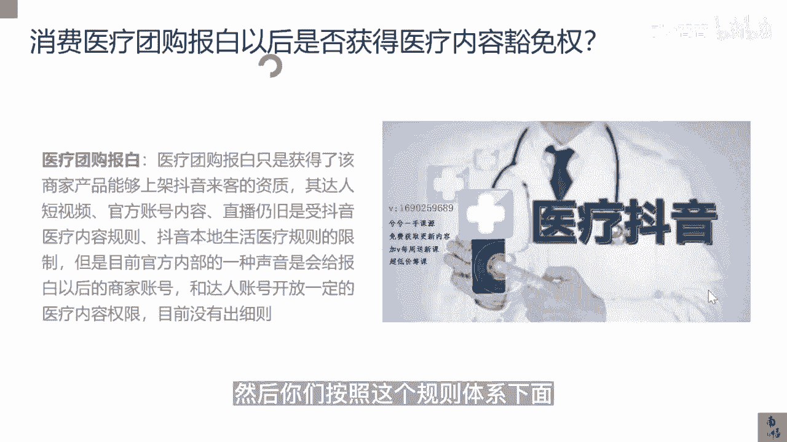

# 083 抖音同城生活-健康垂类0到1运营：入驻-暴力起号-规则篇-消费直播篇！ - P30：30-消费医疗团购报白以后是否获得医疗内容豁免权？ - 早安睿睿 - BV1Fx4y1n7Ba

这1part的内容我们主要来讲一讲抖音本地生活，目前对于医疗范畴以及医疗规则的一个，全面的解读，那么我相信你学完这一篇章以后，你会对无论是抖音内容，抖音本地生活，抖音电商，抖音直播间等等。

对于医疗这个板块，它有哪一些规则的限制，我会通过这个课程给大家去讲的明明白白，这个课程我相信也是很多做医疗这个赛道的。

企业老板比较关心的一个核心篇章，好，首先我们来看一下抖音本地生活，医疗服务类的一个定义，首先医疗服务类的内容定义是指，在抖音本地生活的类目下，创作者推广内容涉及到医疗机构提供的服务。

包括但不限于健康疗养类，眼科口腔，妇科，孕后服务，医美等，这个是整个抖音，就是本地生活服务类的一个定义，你只要落在这几个选项里面，你都会被判定为，你是在做抖音本地生活的医疗类，那么整个医疗规则的范围。

对于短视频，直播间涉及到团购的商品内容的脚本，宣传用语都必须遵循抖音医疗内容审核的规则，包括但不限于商家的内容，达人的内容，那这一点其实也在告诉我们，无论你是否有开那个白名单。

白名单这个东西我一会会讲到，你只要涉及到你的团购，只要涉及到了以上医疗服务的这个定义的类型，你就必须遵循抖音医疗内容审核的规则，所以这就是我们目前很多商家，想去拥抱抖音本地生活。

但是碰到了123的这些问题的一个核心点，那么你的消费医疗团购如果正常报白以后，你是否就获得了抖音医疗内容的豁免权，这句话怎么解释，就是如果你自己的店铺，你自己的品牌，受到了抖音本地生活医疗的一个邀请。

入住以后，你的账号是不是什么医疗都能讲，这个话题其实是所有老板比较关心的，而且我觉得也是未来去区分不同医疗服务商，或者本地生活服务商最大的一个区分点，同样的服务商，我们刚才提过，同样的服务商。

你去找达人，你去做直播都没有问题，谁能把抖音医疗的规则吃的透，谁就能在这个赛道里面跑出不一样的结果，那么OK我们来看一下抖音医疗团购报白，只是获得了该商家的产品，能够上架抖音来客的资质，其达人的短视频。

官方账号的内容直播仍旧是受到抖音医疗，内容规则以及抖音本地生活医疗规则的限制，这里面我们要去理解一个核心的点，抖音的医疗规则到底在限制什么东西，这个我在后面讲抖音医疗规则的时候会讲到。

为什么你们现在的号去讲医美，去讲口腔会被限流，甚至发不出去，因为你们没有医疗的豁免权，而现在具备医疗豁免权的，我在我另外一个课程，专门讲黄V账号的这个课程里面其实有讲过。

你必须要获得相应资质的黄V或者蓝V，那这里面就有一个平衡点，我都已经爆白了，你不让我讲医疗，我这个屏怎么卖，我的达人怎么帮我去卖好这个点，我相信是一个非常核心的点，但是我可以告诉你们。

目前抖音官方内部有一种声音，他们自己也在纠结，有一种声音是说，会给报白以后的商家账号和达人，开放一定的医疗内容的权限，但是没有出细则，因为抖音为什么对民营的医疗，他限制的这么严重，是因为他怕出舆情好。

你现在虽然上了口腔这个类目，但完全给你医疗内容的豁免权，那等于是我上了这个口腔的内容以后，我可以讲很多很多治疗相关的东西，很显然这是抖音不希望看到的，所以我相信会对他内容容，会进行一定的全新的开放。

不至于完全不放，完全不放，这个事也没法做，那么又会对这些账号进行一个细则的一个规避，根据我自己做医疗抖音那么多年的经验，这个细则是一定会出，但是什么时候出，出到什么样的程度。

我相信我这边是会给到大家一个最新，最快的一个消息的一个同步，但是我目前还没有收到这样的同步，当然我觉得设置的障碍，设置的问题点一定也是我们存在的意义，一定也是机会点，谁能最先搞明白这中间的底层逻辑。

那我觉得谁就能拿到这个先手权对吧，比如说我们现在去做这一些，我们怎么去规避它，我们其实也能讲口腔相关的，但是我的我们团队的这个内容规避的能力，其实已经可以达到比较够用的地方，但是随着细则的出现。

随着那么多正经报白以后的这种账号的出现，抖音内部医疗审核规则的团队，电商审核规则的团队，本地生活审核规则的团队，甚至于流量本地推推广这个广告审核的团队，他们一定会出一版本的这个细则出来。

所以我们拭目以待，等待这个细则的出现，如果你们的账号有幸过审了，那就是不停的去测试，一会，我会把既有的这些医疗规则都给你们，讲的明明白白，然后你们按照这个规则体系下面。

