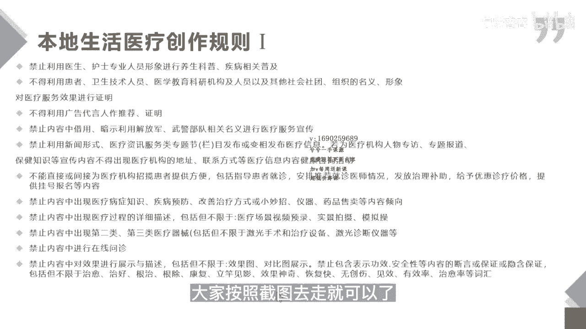
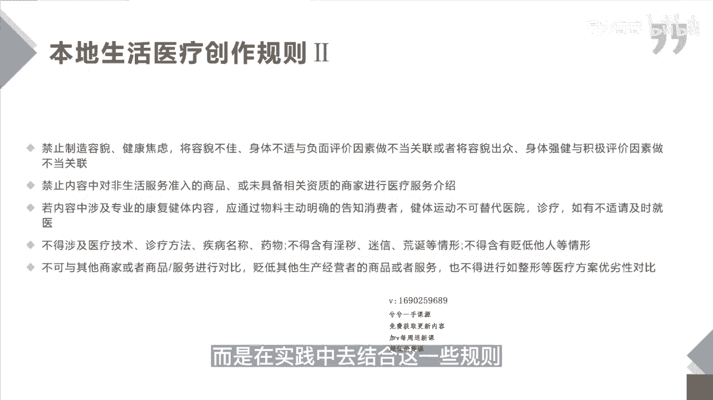
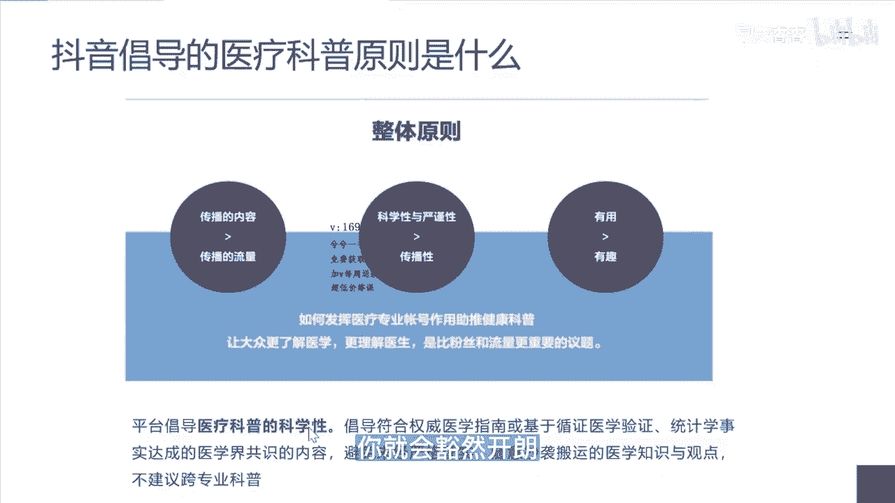

# 083 抖音同城生活-健康垂类0到1运营：入驻-暴力起号-规则篇-消费直播篇！ - P31：31-费医疗本地生活审核规则及如何避开 - 早安睿睿 - BV1Fx4y1n7Ba

好那我们开始讲抖音医疗的规则，以及本地生活医疗规则，到底是怎么样的一个规定，首先我们第一点来看一看抖音本地生活，医疗创作的一个规则，你们具体的可以去截图，我们这边讲几个比较重要的一进。

只用医生护士专业人员的形象进行科普，疾病以及与相关的这个普及，也就是说你们无论是医美的口腔的，你们不能用你们自己的医生或者是护士，这样的人设去进行医疗的科普，这也是我刚才在解释。

这个医疗内容豁免权的一个核心的原理，这个是大家需要去规避，你可以去卖这个产品，但是你不能去做一个科普，甚至一个导整一个问诊的一个逻辑，禁止内容中出现医疗病症的知识，疾病的预防改善，治疗或者小妙招。

仪器药品售卖等内容的倾向，那这个也是比较重要的，就是你不能去倡导一个，比如说你这个洁牙，你洁牙你就好好卖你的洁牙的，但是你不能去说唉你要是不好好挤压，你就有可能会得一个什么什么样的这个问题。

然后最终变成一个哎，你用我的这个牙膏或者怎么样的，去贩卖一个功能性的一个东西，所以抖音进的并不是你某一个词，而是你在直播间里面的一些行为，剩下的这一页内容大家按照截图去走就可以了。

这是本地生活医疗创做规则的第二部分，那这一部分里面我们有两点要特别讲一下，第一点就是我们需要禁止去制造容貌焦虑，健康焦虑，容貌不佳，身体不适与负面评价因素作为不当的关联，或将容貌出众。

身体强健与积极评价作为不当的关联，我们做内容，我们都知道，当你去发那些用户的痛点，用户的焦虑点，尤其是我们做医美相关的呃，我知道你们去发这样的内容，对你们的流量是有帮助的，但是在本地生活中。

虽然你报了白名单，但是你如果还是去发那些丑和好看的对比图，你是没有这个权限的，你的账号依然会受到一个封禁或者限流的处理，所以这一点作为医美机构或者是口腔，你去做正畸这些项目的时候，你你你是需要去注意的。

第二点我需要去讲的就是你在你的内容中，如果有涉及到康复健体的内容，就是这个专业部分的内容，你需要明确的告知消费者，健体运动不可以代替医院诊疗，有不适者拯救于这样的字眼，那这个呢其实在我们比如说运动康复。

或者是一些产后康复的这些板块，会涉及到这个也是比较重要的，因为很多的这些康复类的，或者是一些产后修复类的，他认为我并没有露出一些血腥的，或者是一些对比图，但是你已经误导他，可以去做一些康复类的代替诊疗。

那这个也是不行的，所以这两点是需要大家去注意的，那么最后一点可以去关心一下，就是你不要去和其他商家或者商品进行对比，贬低别人，去拉高自己，尤其是整形等医疗方案，你去对比你们家好，别人家不行。

这个也是比较隐形的一个规则之一，所以这些规则如果我们要系统性的去做，我们的本地生活，我希望大家去把这个规则去研究透彻，都不是看几遍，而是在实践中去结合这一些规则。

那么我们会认为刚才我们讲的是抖音本地生活，医疗的一个规则，那么我们即便报了白的这些账号，或者是这一些，除了企业的这种官方账号和达人的这种账号，他们的内容还需要去遵循一个什么样的规则。

这就是抖音医疗科普内容的规则，抖音医疗科普的整体原则是什么样的呢，就是去发挥医疗专业账号，去助推健康科普，而这些医疗账号我在另外一个课程里都讲过，就是那一些具备医疗豁免权的黄V或者蓝V。

但是是不是意味着我没有黄V或蓝V，我报了白以后，我就可以去讲医疗科普，其实不是，我们要理解抖音医疗科普的规则和本地生活，医疗本地生活的这个规则的区别其实很简单，本地生活只给了你去讲解你这几个品相。

或者是抖音规定的这几个品相的权限，他并没有给你去做科普的权限，这句话是非常重要的，这句话其实贯穿了我们整个抖音医疗，或者是抖音本地生活，医疗这个板块审核的真正的核心，什么是医疗科普。

就是说你因为这个情况，因为这个疾病听从我的建议，我给你分析这是什么原因，听从我的建议，你去做相关的诊疗的引导，并且我告诉你怎么办，这个叫医疗科普，所有报过白的本地生活医疗的这一些账号。

是不具备医疗科普的权限的，你们具备的只有商品，就这个商品，比如说你去卖洁牙，卖M兔兔，那你能讲的就是洁牙和m two兔，相关的上下的一些内容的权限，但是如果你拿你这个账号去将整形，不好意思，抖音不允许。

所以这就是它的底层逻辑，听明白没，而对于平台，它给那些黄V也好，蓝V也好，他给他的一个范畴是可以，你通过权威的医学指南，或者基于循证医学验证，统计学事实达成的医学界共识的内容。

然后去进行一个医疗专业的科普，而对我们这一些商家类的账号，你可以去做健康的科普，你可以去讲经常不洗牙会有什么样的危害，这个是没有关系，但是你不可以说你地包天了，或者是你需要去做正畸，你需要去做种牙。

因为这个是抖音在他的项目范围内没有给你的，虽然我前面说到细则没有出来，但是从我们从事抖音医疗流量这么多年的经验，这个逻辑一定是不会错的，所以大家好好去想一想，我刚才讲的这些点，这个才是真正的核心。

当你明白这个核心以后，你未来去做内容，或者去找达人去带你们的产品，你就会豁然开朗。

那接下来两页PPT是讲是抖音健康，垂类内容审核的细则，那这个细则其实是针对于，你有具备医疗豁免权的黄V和蓝V的，但是为什么会放在这里让大家去看，是因为这些事抖音，让这些具备医疗豁免权的黄V蓝V能讲的。

那么哪一些东西你反过来推不能讲，你可以去规避人家能讲的，你大概率是不能讲的对吧，你可以去贩卖一定的焦虑，但是你不要去承诺人家治疗性的东西，所以这两张PPT你们可以截图下来，也可以好好去学一下。

