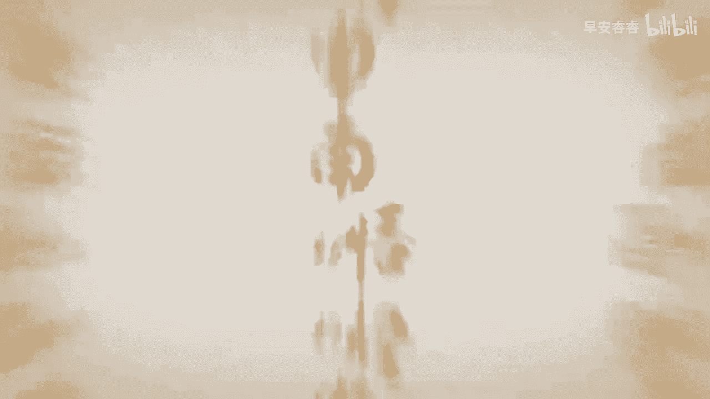

# 083 抖音同城生活-健康垂类0到1运营：入驻-暴力起号-规则篇-消费直播篇！ - P32：32-消费医疗本地生活各类目保证金明细 - 早安睿睿 - BV1Fx4y1n7Ba

好，我们接下来看一下目前抖音官方披露的，本地生活医疗类商家的保证金一览，我们可以看到我前面已经讲到，现在已经出来的明确的口腔类是20万，那基本上都是20万，就是康复疗养类的只要3万块钱，然后医疗美容类。

轻医美的基本上光电和植发都是20万，兽形塑身和脱毛大概是1万块钱，也就是说你的涉及的医疗越重，他的保证金就越高，保证金是可以退的，保证金在你闭店的时候是可以退的，但是对于很多小的商家。

其实这20万还是比较呃呃大的一个数字，所以很多小商家愿意去选择强开，我也能理解，因为那个不需要保证金嘛，但是我们既然在抖音的平台上，其实还是想好好去做。

